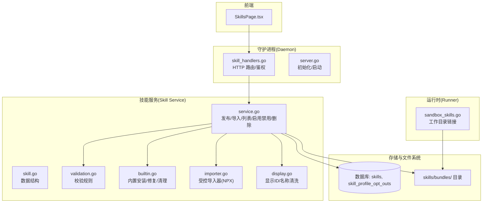
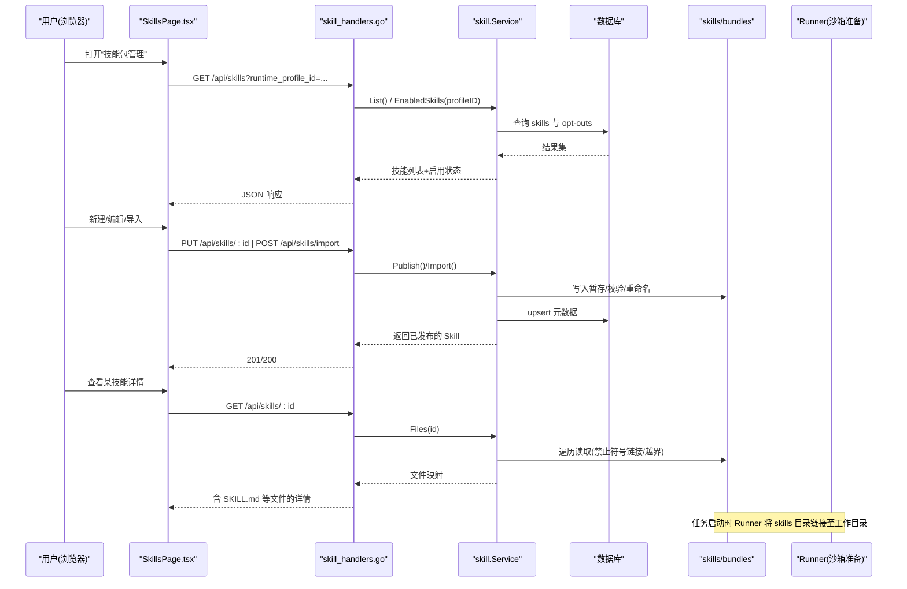
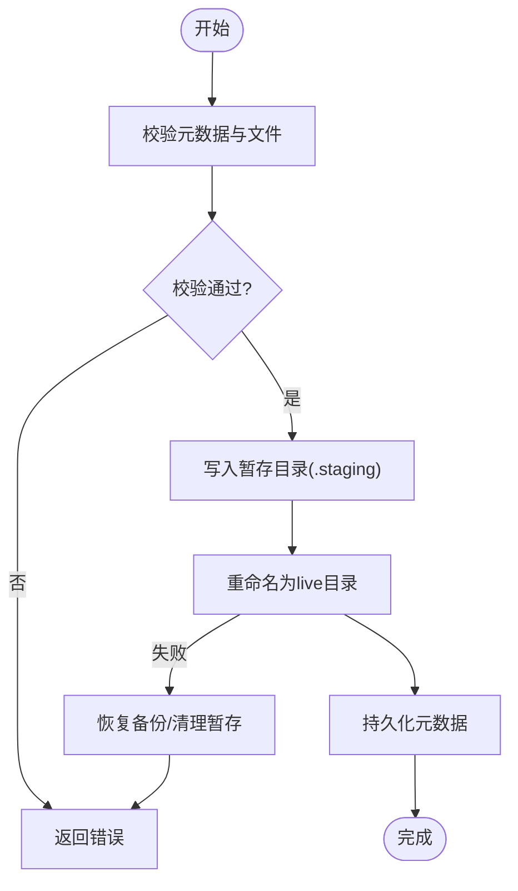
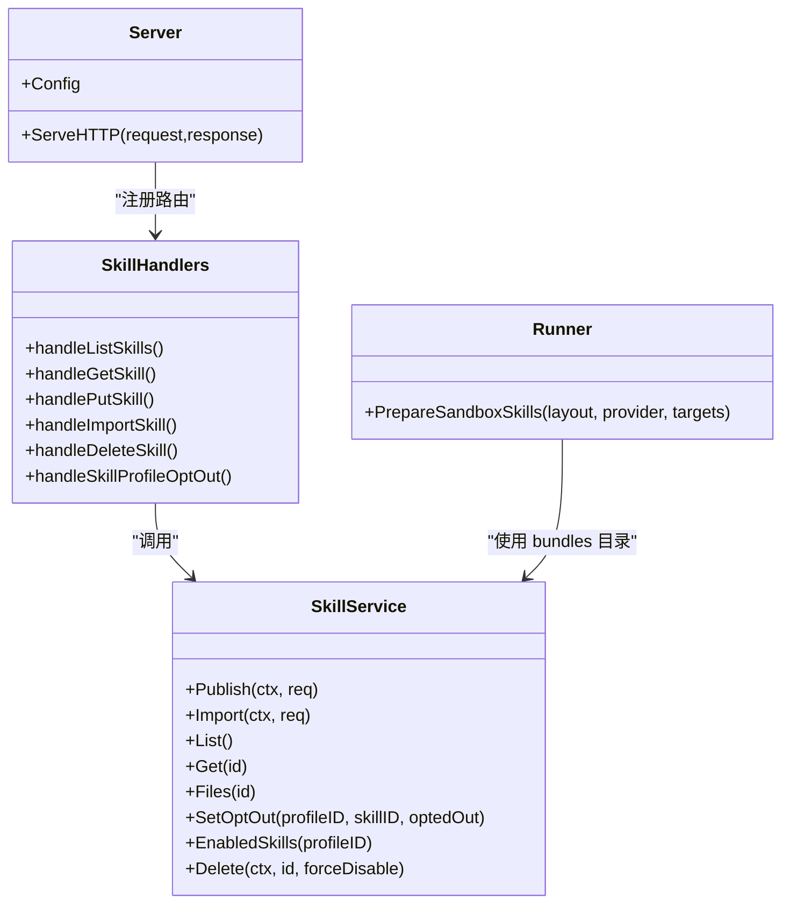
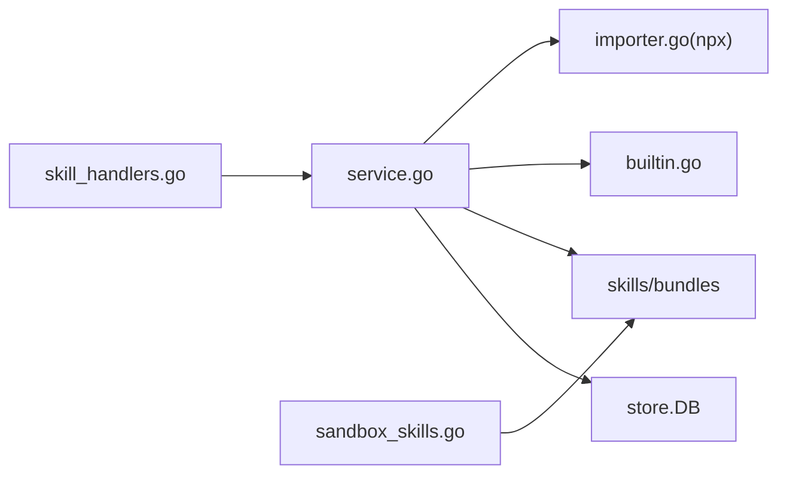

# 技能包管理

<cite>
**本文引用的文件**   
- [internal/skill/service.go](file://internal/skill/service.go)
- [internal/skill/skill.go](file://internal/skill/skill.go)
- [internal/skill/builtin.go](file://internal/skill/builtin.go)
- [internal/skill/validation.go](file://internal/skill/validation.go)
- [internal/skill/display.go](file://internal/skill/display.go)
- [internal/skill/importer.go](file://internal/skill/importer.go)
- [internal/daemon/skill_handlers.go](file://internal/daemon/skill_handlers.go)
- [internal/daemon/server.go](file://internal/daemon/server.go)
- [internal/runner/sandbox_skills.go](file://internal/runner/sandbox_skills.go)
- [web/src/pages/SkillsPage.tsx](file://web/src/pages/SkillsPage.tsx)
- [internal/skill/builtins/assets/tooling-nmap/SKILL.md](file://internal/skill/builtins/assets/tooling-nmap/SKILL.md)
- [internal/skill/builtins/assets/vulnerabilities-sql-injection/SKILL.md](file://internal/skill/builtins/assets/vulnerabilities-sql-injection/SKILL.md)
- [internal/skill/builtins/assets/frameworks-nextjs/SKILL.md](file://internal/skill/builtins/assets/frameworks-nextjs/SKILL.md)
</cite>

## 目录
1. [简介](#简介)
2. [项目结构](#项目结构)
3. [核心组件](#核心组件)
4. [架构总览](#架构总览)
5. [详细组件分析](#详细组件分析)
6. [依赖关系分析](#依赖关系分析)
7. [性能与一致性](#性能与一致性)
8. [故障排查指南](#故障排查指南)
9. [结论](#结论)
10. [附录](#附录)

## 简介
本文件面向“技能包管理”功能，系统性说明技能包的目录结构、元数据定义、依赖与来源追踪、内置与自定义技能包的生命周期（浏览、搜索、过滤、上传、安装、版本化）、预览（SKILL.md 渲染与高亮）、冲突检测与兼容性验证、回滚机制，以及与运行时执行环境的集成方式和权限控制。文档同时提供代码级架构图与时序图，帮助读者快速定位实现位置并理解端到端流程。

## 项目结构
技能包管理涉及后端服务层、HTTP 接口、前端页面以及运行时挂载：
- 后端领域与服务：internal/skill/*
- HTTP 路由与鉴权：internal/daemon/*
- 运行时集成：internal/runner/*
- 前端界面：web/src/pages/SkillsPage.tsx
- 内置资源：internal/skill/builtins/assets/**/SKILL.md

图表来源
- [internal/daemon/skill_handlers.go:1-221](file://internal/daemon/skill_handlers.go#L1-L221)
- [internal/daemon/server.go:120-248](file://internal/daemon/server.go#L120-L248)
- [internal/skill/service.go:1-458](file://internal/skill/service.go#L1-L458)
- [internal/skill/builtin.go:1-360](file://internal/skill/builtin.go#L1-L360)
- [internal/skill/validation.go:1-79](file://internal/skill/validation.go#L1-L79)
- [internal/skill/importer.go:1-46](file://internal/skill/importer.go#L1-L46)
- [internal/runner/sandbox_skills.go:1-93](file://internal/runner/sandbox_skills.go#L1-L93)

章节来源
- [internal/daemon/server.go:120-248](file://internal/daemon/server.go#L120-L248)
- [internal/daemon/skill_handlers.go:1-221](file://internal/daemon/skill_handlers.go#L1-L221)
- [internal/skill/service.go:1-458](file://internal/skill/service.go#L1-L458)
- [internal/skill/builtin.go:1-360](file://internal/skill/builtin.go#L1-L360)
- [internal/skill/validation.go:1-79](file://internal/skill/validation.go#L1-L79)
- [internal/skill/importer.go:1-46](file://internal/skill/importer.go#L1-L46)
- [internal/runner/sandbox_skills.go:1-93](file://internal/runner/sandbox_skills.go#L1-L93)
- [web/src/pages/SkillsPage.tsx:1-759](file://web/src/pages/SkillsPage.tsx#L1-L759)

## 核心组件
- 数据结构与元数据
  - 元数据包含 ID、名称、描述、来源可追溯信息（kind/package/ref/source_url/last_imported_at/local_modified）。
  - Skill 实体附加创建/更新时间与 Bundle 路径；Bundle 用于向运行期暴露的轻量视图。
- 服务层能力
  - 发布（Publish）：原子写入暂存目录 -> 校验 -> 重命名为 live -> 持久化元数据 -> 可选回滚。
  - 导入（Import）：通过受控 Importer（默认 NPXImporter）拉取结构化包/引用，再调用 Publish。
  - 列表/详情/文件读取：支持按 profile 查询启用状态；只读安全扫描（禁止符号链接、路径穿越）。
  - 启用/禁用（Opt-out）：基于 runtime_profile_id 记录 opt-out 表项。
  - 删除：若仍被启用则拒绝（除非 force_disable），事务性清理 opt-out 与元数据，并移除 bundle 目录。
- 内置技能包
  - 启动时扫描嵌入资源，迁移旧 ID、清理退役 ID、修复缺失 bundle、清洗来源字段。
- 校验与安全
  - ID 正则、必填字段、bundle 根目录、必须存在 SKILL.md、禁止符号链接、相对路径白名单。
- 显示层
  - 对内置来源进行前缀剥离，使展示更友好。
- 运行时集成
  - 将 skills 目录以符号链接方式注入到不同 Provider 的工作目录与 home 目录，供 Agent 发现。

章节来源
- [internal/skill/skill.go:1-47](file://internal/skill/skill.go#L1-L47)
- [internal/skill/service.go:57-113](file://internal/skill/service.go#L57-L113)
- [internal/skill/service.go:115-142](file://internal/skill/service.go#L115-L142)
- [internal/skill/service.go:144-216](file://internal/skill/service.go#L144-L216)
- [internal/skill/service.go:218-282](file://internal/skill/service.go#L218-L282)
- [internal/skill/service.go:301-356](file://internal/skill/service.go#L301-L356)
- [internal/skill/builtin.go:66-103](file://internal/skill/builtin.go#L66-L103)
- [internal/skill/validation.go:13-79](file://internal/skill/validation.go#L13-L79)
- [internal/skill/display.go:1-38](file://internal/skill/display.go#L1-L38)
- [internal/runner/sandbox_skills.go:14-81](file://internal/runner/sandbox_skills.go#L14-L81)

## 架构总览
从浏览器到运行时的完整链路如下：

图表来源
- [internal/daemon/skill_handlers.go:31-109](file://internal/daemon/skill_handlers.go#L31-L109)
- [internal/skill/service.go:155-216](file://internal/skill/service.go#L155-L216)
- [internal/skill/service.go:57-113](file://internal/skill/service.go#L57-L113)
- [internal/runner/sandbox_skills.go:24-81](file://internal/runner/sandbox_skills.go#L24-L81)

## 详细组件分析

### 目录结构与元数据规范
- 目录结构
  - 每个技能包位于 skills/bundles/<id>/ 下，至少包含 SKILL.md。
  - 其他文件可为脚本、参考文档等，但需满足相对路径与无符号链接约束。
- 元数据（JSON 字段）
  - id/name/description：标识与说明。
  - source_provenance：kind/package/ref/source_url/last_imported_at/local_modified。
- 内置来源
  - kind=builtin 时，对外隐藏敏感来源细节，仅保留必要信息。
- 示例
  - tooling-nmap、vulnerabilities-sql-injection、frameworks-nextjs 等内置 SKILL.md 展示了 front-matter 与正文内容组织方式。

章节来源
- [internal/skill/service.go:358-360](file://internal/skill/service.go#L358-L360)
- [internal/skill/skill.go:9-40](file://internal/skill/skill.go#L9-L40)
- [internal/skill/builtin.go:267-305](file://internal/skill/builtin.go#L267-L305)
- [internal/skill/builtins/assets/tooling-nmap/SKILL.md:1-67](file://internal/skill/builtins/assets/tooling-nmap/SKILL.md#L1-L67)
- [internal/skill/builtins/assets/vulnerabilities-sql-injection/SKILL.md:1-191](file://internal/skill/builtins/assets/vulnerabilities-sql-injection/SKILL.md#L1-L191)
- [internal/skill/builtins/assets/frameworks-nextjs/SKILL.md:1-229](file://internal/skill/builtins/assets/frameworks-nextjs/SKILL.md#L1-L229)

### 内置技能包：浏览、搜索与过滤
- 浏览
  - 列表接口返回所有技能，并在附带 profile 参数时标注 enabled 状态。
- 搜索与过滤
  - 前端支持关键词搜索（名称/ID/描述/来源标签）与状态分段过滤（全部/已启用/已禁用）。
- 分类展示
  - 当前未在后端提供类别维度，前端通过来源标签与名称/描述进行检索；可按需要在前端扩展分类逻辑。

章节来源
- [internal/daemon/skill_handlers.go:31-60](file://internal/daemon/skill_handlers.go#L31-L60)
- [web/src/pages/SkillsPage.tsx:218-234](file://web/src/pages/SkillsPage.tsx#L218-L234)

### 自定义技能包：上传、安装与版本管理
- 上传/更新
  - PUT /api/skills/:id 提交 name/description/source_provenance/files，files 中必须包含 SKILL.md。
  - 服务端先写 .staging 目录，校验通过后原子重命名为 live，失败则回滚。
- 导入
  - POST /api/skills/import 接收 structured 输入（source_kind/package/ref/source_url），由受控 Importer 执行 npx skills import --json，返回结构化包后走 Publish。
- 版本管理
  - 通过 reuse 同一 ID 实现覆盖更新；source_provenance.ref 可用于标记来源版本；删除时需 force_disable 才能删除仍在启用的技能。

图表来源
- [internal/skill/service.go:57-113](file://internal/skill/service.go#L57-L113)
- [internal/skill/validation.go:23-65](file://internal/skill/validation.go#L23-L65)

章节来源
- [internal/daemon/skill_handlers.go:78-109](file://internal/daemon/skill_handlers.go#L78-L109)
- [internal/skill/service.go:57-113](file://internal/skill/service.go#L57-L113)
- [internal/skill/importer.go:18-46](file://internal/skill/importer.go#L18-L46)

### 预览与渲染：SKILL.md 与代码高亮
- 获取详情
  - GET /api/skills/:id 返回 files 映射，包含 SKILL.md 及其他文件。
- 前端渲染
  - SkillsPage 在编辑模式下将 SKILL.md 作为指令文本展示；可在前端接入 Markdown 渲染与语法高亮库进行可视化预览。
- 安全限制
  - 服务端读取时禁止符号链接与路径穿越，确保预览安全。

章节来源
- [internal/daemon/skill_handlers.go:62-76](file://internal/daemon/skill_handlers.go#L62-L76)
- [internal/skill/service.go:178-216](file://internal/skill/service.go#L178-L216)
- [web/src/pages/SkillsPage.tsx:179-199](file://web/src/pages/SkillsPage.tsx#L179-L199)

### 冲突检测、兼容性验证与回滚
- 冲突检测
  - 删除时若仍有 profile 启用该技能，直接拒绝（ErrEnabled），防止破坏运行期配置。
- 兼容性验证
  - 发布前强制校验 bundle 结构（必需 SKILL.md、无符号链接、相对路径合法）。
- 回滚机制
  - 发布流程采用“暂存 -> 校验 -> 重命名 -> 持久化”的顺序；任一阶段失败均触发回滚（恢复原 live 或清理暂存）。
- 内置修复与迁移
  - 启动时自动修复缺失 bundle、清理退役 ID、迁移旧 ID 与 opt-out 映射，保证向后兼容。

章节来源
- [internal/skill/service.go:301-356](file://internal/skill/service.go#L301-L356)
- [internal/skill/validation.go:23-65](file://internal/skill/validation.go#L23-L65)
- [internal/skill/builtin.go:66-103](file://internal/skill/builtin.go#L66-L103)
- [internal/skill/builtin.go:164-220](file://internal/skill/builtin.go#L164-L220)

### 运行时集成与权限控制
- 运行时集成
  - Runner 根据 Provider 类型，将 skills 目录以符号链接形式注入到工作目录与 Provider Home 下的约定路径，供 Agent 自动发现。
- 权限控制
  - Daemon 全局鉴权：非回环绑定且未设置 AuthToken 时拒绝启动；请求进入前进行 Origin 检查与 Token 校验。
  - 技能读取侧：Files 接口严格校验路径与符号链接，避免越权访问。
  - 导入侧：仅接受结构化输入，拒绝原始命令注入。

图表来源
- [internal/daemon/server.go:383-400](file://internal/daemon/server.go#L383-L400)
- [internal/daemon/skill_handlers.go:31-165](file://internal/daemon/skill_handlers.go#L31-L165)
- [internal/skill/service.go:57-356](file://internal/skill/service.go#L57-L356)
- [internal/runner/sandbox_skills.go:24-81](file://internal/runner/sandbox_skills.go#L24-L81)

章节来源
- [internal/daemon/server.go:120-248](file://internal/daemon/server.go#L120-L248)
- [internal/daemon/server.go:383-400](file://internal/daemon/server.go#L383-L400)
- [internal/daemon/skill_handlers.go:111-147](file://internal/daemon/skill_handlers.go#L111-L147)
- [internal/runner/sandbox_skills.go:14-81](file://internal/runner/sandbox_skills.go#L14-L81)

## 依赖关系分析
- 模块耦合
  - daemon.skill_handlers 依赖 skill.Service；skill.Service 依赖 store.DB 与文件系统；内置安装依赖嵌入资源；导入依赖外部 npx 工具链。
- 外部依赖
  - NPXImporter 调用 npx skills import --json，要求系统具备 Node/npx 环境。
- 潜在风险
  - 符号链接与路径穿越已在服务层防御；导入入口仅接受结构化参数，避免任意命令执行。

图表来源
- [internal/daemon/skill_handlers.go:1-221](file://internal/daemon/skill_handlers.go#L1-L221)
- [internal/skill/service.go:1-458](file://internal/skill/service.go#L1-L458)
- [internal/skill/builtin.go:1-360](file://internal/skill/builtin.go#L1-L360)
- [internal/skill/importer.go:1-46](file://internal/skill/importer.go#L1-L46)
- [internal/runner/sandbox_skills.go:1-93](file://internal/runner/sandbox_skills.go#L1-L93)

章节来源
- [internal/daemon/skill_handlers.go:1-221](file://internal/daemon/skill_handlers.go#L1-L221)
- [internal/skill/service.go:1-458](file://internal/skill/service.go#L1-L458)
- [internal/skill/builtin.go:1-360](file://internal/skill/builtin.go#L1-L360)
- [internal/skill/importer.go:1-46](file://internal/skill/importer.go#L1-L46)
- [internal/runner/sandbox_skills.go:1-93](file://internal/runner/sandbox_skills.go#L1-L93)

## 性能与一致性
- 发布流程
  - 使用原子重命名提升并发安全；大 bundle 读取与校验可能带来 I/O 开销，建议合理拆分文件与压缩体积。
- 列表与详情
  - 列表为简单 SQL 查询；详情会递归读取 bundle 文件，注意大文件数量与大小对响应时间的影响。
- 内置安装
  - 启动时一次性扫描与修复，避免重复计算；退役 ID 清理与迁移仅在必要时执行。

## 故障排查指南
- 常见错误码与原因
  - 400 Bad Request：无效 ID/缺少必填字段/非法 bundle 结构/导入请求体不合法。
  - 404 Not Found：技能不存在。
  - 409 Conflict：尝试删除仍在启用的技能（未带 force_disable）。
  - 500 Internal Server Error：数据库/文件系统异常。
- 定位步骤
  - 确认 skills 目录权限与磁盘空间。
  - 检查导入依赖是否可用（npx）。
  - 核对 SKILL.md 是否存在且非符号链接。
  - 查看 opt-out 表项是否正确维护。

章节来源
- [internal/daemon/skill_handlers.go:200-211](file://internal/daemon/skill_handlers.go#L200-L211)
- [internal/skill/validation.go:13-79](file://internal/skill/validation.go#L13-L79)
- [internal/skill/service.go:301-356](file://internal/skill/service.go#L301-L356)

## 结论
技能包管理以“结构化元数据 + 强校验 + 原子发布 + 来源可追溯”为核心设计，结合前端友好的浏览/搜索/过滤与详情预览，形成完整的生命周期管理能力。通过 opt-out 机制实现按运行配置的细粒度启用控制，并通过 Runner 的符号链接策略无缝对接多类运行时。整体方案在保证安全性的前提下，提供了良好的可扩展性与运维体验。

## 附录

### API 速览（技能包）
- 列出技能
  - GET /api/skills?runtime_profile_id={profileId}
  - 返回：{ skills: [{ id, name, description, source_provenance, enabled, created_at, updated_at }] }
- 获取详情（含文件）
  - GET /api/skills/{skill_id}
  - 返回：{ ...skill, files: { path: content } }
- 发布/更新
  - PUT /api/skills/{skill_id}
  - 请求体：{ name, description, source_provenance, files }
  - 返回：已发布的 skill（201 新建，200 更新）
- 导入
  - POST /api/skills/import
  - 请求体：{ source_kind, package, ref, source_url }
  - 返回：已导入的 skill（201）
- 删除
  - DELETE /api/skills/{skill_id}?force_disable=true
  - 返回：204
- 启用/禁用（opt-out）
  - PUT /api/skills/{skill_id}/profiles/{profile_id}/opt-out
  - DELETE /api/skills/{skill_id}/profiles/{profile_id}/opt-out
  - 返回：204

章节来源
- [internal/daemon/skill_handlers.go:31-165](file://internal/daemon/skill_handlers.go#L31-L165)