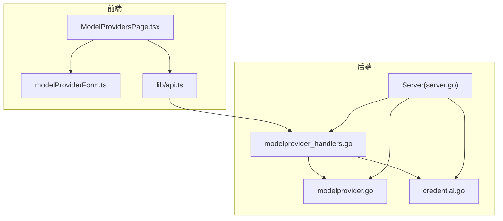
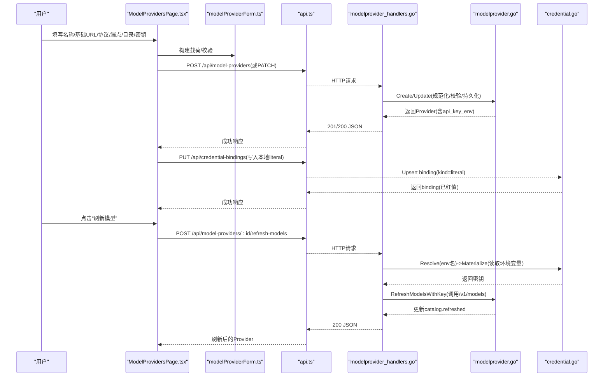
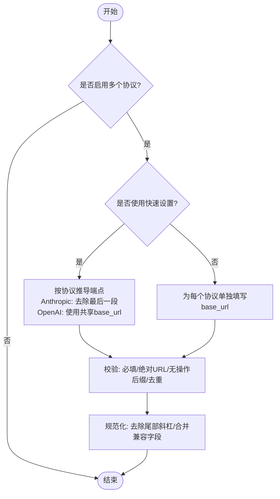
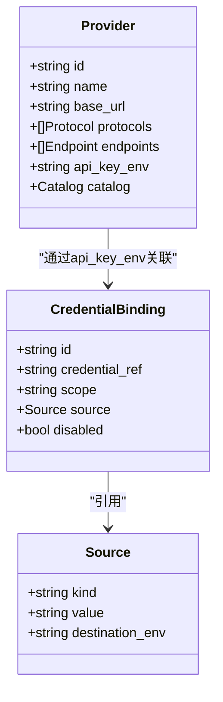
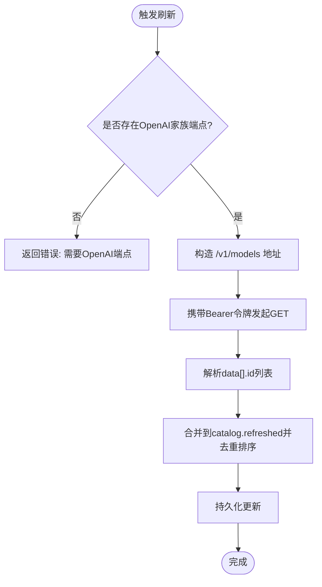
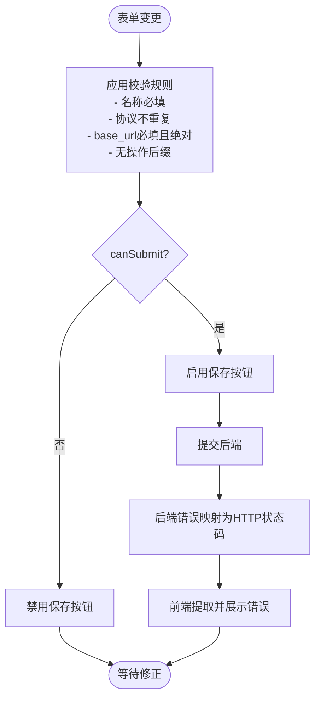
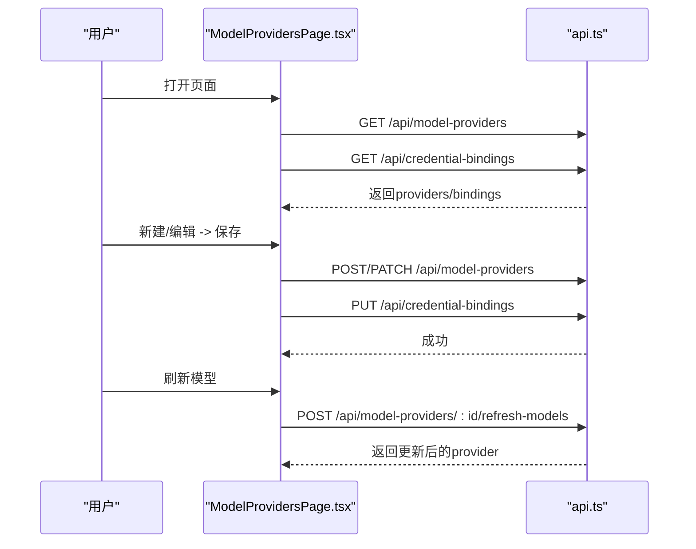
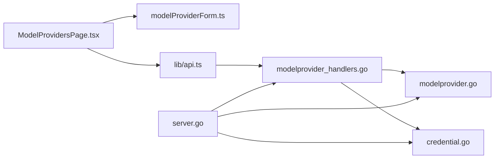

# 模型提供商管理

<cite>
**本文引用的文件**
- [internal/daemon/modelprovider_handlers.go](file://internal/daemon/modelprovider_handlers.go)
- [internal/daemon/server.go](file://internal/daemon/server.go)
- [internal/modelprovider/modelprovider.go](file://internal/modelprovider/modelprovider.go)
- [web/src/pages/ModelProvidersPage.tsx](file://web/src/pages/ModelProvidersPage.tsx)
- [web/src/pages/modelProviderForm.ts](file://web/src/pages/modelProviderForm.ts)
- [web/src/lib/api.ts](file://web/src/lib/api.ts)
- [internal/credential/credential.go](file://internal/credential/credential.go)
</cite>

## 目录
1. [简介](#简介)
2. [项目结构](#项目结构)
3. [核心组件](#核心组件)
4. [架构总览](#架构总览)
5. [详细组件分析](#详细组件分析)
6. [依赖关系分析](#依赖关系分析)
7. [性能与可扩展性](#性能与可扩展性)
8. [故障排查指南](#故障排查指南)
9. [结论](#结论)

## 简介
本文件面向“模型提供商管理”页面，系统性说明多协议支持（OpenAI Chat Completions、OpenAI Responses、Anthropic Messages）的配置机制，包括基础URL设置、端点管理与协议选择逻辑；详述API密钥的安全存储机制（本地凭据绑定与外部源集成）；解释模型目录的自动发现与手动配置能力（刷新、默认模型、批量操作）；并给出表单验证规则、错误处理与用户交互流程的实现细节，以及与后端API的集成和数据同步方式。

## 项目结构
该功能由前端页面、表单工具函数、后端HTTP处理器与领域服务共同组成：
- 前端页面负责展示、编辑、保存模型提供商，并与凭证绑定联动。
- 表单工具函数提供校验、载荷构建与协议端点推导。
- 后端HTTP处理器暴露REST API，调用领域服务完成持久化与刷新。
- 领域服务负责数据规范化、约束校验、目录刷新与兼容性处理。
- 凭证服务提供全局/项目级凭据绑定解析与材料化。

图表来源
- [web/src/pages/ModelProvidersPage.tsx:1-696](file://web/src/pages/ModelProvidersPage.tsx#L1-L696)
- [web/src/pages/modelProviderForm.ts:1-169](file://web/src/pages/modelProviderForm.ts#L1-L169)
- [web/src/lib/api.ts:1-535](file://web/src/lib/api.ts#L1-L535)
- [internal/daemon/server.go:1-200](file://internal/daemon/server.go#L1-L200)
- [internal/daemon/modelprovider_handlers.go:1-155](file://internal/daemon/modelprovider_handlers.go#L1-L155)
- [internal/modelprovider/modelprovider.go:1-745](file://internal/modelprovider/modelprovider.go#L1-L745)
- [internal/credential/credential.go:1-200](file://internal/credential/credential.go#L1-L200)

章节来源
- [web/src/pages/ModelProvidersPage.tsx:1-696](file://web/src/pages/ModelProvidersPage.tsx#L1-L696)
- [web/src/pages/modelProviderForm.ts:1-169](file://web/src/pages/modelProviderForm.ts#L1-L169)
- [web/src/lib/api.ts:1-535](file://web/src/lib/api.ts#L1-L535)
- [internal/daemon/server.go:1-200](file://internal/daemon/server.go#L1-L200)
- [internal/daemon/modelprovider_handlers.go:1-155](file://internal/daemon/modelprovider_handlers.go#L1-L155)
- [internal/modelprovider/modelprovider.go:1-745](file://internal/modelprovider/modelprovider.go#L1-L745)
- [internal/credential/credential.go:1-200](file://internal/credential/credential.go#L1-L200)

## 核心组件
- 前端页面 ModelProvidersPage：列表/搜索/新建/编辑/删除/刷新模型目录，联动凭证绑定显示状态。
- 表单工具 modelProviderForm：提交校验、载荷构建、协议端点推导、默认模型计算。
- 后端处理器 modelprovider_handlers：REST路由处理、错误映射、刷新时注入密钥。
- 领域服务 modelprovider：创建/更新/删除/查询、端点与协议规范化、目录刷新、兼容性与ID生成。
- 凭证服务 credential：全局/项目级凭据绑定、source类型（env/file/command/literal）、解析与材料化。

章节来源
- [web/src/pages/ModelProvidersPage.tsx:1-696](file://web/src/pages/ModelProvidersPage.tsx#L1-L696)
- [web/src/pages/modelProviderForm.ts:1-169](file://web/src/pages/modelProviderForm.ts#L1-L169)
- [internal/daemon/modelprovider_handlers.go:1-155](file://internal/daemon/modelprovider_handlers.go#L1-L155)
- [internal/modelprovider/modelprovider.go:1-745](file://internal/modelprovider/modelprovider.go#L1-L745)
- [internal/credential/credential.go:1-200](file://internal/credential/credential.go#L1-L200)

## 架构总览
以下序列图展示了“创建/更新模型提供商 + 保存本地API密钥 + 刷新模型目录”的关键交互路径。

图表来源
- [web/src/pages/ModelProvidersPage.tsx:167-223](file://web/src/pages/ModelProvidersPage.tsx#L167-L223)
- [web/src/pages/modelProviderForm.ts:50-63](file://web/src/pages/modelProviderForm.ts#L50-L63)
- [web/src/lib/api.ts:83-97](file://web/src/lib/api.ts#L83-L97)
- [internal/daemon/modelprovider_handlers.go:27-122](file://internal/daemon/modelprovider_handlers.go#L27-L122)
- [internal/modelprovider/modelprovider.go:92-284](file://internal/modelprovider/modelprovider.go#L92-L284)
- [internal/credential/credential.go:125-183](file://internal/credential/credential.go#L125-L183)

## 详细组件分析

### 多协议支持与端点管理
- 支持的协议常量定义于领域层，包含 openai_chat_completions、openai_responses、anthropic_messages。
- 快速设置模式：输入共享 base_url 与勾选协议后，系统自动生成各协议的端点base URL。其中 Anthropic Messages 会移除最终非空路径段，以便上层拼接版本化 messages 路径；OpenAI 系列则直接使用共享 base_url。
- 精确设置模式：可直接为每个协议指定独立 base_url，覆盖快速设置的推导结果。
- 端点规范化与校验：禁止在 base_url 中包含操作后缀（如 messages、responses、chat/completions），否则视为无效；重复协议会被拒绝。
- 兼容性：当仅保留 endpoints 时，protocols 字段会从 endpoints 反推；当仅保留 protocols 且存在 base_url 时，会回填 endpoints。

图表来源
- [internal/modelprovider/modelprovider.go:436-457](file://internal/modelprovider/modelprovider.go#L436-L457)
- [internal/modelprovider/modelprovider.go:479-496](file://internal/modelprovider/modelprovider.go#L479-L496)
- [internal/modelprovider/modelprovider.go:555-566](file://internal/modelprovider/modelprovider.go#L555-L566)
- [web/src/pages/modelProviderForm.ts:126-144](file://web/src/pages/modelProviderForm.ts#L126-L144)
- [web/src/pages/modelProviderForm.ts:65-91](file://web/src/pages/modelProviderForm.ts#L65-L91)

章节来源
- [internal/modelprovider/modelprovider.go:21-33](file://internal/modelprovider/modelprovider.go#L21-L33)
- [internal/modelprovider/modelprovider.go:436-457](file://internal/modelprovider/modelprovider.go#L436-L457)
- [internal/modelprovider/modelprovider.go:555-566](file://internal/modelprovider/modelprovider.go#L555-L566)
- [web/src/pages/modelProviderForm.ts:65-91](file://web/src/pages/modelProviderForm.ts#L65-L91)
- [web/src/pages/modelProviderForm.ts:126-144](file://web/src/pages/modelProviderForm.ts#L126-L144)

### API密钥安全存储与外部源集成
- 每个 Provider 创建时会生成一个唯一的 api_key_env 环境变量名（基于ID大写化拼接）。
- 前端在创建/更新时，若用户输入了新的API密钥，会通过 PUT /api/credential-bindings 将当前 Provider 的 api_key_env 与 source.kind="literal" 的本地密钥进行绑定。
- 刷新模型目录时，后端通过凭证服务解析并材料化密钥：优先从进程环境变量中读取对应变量名，再传入上游刷新接口。
- 凭证绑定支持多种 source 类型：env（引用环境变量名）、file（文件路径）、command（命令输出）、literal（本地明文值，对外响应需脱敏）。
- 绑定范围支持 global 与 project 两级，项目级可覆盖全局。

图表来源
- [internal/modelprovider/modelprovider.go:46-56](file://internal/modelprovider/modelprovider.go#L46-L56)
- [internal/credential/credential.go:77-87](file://internal/credential/credential.go#L77-L87)
- [internal/credential/credential.go:41-50](file://internal/credential/credential.go#L41-L50)

章节来源
- [internal/modelprovider/modelprovider.go:624-637](file://internal/modelprovider/modelprovider.go#L624-L637)
- [internal/daemon/modelprovider_handlers.go:124-137](file://internal/daemon/modelprovider_handlers.go#L124-L137)
- [internal/credential/credential.go:125-183](file://internal/credential/credential.go#L125-L183)
- [web/src/pages/ModelProvidersPage.tsx:663-670](file://web/src/pages/ModelProvidersPage.tsx#L663-L670)

### 模型目录自动发现与手动配置
- 自动发现：对 OpenAI 家族端点，刷新接口统一追加 /v1/models 路径，以 Bearer 令牌鉴权拉取模型列表，写入 catalog.refreshed。
- 手动配置：用户可在文本框逐行输入模型ID，形成 catalog.manual；也可设置 default_model。
- 合并策略：更新目录时，manual 与 refreshed 去重排序；default_model 可被覆盖；刷新后 refreshed 覆盖旧值。
- 默认模型下拉：前端根据 manual 与 refreshed 合并去重后的列表动态生成选项。

图表来源
- [internal/modelprovider/modelprovider.go:235-284](file://internal/modelprovider/modelprovider.go#L235-L284)
- [internal/modelprovider/modelprovider.go:479-496](file://internal/modelprovider/modelprovider.go#L479-L496)
- [internal/modelprovider/modelprovider.go:639-674](file://internal/modelprovider/modelprovider.go#L639-L674)
- [web/src/pages/ModelProvidersPage.tsx:572-606](file://web/src/pages/ModelProvidersPage.tsx#L572-L606)

章节来源
- [internal/modelprovider/modelprovider.go:235-284](file://internal/modelprovider/modelprovider.go#L235-L284)
- [internal/modelprovider/modelprovider.go:639-674](file://internal/modelprovider/modelprovider.go#L639-L674)
- [web/src/pages/ModelProvidersPage.tsx:572-606](file://web/src/pages/ModelProvidersPage.tsx#L572-L606)

### 表单验证规则与错误处理
- 必填项：创建时必须提供API密钥；编辑时可省略。
- 端点校验：
  - 协议不可重复。
  - 每个协议的base_url必须为非空且为绝对URL（含scheme与host）。
  - 不允许包含操作后缀（messages、responses、chat/completions）。
- 提交控制：canSubmitModelProvider 综合上述规则决定按钮可用状态。
- 错误映射：后端将领域错误映射为HTTP状态码（未找到、参数错误、冲突等），前端统一提取结构化错误消息并展示。

图表来源
- [web/src/pages/modelProviderForm.ts:13-27](file://web/src/pages/modelProviderForm.ts#L13-L27)
- [web/src/pages/modelProviderForm.ts:65-91](file://web/src/pages/modelProviderForm.ts#L65-L91)
- [internal/daemon/modelprovider_handlers.go:139-154](file://internal/daemon/modelprovider_handlers.go#L139-L154)
- [web/src/lib/api.ts:20-39](file://web/src/lib/api.ts#L20-L39)

章节来源
- [web/src/pages/modelProviderForm.ts:13-27](file://web/src/pages/modelProviderForm.ts#L13-L27)
- [web/src/pages/modelProviderForm.ts:65-91](file://web/src/pages/modelProviderForm.ts#L65-L91)
- [internal/daemon/modelprovider_handlers.go:139-154](file://internal/daemon/modelprovider_handlers.go#L139-L154)
- [web/src/lib/api.ts:20-39](file://web/src/lib/api.ts#L20-L39)

### 用户交互流程与数据同步
- 列表加载：并行获取 providers 与 credential-bindings，用于显示密钥状态与计数。
- 新建/编辑：先保存 Provider，再保存本地凭证绑定；成功后刷新列表并提示保存成功。
- 刷新模型：调用刷新接口，成功后重新加载 provider 详情以展示 refreshed 列表。
- 删除：二次确认后删除，并重置到新建态。
- 搜索：支持按名称、URL、密钥引用、协议、绑定来源等多字段模糊匹配。

图表来源
- [web/src/pages/ModelProvidersPage.tsx:86-110](file://web/src/pages/ModelProvidersPage.tsx#L86-L110)
- [web/src/pages/ModelProvidersPage.tsx:167-223](file://web/src/pages/ModelProvidersPage.tsx#L167-L223)
- [web/src/pages/ModelProvidersPage.tsx:203-223](file://web/src/pages/ModelProvidersPage.tsx#L203-L223)
- [web/src/pages/ModelProvidersPage.tsx:663-670](file://web/src/pages/ModelProvidersPage.tsx#L663-L670)

章节来源
- [web/src/pages/ModelProvidersPage.tsx:86-110](file://web/src/pages/ModelProvidersPage.tsx#L86-L110)
- [web/src/pages/ModelProvidersPage.tsx:167-223](file://web/src/pages/ModelProvidersPage.tsx#L167-L223)
- [web/src/pages/ModelProvidersPage.tsx:203-223](file://web/src/pages/ModelProvidersPage.tsx#L203-L223)
- [web/src/pages/ModelProvidersPage.tsx:663-670](file://web/src/pages/ModelProvidersPage.tsx#L663-L670)

## 依赖关系分析
- 前端依赖：
  - ModelProvidersPage 依赖 modelProviderForm 的校验与载荷构建，依赖 api.ts 的HTTP封装。
- 后端依赖：
  - server.go 初始化 modelprovider.Service 与 credential.Service，并将 HTTP 路由挂载至 handlers。
  - modelprovider_handlers 调用 modelprovider.Service 执行CRUD与刷新，必要时通过 credential.Service 解析密钥。
  - modelprovider 内部实现端点/协议规范化、目录刷新、兼容性与ID生成。
  - credential 提供绑定Upsert/List/Resolve/Materialize能力。

图表来源
- [web/src/pages/ModelProvidersPage.tsx:1-696](file://web/src/pages/ModelProvidersPage.tsx#L1-L696)
- [web/src/pages/modelProviderForm.ts:1-169](file://web/src/pages/modelProviderForm.ts#L1-L169)
- [web/src/lib/api.ts:1-535](file://web/src/lib/api.ts#L1-L535)
- [internal/daemon/server.go:1-200](file://internal/daemon/server.go#L1-L200)
- [internal/daemon/modelprovider_handlers.go:1-155](file://internal/daemon/modelprovider_handlers.go#L1-L155)
- [internal/modelprovider/modelprovider.go:1-745](file://internal/modelprovider/modelprovider.go#L1-L745)
- [internal/credential/credential.go:1-200](file://internal/credential/credential.go#L1-L200)

章节来源
- [internal/daemon/server.go:120-200](file://internal/daemon/server.go#L120-L200)
- [internal/daemon/modelprovider_handlers.go:1-155](file://internal/daemon/modelprovider_handlers.go#L1-L155)
- [internal/modelprovider/modelprovider.go:1-745](file://internal/modelprovider/modelprovider.go#L1-L745)
- [internal/credential/credential.go:1-200](file://internal/credential/credential.go#L1-L200)

## 性能与可扩展性
- 列表与绑定并行加载，减少首屏等待时间。
- 端点推导与校验在前端即时反馈，避免不必要的网络往返。
- 目录刷新采用一次性HTTP请求，服务端去重排序后落库，前端按需展示。
- 扩展新协议：只需在领域层添加协议常量与规范化逻辑，并在前端增加协议枚举与标签即可。

[本节为通用指导，无需源码引用]

## 故障排查指南
- 无法删除提供商：若被运行时配置引用，将返回冲突错误。需先解除引用。
- 刷新失败：
  - 未配置API密钥：检查凭证绑定是否为 enabled 且目标环境变量存在。
  - 非OpenAI端点：刷新仅支持OpenAI家族端点。
  - 上游返回非2xx：查看后端错误信息中的上游状态码。
- 表单无法提交：检查名称是否为空、是否存在重复协议、base_url是否绝对且不含操作后缀。
- 密钥未生效：确认凭证绑定的 source.kind 与 destination_env 是否正确，以及进程环境是否注入。

章节来源
- [internal/modelprovider/modelprovider.go:200-221](file://internal/modelprovider/modelprovider.go#L200-L221)
- [internal/modelprovider/modelprovider.go:235-284](file://internal/modelprovider/modelprovider.go#L235-L284)
- [internal/daemon/modelprovider_handlers.go:139-154](file://internal/daemon/modelprovider_handlers.go#L139-L154)
- [web/src/pages/modelProviderForm.ts:65-91](file://web/src/pages/modelProviderForm.ts#L65-L91)

## 结论
模型提供商管理模块通过“前端表单+后端服务+凭证绑定”的协作，实现了多协议端点的灵活配置、安全的密钥管理与便捷的模型目录维护。其规范化与校验逻辑保证了配置的健壮性，同时提供了良好的用户体验与清晰的错误反馈。未来可按需在领域层扩展更多协议与刷新策略，并保持前后端一致的校验与交互体验。