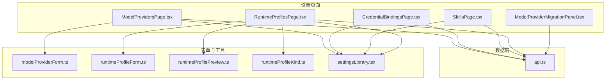
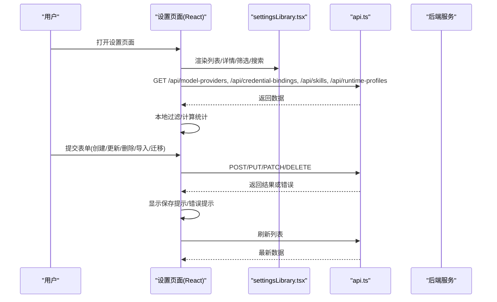
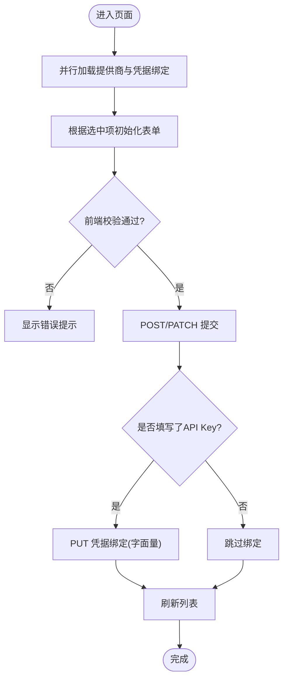
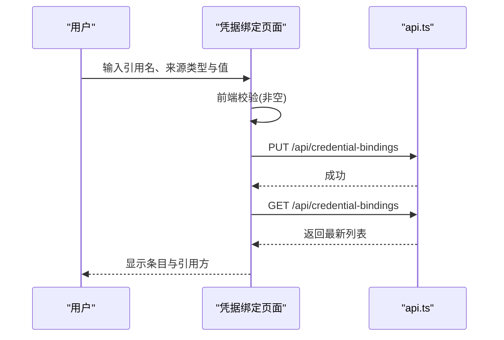
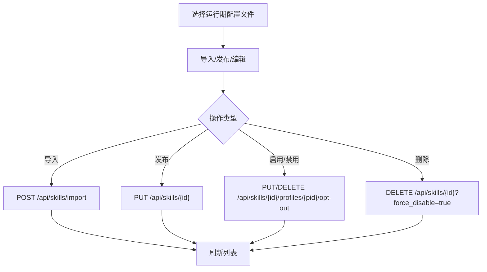
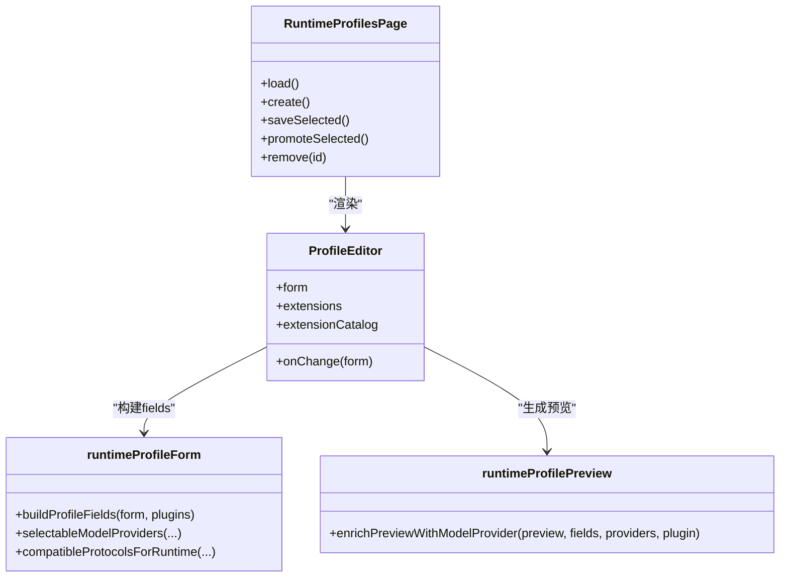
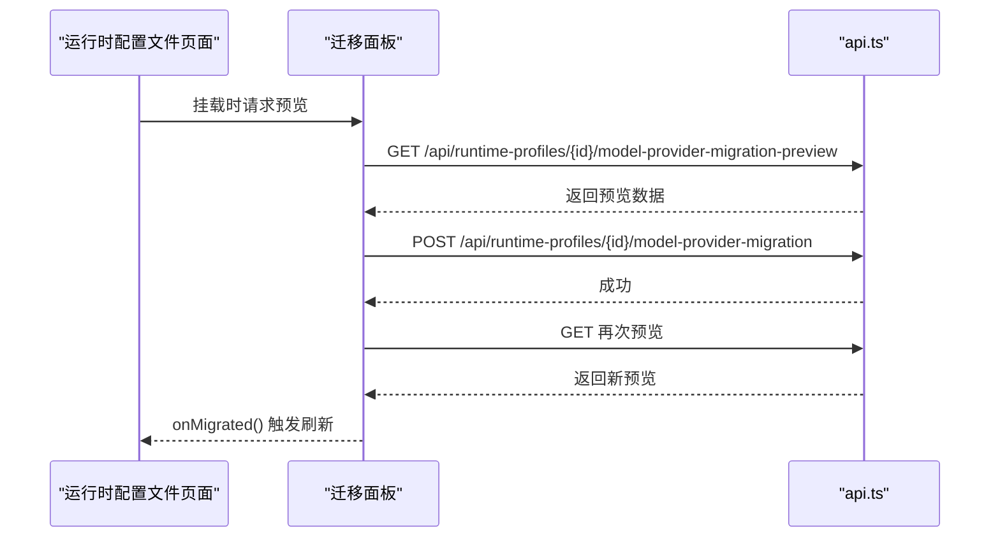
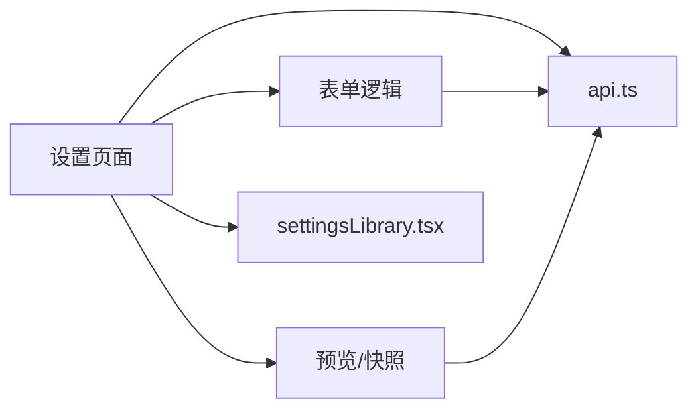

# 设置管理页面

<cite>
**本文引用的文件**   
- [ModelProvidersPage.tsx](file://web/src/pages/ModelProvidersPage.tsx)
- [modelProviderForm.ts](file://web/src/pages/modelProviderForm.ts)
- [CredentialBindingsPage.tsx](file://web/src/pages/CredentialBindingsPage.tsx)
- [SkillsPage.tsx](file://web/src/pages/SkillsPage.tsx)
- [RuntimeProfilesPage.tsx](file://web/src/pages/RuntimeProfilesPage.tsx)
- [runtimeProfileForm.ts](file://web/src/pages/runtimeProfileForm.ts)
- [runtimeProfilePreview.ts](file://web/src/pages/runtimeProfilePreview.ts)
- [runtimeProfileKind.ts](file://web/src/pages/runtimeProfileKind.ts)
- [ModelProviderMigrationPanel.tsx](file://web/src/pages/ModelProviderMigrationPanel.tsx)
- [settingsLibrary.tsx](file://web/src/components/settingsLibrary.tsx)
- [api.ts](file://web/src/lib/api.ts)
</cite>

## 目录
1. [简介](#简介)
2. [项目结构](#项目结构)
3. [核心组件](#核心组件)
4. [架构总览](#架构总览)
5. [详细组件分析](#详细组件分析)
6. [依赖关系分析](#依赖关系分析)
7. [性能与可用性考虑](#性能与可用性考虑)
8. [故障排查指南](#故障排查指南)
9. [结论](#结论)
10. [附录](#附录)

## 简介
本文件面向“设置管理”相关的前端页面，覆盖以下能力：
- 模型提供商配置：协议、端点、目录刷新、默认模型、API Key 绑定。
- 凭据绑定管理：全局凭据来源（环境变量、字面量、文件路径、命令）的创建、过滤、删除。
- 技能包管理：导入、发布、编辑、按运行期配置文件启用/禁用。
- 运行时配置文件设置：插件选择、扩展、MCP 服务器、Runner 与沙箱镜像等高级预设。
- 配置验证与安全存储：前端校验、错误提示、敏感信息不展示、后端预检拦截。
- 批量操作与用户体验优化：搜索、分段筛选、统计摘要、空态引导、保存反馈。
- 模板、导入导出与版本管理：通过受控导入器、结构化 JSON 输入、预览生成实现。
- 与后端集成与热更新：REST API 调用、错误处理、保存即时反馈、列表刷新。

## 项目结构
设置管理由多个 React 页面组成，统一使用共享布局与通用控件库，并通过 typed API 客户端与后端交互。

图表来源
- [ModelProvidersPage.tsx:1-696](file://web/src/pages/ModelProvidersPage.tsx#L1-L696)
- [modelProviderForm.ts:1-169](file://web/src/pages/modelProviderForm.ts#L1-L169)
- [CredentialBindingsPage.tsx:1-506](file://web/src/pages/CredentialBindingsPage.tsx#L1-L506)
- [SkillsPage.tsx:1-759](file://web/src/pages/SkillsPage.tsx#L1-L759)
- [RuntimeProfilesPage.tsx:1-800](file://web/src/pages/RuntimeProfilesPage.tsx#L1-L800)
- [runtimeProfileForm.ts:1-264](file://web/src/pages/runtimeProfileForm.ts#L1-L264)
- [runtimeProfilePreview.ts:1-120](file://web/src/pages/runtimeProfilePreview.ts#L1-L120)
- [runtimeProfileKind.ts:1-9](file://web/src/pages/runtimeProfileKind.ts#L1-L9)
- [ModelProviderMigrationPanel.tsx:1-197](file://web/src/pages/ModelProviderMigrationPanel.tsx#L1-L197)
- [settingsLibrary.tsx:1-281](file://web/src/components/settingsLibrary.tsx#L1-L281)
- [api.ts:1-200](file://web/src/lib/api.ts#L1-L200)

章节来源
- [ModelProvidersPage.tsx:1-696](file://web/src/pages/ModelProvidersPage.tsx#L1-L696)
- [CredentialBindingsPage.tsx:1-506](file://web/src/pages/CredentialBindingsPage.tsx#L1-L506)
- [SkillsPage.tsx:1-759](file://web/src/pages/SkillsPage.tsx#L1-L759)
- [RuntimeProfilesPage.tsx:1-800](file://web/src/pages/RuntimeProfilesPage.tsx#L1-L800)
- [modelProviderForm.ts:1-169](file://web/src/pages/modelProviderForm.ts#L1-L169)
- [runtimeProfileForm.ts:1-264](file://web/src/pages/runtimeProfileForm.ts#L1-L264)
- [runtimeProfilePreview.ts:1-120](file://web/src/pages/runtimeProfilePreview.ts#L1-L120)
- [runtimeProfileKind.ts:1-9](file://web/src/pages/runtimeProfileKind.ts#L1-L9)
- [ModelProviderMigrationPanel.tsx:1-197](file://web/src/pages/ModelProviderMigrationPanel.tsx#L1-L197)
- [settingsLibrary.tsx:1-281](file://web/src/components/settingsLibrary.tsx#L1-L281)
- [api.ts:1-200](file://web/src/lib/api.ts#L1-L200)

## 核心组件
- 模型提供商页面：提供多协议端点配置、目录刷新、默认模型选择、API Key 本地凭据绑定；支持搜索、状态统计、保存成功提示。
- 凭据绑定页面：集中管理全局凭据来源，支持按状态和来源类型筛选，显示引用方（模型提供商、运行期配置文件）。
- 技能包页面：支持从 npm 包受控导入、发布/编辑技能包、按运行期配置文件启用或禁用，并显示来源溯源。
- 运行时配置文件页面：以插件为中心的配置编辑器，包含模型提供商选择、协议兼容、扩展安装、MCP 服务器、Runner 与沙箱镜像等；支持生成配置预览与迁移面板。
- 迁移面板：将旧版运行期配置中的端点、模型、API Key 迁移到可复用的模型提供商，支持复用匹配项或新建。

章节来源
- [ModelProvidersPage.tsx:1-696](file://web/src/pages/ModelProvidersPage.tsx#L1-L696)
- [CredentialBindingsPage.tsx:1-506](file://web/src/pages/CredentialBindingsPage.tsx#L1-L506)
- [SkillsPage.tsx:1-759](file://web/src/pages/SkillsPage.tsx#L1-L759)
- [RuntimeProfilesPage.tsx:1-800](file://web/src/pages/RuntimeProfilesPage.tsx#L1-L800)
- [ModelProviderMigrationPanel.tsx:1-197](file://web/src/pages/ModelProviderMigrationPanel.tsx#L1-L197)

## 架构总览
设置管理采用“列表-详情”双栏布局，左侧为资源列表与筛选，右侧为详情编辑与操作。所有页面共用统一的 Shell、头部、面板、搜索与筛选组件，并通过 typed API 客户端访问后端 REST 接口。

图表来源
- [ModelProvidersPage.tsx:86-110](file://web/src/pages/ModelProvidersPage.tsx#L86-L110)
- [CredentialBindingsPage.tsx:53-74](file://web/src/pages/CredentialBindingsPage.tsx#L53-L74)
- [SkillsPage.tsx:67-107](file://web/src/pages/SkillsPage.tsx#L67-L107)
- [RuntimeProfilesPage.tsx:199-231](file://web/src/pages/RuntimeProfilesPage.tsx#L199-L231)
- [api.ts:83-97](file://web/src/lib/api.ts#L83-L97)

## 详细组件分析

### 模型提供商配置
- 功能要点
  - 支持协议：OpenAI Chat Completions、OpenAI Responses、Anthropic Messages。
  - 端点基地址：可基于共享 base_url 快速推导各协议端点，允许按协议覆盖。
  - 目录管理：手动模型清单 + 刷新获取模型列表；支持选择默认模型。
  - API Key 安全：仅存储生成的环境变量名，实际密钥通过“凭据绑定”以字面量形式保存，UI 不再回显。
  - 验证规则：必填名称、端点必须为绝对 URL、禁止带操作后缀、协议不可重复。
  - 交互体验：搜索、计数统计、保存成功提示、错误消息置顶。

- 关键流程
  - 创建/保存：构建载荷 -> 提交模型提供商 -> 若填写了 API Key，则同步写入凭据绑定 -> 刷新列表。
  - 刷新目录：调用刷新接口后重新加载提供商数据。
  - 删除：二次确认后删除并重置表单。

图表来源
- [ModelProvidersPage.tsx:167-201](file://web/src/pages/ModelProvidersPage.tsx#L167-L201)
- [modelProviderForm.ts:50-91](file://web/src/pages/modelProviderForm.ts#L50-L91)

章节来源
- [ModelProvidersPage.tsx:1-696](file://web/src/pages/ModelProvidersPage.tsx#L1-L696)
- [modelProviderForm.ts:1-169](file://web/src/pages/modelProviderForm.ts#L1-L169)

### 凭据绑定管理
- 功能要点
  - 来源类型：环境变量、字面量、文件路径、命令。
  - 作用域：全局绑定，供运行期配置文件与模型提供商解析。
  - 筛选与搜索：按状态（全部/启用/禁用）、来源类型、关键词组合过滤。
  - 引用可视化：显示被哪些运行期配置文件使用、是否与某模型提供商关联。
  - 安全策略：字面量值在 UI 上脱敏显示，避免泄露。

- 关键流程
  - 新建绑定：校验 ref 与 value 非空 -> PUT 创建/更新 -> 刷新列表。
  - 删除：二次确认 -> DELETE -> 刷新列表。

图表来源
- [CredentialBindingsPage.tsx:86-114](file://web/src/pages/CredentialBindingsPage.tsx#L86-L114)
- [api.ts:83-97](file://web/src/lib/api.ts#L83-L97)

章节来源
- [CredentialBindingsPage.tsx:1-506](file://web/src/pages/CredentialBindingsPage.tsx#L1-L506)

### 技能包管理
- 功能要点
  - 受控导入：通过 npm 包与版本/引用进行结构化导入，不接受任意 shell 命令。
  - 发布/编辑：以 Skill ID 为稳定标识，支持更新同名技能；SKILL.md 与额外文件 JSON 编辑。
  - 按运行期配置文件启用/禁用：切换开关即更新对应 profile 的 opt-out 状态。
  - 来源溯源：内置、手动、npm 包@ref 等来源标签。

- 关键流程
  - 导入：POST /api/skills/import -> 刷新列表。
  - 发布：PUT /api/skills/{id} -> 合并 SKILL.md 与 extra_files -> 刷新列表。
  - 启用/禁用：PUT/DELETE /api/skills/{id}/profiles/{profileId}/opt-out -> 刷新列表。
  - 删除：带 force_disable=true 参数 -> 刷新列表。

图表来源
- [SkillsPage.tsx:120-213](file://web/src/pages/SkillsPage.tsx#L120-L213)

章节来源
- [SkillsPage.tsx:1-759](file://web/src/pages/SkillsPage.tsx#L1-L759)

### 运行时配置文件设置
- 功能要点
  - 插件驱动：根据已注册插件动态渲染字段，隐藏测试用 fake 插件。
  - 模型提供商集成：选择兼容的提供商与协议，自动推导默认模型与端点。
  - 扩展与目录：从扩展目录添加扩展，支持 registry/install_ref/source_url 配置。
  - MCP 服务器：结构化维护，JSON 预览。
  - Runner 与沙箱：默认 runner、沙箱镜像。
  - 生成配置预览：根据当前表单与插件/提供商快照生成可预览的配置片段。
  - 迁移面板：将旧版字段迁移至模型提供商，支持复用匹配或新建。

- 关键流程
  - 创建/保存：构建 fields -> POST/PATCH -> 刷新列表。
  - 提升为预设：对 launch-resolved 的 profile 执行 promote。
  - 删除：二次确认 -> DELETE -> 刷新列表。

图表来源
- [RuntimeProfilesPage.tsx:199-339](file://web/src/pages/RuntimeProfilesPage.tsx#L199-L339)
- [runtimeProfileForm.ts:139-181](file://web/src/pages/runtimeProfileForm.ts#L139-L181)
- [runtimeProfilePreview.ts:98-120](file://web/src/pages/runtimeProfilePreview.ts#L98-L120)

章节来源
- [RuntimeProfilesPage.tsx:1-800](file://web/src/pages/RuntimeProfilesPage.tsx#L1-L800)
- [runtimeProfileForm.ts:1-264](file://web/src/pages/runtimeProfileForm.ts#L1-L264)
- [runtimeProfilePreview.ts:1-120](file://web/src/pages/runtimeProfilePreview.ts#L1-L120)
- [runtimeProfileKind.ts:1-9](file://web/src/pages/runtimeProfileKind.ts#L1-L9)

### 模型提供商迁移面板
- 功能要点
  - 预览：展示建议的提供商名称、base_url、模型、协议、派生端点、API Key 来源。
  - 目标选择：复用已有匹配或新建提供商。
  - 可选迁移：将内联 API Key 复制到模型提供商的凭据绑定。
  - 执行：POST 迁移接口，成功后刷新预览与父级列表。

图表来源
- [ModelProviderMigrationPanel.tsx:29-83](file://web/src/pages/ModelProviderMigrationPanel.tsx#L29-L83)

章节来源
- [ModelProviderMigrationPanel.tsx:1-197](file://web/src/pages/ModelProviderMigrationPanel.tsx#L1-L197)

## 依赖关系分析
- 页面与表单逻辑解耦：页面负责状态与交互，表单逻辑集中在 modelProviderForm.ts 与 runtimeProfileForm.ts，便于复用与测试。
- 预览与快照：runtimeProfilePreview.ts 负责将表单与提供商/插件信息合成可预览的结构化输出。
- 通用 UI 库：settingsLibrary.tsx 提供列表列、滚动面板、搜索框、分段筛选、芯片筛选、详情面板等，保证一致体验。
- API 客户端：api.ts 封装 fetch、鉴权头、错误提取与类型定义，统一错误处理与响应解析。

图表来源
- [settingsLibrary.tsx:1-281](file://web/src/components/settingsLibrary.tsx#L1-L281)
- [api.ts:1-200](file://web/src/lib/api.ts#L1-L200)

章节来源
- [settingsLibrary.tsx:1-281](file://web/src/components/settingsLibrary.tsx#L1-L281)
- [api.ts:1-200](file://web/src/lib/api.ts#L1-L200)

## 性能与可用性考虑
- 并发加载：页面初始加载使用 Promise.all 并行拉取多项数据，减少首屏等待。
- 本地过滤与统计：列表过滤、计数统计在前端完成，避免频繁请求。
- 防抖与节流：搜索输入未做防抖，但过滤为纯函数且数据量较小，影响有限；如需优化可在高频输入场景加入防抖。
- 错误提示：统一 ApiError 包装，错误消息优先提取后端返回体，失败时保留草稿，便于重试。
- 无障碍与可发现性：按钮 aria-label、role、aria-checked 等属性完善，提升可访问性。

[本节为通用指导，无需列出具体文件来源]

## 故障排查指南
- 常见错误
  - 端点校验失败：缺少 scheme/host、包含操作后缀、协议重复。检查 modelProviderForm.ts 的 endpointValidationErrors。
  - 自定义参数冲突：运行时配置文件保存时若存在冲突，后端会返回 400，前端保留草稿并显示错误。
  - 凭据未配置：模型提供商保存时若未填写 API Key，不会自动创建绑定；需在凭据绑定页面补充。
  - 导入失败：确保包名与版本/引用有效，服务端受控导入器会拒绝非法输入。
- 定位步骤
  - 查看页面顶部 SettingsAlert 的错误消息。
  - 打开浏览器网络面板，核对请求路径与方法是否正确。
  - 检查表单字段是否符合约束（如 URL、JSON、非空）。
  - 对于迁移面板，先预览再执行，确认匹配项与 API Key 来源。

章节来源
- [modelProviderForm.ts:65-91](file://web/src/pages/modelProviderForm.ts#L65-L91)
- [RuntimeProfilesPage.tsx:319-339](file://web/src/pages/RuntimeProfilesPage.tsx#L319-L339)
- [api.ts:20-39](file://web/src/lib/api.ts#L20-L39)

## 结论
设置管理页面围绕“模型提供商、凭据绑定、技能包、运行时配置文件”四大主题，提供了完整的配置、验证、安全存储与批量管理能力。通过表单与预览分离、受控导入与迁移面板，既保证了易用性，也兼顾了安全性与可维护性。配合统一的 UI 库与 API 客户端，整体架构清晰、可扩展性强。

[本节为总结，无需列出具体文件来源]

## 附录

### 表单设计与数据校验
- 模型提供商
  - 必填：名称、至少一个协议及其端点基地址。
  - 校验：URL 合法性、禁止操作后缀、协议唯一性。
  - 行为：创建时必须提供 API Key（用于写入字面量绑定），编辑时可留空。
- 凭据绑定
  - 必填：引用名与值。
  - 来源：env/literal/file/command，字面量在 UI 脱敏。
- 技能包
  - 必填：Skill ID 与名称。
  - 内容：SKILL.md 与额外文件 JSON，导入需指定包与版本/引用。
- 运行时配置文件
  - 必填：名称。
  - 可选：二进制路径、模型、端点、模型提供商、协议、覆盖模型、推理强度、自定义参数、环境变量、API Key、凭据引用、扩展、MCP 服务器、Runner、沙箱镜像。
  - 校验：自定义参数冲突由后端拒绝，前端保留草稿。

章节来源
- [modelProviderForm.ts:13-27](file://web/src/pages/modelProviderForm.ts#L13-L27)
- [modelProviderForm.ts:65-91](file://web/src/pages/modelProviderForm.ts#L65-L91)
- [runtimeProfileForm.ts:139-181](file://web/src/pages/runtimeProfileForm.ts#L139-L181)

### 安全存储与敏感信息保护
- 模型提供商 API Key 不直接持久化于提供商记录，而是通过凭据绑定以字面量方式存储。
- UI 中不展示真实密钥，仅显示占位符或“已配置”标记。
- 凭据绑定的字面量值在列表中以掩码显示。

章节来源
- [ModelProvidersPage.tsx:663-670](file://web/src/pages/ModelProvidersPage.tsx#L663-L670)
- [CredentialBindingsPage.tsx:501-505](file://web/src/pages/CredentialBindingsPage.tsx#L501-L505)

### 批量操作与用户体验优化
- 搜索与筛选：支持关键词搜索、分段筛选（状态/来源/启用情况）、芯片筛选（来源类型）。
- 统计摘要：显示总数与活跃数，帮助用户快速把握规模。
- 空态引导：无数据时提供明确引导与快捷入口。
- 保存反馈：保存成功短暂提示，错误置顶显示。

章节来源
- [settingsLibrary.tsx:49-83](file://web/src/components/settingsLibrary.tsx#L49-L83)
- [settingsLibrary.tsx:135-172](file://web/src/components/settingsLibrary.tsx#L135-L172)
- [settingsLibrary.tsx:183-217](file://web/src/components/settingsLibrary.tsx#L183-L217)
- [ModelProvidersPage.tsx:118-122](file://web/src/pages/ModelProvidersPage.tsx#L118-L122)

### 配置模板、导入导出与版本管理
- 模板：通过“新增”表单与默认值作为模板起点；运行时配置文件支持生成配置预览，便于复制与分享。
- 导入：技能包支持受控导入（npm 包+版本/引用），不执行任意命令。
- 导出：当前未见直接导出按钮，可通过“生成配置预览”与“编辑技能包”的内容进行人工导出。
- 版本管理：技能包以 Skill ID 为稳定标识，重复导入更新同名技能；迁移面板支持复用现有提供商或新建。

章节来源
- [SkillsPage.tsx:142-161](file://web/src/pages/SkillsPage.tsx#L142-L161)
- [RuntimeProfilesPage.tsx:341-353](file://web/src/pages/RuntimeProfilesPage.tsx#L341-L353)
- [ModelProviderMigrationPanel.tsx:62-83](file://web/src/pages/ModelProviderMigrationPanel.tsx#L62-L83)

### 与后端集成与热更新机制
- 集成方式：typed API 客户端统一封装 GET/POST/PUT/PATCH/DELETE，自动附加鉴权头与 Content-Type。
- 错误处理：统一 ApiError，优先提取后端返回的消息体，失败时保留草稿。
- 热更新：页面通过刷新接口与列表重拉取实现近实时更新；保存成功后主动刷新，确保视图与后端一致。

章节来源
- [api.ts:20-39](file://web/src/lib/api.ts#L20-L39)
- [api.ts:83-97](file://web/src/lib/api.ts#L83-L97)
- [ModelProvidersPage.tsx:186-201](file://web/src/pages/ModelProvidersPage.tsx#L186-L201)
- [RuntimeProfilesPage.tsx:319-339](file://web/src/pages/RuntimeProfilesPage.tsx#L319-L339)