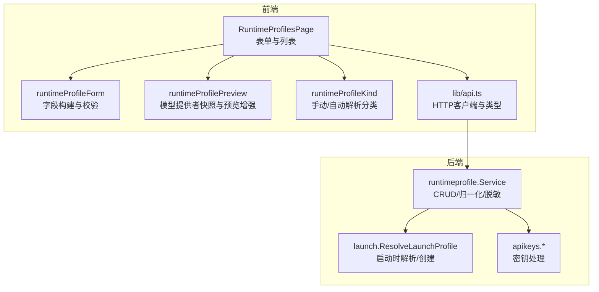
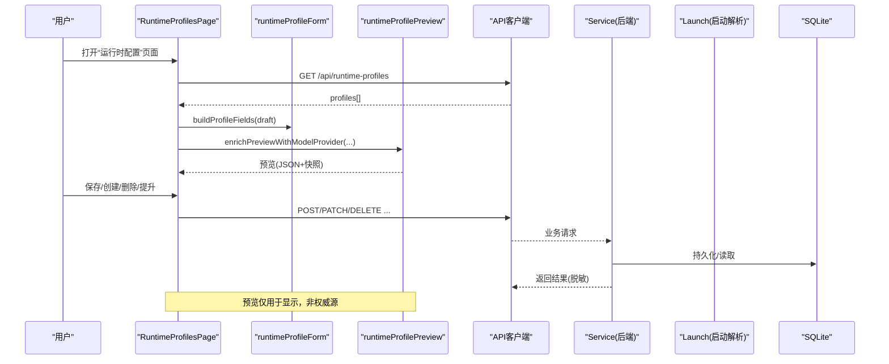
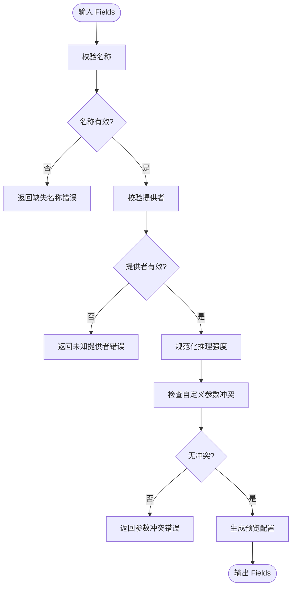
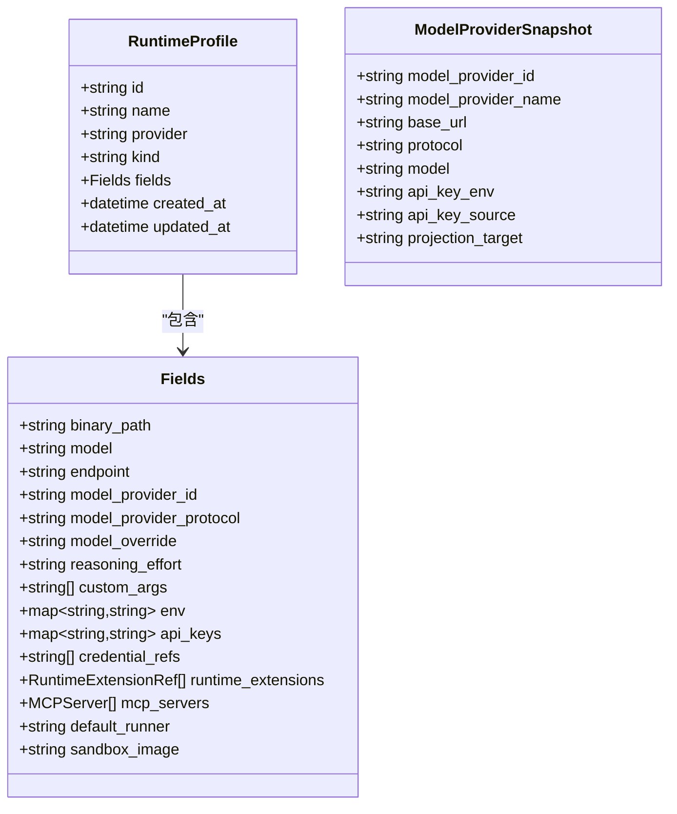
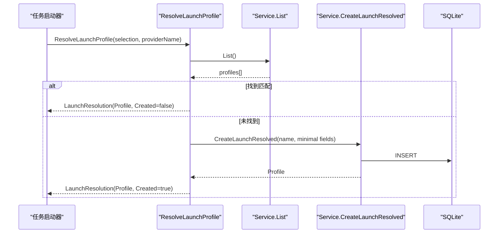
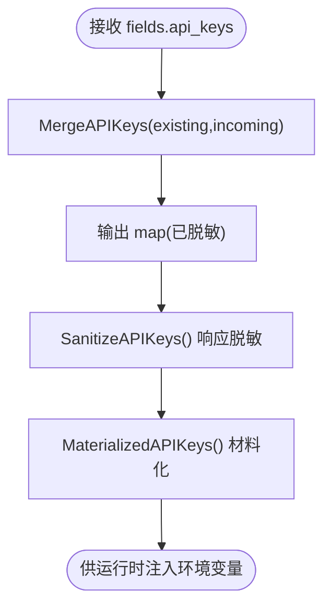
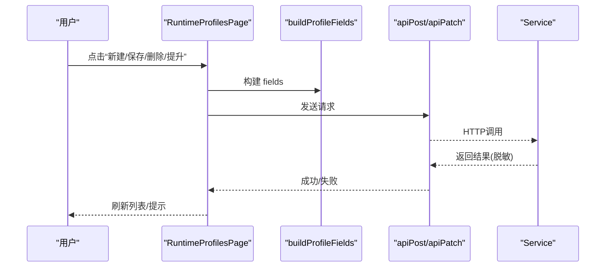
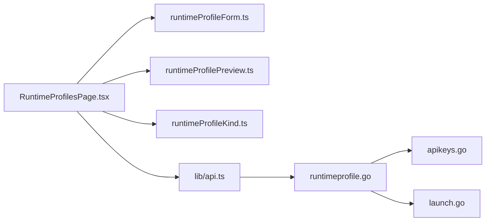

# 运行时配置文件管理

<cite>
**本文引用的文件**   
- [runtimeprofile.go](file://internal/runtimeprofile/runtimeprofile.go)
- [apikeys.go](file://internal/runtimeprofile/apikeys.go)
- [launch.go](file://internal/runtimeprofile/launch.go)
- [RuntimeProfilesPage.tsx](file://web/src/pages/RuntimeProfilesPage.tsx)
- [runtimeProfileForm.ts](file://web/src/pages/runtimeProfileForm.ts)
- [runtimeProfilePreview.ts](file://web/src/pages/runtimeProfilePreview.ts)
- [runtimeProfileKind.ts](file://web/src/pages/runtimeProfileKind.ts)
- [api.ts](file://web/src/lib/api.ts)
- [runtimeprofile_test.go](file://internal/daemon/runtimeprofile_test.go)
</cite>

## 目录
1. [简介](#简介)
2. [项目结构](#项目结构)
3. [核心组件](#核心组件)
4. [架构总览](#架构总览)
5. [详细组件分析](#详细组件分析)
6. [依赖关系分析](#依赖关系分析)
7. [性能考虑](#性能考虑)
8. [故障排查指南](#故障排查指南)
9. [结论](#结论)
10. [附录](#附录)

## 简介
本文件面向“运行时配置文件管理”页面与后端服务，系统性说明不同运行时类型（Docker沙箱、主机进程、容器化环境）的配置模板与行为；深入解释配置参数的验证规则、默认值继承与动态生成机制；详述配置预览（JSON格式化、语法高亮、实时校验）；覆盖配置的创建、复制、修改、删除操作；阐述配置版本控制、变更追踪与回滚机制；提供导入导出、批量操作与模板库能力；并详细说明与任务启动器的集成方式及参数传递机制。

## 项目结构
运行时配置由前端页面与后端领域服务共同实现：
- 前端页面负责表单编辑、分组展示、预览渲染、API调用与错误提示
- 后端领域服务负责配置CRUD、字段归一化、密钥脱敏、启动时解析与匹配
- API客户端封装HTTP请求与类型定义

**图表来源** 
- [RuntimeProfilesPage.tsx:156-354](file://web/src/pages/RuntimeProfilesPage.tsx#L156-L354)
- [runtimeProfileForm.ts:139-181](file://web/src/pages/runtimeProfileForm.ts#L139-L181)
- [runtimeProfilePreview.ts:98-120](file://web/src/pages/runtimeProfilePreview.ts#L98-L120)
- [runtimeProfileKind.ts:1-9](file://web/src/pages/runtimeProfileKind.ts#L1-L9)
- [api.ts:154-178](file://web/src/lib/api.ts#L154-L178)
- [runtimeprofile.go:128-208](file://internal/runtimeprofile/runtimeprofile.go#L128-L208)
- [launch.go:70-93](file://internal/runtimeprofile/launch.go#L70-L93)
- [apikeys.go:22-46](file://internal/runtimeprofile/apikeys.go#L22-L46)

**章节来源**
- [RuntimeProfilesPage.tsx:156-354](file://web/src/pages/RuntimeProfilesPage.tsx#L156-L354)
- [runtimeProfileForm.ts:139-181](file://web/src/pages/runtimeProfileForm.ts#L139-L181)
- [runtimeProfilePreview.ts:98-120](file://web/src/pages/runtimeProfilePreview.ts#L98-L120)
- [runtimeProfileKind.ts:1-9](file://web/src/pages/runtimeProfileKind.ts#L1-L9)
- [api.ts:154-178](file://web/src/lib/api.ts#L154-L178)
- [runtimeprofile.go:128-208](file://internal/runtimeprofile/runtimeprofile.go#L128-L208)
- [launch.go:70-93](file://internal/runtimeprofile/launch.go#L70-L93)
- [apikeys.go:22-46](file://internal/runtimeprofile/apikeys.go#L22-L46)

## 核心组件
- 运行时配置实体 Profile 与结构化字段 Fields：包含二进制路径、模型、端点、模型提供者ID/协议/覆盖、推理强度、自定义参数、环境变量、内联API密钥、凭据引用、运行时扩展、MCP服务器、默认运行器、沙箱镜像等
- 服务层 Service：提供创建、获取、列表、更新、替换字段、删除、生成预览配置、启动时解析与匹配
- 密钥处理：默认环境变量映射、响应脱敏、合并策略、材料化
- 启动解析：根据运行时、模型提供者、模型覆盖查找或创建最小化配置
- 前端页面：分组展示（按插件/提供者）、手动与自动解析两类配置、表单编辑、预览增强、保存/删除/提升为预设

**章节来源**
- [runtimeprofile.go:71-116](file://internal/runtimeprofile/runtimeprofile.go#L71-L116)
- [runtimeprofile.go:128-208](file://internal/runtimeprofile/runtimeprofile.go#L128-L208)
- [apikeys.go:8-20](file://internal/runtimeprofile/apikeys.go#L8-L20)
- [apikeys.go:22-46](file://internal/runtimeprofile/apikeys.go#L22-L46)
- [launch.go:8-19](file://internal/runtimeprofile/launch.go#L8-L19)
- [launch.go:70-93](file://internal/runtimeprofile/launch.go#L70-L93)
- [RuntimeProfilesPage.tsx:156-354](file://web/src/pages/RuntimeProfilesPage.tsx#L156-L354)

## 架构总览
下图展示了从用户界面到后端存储的完整数据流，包括配置预览与启动解析流程。

**图表来源** 
- [RuntimeProfilesPage.tsx:199-224](file://web/src/pages/RuntimeProfilesPage.tsx#L199-L224)
- [runtimeProfileForm.ts:139-181](file://web/src/pages/runtimeProfileForm.ts#L139-L181)
- [runtimeProfilePreview.ts:98-120](file://web/src/pages/runtimeProfilePreview.ts#L98-L120)
- [api.ts:83-97](file://web/src/lib/api.ts#L83-L97)
- [runtimeprofile.go:143-208](file://internal/runtimeprofile/runtimeprofile.go#L143-L208)
- [launch.go:70-93](file://internal/runtimeprofile/launch.go#L70-L93)

## 详细组件分析

### 运行时配置数据结构与验证
- 字段集合 Fields：结构化字段作为权威源，支持可选字段与空值语义
- 验证规则：
  - 名称必填且去空白
  - 提供者必填且必须在受支持集合中
  - 推理强度需规范化为允许值之一
  - 自定义参数冲突检测（与结构化模型提供者/模型/推理强度冲突）
- 默认值与继承：
  - 未显式设置推理强度时，显示层默认“high”，但不改写存储
  - 未设置 model_provider_id 时，允许 legacy 字段（model/endpoint/api_keys）
  - 默认运行器在启动解析时设为 sandbox

**图表来源** 
- [runtimeprofile.go:435-467](file://internal/runtimeprofile/runtimeprofile.go#L435-L467)
- [runtimeProfileForm.ts:139-181](file://web/src/pages/runtimeProfileForm.ts#L139-L181)

**章节来源**
- [runtimeprofile.go:435-467](file://internal/runtimeprofile/runtimeprofile.go#L435-L467)
- [runtimeProfileForm.ts:139-181](file://web/src/pages/runtimeProfileForm.ts#L139-L181)

### 配置预览与模型提供者快照
- 预览生成：基于结构化字段生成只读 JSON 预览，不包含敏感值
- 模型提供者快照：根据 provider、protocol 偏好与 catalog 推导 model/base_url/api_key_env/projection_target
- Codex 专用：当 provider 为 codex 时，额外生成 config_toml 片段便于查看

**图表来源** 
- [runtimeprofile.go:71-116](file://internal/runtimeprofile/runtimeprofile.go#L71-L116)
- [runtimeProfilePreview.ts:14-23](file://web/src/pages/runtimeProfilePreview.ts#L14-L23)

**章节来源**
- [runtimeprofile.go:348-433](file://internal/runtimeprofile/runtimeprofile.go#L348-L433)
- [runtimeProfilePreview.ts:98-120](file://web/src/pages/runtimeProfilePreview.ts#L98-L120)

### 启动时解析与自动创建
- 启动选择：指定 provider、model_provider_id、model_override
- 匹配规则：provider 与 model_provider_id、model_override 完全一致即匹配
- 自动创建：若不存在则创建 launch_resolve 类型的最小配置，默认 runner=sandbox

**图表来源** 
- [launch.go:70-93](file://internal/runtimeprofile/launch.go#L70-L93)
- [runtimeprofile.go:148-151](file://internal/runtimeprofile/runtimeprofile.go#L148-L151)

**章节来源**
- [launch.go:37-68](file://internal/runtimeprofile/launch.go#L37-L68)
- [launch.go:70-93](file://internal/runtimeprofile/launch.go#L70-L93)

### 密钥管理与安全
- 默认环境变量映射：不同 provider 对应不同的 API Key 环境变量名
- 响应脱敏：所有 inline API keys 的值被替换为占位符
- 合并策略：保留已有密钥，忽略空值或占位符
- 材料化：将 profile 中的 inline keys 转换为键值对供运行时使用

**图表来源** 
- [apikeys.go:48-74](file://internal/runtimeprofile/apikeys.go#L48-L74)
- [apikeys.go:22-46](file://internal/runtimeprofile/apikeys.go#L22-L46)
- [apikeys.go:76-94](file://internal/runtimeprofile/apikeys.go#L76-L94)

**章节来源**
- [apikeys.go:8-20](file://internal/runtimeprofile/apikeys.go#L8-L20)
- [apikeys.go:22-46](file://internal/runtimeprofile/apikeys.go#L22-L46)
- [apikeys.go:48-74](file://internal/runtimeprofile/apikeys.go#L48-L74)
- [apikeys.go:76-94](file://internal/runtimeprofile/apikeys.go#L76-L94)

### 前端页面与交互
- 列表分组：按插件/提供者分组，区分手动与自动解析两类配置
- 表单编辑：支持二进制路径、模型、端点、模型提供者、协议、覆盖、推理强度、自定义参数、环境变量、API密钥、凭据引用、运行时扩展、MCP服务器、默认运行器、沙箱镜像
- 预览展示：JSON格式化文本框，结合模型提供者快照与特定运行时配置片段
- 操作：创建、保存、删除、提升为预设（自动解析→手动）

**图表来源** 
- [RuntimeProfilesPage.tsx:266-339](file://web/src/pages/RuntimeProfilesPage.tsx#L266-L339)
- [runtimeProfileForm.ts:139-181](file://web/src/pages/runtimeProfileForm.ts#L139-L181)
- [api.ts:83-97](file://web/src/lib/api.ts#L83-L97)

**章节来源**
- [RuntimeProfilesPage.tsx:156-354](file://web/src/pages/RuntimeProfilesPage.tsx#L156-L354)
- [runtimeProfileKind.ts:1-9](file://web/src/pages/runtimeProfileKind.ts#L1-L9)

## 依赖关系分析
- 前端依赖：
  - lib/api.ts：统一HTTP客户端与类型定义
  - runtimeProfileForm.ts：字段构建、校验、默认值处理
  - runtimeProfilePreview.ts：模型提供者快照与预览增强
  - runtimeProfileKind.ts：配置分类判断
- 后端依赖：
  - internal/store.DB：SQLite数据库访问
  - internal/runtimeprofile.Service：领域逻辑
  - internal/runtimeprofile.launch：启动解析
  - internal/runtimeprofile.apikeys：密钥处理

**图表来源** 
- [RuntimeProfilesPage.tsx:156-354](file://web/src/pages/RuntimeProfilesPage.tsx#L156-L354)
- [runtimeProfileForm.ts:139-181](file://web/src/pages/runtimeProfileForm.ts#L139-L181)
- [runtimeProfilePreview.ts:98-120](file://web/src/pages/runtimeProfilePreview.ts#L98-L120)
- [runtimeProfileKind.ts:1-9](file://web/src/pages/runtimeProfileKind.ts#L1-L9)
- [api.ts:154-178](file://web/src/lib/api.ts#L154-L178)
- [runtimeprofile.go:128-208](file://internal/runtimeprofile/runtimeprofile.go#L128-L208)
- [apikeys.go:22-46](file://internal/runtimeprofile/apikeys.go#L22-L46)
- [launch.go:70-93](file://internal/runtimeprofile/launch.go#L70-L93)

**章节来源**
- [RuntimeProfilesPage.tsx:156-354](file://web/src/pages/RuntimeProfilesPage.tsx#L156-L354)
- [runtimeProfileForm.ts:139-181](file://web/src/pages/runtimeProfileForm.ts#L139-L181)
- [runtimeProfilePreview.ts:98-120](file://web/src/pages/runtimeProfilePreview.ts#L98-L120)
- [runtimeProfileKind.ts:1-9](file://web/src/pages/runtimeProfileKind.ts#L1-L9)
- [api.ts:154-178](file://web/src/lib/api.ts#L154-L178)
- [runtimeprofile.go:128-208](file://internal/runtimeprofile/runtimeprofile.go#L128-L208)
- [apikeys.go:22-46](file://internal/runtimeprofile/apikeys.go#L22-L46)
- [launch.go:70-93](file://internal/runtimeprofile/launch.go#L70-L93)

## 性能考虑
- 列表加载：一次性并行获取 profiles、plugins、extensions、model-providers，减少往返
- 预览计算：仅在选中配置变化时重新生成，避免频繁重算
- 数据库：SQLite单文件存储，读写轻量；查询按 created_at 排序
- 密钥处理：内存级脱敏与合并，无额外IO

[本节为通用指导，不直接分析具体文件]

## 故障排查指南
- 常见错误：
  - 名称为空或提供者未知：检查输入与受支持提供者集合
  - 自定义参数冲突：确保不与结构化模型提供者/模型/推理强度冲突
  - 密钥泄露：确认响应中 api_keys 已被脱敏
- 调试建议：
  - 查看预览JSON是否包含预期字段
  - 检查启动解析是否命中现有配置或创建了新的 launch_resolve 配置
  - 通过测试用例验证API行为（如创建、列表、补丁、删除、脱敏）

**章节来源**
- [runtimeprofile_test.go:175-201](file://internal/daemon/runtimeprofile_test.go#L175-L201)
- [runtimeprofile_test.go:307-351](file://internal/daemon/runtimeprofile_test.go#L307-L351)

## 结论
运行时配置文件管理提供了完整的配置生命周期管理能力，涵盖多运行时类型、严格验证、安全密钥处理、直观预览与启动时自动解析。前端与后端协作良好，满足高级用户与自动化场景的需求。建议在生产环境中启用严格的输入校验与审计日志，并结合CI/CD进行配置模板的版本化管理。

[本节为总结性内容，不直接分析具体文件]

## 附录

### 配置模板与运行时类型
- Docker沙箱：default_runner=sandbox，sandbox_image可覆盖全局镜像
- 主机进程：default_runner=host，适用于本地快速调试
- 容器化环境：通过运行时插件声明式适配器（Codex/Claude Code/Pi）管理二进制与环境变量

**章节来源**
- [launch.go:84-93](file://internal/runtimeprofile/launch.go#L84-L93)
- [RuntimeProfilesPage.tsx:592-633](file://web/src/pages/RuntimeProfilesPage.tsx#L592-L633)

### 配置预览功能
- JSON格式化：预先生成JSON字符串，使用pre标签展示
- 语法高亮：可通过外部库增强（当前为纯文本）
- 实时校验：前端表单提交前进行基础校验，后端进行权威校验

**章节来源**
- [RuntimeProfilesPage.tsx:341-353](file://web/src/pages/RuntimeProfilesPage.tsx#L341-L353)
- [runtimeProfilePreview.ts:98-120](file://web/src/pages/runtimeProfilePreview.ts#L98-L120)

### 配置版本控制与回滚
- 版本控制：当前未实现显式版本字段，但created_at/updated_at可用于变更追踪
- 回滚机制：建议通过备份profiles表或使用外部版本控制系统（Git）管理配置模板

**章节来源**
- [runtimeprofile.go:108-116](file://internal/runtimeprofile/runtimeprofile.go#L108-L116)

### 导入导出与批量操作
- 导入导出：可通过数据库备份/恢复或脚本批量操作profiles表
- 批量操作：前端未提供批量接口，建议通过后端API扩展

**章节来源**
- [runtimeprofile.go:218-240](file://internal/runtimeprofile/runtimeprofile.go#L218-L240)

### 与任务启动器的集成
- 启动解析：任务启动时调用ResolveLaunchProfile，自动匹配或创建配置
- 参数传递：通过fields.env注入环境变量，通过credential_refs引用全局凭据绑定

**章节来源**
- [launch.go:70-93](file://internal/runtimeprofile/launch.go#L70-L93)
- [runtimeprofile.go:71-95](file://internal/runtimeprofile/runtimeprofile.go#L71-L95)