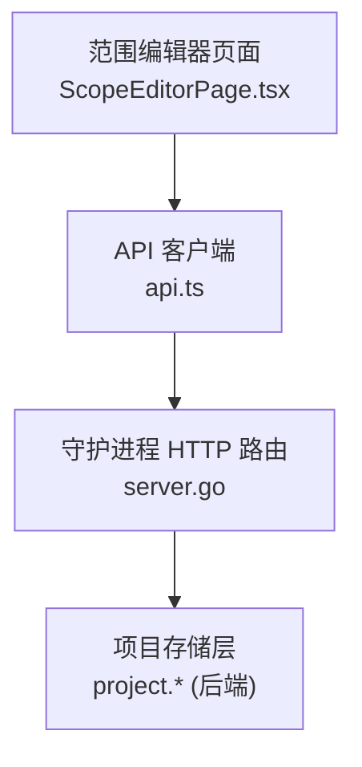
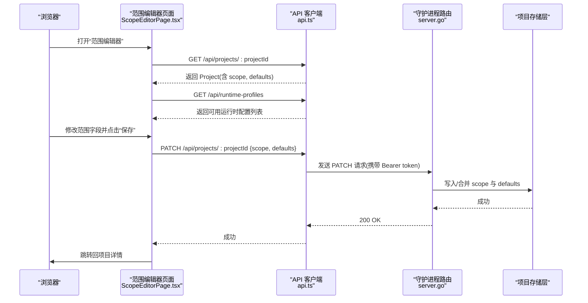
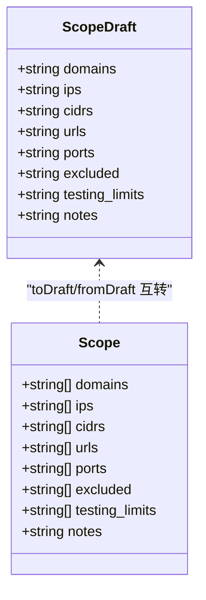
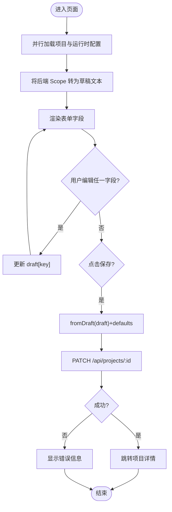
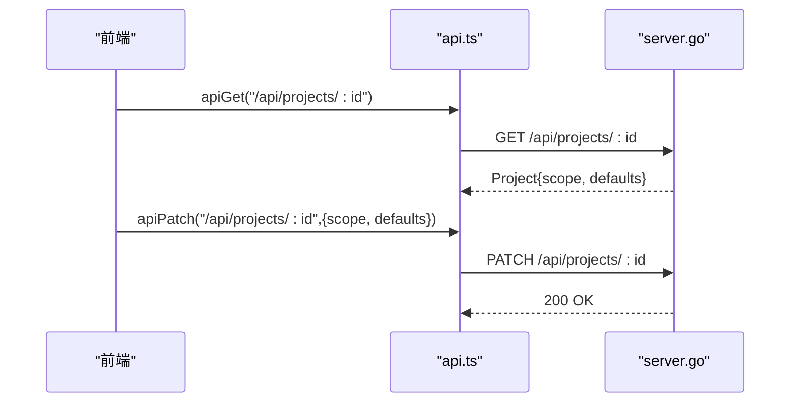
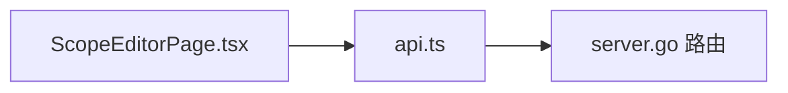

# 范围编辑器页面

<cite>
**本文引用的文件**
- [ScopeEditorPage.tsx](file://web/src/pages/ScopeEditorPage.tsx)
- [api.ts](file://web/src/lib/api.ts)
- [server.go](file://internal/daemon/server.go)
</cite>

## 目录
1. [简介](#简介)
2. [项目结构](#项目结构)
3. [核心组件](#核心组件)
4. [架构总览](#架构总览)
5. [详细组件分析](#详细组件分析)
6. [依赖分析](#依赖分析)
7. [性能考虑](#性能考虑)
8. [故障排查指南](#故障排查指南)
9. [结论](#结论)
10. [附录](#附录)

## 简介
本文件面向渗透测试项目的“范围编辑器”页面，系统性说明其功能与实现：如何定义与管理目标范围（域名、IP、CIDR、URL、端口）、排除项与安全限制；表单的数据模型、前后端交互流程、错误处理与持久化机制。同时给出可扩展建议（批量操作、模板、导入导出、协作编辑）的实现思路与集成点。

## 项目结构
范围编辑器位于前端 React 应用，路由挂载于项目详情页之下，通过统一的 API 客户端与后端守护进程通信，最终由后端服务层完成数据持久化。

图表来源
- [ScopeEditorPage.tsx:1-226](file://web/src/pages/ScopeEditorPage.tsx#L1-L226)
- [api.ts:83-97](file://web/src/lib/api.ts#L83-L97)
- [server.go:587-643](file://internal/daemon/server.go#L587-L643)

章节来源
- [ScopeEditorPage.tsx:1-226](file://web/src/pages/ScopeEditorPage.tsx#L1-L226)
- [api.ts:100-129](file://web/src/lib/api.ts#L100-L129)
- [server.go:587-643](file://internal/daemon/server.go#L587-L643)

## 核心组件
- 范围编辑器页面（React 组件）
  - 负责加载项目与运行时配置、渲染表单、将用户输入转换为后端期望的 JSON 并保存。
- API 客户端（类型化封装）
  - 提供 GET/PATCH 等请求方法、统一鉴权头注入、错误体解析与异常抛出。
- 后端路由与服务层
  - 暴露 PATCH /api/projects/{id} 用于增量更新项目范围与默认值。

章节来源
- [ScopeEditorPage.tsx:53-102](file://web/src/pages/ScopeEditorPage.tsx#L53-L102)
- [api.ts:83-97](file://web/src/lib/api.ts#L83-L97)
- [server.go:737-779](file://internal/daemon/server.go#L737-L779)

## 架构总览
范围编辑器的端到端调用序列如下：

图表来源
- [ScopeEditorPage.tsx:64-102](file://web/src/pages/ScopeEditorPage.tsx#L64-L102)
- [api.ts:83-97](file://web/src/lib/api.ts#L83-L97)
- [server.go:587-643](file://internal/daemon/server.go#L587-L643)

## 详细组件分析

### 数据模型与映射
- 前端草稿模型 ScopeDraft
  - 以多行文本形式编辑各范围字段，便于批量粘贴与快速维护。
- 领域模型 Scope
  - 对应后端 project.Scope，包含 domains、ips、cidrs、urls、ports、excluded、testing_limits、notes 等可选字段。
- 转换函数
  - toDraft：将后端数组转为换行分隔字符串。
  - fromDraft：将换行分隔字符串拆分、去空白、过滤空行后还原为数组。

图表来源
- [ScopeEditorPage.tsx:10-51](file://web/src/pages/ScopeEditorPage.tsx#L10-L51)
- [api.ts:101-110](file://web/src/lib/api.ts#L101-L110)

章节来源
- [ScopeEditorPage.tsx:10-51](file://web/src/pages/ScopeEditorPage.tsx#L10-L51)
- [api.ts:101-110](file://web/src/lib/api.ts#L101-L110)

### 表单处理与状态管理
- 初始化
  - 并发获取项目信息与运行时配置，填充草稿与默认运行器/配置。
- 变更
  - 每个 Textarea 通过 key 绑定到 draft 对象，onChange 直接更新局部状态。
- 保存
  - 将草稿转换为 Scope，连同 defaults 一并提交至后端；成功后导航回项目详情。

图表来源
- [ScopeEditorPage.tsx:64-102](file://web/src/pages/ScopeEditorPage.tsx#L64-L102)
- [ScopeEditorPage.tsx:119-136](file://web/src/pages/ScopeEditorPage.tsx#L119-L136)

章节来源
- [ScopeEditorPage.tsx:64-102](file://web/src/pages/ScopeEditorPage.tsx#L64-L102)
- [ScopeEditorPage.tsx:119-136](file://web/src/pages/ScopeEditorPage.tsx#L119-L136)

### 范围验证规则
当前实现采用“宽松校验 + 后端约束”的策略：
- 前端
  - 不做严格格式校验，仅做换行分割与空白清理，避免阻断用户输入。
- 后端
  - 使用 project.Scope 进行反序列化与持久化；若存在非法值，通常由后端在存储或后续处理阶段报错。
- 建议增强
  - 在前端增加正则校验提示（如 IP/CIDR/URL/端口），并提供“一键规范化”按钮（去除重复、排序、补全协议等）。

章节来源
- [ScopeEditorPage.tsx:35-51](file://web/src/pages/ScopeEditorPage.tsx#L35-L51)
- [server.go:737-779](file://internal/daemon/server.go#L737-L779)

### 批量操作
- 现有能力
  - 所有范围字段均以多行文本编辑，支持整块复制粘贴，天然具备批量添加/删除能力。
- 扩展建议
  - 增加“批量模式”开关：开启后允许对单个条目进行增删改查，并在提交时合并为多行文本。
  - 提供“去重/排序/清洗”工具栏按钮，提升大规模范围维护效率。

章节来源
- [ScopeEditorPage.tsx:184-210](file://web/src/pages/ScopeEditorPage.tsx#L184-L210)

### 数据持久化机制
- 读取
  - GET /api/projects/:projectId 返回完整 Scope 与 Defaults。
- 写入
  - PATCH /api/projects/:projectId 支持部分更新，仅传入 scope 与 defaults 即可覆盖相应字段。
- 鉴权
  - API 客户端自动注入 Authorization: Bearer <token>，token 可从 URL 参数或会话存储中获取。

图表来源
- [ScopeEditorPage.tsx:64-102](file://web/src/pages/ScopeEditorPage.tsx#L64-L102)
- [api.ts:83-97](file://web/src/lib/api.ts#L83-L97)
- [server.go:587-643](file://internal/daemon/server.go#L587-L643)

章节来源
- [ScopeEditorPage.tsx:64-102](file://web/src/pages/ScopeEditorPage.tsx#L64-L102)
- [api.ts:41-52](file://web/src/lib/api.ts#L41-L52)
- [server.go:737-779](file://internal/daemon/server.go#L737-L779)

### 范围模板
- 现状
  - 未内置模板系统。
- 实现建议
  - 在本地存储（localStorage）维护若干模板（名称+Scope 快照），提供“从模板创建/覆盖”入口。
  - 或将模板作为项目级资源，通过新增 API 进行共享与版本管理。

[本节为概念性内容，不直接分析具体文件]

### 导入与导出
- 现状
  - 无专用导入导出接口。
- 实现建议
  - 导出：将 Scope 序列化为 JSON 或 CSV（每行一个条目），供外部工具消费。
  - 导入：提供上传 JSON/CSV 的 API，服务端进行格式校验与合并策略（追加/替换/去重）。

[本节为概念性内容，不直接分析具体文件]

### 协作编辑
- 现状
  - 基于 REST 的部分更新，适合串行访问；未实现实时协同。
- 实现建议
  - 乐观更新 + 冲突检测：保存时附带版本号或时间戳，后端返回冲突时提示用户合并。
  - 引入 WebSocket/SSE 推送变更事件，或使用 CRDT/OT 方案实现实时协同。

[本节为概念性内容，不直接分析具体文件]

### 表单处理、验证逻辑与错误提示示例路径
- 表单字段渲染与双向绑定
  - 参考路径：[ScopeEditorPage.tsx:119-136](file://web/src/pages/ScopeEditorPage.tsx#L119-L136)
- 保存流程与错误捕获
  - 参考路径：[ScopeEditorPage.tsx:84-102](file://web/src/pages/ScopeEditorPage.tsx#L84-L102)
- API 客户端错误体解析与异常抛出
  - 参考路径：[api.ts:20-39](file://web/src/lib/api.ts#L20-L39)、[api.ts:515-534](file://web/src/lib/api.ts#L515-L534)
- 后端更新项目路由
  - 参考路径：[server.go:737-779](file://internal/daemon/server.go#L737-L779)

章节来源
- [ScopeEditorPage.tsx:84-102](file://web/src/pages/ScopeEditorPage.tsx#L84-L102)
- [ScopeEditorPage.tsx:119-136](file://web/src/pages/ScopeEditorPage.tsx#L119-L136)
- [api.ts:20-39](file://web/src/lib/api.ts#L20-L39)
- [api.ts:515-534](file://web/src/lib/api.ts#L515-L534)
- [server.go:737-779](file://internal/daemon/server.go#L737-L779)

## 依赖分析
- 组件内聚与耦合
  - 页面组件仅依赖 API 客户端与基础 UI 组件，职责清晰。
- 外部依赖
  - 认证令牌注入与错误解析集中在 api.ts，便于统一治理。
- 潜在循环依赖
  - 当前未见循环引用；页面与 API 客户端单向依赖。

图表来源
- [ScopeEditorPage.tsx:1-10](file://web/src/pages/ScopeEditorPage.tsx#L1-L10)
- [api.ts:83-97](file://web/src/lib/api.ts#L83-L97)
- [server.go:587-643](file://internal/daemon/server.go#L587-L643)

章节来源
- [ScopeEditorPage.tsx:1-10](file://web/src/pages/ScopeEditorPage.tsx#L1-L10)
- [api.ts:83-97](file://web/src/lib/api.ts#L83-L97)
- [server.go:587-643](file://internal/daemon/server.go#L587-L643)

## 性能考虑
- 并发加载
  - 页面初始化并发请求项目与运行时配置，减少首屏等待。
- 表单更新
  - 使用局部状态更新，避免整页重渲染。
- 网络优化
  - 可结合缓存（如根据 projectId 缓存项目数据）减少重复请求。
- 大数据集
  - 当范围条目较多时，建议在导入/导出与批量操作中使用流式处理与分页展示。

[本节为通用指导，不直接分析具体文件]

## 故障排查指南
- 常见错误
  - 网络/鉴权失败：检查 URL 中的 token 与会话存储是否有效。
  - 后端 404：确认项目 ID 正确且存在。
  - 后端 400：JSON 格式错误或必填字段缺失。
  - 后端 500：服务器内部错误，查看服务端日志。
- 定位步骤
  - 打开浏览器开发者工具，查看 Network 面板的请求/响应。
  - 关注 ApiError 的 status 与 body，结合 extractErrorMessage 的输出理解错误码与路径。
  - 在后端 server.go 的路由处理器中定位对应错误分支。

章节来源
- [api.ts:20-39](file://web/src/lib/api.ts#L20-L39)
- [api.ts:515-534](file://web/src/lib/api.ts#L515-L534)
- [server.go:737-779](file://internal/daemon/server.go#L737-L779)

## 结论
范围编辑器页面以简洁直观的表单方式管理渗透测试目标范围，并通过类型化的 API 客户端与后端保持强一致的数据契约。当前实现聚焦于易用性与可靠性，未来可在前端校验、批量操作、模板与导入导出、以及协作编辑方面进一步增强，以满足更大规模团队与更复杂场景的需求。

[本节为总结性内容，不直接分析具体文件]

## 附录
- 相关字段说明
  - 域名、IP、CIDR、URL、端口：用于定义可扫描/测试的目标集合。
  - 排除项：明确不在范围内的资产，避免误测。
  - 测试限制：授权边界与合规要求，保障安全与合法。
  - 备注：自由文本，记录上下文与注意事项。
- 默认值
  - 默认运行时配置与运行器（sandbox/host）在项目级别设置，影响任务执行环境。

[本节为概念性内容，不直接分析具体文件]