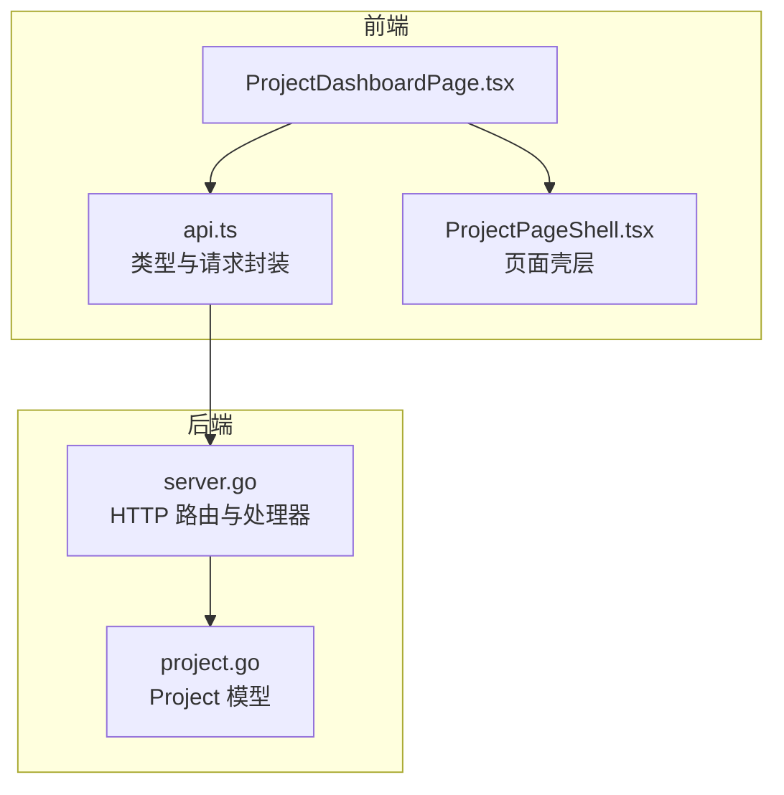
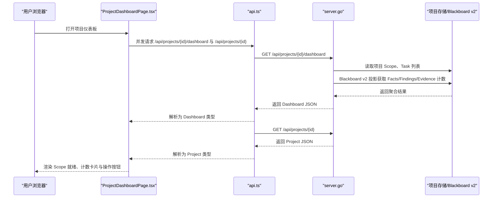
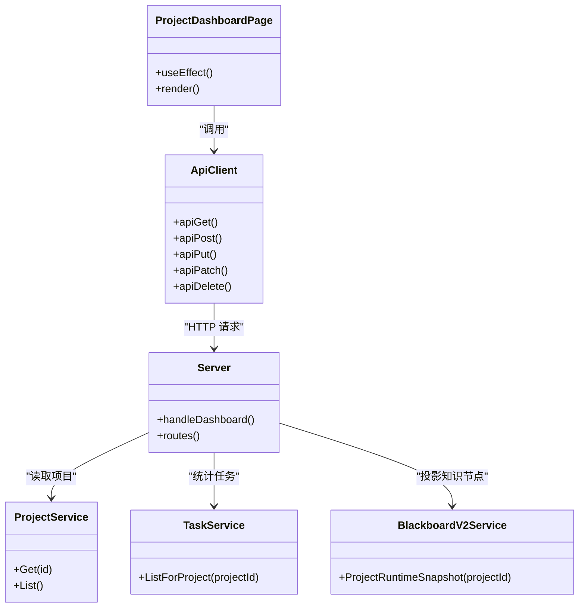

# 项目仪表板页面

<cite>
**本文引用的文件**   
- [ProjectDashboardPage.tsx](file://web/src/pages/ProjectDashboardPage.tsx)
- [api.ts](file://web/src/lib/api.ts)
- [server.go](file://internal/daemon/server.go)
- [project.go](file://internal/project/project.go)
- [ProjectPageShell.tsx](file://web/src/components/ProjectPageShell.tsx)
</cite>

## 目录
1. [简介](#简介)
2. [项目结构](#项目结构)
3. [核心组件](#核心组件)
4. [架构总览](#架构总览)
5. [详细组件分析](#详细组件分析)
6. [依赖关系分析](#依赖关系分析)
7. [性能考虑](#性能考虑)
8. [故障排查指南](#故障排查指南)
9. [结论](#结论)
10. [附录](#附录)

## 简介
本文件围绕“项目仪表板页面”的实现与使用进行系统化说明，覆盖以下目标：
- 项目概览信息展示：项目名称、描述、范围就绪状态、关键计数（任务、事实、发现、证据）等。
- 任务统计与项目状态监控：通过后端聚合接口返回的 Dashboard 数据驱动前端卡片与徽章。
- 数据聚合与实时更新：前端并行请求 Dashboard 与 Project 详情；后端从项目存储与 Blackboard v2 快照中汇总计数。
- 可视化组件实现：基于 React + Tailwind 的卡片、徽章、网格布局与交互按钮。
- 项目配置管理、权限控制与协作界面设计：鉴权头注入、静态资源放行、SPA 路由回退、项目级凭据绑定入口。
- 布局、数据绑定与用户交互示例：以源码路径引用方式给出关键实现位置。
- 与项目核心数据的同步机制：Dashboard 数据来源于项目 Scope、Task 列表与 Blackboard v2 投影。

## 项目结构
仪表板页面位于前端 React 应用，由页面组件、API 客户端类型定义与后端 HTTP 服务共同构成：
- 前端页面：ProjectDashboardPage.tsx 负责渲染仪表板 UI，调用 api.ts 中的类型化 API 方法获取数据。
- 前端壳层：ProjectPageShell.tsx 提供统一的项目页头部、导航与内容区布局。
- 后端服务：server.go 暴露 /api/projects/{id}/dashboard 接口，聚合 Scope、Task 计数与 Blackboard v2 知识节点计数。
- 项目模型：project.go 定义 Project 结构体，包含 Scope、Defaults、时间戳等字段。

图表来源
- [ProjectDashboardPage.tsx:1-200](file://web/src/pages/ProjectDashboardPage.tsx#L1-L200)
- [api.ts:1-535](file://web/src/lib/api.ts#L1-L535)
- [server.go:587-643](file://internal/daemon/server.go#L587-L643)
- [project.go:63-72](file://internal/project/project.go#L63-L72)

章节来源
- [ProjectDashboardPage.tsx:1-200](file://web/src/pages/ProjectDashboardPage.tsx#L1-L200)
- [api.ts:1-535](file://web/src/lib/api.ts#L1-L535)
- [server.go:587-643](file://internal/daemon/server.go#L587-L643)
- [project.go:63-72](file://internal/project/project.go#L63-L72)

## 核心组件
- 仪表板页面组件：加载并展示 Scope 就绪状态、各类资产数量、任务与知识节点计数，并提供跳转到任务创建、报告查看等操作的入口。
- API 客户端与类型：定义 Dashboard、Project、Scope 等数据结构，封装请求头（含鉴权）、错误提取与通用 GET/POST/PATCH/DELETE 方法。
- 后端仪表盘处理器：读取项目、计算 Scope 就绪标志、统计 Task 数量，并通过 Blackboard v2 投影获取 Facts/Findings/Evidence 计数。
- 页面壳层：统一项目页的顶部导航、标题与操作区布局，确保多页面一致性。

章节来源
- [ProjectDashboardPage.tsx:20-161](file://web/src/pages/ProjectDashboardPage.tsx#L20-L161)
- [api.ts:83-97](file://web/src/lib/api.ts#L83-L97)
- [api.ts:101-152](file://web/src/lib/api.ts#L101-L152)
- [server.go:1131-1208](file://internal/daemon/server.go#L1131-L1208)
- [ProjectPageShell.tsx:20-84](file://web/src/components/ProjectPageShell.tsx#L20-L84)

## 架构总览
仪表板的数据流遵循“前端页面 → API 客户端 → 后端路由 → 服务聚合 → 响应 JSON”的链路。前端在组件挂载时并发请求 Dashboard 与 Project 详情，后端根据项目 ID 查询项目、统计任务数，并从 Blackboard v2 投影中汇总知识节点计数，最终返回给前端渲染。

图表来源
- [ProjectDashboardPage.tsx:27-45](file://web/src/pages/ProjectDashboardPage.tsx#L27-L45)
- [api.ts:83-97](file://web/src/lib/api.ts#L83-L97)
- [server.go:1131-1208](file://internal/daemon/server.go#L1131-L1208)

## 详细组件分析

### 前端仪表板页面（ProjectDashboardPage.tsx）
- 数据加载：组件在 projectId 变化时触发 useEffect，并发请求 Dashboard 与 Project 详情，处理 loading/error 状态。
- 范围就绪：根据 dash.scope.ready 显示不同徽章与提示文案，引导用户完善范围资产。
- 计数卡片：Tasks/Facts/Findings/Evidence 四个卡片分别链接到对应页面，便于快速导航。
- 交互入口：提供“启动任务”和“打开报告”按钮，提升操作效率。
- 布局与样式：使用 Card、Badge、Grid 等组件构建响应式布局，结合 Tailwind 类名实现视觉反馈。

章节来源
- [ProjectDashboardPage.tsx:20-161](file://web/src/pages/ProjectDashboardPage.tsx#L20-L161)

### API 客户端与类型（api.ts）
- 请求封装：request() 统一处理 fetch、错误提取、JSON 解码与 204 无内容响应。
- 鉴权头：requestHeaders() 自动注入 Authorization Bearer token，支持 URL 参数或 sessionStorage 持久化。
- 类型定义：Dashboard、Project、Scope、Task、RuntimeProfile 等接口严格匹配后端 Go 结构体，保障前后端契约一致。
- 错误处理：extractErrorMessage() 兼容 daemon 控制错误与 Blackboard v2 结构化错误，提取 code/message/path 等信息。

章节来源
- [api.ts:20-52](file://web/src/lib/api.ts#L20-L52)
- [api.ts:65-81](file://web/src/lib/api.ts#L65-L81)
- [api.ts:101-152](file://web/src/lib/api.ts#L101-L152)
- [api.ts:515-535](file://web/src/lib/api.ts#L515-L535)

### 后端仪表盘处理器（server.go）
- 路由注册：/api/projects/{id}/dashboard 映射到 handleDashboard。
- 数据聚合：
  - 读取项目 Scope，计算 domains/ips/cidrs/urls/ports/excluded 数量。
  - 判断 ready：当存在至少一个命名资产（domain/ip/cidr/url/port）时为 true。
  - 统计 tasks 数量：通过 server.tasks.ListForProject 获取。
  - 统计 facts/findings/evidence：通过 Blackboard v2 投影读取 Knowledge 集合长度。
- 响应结构：返回包含 project_id/name/scope/counts 的 JSON 对象，供前端渲染。

章节来源
- [server.go:587-643](file://internal/daemon/server.go#L587-L643)
- [server.go:1131-1208](file://internal/daemon/server.go#L1131-L1208)

### 项目模型（project.go）
- Project 结构体：包含 id/name/description/kind/scope/defaults/created_at/updated_at 字段。
- Scope 结构：用于定义测试范围资产、排除项、测试限制与备注，支撑 Dashboard 就绪逻辑。

章节来源
- [project.go:63-72](file://internal/project/project.go#L63-L72)

### 页面壳层（ProjectPageShell.tsx）
- 统一布局：提供 sticky 顶部导航、BackLink、ProjectNav、标题与操作区，确保项目内各页面风格一致。
- 可配置性：支持 title/description/actions/children/bodyClassName/hideChrome 等属性，灵活适配不同页面需求。

章节来源
- [ProjectPageShell.tsx:20-84](file://web/src/components/ProjectPageShell.tsx#L20-L84)

## 依赖关系分析
仪表板页面的依赖关系清晰分层：
- 前端页面依赖 API 客户端类型与请求方法。
- API 客户端依赖全局鉴权与错误处理逻辑。
- 后端处理器依赖项目服务、任务服务与 Blackboard v2 服务。
- 所有数据源最终指向持久化存储（SQLite）与 Blackboard v2 投影。

图表来源
- [ProjectDashboardPage.tsx:20-161](file://web/src/pages/ProjectDashboardPage.tsx#L20-L161)
- [api.ts:83-97](file://web/src/lib/api.ts#L83-L97)
- [server.go:1131-1208](file://internal/daemon/server.go#L1131-L1208)

章节来源
- [ProjectDashboardPage.tsx:20-161](file://web/src/pages/ProjectDashboardPage.tsx#L20-L161)
- [api.ts:83-97](file://web/src/lib/api.ts#L83-L97)
- [server.go:1131-1208](file://internal/daemon/server.go#L1131-L1208)

## 性能考虑
- 并发请求：前端使用 Promise.all 并发获取 Dashboard 与 Project 详情，减少首屏等待时间。
- 最小化数据：后端仅返回必要的计数与就绪标志，避免传输冗余字段。
- 缓存策略：后端可使用 ETag/Cache-Control 优化重复请求（当前实现未显式设置，可在后续增强）。
- 错误快速失败：前端在请求失败时立即显示错误卡片，避免长时间 loading 状态。

[本节为通用指导，无需特定文件引用]

## 故障排查指南
- 鉴权失败：检查浏览器是否携带 Authorization 头或 URL 参数 token；确认后端 AuthToken 配置与非 loopback 绑定要求。
- 数据为空：确认项目是否存在、Scope 是否配置了有效资产；检查 Blackboard v2 服务是否可用。
- 路由问题：确认 SPA 路由是否正确转发至 index.html；检查 /api/ 前缀是否被正确拦截。
- 错误消息：前端 extractErrorMessage() 会解析后端结构化错误，优先显示 code:message 格式。

章节来源
- [server.go:435-461](file://internal/daemon/server.go#L435-L461)
- [api.ts:515-535](file://web/src/lib/api.ts#L515-L535)

## 结论
项目仪表板页面通过简洁的前端组件与健壮的后端聚合接口，实现了项目概览、任务统计与状态监控的核心功能。其数据流清晰、错误处理完善、布局响应式，为渗透测试代理提供了直观的操作入口。未来可进一步增强缓存策略、实时推送与更丰富的可视化图表。

[本节为总结性内容，无需特定文件引用]

## 附录
- 相关文档参考：
  - Blackboard Read Projections 规范定义了 Dashboard 摘要的结构与语义。
  - Daemon 路由与安全策略确保本地开发与生产部署的安全性。
  - 前端类型定义与后端结构体保持严格对齐，降低集成风险。

[本节为补充信息，无需特定文件引用]