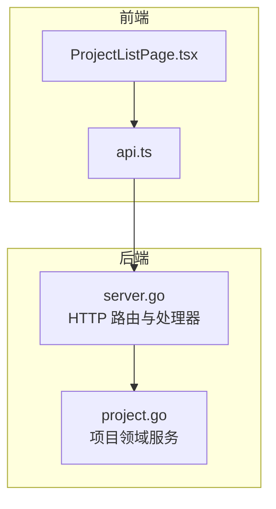
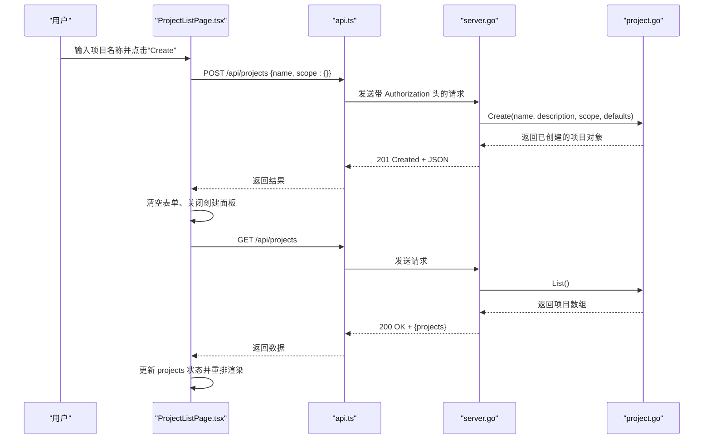
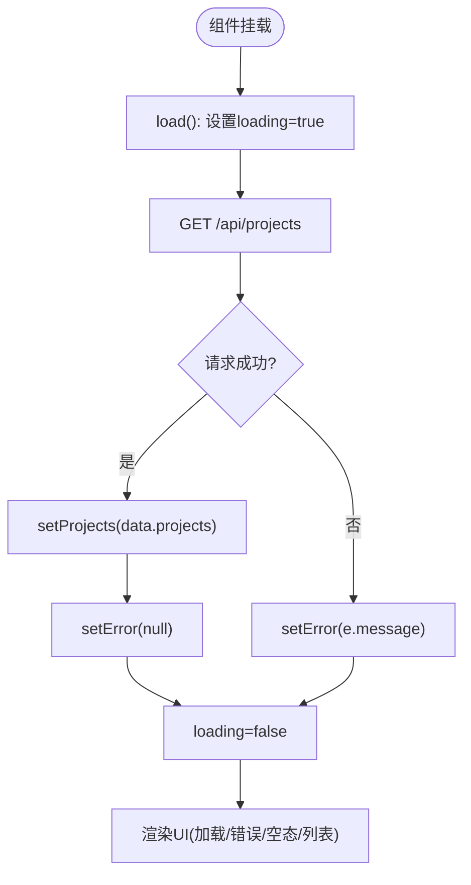
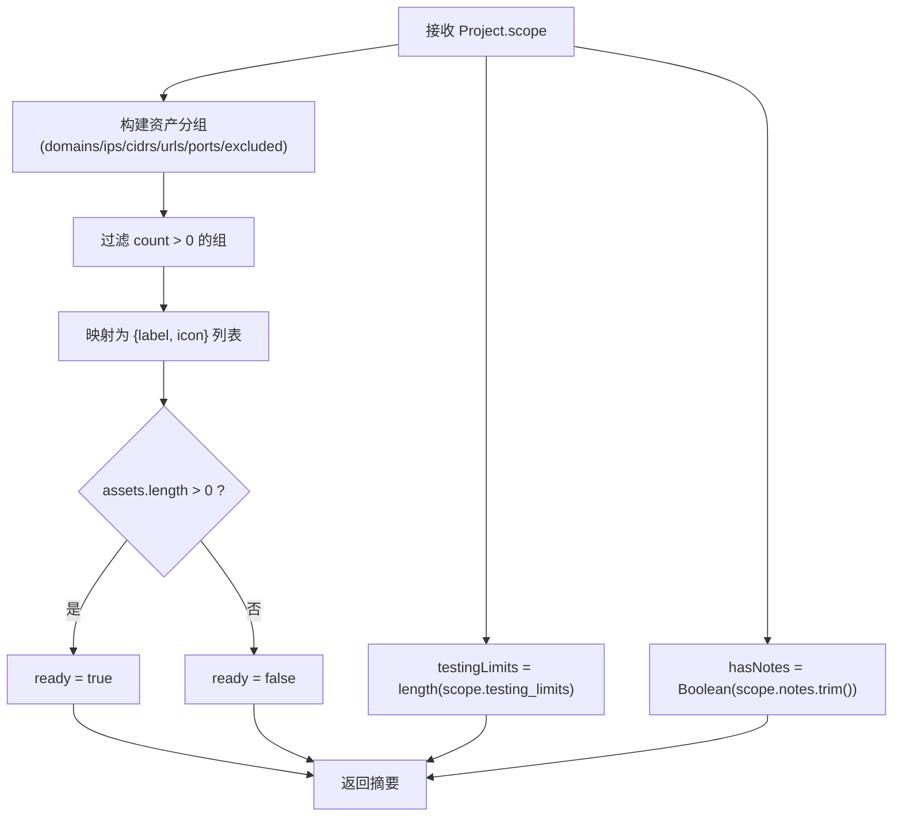
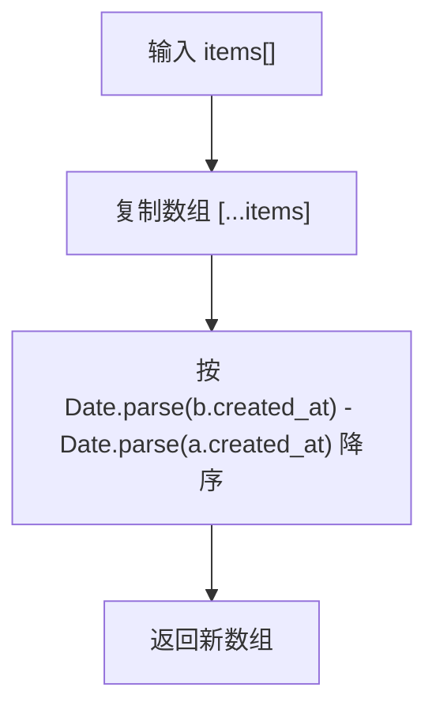
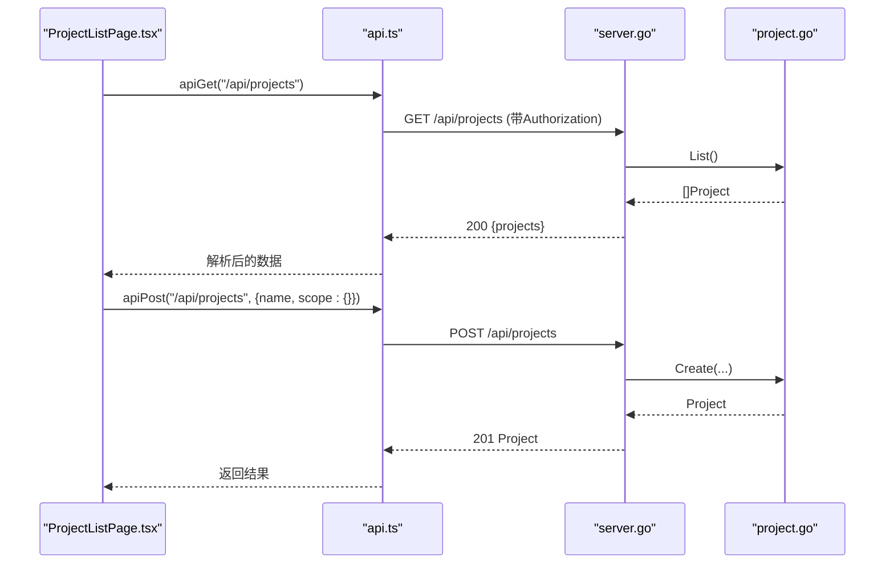
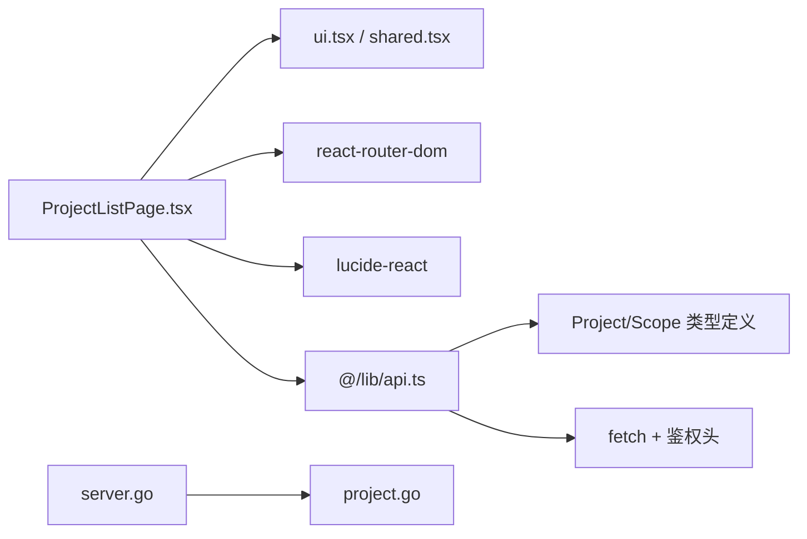

# 项目列表页面

<cite>
**本文引用的文件**
- [ProjectListPage.tsx](file://web/src/pages/ProjectListPage.tsx)
- [api.ts](file://web/src/lib/api.ts)
- [server.go](file://internal/daemon/server.go)
- [project.go](file://internal/project/project.go)
</cite>

## 目录
1. [简介](#简介)
2. [项目结构](#项目结构)
3. [核心组件](#核心组件)
4. [架构总览](#架构总览)
5. [详细组件分析](#详细组件分析)
6. [依赖关系分析](#依赖关系分析)
7. [性能与体验优化](#性能与体验优化)
8. [故障排查指南](#故障排查指南)
9. [结论](#结论)

## 简介
本文件聚焦“项目列表页面”的实现与工作机制，覆盖以下关键主题：
- 项目卡片展示、创建表单与状态管理
- 数据获取、错误处理与用户交互流程
- 排序逻辑、范围摘要显示与响应式布局
- 项目 CRUD 操作示例（含代码片段路径）
- 与后端 API 的集成方式与实时状态更新机制

## 项目结构
前端侧由 React 页面组件与统一 API 客户端组成；后端由 Daemon HTTP 服务与项目领域服务构成。整体链路如下：
- 前端页面发起 GET/POST 请求到 /api/projects
- Daemon 路由分发至项目处理器，调用项目服务进行持久化读写
- 返回 JSON 响应，前端解析并更新 UI



图表来源
- [ProjectListPage.tsx:1-234](file://web/src/pages/ProjectListPage.tsx#L1-L234)
- [api.ts:80-98](file://web/src/lib/api.ts#L80-L98)
- [server.go:675-715](file://internal/daemon/server.go#L675-L715)
- [project.go:98-171](file://internal/project/project.go#L98-L171)

章节来源
- [ProjectListPage.tsx:1-234](file://web/src/pages/ProjectListPage.tsx#L1-L234)
- [api.ts:1-535](file://web/src/lib/api.ts#L1-L535)
- [server.go:675-874](file://internal/daemon/server.go#L675-L874)
- [project.go:63-247](file://internal/project/project.go#L63-L247)

## 核心组件
- 页面组件 ProjectListPage：负责加载项目列表、渲染空态/错误态/加载态、提供新建项目表单、按时间倒序排列并渲染项目卡片。
- 项目卡片 ProjectCard：将单个项目的范围摘要以徽章形式呈现，并提供导航链接进入项目详情。
- 范围摘要 projectScopeSummary：根据 scope 字段计算 ready 状态、资产标签、测试限制数量与备注标记。
- 工具函数 sortNewestFirst：基于 created_at 字段进行降序排序。
- API 客户端 api.ts：封装 fetch 请求、鉴权头注入、错误提取与类型定义（Project、Scope 等）。

章节来源
- [ProjectListPage.tsx:8-135](file://web/src/pages/ProjectListPage.tsx#L8-L135)
- [ProjectListPage.tsx:137-194](file://web/src/pages/ProjectListPage.tsx#L137-L194)
- [ProjectListPage.tsx:196-233](file://web/src/pages/ProjectListPage.tsx#L196-L233)
- [api.ts:100-129](file://web/src/lib/api.ts#L100-L129)
- [api.ts:80-98](file://web/src/lib/api.ts#L80-L98)

## 架构总览
下图展示了从用户点击“新建项目”到列表刷新更新的完整时序。



图表来源
- [ProjectListPage.tsx:37-46](file://web/src/pages/ProjectListPage.tsx#L37-L46)
- [ProjectListPage.tsx:15-26](file://web/src/pages/ProjectListPage.tsx#L15-L26)
- [api.ts:86-88](file://web/src/lib/api.ts#L86-L88)
- [server.go:675-699](file://internal/daemon/server.go#L675-L699)
- [server.go:701-715](file://internal/daemon/server.go#L701-L715)
- [project.go:98-138](file://internal/project/project.go#L98-L138)
- [project.go:150-171](file://internal/project/project.go#L150-L171)

## 详细组件分析

### 页面组件 ProjectListPage
- 状态管理
  - projects：项目列表
  - error：错误消息
  - loading：加载标志
  - creating：是否显示创建表单
  - name：表单输入值
- 生命周期与数据流
  - 挂载时立即调用 load() 拉取列表
  - 成功时清空错误并设置列表
  - 失败时将错误信息写入 error 状态
- 创建流程
  - 校验 name 非空后提交 POST /api/projects
  - 成功后重置表单、隐藏创建面板并重新拉取列表
- 渲染分支
  - 加载中：显示占位卡片
  - 有错误且未加载中：显示错误卡片
  - 无项目且无错误：显示空态引导
  - 正常：按时间倒序渲染项目卡片网格



图表来源
- [ProjectListPage.tsx:15-26](file://web/src/pages/ProjectListPage.tsx#L15-L26)
- [ProjectListPage.tsx:28-35](file://web/src/pages/ProjectListPage.tsx#L28-L35)
- [ProjectListPage.tsx:85-133](file://web/src/pages/ProjectListPage.tsx#L85-L133)

章节来源
- [ProjectListPage.tsx:8-135](file://web/src/pages/ProjectListPage.tsx#L8-L135)

### 项目卡片 ProjectCard
- 功能要点
  - 通过 Link 跳转到项目详情页
  - 使用 projectScopeSummary 生成范围摘要
  - 根据 ready 状态显示不同徽章（准备就绪/需要范围）
  - 展示资产类别（域名/IP/CIDR/URL/端口/排除项）、测试限制与备注标记
- 可访问性与交互
  - 为卡片外层 Link 添加 aria-label
  - 支持键盘焦点可见样式与减少动效适配

```mermaid
classDiagram
class ProjectCard {
+project : Project
+render() JSX
}
class ScopeSummary {
+ready : boolean
+assets : {label, icon}[]
+testingLimits : number
+hasNotes : boolean
}
ProjectCard --> ScopeSummary : "计算范围摘要"
```

图表来源
- [ProjectListPage.tsx:137-194](file://web/src/pages/ProjectListPage.tsx#L137-L194)
- [ProjectListPage.tsx:196-219](file://web/src/pages/ProjectListPage.tsx#L196-L219)

章节来源
- [ProjectListPage.tsx:137-194](file://web/src/pages/ProjectListPage.tsx#L137-L194)

### 范围摘要 projectScopeSummary
- 输入：Project.scope
- 输出：包含 ready、assets、testingLimits、hasNotes 的结构体
- 规则
  - assets 仅展示计数大于 0 的类别
  - ready 为 true 当存在至少一个资产类别
  - testingLimits 来自 scope.testing_limits 长度
  - hasNotes 来自 notes 是否为非空字符串



图表来源
- [ProjectListPage.tsx:196-219](file://web/src/pages/ProjectListPage.tsx#L196-L219)

章节来源
- [ProjectListPage.tsx:196-219](file://web/src/pages/ProjectListPage.tsx#L196-L219)

### 排序逻辑 sortNewestFirst
- 依据 created_at 字符串解析为时间戳，按降序排列
- 不修改原数组，返回新数组以避免副作用



图表来源
- [ProjectListPage.tsx:231-233](file://web/src/pages/ProjectListPage.tsx#L231-L233)

章节来源
- [ProjectListPage.tsx:231-233](file://web/src/pages/ProjectListPage.tsx#L231-L233)

### 响应式布局
- 使用 Tailwind 栅格实现多列布局：小屏单列，中屏两列，大屏三列
- 卡片内采用 flex-wrap 与 gap 控制徽章换行与间距
- 标题与描述在窄屏下自动截断，保证可读性

章节来源
- [ProjectListPage.tsx:128-133](file://web/src/pages/ProjectListPage.tsx#L128-L133)
- [ProjectListPage.tsx:167-190](file://web/src/pages/ProjectListPage.tsx#L167-L190)

### 与后端 API 的集成
- 列表获取
  - 前端：GET /api/projects
  - 后端：handleListProjects -> project.List -> 返回 {projects}
- 项目创建
  - 前端：POST /api/projects {name, scope:{}}
  - 后端：handleCreateProject -> project.Create -> 返回已创建项目
- 鉴权与错误
  - 前端统一在 requestHeaders 中注入 Authorization: Bearer <token>
  - 非 2xx 响应抛出 ApiError，并尝试从 body 中提取结构化错误消息



图表来源
- [ProjectListPage.tsx:15-26](file://web/src/pages/ProjectListPage.tsx#L15-L26)
- [ProjectListPage.tsx:37-46](file://web/src/pages/ProjectListPage.tsx#L37-L46)
- [api.ts:80-98](file://web/src/lib/api.ts#L80-L98)
- [server.go:675-715](file://internal/daemon/server.go#L675-L715)
- [project.go:98-171](file://internal/project/project.go#L98-L171)

章节来源
- [api.ts:80-98](file://web/src/lib/api.ts#L80-L98)
- [server.go:675-715](file://internal/daemon/server.go#L675-L715)
- [project.go:98-171](file://internal/project/project.go#L98-L171)

### 错误处理
- 网络层
  - 非 2xx 响应构造 ApiError，携带 status 与 body
  - 尝试从 body.error 或嵌套 error.code/message/path 提取人类可读消息
- 业务层
  - 缺少名称、不存在等错误在后端转换为对应 HTTP 状态码
- 前端展示
  - 列表页在 error 非空且未加载中时显示错误卡片

章节来源
- [api.ts:20-39](file://web/src/lib/api.ts#L20-L39)
- [api.ts:515-534](file://web/src/lib/api.ts#L515-L534)
- [server.go:675-715](file://internal/daemon/server.go#L675-L715)
- [ProjectListPage.tsx:95-107](file://web/src/pages/ProjectListPage.tsx#L95-L107)

### 用户交互流程
- 打开页面：自动加载列表
- 点击“New project”：展开创建表单
- 填写名称并提交：创建成功后刷新列表
- 点击项目卡片：跳转至项目详情页

章节来源
- [ProjectListPage.tsx:28-35](file://web/src/pages/ProjectListPage.tsx#L28-L35)
- [ProjectListPage.tsx:57-83](file://web/src/pages/ProjectListPage.tsx#L57-L83)
- [ProjectListPage.tsx:128-133](file://web/src/pages/ProjectListPage.tsx#L128-L133)

## 依赖关系分析
- 页面组件依赖
  - react-router-dom 的 Link 用于导航
  - lucide-react 图标用于视觉表达
  - 自定义 UI 组件 Badge/Button/Card/Input/Label
  - 共享容器 PageContainer
- 数据模型
  - Project、Scope、ProjectDefaults 等类型定义位于 api.ts，与后端 Go 结构体保持同构
- 后端依赖
  - server.go 路由绑定 /api/projects 相关处理器
  - project.go 提供 Create/List/Update/Get 等方法



图表来源
- [ProjectListPage.tsx:1-6](file://web/src/pages/ProjectListPage.tsx#L1-L6)
- [api.ts:100-129](file://web/src/lib/api.ts#L100-L129)
- [server.go:675-715](file://internal/daemon/server.go#L675-L715)
- [project.go:98-171](file://internal/project/project.go#L98-L171)

章节来源
- [ProjectListPage.tsx:1-6](file://web/src/pages/ProjectListPage.tsx#L1-L6)
- [api.ts:100-129](file://web/src/lib/api.ts#L100-L129)
- [server.go:675-715](file://internal/daemon/server.go#L675-L715)
- [project.go:98-171](file://internal/project/project.go#L98-L171)

## 性能与体验优化
- 排序复杂度
  - sortNewestFirst 对 n 个项目执行 O(n log n) 比较，适合当前规模
- 渲染优化
  - 列表 key 使用唯一 id，避免不必要的重渲染
  - 仅在必要时切换 creating/loading/error 分支，减少 DOM 抖动
- 网络优化建议
  - 可在创建成功后直接插入新项到本地列表，再异步刷新，提升即时反馈
  - 考虑对列表接口增加分页或增量更新（如 WebSocket/SSE），实现真正的实时状态更新

[本节为通用指导，无需源码引用]

## 故障排查指南
- 无法加载项目列表
  - 检查浏览器控制台是否有 ApiError，确认后端 /api/projects 可达
  - 确认 URL 参数或 sessionStorage 中的 token 是否正确注入到 Authorization 头
- 创建项目失败
  - 若提示缺少名称，请确保 name 非空
  - 查看后端返回的错误消息，定位具体原因（如存储异常）
- 范围摘要显示异常
  - 确认 scope 字段结构是否符合预期（domains/ips/cidrs/urls/ports/excluded/testing_limits/notes）
  - 检查 notes 是否为空字符串导致 hasNotes 为 false

章节来源
- [api.ts:20-39](file://web/src/lib/api.ts#L20-L39)
- [api.ts:65-81](file://web/src/lib/api.ts#L65-L81)
- [server.go:675-715](file://internal/daemon/server.go#L675-L715)
- [ProjectListPage.tsx:95-107](file://web/src/pages/ProjectListPage.tsx#L95-L107)

## 结论
项目列表页面通过清晰的组件拆分与统一的 API 客户端，实现了稳定的数据获取、完善的错误处理与良好的用户体验。范围摘要与排序逻辑直观地帮助用户快速了解项目状态。后续可在实时通信与乐观更新方面进一步增强，以提升交互流畅度与一致性。