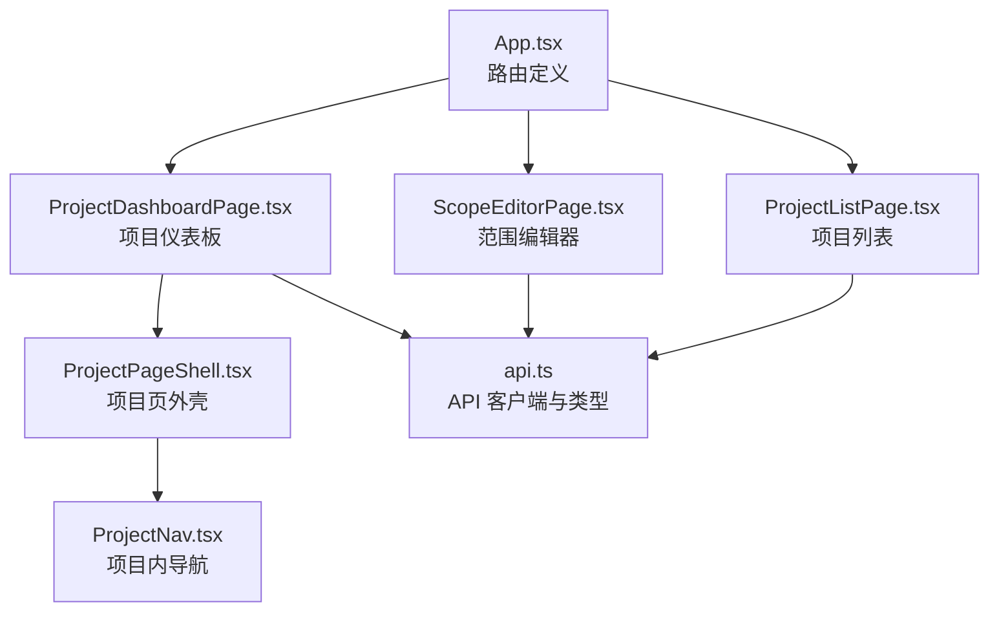
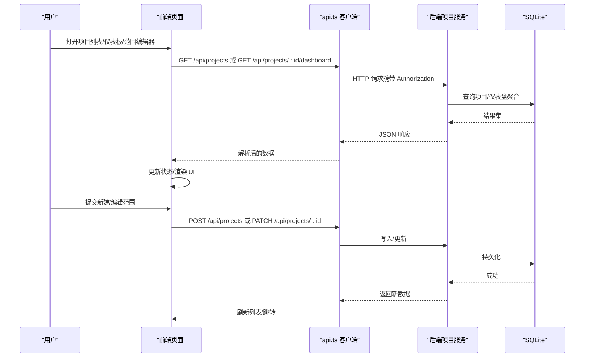
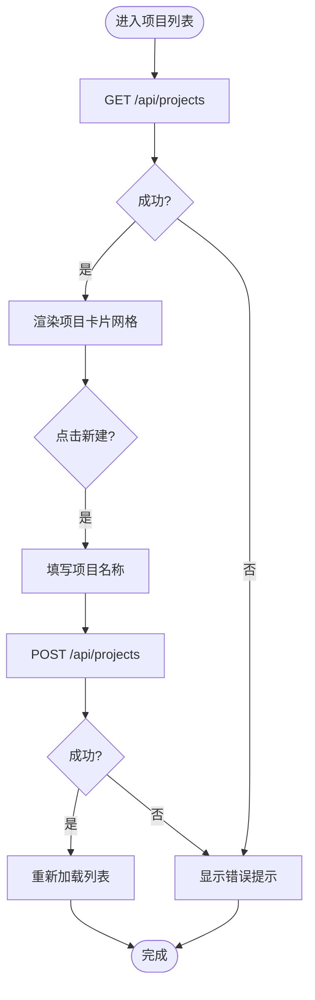
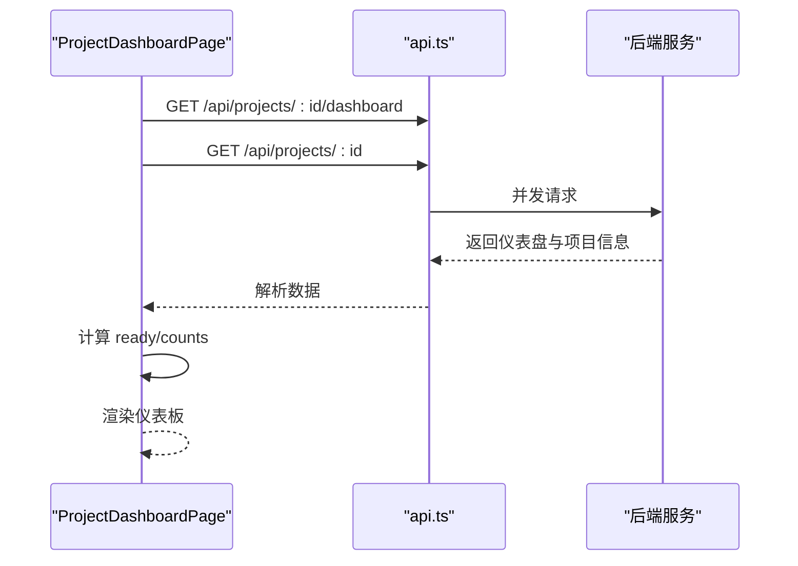
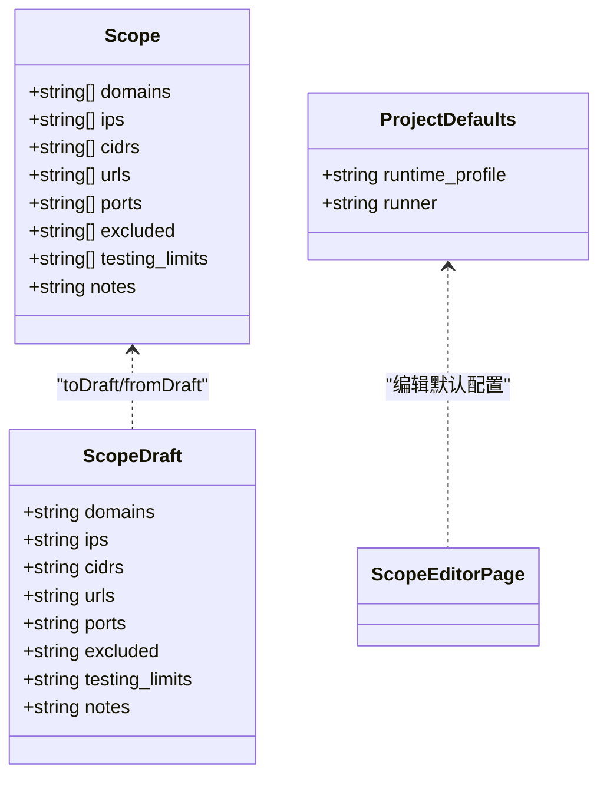
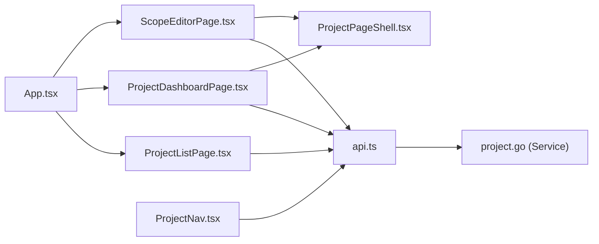

# 项目管理页面

<cite>
**本文引用的文件**   
- [ProjectListPage.tsx](file://web/src/pages/ProjectListPage.tsx)
- [ProjectDashboardPage.tsx](file://web/src/pages/ProjectDashboardPage.tsx)
- [ScopeEditorPage.tsx](file://web/src/pages/ScopeEditorPage.tsx)
- [api.ts](file://web/src/lib/api.ts)
- [ProjectNav.tsx](file://web/src/components/ProjectNav.tsx)
- [ProjectPageShell.tsx](file://web/src/components/ProjectPageShell.tsx)
- [App.tsx](file://web/src/App.tsx)
- [runtimeProfileKind.ts](file://web/src/pages/runtimeProfileKind.ts)
- [project.go](file://internal/project/project.go)
</cite>

## 目录
1. [简介](#简介)
2. [项目结构](#项目结构)
3. [核心组件](#核心组件)
4. [架构总览](#架构总览)
5. [详细组件分析](#详细组件分析)
6. [依赖关系分析](#依赖关系分析)
7. [性能考虑](#性能考虑)
8. [故障排查指南](#故障排查指南)
9. [结论](#结论)
10. [附录](#附录)

## 简介
本文件面向“项目管理相关页面”的完整文档，覆盖以下能力：
- 项目列表展示与创建（CRUD 中的 List、Create）
- 项目仪表板概览（范围就绪度、统计计数、快捷入口）
- 范围编辑器（范围字段编辑、默认运行配置、保存与导航）
- 权限控制与协作（鉴权头注入、运行时选择器）
- 数据同步机制（前端状态管理、错误处理、并发请求）
- 与后端项目 API 的集成方式（REST 端点、类型契约）

该实现由 React 前端（web/src）与 Go 后端（internal/project）共同构成，前端通过统一的 API 客户端访问后端服务。

## 项目结构
前端路由与页面组织：
- 根路由 / 映射到项目列表页
- 项目详情页 /projects/:projectId 映射到仪表板
- 项目范围编辑 /projects/:projectId/scope 映射到范围编辑器
- 项目内导航由 ProjectNav 提供（Overview/Tasks/Blackboard/Findings/Evidence/Report/Scope）

图表来源
- [App.tsx:317-344](file://web/src/App.tsx#L317-L344)
- [ProjectListPage.tsx:1-234](file://web/src/pages/ProjectListPage.tsx#L1-L234)
- [ProjectDashboardPage.tsx:1-200](file://web/src/pages/ProjectDashboardPage.tsx#L1-L200)
- [ScopeEditorPage.tsx:1-226](file://web/src/pages/ScopeEditorPage.tsx#L1-L226)
- [ProjectPageShell.tsx:1-84](file://web/src/components/ProjectPageShell.tsx#L1-L84)
- [ProjectNav.tsx:1-71](file://web/src/components/ProjectNav.tsx#L1-L71)
- [api.ts:1-535](file://web/src/lib/api.ts#L1-L535)

章节来源
- [App.tsx:317-344](file://web/src/App.tsx#L317-L344)

## 核心组件
- 项目列表页：加载项目列表、新建项目表单、错误提示、按创建时间倒序排序
- 项目仪表板：并行获取仪表盘和项目详情，展示范围就绪度、资产计数、任务/事实/发现/证据计数，并提供快速跳转
- 范围编辑器：以多行文本编辑范围字段，维护草稿并转换为后端 Scope 结构；同时编辑默认运行配置（运行时配置文件与 Runner）
- 项目内导航：根据项目 kind 动态显示不同菜单项（pentest/ctf_challenge）
- 统一 API 客户端：封装 fetch、自动注入 Authorization 头、统一错误提取与抛出 ApiError

章节来源
- [ProjectListPage.tsx:1-234](file://web/src/pages/ProjectListPage.tsx#L1-L234)
- [ProjectDashboardPage.tsx:1-200](file://web/src/pages/ProjectDashboardPage.tsx#L1-L200)
- [ScopeEditorPage.tsx:1-226](file://web/src/pages/ScopeEditorPage.tsx#L1-L226)
- [ProjectNav.tsx:1-71](file://web/src/components/ProjectNav.tsx#L1-L71)
- [api.ts:1-535](file://web/src/lib/api.ts#L1-L535)

## 架构总览
前后端交互采用 RESTful 风格，前端通过 api.ts 发起请求，后端由 Go 项目域 Service 提供持久化与业务规则。

图表来源
- [ProjectListPage.tsx:15-46](file://web/src/pages/ProjectListPage.tsx#L15-L46)
- [ProjectDashboardPage.tsx:27-45](file://web/src/pages/ProjectDashboardPage.tsx#L27-L45)
- [ScopeEditorPage.tsx:64-102](file://web/src/pages/ScopeEditorPage.tsx#L64-L102)
- [api.ts:20-97](file://web/src/lib/api.ts#L20-L97)
- [project.go:90-138](file://internal/project/project.go#L90-L138)
- [project.go:176-213](file://internal/project/project.go#L176-L213)

## 详细组件分析

### 项目列表页（ProjectListPage）
- 功能要点
  - 初始化时调用 GET /api/projects 拉取项目列表
  - 支持新建项目：POST /api/projects，提交 name 与空 scope
  - 错误处理：捕获网络/服务端错误并展示
  - 列表排序：按 created_at 倒序
  - 卡片展示：名称、描述、范围摘要（域名/IP/CIDR/URL/端口/排除）、测试限制与备注标记

- 关键流程
  - 加载：useEffect 触发 load()，设置 loading/error 状态
  - 创建：校验非空后提交，成功后清空输入并重新加载
  - 渲染：空状态、加载中、错误态、项目卡片网格

图表来源
- [ProjectListPage.tsx:15-46](file://web/src/pages/ProjectListPage.tsx#L15-L46)
- [ProjectListPage.tsx:128-134](file://web/src/pages/ProjectListPage.tsx#L128-L134)
- [ProjectListPage.tsx:196-233](file://web/src/pages/ProjectListPage.tsx#L196-L233)

章节来源
- [ProjectListPage.tsx:1-234](file://web/src/pages/ProjectListPage.tsx#L1-L234)

### 项目仪表板（ProjectDashboardPage）
- 功能要点
  - 并行请求：GET /api/projects/:projectId/dashboard 与 GET /api/projects/:projectId
  - 展示范围就绪度（ready）、各类型资产数量、是否有测试限制与备注
  - 统计计数：Tasks/Facts/Findings/Evidence
  - 快捷操作：跳转到“Launch task”、“Edit scope”、“Open report”等

- 关键流程
  - useEffect 监听 projectId，并发请求 dashboard 与 project
  - 错误与加载态处理
  - 渲染范围就绪卡片与统计卡片

图表来源
- [ProjectDashboardPage.tsx:27-45](file://web/src/pages/ProjectDashboardPage.tsx#L27-L45)
- [ProjectDashboardPage.tsx:82-160](file://web/src/pages/ProjectDashboardPage.tsx#L82-L160)
- [api.ts:83-97](file://web/src/lib/api.ts#L83-L97)

章节来源
- [ProjectDashboardPage.tsx:1-200](file://web/src/pages/ProjectDashboardPage.tsx#L1-L200)

### 范围编辑器（ScopeEditorPage）
- 功能要点
  - 读取项目与运行时配置文件列表
  - 将后端 Scope 转为多行文本草稿（domains/ips/cidrs/urls/ports/excluded/testing_limits/notes）
  - 编辑默认运行配置：runtime_profile 与 runner（sandbox/host）
  - 保存：PATCH /api/projects/:id，提交 scope 与 defaults
  - 保存成功后导航回项目仪表板

- 数据结构转换
  - toDraft：数组转多行字符串
  - fromDraft：多行字符串转数组，过滤空行与空白

图表来源
- [ScopeEditorPage.tsx:21-51](file://web/src/pages/ScopeEditorPage.tsx#L21-L51)
- [ScopeEditorPage.tsx:84-102](file://web/src/pages/ScopeEditorPage.tsx#L84-L102)
- [api.ts:112-129](file://web/src/lib/api.ts#L112-L129)

章节来源
- [ScopeEditorPage.tsx:1-226](file://web/src/pages/ScopeEditorPage.tsx#L1-L226)
- [runtimeProfileKind.ts:1-9](file://web/src/pages/runtimeProfileKind.ts#L1-L9)

### 项目内导航（ProjectNav）
- 功能要点
  - 根据项目 kind 动态切换菜单项（pentest 显示 Findings/Report，ctf_challenge 显示 Solution）
  - 使用 NavLink 高亮当前项，提供 Overview/Tasks/Blackboard/Findings-or-Solution/Evidence/Report/Scope

章节来源
- [ProjectNav.tsx:1-71](file://web/src/components/ProjectNav.tsx#L1-L71)

### 项目页外壳（ProjectPageShell）
- 功能要点
  - 统一的项目页布局：顶部“返回所有项目”链接与 ProjectNav
  - 可选标题、描述、动作按钮区域
  - 内容区 children

章节来源
- [ProjectPageShell.tsx:1-84](file://web/src/components/ProjectPageShell.tsx#L1-L84)

### API 客户端与类型（api.ts）
- 功能要点
  - request 封装 fetch，统一设置 Content-Type 与 Authorization 头
  - 从 URL 参数或 sessionStorage 中获取 token，注入 Authorization
  - 错误处理：解析结构化错误体，抛出 ApiError（包含 status/body）
  - 类型定义：Project、Scope、Dashboard、RuntimeProfile、Task 等

章节来源
- [api.ts:20-97](file://web/src/lib/api.ts#L20-L97)
- [api.ts:101-152](file://web/src/lib/api.ts#L101-L152)
- [api.ts:515-535](file://web/src/lib/api.ts#L515-L535)

### 后端项目域（project.go）
- 功能要点
  - Scope/Defaults/Project 模型定义与 JSON 序列化
  - Service 提供 Create/CreateWithKind/List/Get/Update
  - Update 支持部分更新：仅当 scopeTouched/defaultsTouched 为真时才覆盖对应字段
  - 错误：ErrNotFound、ErrInvalidKind、ErrMissingName

章节来源
- [project.go:20-72](file://internal/project/project.go#L20-L72)
- [project.go:90-138](file://internal/project/project.go#L90-L138)
- [project.go:176-213](file://internal/project/project.go#L176-L213)
- [project.go:219-247](file://internal/project/project.go#L219-L247)

## 依赖关系分析
- 前端页面依赖 api.ts 进行数据获取与提交
- 项目仪表板与范围编辑器均依赖 ProjectPageShell 提供统一布局
- 项目内导航依赖路由参数与项目 kind
- 后端 project.Service 依赖 store.DB 进行持久化

图表来源
- [ProjectListPage.tsx:1-234](file://web/src/pages/ProjectListPage.tsx#L1-L234)
- [ProjectDashboardPage.tsx:1-200](file://web/src/pages/ProjectDashboardPage.tsx#L1-L200)
- [ScopeEditorPage.tsx:1-226](file://web/src/pages/ScopeEditorPage.tsx#L1-L226)
- [ProjectPageShell.tsx:1-84](file://web/src/components/ProjectPageShell.tsx#L1-L84)
- [ProjectNav.tsx:1-71](file://web/src/components/ProjectNav.tsx#L1-L71)
- [api.ts:1-535](file://web/src/lib/api.ts#L1-L535)
- [project.go:1-259](file://internal/project/project.go#L1-L259)

章节来源
- [App.tsx:317-344](file://web/src/App.tsx#L317-L344)

## 性能考虑
- 并发请求：仪表板页面使用 Promise.all 并发获取 dashboard 与 project，减少首屏等待
- 局部状态更新：列表页在创建成功后仅重新加载必要数据
- 避免重复渲染：ProjectPageShell 提供稳定布局，减少重排
- 错误快速失败：ApiError 携带状态码与消息，便于前端快速反馈

[本节为通用指导，不直接分析具体文件]

## 故障排查指南
- 常见错误
  - 未授权：检查 URL 是否包含 token 参数或 sessionStorage 中是否存在 pentest.authToken
  - 网络错误：确认 base URL 与后端服务可达
  - 参数校验失败：项目名不能为空；kind 必须在允许集合内
- 定位方法
  - 查看 ApiError.status 与 body.error 消息
  - 检查浏览器控制台与网络面板的请求/响应
  - 后端日志关注 ErrMissingName、ErrInvalidKind、ErrNotFound

章节来源
- [api.ts:20-39](file://web/src/lib/api.ts#L20-L39)
- [api.ts:515-535](file://web/src/lib/api.ts#L515-L535)
- [project.go:74-79](file://internal/project/project.go#L74-L79)
- [project.go:249-250](file://internal/project/project.go#L249-L250)

## 结论
本项目的前端项目管理页面通过清晰的组件划分与统一的 API 客户端，实现了项目列表、仪表板与范围编辑的核心能力。后端 project.Service 提供了稳健的领域模型与持久化逻辑。整体架构具备较好的可维护性与扩展性，适合进一步增加权限控制、协作与实时状态更新等高级特性。

[本节为总结性内容，不直接分析具体文件]

## 附录
- 路由参考
  - / → 项目列表
  - /projects/:projectId → 项目仪表板
  - /projects/:projectId/scope → 范围编辑器
- 常用 API
  - GET /api/projects
  - POST /api/projects
  - GET /api/projects/:id/dashboard
  - GET /api/projects/:id
  - PATCH /api/projects/:id

章节来源
- [App.tsx:317-344](file://web/src/App.tsx#L317-L344)
- [api.ts:83-97](file://web/src/lib/api.ts#L83-L97)