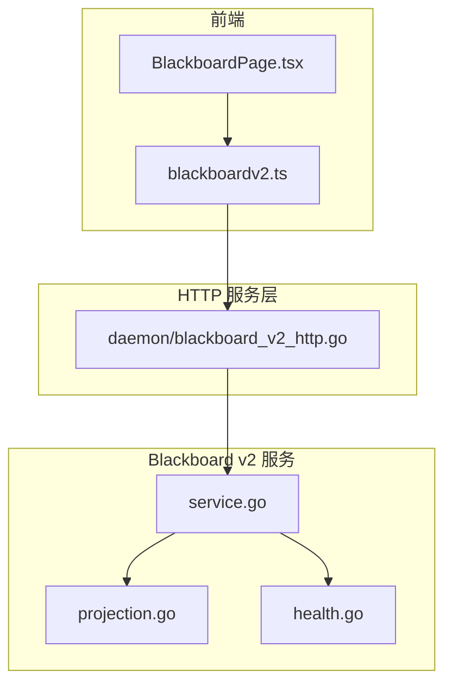
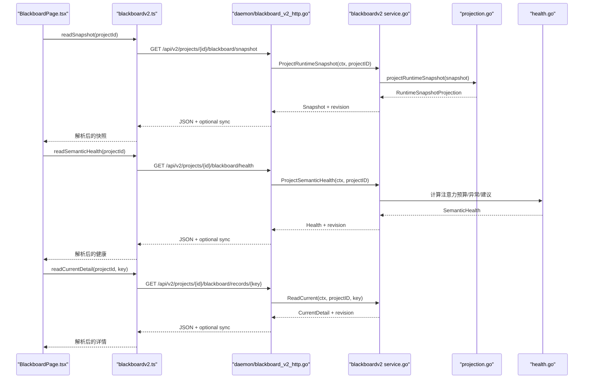
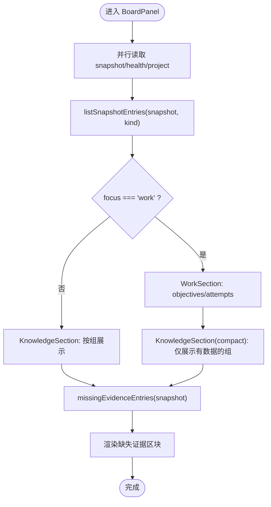
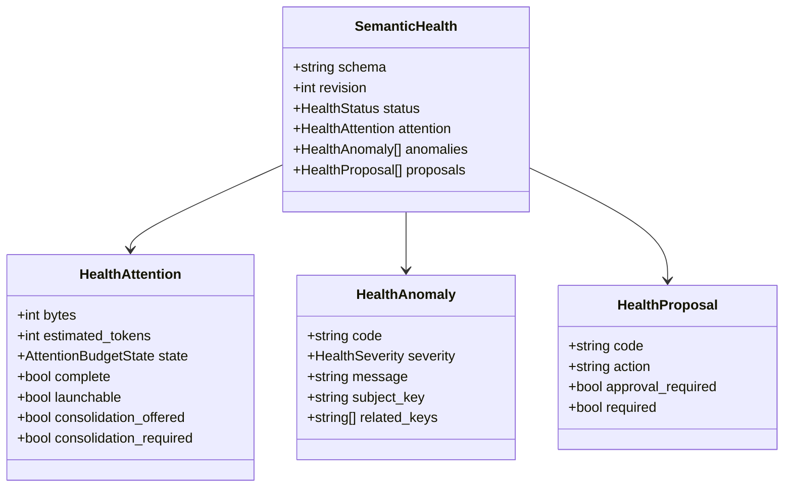
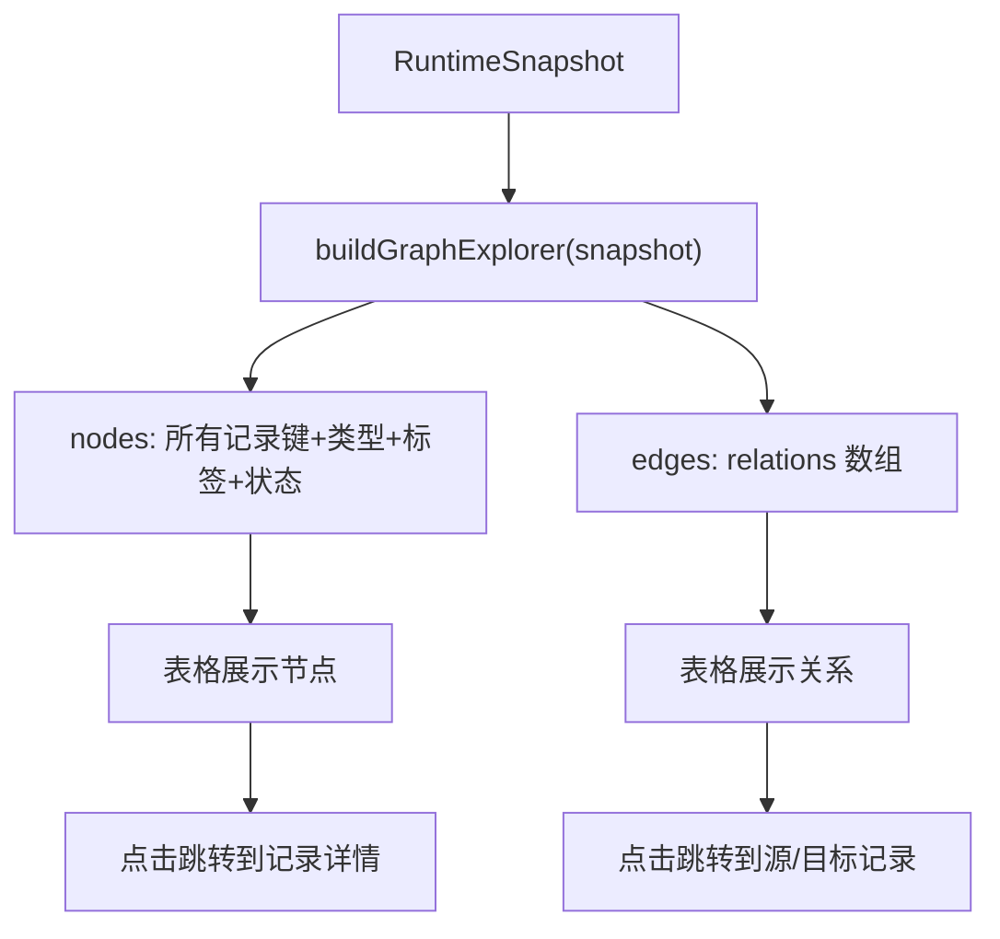
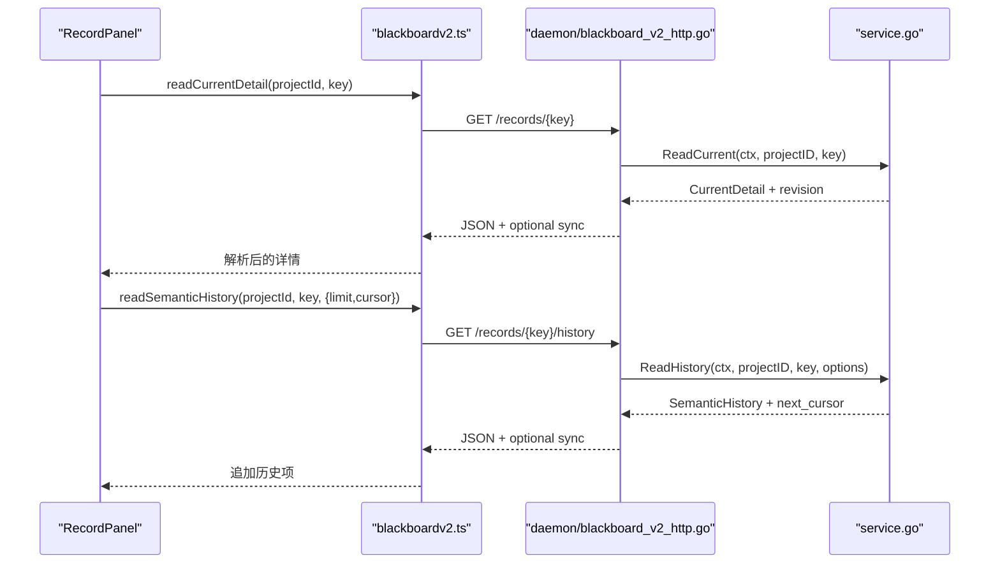
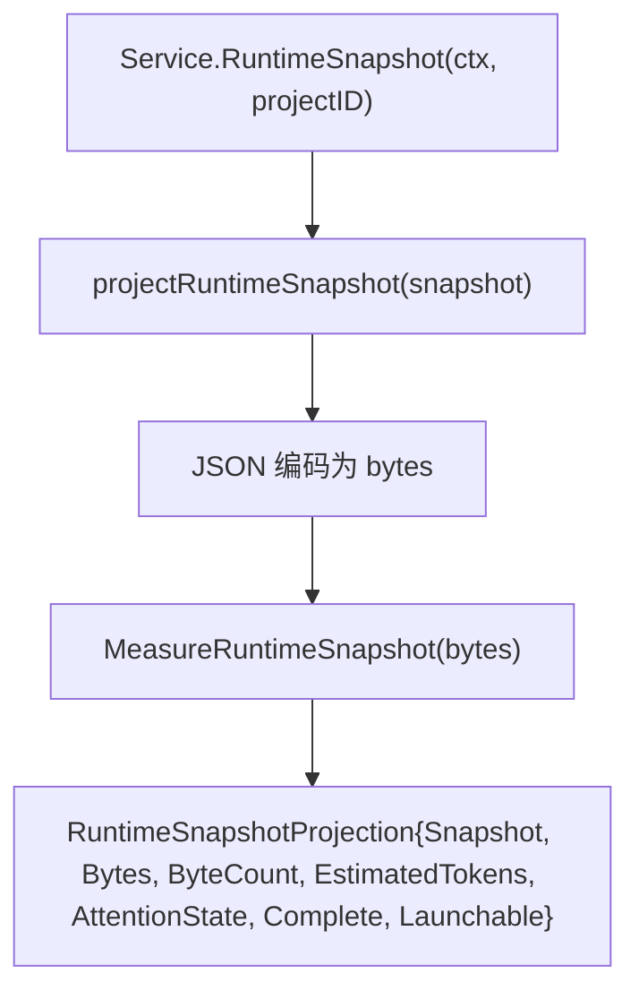
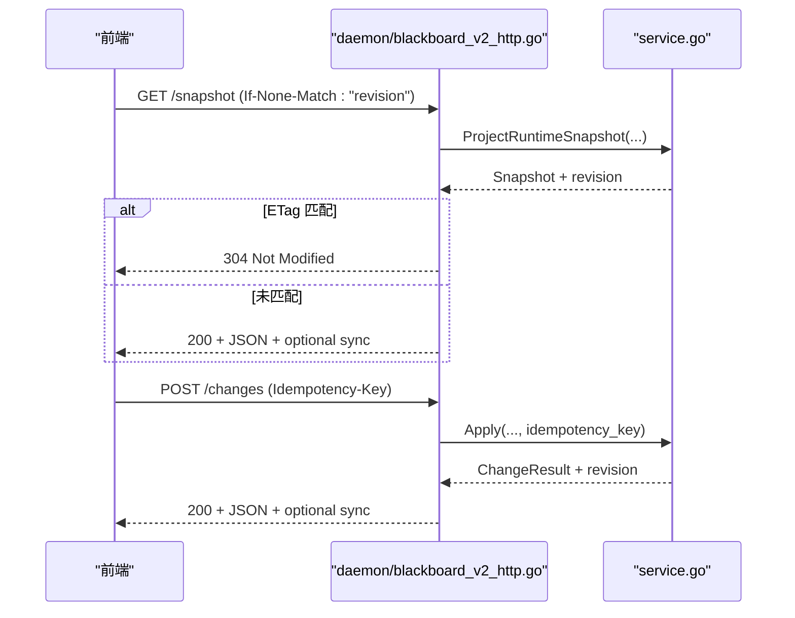
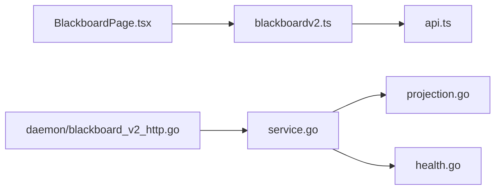

# 主黑板视图

<cite>
**本文引用的文件**   
- [web/src/pages/BlackboardPage.tsx](file://web/src/pages/BlackboardPage.tsx)
- [web/src/lib/blackboardv2.ts](file://web/src/lib/blackboardv2.ts)
- [internal/daemon/blackboard_v2_http.go](file://internal/daemon/blackboard_v2_http.go)
- [internal/blackboardv2/projection.go](file://internal/blackboardv2/projection.go)
- [internal/blackboardv2/service.go](file://internal/blackboardv2/service.go)
- [internal/blackboardv2/health.go](file://internal/blackboardv2/health.go)
</cite>

## 目录
1. [简介](#简介)
2. [项目结构](#项目结构)
3. [核心组件](#核心组件)
4. [架构总览](#架构总览)
5. [详细组件分析](#详细组件分析)
6. [依赖关系分析](#依赖关系分析)
7. [性能考虑](#性能考虑)
8. [故障排查指南](#故障排查指南)
9. [结论](#结论)
10. [附录](#附录)

## 简介
本文件围绕“主黑板视图”页面，系统性解析前端工作区、知识区与探索器的实现，并深入说明状态条显示、健康检查面板、当前工作与项目知识的组织方式。文档同时覆盖数据投影机制、实时更新处理、复杂查询构建与图表展示交互，以及与 Blackboard v2 系统的深度集成和实时数据同步机制。

## 项目结构
主黑板视图由 React 前端页面与后端 Blackboard v2 服务协同完成：
- 前端页面负责路由、数据拉取、列表渲染、健康诊断展示、图探索器建模与交互。
- 后端 HTTP 层提供快照、健康、记录详情、历史等只读接口，以及变更写入、证据保留、断点续传、Finish 等写能力。
- Blackboard v2 服务负责语义状态管理、投影生成、健康诊断、关系完整性校验与注意力预算度量。

图示来源
- [web/src/pages/BlackboardPage.tsx:46-67](file://web/src/pages/BlackboardPage.tsx#L46-L67)
- [web/src/lib/blackboardv2.ts:1251-1280](file://web/src/lib/blackboardv2.ts#L1251-L1280)
- [internal/daemon/blackboard_v2_http.go:29-46](file://internal/daemon/blackboard_v2_http.go#L29-L46)
- [internal/blackboardv2/service.go:40-64](file://internal/blackboardv2/service.go#L40-L64)
- [internal/blackboardv2/projection.go:50-85](file://internal/blackboardv2/projection.go#L50-L85)
- [internal/blackboardv2/health.go:84-183](file://internal/blackboardv2/health.go#L84-L183)

章节来源
- [web/src/pages/BlackboardPage.tsx:46-67](file://web/src/pages/BlackboardPage.tsx#L46-L67)
- [internal/daemon/blackboard_v2_http.go:29-46](file://internal/daemon/blackboard_v2_http.go#L29-L46)

## 核心组件
- 页面路由与子导航：根据 URL 切换 Work/Knowledge/Explorer/Record 四个视图。
- 数据获取与错误处理：并行读取快照、健康与项目信息；统一格式化错误。
- 状态条（StatusStrip）：展示 Revision、Kind、Health、Attention、Current Work、Knowledge 计数。
- 健康检查面板（HealthPanel）：展示健康状态、注意力预算、异常与建议。
- 当前工作（WorkSection）：列出 Objectives 与 Attempts。
- 项目知识（KnowledgeSection）：按组展示 Entities/Facts/Findings/Solutions/Evidence。
- 缺失证据提示（Missing Evidence）：筛选非 available 的证据条目。
- 图探索器（ExplorerPanel）：从快照构建节点与边，以表格形式呈现。
- 记录详情（RecordPanel）：展示字段、关系与分页语义历史。

章节来源
- [web/src/pages/BlackboardPage.tsx:69-119](file://web/src/pages/BlackboardPage.tsx#L69-L119)
- [web/src/pages/BlackboardPage.tsx:121-155](file://web/src/pages/BlackboardPage.tsx#L121-L155)
- [web/src/pages/BlackboardPage.tsx:215-260](file://web/src/pages/BlackboardPage.tsx#L215-L260)
- [web/src/pages/BlackboardPage.tsx:285-354](file://web/src/pages/BlackboardPage.tsx#L285-L354)
- [web/src/pages/BlackboardPage.tsx:437-518](file://web/src/pages/BlackboardPage.tsx#L437-L518)
- [web/src/pages/BlackboardPage.tsx:592-734](file://web/src/pages/BlackboardPage.tsx#L592-L734)
- [web/src/pages/BlackboardPage.tsx:736-983](file://web/src/pages/BlackboardPage.tsx#L736-L983)

## 架构总览
下图展示了从前端到后端的完整调用链，包括条件缓存、同步附件与 ETag 协商。

图示来源
- [web/src/lib/blackboardv2.ts:1251-1280](file://web/src/lib/blackboardv2.ts#L1251-L1280)
- [internal/daemon/blackboard_v2_http.go:127-175](file://internal/daemon/blackboard_v2_http.go#L127-L175)
- [internal/blackboardv2/projection.go:50-85](file://internal/blackboardv2/projection.go#L50-L85)
- [internal/blackboardv2/health.go:84-183](file://internal/blackboardv2/health.go#L84-L183)
- [internal/blackboardv2/service.go:483-510](file://internal/blackboardv2/service.go#L483-L510)

## 详细组件分析

### 工作区（Work）与知识区（Knowledge）
- 数据来源：通过 listSnapshotEntries 将快照中的 work 与 knowledge 扁平化为列表项，支持按组过滤与排序。
- 分组策略：Pentest 项目包含 entities/facts/findings/evidence；CTF 项目包含 entities/facts/solutions/evidence。
- 缺失证据：missingEvidenceEntries 筛选出 status 不为 available 的证据，并在页面底部集中提示。

图示来源
- [web/src/pages/BlackboardPage.tsx:157-213](file://web/src/pages/BlackboardPage.tsx#L157-L213)
- [web/src/lib/blackboardv2.ts:1018-1061](file://web/src/lib/blackboardv2.ts#L1018-L1061)
- [web/src/lib/blackboardv2.ts:1244-1249](file://web/src/lib/blackboardv2.ts#L1244-L1249)

章节来源
- [web/src/pages/BlackboardPage.tsx:157-213](file://web/src/pages/BlackboardPage.tsx#L157-L213)
- [web/src/lib/blackboardv2.ts:991-998](file://web/src/lib/blackboardv2.ts#L991-L998)
- [web/src/lib/blackboardv2.ts:1018-1061](file://web/src/lib/blackboardv2.ts#L1018-L1061)
- [web/src/lib/blackboardv2.ts:1244-1249](file://web/src/lib/blackboardv2.ts#L1244-L1249)

### 状态条（StatusStrip）
- 展示字段：Revision、Kind（Pentest/CTF）、Health、Attention、Current Work 数量、Knowledge 数量。
- 样式与可访问性：网格布局、小字号标签、数值等宽字体，便于快速扫描。

章节来源
- [web/src/pages/BlackboardPage.tsx:215-260](file://web/src/pages/BlackboardPage.tsx#L215-L260)

### 健康检查面板（HealthPanel）
- 数据来源：readSemanticHealth 返回的 SemanticHealth，包含 attention 预算、anomalies 异常、proposals 建议。
- 注意力预算：基于字节数估算 token 数，分档 within_target/above_target/warning/required，分别对应 16K/32K/64K 阈值。
- 异常与建议：
  - 异常涵盖关系完整性、证据完整性、目标悬空、矛盾未解决等。
  - 建议为审批型 Reason Task 提案，不直接修改状态或调度任务。
- 版本一致性：当 health.revision 与 snapshot.revision 不一致时，显示“语义健康陈旧”横幅，避免跨版本混合诊断。

图示来源
- [web/src/lib/blackboardv2.ts:240-290](file://web/src/lib/blackboardv2.ts#L240-L290)
- [internal/blackboardv2/health.go:34-77](file://internal/blackboardv2/health.go#L34-L77)

章节来源
- [web/src/pages/BlackboardPage.tsx:285-354](file://web/src/pages/BlackboardPage.tsx#L285-L354)
- [web/src/lib/blackboardv2.ts:807-909](file://web/src/lib/blackboardv2.ts#L807-L909)
- [internal/blackboardv2/health.go:84-183](file://internal/blackboardv2/health.go#L84-L183)

### 图探索器（Graph Explorer）
- 构建模型：buildGraphExplorer 遍历快照所有记录类型，生成 nodes 与 edges，并按 key 排序。
- 展示：节点表与关系表，点击可跳转至记录详情。
- 用途：辅助理解实体、事实、发现、解决方案与证据之间的关联拓扑。

图示来源
- [web/src/lib/blackboardv2.ts:1190-1242](file://web/src/lib/blackboardv2.ts#L1190-L1242)
- [web/src/pages/BlackboardPage.tsx:592-734](file://web/src/pages/BlackboardPage.tsx#L592-L734)

章节来源
- [web/src/pages/BlackboardPage.tsx:592-734](file://web/src/pages/BlackboardPage.tsx#L592-L734)
- [web/src/lib/blackboardv2.ts:1190-1242](file://web/src/lib/blackboardv2.ts#L1190-L1242)

### 记录详情与语义历史（RecordPanel）
- 详情加载：readCurrentDetail 获取当前记录的字段与关系，并与快照 revision 对比，若不一致则提示“stale revision”。
- 语义历史：readSemanticHistory 支持 cursor 分页，按钮触发加载更多，使用 mountedGenRef 防止竞态。
- 交互：字段以网格展示，关系以列表展示，支持跳转到相关记录。

图示来源
- [web/src/pages/BlackboardPage.tsx:736-983](file://web/src/pages/BlackboardPage.tsx#L736-L983)
- [web/src/lib/blackboardv2.ts:1261-1280](file://web/src/lib/blackboardv2.ts#L1261-L1280)
- [internal/daemon/blackboard_v2_http.go:161-197](file://internal/daemon/blackboard_v2_http.go#L161-L197)
- [internal/blackboardv2/service.go:497-523](file://internal/blackboardv2/service.go#L497-L523)

章节来源
- [web/src/pages/BlackboardPage.tsx:736-983](file://web/src/pages/BlackboardPage.tsx#L736-L983)
- [web/src/lib/blackboardv2.ts:1261-1280](file://web/src/lib/blackboardv2.ts#L1261-L1280)
- [internal/daemon/blackboard_v2_http.go:161-197](file://internal/daemon/blackboard_v2_http.go#L161-L197)

### 数据投影机制（Projection）
- 投影流程：ProjectRuntimeSnapshot 从当前语义读事务中导出一个拓扑完整的 runtime-blackboard/v2 文档，并进行 JSON 编码与注意力预算测量。
- 注意力预算：按每 token 约 4 字节估算，分档 16K/32K/64K，用于健康诊断与建议。
- 完整性：Complete 表示是否可投影完整快照；Launchable 始终为 true，确保诊断不影响启动。

图示来源
- [internal/blackboardv2/projection.go:50-85](file://internal/blackboardv2/projection.go#L50-L85)
- [internal/blackboardv2/projection.go:87-109](file://internal/blackboardv2/projection.go#L87-L109)

章节来源
- [internal/blackboardv2/projection.go:50-85](file://internal/blackboardv2/projection.go#L50-L85)
- [internal/blackboardv2/projection.go:87-109](file://internal/blackboardv2/projection.go#L87-L109)

### 实时更新处理与同步机制
- 条件响应与 ETag：GET 接口返回 revision 作为强 ETag，客户端携带 If-None-Match 可实现 304 Not Modified。
- 同步附件：对于需要幂等重放的 POST 请求，服务端可在成功或错误响应中附加 sync 对象，用于同项目内的可靠投递与重试。
- 幂等键：POST 必须携带 Idempotency-Key，用于精确重放与同步指纹绑定。

图示来源
- [internal/daemon/blackboard_v2_http.go:375-438](file://internal/daemon/blackboard_v2_http.go#L375-L438)
- [internal/daemon/blackboard_v2_http.go:440-463](file://internal/daemon/blackboard_v2_http.go#L440-L463)
- [internal/daemon/blackboard_v2_http.go:500-537](file://internal/daemon/blackboard_v2_http.go#L500-L537)

章节来源
- [internal/daemon/blackboard_v2_http.go:375-438](file://internal/daemon/blackboard_v2_http.go#L375-L438)
- [internal/daemon/blackboard_v2_http.go:440-463](file://internal/daemon/blackboard_v2_http.go#L440-L463)
- [internal/daemon/blackboard_v2_http.go:500-537](file://internal/daemon/blackboard_v2_http.go#L500-L537)

### 复杂查询构建与图表展示
- 复杂查询构建：前端通过 blackboardv2.ts 的 qs 工具函数构建查询参数，支持 limit/cursor 等分页参数。
- 图表展示：图探索器将快照转换为节点与边的表格视图，支持点击跳转与统计摘要。

章节来源
- [web/src/lib/blackboardv2.ts:407-415](file://web/src/lib/blackboardv2.ts#L407-415)
- [web/src/pages/BlackboardPage.tsx:592-734](file://web/src/pages/BlackboardPage.tsx#L592-L734)

### 与 Blackboard v2 的深度集成
- 认证与授权：operator 模式与 Continuation Interface 令牌两种路径，严格校验项目 ID 与权限。
- 读写分离：GET 接口支持条件缓存与同步附件；POST 接口要求幂等键，支持 Finish/Checkpoint/Evidence Retain 等能力。
- 错误封装：统一的 error envelope，含 code/message/path/retryable/details，HTTP 层映射为合适的状态码。

章节来源
- [internal/daemon/blackboard_v2_http.go:52-95](file://internal/daemon/blackboard_v2_http.go#L52-95)
- [internal/daemon/blackboard_v2_http.go:97-125](file://internal/daemon/blackboard_v2_http.go#L97-L125)
- [internal/daemon/blackboard_v2_http.go:564-584](file://internal/daemon/blackboard_v2_http.go#L564-L584)

## 依赖关系分析
- 前端依赖：
  - BlackboardPage.tsx 依赖 blackboardv2.ts 提供的类型定义、解析器与 API 调用。
  - blackboardv2.ts 依赖 api.ts 进行网络请求与错误包装。
- 后端依赖：
  - daemon/blackboard_v2_http.go 依赖 blackboardv2 service 进行业务逻辑处理。
  - service.go 依赖 projection.go 与 health.go 完成投影与健康诊断。

图示来源
- [web/src/pages/BlackboardPage.tsx:1-31](file://web/src/pages/BlackboardPage.tsx#L1-31)
- [web/src/lib/blackboardv2.ts:1-12](file://web/src/lib/blackboardv2.ts#L1-12)
- [internal/daemon/blackboard_v2_http.go:1-16](file://internal/daemon/blackboard_v2_http.go#L1-16)
- [internal/blackboardv2/service.go:1-28](file://internal/blackboardv2/service.go#L1-28)

章节来源
- [web/src/pages/BlackboardPage.tsx:1-31](file://web/src/pages/BlackboardPage.tsx#L1-31)
- [web/src/lib/blackboardv2.ts:1-12](file://web/src/lib/blackboardv2.ts#L1-12)
- [internal/daemon/blackboard_v2_http.go:1-16](file://internal/daemon/blackboard_v2_http.go#L1-16)
- [internal/blackboardv2/service.go:1-28](file://internal/blackboardv2/service.go#L1-28)

## 性能考虑
- 并发读取：useSnapshotAndProject 使用 Promise.all 并行获取快照、健康与项目信息，减少首屏延迟。
- 条件缓存：ETag 与 If-None-Match 避免重复传输相同版本的数据。
- 列表扁平化：listSnapshotEntries 将快照扁平为行，降低渲染复杂度。
- 历史分页：语义历史采用 cursor 分页，避免一次性加载大量数据。
- 注意力预算：投影阶段估算 token 数，帮助健康诊断与操作建议，避免无界增长。

[本节为通用指导，无需源码引用]

## 故障排查指南
- 常见错误：
  - invalid_schema：请求体或查询参数不符合 v2 契约。
  - authority_denied：缺少或无效的 Continuation 令牌或 operator 权限。
  - storage_busy：SQLite 写入锁忙，应重试。
  - not_found：记录不存在。
  - version_conflict/key_conflict/relationship_conflict/idempotency_conflict/finish_conflict：并发冲突，需重试或修正输入。
- 定位方法：
  - 查看 formatBlackboardV2Error 输出的 code/message/path，结合浏览器网络面板确认请求与响应。
  - 关注 sync 附件是否存在，必要时依据其 revision 重新拉取最新数据。
  - 健康面板中的 anomalies 与 proposals 提供具体修复建议。

章节来源
- [web/src/lib/blackboardv2.ts:963-989](file://web/src/lib/blackboardv2.ts#L963-L989)
- [internal/daemon/blackboard_v2_http.go:564-584](file://internal/daemon/blackboard_v2_http.go#L564-L584)
- [internal/daemon/blackboard_v2_http.go:612-642](file://internal/daemon/blackboard_v2_http.go#L612-L642)

## 结论
主黑板视图通过清晰的前端分层与严格的 v2 契约，实现了工作区、知识区与探索器的统一展示。借助投影机制与健康诊断，系统提供了对注意力预算与语义完整性的可视化反馈。HTTP 层的条件缓存与同步附件确保了高效与可靠的实时体验。整体设计在可读性、可维护性与可扩展性之间取得良好平衡。

[本节为总结，无需源码引用]

## 附录
- 关键 API 路径（示例）：
  - GET /api/v2/projects/{id}/blackboard/snapshot
  - GET /api/v2/projects/{id}/blackboard/health
  - GET /api/v2/projects/{id}/blackboard/records/{key}
  - GET /api/v2/projects/{id}/blackboard/records/{key}/history?limit=20&cursor=...
  - POST /api/v2/projects/{id}/blackboard/changes（需 Idempotency-Key）
  - POST /api/v2/projects/{id}/continuation:finish（需 Idempotency-Key）
- 前端类型与解析器：
  - parseRuntimeSnapshot、parseSemanticHealth、parseCurrentDetail、parseSemanticHistory
  - buildGraphExplorer、listSnapshotEntries、missingEvidenceEntries

章节来源
- [web/src/lib/blackboardv2.ts:634-695](file://web/src/lib/blackboardv2.ts#L634-L695)
- [web/src/lib/blackboardv2.ts:807-909](file://web/src/lib/blackboardv2.ts#L807-L909)
- [web/src/lib/blackboardv2.ts:744-765](file://web/src/lib/blackboardv2.ts#L744-L765)
- [web/src/lib/blackboardv2.ts:925-961](file://web/src/lib/blackboardv2.ts#L925-L961)
- [web/src/lib/blackboardv2.ts:1190-1242](file://web/src/lib/blackboardv2.ts#L1190-L1242)
- [web/src/lib/blackboardv2.ts:1018-1061](file://web/src/lib/blackboardv2.ts#L1018-L1061)
- [web/src/lib/blackboardv2.ts:1244-1249](file://web/src/lib/blackboardv2.ts#L1244-L1249)
- [internal/daemon/blackboard_v2_http.go:29-46](file://internal/daemon/blackboard_v2_http.go#L29-L46)