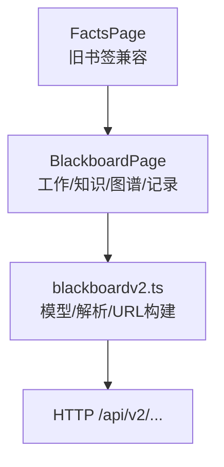
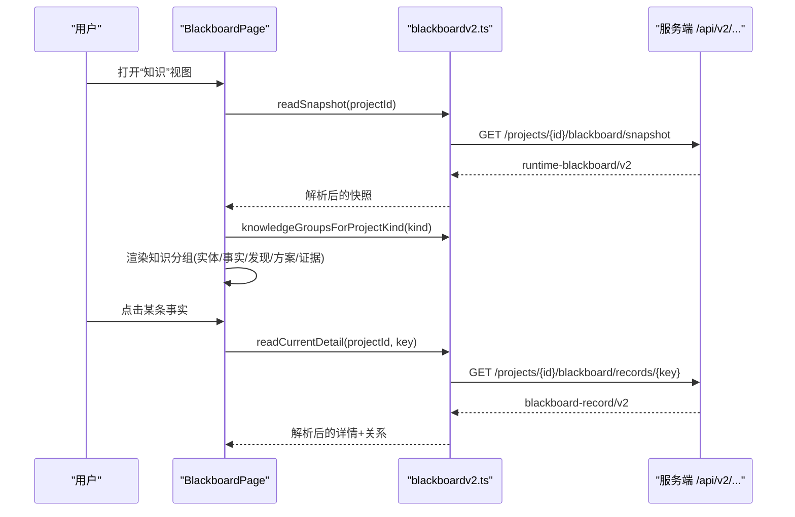
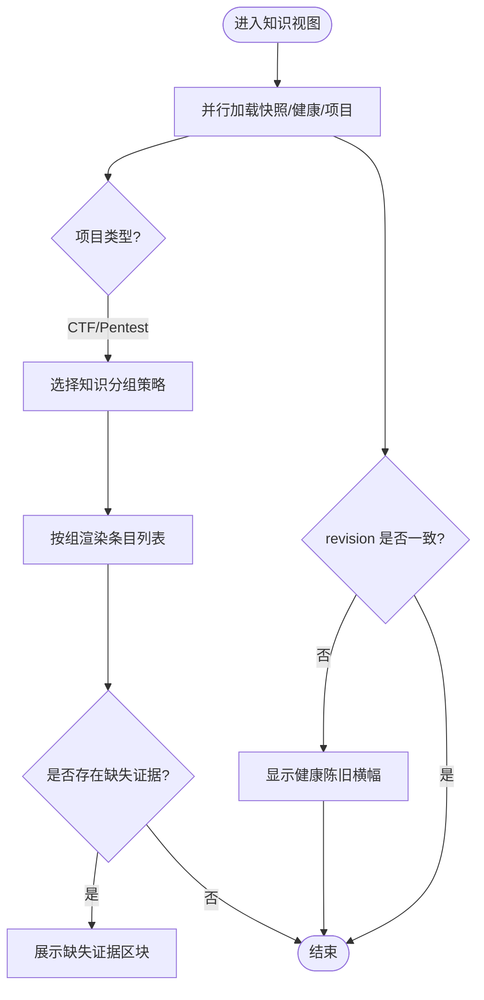
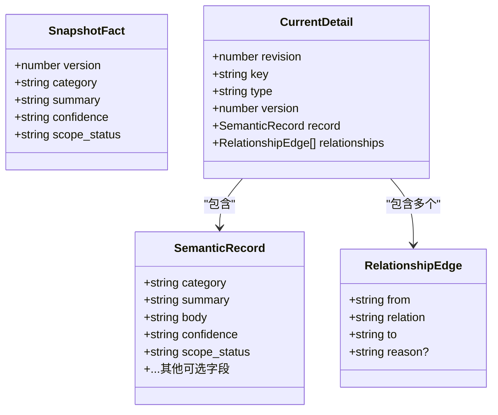
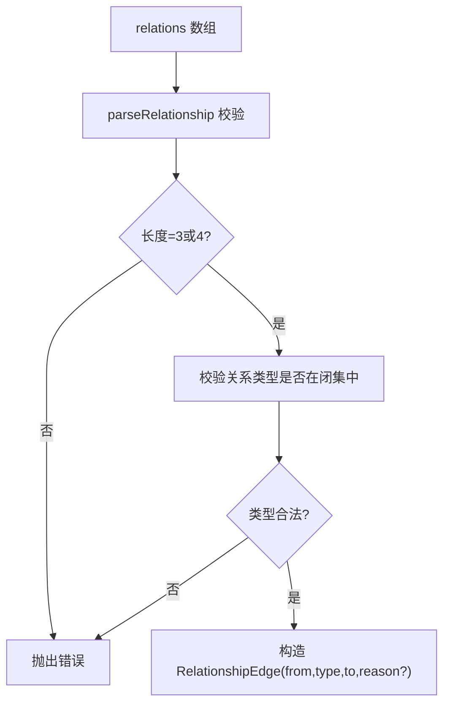
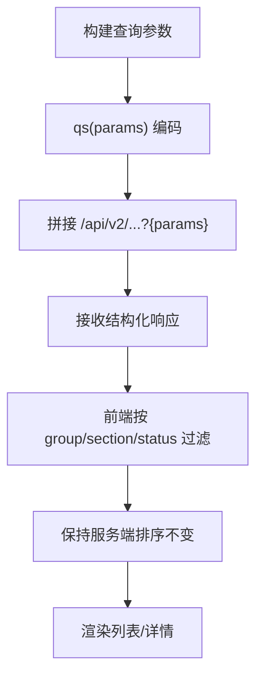
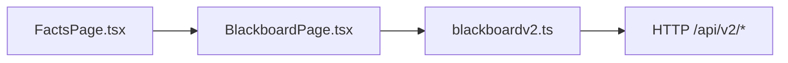

# 事实查看器

<cite>
**本文引用的文件**   
- [FactsPage.tsx](file://web/src/pages/FactsPage.tsx)
- [BlackboardPage.tsx](file://web/src/pages/BlackboardPage.tsx)
- [blackboardv2.ts](file://web/src/lib/blackboardv2.ts)
- [README.md](file://README.md)
- [blackboard-graph-refactor.md](file://docs/specs/blackboard-graph-refactor.md)
- [blackboard-read-projections.md](file://docs/specs/blackboard-read-projections.md)
- [blackboard-legacy-migration.md](file://docs/specs/blackboard-legacy-migration.md)
- [cyberpenda-blackboard-and-task-surfaces-today.md](file://docs/research/cyberpenda-blackboard-and-task-surfaces-today.md)
</cite>

## 目录
1. [简介](#简介)
2. [项目结构](#项目结构)
3. [核心组件](#核心组件)
4. [架构总览](#架构总览)
5. [详细组件分析](#详细组件分析)
6. [依赖分析](#依赖分析)
7. [性能考虑](#性能考虑)
8. [故障排查指南](#故障排查指南)
9. [结论](#结论)
10. [附录](#附录)

## 简介
本文件面向“事实查看器”页面，聚焦语义事实的展示、过滤与搜索能力，并解释事实实体的数据结构、版本控制与关系映射。同时说明事实分类、标签管理与批量操作的技术实现路径，提供查询构建、条件筛选与结果排序的实现要点，并阐述与黑板数据模型的对应关系及实时更新机制。

## 项目结构
- 前端路由层：旧版“Facts”书签兼容跳转至新版“Knowledge（知识）”视图。
- 黑板主页面：提供 Work/Knowledge/Explorer/Record 四个子视图；其中 Knowledge 聚合实体、事实、发现、方案、证据等知识条目。
- 数据模型与解析：集中定义 v2 快照、记录详情、历史、健康状态、关系类型、记录类型、字段白名单与解析校验逻辑。

图示来源
- [FactsPage.tsx:1-11](file://web/src/pages/FactsPage.tsx#L1-L11)
- [BlackboardPage.tsx:1-120](file://web/src/pages/BlackboardPage.tsx#L1-L120)
- [blackboardv2.ts:403-431](file://web/src/lib/blackboardv2.ts#L403-L431)

章节来源
- [FactsPage.tsx:1-11](file://web/src/pages/FactsPage.tsx#L1-L11)
- [BlackboardPage.tsx:1-120](file://web/src/pages/BlackboardPage.tsx#L1-L120)

## 核心组件
- 旧版事实页兼容跳转：将访问重定向到项目的黑屏“知识”视图，避免直接访问冻结表的事实索引。
- 黑板主面板：并行加载运行时快照、健康状态与项目信息，按 section/group 分组呈现当前工作与知识条目。
- 知识分组渲染：将 facts/entities/findings/solutions/evidence 分别以区块列表展示，支持空态提示与徽章显示。
- 记录详情与历史：通过 key 获取当前记录详情、关联关系与分页历史，处理并发挂载生命周期以避免竞态。
- 数据模型与校验：严格校验 schema、字段白名单、关系元组、键合法性，确保前后端契约一致。

章节来源
- [FactsPage.tsx:1-11](file://web/src/pages/FactsPage.tsx#L1-L11)
- [BlackboardPage.tsx:121-213](file://web/src/pages/BlackboardPage.tsx#L121-L213)
- [BlackboardPage.tsx:472-518](file://web/src/pages/BlackboardPage.tsx#L472-L518)
- [BlackboardPage.tsx:736-800](file://web/src/pages/BlackboardPage.tsx#L736-L800)
- [blackboardv2.ts:43-82](file://web/src/lib/blackboardv2.ts#L43-L82)
- [blackboardv2.ts:487-516](file://web/src/lib/blackboardv2.ts#L487-L516)
- [blackboardv2.ts:634-695](file://web/src/lib/blackboardv2.ts#L634-L695)
- [blackboardv2.ts:744-765](file://web/src/lib/blackboardv2.ts#L744-L765)

## 架构总览
事实查看器基于 Blackboard v2 的“运行时快照 + 记录详情 + 历史”三件套进行展示与交互。前端通过统一库函数发起请求，后端返回结构化文档，前端在客户端完成强类型解析与展示。

图示来源
- [BlackboardPage.tsx:121-155](file://web/src/pages/BlackboardPage.tsx#L121-L155)
- [BlackboardPage.tsx:472-518](file://web/src/pages/BlackboardPage.tsx#L472-L518)
- [BlackboardPage.tsx:736-800](file://web/src/pages/BlackboardPage.tsx#L736-L800)
- [blackboardv2.ts:634-695](file://web/src/lib/blackboardv2.ts#L634-L695)
- [blackboardv2.ts:744-765](file://web/src/lib/blackboardv2.ts#L744-L765)

## 详细组件分析

### 旧版事实页兼容跳转
- 行为：当访问旧版“Facts”路由时，自动替换为“Projects/{projectId}/blackboard/knowledge”，保证书签可用且不触发冻结表读取。
- 影响：所有事实浏览入口统一到 Knowledge 视图，遵循 v2 快照与记录接口。

章节来源
- [FactsPage.tsx:1-11](file://web/src/pages/FactsPage.tsx#L1-L11)

### 知识视图（Knowledge）
- 数据来源：并行拉取 snapshot、health、project，计算 kind 后选择知识分组策略。
- 分组规则：entities/facts/findings/solutions/evidence 五类知识项，按 group 过滤渲染。
- 空态与提示：无条目时显示友好文案；缺失证据单独列出。
- 健康与一致性：若 snapshot.revision 与 health.revision 不一致，显示“健康陈旧”横幅，避免跨修订诊断混用。

图示来源
- [BlackboardPage.tsx:121-155](file://web/src/pages/BlackboardPage.tsx#L121-L155)
- [BlackboardPage.tsx:157-213](file://web/src/pages/BlackboardPage.tsx#L157-L213)
- [BlackboardPage.tsx:262-283](file://web/src/pages/BlackboardPage.tsx#L262-L283)
- [BlackboardPage.tsx:472-518](file://web/src/pages/BlackboardPage.tsx#L472-L518)

章节来源
- [BlackboardPage.tsx:121-213](file://web/src/pages/BlackboardPage.tsx#L121-L213)
- [BlackboardPage.tsx:262-283](file://web/src/pages/BlackboardPage.tsx#L262-L283)
- [BlackboardPage.tsx:472-518](file://web/src/pages/BlackboardPage.tsx#L472-L518)

### 事实实体数据结构与版本控制
- 快照中的事实条目包含 version/category/summary/confidence/scope_status 等字段，受字段白名单约束。
- 记录详情包含 revision/key/type/version/record/relationships，record 中承载 body/confidence/scope_status 等完整属性。
- 历史分页返回 items/next_cursor，用于滚动加载变更轨迹。
- 版本语义：每次更新追加新版本；详情与历史均携带版本号，便于定位与对比。

图示来源
- [blackboardv2.ts:110-116](file://web/src/lib/blackboardv2.ts#L110-L116)
- [blackboardv2.ts:210-218](file://web/src/lib/blackboardv2.ts#L210-L218)
- [blackboardv2.ts:176-208](file://web/src/lib/blackboardv2.ts#L176-L208)
- [blackboardv2.ts:159-165](file://web/src/lib/blackboardv2.ts#L159-L165)

章节来源
- [blackboardv2.ts:110-116](file://web/src/lib/blackboardv2.ts#L110-L116)
- [blackboardv2.ts:210-218](file://web/src/lib/blackboardv2.ts#L210-L218)
- [blackboardv2.ts:176-208](file://web/src/lib/blackboardv2.ts#L176-L208)
- [blackboardv2.ts:159-165](file://web/src/lib/blackboardv2.ts#L159-L165)

### 关系映射与图谱探索
- 关系类型为闭集，包括 about/part_of/tests/produced/evidences/supports/contradicts/derived_from/depends_on/satisfies/supersedes。
- 关系元组采用数组形式解析，强制校验类型与长度，支持可选 reason。
- Explorer 视图将节点与边以表格形式呈现，支持从节点跳转到记录详情。

图示来源
- [blackboardv2.ts:14-26](file://web/src/lib/blackboardv2.ts#L14-L26)
- [blackboardv2.ts:487-516](file://web/src/lib/blackboardv2.ts#L487-L516)
- [BlackboardPage.tsx:592-734](file://web/src/pages/BlackboardPage.tsx#L592-L734)

章节来源
- [blackboardv2.ts:14-26](file://web/src/lib/blackboardv2.ts#L14-L26)
- [blackboardv2.ts:487-516](file://web/src/lib/blackboardv2.ts#L487-L516)
- [BlackboardPage.tsx:592-734](file://web/src/pages/BlackboardPage.tsx#L592-L734)

### 事实分类、标签管理与批量操作
- 分类：事实的 category 字段用于归类，默认值在迁移阶段映射为“未分类”。
- 标签：前端使用 Badge 展示状态与标记（如 out-of-scope、missing），这些由后端在快照/详情中提供。
- 批量操作：当前查看器侧重只读展示；批量写操作应通过 v2 原子变更批次接口提交（见 README 与 ADR）。

章节来源
- [blackboard-legacy-migration.md:293-352](file://docs/specs/blackboard-legacy-migration.md#L293-L352)
- [BlackboardPage.tsx:541-590](file://web/src/pages/BlackboardPage.tsx#L541-L590)
- [README.md:127-148](file://README.md#L127-L148)
- [blackboard-graph-refactor.md:149-183](file://docs/specs/blackboard-graph-refactor.md#L149-L183)

### 事实查询构建、条件筛选与结果排序
- 查询构建：通过 URL 参数拼接工具 qs 生成查询串，支持布尔/数字/字符串参数过滤。
- 条件筛选：前端根据 group/section 过滤快照条目；健康视图根据 status/severity 过滤异常与建议。
- 结果排序：快照与详情均为服务端确定顺序；前端不改变排序，仅做分组与展示。

图示来源
- [blackboardv2.ts:407-415](file://web/src/lib/blackboardv2.ts#L407-L415)
- [BlackboardPage.tsx:157-213](file://web/src/pages/BlackboardPage.tsx#L157-L213)
- [BlackboardPage.tsx:285-354](file://web/src/pages/BlackboardPage.tsx#L285-L354)

章节来源
- [blackboardv2.ts:407-415](file://web/src/lib/blackboardv2.ts#L407-L415)
- [BlackboardPage.tsx:157-213](file://web/src/pages/BlackboardPage.tsx#L157-L213)
- [BlackboardPage.tsx:285-354](file://web/src/pages/BlackboardPage.tsx#L285-L354)

### 与黑板数据模型的对应关系
- 快照（runtime-blackboard/v2）：work.knowledge.facts 对应事实清单；relations 提供关系边。
- 记录详情（blackboard-record/v2）：record 包含事实完整属性；relationships 提供该记录的关联边。
- 历史（semantic-history/v2）：items 包含变更记录，含 type/version/record/from/relation/to/reason 等。
- 健康（blackboard-health/v2）：status/anomalies/proposals 辅助判断事实相关风险与优化建议。

章节来源
- [blackboardv2.ts:10-11](file://web/src/lib/blackboardv2.ts#L10-L11)
- [blackboardv2.ts:167-174](file://web/src/lib/blackboardv2.ts#L167-L174)
- [blackboardv2.ts:210-238](file://web/src/lib/blackboardv2.ts#L210-L238)
- [blackboardv2.ts:240-290](file://web/src/lib/blackboardv2.ts#L240-L290)

### 实时更新机制
- 并行加载：页面初始化时并行获取快照与健康，减少首屏等待。
- 修订一致性：比较 snapshot.revision 与 health.revision，不一致则提示刷新，避免混合不同修订的诊断。
- 历史记录分页：通过 next_cursor 增量加载，避免一次性拉取全部历史。
- 挂载生命周期：使用 mountedGenRef 防止异步回调覆盖已卸载组件的状态。

章节来源
- [BlackboardPage.tsx:121-155](file://web/src/pages/BlackboardPage.tsx#L121-L155)
- [BlackboardPage.tsx:262-283](file://web/src/pages/BlackboardPage.tsx#L262-L283)
- [BlackboardPage.tsx:736-800](file://web/src/pages/BlackboardPage.tsx#L736-L800)

## 依赖分析
- 页面组件依赖 blackboardv2.ts 提供的模型解析、URL 构建与常量定义。
- 数据流单向：API → 解析 → 状态 → 渲染；无循环依赖。
- 外部依赖：React Router 用于路由与参数解析；Lucide 图标用于导航。

图示来源
- [FactsPage.tsx:1-11](file://web/src/pages/FactsPage.tsx#L1-L11)
- [BlackboardPage.tsx:1-120](file://web/src/pages/BlackboardPage.tsx#L1-L120)
- [blackboardv2.ts:403-431](file://web/src/lib/blackboardv2.ts#L403-L431)

章节来源
- [FactsPage.tsx:1-11](file://web/src/pages/FactsPage.tsx#L1-L11)
- [BlackboardPage.tsx:1-120](file://web/src/pages/BlackboardPage.tsx#L1-L120)
- [blackboardv2.ts:403-431](file://web/src/lib/blackboardv2.ts#L403-L431)

## 性能考虑
- 并行请求：snapshot/health/project 并行获取，降低首屏延迟。
- 最小化传输：快照仅包含白名单字段，避免冗余数据。
- 分页历史：通过 cursor 分页加载，避免大对象一次性传输。
- 前端缓存：组件内状态缓存，避免重复请求；必要时可结合浏览器缓存策略。

[本节为通用指导，无需源码引用]

## 故障排查指南
- 健康陈旧：当 snapshot.revision 与 health.revision 不一致时，提示刷新以获取一致视图。
- 解析失败：检查 schema 标识、字段白名单、关系元组格式与键合法性。
- 空态与缺失：确认后端是否返回相应分组条目；缺失证据会单独列出。
- 并发竞态：确保组件卸载时取消或忽略过期回调，避免状态覆盖。

章节来源
- [BlackboardPage.tsx:262-283](file://web/src/pages/BlackboardPage.tsx#L262-L283)
- [blackboardv2.ts:634-695](file://web/src/lib/blackboardv2.ts#L634-L695)
- [blackboardv2.ts:744-765](file://web/src/lib/blackboardv2.ts#L744-L765)
- [BlackboardPage.tsx:736-800](file://web/src/pages/BlackboardPage.tsx#L736-L800)

## 结论
事实查看器以 Blackboard v2 为核心，通过快照、详情与历史三件套实现事实的可视化与可追溯性。前端通过严格的模型解析与分组渲染，保障展示的一致性与可读性；健康与修订一致性检查提升诊断可靠性。未来可在现有基础上扩展高级筛选、批量编辑与更丰富的图谱交互。

[本节为总结，无需源码引用]

## 附录
- 旧版事实迁移：legacy Fact 映射为 ProjectFact，category/confidence/scope_status 有明确默认与转换规则。
- 关系规范化：legacy relations 到 graph edges 的映射表定义了 supports/contradicts/leads_to 等导入行为。
- 读写协议：v2 使用原子变更批次与稳定键，确保幂等与乐观并发。

章节来源
- [blackboard-legacy-migration.md:293-352](file://docs/specs/blackboard-legacy-migration.md#L293-L352)
- [cyberpenda-blackboard-and-task-surfaces-today.md:110-134](file://docs/research/cyberpenda-blackboard-and-task-surfaces-today.md#L110-L134)
- [blackboard-graph-refactor.md:149-183](file://docs/specs/blackboard-graph-refactor.md#L149-L183)
- [README.md:127-148](file://README.md#L127-L148)