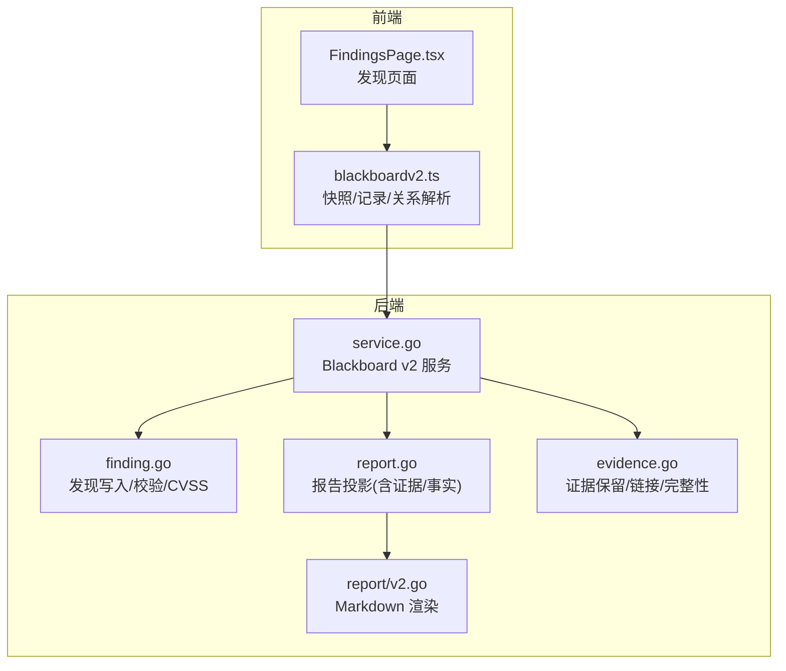
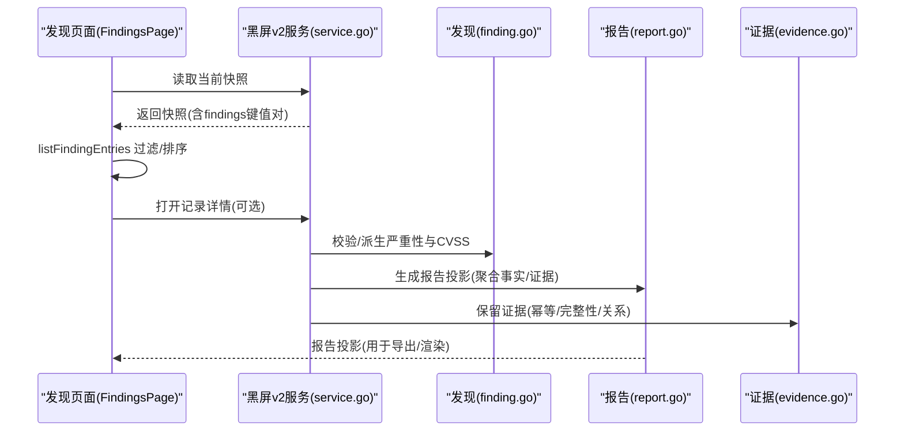
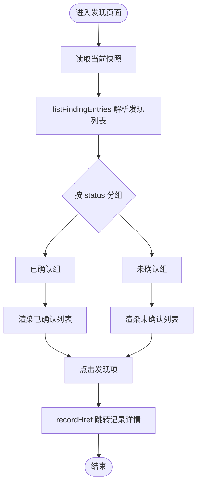
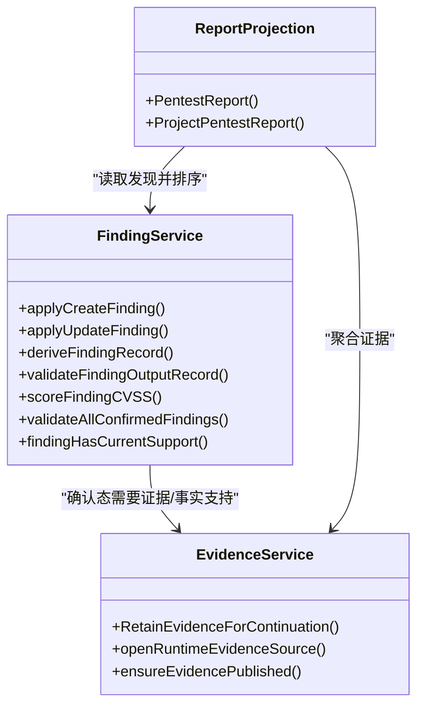
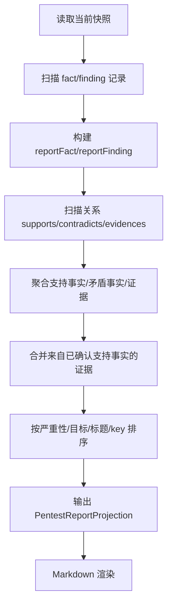
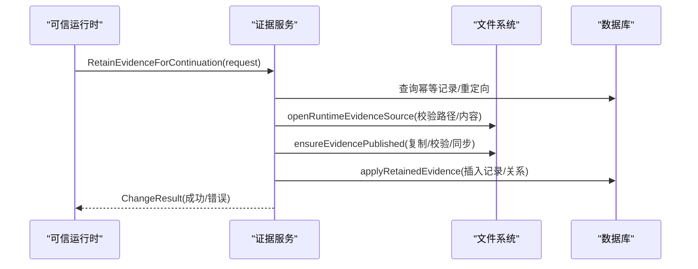
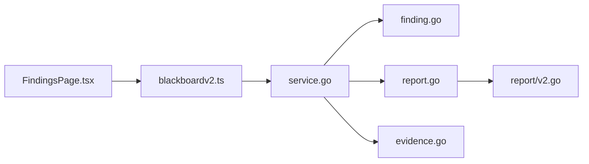

# 发现查看器

<cite>
**本文引用的文件**   
- [FindingsPage.tsx](file://web/src/pages/FindingsPage.tsx)
- [blackboardv2.ts](file://web/src/lib/blackboardv2.ts)
- [finding.go](file://internal/blackboardv2/finding.go)
- [report.go](file://internal/blackboardv2/report.go)
- [evidence.go](file://internal/blackboardv2/evidence.go)
- [service.go](file://internal/blackboardv2/service.go)
- [v2.go](file://internal/report/v2.go)
</cite>

## 目录
1. [简介](#简介)
2. [项目结构](#项目结构)
3. [核心组件](#核心组件)
4. [架构总览](#架构总览)
5. [详细组件分析](#详细组件分析)
6. [依赖关系分析](#依赖关系分析)
7. [性能考虑](#性能考虑)
8. [故障排查指南](#故障排查指南)
9. [结论](#结论)
10. [附录](#附录)

## 简介
本文件聚焦“发现查看器”页面及其后端支撑能力，系统性阐述安全发现的展示、分类与关联分析；说明发现实体的生命周期、严重性评级与影响范围评估；解释发现报告生成、证据链接与修复建议的技术实现；并提供前端过滤、排序与统计报表的代码示例路径。同时梳理发现与实体、证据之间的关系映射及数据一致性保证机制。

## 项目结构
发现查看器由前端页面与后端语义服务协同完成：
- 前端页面负责从当前快照中读取发现列表，按状态分组并渲染。
- 前端通过类型化客户端解析快照与记录详情，提供筛选、排序与导航到记录的超链接。
- 后端服务负责发现创建/更新、CVSS评分推导、确认态校验、证据与事实的关联聚合，以及报告投影与Markdown渲染。

图表来源
- [FindingsPage.tsx:1-104](file://web/src/pages/FindingsPage.tsx#L1-L104)
- [blackboardv2.ts:167-174](file://web/src/lib/blackboardv2.ts#L167-L174)
- [service.go:1389-1396](file://internal/blackboardv2/service.go#L1389-L1396)
- [finding.go:32-108](file://internal/blackboardv2/finding.go#L32-L108)
- [report.go:124-127](file://internal/blackboardv2/report.go#L124-L127)
- [evidence.go:196-360](file://internal/blackboardv2/evidence.go#L196-L360)
- [v2.go:46-74](file://internal/report/v2.go#L46-L74)

章节来源
- [FindingsPage.tsx:1-104](file://web/src/pages/FindingsPage.tsx#L1-L104)
- [blackboardv2.ts:167-174](file://web/src/lib/blackboardv2.ts#L167-L174)
- [service.go:1389-1396](file://internal/blackboardv2/service.go#L1389-L1396)

## 核心组件
- 发现页面（前端）
  - 读取当前快照，提取发现条目，按状态分为“已确认/未确认”，点击跳转至记录详情。
- 快照与记录客户端（前端）
  - 定义快照结构、字段白名单、关系元组解析、记录详情与历史结构，提供 listFindingEntries 等工具函数。
- 发现服务（后端）
  - 负责发现的创建/更新、字段校验、CVSS 版本与向量解析、严重性推导、确认态约束与证据支持检查。
- 报告投影（后端）
  - 基于当前快照生成确定性报告投影，聚合支持事实、矛盾事实与证据，并按严重性排序。
- 证据服务（后端）
  - 负责受信任运行时证据的保留、幂等、完整性校验、持久化与关系建立，确保可追溯与不可抵赖。
- 报告渲染（后端）
  - 将报告投影渲染为 Markdown，包含发现标题、严重性、目标、描述、证明、影响与建议等。

章节来源
- [FindingsPage.tsx:18-55](file://web/src/pages/FindingsPage.tsx#L18-L55)
- [blackboardv2.ts:167-174](file://web/src/lib/blackboardv2.ts#L167-L174)
- [finding.go:32-108](file://internal/blackboardv2/finding.go#L32-L108)
- [report.go:124-127](file://internal/blackboardv2/report.go#L124-L127)
- [evidence.go:196-360](file://internal/blackboardv2/evidence.go#L196-L360)
- [v2.go:46-74](file://internal/report/v2.go#L46-L74)

## 架构总览
发现查看器的端到端流程如下：
- 前端请求当前快照，解析出发现列表，按状态分组显示。
- 用户点击某条发现，跳转到记录详情，加载当前记录与关系图。
- 后端在生成报告投影时，聚合支持事实、矛盾事实与证据，并对确认态进行强一致性校验。
- 证据保留过程具备幂等、完整性校验与事务提交保障，确保发现与证据之间关系一致。

图表来源
- [FindingsPage.tsx:23-38](file://web/src/pages/FindingsPage.tsx#L23-L38)
- [blackboardv2.ts:1568-1596](file://web/src/lib/blackboardv2.ts#L1568-L1596)
- [service.go:1389-1396](file://internal/blackboardv2/service.go#L1389-L1396)
- [finding.go:89-108](file://internal/blackboardv2/finding.go#L89-L108)
- [report.go:132-162](file://internal/blackboardv2/report.go#L132-L162)
- [evidence.go:196-360](file://internal/blackboardv2/evidence.go#L196-L360)

## 详细组件分析

### 发现页面（前端）
- 功能要点
  - 读取快照后，使用 listFindingEntries 获取发现条目并进行排序。
  - 根据 status 字段将发现分为“已确认/未确认”两组呈现。
  - 每条发现以 key 作为唯一标识，点击后通过 recordHref 跳转至记录详情。
- 关键实现位置
  - 页面主逻辑与分组渲染：[FindingsPage.tsx:18-55](file://web/src/pages/FindingsPage.tsx#L18-L55)、[FindingsPage.tsx:57-103](file://web/src/pages/FindingsPage.tsx#L57-L103)
  - 发现条目排序与过滤：[blackboardv2.ts:1568-1596](file://web/src/lib/blackboardv2.ts#L1568-L1596)
  - 快照结构与字段白名单：[blackboardv2.ts:167-174](file://web/src/lib/blackboardv2.ts#L167-L174)、[blackboardv2.ts:42-82](file://web/src/lib/blackboardv2.ts#L42-L82)

图表来源
- [FindingsPage.tsx:23-38](file://web/src/pages/FindingsPage.tsx#L23-L38)
- [blackboardv2.ts:1568-1596](file://web/src/lib/blackboardv2.ts#L1568-L1596)
- [blackboardv2.ts:417-419](file://web/src/lib/blackboardv2.ts#L417-L419)

章节来源
- [FindingsPage.tsx:18-55](file://web/src/pages/FindingsPage.tsx#L18-L55)
- [FindingsPage.tsx:57-103](file://web/src/pages/FindingsPage.tsx#L57-L103)
- [blackboardv2.ts:1568-1596](file://web/src/lib/blackboardv2.ts#L1568-L1596)
- [blackboardv2.ts:167-174](file://web/src/lib/blackboardv2.ts#L167-L174)

### 发现实体与服务（后端）
- 生命周期与状态
  - 创建：要求 status 为 unconfirmed 或 confirmed；若为 confirmed，需满足目标、证明、影响与建议必填，且 CVSS 完整有效。
  - 更新：支持部分字段覆盖与 clear 清空；再次派生严重性与 cvss_pending。
  - 最终校验：所有当前发现必须处于非终态（unconfirmed/confirmed），且 confirmed 的发现必须有当前证据或已确认的支持事实。
- 严重性评级与影响范围
  - 支持 CVSS v3.1 与 v4.0；服务端根据向量计算严重性等级，并标记是否 pending。
  - 影响范围通过 target、impact 字段表达，并在确认态强制要求填写。
- 代码要点
  - 创建/更新/派生/校验：[finding.go:32-108](file://internal/blackboardv2/finding.go#L32-L108)、[finding.go:110-168](file://internal/blackboardv2/finding.go#L110-L168)、[finding.go:170-212](file://internal/blackboardv2/finding.go#L170-L212)
  - CVSS 评分与 pending 标志：[finding.go:214-248](file://internal/blackboardv2/finding.go#L214-L248)
  - 确认态支持与有效性校验：[finding.go:250-304](file://internal/blackboardv2/finding.go#L250-L304)、[finding.go:306-346](file://internal/blackboardv2/finding.go#L306-L346)

图表来源
- [finding.go:32-108](file://internal/blackboardv2/finding.go#L32-L108)
- [finding.go:214-248](file://internal/blackboardv2/finding.go#L214-L248)
- [finding.go:250-304](file://internal/blackboardv2/finding.go#L250-L304)
- [evidence.go:196-360](file://internal/blackboardv2/evidence.go#L196-L360)
- [report.go:124-127](file://internal/blackboardv2/report.go#L124-L127)

章节来源
- [finding.go:32-108](file://internal/blackboardv2/finding.go#L32-L108)
- [finding.go:110-168](file://internal/blackboardv2/finding.go#L110-L168)
- [finding.go:170-212](file://internal/blackboardv2/finding.go#L170-L212)
- [finding.go:214-248](file://internal/blackboardv2/finding.go#L214-L248)
- [finding.go:250-304](file://internal/blackboardv2/finding.go#L250-L304)
- [finding.go:306-346](file://internal/blackboardv2/finding.go#L306-L346)

### 报告投影与渲染
- 报告投影
  - 仅输出确定性允许字段，包含项目信息、已确认/未确认发现、已确认/试探性事实。
  - 每个发现聚合其支持事实、矛盾事实与证据；证据既包括直接 evidences 关系，也包括来自已确认支持事实的证据。
  - 排序规则：先按严重性降序，再按目标、标题、key 稳定排序。
- Markdown 渲染
  - 将投影转换为结构化 Markdown，包含标题、严重性、CVSS、目标、描述、证明、影响与建议，以及事实与证据列表。
- 代码要点
  - 投影结构与方法：[report.go:16-44](file://internal/blackboardv2/report.go#L16-44)、[report.go:76-92](file://internal/blackboardv2/report.go#L76-92)、[report.go:124-127](file://internal/blackboardv2/report.go#L124-L127)
  - 聚合与排序：[report.go:132-162](file://internal/blackboardv2/report.go#L132-L162)、[report.go:317-339](file://internal/blackboardv2/report.go#L317-L339)
  - Markdown 渲染入口：[v2.go:46-74](file://internal/report/v2.go#L46-L74)

图表来源
- [report.go:132-162](file://internal/blackboardv2/report.go#L132-L162)
- [report.go:317-339](file://internal/blackboardv2/report.go#L317-L339)
- [v2.go:46-74](file://internal/report/v2.go#L46-L74)

章节来源
- [report.go:16-44](file://internal/blackboardv2/report.go#L16-44)
- [report.go:76-92](file://internal/blackboardv2/report.go#L76-92)
- [report.go:124-127](file://internal/blackboardv2/report.go#L124-L127)
- [report.go:132-162](file://internal/blackboardv2/report.go#L132-L162)
- [report.go:317-339](file://internal/blackboardv2/report.go#L317-L339)
- [v2.go:46-74](file://internal/report/v2.go#L46-L74)

### 证据保留与链接
- 幂等与安全性
  - 通过 idempotency_key 与 requestHash 保证幂等；严格校验 source_path 必须在任务根目录下，禁止符号链接与非普通文件。
- 完整性与持久化
  - 计算 SHA256 与大小，验证托管存储中的证据完整性；失败则清理并回滚。
- 关系建立
  - 支持 links 指定 evidences/about 关系，自动解析 key 重定向，确保目标存在且类型正确。
- 代码要点
  - 保留入口与校验：[evidence.go:196-360](file://internal/blackboardv2/evidence.go#L196-L360)
  - 源路径与安全校验：[evidence.go:540-575](file://internal/blackboardv2/evidence.go#L540-L575)、[evidence.go:649-672](file://internal/blackboardv2/evidence.go#L649-L672)
  - 发布与完整性验证：[evidence.go:1264-1466](file://internal/blackboardv2/evidence.go#L1264-L1466)

图表来源
- [evidence.go:196-360](file://internal/blackboardv2/evidence.go#L196-L360)
- [evidence.go:540-575](file://internal/blackboardv2/evidence.go#L540-L575)
- [evidence.go:1264-1466](file://internal/blackboardv2/evidence.go#L1264-L1466)

章节来源
- [evidence.go:196-360](file://internal/blackboardv2/evidence.go#L196-L360)
- [evidence.go:540-575](file://internal/blackboardv2/evidence.go#L540-L575)
- [evidence.go:649-672](file://internal/blackboardv2/evidence.go#L649-L672)
- [evidence.go:1264-1466](file://internal/blackboardv2/evidence.go#L1264-L1466)

## 依赖关系分析
- 前端依赖
  - FindingsPage 依赖 blackboardv2.ts 提供的快照解析、关系解析与记录导航工具。
- 后端依赖
  - service.go 作为统一服务门面，协调 finding.go、report.go、evidence.go 的能力。
  - report/v2.go 消费 report.go 的投影接口，生成 Markdown。

图表来源
- [FindingsPage.tsx:1-104](file://web/src/pages/FindingsPage.tsx#L1-L104)
- [blackboardv2.ts:167-174](file://web/src/lib/blackboardv2.ts#L167-L174)
- [service.go:1389-1396](file://internal/blackboardv2/service.go#L1389-L1396)
- [finding.go:32-108](file://internal/blackboardv2/finding.go#L32-L108)
- [report.go:124-127](file://internal/blackboardv2/report.go#L124-L127)
- [evidence.go:196-360](file://internal/blackboardv2/evidence.go#L196-L360)
- [v2.go:46-74](file://internal/report/v2.go#L46-L74)

章节来源
- [FindingsPage.tsx:1-104](file://web/src/pages/FindingsPage.tsx#L1-L104)
- [blackboardv2.ts:167-174](file://web/src/lib/blackboardv2.ts#L167-L174)
- [service.go:1389-1396](file://internal/blackboardv2/service.go#L1389-L1396)

## 性能考虑
- 前端排序与过滤
  - listFindingEntries 在客户端完成排序，避免多次网络往返；适合中等规模快照。
- 后端投影与聚合
  - 报告投影采用单次只读事务，顺序扫描 records 与 relationships，时间复杂度与记录数线性相关；通过有序扫描与去重降低内存占用。
- 证据保留
  - 大文件传输与哈希计算可能成为瓶颈；建议在配置中合理设置超时与并发限制，并利用幂等与恢复机制提升鲁棒性。

## 故障排查指南
- 常见错误与定位
  - 快照读取失败：检查项目是否存在、权限是否正确。参考快照读取入口：[service.go:1389-1396](file://internal/blackboardv2/service.go#L1389-L1396)
  - 发现创建/更新失败：检查 status、target/proof/impact/recommendation 必填项与 CVSS 向量合法性。参考校验逻辑：[finding.go:170-212](file://internal/blackboardv2/finding.go#L170-L212)、[finding.go:214-248](file://internal/blackboardv2/finding.go#L214-L248)
  - 确认态无支持：确保存在 available 的证据或 confirmed 的事实支持。参考支持检查：[finding.go:306-346](file://internal/blackboardv2/finding.go#L306-L346)
  - 证据保留失败：检查 source_path 是否在任务根目录、文件是否为普通文件、SHA256 是否匹配。参考路径与完整性校验：[evidence.go:540-575](file://internal/blackboardv2/evidence.go#L540-L575)、[evidence.go:1264-1466](file://internal/blackboardv2/evidence.go#L1264-L1466)
- 调试建议
  - 使用记录详情与历史视图核对变更轨迹。
  - 使用健康诊断接口检查证据完整性异常与关系不一致问题。

章节来源
- [service.go:1389-1396](file://internal/blackboardv2/service.go#L1389-L1396)
- [finding.go:170-212](file://internal/blackboardv2/finding.go#L170-L212)
- [finding.go:214-248](file://internal/blackboardv2/finding.go#L214-L248)
- [finding.go:306-346](file://internal/blackboardv2/finding.go#L306-L346)
- [evidence.go:540-575](file://internal/blackboardv2/evidence.go#L540-L575)
- [evidence.go:1264-1466](file://internal/blackboardv2/evidence.go#L1264-L1466)

## 结论
发现查看器通过前后端协作，实现了安全的发现展示、分类与关联分析。后端在服务层严格保证发现的生命周期与一致性，结合证据服务的幂等与完整性校验，确保报告投影的可信度与可审计性。前端提供直观的分组与排序体验，并通过记录导航深入细节。整体设计兼顾可读性、可靠性与可扩展性。

## 附录
- 前端过滤、排序与统计报表示例路径
  - 发现条目排序与过滤：[blackboardv2.ts:1568-1596](file://web/src/lib/blackboardv2.ts#L1568-L1596)
  - 快照结构定义与字段白名单：[blackboardv2.ts:167-174](file://web/src/lib/blackboardv2.ts#L167-L174)、[blackboardv2.ts:42-82](file://web/src/lib/blackboardv2.ts#L42-L82)
  - 记录详情与关系解析：[blackboardv2.ts:744-765](file://web/src/lib/blackboardv2.ts#L744-L765)
- 后端报告投影与渲染示例路径
  - 报告投影结构与方法：[report.go:16-44](file://internal/blackboardv2/report.go#L16-44)、[report.go:124-127](file://internal/blackboardv2/report.go#L124-L127)
  - Markdown 渲染入口：[v2.go:46-74](file://internal/report/v2.go#L46-L74)
- 证据链接与数据一致性保证示例路径
  - 证据保留与关系建立：[evidence.go:196-360](file://internal/blackboardv2/evidence.go#L196-L360)
  - 发现确认态支持检查：[finding.go:306-346](file://internal/blackboardv2/finding.go#L306-L346)