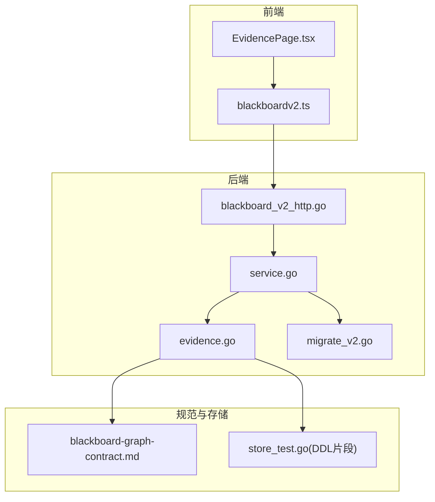
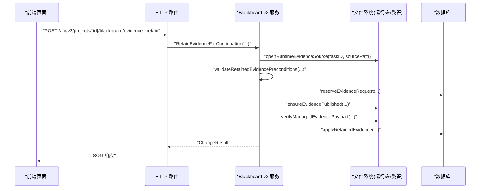
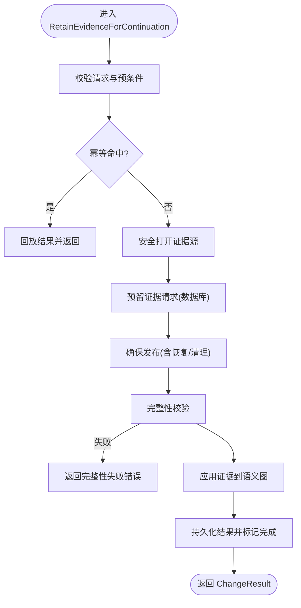
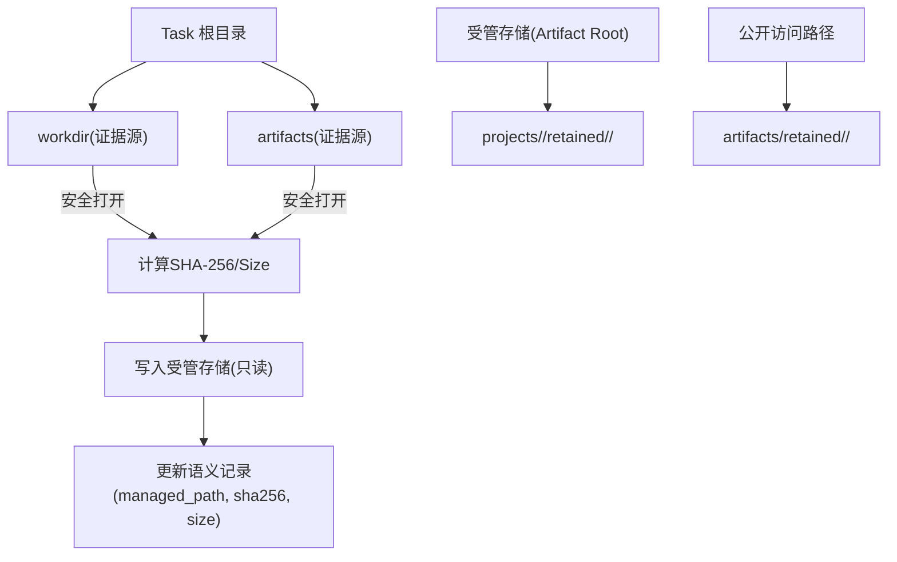
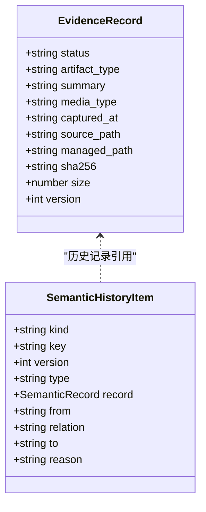
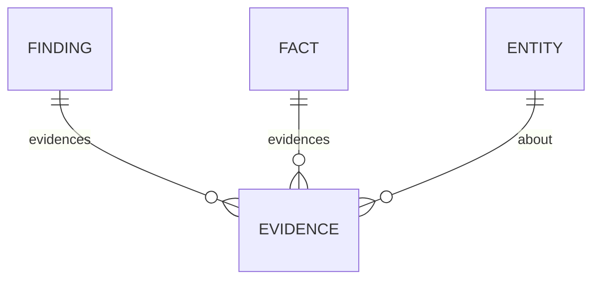
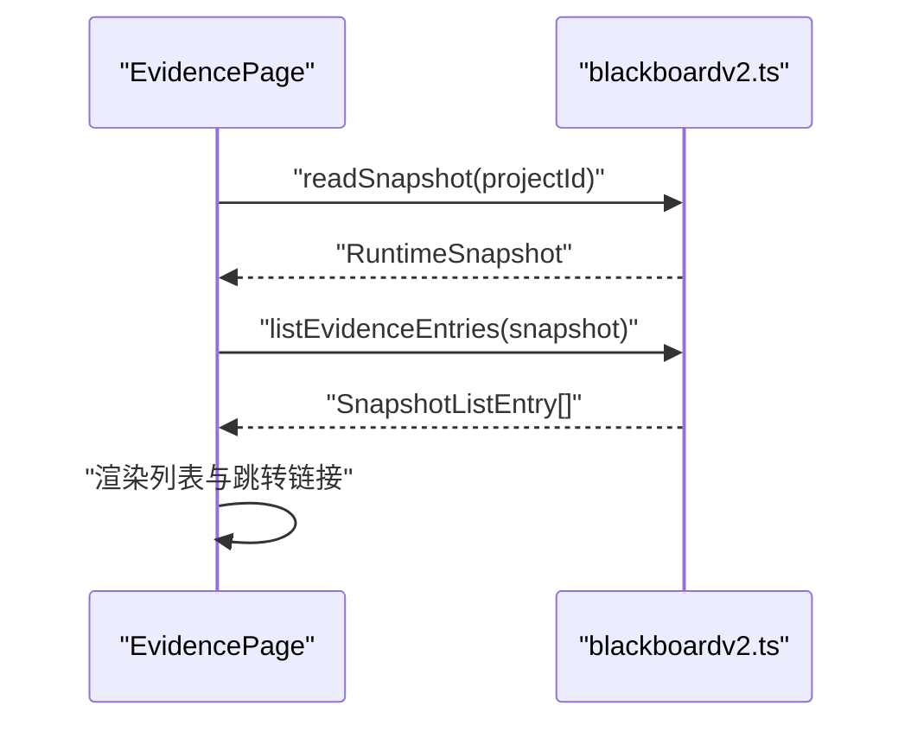
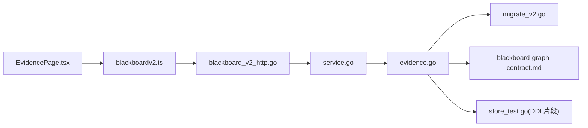

# 证据查看器

<cite>
**本文引用的文件**   
- [internal/blackboardv2/evidence.go](file://internal/blackboardv2/evidence.go)
- [internal/blackboardv2/service.go](file://internal/blackboardv2/service.go)
- [internal/daemon/blackboard_v2_http.go](file://internal/daemon/blackboard_v2_http.go)
- [web/src/pages/EvidencePage.tsx](file://web/src/pages/EvidencePage.tsx)
- [web/src/lib/blackboardv2.ts](file://web/src/lib/blackboardv2.ts)
- [docs/specs/blackboard-graph-contract.md](file://docs/specs/blackboard-graph-contract.md)
- [internal/store/store_test.go](file://internal/store/store_test.go)
- [internal/blackboardmigration/migrate_v2.go](file://internal/blackboardmigration/migrate_v2.go)
</cite>

## 目录
1. [简介](#简介)
2. [项目结构](#项目结构)
3. [核心组件](#核心组件)
4. [架构总览](#架构总览)
5. [详细组件分析](#详细组件分析)
6. [依赖关系分析](#依赖关系分析)
7. [性能与可靠性](#性能与可靠性)
8. [故障排查指南](#故障排查指南)
9. [结论](#结论)
10. [附录：API 与前端使用示例](#附录api-与前端使用示例)

## 简介
本文件面向“证据查看器”页面及其后端支撑能力，系统性说明测试证据的收集、验证、存储、元数据管理、访问控制、完整性校验、版本追踪与审计日志等实现要点，并解释证据与发现（Finding）、事实（Fact）之间的关联关系和数据引用机制。文档同时提供前端展示与交互流程、后端持久化与发布流程、以及可操作的 API 与前端调用路径参考。

## 项目结构
证据查看器由前后端协同构成：
- 前端页面：基于 React 的证据列表页，读取当前快照中的证据条目，并提供跳转至详情记录的链接。
- 前端库：封装了 Blackboard v2 快照解析、类型定义、证据条目提取等工具函数。
- 后端服务：Blackboard v2 语义服务负责证据保留、完整性校验、发布、版本管理与关系维护；HTTP 层暴露证据保留接口；迁移模块对历史证据进行一致性校验。

图表来源
- [web/src/pages/EvidencePage.tsx:1-82](file://web/src/pages/EvidencePage.tsx#L1-L82)
- [web/src/lib/blackboardv2.ts:1598-1603](file://web/src/lib/blackboardv2.ts#L1598-1603)
- [internal/daemon/blackboard_v2_http.go:37](file://internal/daemon/blackboard_v2_http.go#L37)
- [internal/blackboardv2/service.go:40-70](file://internal/blackboardv2/service.go#L40-L70)
- [internal/blackboardv2/evidence.go:196-360](file://internal/blackboardv2/evidence.go#L196-L360)
- [docs/specs/blackboard-graph-contract.md:342-360](file://docs/specs/blackboard-graph-contract.md#L342-L360)
- [internal/store/store_test.go:383-401](file://internal/store/store_test.go#L383-L401)

章节来源
- [web/src/pages/EvidencePage.tsx:1-82](file://web/src/pages/EvidencePage.tsx#L1-L82)
- [web/src/lib/blackboardv2.ts:1598-1603](file://web/src/lib/blackboardv2.ts#L1598-1603)
- [internal/daemon/blackboard_v2_http.go:37](file://internal/daemon/blackboard_v2_http.go#L37)
- [internal/blackboardv2/service.go:40-70](file://internal/blackboardv2/service.go#L40-L70)
- [internal/blackboardv2/evidence.go:196-360](file://internal/blackboardv2/evidence.go#L196-L360)
- [docs/specs/blackboard-graph-contract.md:342-360](file://docs/specs/blackboard-graph-contract.md#L342-L360)
- [internal/store/store_test.go:383-401](file://internal/store/store_test.go#L383-L401)

## 核心组件
- 证据保留请求与校验
  - 请求体包含幂等键、目标 key、版本、来源路径、制品类型、摘要、媒体类型、捕获时间、关系链接等字段，并在服务端严格校验字段白名单与取值约束。
  - 幂等性通过 idempotency_key + request_hash 双重保障，避免重复提交与语义冲突。
- 证据源安全打开与完整性校验
  - 仅允许从受控的 Task 根目录（workdir/artifacts）内读取，禁止符号链接与越界路径，计算 SHA-256 并记录大小。
  - 在发布前与发布后均进行完整性校验，失败则拒绝语义提交。
- 证据发布与原子性
  - 采用“预留-暂存-发布-检查点-完成”的状态机，支持断点恢复与离线恢复，确保并发与崩溃场景下的最终一致。
- 元数据与版本追踪
  - 证据记录包含 version、status、artifact_type、summary、media_type、captured_at、managed_path、sha256、size 等元数据，并通过语义历史保存变更轨迹。
- 关联关系
  - 证据可通过 evidences/about 两类关系指向实体、事实、发现或解决方案，形成可追溯的知识图谱。
- 前端展示
  - 证据页面从当前快照中筛选 evidence 类型条目，按 key 排序展示，点击跳转至对应记录的详情视图。

章节来源
- [internal/blackboardv2/evidence.go:77-161](file://internal/blackboardv2/evidence.go#L77-L161)
- [internal/blackboardv2/evidence.go:540-575](file://internal/blackboardv2/evidence.go#L540-L575)
- [internal/blackboardv2/evidence.go:1291-1316](file://internal/blackboardv2/evidence.go#L1291-L316)
- [internal/blackboardv2/evidence.go:1449-1466](file://internal/blackboardv2/evidence.go#L1449-L1466)
- [web/src/pages/EvidencePage.tsx:18-38](file://web/src/pages/EvidencePage.tsx#L18-L38)
- [web/src/lib/blackboardv2.ts:1598-1603](file://web/src/lib/blackboardv2.ts#L1598-1603)

## 架构总览
证据查看器的端到端流程如下：
- 运行时将产物写入 Task 工作区或 artifacts 目录。
- 通过 HTTP 接口触发 Retain Evidence，后端校验来源、计算哈希、预留与暂存、发布到受管存储、更新语义图并返回结果。
- 前端通过读取快照获取证据列表，并可跳转到具体证据详情。

图表来源
- [internal/daemon/blackboard_v2_http.go:37](file://internal/daemon/blackboard_v2_http.go#L37)
- [internal/blackboardv2/evidence.go:196-360](file://internal/blackboardv2/evidence.go#L196-L360)
- [internal/blackboardv2/evidence.go:540-575](file://internal/blackboardv2/evidence.go#L540-L575)
- [internal/blackboardv2/evidence.go:788-800](file://internal/blackboardv2/evidence.go#L788-L800)
- [internal/blackboardv2/evidence.go:1291-1316](file://internal/blackboardv2/evidence.go#L1291-L316)
- [internal/blackboardv2/evidence.go:1449-1466](file://internal/blackboardv2/evidence.go#L1449-L1466)

## 详细组件分析

### 证据保留与服务编排
- 入口方法
  - RetainEvidenceForContinuation 负责完整生命周期：参数校验、幂等去重、权限与状态检查、源文件安全打开、预留与暂存、发布与完整性校验、语义提交与结果落盘。
- 关键子过程
  - validateRetainedEvidencePreconditions：校验 Attempt 是否当前且开放、Key 是否存在与版本冲突、Links 目标存在且关系合法。
  - openRuntimeEvidenceSource：限定只能从 Task 的 workdir/artifacts 下读取，拒绝符号链接与越界路径，计算 SHA-256 与 size。
  - reserveEvidenceRequest：在数据库中插入证据请求行，状态为 reserved，记录内部路径与临时路径。
  - ensureEvidencePublished：处理已存在/缺失情况，必要时执行迁移兼容与清理，保证幂等与可恢复。
  - verifyManagedEvidencePayload：对受管存储中的证据进行完整性校验，失败即拒绝后续步骤。
  - applyRetainedEvidence：将证据写入语义图，建立关系，生成 ChangeResult。
- 失败注入与恢复
  - 通过 EvidenceFailurePoint 在多个边界注入失败，用于验证重试与恢复逻辑。
  - 支持 offlineRecoveryExists 与迁移 2.7 兼容路径恢复。

图表来源
- [internal/blackboardv2/evidence.go:196-360](file://internal/blackboardv2/evidence.go#L196-L360)
- [internal/blackboardv2/evidence.go:412-474](file://internal/blackboardv2/evidence.go#L412-L474)
- [internal/blackboardv2/evidence.go:540-575](file://internal/blackboardv2/evidence.go#L540-L575)
- [internal/blackboardv2/evidence.go:788-800](file://internal/blackboardv2/evidence.go#L788-L800)
- [internal/blackboardv2/evidence.go:1291-1316](file://internal/blackboardv2/evidence.go#L1291-L316)
- [internal/blackboardv2/evidence.go:1449-1466](file://internal/blackboardv2/evidence.go#L1449-L1466)

章节来源
- [internal/blackboardv2/evidence.go:196-360](file://internal/blackboardv2/evidence.go#L196-L360)
- [internal/blackboardv2/evidence.go:412-474](file://internal/blackboardv2/evidence.go#L412-L474)
- [internal/blackboardv2/evidence.go:540-575](file://internal/blackboardv2/evidence.go#L540-L575)
- [internal/blackboardv2/evidence.go:788-800](file://internal/blackboardv2/evidence.go#L788-L800)
- [internal/blackboardv2/evidence.go:1291-1316](file://internal/blackboardv2/evidence.go#L1291-L316)
- [internal/blackboardv2/evidence.go:1449-1466](file://internal/blackboardv2/evidence.go#L1449-L1466)

### 证据文件存储结构与访问控制
- 存储布局
  - 受管存储路径形如 artifacts/retained/<digest>/<filename>，按项目隔离与内容寻址组织。
  - 任务根目录 workdir/artifacts 作为证据源，受限于相对路径与白名单目录。
- 访问控制
  - 仅允许从 Task 根目录内的 workdir/artifacts 读取，拒绝符号链接与非普通文件，防止逃逸与篡改。
  - 受管存储写入后不可写，确保只读性与防篡改。
- 迁移兼容性
  - 迁移阶段会校验 managed_path 合法性与内容完整性，确保历史证据可用。

图表来源
- [internal/blackboardv2/evidence.go:649-672](file://internal/blackboardv2/evidence.go#L649-L672)
- [internal/blackboardv2/evidence.go:705-719](file://internal/blackboardv2/evidence.go#L705-L719)
- [internal/blackboardv2/evidence.go:764-773](file://internal/blackboardv2/evidence.go#L764-L773)
- [internal/blackboardmigration/migrate_v2.go:564-601](file://internal/blackboardmigration/migrate_v2.go#L564-L601)

章节来源
- [internal/blackboardv2/evidence.go:649-672](file://internal/blackboardv2/evidence.go#L649-L672)
- [internal/blackboardv2/evidence.go:705-719](file://internal/blackboardv2/evidence.go#L705-L719)
- [internal/blackboardv2/evidence.go:764-773](file://internal/blackboardv2/evidence.go#L764-L773)
- [internal/blackboardmigration/migrate_v2.go:564-601](file://internal/blackboardmigration/migrate_v2.go#L564-L601)

### 元数据管理与版本追踪
- 元数据字段
  - artifact_type、media_type、source_path、managed_path、sha256、size、summary、status、captured_at 等。
- 版本控制
  - 每次替换需显式指定 version，服务端校验期望版本与当前版本一致，避免覆盖竞争。
- 语义历史
  - 所有变更以历史项形式记录，包括 from/to/relation/reason 等，便于审计与回溯。

图表来源
- [web/src/lib/blackboardv2.ts:176-238](file://web/src/lib/blackboardv2.ts#L176-L238)
- [docs/specs/blackboard-graph-contract.md:342-360](file://docs/specs/blackboard-graph-contract.md#L342-L360)

章节来源
- [web/src/lib/blackboardv2.ts:176-238](file://web/src/lib/blackboardv2.ts#L176-L238)
- [docs/specs/blackboard-graph-contract.md:342-360](file://docs/specs/blackboard-graph-contract.md#L342-L360)

### 证据与发现、事实的关联关系与数据引用
- 关系类型
  - 证据可通过 evidences 关系被发现或事实引用，或通过 about 关系描述相关实体。
- 数据引用机制
  - 通过 key 进行跨记录引用，前端与后端均以 key 作为稳定标识符。
  - 快照中包含 relations 数组，呈现证据与其他实体的边。

图表来源
- [web/src/lib/blackboardv2.ts:14-26](file://web/src/lib/blackboardv2.ts#L14-L26)
- [web/src/lib/blackboardv2.ts:167-174](file://web/src/lib/blackboardv2.ts#L167-L174)

章节来源
- [web/src/lib/blackboardv2.ts:14-26](file://web/src/lib/blackboardv2.ts#L14-L26)
- [web/src/lib/blackboardv2.ts:167-174](file://web/src/lib/blackboardv2.ts#L167-L174)

### 前端证据查看器页面
- 功能概述
  - 读取当前项目的 Blackboard v2 快照，过滤出 evidence 类型的条目，按 key 排序展示。
  - 每条证据显示主标题、次级信息与状态徽章，点击跳转至记录详情。
- 数据来源
  - 通过 readSnapshot 获取快照，listEvidenceEntries 提取证据条目。
- 空状态提示
  - 当无证据时，提示需要显式附加或保留运行时工作目录文件。

图表来源
- [web/src/pages/EvidencePage.tsx:23-38](file://web/src/pages/EvidencePage.tsx#L23-L38)
- [web/src/lib/blackboardv2.ts:1598-1603](file://web/src/lib/blackboardv2.ts#L1598-1603)

章节来源
- [web/src/pages/EvidencePage.tsx:18-38](file://web/src/pages/EvidencePage.tsx#L18-L38)
- [web/src/lib/blackboardv2.ts:1598-1603](file://web/src/lib/blackboardv2.ts#L1598-1603)

## 依赖关系分析
- 前端依赖
  - EvidencePage 依赖 blackboardv2.ts 提供的快照读取与证据条目提取函数。
- 后端依赖
  - HTTP 路由注册证据保留接口，委托给 Service 的 RetainEvidenceForContinuation。
  - Service 依赖证据模块进行文件操作、完整性校验与语义提交。
  - 迁移模块在升级过程中校验证据路径与内容完整性。
- 存储与规范
  - 存储层包含证据工件表结构（legacy），用于兼容与迁移。
  - 规范文档定义了证据工件的字段与状态转换规则。

图表来源
- [web/src/pages/EvidencePage.tsx:1-82](file://web/src/pages/EvidencePage.tsx#L1-L82)
- [web/src/lib/blackboardv2.ts:1598-1603](file://web/src/lib/blackboardv2.ts#L1598-1603)
- [internal/daemon/blackboard_v2_http.go:37](file://internal/daemon/blackboard_v2_http.go#L37)
- [internal/blackboardv2/service.go:40-70](file://internal/blackboardv2/service.go#L40-L70)
- [internal/blackboardv2/evidence.go:196-360](file://internal/blackboardv2/evidence.go#L196-L360)
- [internal/blackboardmigration/migrate_v2.go:564-601](file://internal/blackboardmigration/migrate_v2.go#L564-L601)
- [docs/specs/blackboard-graph-contract.md:342-360](file://docs/specs/blackboard-graph-contract.md#L342-L360)
- [internal/store/store_test.go:383-401](file://internal/store/store_test.go#L383-L401)

章节来源
- [web/src/pages/EvidencePage.tsx:1-82](file://web/src/pages/EvidencePage.tsx#L1-L82)
- [web/src/lib/blackboardv2.ts:1598-1603](file://web/src/lib/blackboardv2.ts#L1598-1603)
- [internal/daemon/blackboard_v2_http.go:37](file://internal/daemon/blackboard_v2_http.go#L37)
- [internal/blackboardv2/service.go:40-70](file://internal/blackboardv2/service.go#L40-L70)
- [internal/blackboardv2/evidence.go:196-360](file://internal/blackboardv2/evidence.go#L196-L360)
- [internal/blackboardmigration/migrate_v2.go:564-601](file://internal/blackboardmigration/migrate_v2.go#L564-L601)
- [docs/specs/blackboard-graph-contract.md:342-360](file://docs/specs/blackboard-graph-contract.md#L342-L360)
- [internal/store/store_test.go:383-401](file://internal/store/store_test.go#L383-L401)

## 性能与可靠性
- 幂等与去重
  - 通过 idempotency_key 与 request_hash 双重校验，避免重复提交与语义冲突，提升吞吐与稳定性。
- 断点恢复
  - 多阶段检查点（reserved/published/completed）与离线恢复逻辑，支持进程重启后的自动恢复。
- 完整性校验
  - 在多处进行 SHA-256 校验，确保受管存储内容与预期一致，防止损坏或篡改。
- 并发安全
  - 通过数据库唯一约束与状态机锁步推进，避免竞态导致的覆盖或丢失。
- 资源清理
  - 发布完成后清理历史暂存与迁移兼容残留，减少磁盘占用。

[本节为通用指导，不直接分析具体文件]

## 故障排查指南
- 常见错误码与含义
  - evidence_integrity_failed：受管存储证据完整性校验失败，检查文件是否被篡改或损坏。
  - evidence_source_forbidden：证据源路径越界或非受控目录，检查 source_path 是否在 workdir/artifacts 范围内。
  - evidence_source_changed：幂等重试时源文件发生变化，检查上游是否修改了原始文件。
  - authority_denied：信任的 Continuation 未拥有该项目或凭证不匹配，检查 continuationID 与项目绑定。
  - closed_continuation：Continuation 已关闭，无法写入新证据，检查任务状态。
  - not_found/key_conflict/version_conflict：目标记录不存在、key 冲突或版本不一致，检查输入参数与当前记录状态。
- 定位建议
  - 查看证据请求状态（reserved/published/completed）与 result_json 回放结果。
  - 核对 managed_path 与 sha256/size 是否与受管存储一致。
  - 检查迁移兼容路径与历史暂存是否被正确清理。

章节来源
- [internal/blackboardv2/evidence.go:338-340](file://internal/blackboardv2/evidence.go#L338-L340)
- [internal/blackboardv2/evidence.go:546-560](file://internal/blackboardv2/evidence.go#L546-L560)
- [internal/blackboardv2/evidence.go:779-781](file://internal/blackboardv2/evidence.go#L779-L781)
- [internal/blackboardv2/evidence.go:399-404](file://internal/blackboardv2/evidence.go#L399-L404)
- [internal/blackboardv2/evidence.go:434-436](file://internal/blackboardv2/evidence.go#L434-L436)
- [internal/blackboardv2/evidence.go:437-460](file://internal/blackboardv2/evidence.go#L437-L460)

## 结论
证据查看器围绕“可信来源、强校验、幂等发布、可追溯”的设计原则构建。后端通过严格的源路径控制、完整性校验与状态机发布流程，确保证据的完整性与一致性；前端通过快照与关系图提供直观的查看与导航体验。结合版本追踪与语义历史，系统实现了完整的证据生命周期管理与审计能力。

[本节为总结性内容，不直接分析具体文件]

## 附录：API 与前端使用示例

### 后端 API：保留证据
- 接口
  - POST /api/v2/projects/{id}/blackboard/evidence:retain
- 请求体关键字段
  - idempotency_key、key、version、attempt、source_path、artifact_type、summary、media_type、captured_at、links
- 行为
  - 校验与幂等去重、安全打开证据源、预留与暂存、发布与完整性校验、语义提交与结果落盘。

章节来源
- [internal/daemon/blackboard_v2_http.go:37](file://internal/daemon/blackboard_v2_http.go#L37)
- [internal/blackboardv2/evidence.go:77-161](file://internal/blackboardv2/evidence.go#L77-L161)
- [internal/blackboardv2/evidence.go:196-360](file://internal/blackboardv2/evidence.go#L196-L360)

### 前端：读取快照与列出证据
- 读取快照
  - 调用 readSnapshot(projectId) 获取 RuntimeSnapshot。
- 列出证据
  - 调用 listEvidenceEntries(snapshot) 过滤并排序证据条目。
- 跳转详情
  - 使用 recordHref(projectId, key) 生成详情链接。

章节来源
- [web/src/pages/EvidencePage.tsx:23-38](file://web/src/pages/EvidencePage.tsx#L23-L38)
- [web/src/lib/blackboardv2.ts:1598-1603](file://web/src/lib/blackboardv2.ts#L1598-1603)