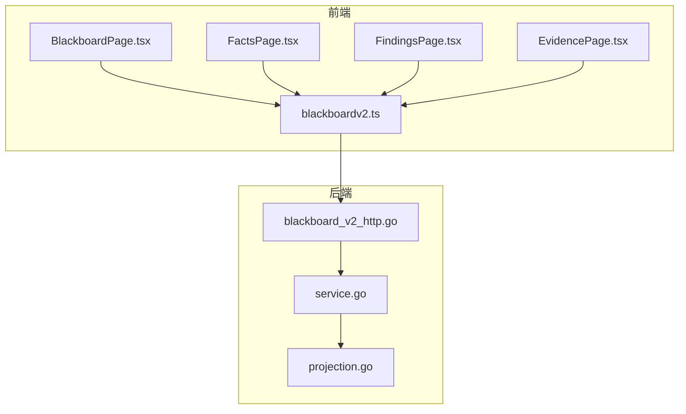
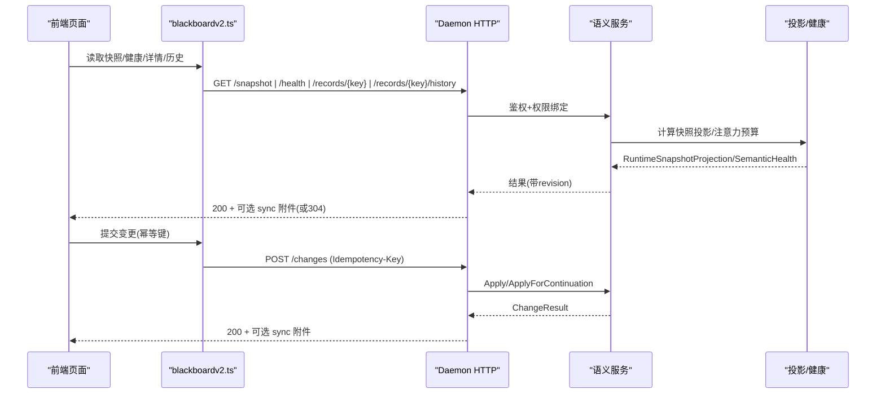
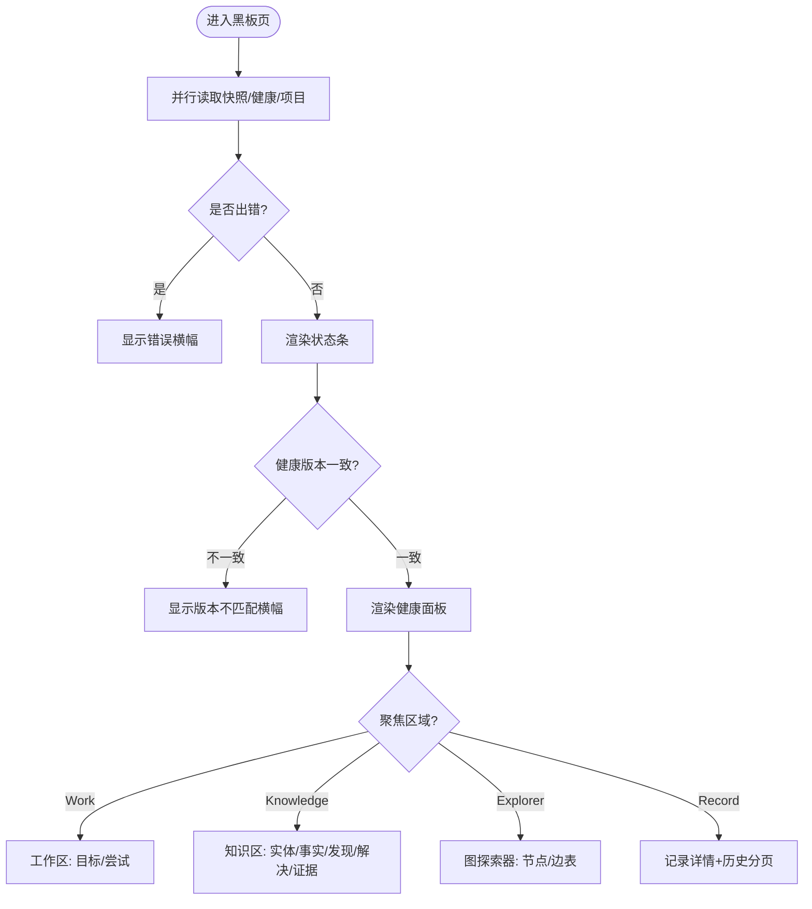
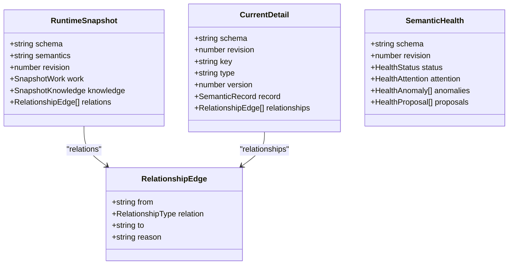
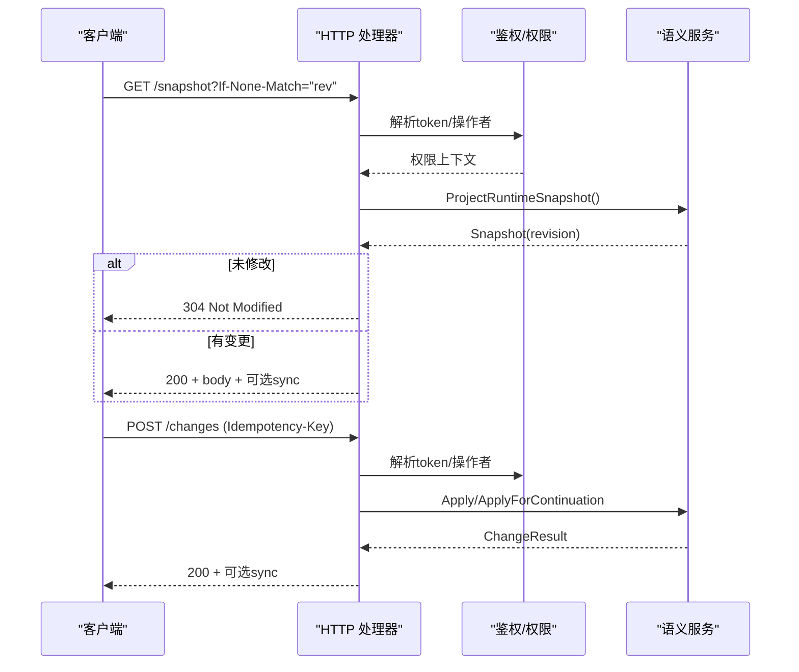
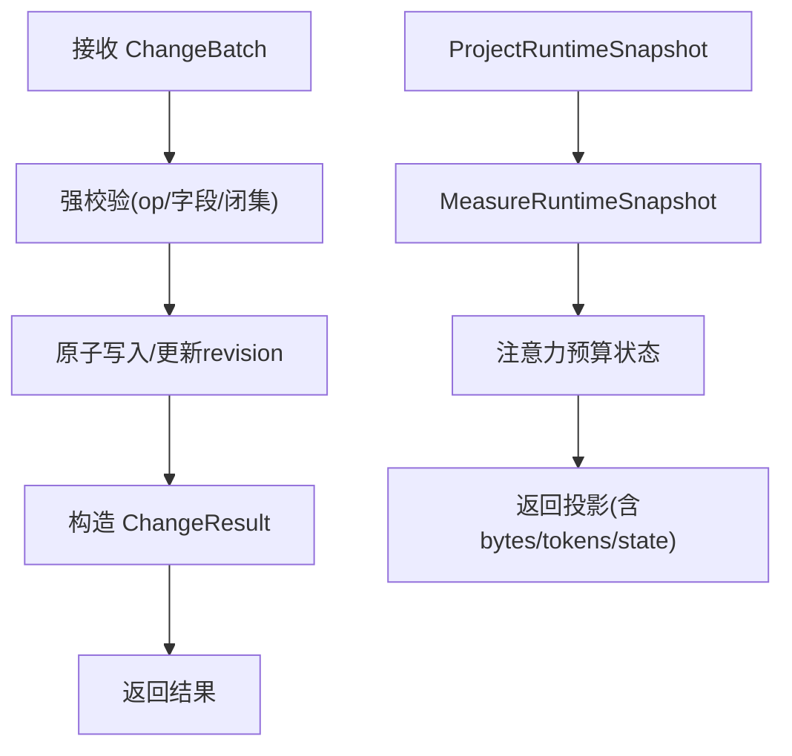
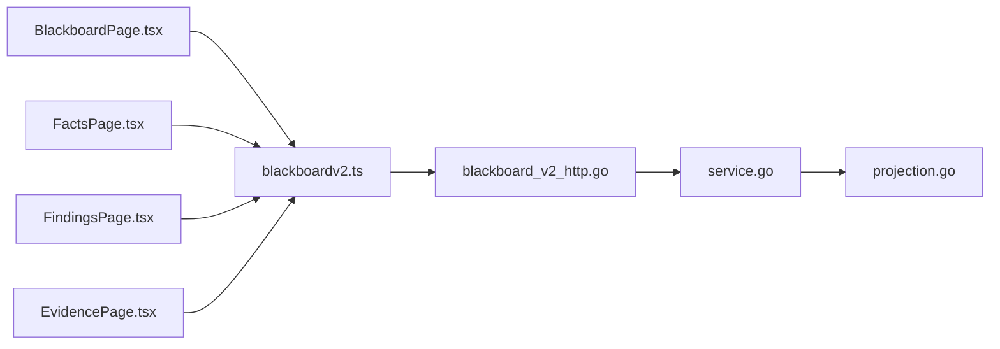

# 黑板视图页面

<cite>
**本文引用的文件**   
- [web/src/pages/BlackboardPage.tsx](file://web/src/pages/BlackboardPage.tsx)
- [web/src/lib/blackboardv2.ts](file://web/src/lib/blackboardv2.ts)
- [internal/daemon/blackboard_v2_http.go](file://internal/daemon/blackboard_v2_http.go)
- [internal/blackboardv2/service.go](file://internal/blackboardv2/service.go)
- [internal/blackboardv2/projection.go](file://internal/blackboardv2/projection.go)
- [web/src/pages/FactsPage.tsx](file://web/src/pages/FactsPage.tsx)
- [web/src/pages/FindingsPage.tsx](file://web/src/pages/FindingsPage.tsx)
- [web/src/pages/EvidencePage.tsx](file://web/src/pages/EvidencePage.tsx)
</cite>

## 目录
1. [简介](#简介)
2. [项目结构](#项目结构)
3. [核心组件](#核心组件)
4. [架构总览](#架构总览)
5. [详细组件分析](#详细组件分析)
6. [依赖关系分析](#依赖关系分析)
7. [性能与实时性](#性能与实时性)
8. [故障排查指南](#故障排查指南)
9. [结论](#结论)
10. [附录：API 契约与示例路径](#附录api-契约与示例路径)

## 简介
本文件面向“黑板视图”相关的前端页面与后端服务，系统性解释语义黑板的数据可视化、实体关系图谱、过滤搜索、事实查看、发现管理与证据浏览的实现机制。文档覆盖数据投影、实时更新与性能优化方案，并提供复杂查询构建、图表展示与交互操作的代码级参考路径。同时说明与 Blackboard v2 系统的深度集成与实时数据同步（含 ETag/If-None-Match、Idempotency-Key 与同步附件）。

## 项目结构
黑板视图由前端 React 页面与后端 Go 服务共同构成：
- 前端页面
  - 主黑板页：工作区/知识区/图探索器/记录详情
  - 专用列表页：事实、发现、证据
- 前端库
  - blackboardv2.ts：类型定义、解析校验、快照/健康/历史/报告等 API 调用与数据转换
- 后端服务
  - Daemon HTTP 路由：Blackboard v2 的变更、快照、健康、记录读取、历史、证据保留、检查点、完成、报告等接口
  - 语义服务：ChangeBatch 应用、当前详情、历史、运行时快照投影、注意力预算与健康诊断

**图示来源**
- [web/src/pages/BlackboardPage.tsx:1-120](file://web/src/pages/BlackboardPage.tsx#L1-L120)
- [web/src/lib/blackboardv2.ts:1-120](file://web/src/lib/blackboardv2.ts#L1-L120)
- [internal/daemon/blackboard_v2_http.go:29-46](file://internal/daemon/blackboard_v2_http.go#L29-L46)
- [internal/blackboardv2/service.go:40-70](file://internal/blackboardv2/service.go#L40-L70)
- [internal/blackboardv2/projection.go:50-85](file://internal/blackboardv2/projection.go#L50-L85)

**章节来源**
- [web/src/pages/BlackboardPage.tsx:1-120](file://web/src/pages/BlackboardPage.tsx#L1-L120)
- [web/src/lib/blackboardv2.ts:1-120](file://web/src/lib/blackboardv2.ts#L1-L120)
- [internal/daemon/blackboard_v2_http.go:29-46](file://internal/daemon/blackboard_v2_http.go#L29-L46)
- [internal/blackboardv2/service.go:40-70](file://internal/blackboardv2/service.go#L40-L70)
- [internal/blackboardv2/projection.go:50-85](file://internal/blackboardv2/projection.go#L50-L85)

## 核心组件
- 前端黑板主面板
  - 子导航与工作/知识/探索/记录四个视图
  - 状态条显示版本、健康、注意力预算、条目计数
  - 健康面板展示异常与建议项
  - 工作区列出目标与尝试；知识区分实体、事实、发现、解决方案、证据
  - 缺失证据提示
- 前端库 blackboardv2.ts
  - 严格模式解析：快照、健康、历史、报告等 DTO 的结构化校验
  - 列表生成：listSnapshotEntries、listFindingEntries、listEvidenceEntries
  - 图探索模型：buildGraphExplorer
  - API 封装：readSnapshot/readSemanticHealth/readCurrentDetail/readSemanticHistory 等
- 后端 HTTP 层
  - 统一鉴权与权限绑定（操作者/Continuation）
  - 条件响应（ETag/If-None-Match）、幂等键（Idempotency-Key）与同步附件
  - 路由：changes/snapshot/health/records/{key}/history/evidence:retain/attempts/:checkpoint/continuation:finish/reports/*
- 语义服务
  - ChangeBatch 原子应用、当前详情、历史分页、运行时快照投影、注意力预算测量与健康诊断

**章节来源**
- [web/src/pages/BlackboardPage.tsx:157-213](file://web/src/pages/BlackboardPage.tsx#L157-L213)
- [web/src/lib/blackboardv2.ts:1018-1242](file://web/src/lib/blackboardv2.ts#L1018-L1242)
- [internal/daemon/blackboard_v2_http.go:29-46](file://internal/daemon/blackboard_v2_http.go#L29-L46)
- [internal/blackboardv2/service.go:644-656](file://internal/blackboardv2/service.go#L644-L656)
- [internal/blackboardv2/projection.go:50-85](file://internal/blackboardv2/projection.go#L50-L85)

## 架构总览
黑板视图采用“前端只读 + 后端写时幂等”的架构。前端通过 blackboardv2.ts 调用 /api/v2/projects/{id}/blackboard/* 系列接口，后端在 Daemon 中统一鉴权后委派至语义服务。快照与健康为“当前态”读取，支持 ETag 条件请求；变更类接口要求 Idempotency-Key，并可在错误/成功响应中附带同步附件以支持重试与最终一致性。

**图示来源**
- [web/src/lib/blackboardv2.ts:1251-1280](file://web/src/lib/blackboardv2.ts#L1251-L1280)
- [internal/daemon/blackboard_v2_http.go:97-142](file://internal/daemon/blackboard_v2_http.go#L97-L142)
- [internal/blackboardv2/service.go:644-656](file://internal/blackboardv2/service.go#L644-L656)
- [internal/blackboardv2/projection.go:50-85](file://internal/blackboardv2/projection.go#L50-L85)

## 详细组件分析

### 前端黑板主面板（BlackboardPage）
- 功能要点
  - 子导航：Work/Knowledge/Explorer/Record
  - 状态条：Revision、Kind、Health、Attention、Current Work、Knowledge 计数
  - 健康面板：状态、注意力预算、异常与建议项
  - 工作区：Objectives/Attempts
  - 知识区：Entities/Facts/Findings/Solutions/Evidence（按项目类型动态分组）
  - 缺失证据提示
  - 记录详情：当前详情 + 历史分页
- 关键实现路径
  - 子导航与路由解析：[web/src/pages/BlackboardPage.tsx:34-67](file://web/src/pages/BlackboardPage.tsx#L34-L67)
  - 快照/健康/项目并行加载与错误处理：[web/src/pages/BlackboardPage.tsx:121-155](file://web/src/pages/BlackboardPage.tsx#L121-L155)
  - 状态条与健康面板渲染：[web/src/pages/BlackboardPage.tsx:215-354](file://web/src/pages/BlackboardPage.tsx#L215-L354)
  - 工作区与知识区分组渲染：[web/src/pages/BlackboardPage.tsx:437-518](file://web/src/pages/BlackboardPage.tsx#L437-L518)
  - 图探索器：节点/边表格展示：[web/src/pages/BlackboardPage.tsx:592-734](file://web/src/pages/BlackboardPage.tsx#L592-L734)
  - 记录详情与历史分页：[web/src/pages/BlackboardPage.tsx:736-800](file://web/src/pages/BlackboardPage.tsx#L736-L800)

**图示来源**
- [web/src/pages/BlackboardPage.tsx:121-213](file://web/src/pages/BlackboardPage.tsx#L121-L213)
- [web/src/pages/BlackboardPage.tsx:437-518](file://web/src/pages/BlackboardPage.tsx#L437-L518)
- [web/src/pages/BlackboardPage.tsx:592-734](file://web/src/pages/BlackboardPage.tsx#L592-L734)
- [web/src/pages/BlackboardPage.tsx:736-800](file://web/src/pages/BlackboardPage.tsx#L736-L800)

**章节来源**
- [web/src/pages/BlackboardPage.tsx:34-67](file://web/src/pages/BlackboardPage.tsx#L34-L67)
- [web/src/pages/BlackboardPage.tsx:121-155](file://web/src/pages/BlackboardPage.tsx#L121-L155)
- [web/src/pages/BlackboardPage.tsx:215-354](file://web/src/pages/BlackboardPage.tsx#L215-L354)
- [web/src/pages/BlackboardPage.tsx:437-518](file://web/src/pages/BlackboardPage.tsx#L437-L518)
- [web/src/pages/BlackboardPage.tsx:592-734](file://web/src/pages/BlackboardPage.tsx#L592-L734)
- [web/src/pages/BlackboardPage.tsx:736-800](file://web/src/pages/BlackboardPage.tsx#L736-L800)

### 前端库 blackboardv2.ts（数据契约与工具）
- 类型与常量
  - 运行快照 schema、记录 detail schema、历史 schema、健康 schema
  - 关系类型闭集、记录类型闭集、快照字段白名单
- 解析与校验
  - parseRuntimeSnapshot、parseCurrentDetail、parseSemanticHealth、parseSemanticHistory
  - 结构化强校验：字段白名单、枚举值、长度限制、必填校验
- 列表与图模型
  - listSnapshotEntries：将快照扁平化为列表行（work/knowledge）
  - listFindingEntries/listEvidenceEntries：按业务排序与筛选
  - buildGraphExplorer：从快照构建节点/边模型
- API 封装
  - readSnapshot/readSemanticHealth/readCurrentDetail/readSemanticHistory
  - 报告读取：pentest-report/ctf-solution（markdown/json）
- 错误格式化
  - formatBlackboardV2Error：从 ApiError 提取稳定错误体

**图示来源**
- [web/src/lib/blackboardv2.ts:167-218](file://web/src/lib/blackboardv2.ts#L167-L218)
- [web/src/lib/blackboardv2.ts:283-290](file://web/src/lib/blackboardv2.ts#L283-L290)
- [web/src/lib/blackboardv2.ts:159-165](file://web/src/lib/blackboardv2.ts#L159-L165)

**章节来源**
- [web/src/lib/blackboardv2.ts:1-120](file://web/src/lib/blackboardv2.ts#L1-L120)
- [web/src/lib/blackboardv2.ts:634-695](file://web/src/lib/blackboardv2.ts#L634-L695)
- [web/src/lib/blackboardv2.ts:744-765](file://web/src/lib/blackboardv2.ts#L744-L765)
- [web/src/lib/blackboardv2.ts:807-909](file://web/src/lib/blackboardv2.ts#L807-L909)
- [web/src/lib/blackboardv2.ts:925-961](file://web/src/lib/blackboardv2.ts#L925-L961)
- [web/src/lib/blackboardv2.ts:1018-1242](file://web/src/lib/blackboardv2.ts#L1018-L1242)
- [web/src/lib/blackboardv2.ts:1251-1280](file://web/src/lib/blackboardv2.ts#L1251-L1280)
- [web/src/lib/blackboardv2.ts:1568-1602](file://web/src/lib/blackboardv2.ts#L1568-L1602)
- [web/src/lib/blackboardv2.ts:1605-1615](file://web/src/lib/blackboardv2.ts#L1605-L1615)

### 后端 HTTP 路由与同步机制（Daemon）
- 路由注册
  - /api/v2/projects/{id}/blackboard/changes
  - /api/v2/projects/{id}/blackboard/snapshot
  - /api/v2/projects/{id}/blackboard/health
  - /api/v2/projects/{id}/blackboard/records/{key}
  - /api/v2/projects/{id}/blackboard/records/{key}/history
  - /api/v2/projects/{id}/blackboard/evidence:retain
  - /api/v2/projects/{id}/blackboard/attempts/{attempt_action}
  - /api/v2/projects/{id}/continuation:finish
  - /api/v2/projects/{id}/reports/pentest | /reports/ctf-solution
- 鉴权与权限
  - 操作者直连 vs Continuation Token 授权
  - 禁止在查询串传递 token
- 条件响应与幂等
  - ETag/If-None-Match 对 snapshot/health/record/history 生效
  - Idempotency-Key 用于变更/证据保留/检查点/完成
  - 同步附件：在错误/成功响应中附加同一项目的同步信息，支持重试与最终一致
- 错误映射
  - storage_busy → 503 + Retry-After
  - invalid_schema → 400
  - authority_denied → 401/403
  - not_found → 404
  - closed_continuation → 410
  - 冲突/语义验证失败 → 409/422

**图示来源**
- [internal/daemon/blackboard_v2_http.go:29-46](file://internal/daemon/blackboard_v2_http.go#L29-L46)
- [internal/daemon/blackboard_v2_http.go:97-142](file://internal/daemon/blackboard_v2_http.go#L97-L142)
- [internal/daemon/blackboard_v2_http.go:375-438](file://internal/daemon/blackboard_v2_http.go#L375-L438)
- [internal/daemon/blackboard_v2_http.go:495-562](file://internal/daemon/blackboard_v2_http.go#L495-L562)
- [internal/daemon/blackboard_v2_http.go:612-642](file://internal/daemon/blackboard_v2_http.go#L612-L642)

**章节来源**
- [internal/daemon/blackboard_v2_http.go:29-46](file://internal/daemon/blackboard_v2_http.go#L29-L46)
- [internal/daemon/blackboard_v2_http.go:97-142](file://internal/daemon/blackboard_v2_http.go#L97-L142)
- [internal/daemon/blackboard_v2_http.go:375-438](file://internal/daemon/blackboard_v2_http.go#L375-L438)
- [internal/daemon/blackboard_v2_http.go:495-562](file://internal/daemon/blackboard_v2_http.go#L495-L562)
- [internal/daemon/blackboard_v2_http.go:612-642](file://internal/daemon/blackboard_v2_http.go#L612-L642)

### 语义服务与数据投影（Service & Projection）
- 变更应用
  - ChangeBatch 强校验与原子写入
  - 返回 ChangeResult（包含受影响记录/关系与 WorkingSnapshot）
- 当前详情与历史
  - ReadCurrent：返回 blackboard-record/v2
  - ReadHistory：分页游标
- 运行时快照投影
  - ProjectRuntimeSnapshot：序列化快照 + 字节数 + 估计 token + 注意力预算状态
  - MeasureRuntimeSnapshot：基于 4 bytes/token 估算，阈值 16K/32K/64K
- 健康诊断
  - ProjectSemanticHealth：状态、注意力预算、异常与建议项

**图示来源**
- [internal/blackboardv2/service.go:72-120](file://internal/blackboardv2/service.go#L72-L120)
- [internal/blackboardv2/service.go:644-656](file://internal/blackboardv2/service.go#L644-L656)
- [internal/blackboardv2/projection.go:50-85](file://internal/blackboardv2/projection.go#L50-L85)
- [internal/blackboardv2/projection.go:87-109](file://internal/blackboardv2/projection.go#L87-L109)

**章节来源**
- [internal/blackboardv2/service.go:72-120](file://internal/blackboardv2/service.go#L72-L120)
- [internal/blackboardv2/service.go:644-656](file://internal/blackboardv2/service.go#L644-L656)
- [internal/blackboardv2/projection.go:50-85](file://internal/blackboardv2/projection.go#L50-L85)
- [internal/blackboardv2/projection.go:87-109](file://internal/blackboardv2/projection.go#L87-L109)

### 事实查看（Facts）
- 行为：旧书签兼容，重定向到黑屏知识页
- 实现路径：[web/src/pages/FactsPage.tsx:1-11](file://web/src/pages/FactsPage.tsx#L1-L11)

**章节来源**
- [web/src/pages/FactsPage.tsx:1-11](file://web/src/pages/FactsPage.tsx#L1-L11)

### 发现管理（Findings）
- 行为：基于当前快照列出发现，按严重级别排序，支持确认/未确认分组
- 实现路径：
  - 读取快照与列表生成：[web/src/pages/FindingsPage.tsx:18-55](file://web/src/pages/FindingsPage.tsx#L18-L55)
  - 列表渲染与标签：[web/src/pages/FindingsPage.tsx:57-104](file://web/src/pages/FindingsPage.tsx#L57-L104)
  - 底层列表函数：[web/src/lib/blackboardv2.ts:1568-1596](file://web/src/lib/blackboardv2.ts#L1568-L1596)

**章节来源**
- [web/src/pages/FindingsPage.tsx:18-55](file://web/src/pages/FindingsPage.tsx#L18-L55)
- [web/src/pages/FindingsPage.tsx:57-104](file://web/src/pages/FindingsPage.tsx#L57-L104)
- [web/src/lib/blackboardv2.ts:1568-1596](file://web/src/lib/blackboardv2.ts#L1568-L1596)

### 证据浏览（Evidence）
- 行为：基于当前快照列出证据，展示状态与类型，空态提示需显式保留
- 实现路径：
  - 读取快照与列表生成：[web/src/pages/EvidencePage.tsx:18-40](file://web/src/pages/EvidencePage.tsx#L18-L40)
  - 列表渲染与空态卡片：[web/src/pages/EvidencePage.tsx:40-82](file://web/src/pages/EvidencePage.tsx#L40-L82)
  - 底层列表函数：[web/src/lib/blackboardv2.ts:1598-1602](file://web/src/lib/blackboardv2.ts#L1598-L1602)

**章节来源**
- [web/src/pages/EvidencePage.tsx:18-40](file://web/src/pages/EvidencePage.tsx#L18-L40)
- [web/src/pages/EvidencePage.tsx:40-82](file://web/src/pages/EvidencePage.tsx#L40-L82)
- [web/src/lib/blackboardv2.ts:1598-1602](file://web/src/lib/blackboardv2.ts#L1598-L1602)

## 依赖关系分析
- 前端依赖
  - BlackboardPage 依赖 blackboardv2.ts 的类型与 API 封装
  - Facts/Findings/Evidence 均依赖 blackboardv2.ts 的快照读取与列表生成
- 后端依赖
  - HTTP 层依赖 blackboardv2 的错误与 DTO 类型
  - 语义服务依赖 store 持久化与 projection 模块
- 外部约束
  - 关系类型闭集、记录类型闭集、快照字段白名单确保前后端契约稳定

**图示来源**
- [web/src/pages/BlackboardPage.tsx:1-67](file://web/src/pages/BlackboardPage.tsx#L1-L67)
- [web/src/lib/blackboardv2.ts:1-120](file://web/src/lib/blackboardv2.ts#L1-L120)
- [internal/daemon/blackboard_v2_http.go:29-46](file://internal/daemon/blackboard_v2_http.go#L29-L46)
- [internal/blackboardv2/service.go:40-70](file://internal/blackboardv2/service.go#L40-L70)
- [internal/blackboardv2/projection.go:50-85](file://internal/blackboardv2/projection.go#L50-L85)

**章节来源**
- [web/src/pages/BlackboardPage.tsx:1-67](file://web/src/pages/BlackboardPage.tsx#L1-L67)
- [web/src/lib/blackboardv2.ts:1-120](file://web/src/lib/blackboardv2.ts#L1-L120)
- [internal/daemon/blackboard_v2_http.go:29-46](file://internal/daemon/blackboard_v2_http.go#L29-L46)
- [internal/blackboardv2/service.go:40-70](file://internal/blackboardv2/service.go#L40-L70)
- [internal/blackboardv2/projection.go:50-85](file://internal/blackboardv2/projection.go#L50-L85)

## 性能与实时性
- 条件缓存
  - 使用 ETag/If-None-Match 减少重复传输，仅在 revision 变化时返回 body
- 幂等与重试
  - 所有写操作必须携带 Idempotency-Key，服务端保证精确幂等与可重放
- 同步附件
  - 错误/成功响应可附带同步附件，客户端据此进行同项目内重试与最终一致
- 注意力预算
  - 基于字节数估算 token，超过阈值给出健康建议，避免过大快照影响启动与推理
- 前端优化
  - 列表扁平化与排序在客户端完成，避免多次请求
  - 历史记录分页加载，按需拉取

**章节来源**
- [internal/daemon/blackboard_v2_http.go:375-438](file://internal/daemon/blackboard_v2_http.go#L375-L438)
- [internal/daemon/blackboard_v2_http.go:495-562](file://internal/daemon/blackboard_v2_http.go#L495-L562)
- [internal/blackboardv2/projection.go:87-109](file://internal/blackboardv2/projection.go#L87-L109)
- [web/src/pages/BlackboardPage.tsx:736-800](file://web/src/pages/BlackboardPage.tsx#L736-L800)

## 故障排查指南
- 常见错误码与含义
  - invalid_schema：请求体或参数不符合 v2 契约
  - authority_denied：缺少或无效权限（可能 401/403）
  - not_found：资源不存在
  - closed_continuation：已关闭的 Continuation 不可用
  - version_conflict/key_conflict/relationship_conflict/idempotency_conflict/finish_conflict：并发或幂等冲突
  - semantic_validation：语义校验失败
  - storage_busy：数据库忙，应重试
- 定位步骤
  - 检查请求头：是否携带 Idempotency-Key（写操作）
  - 检查 If-None-Match：GET 是否命中 304
  - 查看响应中的 error.code/message/path 与可选 sync 附件
  - 对比 snapshot.revision 与 health.revision，避免混合不同版本的诊断

**章节来源**
- [internal/daemon/blackboard_v2_http.go:564-580](file://internal/daemon/blackboard_v2_http.go#L564-L580)
- [internal/daemon/blackboard_v2_http.go:612-642](file://internal/daemon/blackboard_v2_http.go#L612-L642)
- [web/src/lib/blackboardv2.ts:978-989](file://web/src/lib/blackboardv2.ts#L978-L989)

## 结论
黑板视图通过严格的 v2 契约、条件缓存与幂等机制，实现了高可靠的数据可视化与实时同步。前端以快照为中心进行扁平化展示与图探索，后端提供原子变更、健康诊断与投影能力。结合注意力预算与健康建议，系统在保证可用性的同时兼顾了可扩展性与稳定性。

## 附录：API 契约与示例路径
- 基础路径
  - /api/v2/projects/{projectId}/blackboard
- 主要接口
  - GET /snapshot：获取运行时快照（支持 If-None-Match）
  - GET /health：获取语义健康（支持 If-None-Match）
  - GET /records/{key}：获取当前详情
  - GET /records/{key}/history?limit=&cursor=：获取历史分页
  - POST /changes：提交变更（需要 Idempotency-Key）
  - POST /evidence:retain：保留证据（需要 Idempotency-Key）
  - POST /attempts/{action}:checkpoint：检查点（需要 Idempotency-Key）
  - POST /continuation:finish：结束任务（需要 Idempotency-Key）
  - GET /reports/pentest?format=markdown|json：渗透报告
  - GET /reports/ctf-solution?format=markdown|json：CTF 解法报告
- 前端调用示例路径
  - 读取快照：[web/src/lib/blackboardv2.ts:1251-1254](file://web/src/lib/blackboardv2.ts#L1251-L1254)
  - 读取健康：[web/src/lib/blackboardv2.ts:1256-1259](file://web/src/lib/blackboardv2.ts#L1256-L1259)
  - 读取详情：[web/src/lib/blackboardv2.ts:1261-1266](file://web/src/lib/blackboardv2.ts#L1261-L1266)
  - 读取历史：[web/src/lib/blackboardv2.ts:1268-1280](file://web/src/lib/blackboardv2.ts#L1268-L1280)
  - 读取报告：[web/src/lib/blackboardv2.ts:1536-1562](file://web/src/lib/blackboardv2.ts#L1536-L1562)

**章节来源**
- [internal/daemon/blackboard_v2_http.go:29-46](file://internal/daemon/blackboard_v2_http.go#L29-L46)
- [web/src/lib/blackboardv2.ts:1251-1280](file://web/src/lib/blackboardv2.ts#L1251-L1280)
- [web/src/lib/blackboardv2.ts:1536-1562](file://web/src/lib/blackboardv2.ts#L1536-L1562)