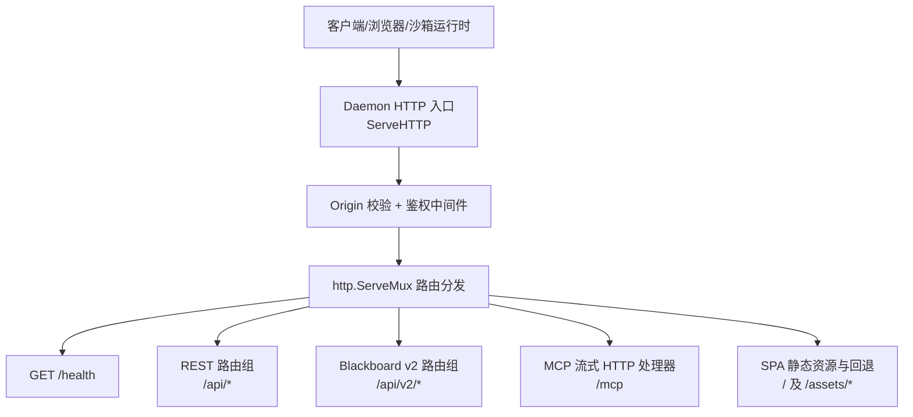
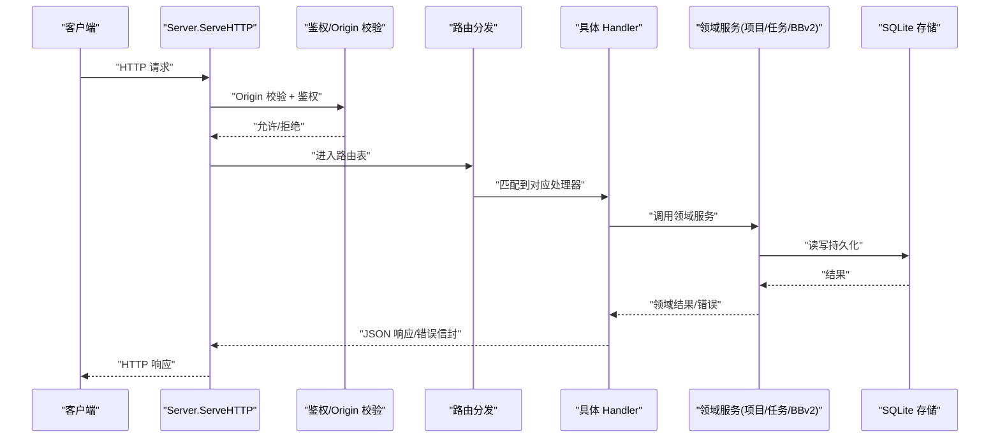
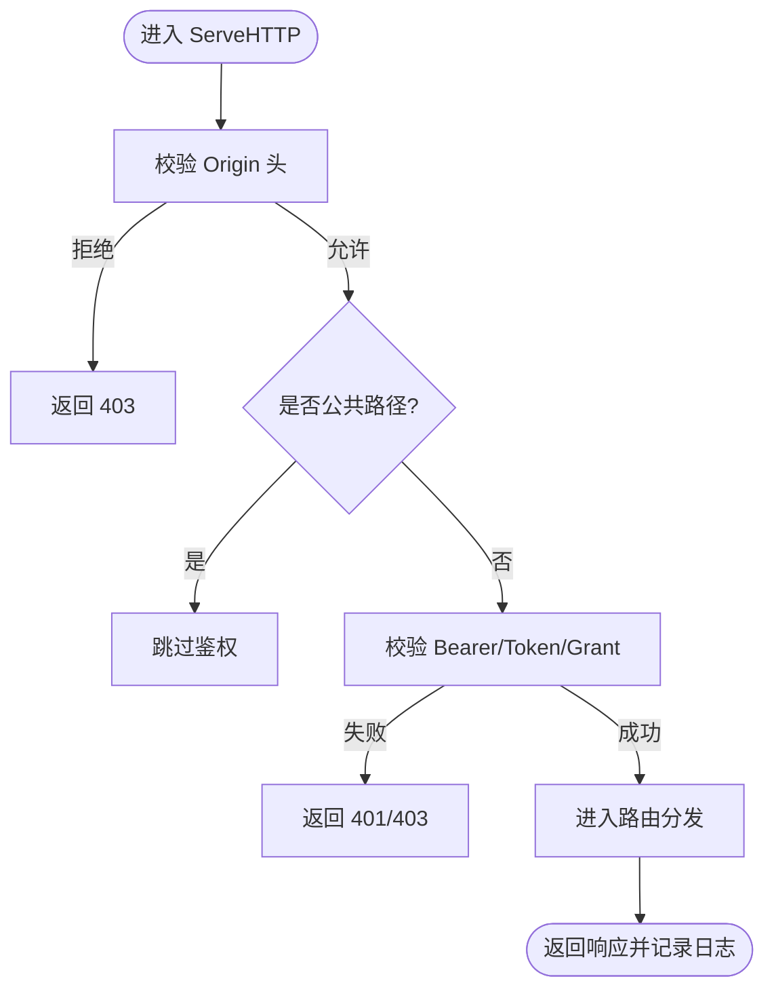
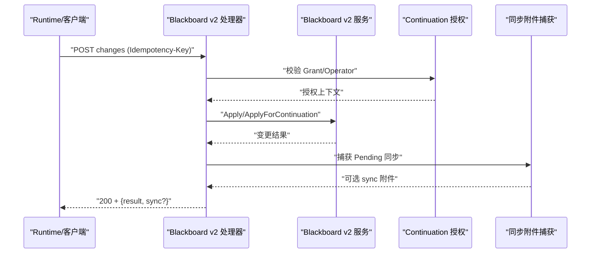
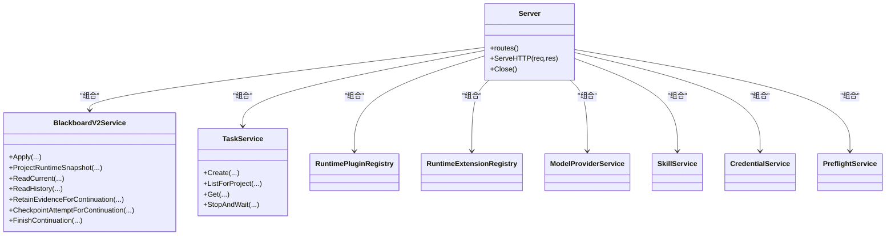

# HTTP API 服务

<cite>
**本文引用的文件**   
- [server.go](file://internal/daemon/server.go)
- [blackboard_v2_http.go](file://internal/daemon/blackboard_v2_http.go)
- [mcp_handlers.go](file://internal/daemon/mcp_handlers.go)
- [v2.go](file://internal/mcpserver/v2.go)
- [mcp.go](file://internal/runner/mcp.go)
- [openapi.json](file://internal/blackboardv2contract/contractdata/openapi.json)
- [blackboard-v2-spec.md](file://docs/specs/blackboard-v2-spec.md)
</cite>

## 目录
1. [简介](#简介)
2. [项目结构](#项目结构)
3. [核心组件](#核心组件)
4. [架构总览](#架构总览)
5. [详细组件分析](#详细组件分析)
6. [依赖关系分析](#依赖关系分析)
7. [性能与可扩展性](#性能与可扩展性)
8. [故障排查指南](#故障排查指南)
9. [结论](#结论)
10. [附录：API 参考与调用示例](#附录api-参考与调用示例)

## 简介
本文件面向 CyberPenda 的本地优先渗透测试代理（Go daemon + React dashboard + sandboxed runtimes）中的 HTTP API 服务，系统性说明服务器初始化、路由注册机制、中间件处理链与请求生命周期管理；全面梳理 RESTful API 端点（项目 CRUD、任务管理、黑板操作、技能管理等），并描述认证授权、CORS 策略、请求验证与响应格式化。同时给出 API 版本控制策略、速率限制与安全最佳实践，并提供完整的 API 调用示例与客户端集成指南。

## 项目结构
HTTP API 由 Daemon 进程提供，采用 Go 标准库 http.ServeMux 进行路由分发，并通过统一的 ServeHTTP 实现全局前置校验（Origin 校验、鉴权、静态资源放行等）。Blackboard v2 语义接口以路径版本化 /api/v2 暴露，MCP 服务端通过 /mcp 提供六个受信任工具。SPA 前端静态资源由内嵌文件系统提供，非 API 路径回退到 index.html。

图表来源
- [server.go:587-643](file://internal/daemon/server.go#L587-L643)
- [server.go:383-411](file://internal/daemon/server.go#L383-L411)
- [mcp_handlers.go:14-43](file://internal/daemon/mcp_handlers.go#L14-L43)
- [server.go:1226-1258](file://internal/daemon/server.go#L1226-L1258)

章节来源
- [server.go:383-411](file://internal/daemon/server.go#L383-L411)
- [server.go:587-643](file://internal/daemon/server.go#L587-L643)
- [server.go:1226-1258](file://internal/daemon/server.go#L1226-L1258)

## 核心组件
- 服务器配置与启动
  - 配置项包含数据库路径、运行时根目录、制品根目录、技能根目录、沙箱镜像、容器 CLI、监听地址、鉴权令牌、插件与扩展目录、模型刷新客户端、Provider 会话工厂等。
  - 启动时加载插件与扩展、初始化各领域服务（项目、运行时配置、模型提供者、技能、凭据、任务、预检、Blackboard v2、连续性服务等），完成路由注册与中断任务恢复。
- 统一请求处理链
  - 在 ServeHTTP 中执行 Origin 校验、公共路径放行、Bearer/查询参数鉴权、状态记录器与日志记录。
- 路由注册
  - 健康检查、项目 CRUD、运行时配置 CRUD、模型提供者 CRUD、运行时插件/扩展、技能管理、凭据绑定、任务生命周期、Blackboard v2、MCP、SPA 静态资源。
- Blackboard v2 适配器
  - 路径版本化 /api/v2，严格 JSON Schema 校验、幂等键强制、Revision ETag 条件请求、同步附件（SynchronizationAttachment）可选附加、错误信封标准化。
- MCP 服务端
  - 基于 SDK 的 Streamable HTTP 处理器，支持无状态模式与禁用本地 Host 保护，按 Continuation Interface Grant 解析能力边界。

章节来源
- [server.go:38-81](file://internal/daemon/server.go#L38-L81)
- [server.go:120-248](file://internal/daemon/server.go#L120-L248)
- [server.go:383-411](file://internal/daemon/server.go#L383-L411)
- [server.go:587-643](file://internal/daemon/server.go#L587-L643)
- [blackboard_v2_http.go:29-46](file://internal/daemon/blackboard_v2_http.go#L29-L46)
- [mcp_handlers.go:14-43](file://internal/daemon/mcp_handlers.go#L14-L43)

## 架构总览
下图展示从客户端到领域服务的完整链路，包括安全前置、路由分发、业务处理与响应封装。

图表来源
- [server.go:383-411](file://internal/daemon/server.go#L383-L411)
- [server.go:587-643](file://internal/daemon/server.go#L587-L643)
- [blackboard_v2_http.go:368-438](file://internal/daemon/blackboard_v2_http.go#L368-L438)

## 详细组件分析

### 服务器初始化与中间件处理链
- 初始化流程
  - 打开数据库、加载运行时插件与扩展、构建 Profile/Model Provider/Skill/Credential/Task/Preflight/Blackboard v2/Continuity 等服务、设置 Task 续接终端标记与重配器、恢复中断任务、注册路由。
- 中间件处理链
  - Origin 校验：拒绝 DNS 重绑定与跨站请求，仅允许本地回环、host.docker.internal 或同源地址；无 Origin 的请求视为本地调用放行。
  - 鉴权：支持 Authorization: Bearer 与 ?token= 两种形式；对 Blackboard v2 与 MCP 额外支持 Continuation Interface Grant。
  - 公共路径放行：OPTIONS、/health、SPA 静态资源 GET 无需鉴权。
  - 状态记录与日志：统一记录状态码与耗时。

图表来源
- [server.go:383-411](file://internal/daemon/server.go#L383-L411)
- [server.go:431-461](file://internal/daemon/server.go#L431-L461)
- [server.go:467-501](file://internal/daemon/server.go#L467-L501)
- [server.go:518-534](file://internal/daemon/server.go#L518-L534)

章节来源
- [server.go:120-248](file://internal/daemon/server.go#L120-L248)
- [server.go:383-411](file://internal/daemon/server.go#L383-L411)
- [server.go:431-461](file://internal/daemon/server.go#L431-L461)
- [server.go:467-501](file://internal/daemon/server.go#L467-L501)
- [server.go:518-534](file://internal/daemon/server.go#L518-L534)

### 路由注册机制
- 路由组织
  - 健康检查：GET /health
  - 项目：/api/projects
  - 运行时配置：/api/runtime-profiles
  - 模型提供者：/api/model-providers
  - 运行时插件/扩展：/api/runtime-plugins, /api/runtime-extensions
  - 技能：/api/skills
  - 凭据绑定：/api/credential-bindings
  - 任务：/api/projects/{id}/tasks
  - Blackboard v2：/api/v2/projects/{id}/blackboard/*
  - MCP：/mcp
  - SPA：/ 与 /assets/* 回退
- 关键行为
  - 所有路由均经过统一中间件；Blackboard v2 使用独立鉴权与强校验逻辑；MCP 使用无状态流式 HTTP 处理器。

章节来源
- [server.go:587-643](file://internal/daemon/server.go#L587-L643)
- [server.go:1226-1258](file://internal/daemon/server.go#L1226-L1258)
- [mcp_handlers.go:14-43](file://internal/daemon/mcp_handlers.go#L14-L43)

### 认证与授权机制
- 通用鉴权
  - 支持 Authorization: Bearer <token> 与 ?token=<token>；当 ListenAddr 非本地回环且未配置 Token 则拒绝启动。
- Blackboard v2 专用鉴权
  - 不接受查询字符串中的 bearer；Operator 可通过 daemon token 访问，或通过 Continuation Interface Grant 受限访问；路径 Project 必须与 Grant 绑定一致。
- MCP 鉴权
  - 支持 Continuation Interface Grant；为兼容沙箱无法设置请求头的场景，默认禁用 localhost 保护，但通过 host.docker.internal 白名单与 Grant 约束。

章节来源
- [server.go:431-461](file://internal/daemon/server.go#L431-L461)
- [blackboard_v2_http.go:52-95](file://internal/daemon/blackboard_v2_http.go#L52-L95)
- [mcp_handlers.go:14-43](file://internal/daemon/mcp_handlers.go#L14-L43)

### CORS 与跨域策略
- 策略要点
  - 不启用宽泛 CORS；通过 Origin 白名单限制：本地回环、host.docker.internal、与监听地址同源；无 Origin 的请求视为本地调用放行。
  - OPTIONS 预检请求直接放行，避免阻塞。
- 建议
  - 生产环境保持最小化 Origin 白名单，结合反向代理进行更严格的跨域控制。

章节来源
- [server.go:518-534](file://internal/daemon/server.go#L518-L534)
- [server.go:467-470](file://internal/daemon/server.go#L467-L470)

### 请求验证与响应格式化
- Blackboard v2 验证
  - 输入上限 4 MiB；禁止未知字段；POST 必须携带 Idempotency-Key；GET 支持 If-None-Match 与 Revision ETag；错误统一信封格式，含 code/message/path/retryable。
- 其他 REST 接口
  - JSON 解码失败返回 400；常见业务错误映射为 404/409/500 等；列表接口空集合返回空数组而非 null。
- 响应头
  - Blackboard v2 读响应带 Cache-Control: private, no-cache 与 ETag；写响应带 Cache-Control: no-store；可重试错误带 Retry-After。

章节来源
- [blackboard_v2_http.go:465-493](file://internal/daemon/blackboard_v2_http.go#L465-L493)
- [blackboard_v2_http.go:500-513](file://internal/daemon/blackboard_v2_http.go#L500-L513)
- [blackboard_v2_http.go:539-562](file://internal/daemon/blackboard_v2_http.go#L539-L562)
- [server.go:1260-1273](file://internal/daemon/server.go#L1260-L1273)

### 请求生命周期管理
- 任务生命周期
  - 创建、列出、获取、删除、事件、转录、时间线、停止、结束、恢复、转向（steer）、权限响应等。
- 续接与一致性
  - 重启后自动修复中断任务、清理残留容器/进程、记录生命周期事件；Blackboard v2 连续性服务负责终态续接与快照重建。

章节来源
- [server.go:587-643](file://internal/daemon/server.go#L587-L643)
- [server.go:250-304](file://internal/daemon/server.go#L250-L304)

### Blackboard v2 语义接口
- 端点清单
  - POST /api/v2/projects/{project_id}/blackboard/changes
  - GET /api/v2/projects/{project_id}/blackboard/snapshot
  - GET /api/v2/projects/{project_id}/blackboard/health
  - GET /api/v2/projects/{project_id}/blackboard/records/{key}
  - GET /api/v2/projects/{project_id}/blackboard/records/{key}/history
  - POST /api/v2/projects/{project_id}/blackboard/evidence:retain
  - POST /api/v2/projects/{project_id}/blackboard/attempts/{key}:checkpoint
  - POST /api/v2/projects/{project_id}/continuation:finish
  - GET /api/v2/projects/{project_id}/reports/pentest
  - GET /api/v2/projects/{project_id}/reports/ctf-solution
- 特性
  - 原子变更批、幂等键、Revision ETag、分页历史、证据保留、尝试检查点、续接结束、报告导出（Markdown/JSON）。
  - 可选同步附件（sync）用于跨任务通知与全量快照附带。

图表来源
- [blackboard_v2_http.go:97-125](file://internal/daemon/blackboard_v2_http.go#L97-L125)
- [blackboard_v2_http.go:368-438](file://internal/daemon/blackboard_v2_http.go#L368-L438)

章节来源
- [blackboard_v2_http.go:29-46](file://internal/daemon/blackboard_v2_http.go#L29-L46)
- [blackboard_v2_http.go:52-95](file://internal/daemon/blackboard_v2_http.go#L52-L95)
- [blackboard_v2_http.go:368-438](file://internal/daemon/blackboard_v2_http.go#L368-L438)
- [blackboard-v2-spec.md:275-291](file://docs/specs/blackboard-v2-spec.md#L275-L291)

### MCP 受信任工具
- 端点
  - /mcp（Streamable HTTP，无状态）
- 工具集
  - 六个受信任工具：change、read、history、retain_evidence、checkpoint_attempt、finish。
- 鉴权
  - 通过 Continuation Interface Grant 限定 Project/Task/Continuation 能力范围；不支持将语义身份作为调用方传入。

章节来源
- [mcp_handlers.go:14-43](file://internal/daemon/mcp_handlers.go#L14-L43)
- [v2.go:19-44](file://internal/mcpserver/v2.go#L19-L44)

### 技能管理与导入
- 端点
  - GET/POST /api/skills/import
  - GET/PUT/DELETE /api/skills/{skill_id}
  - PUT/DELETE /api/skills/{skill_id}/profiles/{profile_id}/opt-out
- 行为
  - 支持内置技能安装、外部包导入、按 Profile 启用/禁用；导入受控于 SkillImporter。

章节来源
- [server.go:613-619](file://internal/daemon/server.go#L613-L619)

### 凭据绑定与预检
- 端点
  - PUT/GET/DELETE /api/credential-bindings
  - PUT/GET /api/projects/{id}/credential-bindings
  - POST /api/projects/{id}/preflight
- 行为
  - 全局与项目级凭据绑定覆盖；预检用于启动前校验配置、凭据解析与自定义参数冲突。

章节来源
- [server.go:620-626](file://internal/daemon/server.go#L620-L626)

### 运行时配置与模型提供者
- 运行时配置
  - POST/GET/PATCH/DELETE /api/runtime-profiles
  - POST /api/runtime-profiles/{id}/promote
  - GET /api/runtime-profiles/{id}/model-provider-migration-preview
  - POST /api/runtime-profiles/{id}/model-provider-migration
- 模型提供者
  - GET/POST/PATCH/DELETE /api/model-providers
  - POST /api/model-providers/{id}/refresh-models
- 运行时插件/扩展
  - GET /api/runtime-plugins, /api/runtime-plugins/{plugin_id}
  - GET /api/runtime-extensions, /api/runtime-extension-catalog, /api/runtime-extensions/{extension_id}

章节来源
- [server.go:593-612](file://internal/daemon/server.go#L593-L612)

### 任务管理
- 端点
  - POST/GET /api/projects/{id}/tasks
  - GET /api/projects/{id}/tasks/{task_id}
  - DELETE /api/projects/{id}/tasks/{task_id}
  - GET /api/projects/{id}/tasks/{task_id}/events
  - GET /api/projects/{id}/tasks/{task_id}/transcript
  - GET /api/projects/{id}/tasks/{task_id}/timeline
  - POST /api/projects/{id}/tasks/{task_id}/stop
  - POST /api/projects/{id}/tasks/{task_id}/finish
  - POST /api/projects/{id}/tasks/{task_id}/resume
  - POST /api/projects/{id}/tasks/{task_id}/steer/queue
  - POST /api/projects/{id}/tasks/{task_id}/steer
  - POST /api/projects/{id}/tasks/{task_id}/permissions/{permission_id}/respond

章节来源
- [server.go:627-639](file://internal/daemon/server.go#L627-L639)

## 依赖关系分析
- 组件耦合
  - Server 聚合多个领域服务（Project、Profile、ModelProvider、Skill、Credential、Task、Preflight、BlackboardV2、Continuity），通过注入方式解耦。
  - Blackboard v2 与 Task 通过 Continuation 关联，确保写入与读取的权限边界。
- 外部依赖
  - SQLite 存储、容器 CLI（docker/podman）、运行时插件与扩展目录、MCP SDK。
- 潜在循环依赖
  - 通过服务注入与接口抽象避免循环；MCP 与 Blackboard v2 通过 Deps 注入，不直接耦合。

图表来源
- [server.go:83-118](file://internal/daemon/server.go#L83-L118)
- [server.go:120-248](file://internal/daemon/server.go#L120-L248)

章节来源
- [server.go:83-118](file://internal/daemon/server.go#L83-L118)
- [server.go:120-248](file://internal/daemon/server.go#L120-L248)

## 性能与可扩展性
- 输入限制
  - Blackboard v2 单请求体上限 4 MiB，防止大负载攻击。
- 缓存与条件请求
  - Snapshot/Detail/Health 支持 ETag 与 If-None-Match，减少带宽与重复计算。
- 并发与锁
  - SQLite 忙锁映射为 503 并带 Retry-After，客户端应实现指数退避重试。
- 扩展点
  - 运行时插件与扩展目录支持动态加载；Provider 会话工厂可替换以实现不同运行时家族。

[本节为通用指导，不涉及具体文件分析]

## 故障排查指南
- 常见问题
  - 401/403：检查 Authorization/Token/Grant 是否正确；确认 Origin 是否在白名单。
  - 400：检查 JSON 结构与必填字段（如 Idempotency-Key）；注意 Blackboard v2 禁止未知字段。
  - 404：确认 Project/Task/Key 是否存在。
  - 409/422：版本冲突、语义校验失败；查看错误信封 message/path。
  - 503：存储忙锁，等待 Retry-After 后重试。
- 诊断步骤
  - 查看 /health 返回的数据库与 MCP 状态。
  - 检查任务事件与时间线定位异常阶段。
  - 使用 preflight 校验启动配置与凭据解析。

章节来源
- [server.go:645-674](file://internal/daemon/server.go#L645-L674)
- [blackboard_v2_http.go:539-562](file://internal/daemon/blackboard_v2_http.go#L539-L562)

## 结论
Daemon HTTP API 以简洁的路由与强校验为核心，结合 Blackboard v2 的语义契约与 MCP 受信任工具，形成稳定可控的控制平面。通过 Origin 白名单、双通道鉴权与严格 JSON 校验，有效抵御常见 Web 攻击面。配合 ETag、幂等键与重试策略，具备良好的可靠性与可观测性。

[本节为总结，不涉及具体文件分析]

## 附录：API 参考与调用示例

### 版本控制策略
- 路径版本化：/api/v2 承载 Blackboard v2 语义接口；其余管理接口位于 /api。
- 向后兼容：v2 明确替代 v1 工具/路由，不再维护兼容别名。

章节来源
- [blackboard-v2-spec.md:275-291](file://docs/specs/blackboard-v2-spec.md#L275-L291)

### 速率限制与安全最佳实践
- 速率限制
  - 当前未实现显式限流；若需限流，建议在反向代理层实施。
- 安全最佳实践
  - 生产环境必须配置 AuthToken 并绑定非回环地址；严格 Origin 白名单；仅在必要端口暴露；对敏感数据使用最小权限原则。

章节来源
- [server.go:178-185](file://internal/daemon/server.go#L178-L185)
- [server.go:518-534](file://internal/daemon/server.go#L518-L534)

### 常用 REST 端点速查
- 项目
  - GET /api/projects
  - POST /api/projects
  - GET /api/projects/{id}
  - PATCH /api/projects/{id}
- 运行时配置
  - POST /api/runtime-profiles
  - GET /api/runtime-profiles
  - GET /api/runtime-profiles/{id}
  - PATCH /api/runtime-profiles/{id}
  - POST /api/runtime-profiles/{id}/promote
  - DELETE /api/runtime-profiles/{id}
- 模型提供者
  - GET /api/model-providers
  - POST /api/model-providers
  - GET /api/model-providers/{id}
  - PATCH /api/model-providers/{id}
  - DELETE /api/model-providers/{id}
  - POST /api/model-providers/{id}/refresh-models
- 运行时插件/扩展
  - GET /api/runtime-plugins
  - GET /api/runtime-plugins/{plugin_id}
  - GET /api/runtime-extensions
  - GET /api/runtime-extension-catalog
  - GET /api/runtime-extensions/{extension_id}
- 技能
  - GET /api/skills
  - POST /api/skills/import
  - GET /api/skills/{skill_id}
  - PUT /api/skills/{skill_id}
  - DELETE /api/skills/{skill_id}
  - PUT/DELETE /api/skills/{skill_id}/profiles/{profile_id}/opt-out
- 凭据绑定
  - PUT /api/credential-bindings
  - GET /api/credential-bindings
  - DELETE /api/credential-bindings/{binding_id}
  - PUT/GET /api/projects/{id}/credential-bindings
- 任务
  - POST/GET /api/projects/{id}/tasks
  - GET /api/projects/{id}/tasks/{task_id}
  - DELETE /api/projects/{id}/tasks/{task_id}
  - GET /api/projects/{id}/tasks/{task_id}/events
  - GET /api/projects/{id}/tasks/{task_id}/transcript
  - GET /api/projects/{id}/tasks/{task_id}/timeline
  - POST /api/projects/{id}/tasks/{task_id}/stop
  - POST /api/projects/{id}/tasks/{task_id}/finish
  - POST /api/projects/{id}/tasks/{task_id}/resume
  - POST /api/projects/{id}/tasks/{task_id}/steer/queue
  - POST /api/projects/{id}/tasks/{task_id}/steer
  - POST /api/projects/{id}/tasks/{task_id}/permissions/{permission_id}/respond

章节来源
- [server.go:587-643](file://internal/daemon/server.go#L587-L643)

### Blackboard v2 端点规范摘要
- 方法/路径
  - POST /api/v2/projects/{project_id}/blackboard/changes
  - GET /api/v2/projects/{project_id}/blackboard/snapshot
  - GET /api/v2/projects/{project_id}/blackboard/health
  - GET /api/v2/projects/{project_id}/blackboard/records/{key}
  - GET /api/v2/projects/{project_id}/blackboard/records/{key}/history
  - POST /api/v2/projects/{project_id}/blackboard/evidence:retain
  - POST /api/v2/projects/{project_id}/blackboard/attempts/{key}:checkpoint
  - POST /api/v2/projects/{project_id}/continuation:finish
  - GET /api/v2/projects/{project_id}/reports/pentest
  - GET /api/v2/projects/{project_id}/reports/ctf-solution
- 请求参数
  - 所有 POST 必须携带 Idempotency-Key 头；GET 支持 limit/cursor（history）与 format（reports）。
- 响应格式
  - 成功：application/json；部分读响应带 ETag 与 Cache-Control: private, no-cache；写响应带 Cache-Control: no-store。
  - 错误：统一信封 {error:{code,message,path,retryable}}，必要时附带 sync 附件。
- 状态码映射
  - 200/304/400/401/403/404/409/422/429/500/503（详见 OpenAPI 定义）。

章节来源
- [blackboard-v2-spec.md:275-291](file://docs/specs/blackboard-v2-spec.md#L275-L291)
- [openapi.json:427-927](file://internal/blackboardv2contract/contractdata/openapi.json#L427-L927)

### MCP 端点
- 端点：/mcp（Streamable HTTP，无状态）
- 工具：blackboard_change、blackboard_read、blackboard_history、blackboard_retain_evidence、blackboard_checkpoint_attempt、blackboard_finish

章节来源
- [mcp_handlers.go:14-43](file://internal/daemon/mcp_handlers.go#L14-L43)
- [v2.go:19-44](file://internal/mcpserver/v2.go#L19-L44)

### 客户端集成指南
- 基础连接
  - 本地开发：默认监听 127.0.0.1:8787；生产需配置 AuthToken 并限制绑定地址。
  - 沙箱运行时：通过 host.docker.internal 访问 /mcp，必要时以 ?token= 传递鉴权。
- 认证
  - 通用 API：Authorization: Bearer 或 ?token=；Blackboard v2 不接受查询串中的 bearer。
  - MCP：使用 Continuation Interface Grant 限定能力。
- 幂等与重试
  - 所有 POST 必须提供 Idempotency-Key；遇到 503 遵循 Retry-After 指数退避。
- 条件请求
  - 读取 Snapshot/Detail/Health 时携带 If-None-Match 以利用 ETag 优化。
- 错误处理
  - 解析统一错误信封，根据 code 与 path 定位问题；对 storage_busy 与 retryable 做重试。

章节来源
- [mcp.go:54-84](file://internal/runner/mcp.go#L54-L84)
- [blackboard_v2_http.go:465-493](file://internal/daemon/blackboard_v2_http.go#L465-L493)
- [blackboard_v2_http.go:500-513](file://internal/daemon/blackboard_v2_http.go#L500-L513)
- [blackboard_v2_http.go:539-562](file://internal/daemon/blackboard_v2_http.go#L539-L562)