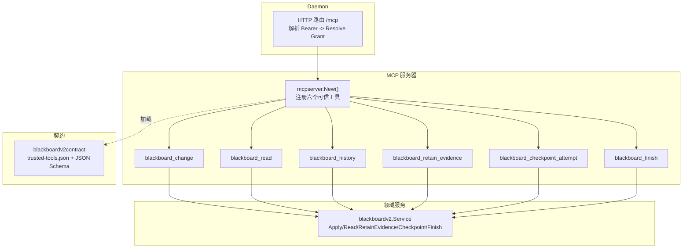
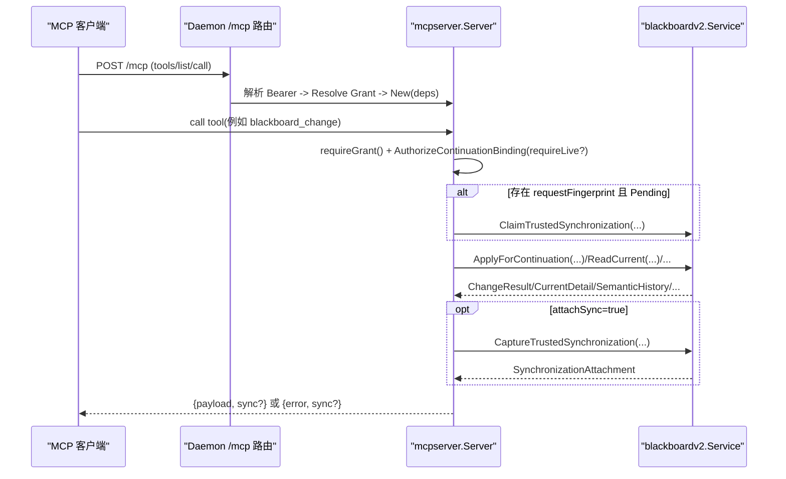
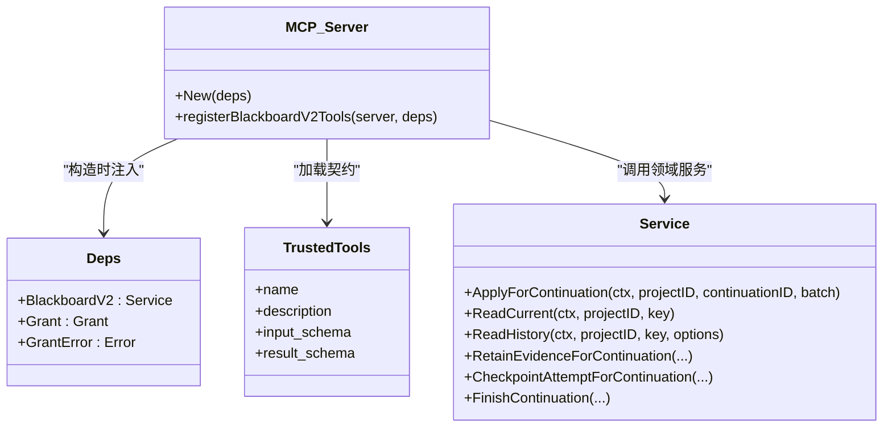
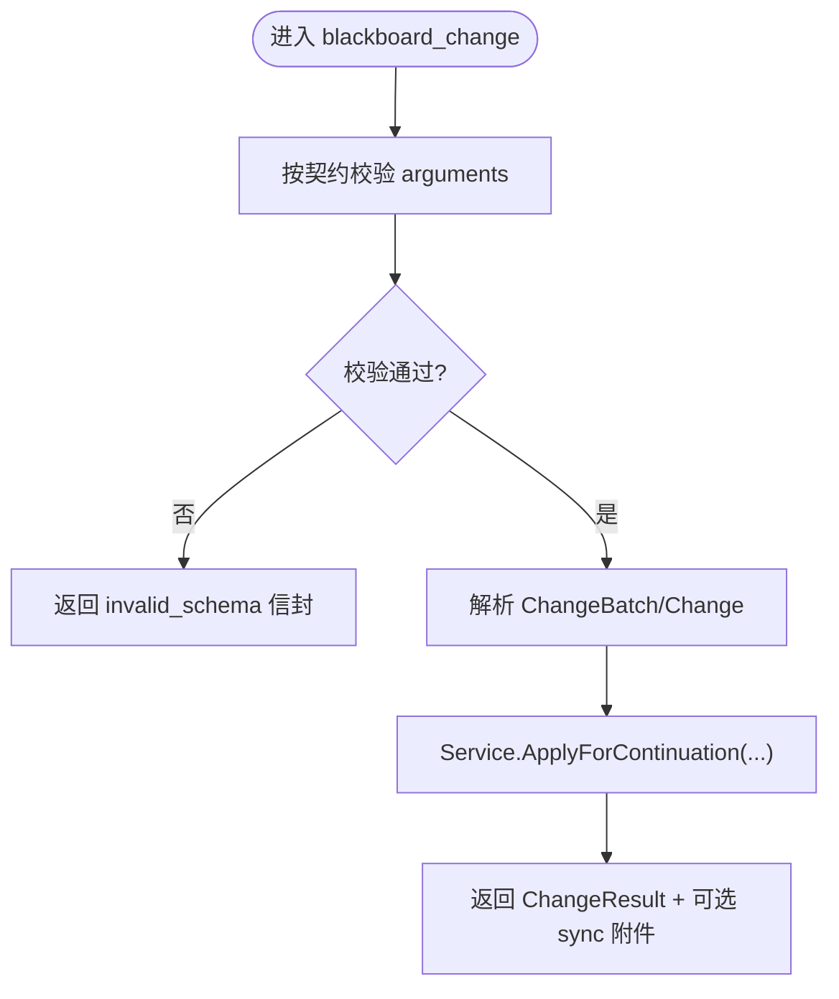
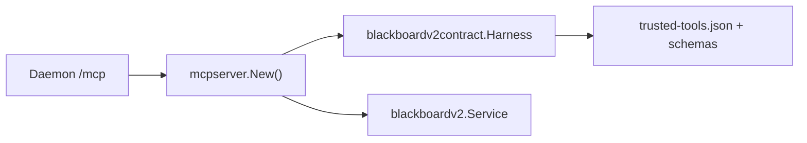
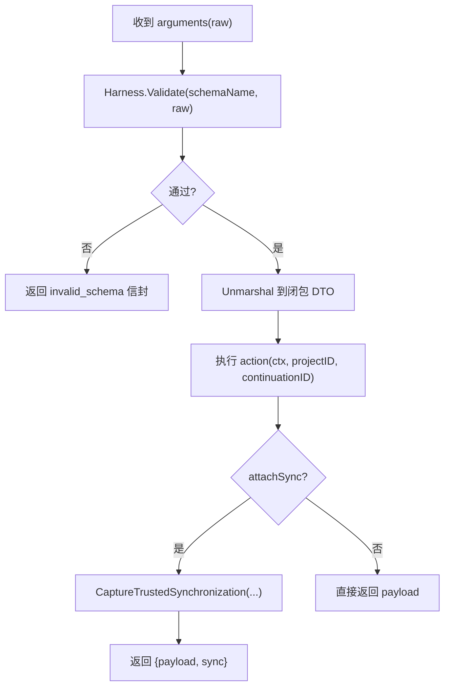

# MCP Server 实现

<cite>
**本文引用的文件列表**
- [internal/daemon/mcp_handlers.go](file://internal/daemon/mcp_handlers.go)
- [internal/mcpserver/v2.go](file://internal/mcpserver/v2.go)
- [internal/blackboardv2/service.go](file://internal/blackboardv2/service.go)
- [internal/blackboardv2contract/contract.go](file://internal/blackboardv2contract/contract.go)
- [internal/blackboardv2contract/contractdata/trusted-tools.json](file://internal/blackboardv2contract/contractdata/trusted-tools.json)
- [internal/blackboardv2contract/contractdata/openapi.json](file://internal/blackboardv2contract/contractdata/openapi.json)
- [scripts/smoke-sandbox-mcp-live.sh](file://scripts/smoke-sandbox-mcp-live.sh)
- [internal/daemon/trusted_mcp_smoke_test.go](file://internal/daemon/trusted_mcp_smoke_test.go)
- [internal/mcpserver/server_test.go](file://internal/mcpserver/server_test.go)
</cite>

## 目录
1. [简介](#简介)
2. [项目结构](#项目结构)
3. [核心组件](#核心组件)
4. [架构总览](#架构总览)
5. [详细组件分析](#详细组件分析)
6. [依赖关系分析](#依赖关系分析)
7. [性能与可扩展性](#性能与可扩展性)
8. [安全边界、权限控制与审计](#安全边界权限控制与审计)
9. [参数校验、错误处理与幂等重试](#参数校验错误处理与幂等重试)
10. [MCP 客户端集成示例](#mcp-客户端集成示例)
11. [调试技巧与故障排除](#调试技巧与故障排除)
12. [结论](#结论)

## 简介
本文件系统性梳理 CyberPenda 中 MCP Server 的实现，聚焦于 Blackboard v2 语义工具的安全调用路径、权限边界、参数校验、错误处理、幂等与同步附件机制，并给出 MCP 客户端集成示例、调试与排障指南。需要特别说明的是：当前 MCP 暴露的六个“可信工具”并非 create_entity/create_relationship/create_fact/create_finding/create_evidence/create_solution 这六个独立方法，而是统一的原子写入通道 blackboard_change（通过 changeBatch 中的 op=create/update/relate 等）以及 read/history/evidence/checkpoint/finish 等专用工具。文档将据此准确描述接口契约与实现。

## 项目结构
- Daemon HTTP 层在 /mcp 路由注册 MCP 服务，解析 Bearer Token 并解析 Continuation Interface Grant，注入到 MCP 服务器实例。
- MCP 服务器由 mcpserver.New 构建，加载冻结的 Blackboard v2 契约（trusted-tools.json + JSON Schema），动态注册六个可信工具。
- 所有写操作最终委托给 blackboardv2.Service.ApplyForContinuation 或对应专用服务方法，读操作委托 ReadCurrent/ReadHistory。
- 契约与 OpenAPI 定义位于 blackboardv2contract 包，确保 MCP 输入输出与 HTTP v2 保持一致。

图表来源
- [internal/daemon/mcp_handlers.go:14-43](file://internal/daemon/mcp_handlers.go#L14-L43)
- [internal/mcpserver/v2.go:34-44](file://internal/mcpserver/v2.go#L34-L44)
- [internal/blackboardv2contract/contract.go:252-290](file://internal/blackboardv2contract/contract.go#L252-L290)
- [internal/blackboardv2contract/contractdata/trusted-tools.json:1-44](file://internal/blackboardv2contract/contractdata/trusted-tools.json#L1-L44)

章节来源
- [internal/daemon/mcp_handlers.go:14-43](file://internal/daemon/mcp_handlers.go#L14-L43)
- [internal/mcpserver/v2.go:34-44](file://internal/mcpserver/v2.go#L34-L44)
- [internal/blackboardv2contract/contract.go:252-290](file://internal/blackboardv2contract/contract.go#L252-L290)
- [internal/blackboardv2contract/contractdata/trusted-tools.json:1-44](file://internal/blackboardv2contract/contractdata/trusted-tools.json#L1-L44)

## 核心组件
- MCP 服务器注册器：从契约加载 trusted-tools.json，生成每个工具的 InputSchema，并通过 AddTool 注册处理器。
- 参数解码与校验：使用契约 Harness.Validate 对 raw arguments 进行严格 JSON Schema 校验，失败统一返回 invalid_schema 信封。
- 授权与绑定：requireGrant 解析 Grant；AuthorizeContinuationBinding 校验 Project/Task/Continuation 绑定与 live/offline 能力。
- 同步附件：支持 ClaimTrustedSynchronization/CaptureTrustedSynchronization，为幂等重试与 Finish 后回放提供稳定 sync 附件。
- 领域服务：blackboardv2.Service 提供 ApplyForContinuation、ReadCurrent、ReadHistory、RetainEvidenceForContinuation、CheckpointAttemptForContinuation、FinishContinuation 等方法。

章节来源
- [internal/mcpserver/v2.go:46-156](file://internal/mcpserver/v2.go#L46-L156)
- [internal/mcpserver/v2.go:168-192](file://internal/mcpserver/v2.go#L168-L192)
- [internal/mcpserver/v2.go:194-248](file://internal/mcpserver/v2.go#L194-L248)
- [internal/blackboardv2/service.go:644-656](file://internal/blackboardv2/service.go#L644-L656)

## 架构总览
下图展示一次 MCP 工具调用的端到端流程，包括鉴权、授权、可选的同步附件声明、领域服务执行与结果封装。

图表来源
- [internal/daemon/mcp_handlers.go:14-43](file://internal/daemon/mcp_handlers.go#L14-L43)
- [internal/mcpserver/v2.go:194-248](file://internal/mcpserver/v2.go#L194-L248)
- [internal/blackboardv2/service.go:644-656](file://internal/blackboardv2/service.go#L644-L656)

## 详细组件分析

### 六个可信工具与语义写入模型
- 实际暴露的工具为六个：blackboard_change、blackboard_read、blackboard_history、blackboard_retain_evidence、blackboard_checkpoint_attempt、blackboard_finish。
- 创建实体/关系/事实/发现/证据/解决方案并非独立工具，而是通过 blackboard_change 的 changeBatch 中的 op=create/update/relate/unrelate/transition/supersede/merge 完成。
- 契约清单与输入/结果 schema 名称来自 trusted-tools.json，并由 Harness.TrustedTools 与 ToolInputSchema 生成。

图表来源
- [internal/mcpserver/v2.go:19-44](file://internal/mcpserver/v2.go#L19-L44)
- [internal/blackboardv2contract/contractdata/trusted-tools.json:1-44](file://internal/blackboardv2contract/contractdata/trusted-tools.json#L1-L44)
- [internal/blackboardv2contract/contract.go:252-290](file://internal/blackboardv2contract/contract.go#L252-L290)
- [internal/blackboardv2/service.go:644-656](file://internal/blackboardv2/service.go#L644-L656)

章节来源
- [internal/mcpserver/v2.go:46-156](file://internal/mcpserver/v2.go#L46-L156)
- [internal/blackboardv2contract/contractdata/trusted-tools.json:1-44](file://internal/blackboardv2contract/contractdata/trusted-tools.json#L1-L44)
- [internal/blackboardv2contract/contract.go:252-290](file://internal/blackboardv2contract/contract.go#L252-L290)

### 语义变更流水线（changeBatch）
- 所有写操作均通过 semantic-change-batch/v2 信封提交，包含 idempotency_key 与有序 changes 列表。
- 支持的 op 包括 create/update/relate/unrelate/transition/supersede/merge，分别对应记录与关系的增删改、状态迁移与合并替换。
- 服务侧对 ChangeBatch 与 Change 做严格的字段白名单与类型校验，未知字段拒绝。

图表来源
- [internal/mcpserver/v2.go:168-192](file://internal/mcpserver/v2.go#L168-L192)
- [internal/blackboardv2/service.go:644-656](file://internal/blackboardv2/service.go#L644-L656)

章节来源
- [internal/blackboardv2/service.go:72-120](file://internal/blackboardv2/service.go#L72-L120)
- [internal/blackboardv2/service.go:122-232](file://internal/blackboardv2/service.go#L122-L232)

### 读取与历史
- blackboard_read：按 Key 返回当前完整语义记录及当前关系。
- blackboard_history：按 Key 分页返回显式语义历史，支持 cursor 与 limit。

章节来源
- [internal/mcpserver/v2.go:85-113](file://internal/mcpserver/v2.go#L85-L113)
- [internal/blackboardv2/service.go:483-524](file://internal/blackboardv2/service.go#L483-L524)

### 证据保留与尝试检查点
- blackboard_retain_evidence：受控地保留由开放 Attempt 产生的证据，服务端派生 managed_path/sha256/size 等完整性字段。
- blackboard_checkpoint_attempt：对开放的 Attempt 版本化摘要，参与 pending 同步。

章节来源
- [internal/mcpserver/v2.go:114-137](file://internal/mcpserver/v2.go#L114-L137)
- [internal/blackboardv2/service.go:644-656](file://internal/blackboardv2/service.go#L644-L656)

### 结束与同步附件
- blackboard_finish：结束绑定的 Continuation，要求所有 Attempts 已终止；可携带 pending 同步并在首次成功时附带 sync 附件。
- 同步附件用于下一次认证的可信响应携带完整的 Runtime Blackboard Snapshot，即使语义操作失败也可重试。

章节来源
- [internal/mcpserver/v2.go:138-151](file://internal/mcpserver/v2.go#L138-L151)
- [internal/mcpserver/v2.go:224-248](file://internal/mcpserver/v2.go#L224-L248)

## 依赖关系分析
- MCP 服务器依赖 blackboardv2contract.Harness 加载契约与 JSON Schema，保证 tools/list 的 InputSchema 与运行时校验一致。
- MCP 处理器依赖 blackboardv2.Service 作为唯一领域入口，避免直接访问存储。
- Daemon 仅负责 HTTP 路由与 Grant 解析，不感知具体工具逻辑。

图表来源
- [internal/daemon/mcp_handlers.go:14-43](file://internal/daemon/mcp_handlers.go#L14-L43)
- [internal/mcpserver/v2.go:34-44](file://internal/mcpserver/v2.go#L34-L44)
- [internal/blackboardv2contract/contract.go:74-110](file://internal/blackboardv2contract/contract.go#L74-L110)

章节来源
- [internal/daemon/mcp_handlers.go:14-43](file://internal/daemon/mcp_handlers.go#L14-L43)
- [internal/mcpserver/v2.go:34-44](file://internal/mcpserver/v2.go#L34-L44)
- [internal/blackboardv2contract/contract.go:74-110](file://internal/blackboardv2contract/contract.go#L74-L110)

## 性能与可扩展性
- 无状态传输：MCP 使用无状态 HTTP 选项，适合横向扩展。
- 幂等键：write 类工具基于 idempotency_key 去重，减少重复写入与竞争。
- 同步附件：允许失败路径下携带最新快照，降低客户端拉取开销。
- 只读优化：read/history 走只读路径，避免锁竞争。

[本节为通用指导，无需源码引用]

## 安全边界、权限控制与审计
- 路由级鉴权：/mcp 路由支持可选的 daemon auth token；若启用，则必须匹配 server.authToken。
- 会话级授权：每个 MCP 请求需携带 Continuation Interface Grant（Bearer），Daemon 解析并注入到 Deps.Grant。
- 绑定校验：AuthorizeContinuationBinding 校验 Project/Task/Continuation 绑定，并根据工具是否 requireLive 限制离线回放能力。
- 最小暴露面：MCP 仅暴露六个工具，禁止透传 Project/Task/Continuation 身份至模型侧参数。
- 结构化错误：所有错误以黑板 v2 Error 信封返回，包含 code/message/path/retryable/details，便于上层统一处理与审计。

章节来源
- [internal/daemon/mcp_handlers.go:14-43](file://internal/daemon/mcp_handlers.go#L14-L43)
- [internal/mcpserver/v2.go:208-248](file://internal/mcpserver/v2.go#L208-L248)
- [internal/mcpserver/v2.go:250-258](file://internal/mcpserver/v2.go#L250-L258)
- [internal/mcpserver/v2.go:305-315](file://internal/mcpserver/v2.go#L305-L315)

## 参数校验、错误处理与幂等重试
- 参数校验：decodeV2ToolArgs 使用契约 Harness.Validate 对 arguments 进行严格 JSON Schema 校验，未知字段与类型不符均返回 invalid_schema。
- 错误信封：toolBlackboardV2Error 统一包装为 {error, sync?} 结构，IsError=true，便于客户端区分业务错误与系统错误。
- 幂等与重试：write 工具在 attachSync=true 时使用 SynchronizationDeliveryFingerprint 声明，Claim/Capture 保障重试一致性；Finish 后可回放。

图表来源
- [internal/mcpserver/v2.go:168-192](file://internal/mcpserver/v2.go#L168-L192)
- [internal/mcpserver/v2.go:224-248](file://internal/mcpserver/v2.go#L224-L248)
- [internal/mcpserver/v2.go:290-303](file://internal/mcpserver/v2.go#L290-L303)

章节来源
- [internal/mcpserver/v2.go:168-192](file://internal/mcpserver/v2.go#L168-L192)
- [internal/mcpserver/v2.go:290-303](file://internal/mcpserver/v2.go#L290-L303)

## MCP 客户端集成示例
- 连接与服务发现：使用 SDK 的 StreamableClientTransport 连接到 /mcp，调用 tools/list 验证六个工具存在。
- 调用 write：构造 semantic-change-batch/v2 的 arguments，设置 idempotency_key，调用 blackboard_change。
- 调用 read/history：传入 key 与可选 cursor/limit。
- 脚本化验证：smoke 脚本演示了从沙箱镜像内访问 host.docker.internal 上的 MCP 与 HTTP v2 边界。

章节来源
- [internal/daemon/trusted_mcp_smoke_test.go:255-282](file://internal/daemon/trusted_mcp_smoke_test.go#L255-L282)
- [scripts/smoke-sandbox-mcp-live.sh:31-90](file://scripts/smoke-sandbox-mcp-live.sh#L31-L90)
- [scripts/smoke-sandbox-mcp-live.sh:92-156](file://scripts/smoke-sandbox-mcp-live.sh#L92-L156)
- [internal/mcpserver/server_test.go:15-41](file://internal/mcpserver/server_test.go#L15-L41)

## 调试技巧与故障排除
- 工具列表不一致：确认 MCP 暴露的工具集合是否为六个 v2 工具，未包含已退役工具。
- 授权失败：检查 Bearer Token 是否有效、Grant 是否被撤销、Project/Task/Continuation 绑定是否正确。
- 参数校验失败：关注 invalid_schema 信封的 path 字段定位问题字段；核对契约定义的必填项与长度限制。
- 幂等冲突：当出现 409 或语义冲突时，更换 idempotency_key 或等待重试窗口；利用 sync 附件获取最新快照。
- 沙箱连通性：确保 host.docker.internal 可达，必要时开启 DisableLocalhostProtection。

章节来源
- [internal/daemon/mcp_handlers.go:35-41](file://internal/daemon/mcp_handlers.go#L35-L41)
- [internal/mcpserver/v2.go:208-248](file://internal/mcpserver/v2.go#L208-L248)
- [internal/mcpserver/v2.go:168-192](file://internal/mcpserver/v2.go#L168-L192)

## 结论
CyberPenda 的 MCP Server 以冻结契约为核心，通过六个可信工具提供一致的语义读写与生命周期管理能力。其设计强调最小暴露面、强校验、幂等与同步附件，结合 Daemon 的 Grant 解析与绑定校验，形成清晰的安全边界。对于外部 AI 系统集成，建议遵循契约与幂等策略，优先使用 blackboard_change 进行原子写入，配合 read/history 与 sync 附件实现可靠的状态同步与回放。