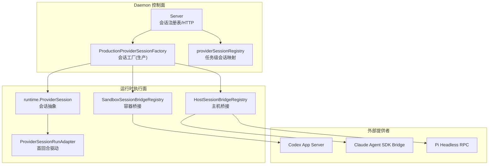
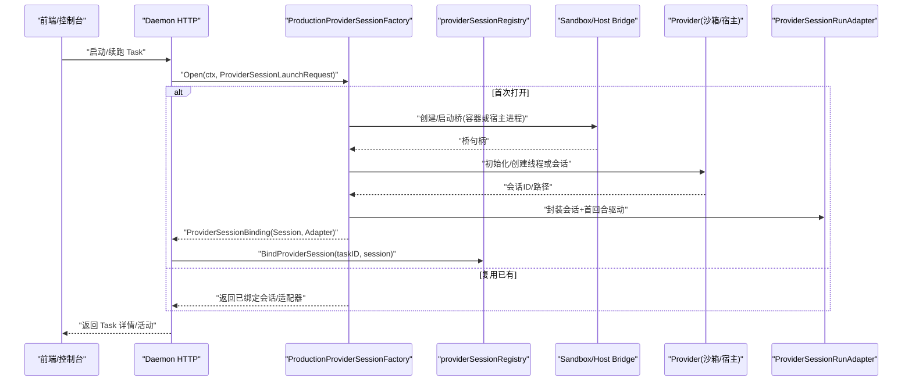
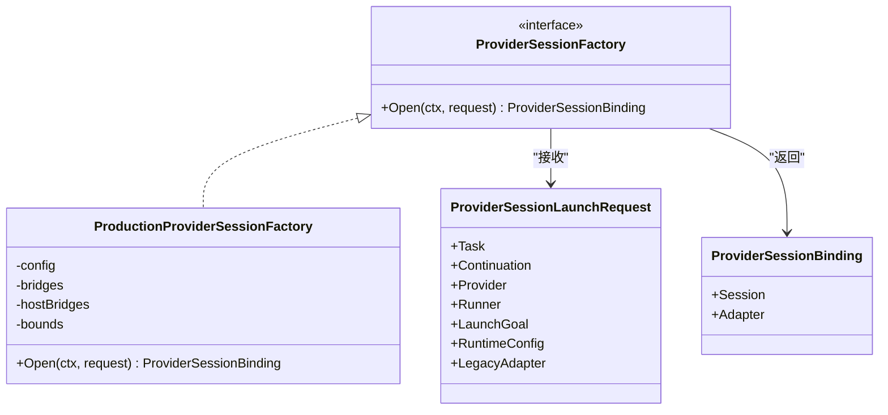
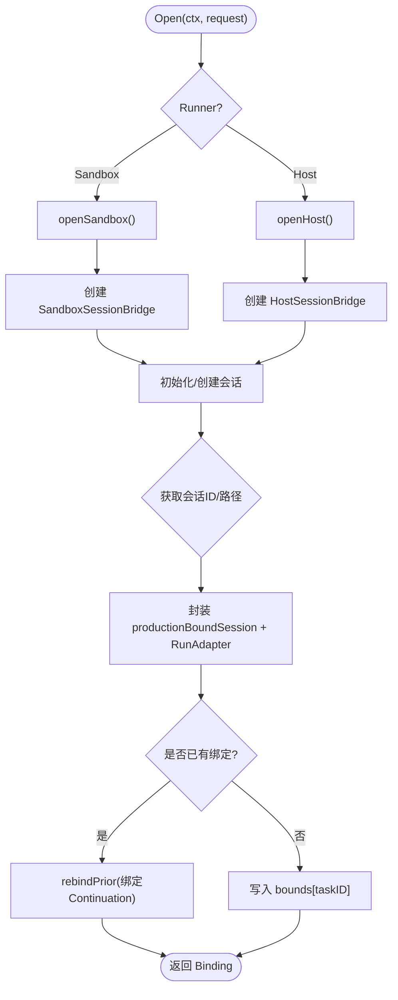
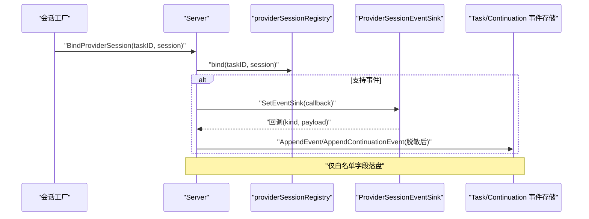
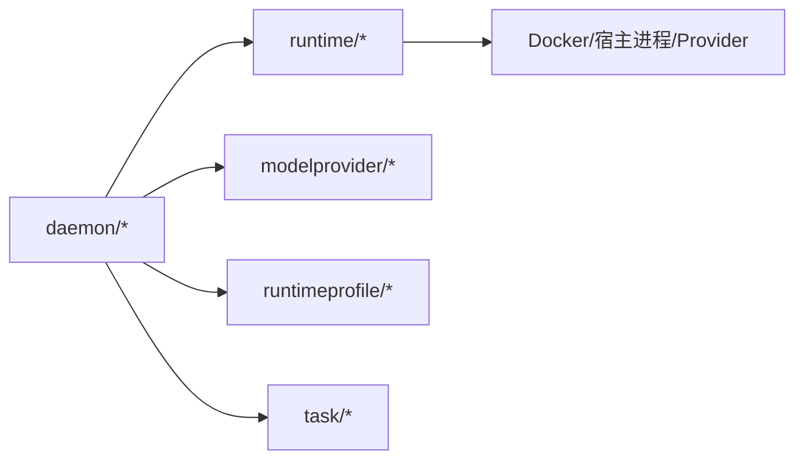

# Provider 会话工厂模式

<cite>
**本文引用的文件**   
- [internal/daemon/provider_session_factory.go](file://internal/daemon/provider_session_factory.go)
- [internal/daemon/production_provider_session_factory.go](file://internal/daemon/production_provider_session_factory.go)
- [internal/daemon/provider_session_control.go](file://internal/daemon/provider_session_control.go)
- [internal/daemon/task_handlers.go](file://internal/daemon/task_handlers.go)
- [internal/daemon/server.go](file://internal/daemon/server.go)
- [internal/runtime/provider_session.go](file://internal/runtime/provider_session.go)
- [internal/runtime/host_session_bridge.go](file://internal/runtime/host_session_bridge.go)
- [internal/runtime/container.go](file://internal/runtime/container.go)
- [internal/runtime/session_bridge.go](file://internal/runtime/session_bridge.go)
- [internal/runtime/provider_adapters.go](file://internal/runtime/provider_adapters.go)
- [internal/runtimeprovider/modelprovider.go](file://internal/modelprovider/modelprovider.go)
- [internal/runtimeprofile/runtimeprofile.go](file://internal/runtimeprofile/runtimeprofile.go)
- [internal/task/task.go](file://internal/task/task.go)
- [web/src/pages/TaskDetailPage.tsx](file://web/src/pages/TaskDetailPage.tsx)
</cite>

## 目录
1. [简介](#简介)
2. [项目结构](#项目结构)
3. [核心组件](#核心组件)
4. [架构总览](#架构总览)
5. [详细组件分析](#详细组件分析)
6. [依赖关系分析](#依赖关系分析)
7. [性能与资源管理](#性能与资源管理)
8. [故障恢复与会话超时](#故障恢复与会话超时)
9. [调试技巧与排障指南](#调试技巧与排障指南)
10. [结论](#结论)

## 简介
本文件系统性阐述 Provider 会话工厂模式在 Daemon 中的设计与实现，覆盖以下关键主题：
- 会话工厂接口与生产实现（Sandbox/Host）的装配流程、桥接协议与会话绑定
- 会话池管理与资源隔离（容器进程组、任务级绑定、事件去敏）
- 会话生命周期：BindProviderSession 绑定、Continuation 复用、Close 清理
- ProviderSessionLaunchRequest 的结构与参数传递（Task、Continuation、Provider、Runner、RuntimeConfig、LegacyAdapter）
- 生产环境与测试环境的差异（可插拔 HostStarter、BridgeCommand、Claude SDK Bridge）
- 会话超时、连接复用、资源清理策略
- 调试技巧与性能优化建议

## 项目结构
围绕“会话工厂”的关键代码位于 internal/daemon 与 internal/runtime 两个子系统中：
- daemon 层负责 HTTP 控制面、会话注册表、启动编排与事件持久化
- runtime 层提供 ProviderSession 抽象、Sandbox/Host 桥接、适配器与运行期元数据

图表来源
- [internal/daemon/server.go:204-234](file://internal/daemon/server.go#L204-L234)
- [internal/daemon/production_provider_session_factory.go:118-142](file://internal/daemon/production_provider_session_factory.go#L118-L142)
- [internal/daemon/provider_session_control.go:18-93](file://internal/daemon/provider_session_control.go#L18-L93)
- [internal/runtime/provider_session.go](file://internal/runtime/provider_session.go)
- [internal/runtime/session_bridge.go](file://internal/runtime/session_bridge.go)
- [internal/runtime/host_session_bridge.go](file://internal/runtime/host_session_bridge.go)
- [internal/runtime/container.go](file://internal/runtime/container.go)

章节来源
- [internal/daemon/server.go:204-234](file://internal/daemon/server.go#L204-L234)

## 核心组件
- ProviderSessionFactory 接口与 LaunchRequest
  - 定义 Open(ctx, request) 返回 ProviderSessionBinding（包含 Session 与 Adapter），要求对同一 Task 的后续 Continuation 返回相同身份并绑定到私有传输。
  - LaunchRequest 携带 Task、Continuation、Provider、Runner、LaunchGoal、RuntimeConfig、LegacyAdapter，确保凭据与原始协议帧不越界。
- ProductionProviderSessionFactory
  - 按 Runner 分流 Sandbox/Host；按 Provider 分流 Codex/Claude/Pi。
  - 使用 SandboxSessionBridgeRegistry/HostSessionBridgeRegistry 建立长连接桥，完成初始化、线程/会话创建、Resume 校验、能力协商。
  - 通过 productionBoundSession 包装原生会话，统一 Close/ControlBusy/SessionClosed 等扩展能力。
- providerSessionRegistry
  - 内存级任务级会话注册表，保证一个 Task 仅绑定一个会话，支持 closeAll/closeTask。
- BindProviderSession
  - 将 ProviderSession 绑定到 Task，设置事件 Sink，将受控事件以白名单字段持久化到 Task/Continuation 事件流。

章节来源
- [internal/daemon/provider_session_factory.go:13-41](file://internal/daemon/provider_session_factory.go#L13-L41)
- [internal/daemon/provider_session_factory.go:60-92](file://internal/daemon/provider_session_factory.go#L60-L92)
- [internal/daemon/production_provider_session_factory.go:43-131](file://internal/daemon/production_provider_session_factory.go#L43-L131)
- [internal/daemon/provider_session_control.go:18-93](file://internal/daemon/provider_session_control.go#L18-L93)
- [internal/daemon/provider_session_control.go:95-111](file://internal/daemon/provider_session_control.go#L95-L111)

## 架构总览
会话工厂模式将“会话创建/复用/绑定”从 HTTP 控制面解耦，形成如下调用链：

图表来源
- [internal/daemon/production_provider_session_factory.go:133-142](file://internal/daemon/production_provider_session_factory.go#L133-L142)
- [internal/daemon/production_provider_session_factory.go:428-534](file://internal/daemon/production_provider_session_factory.go#L428-L534)
- [internal/daemon/provider_session_control.go:95-111](file://internal/daemon/provider_session_control.go#L95-L111)

## 详细组件分析

### 会话工厂接口与请求模型
- ProviderSessionLaunchRequest
  - Task/Continuation：限定作用域，确保会话与任务/续跑边界一致
  - Provider/Runner：决定桥接方式与支持的 Provider 集合
  - RuntimeConfig/LegacyAdapter：透传运行时配置与一次性命令适配信息
- ProviderSessionBinding
  - Session：ProviderSession 抽象，承载发送 Turn、中断替换、权限响应等能力
  - Adapter：长生命周期适配器，驱动首个 Turn 并监听桥事件

图表来源
- [internal/daemon/provider_session_factory.go:13-41](file://internal/daemon/provider_session_factory.go#L13-L41)
- [internal/daemon/provider_session_factory.go:60-92](file://internal/daemon/provider_session_factory.go#L60-L92)
- [internal/daemon/production_provider_session_factory.go:43-131](file://internal/daemon/production_provider_session_factory.go#L43-L131)

章节来源
- [internal/daemon/provider_session_factory.go:13-41](file://internal/daemon/provider_session_factory.go#L13-L41)
- [internal/daemon/provider_session_factory.go:60-92](file://internal/daemon/provider_session_factory.go#L60-L92)

### 生产环境会话工厂实现（Sandbox/Host）
- 路由分发
  - Runner=Sandbox：走 openSandbox，基于 Docker 重写 create 命令，注入 bridge 与 provider 二进制
  - Runner=Host：openHost 再按 Provider 分流
- 会话装配
  - Codex：initialize → thread/start 或 thread/resume，获取 thread ID，构造 CodexProviderSession
  - Claude：claude/initialize，获取 session_id，构造 ClaudeCodeProviderSession
  - Pi：pi/get_state，获取 session_id/path，构造 PiProviderSession
- 绑定与复用
  - rebindPrior：对同一 Task 的后续 Continuation 调用 BindContinuation，避免重复创建
  - finishXxxBinding：封装 productionBoundSession，注册 onClose 回调关闭桥与清理 bounds

图表来源
- [internal/daemon/production_provider_session_factory.go:133-142](file://internal/daemon/production_provider_session_factory.go#L133-L142)
- [internal/daemon/production_provider_session_factory.go:428-534](file://internal/daemon/production_provider_session_factory.go#L428-L534)
- [internal/daemon/production_provider_session_factory.go:548-617](file://internal/daemon/production_provider_session_factory.go#L548-L617)
- [internal/daemon/production_provider_session_factory.go:622-670](file://internal/daemon/production_provider_session_factory.go#L622-L670)
- [internal/daemon/production_provider_session_factory.go:674-729](file://internal/daemon/production_provider_session_factory.go#L674-L729)
- [internal/daemon/production_provider_session_factory.go:536-546](file://internal/daemon/production_provider_session_factory.go#L536-L546)

章节来源
- [internal/daemon/production_provider_session_factory.go:133-142](file://internal/daemon/production_provider_session_factory.go#L133-L142)
- [internal/daemon/production_provider_session_factory.go:428-534](file://internal/daemon/production_provider_session_factory.go#L428-L534)
- [internal/daemon/production_provider_session_factory.go:548-617](file://internal/daemon/production_provider_session_factory.go#L548-L617)
- [internal/daemon/production_provider_session_factory.go:622-670](file://internal/daemon/production_provider_session_factory.go#L622-L670)
- [internal/daemon/production_provider_session_factory.go:674-729](file://internal/daemon/production_provider_session_factory.go#L674-L729)
- [internal/daemon/production_provider_session_factory.go:536-546](file://internal/daemon/production_provider_session_factory.go#L536-L546)

### 会话绑定与解绑的生命周期
- 绑定：BindProviderSession
  - 校验 Task 存在，写入 providerSessionRegistry，若会话支持事件 Sink，则设置回调以持久化受控事件
- 解绑：closeProviderSession/closeProviderSessionForStop
  - 关闭当前会话并从注册表移除；Stop 场景下重试直到成功或冲突解除
- 事件持久化：persistProviderSessionEvent
  - 仅保留白名单字段（如 request_id、session_id、mode、outcome 等），避免泄露原始协议内容

图表来源
- [internal/daemon/provider_session_control.go:95-111](file://internal/daemon/provider_session_control.go#L95-L111)
- [internal/daemon/provider_session_control.go:117-143](file://internal/daemon/provider_session_control.go#L117-L143)
- [internal/daemon/provider_session_control.go:145-166](file://internal/daemon/provider_session_control.go#L145-L166)

章节来源
- [internal/daemon/provider_session_control.go:95-111](file://internal/daemon/provider_session_control.go#L95-L111)
- [internal/daemon/provider_session_control.go:117-143](file://internal/daemon/provider_session_control.go#L117-L143)
- [internal/daemon/provider_session_control.go:145-166](file://internal/daemon/provider_session_control.go#L145-L166)

### 会话工厂错误处理与健壮性
- 错误包装：providerSessionFactoryError 对外暴露稳定错误消息，内部保留 Unwrap 链用于诊断
- 能力校验：nativeSteerMode 根据 Capabilities 选择 InTurnSteer 或 InterruptThenReplace，否则拒绝
- 状态机：nativeSteerState 从事件流中解析 mode/outcome/session_id，保障幂等与顺序

章节来源
- [internal/daemon/provider_session_factory.go:52-67](file://internal/daemon/provider_session_factory.go#L52-L67)
- [internal/daemon/provider_session_control.go:183-212](file://internal/daemon/provider_session_control.go#L183-L212)

### 生产环境与测试环境的差异
- 可插拔进程启动器：HostStarter 允许测试拦截宿主进程启动，便于断言命令行参数
- 可配置桥命令：BridgeCommand/ClaudeSDKBridgeCommand/HostBridgeCommand 可在测试中显式指定，避免依赖镜像布局
- 行为一致性：生产使用真实本地进程组启动器；测试可通过 HostStarter 模拟输入输出

章节来源
- [internal/daemon/production_provider_session_factory.go:25-41](file://internal/daemon/production_provider_session_factory.go#L25-L41)
- [internal/daemon/production_provider_session_factory.go:377-404](file://internal/daemon/production_provider_session_factory.go#L377-L404)

### 会话超时、连接复用与资源清理
- 连接复用
  - 同一 Task 的后续 Continuation 通过 rebindPrior 复用既有会话与适配器，减少开销
- 超时控制
  - steer 操作使用 context.WithTimeout 包裹，失败时记录标准化事件
- 资源清理
  - productionBoundSession.onClose 触发时删除 bounds 映射并关闭桥
  - Host Pi 清理 auth.json/sessions 等工件，防止泄漏
  - 容器侧通过 ContainerID 标识，宿主侧通过进程组 ID 标识，便于重启后回收

章节来源
- [internal/daemon/production_provider_session_factory.go:536-546](file://internal/daemon/production_provider_session_factory.go#L536-L546)
- [internal/daemon/production_provider_session_factory.go:597-616](file://internal/daemon/production_provider_session_factory.go#L597-L616)
- [internal/daemon/production_provider_session_factory.go:652-669](file://internal/daemon/production_provider_session_factory.go#L652-L669)
- [internal/daemon/production_provider_session_factory.go:711-728](file://internal/daemon/production_provider_session_factory.go#L711-L728)
- [internal/daemon/production_provider_session_factory.go:416-426](file://internal/daemon/production_provider_session_factory.go#L416-L426)
- [internal/daemon/task_handlers.go:2468-2472](file://internal/daemon/task_handlers.go#L2468-L2472)

## 依赖关系分析
- 模块耦合
  - daemon 层依赖 runtime 的 ProviderSession、Bridge、Adapter 抽象
  - 生产实现依赖 Docker/Host 进程管理、JSON-RPC 桥与 Provider 特定会话类型
- 外部依赖
  - 容器运行时（Docker）、宿主进程组、Provider 二进制/SDK 桥
- 潜在循环依赖
  - 通过接口与函数对象（ProviderSessionFactoryFunc）降低耦合，避免直接循环引用

图表来源
- [internal/daemon/server.go:204-234](file://internal/daemon/server.go#L204-L234)
- [internal/daemon/provider_session_factory.go:1-11](file://internal/daemon/provider_session_factory.go#L1-L11)
- [internal/daemon/production_provider_session_factory.go:1-16](file://internal/daemon/production_provider_session_factory.go#L1-L16)

章节来源
- [internal/daemon/server.go:204-234](file://internal/daemon/server.go#L204-L234)
- [internal/daemon/provider_session_factory.go:1-11](file://internal/daemon/provider_session_factory.go#L1-L11)
- [internal/daemon/production_provider_session_factory.go:1-16](file://internal/daemon/production_provider_session_factory.go#L1-L16)

## 性能与资源管理
- 会话复用优先
  - 同 Task 复用会话与适配器，避免频繁创建容器/进程与鉴权握手
- 最小化事件落盘
  - 仅白名单字段持久化，减少 I/O 压力与敏感信息泄露风险
- 资源隔离
  - 容器内会话与宿主进程组均具备唯一标识，便于监控与回收
- 并发安全
  - 工厂与注册表使用互斥锁保护共享状态，避免竞态

章节来源
- [internal/daemon/production_provider_session_factory.go:536-546](file://internal/daemon/production_provider_session_factory.go#L536-L546)
- [internal/daemon/provider_session_control.go:117-143](file://internal/daemon/provider_session_control.go#L117-L143)
- [internal/daemon/provider_session_control.go:18-93](file://internal/daemon/provider_session_control.go#L18-L93)

## 故障恢复与会话超时
- 会话恢复
  - 通过 Continuation.NativeSessionID/NativeSessionPath 进行 resume 校验，确保身份一致
- 中断与替换
  - 根据 Capabilities 选择 InTurnSteer 或 InterruptThenReplace，并在 Ack 后才标记旧 Continuation 终止
- 超时处理
  - steer 操作带超时上下文，失败时记录标准化事件，避免阻塞
- 重启恢复
  - 设计原则为 fail-closed：重启不自动重连 stdio，需通过新桥与持久化元数据重建

章节来源
- [internal/daemon/production_provider_session_factory.go:548-617](file://internal/daemon/production_provider_session_factory.go#L548-L617)
- [internal/daemon/production_provider_session_factory.go:622-670](file://internal/daemon/production_provider_session_factory.go#L622-L670)
- [internal/daemon/production_provider_session_factory.go:674-729](file://internal/daemon/production_provider_session_factory.go#L674-L729)
- [internal/daemon/provider_session_control.go:183-212](file://internal/daemon/provider_session_control.go#L183-L212)
- [internal/daemon/task_handlers.go:2468-2472](file://internal/daemon/task_handlers.go#L2468-L2472)

## 调试技巧与排障指南
- 观察会话绑定
  - 检查 providerSessionRegistry 中 taskID→session 映射是否存在且唯一
- 验证桥事件
  - 确认 HandleBridgeEvent 正确转发至 RunAdapter，且未泄露原始 JSON-RPC
- 核对 Resume 身份
  - 对比 NativeSessionID 与返回的会话 ID，不一致将导致恢复失败
- 前端交互链路
  - TaskDetailPage 在切换 Provider 时会先队列指令、停止、再恢复，确保用户意图不丢失
- 常见错误定位
  - “无会话身份/适配器”：检查工厂返回值与 validateProviderSessionBinding
  - “不支持的 Runner/Provider”：检查 supportsPersistentProviderSession 与 supportedProviderSessionFactoryProvider
  - “Host Pi 缺少投影环境变量”：检查 PI_CODING_AGENT_DIR 等必需项

章节来源
- [internal/daemon/provider_session_control.go:18-93](file://internal/daemon/provider_session_control.go#L18-L93)
- [internal/daemon/provider_session_factory.go:60-92](file://internal/daemon/provider_session_factory.go#L60-L92)
- [internal/daemon/production_provider_session_factory.go:406-414](file://internal/daemon/production_provider_session_factory.go#L406-L414)
- [web/src/pages/TaskDetailPage.tsx:305-337](file://web/src/pages/TaskDetailPage.tsx#L305-L337)

## 结论
Provider 会话工厂模式通过清晰的接口与分层实现，实现了：
- 会话创建/复用的集中化管理与任务级资源隔离
- 跨 Sandbox/Host 的统一装配与桥接协议
- 面向生产的高可用特性：幂等恢复、超时控制、事件去敏与资源清理
- 面向测试的可插拔性与可观测性

该模式为多 Provider 的长期会话提供了可扩展、可维护、可调试的基础设施。