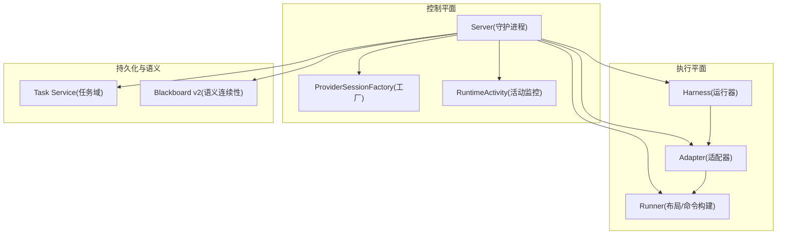
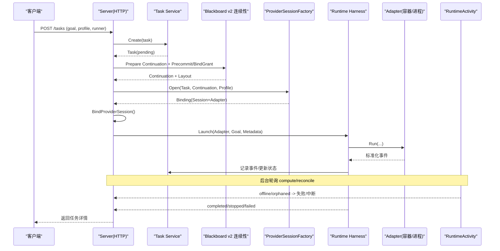
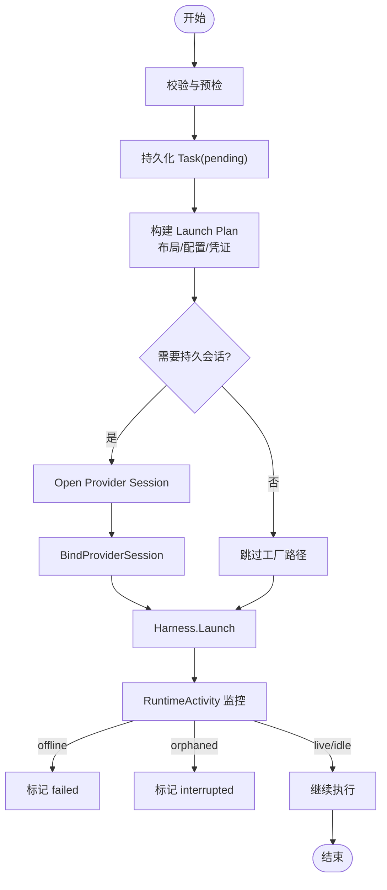
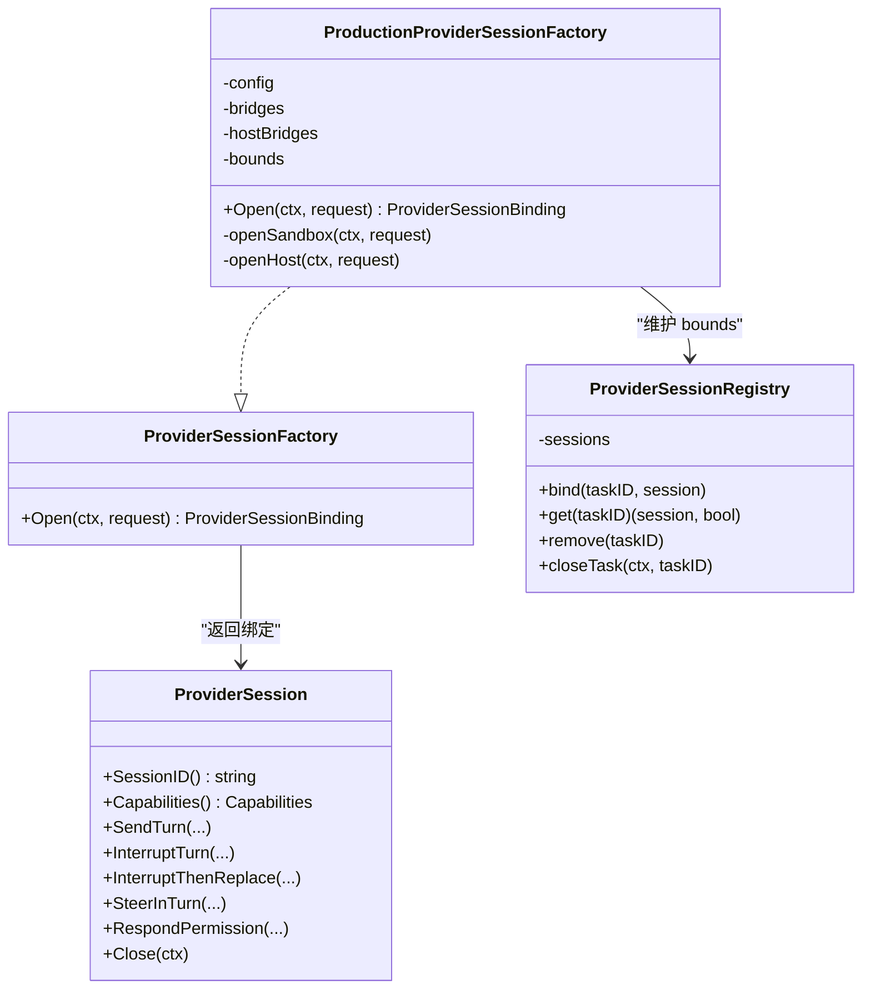
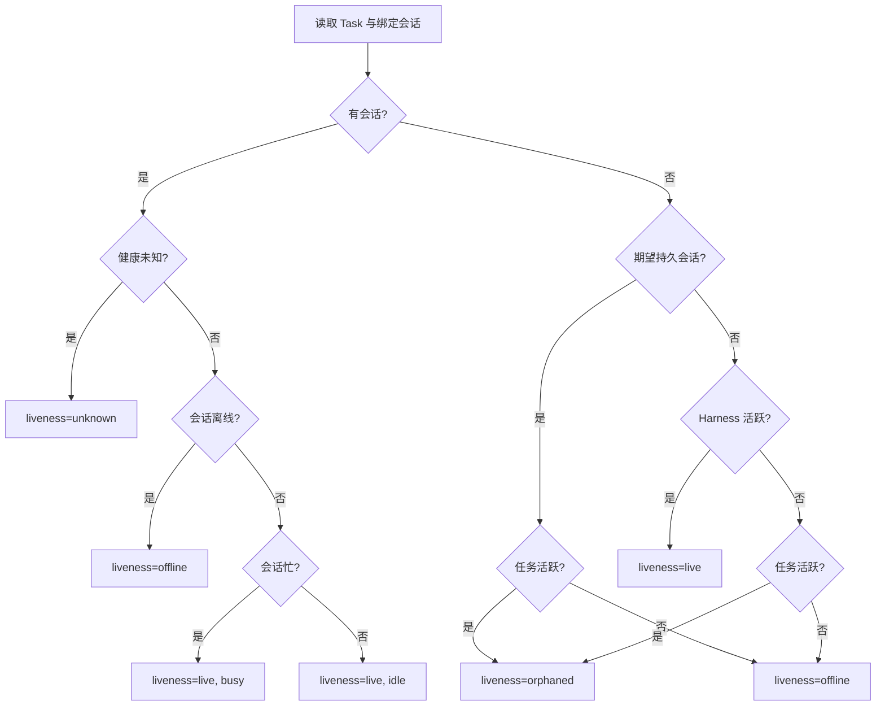
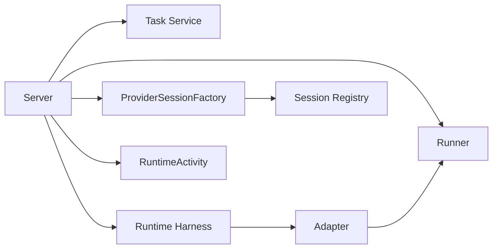

# Task 生命周期管理

<cite>
**本文引用的文件**   
- [task_handlers.go](file://internal/daemon/task_handlers.go)
- [production_provider_session_factory.go](file://internal/daemon/production_provider_session_factory.go)
- [provider_session_factory.go](file://internal/daemon/provider_session_factory.go)
- [runtime_activity.go](file://internal/daemon/runtime_activity.go)
- [provider_session_control.go](file://internal/daemon/provider_session_control.go)
- [server.go](file://internal/daemon/server.go)
- [runner.go](file://internal/runner/runner.go)
- [task.go](file://internal/task/task.go)
- [runtime.go](file://internal/runtime/runtime.go)
- [provider_session.go](file://internal/runtime/provider_session.go)
</cite>

## 目录
1. [简介](#简介)
2. [项目结构](#项目结构)
3. [核心组件](#核心组件)
4. [架构总览](#架构总览)
5. [详细组件分析](#详细组件分析)
6. [依赖关系分析](#依赖关系分析)
7. [性能与并发控制](#性能与并发控制)
8. [故障恢复与资源隔离](#故障恢复与资源隔离)
9. [任务配置与环境注入](#任务配置与环境注入)
10. [调试、监控与排障](#调试监控与排障)
11. [结论](#结论)

## 简介
本文件系统性阐述 CyberPenda 中“任务（Task）”的完整生命周期：创建、启动、执行、监控、暂停、恢复与终止；深入解析 Provider Session 工厂模式的设计与实现，包括会话池管理、资源隔离与故障恢复；说明运行时活动监控、进度跟踪与状态同步机制；解释任务调度策略、并发控制与资源限制；并给出任务配置的 YAML 格式、环境变量注入和文件挂载机制，以及调试技巧、性能分析与常见问题解决方案。

## 项目结构
围绕任务生命周期的关键代码分布在以下模块：
- Daemon 服务层：HTTP 路由、任务编排、Provider Session 工厂与运行时活动监控
- Runner 边界：任务本地布局、容器化构建、网络与挂载策略
- Runtime 执行面：适配器抽象、进程/容器生命周期、事件归一化
- Task 领域模型：任务与延续（Continuation）状态机、事件时序、运行控制能力

图表来源
- [server.go:120-200](file://internal/daemon/server.go#L120-L200)
- [task_handlers.go:73-167](file://internal/daemon/task_handlers.go#L73-L167)
- [production_provider_session_factory.go:118-142](file://internal/daemon/production_provider_session_factory.go#L118-L142)
- [runtime_activity.go:34-74](file://internal/daemon/runtime_activity.go#L34-L74)
- [runner.go:106-137](file://internal/runner/runner.go#L106-L137)
- [runtime.go:75-179](file://internal/runtime/runtime.go#L75-L179)
- [task.go:317-374](file://internal/task/task.go#L317-L374)

章节来源
- [server.go:120-200](file://internal/daemon/server.go#L120-L200)
- [task_handlers.go:73-167](file://internal/daemon/task_handlers.go#L73-L167)
- [runner.go:106-137](file://internal/runner/runner.go#L106-L137)
- [runtime.go:75-179](file://internal/runtime/runtime.go#L75-L179)
- [task.go:317-374](file://internal/task/task.go#L317-L374)

## 核心组件
- 任务域（Task Service）：定义任务状态机、事件时序、延续（Continuation）版本化配置与运行元数据，提供创建、查询、追加事件、更新状态等接口。
- 守护进程（Server）：HTTP API 入口，负责请求校验、预检、计划构建、持久化、启动与收尾。
- Provider Session 工厂：为支持长驻会话的 Provider（Codex/Claude/Pi）建立可复用会话与 Adapter，绑定到 Task 级别，支持续接与重入。
- 运行时活动监控：基于当前进程/会话健康计算 live/offline/orphaned/unknown，驱动自动失败或中断。
- Runner 边界：准备任务工作目录、生成配置、构建容器/宿主命令、处理只读挂载与网络模式。
- Runtime Harness 与 Adapter：统一封装进程/容器生命周期、输出扫描、事件归一化与最终状态落库。

章节来源
- [task.go:317-374](file://internal/task/task.go#L317-L374)
- [task_handlers.go:196-285](file://internal/daemon/task_handlers.go#L196-L285)
- [production_provider_session_factory.go:133-155](file://internal/daemon/production_provider_session_factory.go#L133-L155)
- [runtime_activity.go:34-74](file://internal/daemon/runtime_activity.go#L34-L74)
- [runner.go:106-137](file://internal/runner/runner.go#L106-L137)
- [runtime.go:75-179](file://internal/runtime/runtime.go#L75-L179)

## 架构总览
下图展示一次任务从创建到执行的端到端流程，包含 Blackboard v2 连续性、Provider Session 工厂与会话绑定、以及运行时活动监控对状态的修正。

图表来源
- [task_handlers.go:73-167](file://internal/daemon/task_handlers.go#L73-L167)
- [task_handlers.go:196-285](file://internal/daemon/task_handlers.go#L196-L285)
- [production_provider_session_factory.go:133-155](file://internal/daemon/production_provider_session_factory.go#L133-L155)
- [runtime_activity.go:34-74](file://internal/daemon/runtime_activity.go#L34-L74)
- [runtime.go:75-179](file://internal/runtime/runtime.go#L75-L179)
- [task.go:317-374](file://internal/task/task.go#L317-L374)

## 详细组件分析

### 任务生命周期（创建→启动→执行→监控→暂停→恢复→终止）
- 创建
  - 校验输入、应用默认值、预检环境、验证激活策略
  - 持久化 Task（pending），构建 Launch Plan（含布局、配置投影、凭证材料化）
  - 若支持 Blackboard v2，创建 Continuation 并写入固定版配置快照
- 启动
  - 选择是否使用 Provider Session 工厂；如支持则 Open 并 Bind
  - 将 Adapter 注入 Harness，Launch 后在后台等待完成
- 执行
  - Adapter 根据 Runner 类型（sandbox/host）执行容器或进程
  - 输出经 Redactor 脱敏后归一化为事件，持续写入 Task 时间线
- 监控
  - 后台计算 RuntimeActivity（live/offline/orphaned/unknown）
  - 异常离线触发失败；无主会话但任务活跃标记为中断
- 暂停/停止
  - Stop：取消上下文、关闭 Provider Session、等待 Harness 退出、落库 stopped
- 恢复
  - Resume：消费未应用的 Steering 指令，重建 Continuation，必要时重新投影与绑定
- 终止
  - Finish：要求 live+idle，先关闭资源再等待结束，校验语义一致性后标记 completed

图表来源
- [task_handlers.go:73-167](file://internal/daemon/task_handlers.go#L73-L167)
- [task_handlers.go:196-285](file://internal/daemon/task_handlers.go#L196-L285)
- [runtime_activity.go:145-213](file://internal/daemon/runtime_activity.go#L145-L213)
- [runtime.go:75-179](file://internal/runtime/runtime.go#L75-L179)
- [task.go:317-374](file://internal/task/task.go#L317-L374)

章节来源
- [task_handlers.go:73-167](file://internal/daemon/task_handlers.go#L73-L167)
- [task_handlers.go:196-285](file://internal/daemon/task_handlers.go#L196-L285)
- [runtime_activity.go:145-213](file://internal/daemon/runtime_activity.go#L145-L213)
- [runtime.go:75-179](file://internal/runtime/runtime.go#L75-L179)
- [task.go:317-374](file://internal/task/task.go#L317-L374)

### Provider Session 工厂模式设计与实现
- 设计要点
  - 面向 Task 维度的会话复用：同一 Task 的多次 Continuation 共享同一底层会话
  - 安全边界：跨边界的仅暴露会话标识与受控操作，不泄露凭证与协议帧
  - 能力协商：通过 Capabilities 决定支持的交互模式（发送 turn、中断、权限响应、恢复等）
- 实现细节
  - 工厂接口与函数式适配：便于测试注入与生产装配
  - 生产实现：按 Runner/Provider 分支组装桥接进程（Sandbox/Host），维护 bounds 表避免重复绑定
  - 会话注册：内存级 registry 绑定 taskID→session，支持 CloseAll 清理
  - 初始 Turn Selection：首次 turn 携带模型/推理强度等选择，供后续 UI 显示与一致性检查

图表来源
- [provider_session_factory.go:35-50](file://internal/daemon/provider_session_factory.go#L35-L50)
- [production_provider_session_factory.go:118-142](file://internal/daemon/production_provider_session_factory.go#L118-L142)
- [provider_session_control.go:18-93](file://internal/daemon/provider_session_control.go#L18-L93)
- [provider_session.go:140-152](file://internal/runtime/provider_session.go#L140-L152)

章节来源
- [provider_session_factory.go:35-50](file://internal/daemon/provider_session_factory.go#L35-L50)
- [production_provider_session_factory.go:133-155](file://internal/daemon/production_provider_session_factory.go#L133-L155)
- [provider_session_control.go:18-93](file://internal/daemon/provider_session_control.go#L18-L93)
- [provider_session.go:140-152](file://internal/runtime/provider_session.go#L140-L152)

### 运行时活动监控、进度跟踪与状态同步
- 活动计算
  - 优先依据已绑定会话的健康（busy/idle/offline/unknown）
  - 无会话时回退到 Harness 活跃度
  - 持久会话丢失且任务仍活跃 → orphaned；否则 → offline
- 状态协调
  - unexpected offline → failed（释放所有权、清理桥）
  - orphaned → interrupted（保留可见性）
  - unknown → 仅警告，不变更生命周期
- 进度与事件
  - 所有 Provider 原生通知经白名单脱敏后写入 Task/Continuation 事件
  - 权限请求、turn 状态、会话 ID 等用于前端呈现与诊断

图表来源
- [runtime_activity.go:34-74](file://internal/daemon/runtime_activity.go#L34-L74)
- [runtime_activity.go:145-213](file://internal/daemon/runtime_activity.go#L145-L213)
- [provider_session_control.go:113-143](file://internal/daemon/provider_session_control.go#L113-L143)

章节来源
- [runtime_activity.go:34-74](file://internal/daemon/runtime_activity.go#L34-L74)
- [runtime_activity.go:145-213](file://internal/daemon/runtime_activity.go#L145-L213)
- [provider_session_control.go:113-143](file://internal/daemon/provider_session_control.go#L113-L143)

### 任务调度策略、并发控制与资源限制
- 调度策略
  - 单 Task 串行：同一 Task 的控制操作（Stop/Resume/Finish/Steer）互斥
  - 多 Task 并行：不同 Task 之间独立执行，由 Harness 管理各自进程/容器
- 并发控制
  - 控制锁：activeControls 防止并发冲突
  - 工厂 bounds：同一 Task 仅允许一个会话绑定
  - 事件幂等：RequestID 去重与冲突错误
- 资源限制
  - Sandbox 网络模式：默认 bridge 或 host_proxy_only（仅出站代理）
  - 只读挂载：workdir/.pentest 或特定文件只读，防止运行时篡改
  - 进程组/容器 ID 作为持久身份，便于重启后清理

章节来源
- [task_handlers.go:1469-1551](file://internal/daemon/task_handlers.go#L1469-L1551)
- [production_provider_session_factory.go:428-534](file://internal/daemon/production_provider_session_factory.go#L428-L534)
- [runner.go:139-217](file://internal/runner/runner.go#L139-L217)
- [provider_session.go:91-108](file://internal/runtime/provider_session.go#L91-L108)

## 依赖关系分析
- 低耦合高内聚
  - Task 领域仅关注状态与事件，不感知具体执行方式
  - Runner 专注布局与命令构建，不持有进程句柄
  - Adapter/Harness 封装执行细节，向上暴露统一事件流
  - Provider Session 工厂屏蔽不同 Provider 的协议差异
- 外部依赖
  - Docker/Podman CLI（容器化）
  - 各 Provider 二进制/SDK（Codex/Claude/Pi）
  - SQLite（任务与事件持久化）

图表来源
- [server.go:120-200](file://internal/daemon/server.go#L120-L200)
- [task.go:317-374](file://internal/task/task.go#L317-L374)
- [runner.go:106-137](file://internal/runner/runner.go#L106-L137)
- [runtime.go:75-179](file://internal/runtime/runtime.go#L75-L179)
- [provider_session_control.go:18-93](file://internal/daemon/provider_session_control.go#L18-L93)

章节来源
- [server.go:120-200](file://internal/daemon/server.go#L120-L200)
- [task.go:317-374](file://internal/task/task.go#L317-L374)
- [runner.go:106-137](file://internal/runner/runner.go#L106-L137)
- [runtime.go:75-179](file://internal/runtime/runtime.go#L75-L179)
- [provider_session_control.go:18-93](file://internal/daemon/provider_session_control.go#L18-L93)

## 性能与并发控制
- 事件写入采用事务与序列号保证顺序，避免乱序导致的前端渲染问题
- 活动监控高频轮询但短间隔，兼顾测试短超时与生产开销
- 工厂 bounds 与注册表加锁粒度小，减少热点竞争
- 容器/进程启动前完成配置投影与凭证材料化，降低运行时重试成本

[本节为通用指导，无需列出源码引用]

## 故障恢复与资源隔离
- 故障恢复
  - 意外离线：自动标记 failed，清理会话与桥
  - 失去所有权：标记 interrupted，保留可见性以便人工介入
  - 重启恢复：根据 Active Snapshots 重建工作快照与上下文文件
- 资源隔离
  - Sandbox：容器隔离、只读挂载、受限网络
  - Host：进程组隔离、明确的环境变量与路径约束
  - 敏感信息：输出经 Redactor 脱敏，禁止将密钥写入事件

章节来源
- [runtime_activity.go:145-213](file://internal/daemon/runtime_activity.go#L145-L213)
- [task_handlers.go:423-456](file://internal/daemon/task_handlers.go#L423-L456)
- [runner.go:139-217](file://internal/runner/runner.go#L139-L217)
- [runtime.go:425-480](file://internal/runtime/runtime.go#L425-L480)

## 任务配置与环境注入
- 配置来源
  - 运行时配置文件（YAML/JSON）由 Runner 投影生成，写入任务本地 provider home
  - 模型提供者快照、推理强度、覆盖项等在 Launch Plan 中捕获并持久化
- 环境变量注入
  - 通过 ProcessEnv 注入 PENTEST_*、RUNTIME_HOME、PI_CODING_AGENT_DIR 等
  - 敏感值经 SecretValues 脱敏，避免进入日志与事件
- 文件挂载
  - Sandbox：只读挂载 workdir/.pentest 或指定文件/目录，防止运行时篡改
  - Host：以相对路径或工作目录相对形式传递配置路径，避免暴露 TaskRoot

章节来源
- [task_handlers.go:800-988](file://internal/daemon/task_handlers.go#L800-L988)
- [runner.go:139-217](file://internal/runner/runner.go#L139-L217)
- [runner.go:245-306](file://internal/runner/runner.go#L245-L306)
- [runtime.go:351-397](file://internal/runtime/runtime.go#L351-397)

## 调试、监控与排障
- 调试技巧
  - 查看任务事件与时间线：确认 phase、mode、outcome 字段
  - 观察 RuntimeActivity：区分 live/offline/orphaned/unknown
  - 检查 Provider Session 能力与状态：capabilities、busy、offline
- 性能分析
  - 关注容器启动耗时、Bridge 握手延迟、事件落库吞吐
  - 调整活动监控轮询间隔与停止超时参数
- 常见问题
  - 启动失败：检查预检结果、镜像可用性、网络模式
  - 会话冲突：确保同一 Task 仅绑定一个会话
  - 权限请求未决：在 UI 中审批或通过 API 响应

章节来源
- [task_handlers.go:1400-1467](file://internal/daemon/task_handlers.go#L1400-L1467)
- [runtime_activity.go:34-74](file://internal/daemon/runtime_activity.go#L34-L74)
- [provider_session.go:140-152](file://internal/runtime/provider_session.go#L140-L152)

## 结论
CyberPenda 的任务生命周期以“领域模型 + 控制平面 + 执行平面”的分层设计为核心，借助 Provider Session 工厂实现长驻会话的可复用与安全隔离，配合严格的 RuntimeActivity 监控与事件时序，达成稳定、可观测、可恢复的任务执行体验。通过 Runner 的布局与命令构建，系统在不同执行边界（Sandbox/Host）上保持一致的行为与安全性。