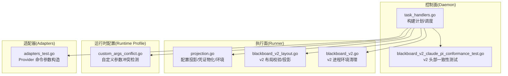
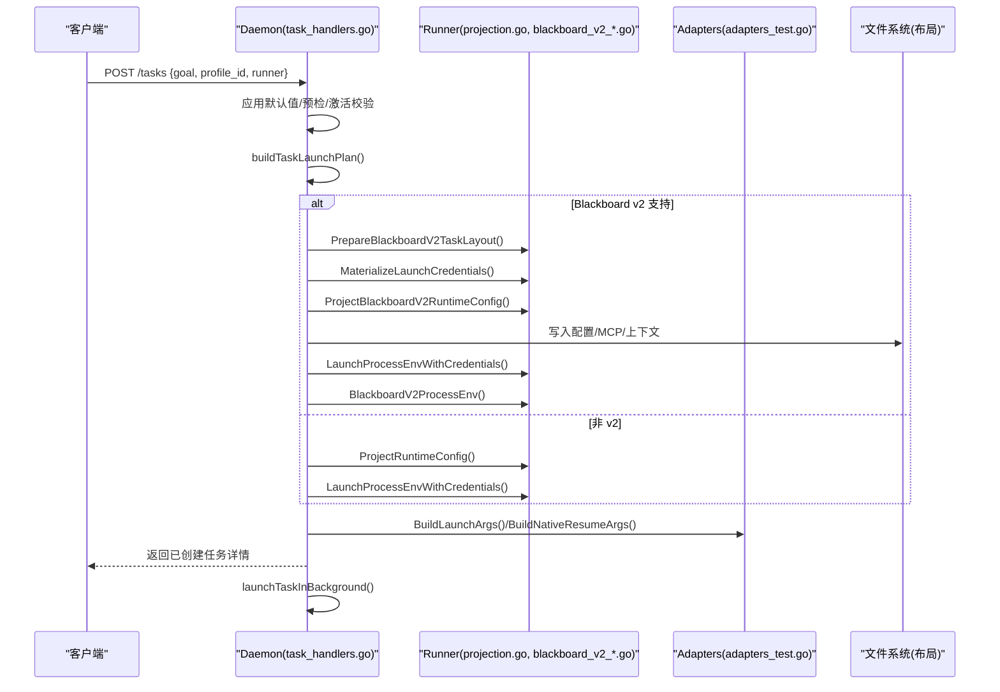
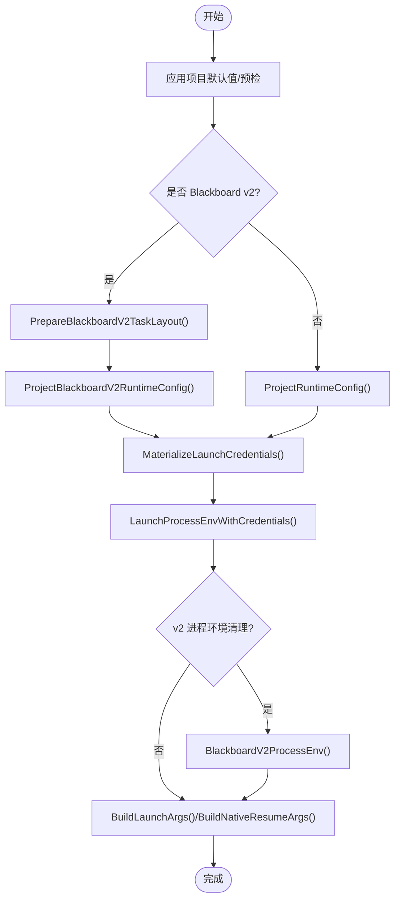
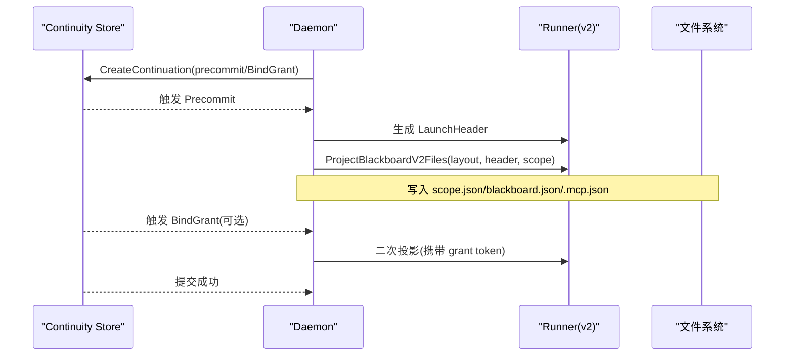
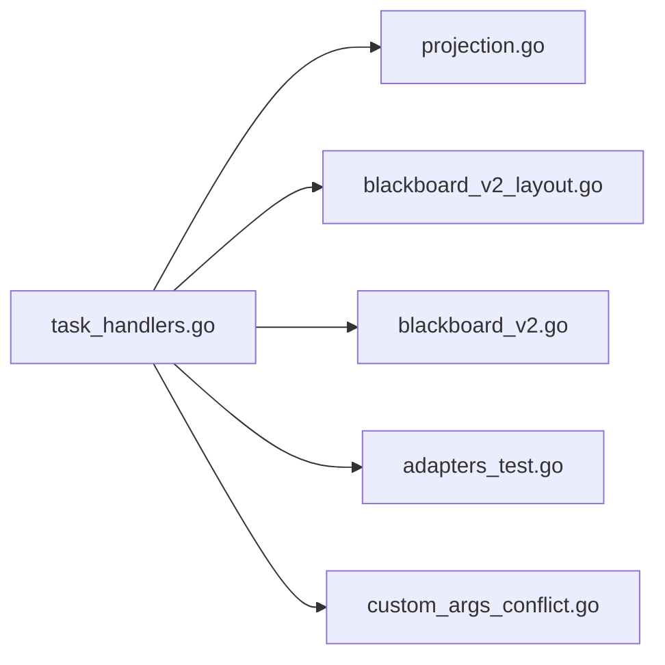

# 任务启动计划构建

<cite>
**本文引用的文件**   
- [task_handlers.go](file://internal/daemon/task_handlers.go)
- [projection.go](file://internal/runner/projection.go)
- [blackboard_v2_layout.go](file://internal/runner/blackboard_v2_layout.go)
- [blackboard_v2.go](file://internal/runner/blackboard_v2.go)
- [custom_args_conflict.go](file://internal/runtimeprofile/custom_args_conflict.go)
- [adapters_test.go](file://internal/adapters/adapters_test.go)
- [pi_sandbox_test.go](file://internal/runner/pi_sandbox_test.go)
- [task_launch_deadlock_test.go](file://internal/daemon/task_launch_deadlock_test.go)
- [blackboard_v2_claude_pi_conformance_test.go](file://internal/daemon/blackboard_v2_claude_pi_conformance_test.go)
- [blackboard_v2_projection_test.go](file://internal/runner/blackboard_v2_projection_test.go)
</cite>

## 目录
1. [简介](#简介)
2. [项目结构](#项目结构)
3. [核心组件](#核心组件)
4. [架构总览](#架构总览)
5. [详细组件分析](#详细组件分析)
6. [依赖关系分析](#依赖关系分析)
7. [性能与并发特性](#性能与并发特性)
8. [故障排查指南](#故障排查指南)
9. [结论](#结论)
10. [附录](#附录)

## 简介
本文件聚焦“任务启动计划构建”的完整流程，围绕 taskLaunchPlan 结构的设计与字段语义、Profile 解析、环境变量注入、文件布局准备、命令参数生成、Blackboard v2 特有的 LaunchHeader 与 MCP 配置投影、启动参数验证与冲突检测、缓存机制、版本兼容性与回滚策略，以及调试工具与自定义扩展方法进行系统化说明。目标是帮助读者从高层到代码级全面理解任务如何被安全、可审计地启动。

## 项目结构
与任务启动计划构建相关的核心模块分布在以下位置：
- Daemon 控制面：负责 HTTP 入口、预检、计划构建、持久化与调度
- Runner 执行面：负责布局校验、配置投影、凭证物化、环境拼装、沙箱命令组装
- Runtime Profile：负责自定义参数冲突检测与结构化字段保护
- Adapters：负责不同 Provider（Codex/Claude/Pi）的命令参数拼装
- Blackboard v2：负责 LaunchHeader 生成、工作快照恢复、MCP 配置投影

图表来源
- [task_handlers.go:522-800](file://internal/daemon/task_handlers.go#L522-L800)
- [projection.go:55-131](file://internal/runner/projection.go#L55-L131)
- [blackboard_v2_layout.go:27-113](file://internal/runner/blackboard_v2_layout.go#L27-L113)
- [blackboard_v2.go:114-148](file://internal/runner/blackboard_v2.go#L114-L148)
- [custom_args_conflict.go:51-124](file://internal/runtimeprofile/custom_args_conflict.go#L51-L124)
- [adapters_test.go:67-108](file://internal/adapters/adapters_test.go#L67-L108)
- [blackboard_v2_claude_pi_conformance_test.go:312-329](file://internal/daemon/blackboard_v2_claude_pi_conformance_test.go#L312-L329)

章节来源
- [task_handlers.go:522-800](file://internal/daemon/task_handlers.go#L522-L800)
- [projection.go:55-131](file://internal/runner/projection.go#L55-L131)
- [blackboard_v2_layout.go:27-113](file://internal/runner/blackboard_v2_layout.go#L27-L113)
- [blackboard_v2.go:114-148](file://internal/runner/blackboard_v2.go#L114-L148)
- [custom_args_conflict.go:51-124](file://internal/runtimeprofile/custom_args_conflict.go#L51-L124)
- [adapters_test.go:67-108](file://internal/adapters/adapters_test.go#L67-L108)
- [blackboard_v2_claude_pi_conformance_test.go:312-329](file://internal/daemon/blackboard_v2_claude_pi_conformance_test.go#L312-L329)

## 核心组件
- taskLaunchPlan：封装一次任务启动所需的全部上下文，包括 Adapter、运行时配置、已捕获的配置快照、物化的凭据、元数据函数、停止确认、模型覆盖、推理强度、原生续会会话 ID、已解析的 Profile、模型快照、全局模型提供者快照、技能包、启动目标、是否使用 Blackboard v2、已校验的布局、以及 v2 引导事件 ID 列表。
- 配置投影器：根据 Provider 类型将 Profile 投影为具体运行时的配置文件与环境变量，并写入任务本地布局。
- 布局校验器：对 Blackboard v2 的任务目录进行严格的安全校验，拒绝符号链接与越界路径，确保后续投影过程在受控边界内。
- 凭证物化器：在事务外一次性解析所有需要的凭据，避免在启动事务中重复访问存储；Pi 还会合并所有“可启动”的全局模型提供者凭据。
- 进程环境装配器：按 Provider 与沙箱模式注入必要的环境变量，并在 v2 模式下清理模型可见的 Project Interface 标识与传输凭据。
- 参数冲突检测器：阻止自定义参数重写结构化字段（如 model、model_provider、reasoning_effort），保证配置一致性与可观测性。

章节来源
- [task_handlers.go:169-189](file://internal/daemon/task_handlers.go#L169-L189)
- [projection.go:784-808](file://internal/runner/projection.go#L784-L808)
- [blackboard_v2_layout.go:27-113](file://internal/runner/blackboard_v2_layout.go#L27-L113)
- [blackboard_v2.go:114-137](file://internal/runner/blackboard_v2.go#L114-L137)
- [custom_args_conflict.go:51-124](file://internal/runtimeprofile/custom_args_conflict.go#L51-L124)

## 架构总览
下图展示了从创建任务到实际启动的关键调用链，涵盖计划构建、Blackboard v2 前置检查、配置投影、凭证物化、环境装配与命令拼装。

图表来源
- [task_handlers.go:522-800](file://internal/daemon/task_handlers.go#L522-L800)
- [projection.go:55-131](file://internal/runner/projection.go#L55-L131)
- [blackboard_v2_layout.go:27-113](file://internal/runner/blackboard_v2_layout.go#L27-L113)
- [blackboard_v2.go:114-137](file://internal/runner/blackboard_v2.go#L114-L137)
- [adapters_test.go:67-108](file://internal/adapters/adapters_test.go#L67-L108)

## 详细组件分析

### taskLaunchPlan 结构与字段语义
- Adapter：用于与具体 Provider 交互的运行时适配器接口实例。
- RuntimeConfig：本次启动使用的运行时配置预览（不含敏感值）。
- CapturedRuntimeConfig：持久化的任务运行时配置快照，用于历史追溯与复现。
- MaterializedCredentials：内存中的凭据映射，避免在事务中重复解析。
- Metadata：提供原生会话元数据的延迟获取函数。
- StopConfirmation：停止确认回调，用于优雅终止。
- LaunchModelOverride：本次启动的模型覆盖（仅影响当前任务）。
- LaunchReasoningEffort：本次启动的推理强度覆盖。
- NativeResumeSessionID：原生续会会话 ID（用于恢复）。
- ResolvedProfile：最终生效的 Profile（可能由投影结果覆盖）。
- ModelSnapshot：模型提供者快照（非敏感信息）。
- GlobalModelProviderSnapshot：全局模型提供者不可变快照（Pi 跨 Provider 切换用）。
- SkillBundles：启用的技能包集合。
- LaunchGoal：最终传入运行器的目标文本（v2 下包含 LaunchHeader）。
- BlackboardV2：是否启用 Blackboard v2 启动契约。
- ValidatedLayout：已校验的 v2 任务布局。
- BlackboardV2SteeringEventIDs：v2 引导事件 ID 列表。

章节来源
- [task_handlers.go:169-189](file://internal/daemon/task_handlers.go#L169-L189)

### 启动计划构建流程（端到端）
- Profile 解析与选择：从请求或项目默认值解析 runtime_profile_id 与 runner，必要时通过 Launch Selection 自动解析最小匹配 Profile。
- 预检与激活校验：运行 preflight 检查（含自定义参数冲突）、宿主激活校验。
- 布局准备：若为 v2，先校验并准备任务布局，拒绝不安全路径与符号链接。
- 配置投影：根据 Provider 类型投影运行时配置（Claude/Codex/Pi），同时处理技能包与运行时扩展。
- 凭证物化：在事务外解析所有需要的凭据，Pi 额外合并“可启动”的全局模型提供者凭据。
- 环境装配：注入项目/任务/沙箱等上下文环境变量，并按 Provider 补充特定键（如 Claude 的 ANTHROPIC_*、Pi 的 PI_*）。
- 命令参数生成：基于 Profile 与投影结果拼装 Provider 原生命令行参数，支持原生续会场景。
- v2 特殊处理：生成 LaunchHeader 并注入到 LaunchGoal 前部；Host Runner 下将绝对路径转换为相对路径以避免泄露 TaskRoot。

图表来源
- [task_handlers.go:522-800](file://internal/daemon/task_handlers.go#L522-L800)
- [projection.go:55-131](file://internal/runner/projection.go#L55-L131)
- [blackboard_v2_layout.go:27-113](file://internal/runner/blackboard_v2_layout.go#L27-L113)
- [blackboard_v2.go:114-137](file://internal/runner/blackboard_v2.go#L114-L137)

章节来源
- [task_handlers.go:522-800](file://internal/daemon/task_handlers.go#L522-L800)

### Blackboard v2 特有逻辑：LaunchHeader 与 MCP 配置投影
- LaunchHeader 生成：在 Continuation 原子提交前，通过 Precommit 钩子生成五字段的确定性头部（Runner、ScopePath、BlackboardPath、Schema、Revision），随后渲染为 LaunchGoal 的前缀。
- MCP 配置投影：根据 Provider 写入 .mcp.json 或 agent/mcp.json，并在 Host Runner 下将路径转为相对路径，避免泄露 TaskRoot。
- 工作快照恢复：服务重启后，从活跃快照恢复 Working Snapshot 字节，重新投影 Scope/Blackboard 上下文文件。

图表来源
- [task_handlers.go:311-397](file://internal/daemon/task_handlers.go#L311-L397)
- [blackboard_v2_projection_test.go:55-64](file://internal/runner/blackboard_v2_projection_test.go#L55-L64)
- [blackboard_v2_claude_pi_conformance_test.go:312-329](file://internal/daemon/blackboard_v2_claude_pi_conformance_test.go#L312-L329)

章节来源
- [task_handlers.go:311-397](file://internal/daemon/task_handlers.go#L311-L397)
- [blackboard_v2_projection_test.go:55-64](file://internal/runner/blackboard_v2_projection_test.go#L55-L64)
- [blackboard_v2_claude_pi_conformance_test.go:312-329](file://internal/daemon/blackboard_v2_claude_pi_conformance_test.go#L312-L329)

### 环境变量注入与凭据物化
- 基础环境：注入项目/任务/沙箱/鉴权令牌等通用键。
- 插件渲染：优先使用 Runtime Plugin 清单渲染的环境变量，否则回退到 Profile 的 env。
- Provider 特化：
  - Claude：注入 ANTHROPIC_* 相关键，并写入 settings.json。
  - Pi：注入 PI_* 相关键，写入 models.json/auth.json，并在有全局模型提供者时合并其凭据。
  - Codex：写入 config.toml 与 auth.json，或复用主机认证。
- 凭据物化：
  - 若存在内存快照则直接克隆，避免再次查询存储。
  - 若未提供且需要模型 API Key，则从环境变量或绑定解析。
  - Pi 在启动前合并所有“可启动”的全局模型提供者凭据，以支持跨 Provider 轮次无需重启。

章节来源
- [projection.go:1322-1403](file://internal/runner/projection.go#L1322-L1403)
- [projection.go:784-808](file://internal/runner/projection.go#L784-L808)
- [pi_sandbox_test.go:92-175](file://internal/runner/pi_sandbox_test.go#L92-L175)

### 命令参数生成与沙箱适配
- 参数拼装：根据 Provider 与 Profile 生成原生 CLI 参数，自动添加非交互式默认参数（如跳过权限/审批），避免与 Profile 自定义参数重复。
- 原生续会：当提供 nativeResumeSessionID 时，切换到续会参数拼装模式。
- 沙箱适配：在沙箱模式下设置 IS_SANDBOX、PENTEST_SKILLS_DIR 等键，并将 skills 根路径映射到容器内路径。

章节来源
- [adapters_test.go:67-108](file://internal/adapters/adapters_test.go#L67-L108)
- [task_handlers.go:740-800](file://internal/daemon/task_handlers.go#L740-L800)
- [pi_sandbox_test.go:149-175](file://internal/runner/pi_sandbox_test.go#L149-L175)

### 启动参数验证、默认值应用与冲突检测
- 预检阶段：运行 preflight，记录自定义参数冲突诊断日志。
- 冲突检测：ValidateCustomArgs 针对各 Provider 的已知别名（如 --model/-m、-c/--config key=value、--effort、--thinking 等）进行匹配，发现与结构化字段冲突即报错，错误消息对敏感值脱敏。
- 默认值应用：项目默认值（runtime_profile、runner）在请求缺失时填充；非交互式默认参数由运行时框架统一注入，不与 Profile 重复。

章节来源
- [custom_args_conflict.go:51-124](file://internal/runtimeprofile/custom_args_conflict.go#L51-L124)
- [task_handlers.go:110-134](file://internal/daemon/task_handlers.go#L110-L134)

### 启动计划的缓存机制、版本兼容性与回滚策略
- 缓存机制：
  - 全局模型提供者快照：在事务外 List() 并深拷贝，供 Pi 投影与交叉 Provider 轮次使用，避免在事务中重入数据库。
  - 内存凭据快照：在事务外物化并克隆，防止泄漏到预览或持久化配置。
- 版本兼容性：
  - Blackboard v2 支持表：Fake/Codex/Claude/Pi 参与共享契约；不支持的 Provider 直接拒绝。
  - Host Runner 路径转换：v2 在非沙箱下将绝对路径转为相对路径，避免泄露 TaskRoot。
- 回滚策略：
  - 原子提交失败时，清理可能包含 grant token 的 MCP 配置，防止残留敏感信息。
  - 恢复流程：从活跃快照重建 Working Snapshot 与上下文文件，确保重启后可继续。

章节来源
- [projection.go:696-716](file://internal/runner/projection.go#L696-L716)
- [blackboard_v2.go:139-148](file://internal/runner/blackboard_v2.go#L139-L148)
- [task_handlers.go:399-421](file://internal/daemon/task_handlers.go#L399-L421)
- [task_handlers.go:423-456](file://internal/daemon/task_handlers.go#L423-L456)

### 启动计划调试工具与自定义扩展方法
- 调试要点：
  - 查看 CapturedRuntimeConfig 与 ModelSnapshot 预览，确认模型与服务端点选择。
  - 检查生成的 .mcp.json 与 context.json，确认 MCP 与上下文是否正确投影。
  - 观察 LaunchGoal 前缀是否包含 LaunchHeader，确认 v2 头部注入。
- 自定义扩展：
  - 通过 Runtime Plugin 声明式清单定义进程环境变量模板与命令参数规则。
  - 通过 Runtime Extension 将外部资源投影到 provider_home/runtime_home/workdir 指定位置。
  - 通过 Skills 包将能力打包并启用，支持沙箱与宿主两种路径映射。

章节来源
- [projection.go:183-229](file://internal/runner/projection.go#L183-L229)
- [projection.go:1322-1380](file://internal/runner/projection.go#L1322-L1380)
- [blackboard_v2_projection_test.go:29-53](file://internal/runner/blackboard_v2_projection_test.go#L29-L53)

## 依赖关系分析
- 低耦合高内聚：Daemon 仅依赖 Runner 提供的投影与布局能力，不直接操作文件系统细节；Runner 内部按 Provider 分支实现，职责清晰。
- 关键依赖链：
  - task_handlers.go → projection.go（配置投影/凭据物化/环境）
  - task_handlers.go → blackboard_v2_layout.go（v2 布局校验）
  - task_handlers.go → blackboard_v2.go（v2 进程环境清理）
  - task_handlers.go → adapters_test.go（Provider 命令参数）
  - task_handlers.go → custom_args_conflict.go（参数冲突检测）

图表来源
- [task_handlers.go:522-800](file://internal/daemon/task_handlers.go#L522-L800)
- [projection.go:55-131](file://internal/runner/projection.go#L55-L131)
- [blackboard_v2_layout.go:27-113](file://internal/runner/blackboard_v2_layout.go#L27-L113)
- [blackboard_v2.go:114-148](file://internal/runner/blackboard_v2.go#L114-L148)
- [custom_args_conflict.go:51-124](file://internal/runtimeprofile/custom_args_conflict.go#L51-L124)
- [adapters_test.go:67-108](file://internal/adapters/adapters_test.go#L67-L108)

章节来源
- [task_handlers.go:522-800](file://internal/daemon/task_handlers.go#L522-L800)

## 性能与并发特性
- 事务外物化：在进入 Store 事务之前完成凭据物化与全局模型提供者快照，避免在事务中多次查询导致锁竞争与死锁风险。
- 深拷贝快照：全局模型提供者快照采用深拷贝，确保后续变更不影响已固定的启动视图。
- 异步启动：launchTaskInBackground 在后台执行，HTTP 响应快速返回任务详情，提升吞吐。

章节来源
- [task_handlers.go:560-605](file://internal/daemon/task_handlers.go#L560-L605)
- [projection.go:696-716](file://internal/runner/projection.go#L696-L716)
- [task_launch_deadlock_test.go:18-35](file://internal/daemon/task_launch_deadlock_test.go#L18-L35)

## 故障排查指南
- 自定义参数冲突：
  - 现象：保存或启动时报错，提示自定义参数重定义了结构化字段。
  - 定位：检查 ValidateCustomArgs 的错误对象，关注 Argument/Flag/Field 字段；错误消息会对敏感值脱敏。
  - 修复：使用 Profile 的结构化字段替代自定义参数。
- 凭据缺失：
  - 现象：启动失败，提示模型 API Key 环境变量未配置。
  - 定位：检查 MaterializeLaunchCredentials 的返回错误；确认绑定或环境变量是否就绪。
  - 修复：配置正确的 Credential Binding 或环境变量。
- v2 布局不安全：
  - 现象：启动失败，提示 unsafe Blackboard v2 task layout。
  - 定位：检查是否存在符号链接或非法路径；确保目录结构符合 v2 约束。
  - 修复：清理非法文件或目录，重新创建任务。
- 死锁与超时：
  - 现象：POST /tasks 长时间无响应或超时。
  - 定位：参考死锁测试用例，确认是否在事务中进行了阻塞操作。
  - 修复：遵循事务外物化与快照原则，避免在事务中访问外部资源。

章节来源
- [custom_args_conflict.go:51-124](file://internal/runtimeprofile/custom_args_conflict.go#L51-L124)
- [projection.go:784-808](file://internal/runner/projection.go#L784-L808)
- [blackboard_v2_layout.go:27-113](file://internal/runner/blackboard_v2_layout.go#L27-L113)
- [task_launch_deadlock_test.go:18-35](file://internal/daemon/task_launch_deadlock_test.go#L18-L35)

## 结论
任务启动计划构建通过严格的布局校验、事务外凭据物化、Provider 特定的配置投影与环境装配，以及 Blackboard v2 的原子化 LaunchHeader 与 MCP 配置投影，实现了安全、可审计、可扩展的任务启动流程。自定义参数冲突检测与默认值注入进一步提升了配置的一致性与易用性。结合缓存与回滚策略，系统在性能与可靠性之间取得良好平衡。

## 附录
- 术语对照：
  - 启动计划：taskLaunchPlan
  - 配置投影：ConfigProjection
  - 凭据物化：MaterializedCredentials
  - 工作快照：Working Snapshot
  - 可信 MCP：Trusted MCP