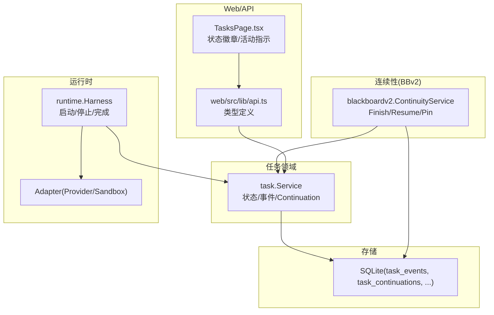
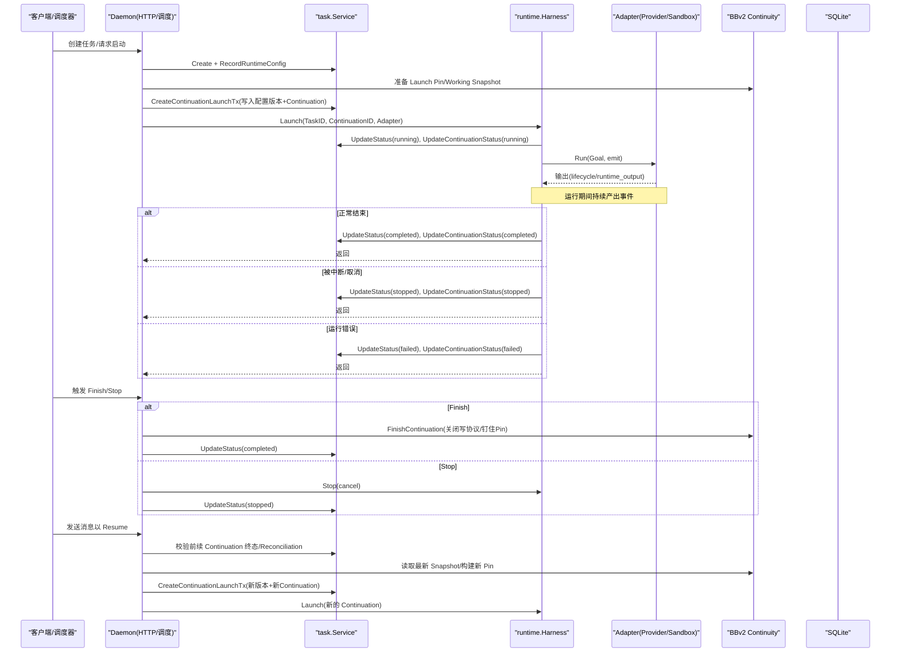
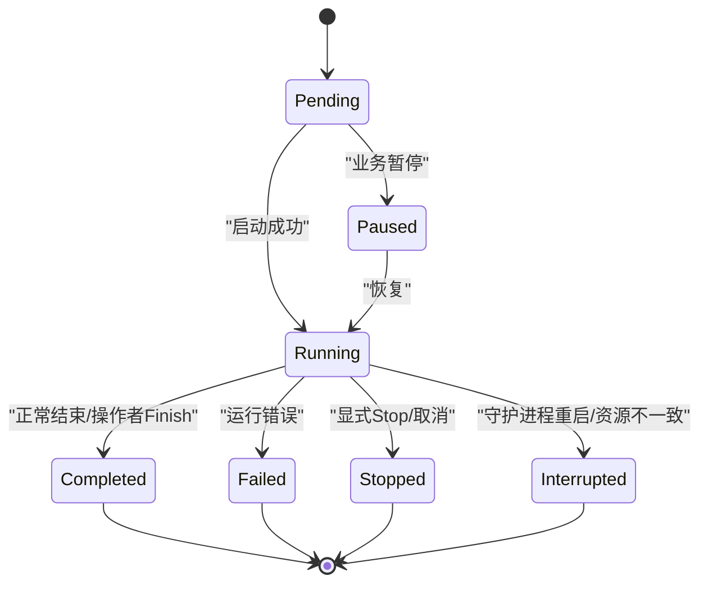
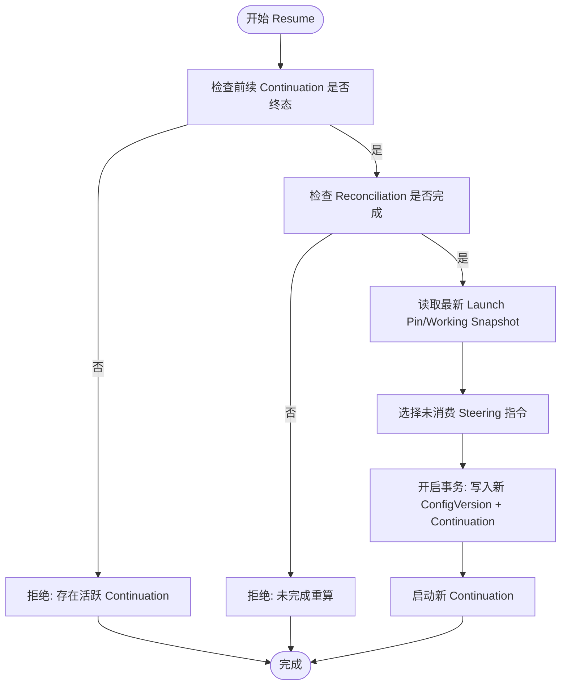
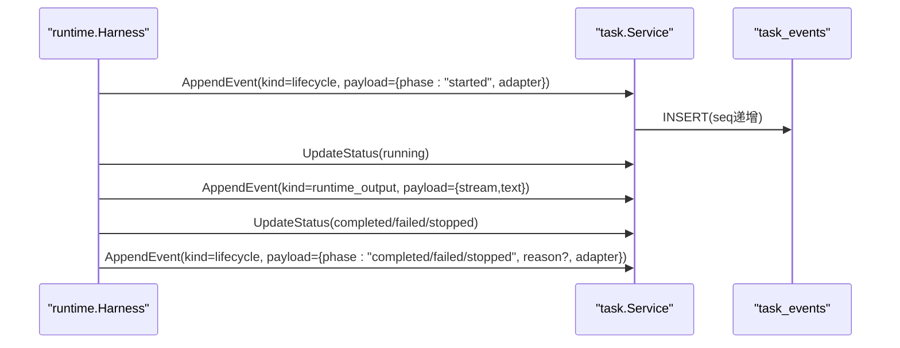
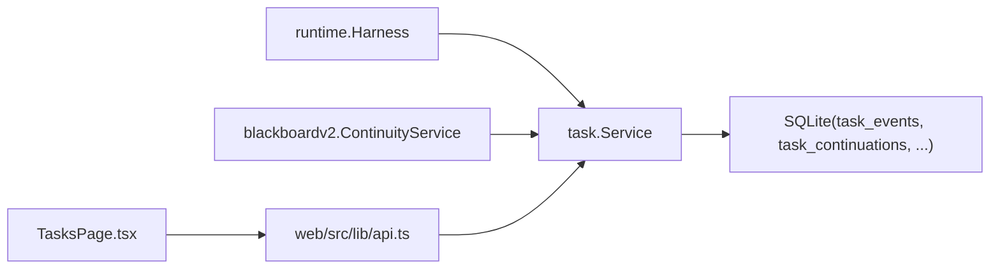

# 任务状态机与生命周期

<cite>
**本文引用的文件**   
- [internal/task/task.go](file://internal/task/task.go)
- [internal/runtime/runtime.go](file://internal/runtime/runtime.go)
- [internal/daemon/blackboard_v2_continuity_test.go](file://internal/daemon/blackboard_v2_continuity_test.go)
- [internal/daemon/finish_task_resume_test.go](file://internal/daemon/finish_task_resume_test.go)
- [internal/daemon/task_test.go](file://internal/daemon/task_test.go)
- [internal/blackboardv2/objective_attempt_service_test.go](file://internal/blackboardv2/objective_attempt_service_test.go)
- [internal/store/store.go](file://internal/store/store.go)
- [web/src/lib/api.ts](file://web/src/lib/api.ts)
- [web/src/pages/TasksPage.tsx](file://web/src/pages/TasksPage.tsx)
- [CONTEXT.md](file://CONTEXT.md)
</cite>

## 目录
1. [简介](#简介)
2. [项目结构](#项目结构)
3. [核心组件](#核心组件)
4. [架构总览](#架构总览)
5. [详细组件分析](#详细组件分析)
6. [依赖关系分析](#依赖关系分析)
7. [性能考量](#性能考量)
8. [故障排查指南](#故障排查指南)
9. [结论](#结论)
10. [附录](#附录)

## 简介
本文件系统化梳理任务（Task）的状态机与完整生命周期，覆盖从创建到终态的转换、Continuation 的 Resume 机制、事件系统（EventKindLifecycle 等）、失败处理与恢复策略、并发控制与事务保证、以及查询与监控接口。文档同时给出可视化图示与可定位的代码片段路径，便于读者快速对照实现。

## 项目结构
围绕任务状态机的关键代码分布在以下模块：
- 任务领域模型与服务：定义 Task、Continuation、事件、状态常量及持久化方法
- 运行时 Harness：负责启动/停止/完成运行器进程，并驱动任务与 Continuation 状态变更
- 连续性服务（Blackboard v2 Continuity）：负责 Finish/Resume 流程中的快照钉住与重放
- 存储层：SQLite 表结构与约束，确保事件顺序与唯一性
- Web API 类型与前端展示：提供任务列表、活动指示器等 UI 能力

图表来源
- [internal/task/task.go:100-128](file://internal/task/task.go#L100-L128)
- [internal/runtime/runtime.go:106-179](file://internal/runtime/runtime.go#L106-L179)
- [internal/blackboardv2/continuity.go:119-152](file://internal/blackboardv2/continuity.go#L119-L152)
- [internal/store/store.go:2103-2113](file://internal/store/store.go#L2103-L2113)
- [web/src/lib/api.ts:409-467](file://web/src/lib/api.ts#L409-L467)
- [web/src/pages/TasksPage.tsx:121-157](file://web/src/pages/TasksPage.tsx#L121-L157)

章节来源
- [internal/task/task.go:100-128](file://internal/task/task.go#L100-L128)
- [internal/runtime/runtime.go:106-179](file://internal/runtime/runtime.go#L106-L179)
- [internal/blackboardv2/continuity.go:119-152](file://internal/blackboardv2/continuity.go#L119-L152)
- [internal/store/store.go:2103-2113](file://internal/store/store.go#L2103-L2113)
- [web/src/lib/api.ts:409-467](file://web/src/lib/api.ts#L409-L467)
- [web/src/pages/TasksPage.tsx:121-157](file://web/src/pages/TasksPage.tsx#L121-L157)

## 核心组件
- 任务状态与运行边界
  - 状态：pending、running、paused、completed、failed、stopped、interrupted
  - Runner：sandbox/host，决定执行边界可见性与安全策略
- Continuation（延续）
  - 同一 Task 内多次 Runtime 会话；每个 Continuation 绑定一次配置版本、一个活跃期、一次 Blackboard 工作快照
- 事件系统
  - EventKind：lifecycle、runtime_output、status、steering、conversation、blackboard_checkpoint
  - lifecycle 事件承载 phase/reason/adapter 等元信息，贯穿启动、完成、失败、停止、中断等关键节点
- 并发与事务
  - 事件追加使用事务与序列号保证单调有序
  - Continuation 创建在调用方事务中完成，避免重复激活与竞态
- 连续性（Finish/Resume）
  - Finish 关闭当前 Continuation 的写协议并钉住 Launch Pin
  - Resume 基于最新 Snapshot 重建新 Continuation，消费未处理的 Steering 指令

章节来源
- [internal/task/task.go:31-42](file://internal/task/task.go#L31-L42)
- [internal/task/task.go:62-69](file://internal/task/task.go#L62-L69)
- [internal/task/task.go:481-551](file://internal/task/task.go#L481-L551)
- [internal/task/task.go:676-767](file://internal/task/task.go#L676-L767)
- [internal/daemon/blackboard_v2_continuity_test.go:162-186](file://internal/daemon/blackboard_v2_continuity_test.go#L162-L186)

## 架构总览
下图展示了任务从 Pending 到 Running 再到终态（Completed/Failed/Stopped/Interrupted）的主路径，以及 Finish/Stop 对 Continuation 的影响与 Resume 的重建过程。

图表来源
- [internal/runtime/runtime.go:106-179](file://internal/runtime/runtime.go#L106-L179)
- [internal/task/task.go:676-767](file://internal/task/task.go#L676-L767)
- [internal/daemon/blackboard_v2_continuity_test.go:162-186](file://internal/daemon/blackboard_v2_continuity_test.go#L162-L186)
- [internal/daemon/finish_task_resume_test.go:1134-1166](file://internal/daemon/finish_task_resume_test.go#L1134-L1166)

## 详细组件分析

### 任务状态机与转换规则
- 初始态：Pending（创建后）
- 进入运行：Running（Harness 启动成功，记录 lifecycle.started）
- 终态集合：
  - Completed：正常结束或 operator_finish
  - Failed：运行错误退出
  - Stopped：显式 Stop 或上下文取消
  - Interrupted：守护进程重启/资源不匹配导致的“孤儿”或离线恢复
- 暂停态：Paused（用于业务暂停，不影响底层运行器）

图表来源
- [internal/task/task.go:31-42](file://internal/task/task.go#L31-L42)
- [internal/runtime/runtime.go:153-179](file://internal/runtime/runtime.go#L153-L179)
- [internal/daemon/finish_task_resume_test.go:1134-1166](file://internal/daemon/finish_task_resume_test.go#L1134-L1166)

章节来源
- [internal/task/task.go:31-42](file://internal/task/task.go#L31-L42)
- [internal/runtime/runtime.go:153-179](file://internal/runtime/runtime.go#L153-L179)
- [internal/daemon/finish_task_resume_test.go:1134-1166](file://internal/daemon/finish_task_resume_test.go#L1134-L1166)

### Continuation 的 Resume 机制
- 前置条件
  - 前续 Continuation 必须达到终态（completed/failed/stopped/interrupted）
  - 若为 failed/stopped/interrupted，需完成 Reconciliation（标记 completed）
- 步骤
  - 读取最新 Working Snapshot（Launch Pin）
  - 选择未消费的 Harness Steering 指令作为下一轮目标
  - 在同一事务中写入新的 Runtime Config Version 与 Continuation
  - 启动新 Continuation，旧 Continuation 失去写权限（closed_continuation）

图表来源
- [internal/task/task.go:676-767](file://internal/task/task.go#L676-L767)
- [internal/daemon/blackboard_v2_continuity_test.go:162-186](file://internal/daemon/blackboard_v2_continuity_test.go#L162-L186)
- [internal/blackboardv2/objective_attempt_service_test.go:650-678](file://internal/blackboardv2/objective_attempt_service_test.go#L650-L678)

章节来源
- [internal/task/task.go:676-767](file://internal/task/task.go#L676-L767)
- [internal/daemon/blackboard_v2_continuity_test.go:162-186](file://internal/daemon/blackboard_v2_continuity_test.go#L162-L186)
- [internal/blackboardv2/objective_attempt_service_test.go:650-678](file://internal/blackboardv2/objective_attempt_service_test.go#L650-L678)

### 事件系统与 EventKindLifecycle
- 事件分类
  - lifecycle：生命周期阶段（started/completed/failed/stopped/finish_shutdown 等），包含 adapter、phase、reason 等字段
  - runtime_output：运行器标准输出/错误流摘要
  - steering/conversation：用户交互与编排指令
  - blackboard_checkpoint：语义工作断点
- 触发时机
  - 启动：lifecycle.started（含 adapter）
  - 结束：lifecycle.completed/failed/stopped（含 reason/adapter）
  - 操作者 Finish：lifecycle.finish_shutdown → lifecycle.completed(reason=operator_finish)
  - 运行器输出：runtime_output（stdout/stderr）

图表来源
- [internal/runtime/runtime.go:106-179](file://internal/runtime/runtime.go#L106-L179)
- [internal/task/task.go:481-551](file://internal/task/task.go#L481-L551)
- [internal/daemon/finish_task_resume_test.go:1134-1166](file://internal/daemon/finish_task_resume_test.go#L1134-L1166)

章节来源
- [internal/runtime/runtime.go:106-179](file://internal/runtime/runtime.go#L106-L179)
- [internal/task/task.go:481-551](file://internal/task/task.go#L481-L551)
- [internal/daemon/finish_task_resume_test.go:1134-1166](file://internal/daemon/finish_task_resume_test.go#L1134-L1166)

### 失败处理、重试与恢复策略
- 失败判定
  - 运行错误：finalStatus=failed，emit lifecycle.failed
  - 显式停止：finalStatus=stopped，emit lifecycle.stopped
  - 守护进程重启/资源不一致：可能标记 interrupted（由上层协调逻辑决定）
- 恢复策略
  - 操作者 Finish：先 finish_shutdown，再 completed(reason=operator_finish)，释放资源
  - 自动 Resume：当收到新消息时，基于最新 Snapshot 重建 Continuation，优先 provider-native 会话恢复，否则重建
  - 幂等与去重：通过 idempotency key、request id、provider turn id 防止重复创建替换 Continuation

章节来源
- [internal/runtime/runtime.go:153-179](file://internal/runtime/runtime.go#L153-L179)
- [internal/daemon/finish_task_resume_test.go:1134-1166](file://internal/daemon/finish_task_resume_test.go#L1134-L1166)
- [CONTEXT.md:929-934](file://CONTEXT.md#L929-L934)

### 并发控制与事务保证
- 事件追加
  - 使用事务计算 MAX(seq)+1，保证同 Task 下事件严格有序
- Continuation 创建
  - 在外部事务中写入 config version 与 continuation，禁止重复激活（ErrActiveContinuation）
  - 若前续为 failed/stopped/interrupted，需 ReconciliationCompleted 才可继续
- 闭锁与权限
  - 旧 Continuation 进入终态后，其写权限关闭，后续写将返回 closed_continuation

章节来源
- [internal/task/task.go:481-551](file://internal/task/task.go#L481-L551)
- [internal/task/task.go:676-767](file://internal/task/task.go#L676-L767)
- [internal/blackboardv2/objective_attempt_service_test.go:650-678](file://internal/blackboardv2/objective_attempt_service_test.go#L650-L678)

### 状态查询 API、批量操作与监控接口
- 查询接口
  - 获取任务详情、事件时间线、Transcript/Timeline 视图
  - 前端类型定义包括 TaskContinuation、TaskEvent、TaskTimeline 等
- 监控指标
  - RuntimeActivity：liveness（live/offline/orphaned/unknown）与 turn_activity（busy/idle）
  - TasksPage 渲染状态徽章与活动指示，区分运行中与其他状态
- 批量操作
  - 列表查询按创建时间排序，支持过滤项目范围
  - 删除仅允许终态任务，保留最小完整性数据

章节来源
- [web/src/lib/api.ts:409-467](file://web/src/lib/api.ts#L409-L467)
- [web/src/pages/TasksPage.tsx:121-157](file://web/src/pages/TasksPage.tsx#L121-L157)
- [internal/task/task.go:376-408](file://internal/task/task.go#L376-L408)
- [internal/task/task.go:410-442](file://internal/task/task.go#L410-L442)

## 依赖关系分析
- 低耦合高内聚
  - task.Service 专注领域规则与持久化；runtime.Harness 专注进程/会话生命周期；Continuity 专注 Finish/Resume 与快照
- 直接依赖
  - runtime.Harness → task.Service（更新状态/事件）
  - Continuity → task.Service（读取/创建 Continuation）
  - task.Service → SQLite（事件/Continuation/配置版本）
- 间接依赖
  - Web API 类型与 UI 通过 HTTP 访问后端，不直接依赖内部实现

图表来源
- [internal/runtime/runtime.go:106-179](file://internal/runtime/runtime.go#L106-L179)
- [internal/blackboardv2/continuity.go:119-152](file://internal/blackboardv2/continuity.go#L119-L152)
- [internal/store/store.go:2103-2113](file://internal/store/store.go#L2103-L2113)
- [web/src/lib/api.ts:409-467](file://web/src/lib/api.ts#L409-L467)
- [web/src/pages/TasksPage.tsx:121-157](file://web/src/pages/TasksPage.tsx#L121-L157)

章节来源
- [internal/runtime/runtime.go:106-179](file://internal/runtime/runtime.go#L106-L179)
- [internal/blackboardv2/continuity.go:119-152](file://internal/blackboardv2/continuity.go#L119-L152)
- [internal/store/store.go:2103-2113](file://internal/store/store.go#L2103-L2113)
- [web/src/lib/api.ts:409-467](file://web/src/lib/api.ts#L409-L467)
- [web/src/pages/TasksPage.tsx:121-157](file://web/src/pages/TasksPage.tsx#L121-L157)

## 性能考量
- 事件追加采用单行插入与事务，seq 自增避免跨进程竞争开销
- 大输出走日志/证据附件，事件只保留结构化摘要，降低数据库压力
- 快照（Snapshot）按需拉取与增量同步，避免重复传输完整图
- 前端分页/排序优化（如 running 优先）提升交互体验

[本节为通用指导，无需源码引用]

## 故障排查指南
- 常见问题
  - 无法 Resume：检查是否存在活跃 Continuation 或 Reconciliation 未完成
  - 旧 Continuation 写失败：确认已处于终态且权限已关闭（closed_continuation）
  - 事件缺失：核对 seq 是否连续、事务是否提交
  - 状态不一致：对比 lifecycle 事件与最终状态，关注 operator_finish 场景
- 调试技巧
  - 查看 lifecycle 事件的 phase/reason/adapter 字段定位阶段
  - 使用 Transcript/Timeline 聚合视图还原对话与工具调用
  - 观察 RuntimeActivity 的 liveness/turn_activity 判断运行器健康

章节来源
- [internal/task/task.go:676-767](file://internal/task/task.go#L676-L767)
- [internal/blackboardv2/objective_attempt_service_test.go:650-678](file://internal/blackboardv2/objective_attempt_service_test.go#L650-L678)
- [internal/daemon/task_test.go:655-692](file://internal/daemon/task_test.go#L655-L692)
- [web/src/pages/TasksPage.tsx:121-157](file://web/src/pages/TasksPage.tsx#L121-L157)

## 结论
任务状态机以 Task 为中心，结合 Continuation 的细粒度会话管理、完备的事件体系与 Finish/Resume 的快照机制，实现了可靠的可观测、可恢复与可编排能力。通过事务与序列号保障并发一致性，配合 RuntimeActivity 实时监控，形成从控制面到执行面的闭环。

[本节为总结，无需源码引用]

## 附录
- 术语
  - Task：一次以目标为导向的运行实例
  - Continuation：同一 Task 内的单次运行会话
  - Snapshot：Blackboard 的工作快照，用于 Resume 重建
  - Steering：运行时编排指令，影响下一次 Continuation
- 参考规范
  - 领域约定与边界说明参见 CONTEXT.md 的任务与 Blackboard 相关段落

章节来源
- [CONTEXT.md:843-934](file://CONTEXT.md#L843-L934)