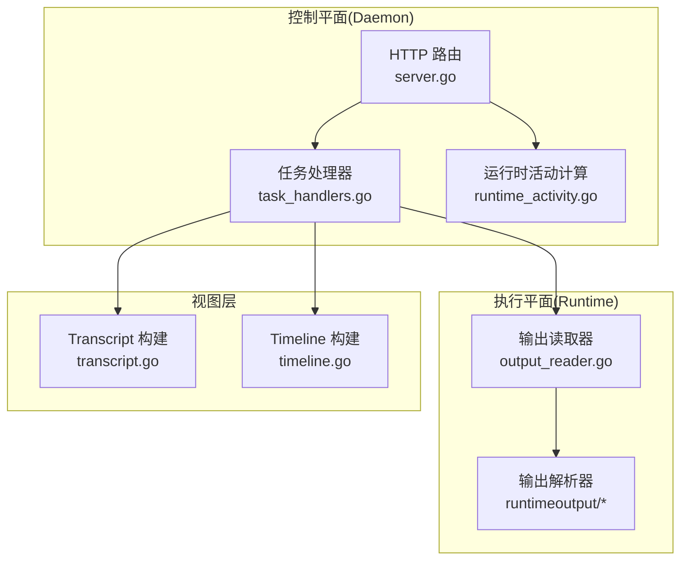
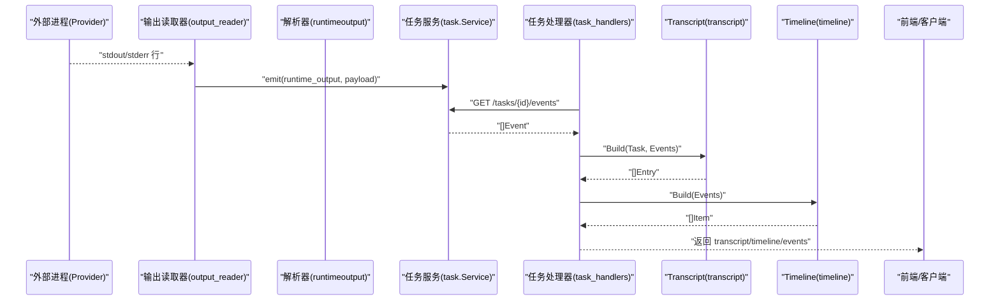
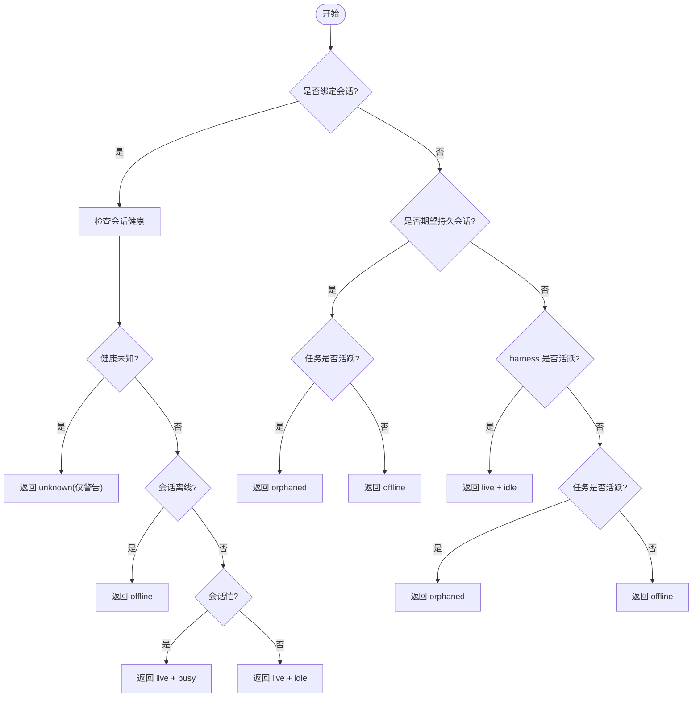
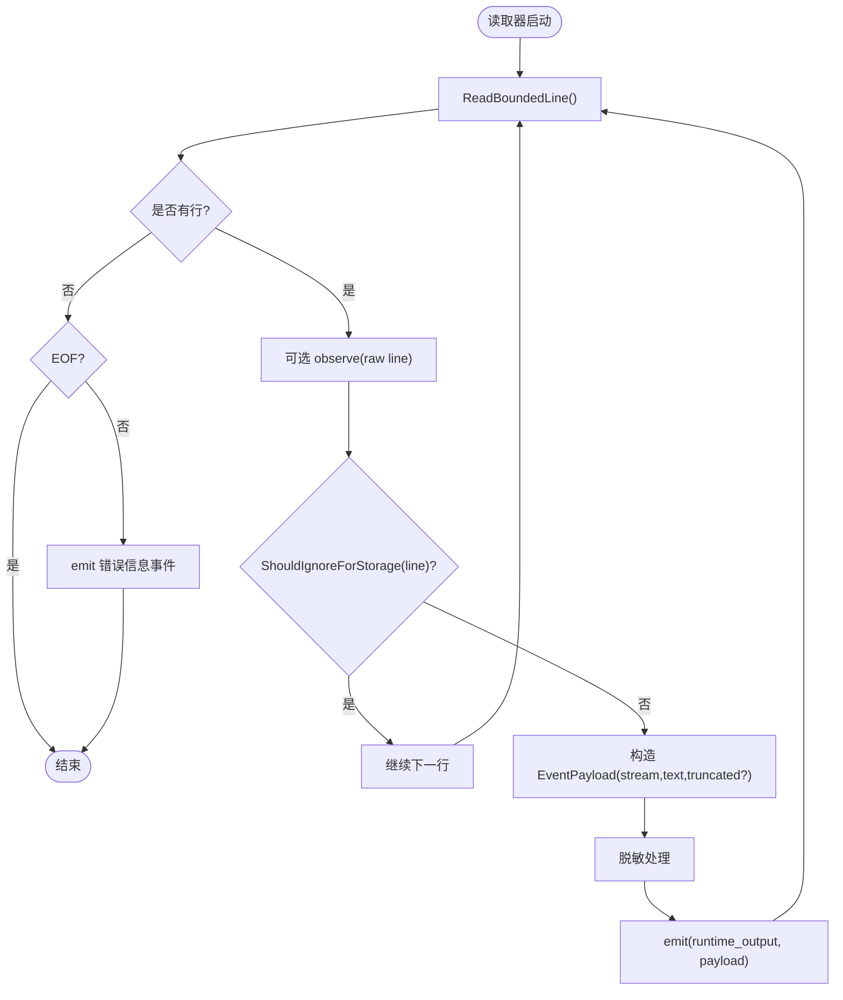
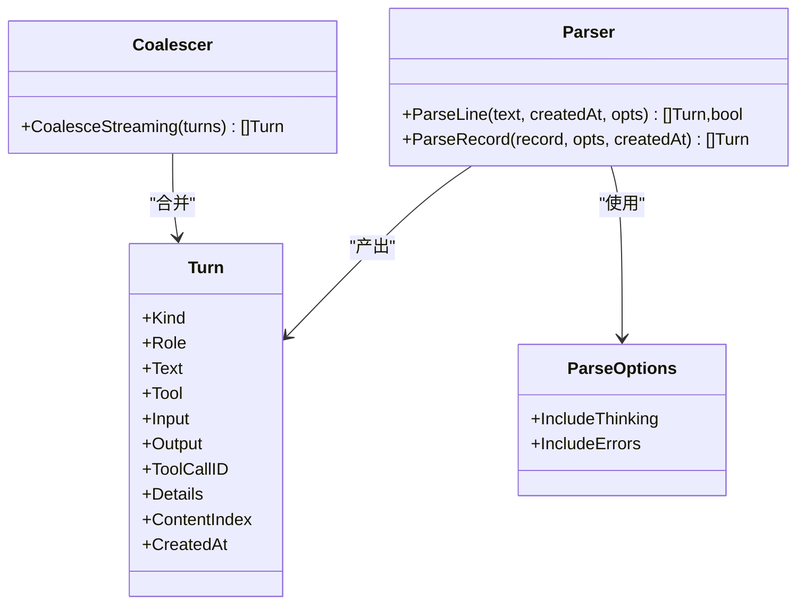
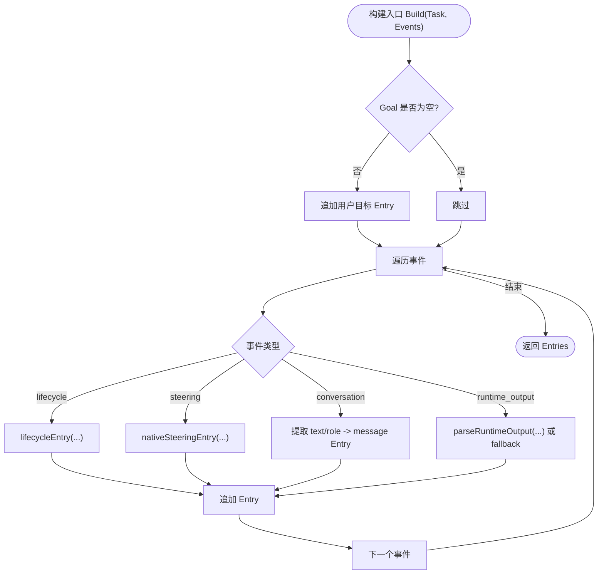
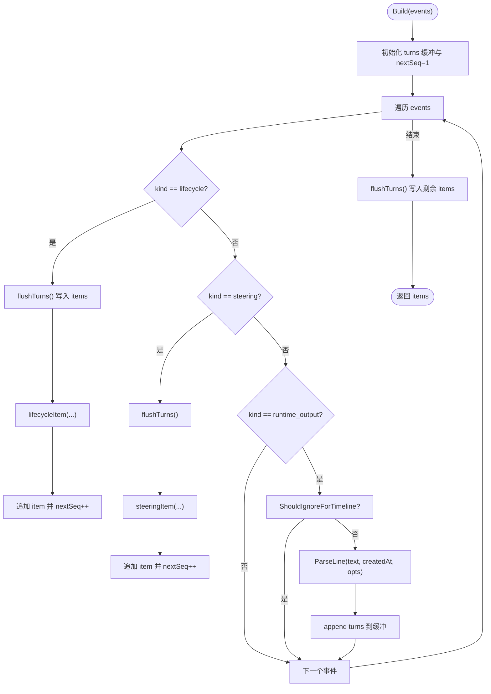
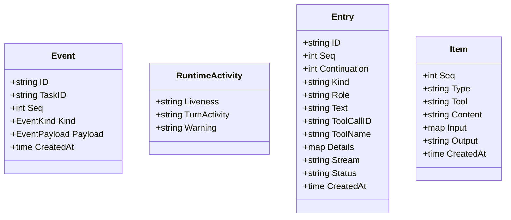
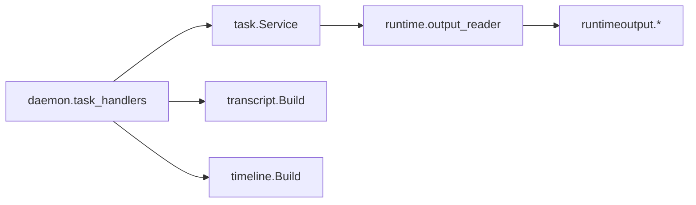

# 运行时活动监控

<cite>
**本文引用的文件**   
- [internal/daemon/server.go](file://internal/daemon/server.go)
- [internal/daemon/task_handlers.go](file://internal/daemon/task_handlers.go)
- [internal/daemon/runtime_activity.go](file://internal/daemon/runtime_activity.go)
- [internal/task/task.go](file://internal/task/task.go)
- [internal/runtime/output_reader.go](file://internal/runtime/output_reader.go)
- [internal/runtimeoutput/parse.go](file://internal/runtimeoutput/parse.go)
- [internal/runtimeoutput/coalesce.go](file://internal/runtimeoutput/coalesce.go)
- [internal/runtimeoutput/turn.go](file://internal/runtimeoutput/turn.go)
- [internal/transcript/transcript.go](file://internal/transcript/transcript.go)
- [internal/timeline/timeline.go](file://internal/timeline/timeline.go)
</cite>

## 目录
1. [简介](#简介)
2. [项目结构](#项目结构)
3. [核心组件](#核心组件)
4. [架构总览](#架构总览)
5. [详细组件分析](#详细组件分析)
6. [依赖关系分析](#依赖关系分析)
7. [性能考量](#性能考量)
8. [故障诊断指南](#故障诊断指南)
9. [结论](#结论)
10. [附录](#附录)

## 简介
本文件聚焦于“运行时活动监控”子系统，围绕任务执行过程中的活动跟踪机制展开，涵盖：
- 进程输出捕获与事件化
- 日志聚合、结构化解析与流式处理
- Transcript（对话式转录）系统的时间线构建与角色映射
- Timeline（时间线）的时间戳管理、事件排序与关联分析
- 活动数据的存储格式、查询接口与可视化展示
- 实时监控 API、历史数据检索与性能指标收集
- 监控配置选项、告警规则与故障诊断方法

该子系统由 Daemon 控制平面、Runtime 执行平面、以及 Transcript/Timeline 视图层共同组成，提供从原始进程输出到可读对话与可操作时间线的端到端能力。

## 项目结构
运行时活动监控涉及以下关键模块与职责：
- Daemon HTTP 服务层：注册并实现 /events、/transcript、/timeline 等监控相关路由；计算并附加 RuntimeActivity。
- Task 领域模型：定义事件类型、生命周期状态、运行时活动结构体等。
- Runtime 输出读取器：按行扫描进程 stdout/stderr，过滤元数据，生成 runtime_output 事件。
- 运行时输出解析器：将 JSON 或文本行归一化为 Turn（思考、文本、工具调用、工具结果、错误）。
- Transcript 系统：将保留的事件投影为对话式条目（消息、工具调用/结果、运行时输出、续接点）。
- Timeline 系统：将事件聚合成多分类时间线项（思考、文本、工具调用/结果、错误、生命周期、导航），支持合并相邻片段。

图表来源
- [internal/daemon/server.go:631-643](file://internal/daemon/server.go#L631-L643)
- [internal/daemon/task_handlers.go:1427-1467](file://internal/daemon/task_handlers.go#L1427-L1467)
- [internal/daemon/runtime_activity.go:34-74](file://internal/daemon/runtime_activity.go#L34-L74)
- [internal/runtime/output_reader.go:64-103](file://internal/runtime/output_reader.go#L64-L103)
- [internal/runtimeoutput/parse.go:11-27](file://internal/runtimeoutput/parse.go#L11-L27)
- [internal/transcript/transcript.go:50-82](file://internal/transcript/transcript.go#L50-L82)
- [internal/timeline/timeline.go:30-76](file://internal/timeline/timeline.go#L30-L76)

章节来源
- [internal/daemon/server.go:631-643](file://internal/daemon/server.go#L631-L643)
- [internal/daemon/task_handlers.go:1427-1467](file://internal/daemon/task_handlers.go#L1427-L1467)

## 核心组件
- 运行时活动计算与协调
  - 基于当前会话/进程健康判定 live/offline/orphaned/unknown，并在必要时触发任务状态变更（如 failed/interrupted）。
  - 区分持久化会话路径与一次性运行路径，避免误报活体。
- 进程输出捕获与事件化
  - 按行读取 stdout/stderr，限制单行长度，过滤平台元数据，统一产出 runtime_output 事件。
- 结构化解析与流式合并
  - 将 JSON 记录解析为 Turn（thinking/text/tool_use/tool_result/error），并对相邻同类型片段进行合并，提升可读性。
- Transcript 系统
  - 将任务目标与保留事件投影为对话式条目，包含消息、工具调用/结果、运行时输出与续接点标记。
- Timeline 系统
  - 将事件转换为多分类时间线项，支持 thinking/text/tool_use/tool_result/error/lifecycle/steering，并提供跳转与摘要。

章节来源
- [internal/daemon/runtime_activity.go:34-74](file://internal/daemon/runtime_activity.go#L34-L74)
- [internal/runtime/output_reader.go:64-103](file://internal/runtime/output_reader.go#L64-L103)
- [internal/runtimeoutput/parse.go:30-79](file://internal/runtimeoutput/parse.go#L30-L79)
- [internal/runtimeoutput/coalesce.go:4-33](file://internal/runtimeoutput/coalesce.go#L4-L33)
- [internal/transcript/transcript.go:50-82](file://internal/transcript/transcript.go#L50-L82)
- [internal/timeline/timeline.go:30-76](file://internal/timeline/timeline.go#L30-L76)

## 架构总览
下图展示了从进程输出到监控 API 的完整链路，包括实时计算、事件化、结构化解析与视图构建。

图表来源
- [internal/runtime/output_reader.go:64-103](file://internal/runtime/output_reader.go#L64-L103)
- [internal/daemon/task_handlers.go:1427-1467](file://internal/daemon/task_handlers.go#L1427-L1467)
- [internal/transcript/transcript.go:50-82](file://internal/transcript/transcript.go#L50-L82)
- [internal/timeline/timeline.go:30-76](file://internal/timeline/timeline.go#L30-L76)

## 详细组件分析

### 运行时活动计算与协调（Daemon）
- 活动判定逻辑
  - 若存在已绑定会话且健康未知 → unknown（仅警告，不改变任务状态）
  - 若会话离线 → offline
  - 若会话忙/空闲 → live + turn_activity(busy/idle)
  - 无会话但期望持久会话 → orphaned（活跃任务）或 offline（非活跃）
  - 一次性运行：以 harness 活跃度为准
- 协调策略
  - unexpected offline + 活跃任务 → failed，释放所有权，清理桥接
  - orphaned + 活跃任务 → interrupted
  - unknown → 仅警告
  - 显式 Close/Stop 导致的 offline → 不视为异常退出失败
- 控制锁保护
  - 在 Stop/Resume 等操作期间，避免并发轮询导致误判

图表来源
- [internal/daemon/runtime_activity.go:34-74](file://internal/daemon/runtime_activity.go#L34-L74)
- [internal/daemon/runtime_activity.go:155-213](file://internal/daemon/runtime_activity.go#L155-L213)

章节来源
- [internal/daemon/runtime_activity.go:34-74](file://internal/daemon/runtime_activity.go#L34-L74)
- [internal/daemon/runtime_activity.go:155-213](file://internal/daemon/runtime_activity.go#L155-L213)

### 进程输出捕获与事件化（Runtime Output Reader）
- 逐行读取，限制最大行长度，防止超大行阻塞管道
- 过滤平台元数据（如会话初始化记录），避免污染事件
- 对截断行标记 truncated，便于追踪
- 统一产出 EventKind=runtime_output，payload 包含 stream、text、truncated 等字段

图表来源
- [internal/runtime/output_reader.go:22-59](file://internal/runtime/output_reader.go#L22-L59)
- [internal/runtime/output_reader.go:64-103](file://internal/runtime/output_reader.go#L64-L103)

章节来源
- [internal/runtime/output_reader.go:64-103](file://internal/runtime/output_reader.go#L64-L103)

### 结构化解析与流式合并（Runtime Output Parser）
- ParseLine：首字符为 { 则尝试 JSON 解析，否则作为纯文本回退
- ParseRecord：根据 type/role/content/message 等字段归一化为 Turn
  - 支持 thinking/text/tool_use/tool_result/error
  - 支持 content blocks 的多块解析
- CoalesceStreaming：合并相邻相同类型的 thinking/text 片段，减少抖动

图表来源
- [internal/runtimeoutput/turn.go:16-34](file://internal/runtimeoutput/turn.go#L16-L34)
- [internal/runtimeoutput/parse.go:11-27](file://internal/runtimeoutput/parse.go#L11-L27)
- [internal/runtimeoutput/parse.go:30-79](file://internal/runtimeoutput/parse.go#L30-L79)
- [internal/runtimeoutput/coalesce.go:4-33](file://internal/runtimeoutput/coalesce.go#L4-L33)

章节来源
- [internal/runtimeoutput/parse.go:30-79](file://internal/runtimeoutput/parse.go#L30-L79)
- [internal/runtimeoutput/coalesce.go:4-33](file://internal/runtimeoutput/coalesce.go#L4-L33)

### Transcript 系统（对话式转录）
- 输入：Task 目标与保留事件列表
- 输出：Entry 序列，包含 message/tool_call/tool_result/runtime_output/continuation
- 特性：
  - 生命周期事件映射为 continuation 标记（started/completed/failed/stopped/process_started 等）
  - 原生引导（native steering）事件映射为 continuation 状态变化
  - 未知适配器输出回退为 collapsed 的 runtime_output
  - 忽略不可见元数据与纯思考行

图表来源
- [internal/transcript/transcript.go:50-82](file://internal/transcript/transcript.go#L50-L82)
- [internal/transcript/transcript.go:84-156](file://internal/transcript/transcript.go#L84-L156)
- [internal/transcript/transcript.go:158-215](file://internal/transcript/transcript.go#L158-L215)
- [internal/transcript/transcript.go:251-271](file://internal/transcript/transcript.go#L251-L271)

章节来源
- [internal/transcript/transcript.go:50-82](file://internal/transcript/transcript.go#L50-L82)
- [internal/transcript/transcript.go:84-156](file://internal/transcript/transcript.go#L84-L156)
- [internal/transcript/transcript.go:158-215](file://internal/transcript/transcript.go#L158-L215)
- [internal/transcript/transcript.go:251-271](file://internal/transcript/transcript.go#L251-L271)

### Timeline 系统（时间线）
- 输入：事件列表
- 输出：Item 序列，类型包括 thinking/text/tool_use/tool_result/error/lifecycle/steering
- 特性：
  - 过滤无关输出（如仅工具调用的行）
  - 通过 CoalesceStreaming 合并相邻 thinking/text
  - 为每个 Item 分配递增 seq，便于排序与定位
  - 生命周期与引导事件插入时间线，辅助导航

图表来源
- [internal/timeline/timeline.go:30-76](file://internal/timeline/timeline.go#L30-L76)
- [internal/timeline/timeline.go:93-133](file://internal/timeline/timeline.go#L93-L133)
- [internal/runtimeoutput/coalesce.go:4-33](file://internal/runtimeoutput/coalesce.go#L4-L33)

章节来源
- [internal/timeline/timeline.go:30-76](file://internal/timeline/timeline.go#L30-L76)
- [internal/timeline/timeline.go:93-133](file://internal/timeline/timeline.go#L93-L133)

### 监控 API 与数据模型
- 路由注册
  - GET /api/projects/{id}/tasks/{task_id}/events
  - GET /api/projects/{id}/tasks/{task_id}/transcript
  - GET /api/projects/{id}/tasks/{task_id}/timeline
- 处理器行为
  - handleTaskEvents：返回事件列表
  - handleTaskTranscript：基于 transcript.Build 返回对话式条目
  - handleTaskTimeline：基于 timeline.Build 返回时间线项
- 数据模型
  - task.Event：事件基本结构（ID、TaskID、Seq、Kind、Payload、CreatedAt）
  - task.RuntimeActivity：运行时活动（Liveness、TurnActivity、Warning）
  - transcript.Entry：对话条目（ID、Seq、Continuation、Kind、Role、Text、ToolCallID、ToolName、Details、Stream、Status、CreatedAt）
  - timeline.Item：时间线项（Seq、Type、Tool、Content、Input、Output、CreatedAt）

图表来源
- [internal/task/task.go:74-84](file://internal/task/task.go#L74-L84)
- [internal/task/task.go:188-199](file://internal/task/task.go#L188-L199)
- [internal/transcript/transcript.go:34-47](file://internal/transcript/transcript.go#L34-L47)
- [internal/timeline/timeline.go:14-22](file://internal/timeline/timeline.go#L14-L22)

章节来源
- [internal/daemon/server.go:631-643](file://internal/daemon/server.go#L631-L643)
- [internal/daemon/task_handlers.go:1427-1467](file://internal/daemon/task_handlers.go#L1427-L1467)
- [internal/task/task.go:74-84](file://internal/task/task.go#L74-L84)
- [internal/task/task.go:188-199](file://internal/task/task.go#L188-L199)
- [internal/transcript/transcript.go:34-47](file://internal/transcript/transcript.go#L34-L47)
- [internal/timeline/timeline.go:14-22](file://internal/timeline/timeline.go#L14-L22)

## 依赖关系分析
- 低耦合高内聚
  - output_reader 仅负责 IO 与事件发射，不关心业务语义
  - runtimeoutput 专注结构化解析与合并，独立于存储与 UI
  - transcript/timeline 仅消费事件，面向不同展示需求
- 直接依赖链
  - daemon.task_handlers → task.Service → runtime.output_reader → runtimeoutput.*
  - daemon.task_handlers → transcript.Build / timeline.Build
- 潜在循环依赖
  - 当前未见循环导入；各包职责清晰，边界明确

图表来源
- [internal/daemon/task_handlers.go:1427-1467](file://internal/daemon/task_handlers.go#L1427-L1467)
- [internal/runtime/output_reader.go:64-103](file://internal/runtime/output_reader.go#L64-L103)
- [internal/runtimeoutput/parse.go:30-79](file://internal/runtimeoutput/parse.go#L30-L79)
- [internal/transcript/transcript.go:50-82](file://internal/transcript/transcript.go#L50-L82)
- [internal/timeline/timeline.go:30-76](file://internal/timeline/timeline.go#L30-L76)

章节来源
- [internal/daemon/task_handlers.go:1427-1467](file://internal/daemon/task_handlers.go#L1427-L1467)
- [internal/runtime/output_reader.go:64-103](file://internal/runtime/output_reader.go#L64-L103)
- [internal/runtimeoutput/parse.go:30-79](file://internal/runtimeoutput/parse.go#L30-L79)
- [internal/transcript/transcript.go:50-82](file://internal/transcript/transcript.go#L50-L82)
- [internal/timeline/timeline.go:30-76](file://internal/timeline/timeline.go#L30-L76)

## 性能考量
- 大行保护：输出读取器限制单行大小，避免内存膨胀与管道阻塞
- 流式合并：对 thinking/text 相邻片段进行合并，降低渲染压力
- 过滤优化：在读取阶段即过滤平台元数据，减少后续处理开销
- 顺序稳定：Timeline 使用递增 seq 保证排序稳定性，避免重排成本
- 建议
  - 合理设置 maxLineBytes，结合上游输出特征调整
  - 对高频转储场景启用 CoalesceStreaming，减少条目数量
  - 前端按需分页加载 events/transcript/timeline，避免一次性拉取大量数据

[本节为通用指导，无需源码引用]

## 故障诊断指南
- 常见症状与定位
  - 任务长时间 pending：检查 process_started 事件是否出现，确认输出是否持续
  - 任务 stuck_no_output：观察 last_activity 时间，排查 ShouldIgnoreForStorage 是否误过滤
  - 任务意外失败：关注 unexpected offline 与 sessionOffline 判断路径
- 诊断步骤
  - 获取事件列表，筛选 lifecycle 与 runtime_output
  - 检查会话健康状态（live/offline/orphaned/unknown）与 turn_activity
  - 查看 transcript 中的 continuation 标记，确认流程阶段
  - 对比 timeline 中 error 项，定位具体错误上下文
- 参考实现
  - 活动计算与协调：computeRuntimeActivity/reconcileRuntimeActivity
  - 输出读取与过滤：ScanOutputWithObserver/ShouldIgnoreForStorage
  - 结构化解析：ParseLine/ParseRecord
  - 视图构建：transcript.Build/timeline.Build

章节来源
- [internal/daemon/runtime_activity.go:34-74](file://internal/daemon/runtime_activity.go#L34-L74)
- [internal/daemon/runtime_activity.go:155-213](file://internal/daemon/runtime_activity.go#L155-L213)
- [internal/runtime/output_reader.go:64-103](file://internal/runtime/output_reader.go#L64-L103)
- [internal/runtimeoutput/parse.go:11-27](file://internal/runtimeoutput/parse.go#L11-L27)
- [internal/transcript/transcript.go:50-82](file://internal/transcript/transcript.go#L50-L82)
- [internal/timeline/timeline.go:30-76](file://internal/timeline/timeline.go#L30-L76)

## 结论
运行时活动监控通过“进程输出→事件化→结构化解析→视图构建”的分层设计，实现了从原始输出到可读对话与可操作时间线的完整链路。Daemon 的活动计算确保了对真实运行时状态的准确感知，Transcript 与 Timeline 分别满足对话式回顾与诊断式浏览的需求。配合合理的过滤与合并策略，系统在性能与可读性之间取得良好平衡。

[本节为总结，无需源码引用]

## 附录

### 监控配置选项
- 输出行长度上限：maxRuntimeOutputLineBytes（默认值用于限制单行大小）
- 解析选项：IncludeThinking、IncludeErrors（控制 thinking 与错误是否纳入 timeline）
- 过滤策略：ShouldIgnoreForStorage、ShouldIgnoreForTimeline（决定哪些行被丢弃）
- 超时与等待：runtimeStopTimeout（守护进程停止等待预算）

章节来源
- [internal/runtime/output_reader.go:16](file://internal/runtime/output_reader.go#L16)
- [internal/runtimeoutput/turn.go:30-34](file://internal/runtimeoutput/turn.go#L30-L34)
- [internal/daemon/runtime_activity.go:221-226](file://internal/daemon/runtime_activity.go#L221-L226)

### 告警规则建议
- 长时间无输出：process_started 后超过阈值未产生新 runtime_output
- 会话异常离线：unexpected offline 且任务仍活跃
- 孤儿会话：期望持久会话但未绑定会话且任务活跃
- 健康未知：会话健康无法确定，需人工介入

章节来源
- [internal/daemon/runtime_activity.go:34-74](file://internal/daemon/runtime_activity.go#L34-L74)
- [internal/daemon/runtime_activity.go:155-213](file://internal/daemon/runtime_activity.go#L155-L213)

### 可视化展示要点
- Transcript：按 role 与 kind 分组显示，collapsed 状态用于隐藏冗长细节
- Timeline：按 type 分类，支持跳转到 tool_use/tool_result/error 等关键节点
- 事件列表：按 seq 排序，支持筛选 lifecycle/runtime_output/steering/conversation

章节来源
- [internal/transcript/transcript.go:34-47](file://internal/transcript/transcript.go#L34-L47)
- [internal/timeline/timeline.go:14-22](file://internal/timeline/timeline.go#L14-L22)
- [internal/daemon/task_handlers.go:1427-1467](file://internal/daemon/task_handlers.go#L1427-L1467)