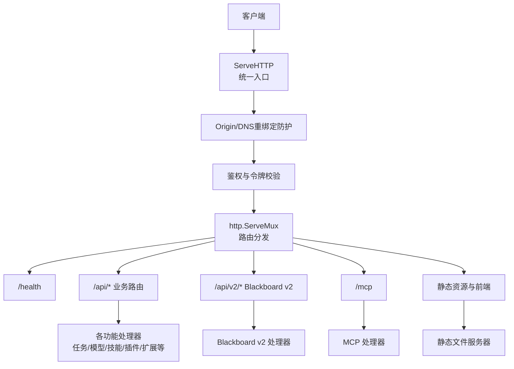
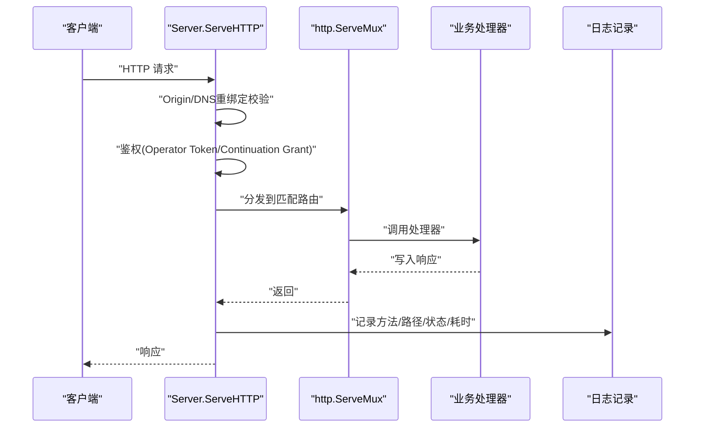
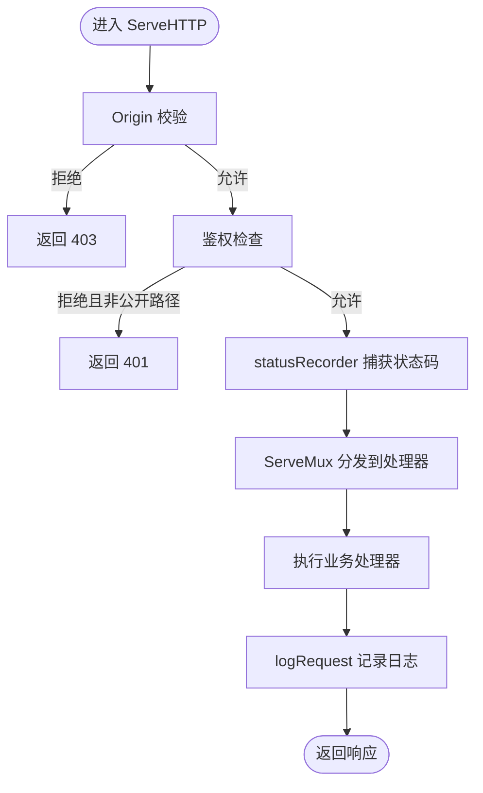
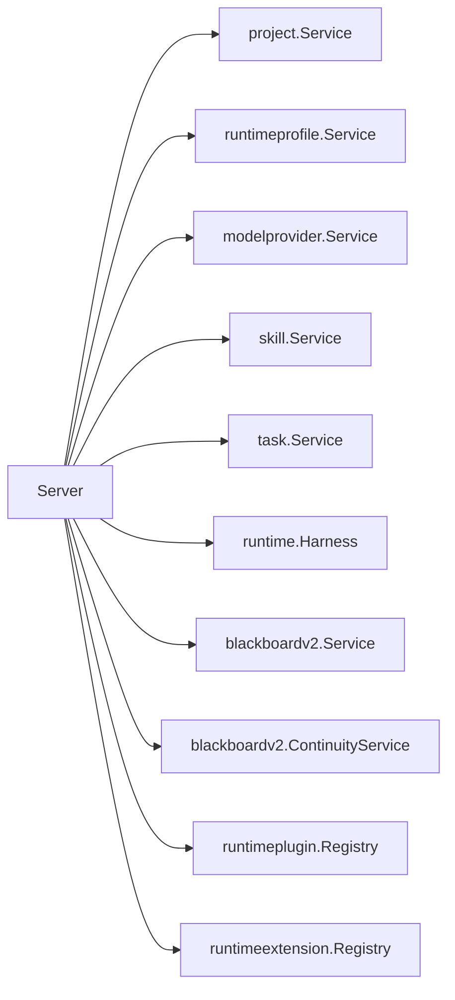

# 中间件与路由

<cite>
**本文引用的文件**   
- [server.go](file://internal/daemon/server.go)
- [logging.go](file://internal/daemon/logging.go)
- [blackboard_v2_http.go](file://internal/daemon/blackboard_v2_http.go)
- [mcp_handlers.go](file://internal/daemon/mcp_handlers.go)
- [task_handlers.go](file://internal/daemon/task_handlers.go)
- [modelprovider_handlers.go](file://internal/daemon/modelprovider_handlers.go)
- [runtime_plugin_handlers.go](file://internal/daemon/runtime_plugin_handlers.go)
- [runtime_extension_handlers.go](file://internal/daemon/runtime_extension_handlers.go)
- [skill_handlers.go](file://internal/daemon/skill_handlers.go)
- [launch_handlers.go](file://internal/daemon/launch_handlers.go)
- [openapi.json](file://internal/blackboardv2contract/contractdata/openapi.json)
- [logging_test.go](file://internal/daemon/logging_test.go)
</cite>

## 目录
1. [简介](#简介)
2. [项目结构](#项目结构)
3. [核心组件](#核心组件)
4. [架构总览](#架构总览)
5. [详细组件分析](#详细组件分析)
6. [依赖关系分析](#依赖关系分析)
7. [性能考量](#性能考量)
8. [故障排查指南](#故障排查指南)
9. [结论](#结论)
10. [附录](#附录)

## 简介
本文件聚焦于 HTTP 服务器的中间件链设计与路由组织，覆盖请求日志记录、请求体解析、响应时间统计、错误处理、路径参数提取、查询参数校验、健康检查端点、版本与元数据接口等。同时给出中间件开发指南、自定义中间件示例、性能监控集成建议以及路由调试与请求追踪最佳实践。

## 项目结构
HTTP 服务由守护进程（Daemon）提供，入口为统一的 ServeHTTP，内部通过 http.ServeMux 注册大量 REST 路由，并在进入具体处理器之前执行安全与鉴权前置逻辑；在处理器返回后统一记录结构化请求日志并输出耗时。

图示来源
- [server.go:587-643](file://internal/daemon/server.go#L587-L643)
- [server.go:383-411](file://internal/daemon/server.go#L383-L411)

章节来源
- [server.go:383-411](file://internal/daemon/server.go#L383-L411)
- [server.go:587-643](file://internal/daemon/server.go#L587-L643)

## 核心组件
- 统一入口与中间件链：在 ServeHTTP 中完成 Origin 校验、鉴权、状态码捕获与请求日志记录。
- 路由注册：routes() 集中注册所有 /api、/api/v2、/mcp 与静态资源路由。
- 健康检查：/health 暴露版本、数据库、MCP、Runner 配置等元信息。
- 请求日志：logRequest 输出方法、路径、状态码与耗时，并对高频轮询 GET 进行降噪。
- 错误处理：writeError 统一返回 JSON 错误体；部分子模块（如 Blackboard v2、Project Interface）拥有自己的结构化错误格式。

章节来源
- [server.go:383-411](file://internal/daemon/server.go#L383-L411)
- [server.go:587-643](file://internal/daemon/server.go#L587-L643)
- [server.go:645-674](file://internal/daemon/server.go#L645-L674)
- [logging.go:76-87](file://internal/daemon/logging.go#L76-L87)

## 架构总览
下图展示一次典型请求从进入守护进程到落库或调用外部运行时服务的完整链路，包括中间件与安全策略、路由分发、处理器职责与响应回写。

图示来源
- [server.go:383-411](file://internal/daemon/server.go#L383-L411)
- [server.go:587-643](file://internal/daemon/server.go#L587-L643)
- [logging.go:76-87](file://internal/daemon/logging.go#L76-L87)

## 详细组件分析

### 中间件链设计
- 请求日志记录与响应时间统计
  - 使用 statusRecorder 捕获处理器实际写入的状态码，避免重复 WriteHeader。
  - logRequest 输出结构化行，包含方法、路径、状态码与毫秒级耗时；对 UI 高频轮询的 GET 成功响应进行降噪。
- 请求体解析
  - 各处理器内使用标准库解码器解析 JSON 请求体，失败时返回 400。
- 错误处理
  - writeError 统一返回 JSON 错误体；部分子系统（如 Blackboard v2、Project Interface）定义更细粒度的错误信封与语义化错误码。
- 安全与鉴权
  - Origin 校验拒绝跨站/DNS 重绑定；非环回监听强制要求 Operator Token。
  - 支持 Authorization: Bearer 与 ?token= 两种形式；Blackboard v2/MCP 额外支持 Continuation Interface Grant。

图示来源
- [server.go:383-411](file://internal/daemon/server.go#L383-L411)
- [logging.go:47-87](file://internal/daemon/logging.go#L47-L87)

章节来源
- [server.go:383-411](file://internal/daemon/server.go#L383-L411)
- [logging.go:47-87](file://internal/daemon/logging.go#L47-L87)

### 路由组织策略
- 路由注册位置：routes() 集中声明所有路由，便于审计与维护。
- 命名空间划分
  - /health：健康检查与元数据
  - /api/*：项目管理、运行期配置、模型提供者、技能、凭据绑定、任务控制等
  - /api/v2/*：Blackboard v2 语义系统接口
  - /mcp：MCP Server 入口
  - 静态资源：SPA 构建产物与图标等
- 路径参数提取：使用 Go 1.22+ 的路由语法 {id}，处理器通过 request.PathValue("id") 获取。
- 查询参数：鉴权支持 ?token=；其他查询参数由各处理器自行解析与校验。

章节来源
- [server.go:587-643](file://internal/daemon/server.go#L587-L643)
- [server.go:717-735](file://internal/daemon/server.go#L717-L735)

### 请求上下文传递、依赖注入与服务定位器
- 依赖注入
  - Server 构造时将 DB、Service、Registry、Harness 等依赖以字段形式注入，处理器通过 server.* 访问。
- 服务定位器模式
  - 未实现全局服务定位器；依赖均通过 Server 实例显式传递，降低隐式耦合。
- 请求上下文
  - 使用标准库 context.Context 贯穿请求生命周期；当前中间件层不向 Context 注入额外键值，如需可基于现有模式扩展。

章节来源
- [server.go:83-118](file://internal/daemon/server.go#L83-L118)
- [server.go:120-248](file://internal/daemon/server.go#L120-L248)

### 健康检查、版本与元数据接口
- /health 返回版本、数据库状态、MCP 路径、Runner 运行时根目录、沙箱镜像与容器 CLI 等信息。
- 该端点对鉴权开放（publicPath），供编排系统与探针使用。

章节来源
- [server.go:645-674](file://internal/daemon/server.go#L645-L674)
- [server.go:463-488](file://internal/daemon/server.go#L463-L488)

### Blackboard v2 路由与错误契约
- 路由注册：registerBlackboardV2Routes() 将 /api/v2/projects/{project_id}/... 挂载至对应处理器。
- 错误契约：OpenAPI 定义了 BadRequest、Unauthenticated、Forbidden、NotFound、Conflict、Unprocessable、InternalError、Unavailable 等响应信封，其中 Unauthenticated 不携带同步状态。
- 认证：除 Operator Token 外，还支持 Project Interface 的 Continuation Grant（仅 Blackboard v2/MCP）。

章节来源
- [server.go:640-643](file://internal/daemon/server.go#L640-L643)
- [openapi.json:427-456](file://internal/blackboardv2contract/contractdata/openapi.json#L427-L456)
- [openapi.json:829-873](file://internal/blackboardv2contract/contractdata/openapi.json#L829-L873)

### 处理器分组与职责
- 任务处理器：任务创建、列表、详情、事件、转录、时间线、停止/结束/恢复、权限响应等。
- 模型提供者处理器：CRUD、刷新模型列表。
- 运行时插件/扩展处理器：列出、获取、目录浏览。
- 技能处理器：导入、CRUD、按 Profile 选择/取消选择。
- 启动相关处理器：预检、仪表板、凭据绑定等。

章节来源
- [task_handlers.go](file://internal/daemon/task_handlers.go)
- [modelprovider_handlers.go](file://internal/daemon/modelprovider_handlers.go)
- [runtime_plugin_handlers.go](file://internal/daemon/runtime_plugin_handlers.go)
- [runtime_extension_handlers.go](file://internal/daemon/runtime_extension_handlers.go)
- [skill_handlers.go](file://internal/daemon/skill_handlers.go)
- [launch_handlers.go](file://internal/daemon/launch_handlers.go)

### 中间件开发指南与自定义示例
- 开发要点
  - 在 ServeHTTP 之后、Mux 之前插入通用逻辑（如计时、指标上报、限流、审计）。
  - 使用类似 statusRecorder 的方式捕获最终状态码，避免干扰处理器行为。
  - 对高频轮询路径做降噪，避免日志风暴。
- 自定义中间件示例（思路）
  - 新增一个包装函数，接收下一个 http.Handler，记录开始时间、调用下游、捕获状态码、计算耗时并上报指标。
  - 在 routes() 前将新中间件包裹到 mux 或直接替换为带中间件的包装器。
  - 若需读取/写入请求上下文，使用 context.WithValue/FromContext 在处理器侧取值。

[本节为概念性指导，不直接分析具体代码文件]

### 请求追踪与调试工具
- 结构化日志：每条请求一行，包含方法、路径、状态码与耗时，便于聚合与分析。
- 降噪策略：UI 高频轮询的 GET 成功响应被抑制，错误仍记录。
- 建议增强
  - 引入请求 ID（X-Request-Id）贯穿日志与指标，便于跨服务关联。
  - 增加采样率与分级日志（debug/info/warn/error），结合指标系统（Prometheus）输出延迟分位。
  - 对关键路径（任务启动、黑板写入）追加阶段日志，辅助定位长尾问题。

章节来源
- [logging.go:16-45](file://internal/daemon/logging.go#L16-L45)
- [logging.go:76-87](file://internal/daemon/logging.go#L76-L87)

## 依赖关系分析
- 组件耦合
  - Server 持有多个 Service/Registry/Harness，处理器通过 server.* 访问，形成“单例注入”风格。
  - 路由与处理器解耦清晰，新增路由只需在 routes() 注册并实现处理器。
- 外部依赖
  - 数据库、运行时（Docker/Podman）、模型提供者、技能包、插件与扩展均以服务形式注入。
- 潜在循环依赖
  - 当前未见循环引用；各 Service 之间通过 Server 组合而非互相引用。

图示来源
- [server.go:83-118](file://internal/daemon/server.go#L83-L118)
- [server.go:120-248](file://internal/daemon/server.go#L120-L248)

章节来源
- [server.go:83-118](file://internal/daemon/server.go#L83-L118)
- [server.go:120-248](file://internal/daemon/server.go#L120-L248)

## 性能考量
- 日志开销
  - 结构化日志每请求一行，已对高频轮询 GET 降噪；生产环境建议异步写入与采样。
- 鉴权成本
  - 常量时间比较与简单字符串匹配，开销极低；Continuation Grant 解析仅在特定路由生效。
- 路由匹配
  - 使用标准库 ServeMux，路径参数解析高效；可按需引入前缀分组减少匹配分支。
- I/O 与并发
  - 处理器多涉及数据库与外部运行时调用，应关注超时、重试与熔断策略。

[本节为通用指导，不直接分析具体代码文件]

## 故障排查指南
- 常见问题
  - 401/403：检查 Origin 是否被拒绝、Token 是否正确、是否为公共路径。
  - 404：确认路径是否存在、路径参数是否缺失。
  - 400：JSON 解析失败或参数校验不通过。
  - 5xx：查看服务端日志与下游依赖状态。
- 诊断步骤
  - 查看结构化日志中的方法与状态码，定位慢请求与异常路径。
  - 针对 Blackboard v2，参考 OpenAPI 错误信封，区分认证失败与业务冲突。
  - 使用 /health 快速验证服务可用性与配置项。

章节来源
- [server.go:383-411](file://internal/daemon/server.go#L383-L411)
- [openapi.json:427-456](file://internal/blackboardv2contract/contractdata/openapi.json#L427-L456)
- [openapi.json:829-873](file://internal/blackboardv2contract/contractdata/openapi.json#L829-L873)
- [server.go:645-674](file://internal/daemon/server.go#L645-L674)

## 结论
本项目的 HTTP 服务采用“统一入口 + 轻量中间件 + 集中路由”的设计，兼顾安全性、可观测性与可扩展性。通过清晰的依赖注入与模块化处理器，新增能力成本低、维护性好。建议在现有基础上补充请求 ID、指标采集与采样策略，进一步提升生产环境的可观测性与稳定性。

[本节为总结性内容，不直接分析具体代码文件]

## 附录

### 关键端点一览（节选）
- /health：健康检查与元数据
- /api/projects*：项目管理
- /api/runtime-profiles*：运行期配置
- /api/model-providers*：模型提供者管理
- /api/skills*：技能管理
- /api/credential-bindings*：凭据绑定
- /api/projects/{id}/tasks*：任务控制
- /api/v2/projects/{project_id}/blackboard/*：Blackboard v2 语义接口
- /mcp：MCP Server

章节来源
- [server.go:587-643](file://internal/daemon/server.go#L587-L643)

### 测试与验证参考
- 请求日志中间件验证：确保每请求输出一行结构化日志，包含方法、路径、状态码与耗时。
- 错误状态捕获：验证非 2xx 响应也能被正确记录。

章节来源
- [logging_test.go:14-49](file://internal/daemon/logging_test.go#L14-L49)
- [logging_test.go:51-78](file://internal/daemon/logging_test.go#L51-L78)