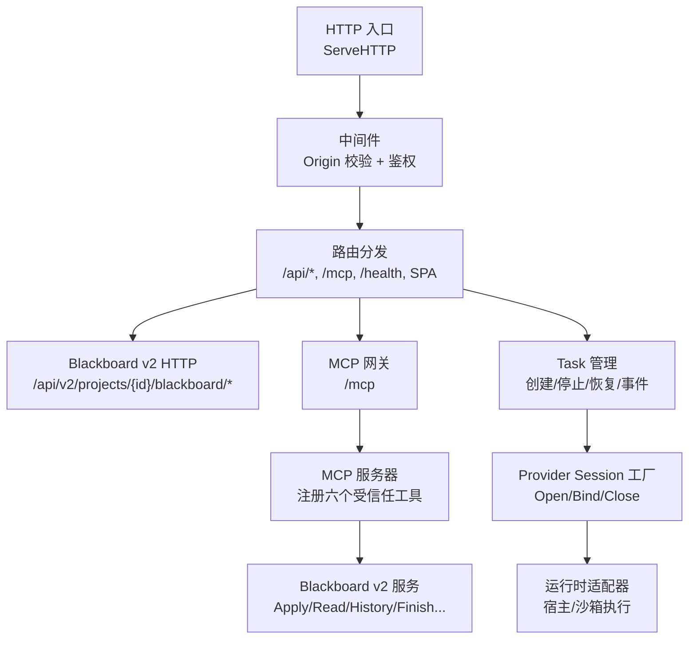
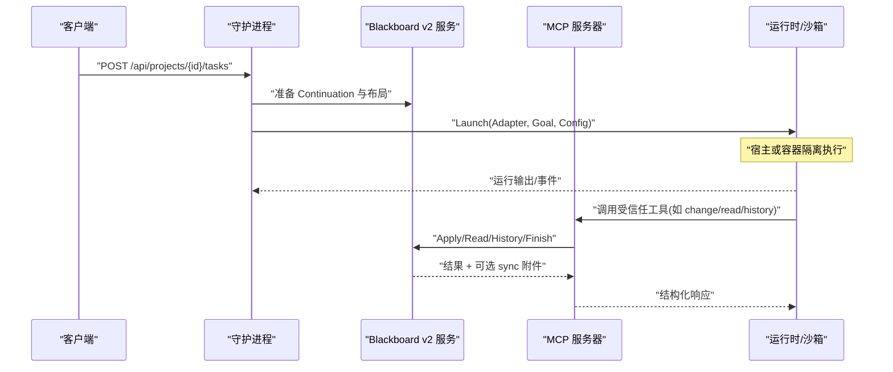
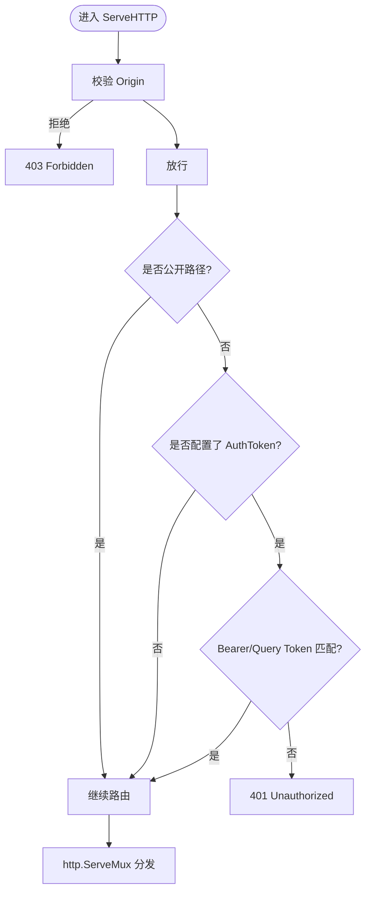
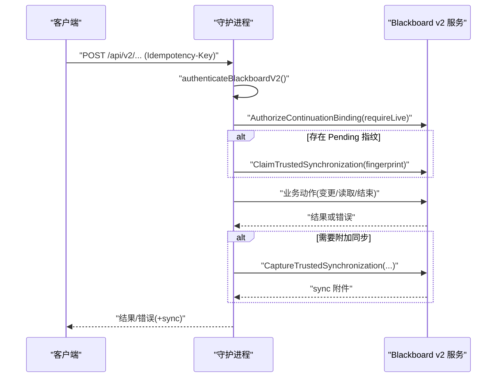
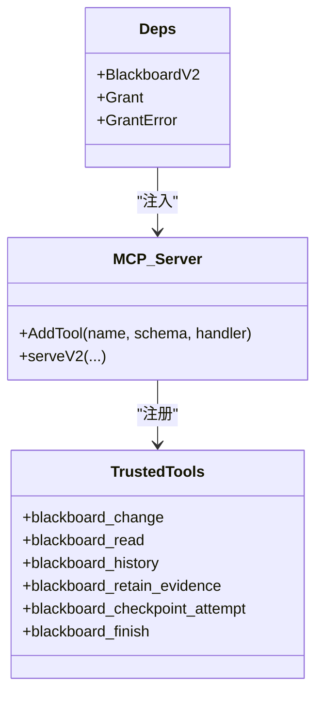
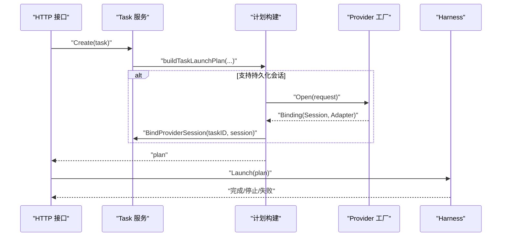
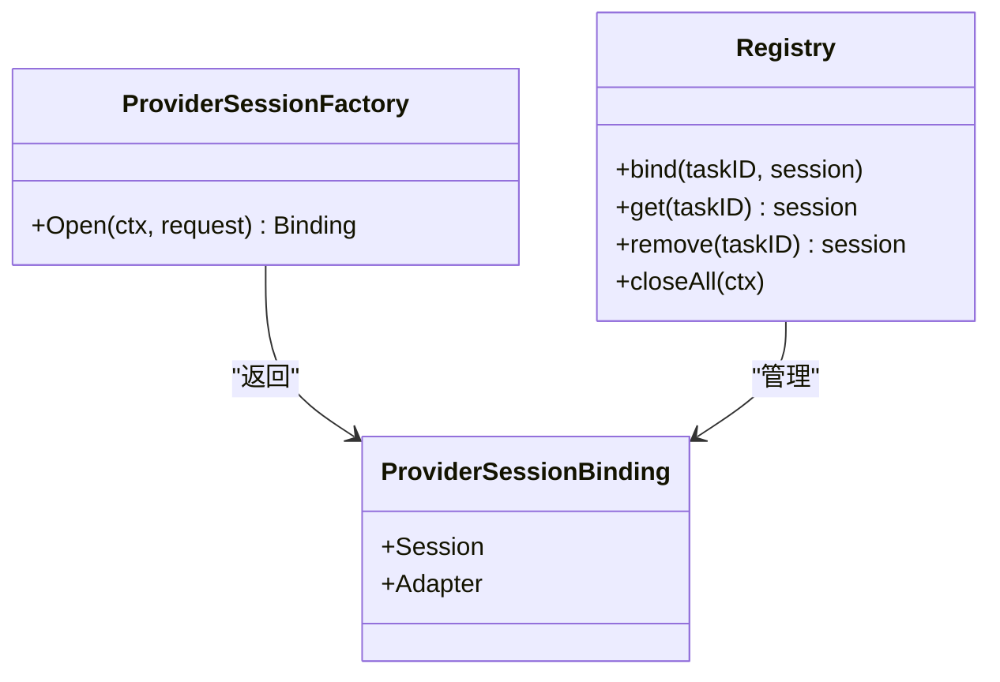
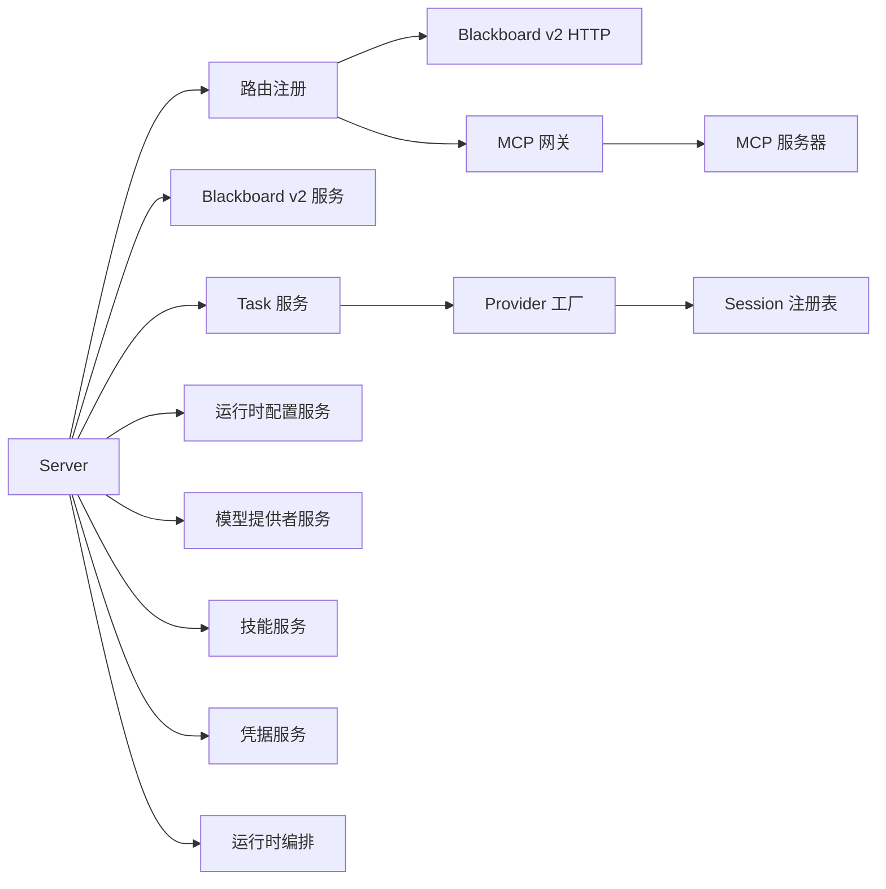

# 守护进程服务

<cite>
**本文引用的文件**   
- [internal/daemon/server.go](file://internal/daemon/server.go)
- [internal/daemon/mcp_handlers.go](file://internal/daemon/mcp_handlers.go)
- [internal/daemon/task_handlers.go](file://internal/daemon/task_handlers.go)
- [internal/daemon/provider_session_factory.go](file://internal/daemon/provider_session_factory.go)
- [internal/daemon/provider_session_control.go](file://internal/daemon/provider_session_control.go)
- [internal/daemon/blackboard_v2_http.go](file://internal/daemon/blackboard_v2_http.go)
- [internal/mcpserver/v2.go](file://internal/mcpserver/v2.go)
- [internal/blackboardv2contract/contractdata/trusted-tools.json](file://internal/blackboardv2contract/contractdata/trusted-tools.json)
- [internal/blackboardv2contract/contract.go](file://internal/blackboardv2contract/contract.go)
- [internal/runner/blackboard_v2.go](file://internal/runner/blackboard_v2.go)
</cite>

## 目录
1. [简介](#简介)
2. [项目结构](#项目结构)
3. [核心组件](#核心组件)
4. [架构总览](#架构总览)
5. [详细组件分析](#详细组件分析)
6. [依赖关系分析](#依赖关系分析)
7. [性能考虑](#性能考虑)
8. [故障排查指南](#故障排查指南)
9. [结论](#结论)
10. [附录：API端点参考](#附录api端点参考)

## 简介
本文件面向守护进程服务的实现与使用，重点覆盖以下方面：
- HTTP API 设计、路由组织与中间件处理
- 认证授权机制（操作者令牌、Continuation Interface Grant）
- MCP Server 实现与六个 Blackboard v2 语义工具
- Task 启动与生命周期管理
- Provider Session 工厂模式与安全控制
- API 端点参考、请求响应格式、错误处理与性能优化建议

## 项目结构
守护进程服务位于 internal/daemon 包，提供统一的 HTTP 入口、MCP 网关、Task 编排、Provider Session 管理与 Blackboard v2 的 HTTP/MCP 双通道。关键文件职责如下：
- server.go：Server 构造、全局中间件（Origin 校验、鉴权）、路由注册、健康检查
- blackboard_v2_http.go：Blackboard v2 HTTP 路由与统一鉴权/同步附件封装
- mcp_handlers.go：MCP 流式 HTTP 处理器注册与 Continuation Grant 注入
- task_handlers.go：Task 创建、计划构建、后台启动、恢复与事件记录
- provider_session_factory.go：持久化 Provider Session 工厂接口与绑定约束
- provider_session_control.go：Session 注册表、事件透传、原生引导控制
- mcpserver/v2.go：MCP 服务端与六个受信任工具的注册、参数校验、同步附件
- blackboardv2contract/*：契约定义、工具清单、JSON Schema 验证与夹具

图示来源
- [internal/daemon/server.go:383-411](file://internal/daemon/server.go#L383-L411)
- [internal/daemon/blackboard_v2_http.go:29-46](file://internal/daemon/blackboard_v2_http.go#L29-L46)
- [internal/daemon/mcp_handlers.go:14-43](file://internal/daemon/mcp_handlers.go#L14-L43)
- [internal/mcpserver/v2.go:34-44](file://internal/mcpserver/v2.go#L34-L44)
- [internal/daemon/task_handlers.go:73-167](file://internal/daemon/task_handlers.go#L73-L167)
- [internal/daemon/provider_session_factory.go:35-41](file://internal/daemon/provider_session_factory.go#L35-L41)

章节来源
- [internal/daemon/server.go:38-118](file://internal/daemon/server.go#L38-L118)
- [internal/daemon/server.go:587-643](file://internal/daemon/server.go#L587-L643)

## 核心组件
- Server 与中间件
  - ServeHTTP 前置 Origin 校验与静态资源放行；当配置了 AuthToken 时，对非公开路径进行 Bearer/token 校验；支持 Continuation Interface Grant 在特定通道内作为窄权限凭证。
  - routes() 集中注册所有 REST 路由、Blackboard v2 路由、MCP 与 SPA 静态资源。
- Blackboard v2 HTTP
  - 统一鉴权 authenticateBlackboardV2：区分操作者直连与受限 Continuation 调用；强制 Idempotency-Key；可选同步附件（sync）。
  - serveBlackboardV2Result 负责授权绑定、Pending 认领、错误映射、ETag/If-None-Match 条件响应。
- MCP Server
  - registerMCP 将 /mcp 暴露为无状态流式 HTTP 端点，按请求解析 Continuation Grant 并注入到 MCP 服务器上下文。
  - v2.go 基于冻结契约加载六个受信任工具，严格校验输入 JSON Schema，返回结构化错误与可选 sync 附件。
- Task 与 Provider Session
  - handleCreateTask 完成预检、默认值填充、Plan 构建、持久化 Continuation、可选持久化 Provider Session 打开与绑定，随后后台 Launch。
  - ProviderSessionFactory 接口用于打开或复用任务级会话；validateProviderSessionBinding 确保返回有效身份与 Adapter。
  - providerSessionRegistry 维护内存中的 Task->Session 映射，支持关闭、事件透传与重试冲突处理。

章节来源
- [internal/daemon/server.go:383-461](file://internal/daemon/server.go#L383-L461)
- [internal/daemon/server.go:587-643](file://internal/daemon/server.go#L587-L643)
- [internal/daemon/blackboard_v2_http.go:52-95](file://internal/daemon/blackboard_v2_http.go#L52-L95)
- [internal/daemon/blackboard_v2_http.go:368-438](file://internal/daemon/blackboard_v2_http.go#L368-L438)
- [internal/daemon/mcp_handlers.go:14-43](file://internal/daemon/mcp_handlers.go#L14-L43)
- [internal/mcpserver/v2.go:34-44](file://internal/mcpserver/v2.go#L34-L44)
- [internal/daemon/task_handlers.go:73-167](file://internal/daemon/task_handlers.go#L73-L167)
- [internal/daemon/provider_session_factory.go:35-91](file://internal/daemon/provider_session_factory.go#L35-L91)
- [internal/daemon/provider_session_control.go:18-93](file://internal/daemon/provider_session_control.go#L18-L93)

## 架构总览
守护进程作为控制平面，协调数据面（Blackboard v2）、执行面（Runtime/Sandbox）与外部客户端（Web UI、CLI、Sandboxed Runtimes）。

图示来源
- [internal/daemon/task_handlers.go:196-285](file://internal/daemon/task_handlers.go#L196-L285)
- [internal/mcpserver/v2.go:194-248](file://internal/mcpserver/v2.go#L194-L248)
- [internal/daemon/blackboard_v2_http.go:368-438](file://internal/daemon/blackboard_v2_http.go#L368-L438)

## 详细组件分析

### HTTP 路由与中间件
- 全局中间件
  - Origin 校验：拒绝跨站/DNS Rebinding 请求；允许本地回环与 host.docker.internal。
  - 鉴权：支持 Authorization: Bearer 与 ?token= 查询参数；MCP 与 Blackboard v2 额外接受 Continuation Interface Grant。
  - 公开路径：/health、CORS preflight、SPA 静态资源 GET。
- 路由组织
  - /api/*：项目管理、模型提供者、技能、凭据绑定、任务等
  - /api/v2/projects/{id}/blackboard/*：Blackboard v2 语义接口
  - /mcp：MCP 流式 HTTP 端点
  - SPA 静态资源：/、/index.html、/assets/*

图示来源
- [internal/daemon/server.go:383-411](file://internal/daemon/server.go#L383-L411)
- [internal/daemon/server.go:467-501](file://internal/daemon/server.go#L467-L501)
- [internal/daemon/server.go:518-534](file://internal/daemon/server.go#L518-L534)
- [internal/daemon/server.go:587-643](file://internal/daemon/server.go#L587-L643)

章节来源
- [internal/daemon/server.go:383-461](file://internal/daemon/server.go#L383-L461)
- [internal/daemon/server.go:587-643](file://internal/daemon/server.go#L587-L643)

### Blackboard v2 HTTP 接口
- 鉴权与权限
  - 操作者直连：当未携带 Continuation 令牌且未配置 daemon token 时，仅允许读类能力；需要 Continuation 的能力必须携带有效的 Continuation Interface Grant。
  - 连续体绑定：AuthorizeContinuationBinding 校验 Project/Task/Continuation 绑定与 live/closed 访问策略。
- 幂等与同步
  - POST 要求 Idempotency-Key；根据路径生成 fingerprint；Pending 认领后保证精确重放。
  - 成功/失败均可附带 sync 附件，包含 revision 与完整 Runtime Snapshot，供下游拉取增量。
- 条件响应
  - 部分 GET 接口支持 ETag/If-None-Match，返回 304 或带 body 的 200（存在 sync 附件时不返回 304）。
- 错误映射
  - 将内部错误映射为结构化 errorEnvelope，含 code/message/path/retryable/details；数据库忙返回 503 并提示 Retry-After。

图示来源
- [internal/daemon/blackboard_v2_http.go:52-95](file://internal/daemon/blackboard_v2_http.go#L52-L95)
- [internal/daemon/blackboard_v2_http.go:368-438](file://internal/daemon/blackboard_v2_http.go#L368-L438)
- [internal/daemon/blackboard_v2_http.go:440-471](file://internal/daemon/blackboard_v2_http.go#L440-L471)
- [internal/daemon/blackboard_v2_http.go:515-562](file://internal/daemon/blackboard_v2_http.go#L515-L562)

章节来源
- [internal/daemon/blackboard_v2_http.go:29-46](file://internal/daemon/blackboard_v2_http.go#L29-L46)
- [internal/daemon/blackboard_v2_http.go:52-95](file://internal/daemon/blackboard_v2_http.go#L52-L95)
- [internal/daemon/blackboard_v2_http.go:368-438](file://internal/daemon/blackboard_v2_http.go#L368-L438)
- [internal/daemon/blackboard_v2_http.go:440-471](file://internal/daemon/blackboard_v2_http.go#L440-L471)
- [internal/daemon/blackboard_v2_http.go:515-562](file://internal/daemon/blackboard_v2_http.go#L515-L562)

### MCP Server 与六个受信任工具
- 端点与传输
  - /mcp 以无状态流式 HTTP 暴露；禁用 localhost 保护以允许 host.docker.internal 访问；支持 query token 兼容无法设置头的运行时。
- 工具清单与契约
  - 通过 frozen contract 加载六个受信任工具名称、描述、输入/输出 Schema，并在 tools/list 中只暴露最小必要 $defs。
  - 工具列表：blackboard_change、blackboard_read、blackboard_history、blackboard_retain_evidence、blackboard_checkpoint_attempt、blackboard_finish。
- 参数校验与错误
  - 使用 Harness.Validate 对 raw arguments 做严格 JSON Schema 校验，失败返回 invalid_schema 信封。
- 同步附件
  - 可变工具支持 requestFingerprint 与 Pending 认领；成功后可附带 sync 附件，失败亦可附带以便下次重试拉取最新快照。

图示来源
- [internal/mcpserver/v2.go:19-44](file://internal/mcpserver/v2.go#L19-L44)
- [internal/mcpserver/v2.go:46-156](file://internal/mcpserver/v2.go#L46-L156)
- [internal/blackboardv2contract/contractdata/trusted-tools.json:1-44](file://internal/blackboardv2contract/contractdata/trusted-tools.json#L1-L44)
- [internal/blackboardv2contract/contract.go:252-290](file://internal/blackboardv2contract/contract.go#L252-L290)

章节来源
- [internal/daemon/mcp_handlers.go:14-43](file://internal/daemon/mcp_handlers.go#L14-L43)
- [internal/mcpserver/v2.go:34-44](file://internal/mcpserver/v2.go#L34-L44)
- [internal/mcpserver/v2.go:46-156](file://internal/mcpserver/v2.go#L46-L156)
- [internal/blackboardv2contract/contractdata/trusted-tools.json:1-44](file://internal/blackboardv2contract/contractdata/trusted-tools.json#L1-L44)
- [internal/blackboardv2contract/contract.go:252-290](file://internal/blackboardv2contract/contract.go#L252-L290)

### Task 启动与生命周期管理
- 创建流程
  - 解析输入、应用项目默认值、预检（preflight）、激活校验、持久化 Task、构建 Launch Plan、后台 Launch。
- 计划构建
  - 针对 Blackboard v2 支持 Provider 的路径，准备 Layout、Skill Bundles、Model 快照、Credential 材料、RuntimeConfig 投影与 MCP 配置路径。
  - 对于 Codex/Claude/Pi 等 Provider，决定是否使用可信 MCP 与 Continuation Grant。
- 持久化 Provider Session
  - 若支持且已配置工厂，则 Open 并 Bind 会话，必要时设置初始 Turn Selection；失败则标记 Continuation/Task 为失败并记录诊断事件。
- 恢复与清理
  - 重启后 reconcileInterruptedTasks 清理孤儿进程/容器，记录中断事件；recoverBlackboardV2ContinuationFiles 重建工作快照与上下文文件。

图示来源
- [internal/daemon/task_handlers.go:73-167](file://internal/daemon/task_handlers.go#L73-L167)
- [internal/daemon/task_handlers.go:196-285](file://internal/daemon/task_handlers.go#L196-L285)
- [internal/daemon/task_handlers.go:522-592](file://internal/daemon/task_handlers.go#L522-L592)
- [internal/daemon/provider_session_factory.go:35-91](file://internal/daemon/provider_session_factory.go#L35-L91)

章节来源
- [internal/daemon/task_handlers.go:73-167](file://internal/daemon/task_handlers.go#L73-L167)
- [internal/daemon/task_handlers.go:196-285](file://internal/daemon/task_handlers.go#L196-L285)
- [internal/daemon/task_handlers.go:522-592](file://internal/daemon/task_handlers.go#L522-L592)
- [internal/daemon/provider_session_factory.go:35-91](file://internal/daemon/provider_session_factory.go#L35-L91)

### Provider Session 工厂模式与安全控制
- 工厂接口
  - Open(context, request) 返回 Binding{Session, Adapter}；同一 Task 的后续 Continuation 应复用相同会话。
- 绑定与校验
  - validateProviderSessionBinding 要求 SessionID 非空且 Adapter 非空；BindProviderSession 将事件回调接入 Task 事件总线。
- 安全边界
  - 工厂/桥接细节不出现在 HTTP 错误与持久化事件中；仅保留必要的 correlation 字段，避免泄露敏感协议帧。
- 原生引导控制
  - 根据插件能力选择 InTurnSteer 或 InterruptThenReplace 模式，并通过事件轮询等待 outcome/session_id。

图示来源
- [internal/daemon/provider_session_factory.go:35-91](file://internal/daemon/provider_session_factory.go#L35-L91)
- [internal/daemon/provider_session_control.go:18-93](file://internal/daemon/provider_session_control.go#L18-L93)
- [internal/daemon/provider_session_control.go:95-147](file://internal/daemon/provider_session_control.go#L95-L147)

章节来源
- [internal/daemon/provider_session_factory.go:35-91](file://internal/daemon/provider_session_factory.go#L35-L91)
- [internal/daemon/provider_session_control.go:18-93](file://internal/daemon/provider_session_control.go#L18-L93)
- [internal/daemon/provider_session_control.go:95-147](file://internal/daemon/provider_session_control.go#L95-L147)

### 认证授权机制
- 操作者令牌
  - 支持 Authorization: Bearer 与 ?token=；非 loopback 绑定必须配置令牌。
- Continuation Interface Grant
  - 仅在 Blackboard v2 HTTP 与 MCP 通道生效；按 Project/Task/Continuation 粒度授权；支持 revoke 与 read-only 限制。
- Origin 防护
  - 拒绝非回环 Origin；允许 host.docker.internal 与监听地址同源。

章节来源
- [internal/daemon/server.go:431-461](file://internal/daemon/server.go#L431-L461)
- [internal/daemon/server.go:518-534](file://internal/daemon/server.go#L518-L534)
- [internal/daemon/blackboard_v2_http.go:52-95](file://internal/daemon/blackboard_v2_http.go#L52-L95)

## 依赖关系分析
- 组件耦合
  - Server 聚合 store/project/profiles/modelproviders/skills/creds/tasks/harness/blackboardv2 等子系统；routes() 集中装配。
  - Blackboard v2 HTTP 与 MCP 共享同一领域服务与授权模型，但传输层不同。
  - Task 启动强依赖 Runner/Adapter 与 Provider Session 工厂；黑盒化底层协议细节。
- 外部依赖
  - MCP SDK 提供流式 HTTP 处理器；JSON Schema 校验来自 google/jsonschema-go。
  - 运行时通过 Docker/Podman CLI 或宿主进程执行。

图示来源
- [internal/daemon/server.go:83-118](file://internal/daemon/server.go#L83-L118)
- [internal/daemon/server.go:587-643](file://internal/daemon/server.go#L587-L643)
- [internal/daemon/mcp_handlers.go:14-43](file://internal/daemon/mcp_handlers.go#L14-L43)
- [internal/daemon/provider_session_control.go:18-93](file://internal/daemon/provider_session_control.go#L18-L93)

章节来源
- [internal/daemon/server.go:83-118](file://internal/daemon/server.go#L83-L118)
- [internal/daemon/server.go:587-643](file://internal/daemon/server.go#L587-L643)

## 性能考虑
- 请求体限制
  - Blackboard v2 HTTP 限制 4 MiB，防止大体积负载阻塞。
- 条件响应
  - 支持 ETag/If-None-Match，减少重复数据传输。
- 幂等与同步
  - 通过 Idempotency-Key 与 Pending 认领降低重试风暴；sync 附件一次性下发完整快照，避免多次拉取。
- 并发与锁
  - SQLite 写锁繁忙时返回 503 并提示 Retry-After，客户端应退避重试。
- 静态资源
  - SPA 静态资源 GET 免鉴权，减少鉴权开销。

[本节为通用指导，无需源码引用]

## 故障排查指南
- 常见错误码
  - invalid_schema：请求体或参数不符合契约；检查 JSON 结构与必填字段。
  - authority_denied：缺少或无效 Continuation Grant；确认令牌与 Project 匹配。
  - storage_busy：SQLite 写锁繁忙；稍后重试。
  - version_conflict/key_conflict/idempotency_conflict/finish_conflict：并发写入冲突；读取当前版本后重试。
  - closed_continuation：Continuation 已结束；不可再写入。
- 诊断要点
  - 查看 Task 事件日志中的 provider_session_setup_failed、interrupted、container_cleaned 等阶段。
  - 关注 sync 附件中的 reason/from_revision/revision 与 snapshot，用于定位知识漂移。
  - 检查 Origin 与 Host 头是否符合允许白名单。

章节来源
- [internal/daemon/blackboard_v2_http.go:515-562](file://internal/daemon/blackboard_v2_http.go#L515-L562)
- [internal/daemon/task_handlers.go:287-309](file://internal/daemon/task_handlers.go#L287-L309)

## 结论
守护进程服务通过严格的中间件与鉴权、稳定的 Blackboard v2 契约、可靠的 MCP 受信任工具与健壮的 Task/Provider Session 生命周期管理，提供了高可用、可扩展的渗透测试代理控制平面。建议在集成时遵循幂等与同步附件约定，合理处理 503 与冲突错误，并利用 ETag 优化带宽。

[本节为总结性内容，无需源码引用]

## 附录：API端点参考

- 健康检查
  - GET /health
  - 响应：包含版本、数据库状态、MCP 状态与路径、Runner 配置信息。

- 项目
  - GET /api/projects
  - POST /api/projects
  - GET /api/projects/{id}
  - PATCH /api/projects/{id}

- 运行时配置
  - POST /api/runtime-profiles
  - POST /api/runtime-profiles/resolve-launch
  - GET /api/runtime-profiles
  - GET /api/runtime-profiles/{id}
  - PATCH /api/runtime-profiles/{id}
  - POST /api/runtime-profiles/{id}/promote
  - DELETE /api/runtime-profiles/{id}
  - GET /api/runtime-profiles/{id}/model-provider-migration-preview
  - POST /api/runtime-profiles/{id}/model-provider-migration

- 模型提供者
  - GET /api/model-providers
  - POST /api/model-providers
  - GET /api/model-providers/{id}
  - PATCH /api/model-providers/{id}
  - DELETE /api/model-providers/{id}
  - POST /api/model-providers/{id}/refresh-models

- 运行时插件与扩展
  - GET /api/runtime-plugins
  - GET /api/runtime-plugins/{plugin_id}
  - GET /api/runtime-extensions
  - GET /api/runtime-extension-catalog
  - GET /api/runtime-extensions/{extension_id}

- 技能
  - GET /api/skills
  - POST /api/skills/import
  - GET /api/skills/{skill_id}
  - PUT /api/skills/{skill_id}
  - DELETE /api/skills/{skill_id}
  - PUT /api/skills/{skill_id}/profiles/{profile_id}/opt-out
  - DELETE /api/skills/{skill_id}/profiles/{profile_id}/opt-out

- 凭据绑定
  - PUT /api/credential-bindings
  - GET /api/credential-bindings
  - DELETE /api/credential-bindings/{binding_id}

- 项目凭据绑定
  - PUT /api/projects/{id}/credential-bindings
  - GET /api/projects/{id}/credential-bindings

- 预检与仪表盘
  - POST /api/projects/{id}/preflight
  - GET /api/projects/{id}/dashboard

- 任务
  - POST /api/projects/{id}/tasks
  - GET /api/projects/{id}/tasks
  - GET /api/projects/{id}/tasks/{task_id}
  - DELETE /api/projects/{id}/tasks/{task_id}
  - GET /api/projects/{id}/tasks/{task_id}/events
  - GET /api/projects/{id}/tasks/{task_id}/transcript
  - GET /api/projects/{id}/tasks/{task_id}/timeline
  - POST /api/projects/{id}/tasks/{task_id}/stop
  - POST /api/projects/{id}/tasks/{task_id}/finish
  - POST /api/projects/{id}/tasks/{task_id}/resume
  - POST /api/projects/{id}/tasks/{task_id}/steer/queue
  - POST /api/projects/{id}/tasks/{task_id}/steer
  - POST /api/projects/{id}/tasks/{task_id}/permissions/{permission_id}/respond

- Blackboard v2
  - POST /api/v2/projects/{id}/blackboard/changes
  - GET /api/v2/projects/{id}/blackboard/snapshot
  - GET /api/v2/projects/{id}/blackboard/health
  - GET /api/v2/projects/{id}/blackboard/records/{key}
  - GET /api/v2/projects/{id}/blackboard/records/{key}/history?cursor=&limit=
  - POST /api/v2/projects/{id}/blackboard/evidence:retain
  - POST /api/v2/projects/{id}/blackboard/attempts/{attempt_action}:checkpoint
  - POST /api/v2/projects/{id}/continuation:finish
  - GET /api/v2/projects/{id}/reports/pentest?format=markdown|json
  - GET /api/v2/projects/{id}/reports/ctf-solution?format=markdown|json

- MCP
  - POST /mcp?token=...

章节来源
- [internal/daemon/server.go:587-643](file://internal/daemon/server.go#L587-L643)
- [internal/daemon/blackboard_v2_http.go:29-46](file://internal/daemon/blackboard_v2_http.go#L29-L46)
- [internal/daemon/mcp_handlers.go:14-43](file://internal/daemon/mcp_handlers.go#L14-L43)