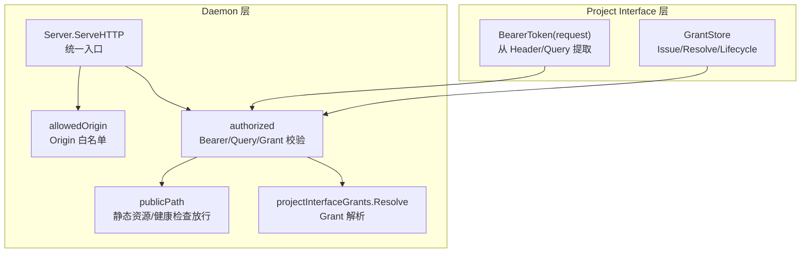
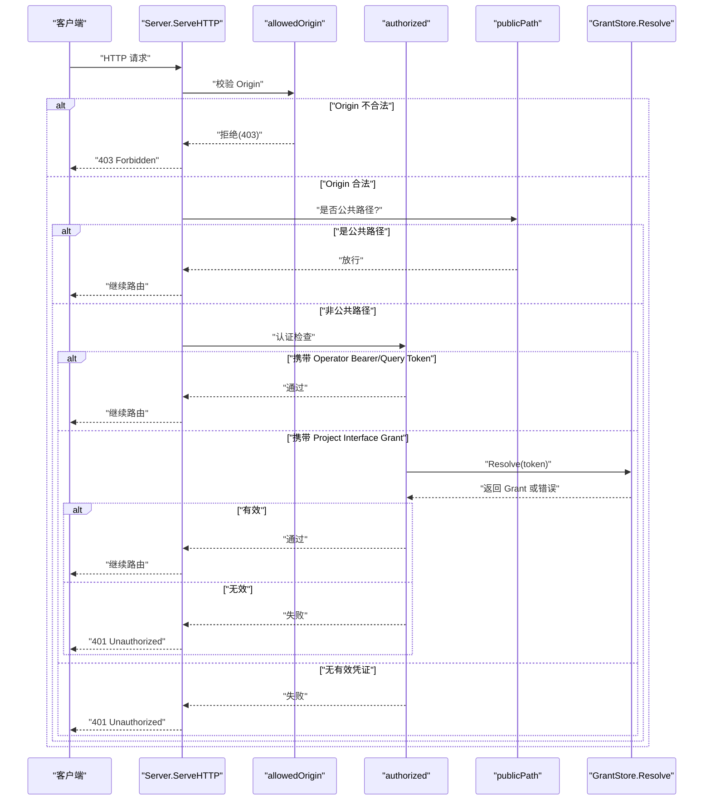
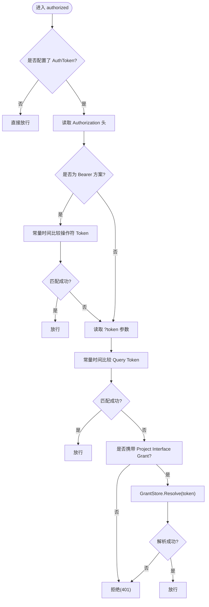
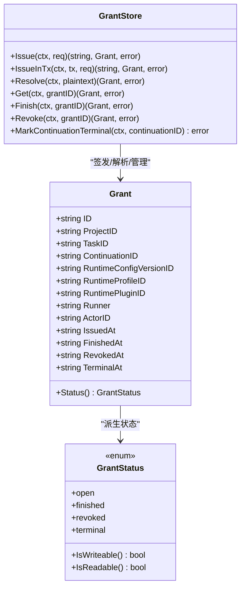
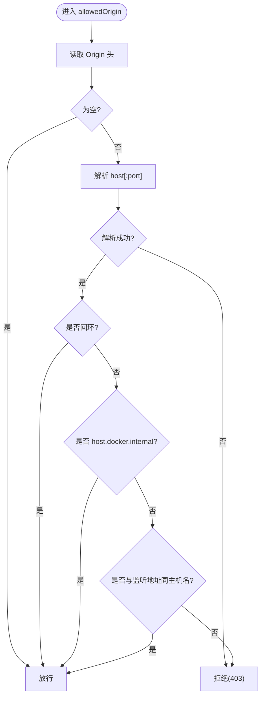
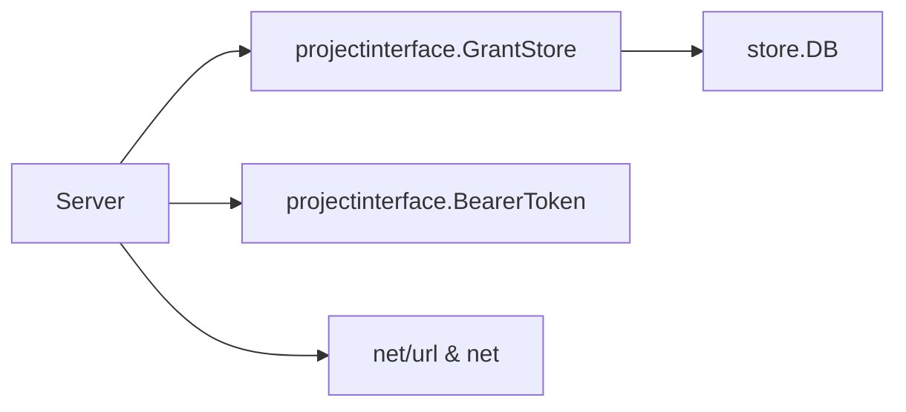

# 认证与授权

<cite>
**本文引用的文件**   
- [server.go](file://internal/daemon/server.go)
- [auth_test.go](file://internal/daemon/auth_test.go)
- [origin_guard_test.go](file://internal/daemon/origin_guard_test.go)
- [bearer.go](file://internal/projectinterface/bearer.go)
- [grant.go](file://internal/projectinterface/grant.go)
</cite>

## 目录
1. [简介](#简介)
2. [项目结构](#项目结构)
3. [核心组件](#核心组件)
4. [架构总览](#架构总览)
5. [详细组件分析](#详细组件分析)
6. [依赖关系分析](#依赖关系分析)
7. [性能考量](#性能考量)
8. [故障排查指南](#故障排查指南)
9. [结论](#结论)
10. [附录](#附录)

## 简介
本文件聚焦于 Daemon HTTP 服务层的认证与授权机制，覆盖以下主题：
- Bearer Token 认证流程与验证策略
- Project Interface 的权限模型（Grant、作用域、最小权限）
- Origin Guard 安全控制（来源 IP/域名校验与网络访问控制）
- 认证中间件实现原理、错误处理与性能优化
- 安全配置最佳实践、常见威胁防护与合规性建议
- 安全审计日志分析与入侵检测建议

## 项目结构
认证与授权相关代码主要分布在两个包：
- internal/daemon：HTTP 入口、请求路由、全局鉴权中间件、Origin 校验
- internal/projectinterface：Project Interface 的 Grant 生命周期与令牌解析

图表来源
- [server.go:383-461](file://internal/daemon/server.go#L383-L461)
- [bearer.go:12-21](file://internal/projectinterface/bearer.go#L12-L21)
- [grant.go:165-302](file://internal/projectinterface/grant.go#L165-L302)

章节来源
- [server.go:383-461](file://internal/daemon/server.go#L383-L461)
- [bearer.go:12-21](file://internal/projectinterface/bearer.go#L12-L21)
- [grant.go:165-302](file://internal/projectinterface/grant.go#L165-L302)

## 核心组件
- Server.ServeHTTP：统一入口，先执行 Origin 校验，再执行认证与公共路径放行，最后进入路由分发。
- authorized：支持三种凭证形式：
  - Authorization: Bearer <token>（与服务器配置的 AuthToken 比较）
  - 查询参数 token（用于沙箱 MCP 等无法设置头的场景）
  - Project Interface Grant（仅对 Blackboard v2 HTTP 和 /mcp 生效）
- publicPath：允许无需认证的 GET 静态资源与健康检查。
- allowedOrigin：拒绝非回环且非 host.docker.internal 的 Origin，防御 DNS Rebinding。
- projectinterface.BearerToken：从 Authorization 或 query 中提取 Continuation 能力令牌。
- projectinterface.GrantStore：签发、解析、关闭、撤销 Grant；以 SHA-256 存储令牌哈希，提供常量时间比较。

章节来源
- [server.go:383-461](file://internal/daemon/server.go#L383-L461)
- [server.go:467-501](file://internal/daemon/server.go#L467-L501)
- [server.go:518-534](file://internal/daemon/server.go#L518-L534)
- [bearer.go:12-21](file://internal/projectinterface/bearer.go#L12-L21)
- [grant.go:165-302](file://internal/projectinterface/grant.go#L165-L302)

## 架构总览
下图展示了单次请求在 Daemon 中的认证与授权路径，以及 Project Interface 的二次授权点。

图表来源
- [server.go:383-461](file://internal/daemon/server.go#L383-L461)
- [grant.go:284-302](file://internal/projectinterface/grant.go#L284-L302)

## 详细组件分析

### Bearer Token 认证流程与验证机制
- 支持的凭证来源
  - Authorization: Bearer <token>
  - 查询参数 token（兼容沙箱 MCP 传输）
- 对比策略
  - 使用常量时间比较避免时序侧信道
- 适用范围
  - 所有非公共 API 与 MCP 端点
  - Project Interface Grant 仅在 Blackboard v2 HTTP 与 /mcp 上被接受

图表来源
- [server.go:431-461](file://internal/daemon/server.go#L431-L461)
- [grant.go:284-302](file://internal/projectinterface/grant.go#L284-L302)

章节来源
- [server.go:431-461](file://internal/daemon/server.go#L431-L461)
- [auth_test.go:60-110](file://internal/daemon/auth_test.go#L60-L110)

### Project Interface 权限模型（Grant、作用域、最小权限）
- 令牌与存储
  - 签发时生成随机明文令牌，仅持久化其 SHA-256 哈希
  - 解析时使用常量时间比较，防止时序泄露
- 生命周期状态
  - open：可写
  - finished：不可写，但可读与幂等重放仍允许
  - revoked：完全拒绝
  - terminal：绑定 Continuation 终止后标记，后续语义变更由系统协调器负责
- 作用域绑定
  - 每个 Grant 绑定到具体 ProjectID、TaskID、ContinuationID、RuntimeProfileID、Runner 等上下文
  - Issue 前会校验这些上下文与持久化记录一致，防止伪造
- 最小权限原则
  - 仅针对 Blackboard v2 HTTP 与 /mcp 通道接受 Grant
  - 每次写操作都会重新读取并校验 Grant 状态，避免缓存过期导致越权

图表来源
- [grant.go:165-302](file://internal/projectinterface/grant.go#L165-L302)
- [grant.go:88-149](file://internal/projectinterface/grant.go#L88-L149)

章节来源
- [grant.go:165-302](file://internal/projectinterface/grant.go#L165-L302)
- [grant.go:88-149](file://internal/projectinterface/grant.go#L88-L149)
- [grant.go:398-460](file://internal/projectinterface/grant.go#L398-L460)

### Origin Guard 安全控制（来源 IP 白名单、域名验证、网络访问控制）
- 设计目标
  - 防御 DNS Rebinding：恶意页面将自身域名重绑定到 127.0.0.1，浏览器仍会带上真实 Origin，需拒绝
- 规则
  - 若请求携带 Origin：
    - 必须为回环地址（127.0.0.1、localhost、[::1]）
    - 或为 host.docker.internal（沙箱运行时网关）
    - 或与监听地址同主机名（忽略端口与大小写）
  - 未携带 Origin 的请求视为本地调用（CLI、沙箱、同页 GET），予以放行
- 效果
  - 任何来自外部的跨站或重绑定请求在进入路由前即被拒绝（403）

图表来源
- [server.go:518-534](file://internal/daemon/server.go#L518-L534)
- [server.go:536-567](file://internal/daemon/server.go#L536-L567)
- [server.go:569-585](file://internal/daemon/server.go#L569-L585)

章节来源
- [server.go:518-534](file://internal/daemon/server.go#L518-L534)
- [origin_guard_test.go:16-38](file://internal/daemon/origin_guard_test.go#L16-L38)
- [origin_guard_test.go:45-66](file://internal/daemon/origin_guard_test.go#L45-L66)

### 认证中间件的实现原理、错误处理与性能优化
- 实现要点
  - 入口统一：ServeHTTP 中先做 Origin 校验，再做认证与公共路径判断
  - 常量时间比较：Operator Token 与 Grant 解析均使用常量时间比较，避免时序泄露
  - 细粒度放行：publicPath 仅放行必要的静态资源与 /health，其他 API/MCP 均需认证
- 错误处理
  - 非法 Origin：403 Forbidden
  - 未认证：401 Unauthorized
  - Project Interface Grant 无效：401 Unauthorized（Blackboard v2 自有结构化错误除外）
- 性能优化
  - 早期短路：Origin 不合法立即返回，避免后续解析
  - 常量时间比较开销低，适合高频路径
  - 公共路径快速路径减少数据库与 I/O 访问

章节来源
- [server.go:383-461](file://internal/daemon/server.go#L383-L461)
- [server.go:467-501](file://internal/daemon/server.go#L467-L501)
- [grant.go:284-302](file://internal/projectinterface/grant.go#L284-L302)

### 安全配置最佳实践
- 强制启用操作者令牌
  - 非回环绑定必须配置 AuthToken，否则启动失败
- 限制监听地址
  - 生产环境建议使用明确的主机名或内网地址，避免 0.0.0.0
- 最小化公开路径
  - 仅暴露 /health 与必要静态资源，其余 API/MCP 均需认证
- 严格 Origin 白名单
  - 仅允许回环与 host.docker.internal，禁止任意外部域名
- 使用短生命周期与可撤销的 Grant
  - 结合 Finish/Revoke/Terminal 状态，确保任务结束后权限收敛

章节来源
- [server.go:178-185](file://internal/daemon/server.go#L178-L185)
- [server.go:467-501](file://internal/daemon/server.go#L467-L501)
- [server.go:518-534](file://internal/daemon/server.go#L518-L534)

### 常见安全威胁防护
- DNS Rebinding 与跨站注入
  - 通过 Origin 白名单在入口处阻断
- 令牌泄露与重放
  - 使用常量时间比较与仅存哈希的策略降低风险
  - Grant 支持 Finish/Revoke/Terminal 生命周期，缩短攻击窗口
- 越权访问
  - 写操作前重新读取并校验 Grant 状态，避免缓存不一致
  - 绑定 Project/Task/Continuation 上下文，确保最小作用域

章节来源
- [server.go:518-534](file://internal/daemon/server.go#L518-L534)
- [grant.go:284-302](file://internal/projectinterface/grant.go#L284-L302)
- [grant.go:398-460](file://internal/projectinterface/grant.go#L398-L460)

### 合规性要求与建议
- 数据最小化
  - 仅存储令牌哈希，不持久化明文
- 审计与可追溯
  - 记录关键事件（如中断任务恢复、Provider 会话恢复等），便于事后审计
- 密钥与凭据管理
  - 使用环境变量注入敏感值，避免硬编码
  - 对外暴露的 API 一律需要认证

章节来源
- [grant.go:81-86](file://internal/projectinterface/grant.go#L81-L86)
- [server.go:255-304](file://internal/daemon/server.go#L255-L304)

## 依赖关系分析
- 组件耦合
  - Server 依赖 projectinterface.GrantStore 进行二次授权
  - BearerToken 作为轻量工具函数被 Server 与 GrantStore 共同使用
- 外部依赖
  - 数据库：GrantStore 通过 store.DB 读写持久化表
  - 标准库：crypto/subtle 用于常量时间比较，net/url 用于 Origin 解析

图表来源
- [server.go:383-461](file://internal/daemon/server.go#L383-L461)
- [grant.go:165-302](file://internal/projectinterface/grant.go#L165-L302)

章节来源
- [server.go:383-461](file://internal/daemon/server.go#L383-L461)
- [grant.go:165-302](file://internal/projectinterface/grant.go#L165-L302)

## 性能考量
- 常量时间比较开销极低，适合高频路径
- 公共路径快速路径减少不必要的数据库访问
- Origin 校验在入口处短路，避免后续解析与路由成本
- 建议在监控中统计 401/403 比例，识别异常流量

[本节为通用指导，不涉及具体文件分析]

## 故障排查指南
- 症状：API 返回 401 Unauthorized
  - 检查是否携带正确的 Authorization: Bearer 或 ?token
  - 确认非公共路径是否需要认证
  - 若是 Blackboard v2 或 /mcp，检查 Project Interface Grant 是否有效
- 症状：请求返回 403 Forbidden
  - 检查 Origin 是否包含非回环或非 host.docker.internal 的值
- 症状：Grant 无法写入
  - 检查 Grant 状态是否为 open；finished/revoked/terminal 会阻止新写入
- 症状：启动失败提示非回环绑定需要令牌
  - 为非回环监听地址配置 AuthToken

章节来源
- [auth_test.go:60-110](file://internal/daemon/auth_test.go#L60-L110)
- [origin_guard_test.go:16-38](file://internal/daemon/origin_guard_test.go#L16-L38)
- [grant.go:88-149](file://internal/projectinterface/grant.go#L88-L149)

## 结论
该认证与授权体系通过“入口级 Origin 白名单 + 多层 Bearer/Grant 校验 + 最小作用域绑定”的组合，有效降低了 DNS Rebinding、令牌泄露与越权访问的风险。配合短生命周期与可撤销的 Grant 机制，系统在满足最小权限原则的同时，兼顾了可审计性与可运维性。生产部署应遵循强制令牌、严格白名单与最小公开路径的配置策略，并结合监控与审计完善安全运营闭环。

[本节为总结性内容，不涉及具体文件分析]

## 附录
- 术语
  - Operator Token：操作者令牌，用于保护 Daemon 的 API 与 MCP
  - Project Interface Grant：项目接口授权令牌，限定于 Blackboard v2 与 MCP 通道
  - Origin：浏览器同源策略中的来源标识，用于防御跨站与重绑定

[本节为概念说明，不涉及具体文件分析]