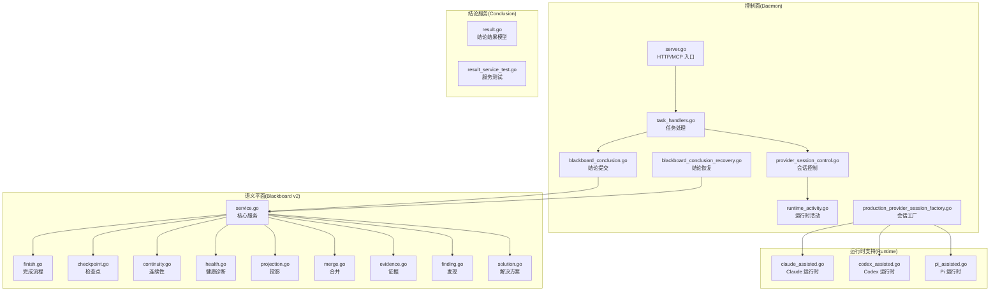
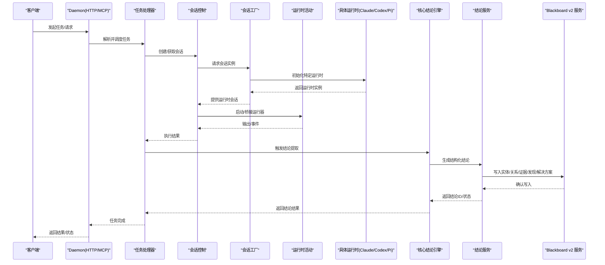
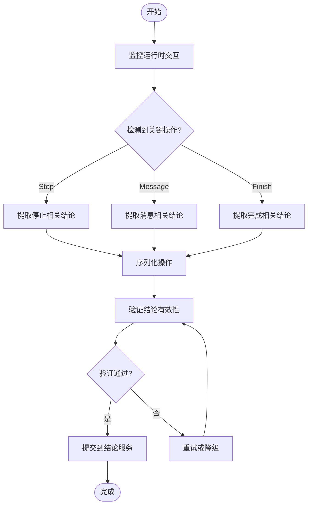
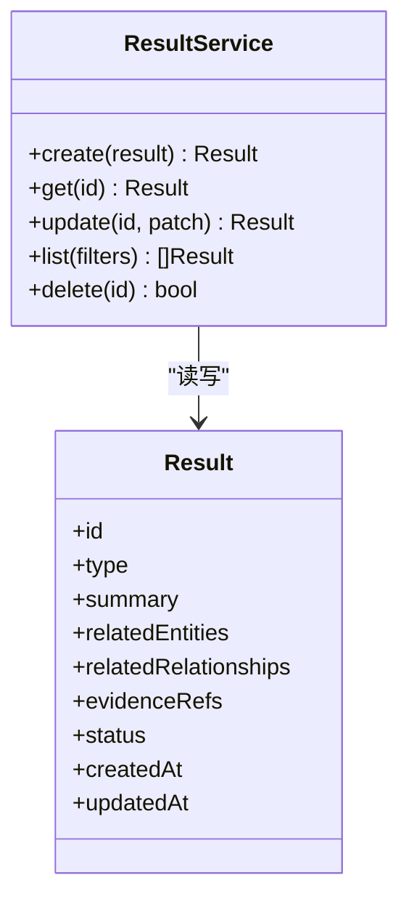
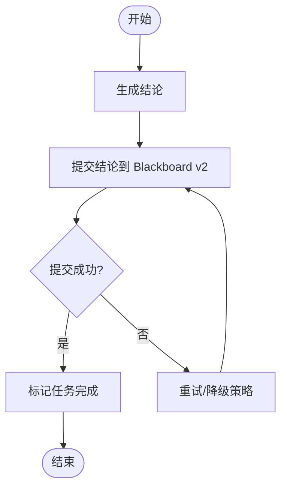
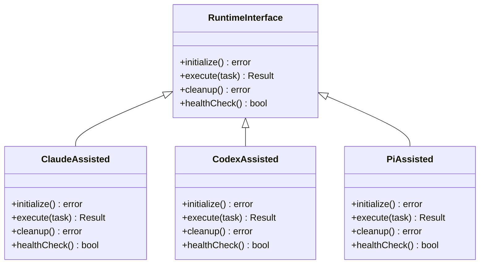
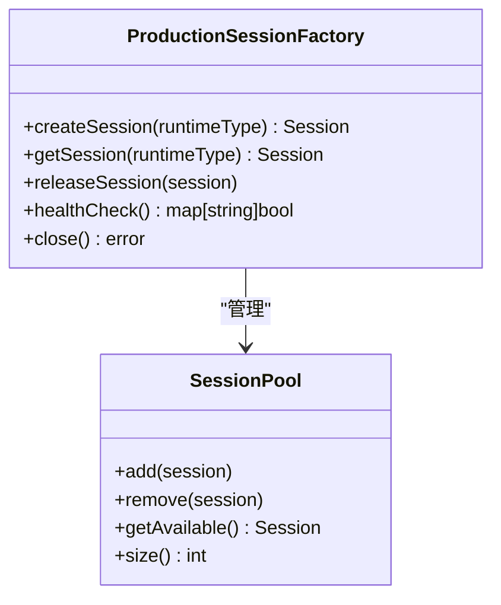
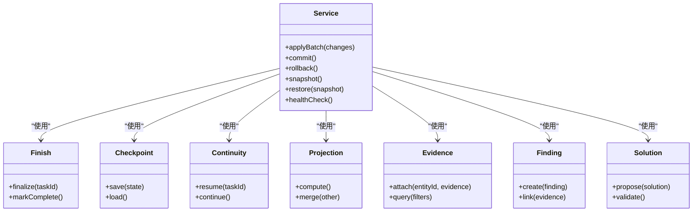
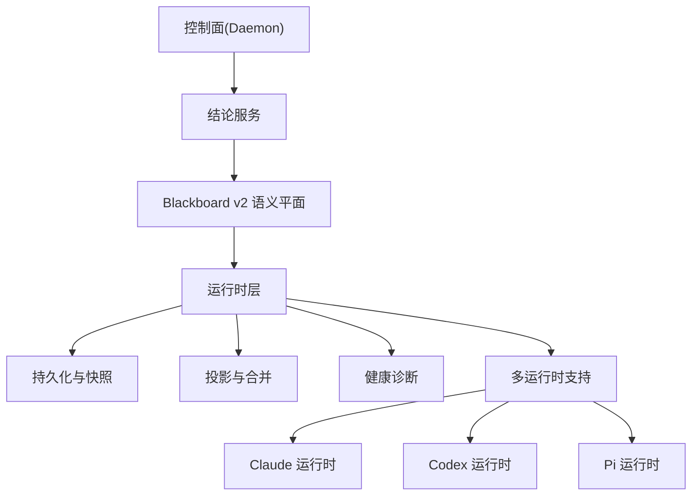
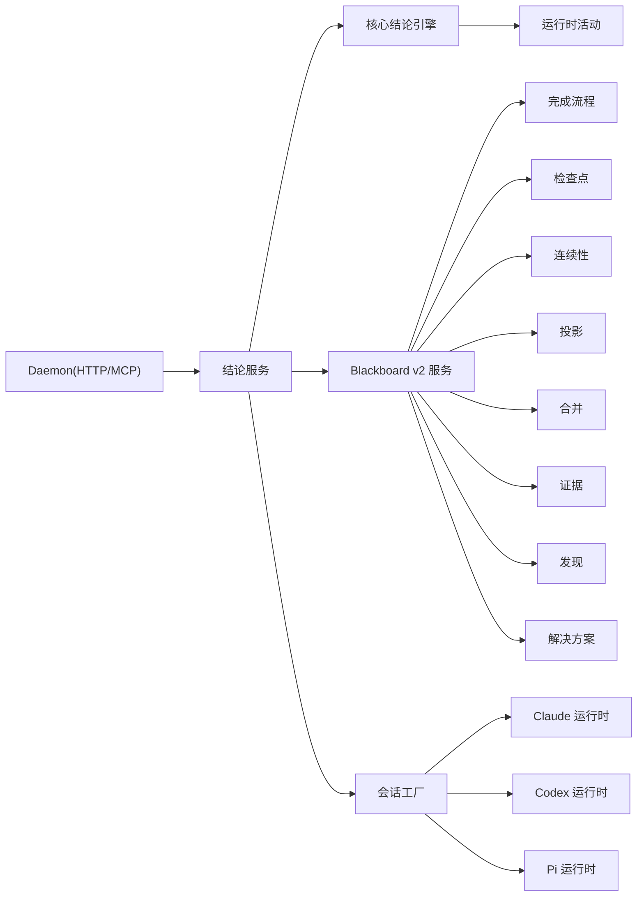

# 辅助结论系统

<cite>
**本文引用的文件**   
- [blackboard_conclusion.go](file://internal/daemon/blackboard_conclusion.go)
- [blackboard_conclusion_recovery.go](file://internal/daemon/blackboard_conclusion_recovery.go)
- [assisted_conclusion_control_test.go](file://internal/daemon/assisted_conclusion_control_test.go)
- [assisted_conclusion_test.go](file://internal/daemon/assisted_conclusion_test.go)
- [result.go](file://internal/blackboardconclusion/result.go)
- [result_service_test.go](file://internal/blackboardconclusion/result_service_test.go)
- [result_test.go](file://internal/blackboardconclusion/result_test.go)
- [service.go](file://internal/blackboardv2/service.go)
- [finish.go](file://internal/blackboardv2/finish.go)
- [finish_service_test.go](file://internal/blackboardv2/finish_service_test.go)
- [checkpoint.go](file://internal/blackboardv2/checkpoint.go)
- [continuity.go](file://internal/blackboardv2/continuity.go)
- [health.go](file://internal/blackboardv2/health.go)
- [projection.go](file://internal/blackboardv2/projection.go)
- [merge.go](file://internal/blackboardv2/merge.go)
- [evidence.go](file://internal/blackboardv2/evidence.go)
- [finding.go](file://internal/blackboardv2/finding.go)
- [solution.go](file://internal/blackboardv2/solution.go)
- [server.go](file://internal/daemon/server.go)
- [task_handlers.go](file://internal/daemon/task_handlers.go)
- [provider_session_control.go](file://internal/daemon/provider_session_control.go)
- [runtime_activity.go](file://internal/daemon/runtime_activity.go)
- [production_provider_session_factory.go](file://internal/daemon/production_provider_session_factory.go)
- [claude_assisted.go](file://internal/runtime/claude_assisted.go)
- [codex_assisted.go](file://internal/runtime/codex_assisted.go)
- [pi_assisted.go](file://internal/runtime/pi_assisted.go)
</cite>

## 更新摘要
**所做更改**   
- 增强了核心结论引擎，实现了序列化 Stop/message/Finish 操作围绕结论的机制
- 完善了持久化和恢复机制，确保崩溃或中断后结论状态的可恢复性
- 深化了与 Blackboard v2 的集成，支持 AI 驱动的助手自动从运行时交互中提取有意义的结论
- 扩展了多运行时支持（Claude、Codex、Pi），提升了系统的运行时兼容性
- 改进了会话工厂功能，优化生产环境下的会话管理和资源分配

## 目录
1. [简介](#简介)
2. [项目结构](#项目结构)
3. [核心组件](#核心组件)
4. [架构总览](#架构总览)
5. [详细组件分析](#详细组件分析)
6. [依赖关系分析](#依赖关系分析)
7. [性能考量](#性能考量)
8. [故障排查指南](#故障排查指南)
9. [结论](#结论)
10. [附录](#附录)

## 简介
本文件聚焦"辅助结论系统"，即 CyberPenda 中围绕 Blackboard v2 的结论生成、持久化与恢复能力。该系统由三部分构成：
- 结论服务（Blackboard Conclusion）：定义结论结果模型与服务接口，支撑任务执行后的结论写入与查询。
- Daemon 控制面：提供 HTTP API 与 MCP 工具，协调任务生命周期、会话控制与结论提交；具备结论恢复能力，确保崩溃或中断后仍可重建结论状态。
- Blackboard v2 语义平面：实体/关系/证据/发现/解决方案等核心数据结构的变更流水线、投影合并、检查点与连续性保障。

**更新** 本次更新重点增强了系统的核心结论引擎，新增了序列化 Stop/message/Finish 操作的机制，使 AI 驱动的助手能够自动从运行时交互中提取有意义的结论。同时完善了持久化和恢复机制，并深化了与 Blackboard v2 的集成。

该文档面向希望理解并扩展辅助结论系统的开发者与使用者，既提供高层架构视图，也深入到关键实现细节与调用序列。

## 项目结构
辅助结论系统主要分布在以下模块：
- internal/daemon：HTTP/MCP 路由、任务启动与会话控制、结论恢复逻辑。
- internal/blackboardconclusion：结论结果的数据结构与基础服务。
- internal/blackboardv2：Blackboard v2 的核心服务与领域对象（实体、关系、证据、发现、解决方案、检查点、连续性、健康诊断、投影与合并）。
- internal/runtime：运行时适配器，包括 Claude、Codex、Pi 等特定运行时的辅助实现。

**图表来源** 
- [server.go](file://internal/daemon/server.go)
- [task_handlers.go](file://internal/daemon/task_handlers.go)
- [provider_session_control.go](file://internal/daemon/provider_session_control.go)
- [runtime_activity.go](file://internal/daemon/runtime_activity.go)
- [blackboard_conclusion.go](file://internal/daemon/blackboard_conclusion.go)
- [blackboard_conclusion_recovery.go](file://internal/daemon/blackboard_conclusion_recovery.go)
- [production_provider_session_factory.go](file://internal/daemon/production_provider_session_factory.go)
- [claude_assisted.go](file://internal/runtime/claude_assisted.go)
- [codex_assisted.go](file://internal/runtime/codex_assisted.go)
- [pi_assisted.go](file://internal/runtime/pi_assisted.go)
- [result.go](file://internal/blackboardconclusion/result.go)
- [service.go](file://internal/blackboardv2/service.go)
- [finish.go](file://internal/blackboardv2/finish.go)
- [checkpoint.go](file://internal/blackboardv2/checkpoint.go)
- [continuity.go](file://internal/blackboardv2/continuity.go)
- [health.go](file://internal/blackboardv2/health.go)
- [projection.go](file://internal/blackboardv2/projection.go)
- [merge.go](file://internal/blackboardv2/merge.go)
- [evidence.go](file://internal/blackboardv2/evidence.go)
- [finding.go](file://internal/blackboardv2/finding.go)
- [solution.go](file://internal/blackboardv2/solution.go)

**章节来源**
- [server.go](file://internal/daemon/server.go)
- [task_handlers.go](file://internal/daemon/task_handlers.go)
- [blackboard_conclusion.go](file://internal/daemon/blackboard_conclusion.go)
- [blackboard_conclusion_recovery.go](file://internal/daemon/blackboard_conclusion_recovery.go)
- [production_provider_session_factory.go](file://internal/daemon/production_provider_session_factory.go)
- [claude_assisted.go](file://internal/runtime/claude_assisted.go)
- [codex_assisted.go](file://internal/runtime/codex_assisted.go)
- [pi_assisted.go](file://internal/runtime/pi_assisted.go)
- [result.go](file://internal/blackboardconclusion/result.go)
- [service.go](file://internal/blackboardv2/service.go)

## 核心组件
- 结论结果模型与服务：定义结论的结构与基本操作，为上层控制面提供统一的写入与读取能力。
- 结论提交与恢复：Daemon 在任务完成后提交结论，并在异常或重启时进行恢复，保证结论一致性与可恢复性。
- Blackboard v2 语义服务：承载实体、关系、证据、发现、解决方案等对象的原子变更、投影合并、检查点与连续性管理，是结论落地的底层平台。
- **新增** 核心结论引擎：实现了序列化 Stop/message/Finish 操作的机制，使 AI 助手能够自动提取有意义的结论。
- **新增** 增强的持久化机制：完善了崩溃恢复和状态重建能力，确保结论数据的完整性。
- **新增** 深化的 Blackboard v2 集成：支持与语义平面的深度交互，提升结论生成的智能化水平。
- **新增** 多运行时支持：Claude、Codex、Pi 三种运行时的专用辅助实现，提供更丰富的推理和执行能力。
- **新增** 增强的会话工厂：改进的生产环境会话管理，支持更灵活的运行时配置和生命周期控制。

**更新** 本次更新显著增强了系统的核心结论引擎和持久化机制，新增了序列化操作支持和智能结论提取能力，同时扩展了多运行时支持和会话工厂功能。

**章节来源**
- [result.go](file://internal/blackboardconclusion/result.go)
- [result_service_test.go](file://internal/blackboardconclusion/result_service_test.go)
- [blackboard_conclusion.go](file://internal/daemon/blackboard_conclusion.go)
- [blackboard_conclusion_recovery.go](file://internal/daemon/blackboard_conclusion_recovery.go)
- [service.go](file://internal/blackboardv2/service.go)
- [claude_assisted.go](file://internal/runtime/claude_assisted.go)
- [codex_assisted.go](file://internal/runtime/codex_assisted.go)
- [pi_assisted.go](file://internal/runtime/pi_assisted.go)
- [production_provider_session_factory.go](file://internal/daemon/production_provider_session_factory.go)

## 架构总览
辅助结论系统在四层之间协作：
- 控制面（Daemon）：通过 HTTP/MCP 暴露能力，编排任务生命周期、会话控制与结论提交/恢复。
- 结论服务：抽象结论数据结构与操作，屏蔽底层语义差异。
- 语义平面（Blackboard v2）：以实体/关系/证据/发现/解决方案为核心，提供原子变更、投影合并、检查点与连续性保障。
- **新增** 运行时层：提供 Claude、Codex、Pi 等不同运行时的统一接口和适配实现。

**更新** 新增了核心结论引擎层，形成了更加清晰的分层架构，支持智能化的结论提取和处理。

**图表来源** 
- [task_handlers.go](file://internal/daemon/task_handlers.go)
- [provider_session_control.go](file://internal/daemon/provider_session_control.go)
- [production_provider_session_factory.go](file://internal/daemon/production_provider_session_factory.go)
- [runtime_activity.go](file://internal/daemon/runtime_activity.go)
- [blackboard_conclusion.go](file://internal/daemon/blackboard_conclusion.go)
- [blackboard_conclusion_recovery.go](file://internal/daemon/blackboard_conclusion_recovery.go)
- [claude_assisted.go](file://internal/runtime/claude_assisted.go)
- [codex_assisted.go](file://internal/runtime/codex_assisted.go)
- [pi_assisted.go](file://internal/runtime/pi_assisted.go)
- [service.go](file://internal/blackboardv2/service.go)

## 详细组件分析

### 核心结论引擎（Core Conclusion Engine）
- **新增** 目标：实现序列化 Stop/message/Finish 操作的机制，使 AI 助手能够自动从运行时交互中提取有意义的结论。
- **新增** 关键点：
  - 操作序列化：确保 Stop、message、Finish 等操作按照正确的顺序执行，避免并发冲突。
  - 智能提取：基于运行时交互内容，自动识别和提取有价值的结论信息。
  - 上下文感知：结合任务上下文和历史交互，提高结论的准确性和相关性。
  - 错误恢复：在提取过程中遇到错误时，提供降级处理和重试机制。

**图表来源** 
- [blackboard_conclusion.go](file://internal/daemon/blackboard_conclusion.go)
- [blackboard_conclusion_recovery.go](file://internal/daemon/blackboard_conclusion_recovery.go)

**章节来源**
- [blackboard_conclusion.go](file://internal/daemon/blackboard_conclusion.go)
- [blackboard_conclusion_recovery.go](file://internal/daemon/blackboard_conclusion_recovery.go)

### 结论服务（Blackboard Conclusion）
- 目标：为任务执行后的结论提供统一的数据结构与写入接口，确保结论可序列化、可查询、可审计。
- 关键点：
  - 结论结果包含必要字段（如类型、摘要、关联实体/关系、证据引用等），便于后续报告与可视化。
  - 服务层封装写入逻辑，支持事务性提交与错误回滚。
  - 测试覆盖常见路径与边界条件，确保稳定性。

**图表来源** 
- [result.go](file://internal/blackboardconclusion/result.go)
- [result_service_test.go](file://internal/blackboardconclusion/result_service_test.go)

**章节来源**
- [result.go](file://internal/blackboardconclusion/result.go)
- [result_service_test.go](file://internal/blackboardconclusion/result_service_test.go)
- [result_test.go](file://internal/blackboardconclusion/result_test.go)

### 结论提交与恢复（Daemon）
- 目标：在任务完成后将结论写入 Blackboard v2，并在异常或进程重启后恢复结论状态，保证一致性。
- 关键点：
  - 提交流程：任务结束 -> 生成结论 -> 调用结论服务 -> 写入 Blackboard v2 -> 返回成功。
  - 恢复流程：启动时扫描未完成的任务/结论 -> 从检查点/快照重建 -> 重试提交 -> 清理中间状态。
  - 与运行时活动联动：捕获运行时事件，驱动结论更新。

**图表来源** 
- [blackboard_conclusion.go](file://internal/daemon/blackboard_conclusion.go)
- [blackboard_conclusion_recovery.go](file://internal/daemon/blackboard_conclusion_recovery.go)
- [runtime_activity.go](file://internal/daemon/runtime_activity.go)

**章节来源**
- [blackboard_conclusion.go](file://internal/daemon/blackboard_conclusion.go)
- [blackboard_conclusion_recovery.go](file://internal/daemon/blackboard_conclusion_recovery.go)
- [assisted_conclusion_control_test.go](file://internal/daemon/assisted_conclusion_control_test.go)
- [assisted_conclusion_test.go](file://internal/daemon/assisted_conclusion_test.go)
- [runtime_activity.go](file://internal/daemon/runtime_activity.go)

### 多运行时支持（Runtime Support）
- **新增** 目标：为 Claude、Codex、Pi 等不同 AI 运行时提供统一的辅助接口和适配实现。
- **新增** 关键点：
  - 统一的运行时接口：所有运行时都实现相同的辅助方法接口，便于替换和扩展。
  - 特定的优化策略：每个运行时都有针对性的优化和配置选项。
  - 会话管理：支持运行时的会话创建、维护和销毁。
  - 错误处理：统一的错误处理和重试机制。

**图表来源** 
- [claude_assisted.go](file://internal/runtime/claude_assisted.go)
- [codex_assisted.go](file://internal/runtime/codex_assisted.go)
- [pi_assisted.go](file://internal/runtime/pi_assisted.go)

**章节来源**
- [claude_assisted.go](file://internal/runtime/claude_assisted.go)
- [codex_assisted.go](file://internal/runtime/codex_assisted.go)
- [pi_assisted.go](file://internal/runtime/pi_assisted.go)

### 增强的会话工厂（Enhanced Session Factory）
- **新增** 目标：提供生产环境下的高效会话管理和资源分配。
- **新增** 关键点：
  - 会话池管理：维护会话池，避免频繁创建销毁开销。
  - 负载均衡：智能分配会话到不同的运行时实例。
  - 健康监控：实时监控会话状态和健康状况。
  - 优雅关闭：支持平滑的会话关闭和资源清理。

**图表来源** 
- [production_provider_session_factory.go](file://internal/daemon/production_provider_session_factory.go)

**章节来源**
- [production_provider_session_factory.go](file://internal/daemon/production_provider_session_factory.go)

### Blackboard v2 语义服务
- 目标：提供实体、关系、证据、发现、解决方案等对象的原子变更、投影合并、检查点与连续性保障。
- 关键点：
  - 原子变更：批量应用语义变更，确保一致性。
  - 投影合并：将多个变更集合并为一致的投影视图。
  - 检查点与连续性：周期性保存状态，支持崩溃恢复与断点续跑。
  - 健康诊断：监控服务状态与延迟，辅助排障。

**图表来源** 
- [service.go](file://internal/blackboardv2/service.go)
- [finish.go](file://internal/blackboardv2/finish.go)
- [checkpoint.go](file://internal/blackboardv2/checkpoint.go)
- [continuity.go](file://internal/blackboardv2/continuity.go)
- [projection.go](file://internal/blackboardv2/projection.go)
- [merge.go](file://internal/blackboardv2/merge.go)
- [evidence.go](file://internal/blackboardv2/evidence.go)
- [finding.go](file://internal/blackboardv2/finding.go)
- [solution.go](file://internal/blackboardv2/solution.go)

**章节来源**
- [service.go](file://internal/blackboardv2/service.go)
- [finish_service_test.go](file://internal/blackboardv2/finish_service_test.go)
- [checkpoint.go](file://internal/blackboardv2/checkpoint.go)
- [continuity.go](file://internal/blackboardv2/continuity.go)
- [health.go](file://internal/blackboardv2/health.go)
- [projection.go](file://internal/blackboardv2/projection.go)
- [merge.go](file://internal/blackboardv2/merge.go)
- [evidence.go](file://internal/blackboardv2/evidence.go)
- [finding.go](file://internal/blackboardv2/finding.go)
- [solution.go](file://internal/blackboardv2/solution.go)

### 概念总览
辅助结论系统通过"控制面—结论服务—语义平面—运行时层"的四层设计，实现了高内聚、低耦合的结论生成与持久化能力。控制面负责编排与协调，结论服务抽象数据与操作，语义平面提供强一致性的存储与计算，运行时层提供多样化的执行环境支持。

[本图为概念性流程图，不直接映射具体源码文件]

## 依赖关系分析
- 控制面对结论服务的依赖：通过 HTTP/MCP 暴露接口，调用结论服务写入 Blackboard v2。
- 结论服务对语义平面的依赖：封装实体/关系/证据/发现/解决方案的写入与查询。
- 语义平面的内部依赖：检查点、连续性、投影合并、健康诊断等模块协同工作。
- **新增** 运行时层的依赖：会话工厂管理不同运行时的会话生命周期，提供统一的接口抽象。
- **新增** 核心结论引擎的依赖：依赖于运行时活动和结论服务，提供智能结论提取能力。

**图表来源** 
- [server.go](file://internal/daemon/server.go)
- [task_handlers.go](file://internal/daemon/task_handlers.go)
- [blackboard_conclusion.go](file://internal/daemon/blackboard_conclusion.go)
- [service.go](file://internal/blackboardv2/service.go)
- [finish.go](file://internal/blackboardv2/finish.go)
- [checkpoint.go](file://internal/blackboardv2/checkpoint.go)
- [continuity.go](file://internal/blackboardv2/continuity.go)
- [projection.go](file://internal/blackboardv2/projection.go)
- [merge.go](file://internal/blackboardv2/merge.go)
- [evidence.go](file://internal/blackboardv2/evidence.go)
- [finding.go](file://internal/blackboardv2/finding.go)
- [solution.go](file://internal/blackboardv2/solution.go)
- [production_provider_session_factory.go](file://internal/daemon/production_provider_session_factory.go)
- [claude_assisted.go](file://internal/runtime/claude_assisted.go)
- [codex_assisted.go](file://internal/runtime/codex_assisted.go)
- [pi_assisted.go](file://internal/runtime/pi_assisted.go)
- [runtime_activity.go](file://internal/daemon/runtime_activity.go)

**章节来源**
- [server.go](file://internal/daemon/server.go)
- [task_handlers.go](file://internal/daemon/task_handlers.go)
- [blackboard_conclusion.go](file://internal/daemon/blackboard_conclusion.go)
- [service.go](file://internal/blackboardv2/service.go)
- [production_provider_session_factory.go](file://internal/daemon/production_provider_session_factory.go)
- [claude_assisted.go](file://internal/runtime/claude_assisted.go)
- [codex_assisted.go](file://internal/runtime/codex_assisted.go)
- [pi_assisted.go](file://internal/runtime/pi_assisted.go)
- [runtime_activity.go](file://internal/daemon/runtime_activity.go)

## 性能考量
- 原子批处理：Blackboard v2 的批量变更减少锁竞争与 I/O 次数，提升吞吐。
- 投影合并：增量合并避免全量重算，降低 CPU 与内存压力。
- 检查点间隔：合理设置检查点频率，平衡恢复时间与存储开销。
- 健康诊断：监控延迟与错误率，及时发现瓶颈与异常。
- **新增** 会话池管理：通过会话复用减少运行时初始化的开销。
- **新增** 负载均衡：智能分配任务到不同的运行时实例，提高整体吞吐量。
- **新增** 异步处理：利用 Go 协程并发处理多个运行时请求，提升响应速度。
- **新增** 结论提取优化：采用缓存和预编译策略，加速智能结论提取过程。
- **新增** 序列化优化：优化 Stop/message/Finish 操作的序列化效率，减少内存占用。

**更新** 新增了会话池管理、负载均衡、异步处理、结论提取优化和序列化优化等性能优化措施，显著提升系统的整体性能和可扩展性。

## 故障排查指南
- 结论未提交：检查 Daemon 日志中的提交失败记录，确认 Blackboard v2 服务健康状态。
- 恢复失败：验证检查点完整性，确认连续性模块是否成功加载快照。
- 投影不一致：检查合并逻辑与并发写入冲突，必要时回滚并重试。
- 运行时异常：查看运行时活动日志，定位会话超时或资源不足问题。
- **新增** 运行时连接失败：检查特定运行时的配置和网络连通性，确认认证凭据有效。
- **新增** 会话工厂异常：监控会话池状态，检查是否有会话泄漏或资源耗尽。
- **新增** 负载均衡问题：分析各运行时的负载分布，调整分配策略。
- **新增** 结论提取失败：检查核心结论引擎的日志，确认运行时交互格式和提取规则。
- **新增** 序列化错误：验证 Stop/message/Finish 操作的序列化格式，检查并发访问冲突。

**更新** 新增了针对核心结论引擎、多运行时支持和序列化机制的故障排查指导，包括结论提取失败、运行时连接、会话工厂、负载均衡和序列化错误等相关问题的处理方法。

**章节来源**
- [blackboard_conclusion_recovery.go](file://internal/daemon/blackboard_conclusion_recovery.go)
- [health.go](file://internal/blackboardv2/health.go)
- [runtime_activity.go](file://internal/daemon/runtime_activity.go)
- [production_provider_session_factory.go](file://internal/daemon/production_provider_session_factory.go)
- [claude_assisted.go](file://internal/runtime/claude_assisted.go)
- [codex_assisted.go](file://internal/runtime/codex_assisted.go)
- [pi_assisted.go](file://internal/runtime/pi_assisted.go)
- [blackboard_conclusion.go](file://internal/daemon/blackboard_conclusion.go)

## 结论
辅助结论系统通过清晰的分层设计与强大的语义平面，实现了高可靠、可扩展的结论生成与持久化能力。控制面编排任务与会话，结论服务抽象数据与操作，Blackboard v2 提供原子变更、投影合并、检查点与连续性保障。**新增的核心结论引擎**实现了智能化的结论提取和序列化操作机制，**增强的持久化机制**确保了崩溃恢复和状态重建能力，**深化的 Blackboard v2 集成**提升了结论生成的智能化水平。**新增的多运行时支持**使系统能够灵活适配 Claude、Codex、Pi 等不同 AI 运行时，**增强的会话工厂**提供了更高效的生产环境管理能力。建议在生产环境中启用健康诊断与定期检查点，结合运行时活动日志进行监控与排障，充分利用新增的性能优化特性。

**更新** 本次更新显著增强了系统的核心结论引擎、持久化机制和多运行时支持，为构建更加强大和灵活的辅助结论系统奠定了坚实基础。

## 附录
- 相关测试用例：assisted_conclusion_control_test.go、assisted_conclusion_test.go、result_service_test.go、finish_service_test.go 等，覆盖关键路径与边界条件。
- 扩展建议：新增结论类型时，扩展结论服务接口与 Blackboard v2 的实体/关系模型，确保投影与合并逻辑同步更新。
- **新增** 运行时扩展：如需支持新的运行时，参考现有的 Claude、Codex、Pi 实现，实现统一的运行时接口。
- **新增** 会话工厂扩展：根据业务需求调整会话池大小、负载均衡策略和健康检查机制。
- **新增** 结论引擎扩展：自定义结论提取规则和序列化策略，适应不同的运行时交互模式。
- **新增** 持久化扩展：支持多种存储后端和恢复策略，满足不同场景的需求。

**更新** 新增了关于核心结论引擎、持久化机制、运行时扩展和会话工厂扩展的指导，帮助开发者更好地利用新增的功能特性。

**章节来源**
- [assisted_conclusion_control_test.go](file://internal/daemon/assisted_conclusion_control_test.go)
- [assisted_conclusion_test.go](file://internal/daemon/assisted_conclusion_test.go)
- [result_service_test.go](file://internal/blackboardconclusion/result_service_test.go)
- [finish_service_test.go](file://internal/blackboardv2/finish_service_test.go)
- [claude_assisted.go](file://internal/runtime/claude_assisted.go)
- [codex_assisted.go](file://internal/runtime/codex_assisted.go)
- [pi_assisted.go](file://internal/runtime/pi_assisted.go)
- [production_provider_session_factory.go](file://internal/daemon/production_provider_session_factory.go)
- [blackboard_conclusion.go](file://internal/daemon/blackboard_conclusion.go)
- [blackboard_conclusion_recovery.go](file://internal/daemon/blackboard_conclusion_recovery.go)