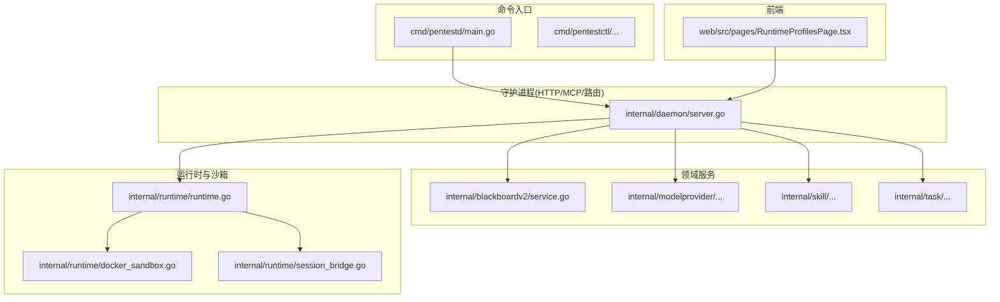
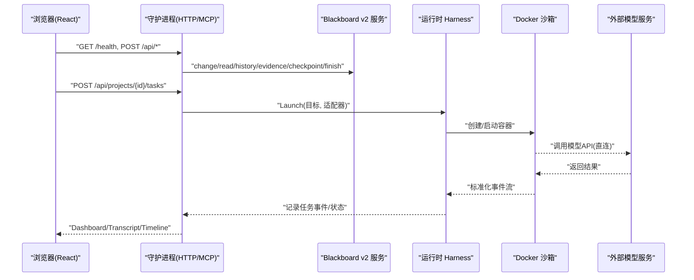
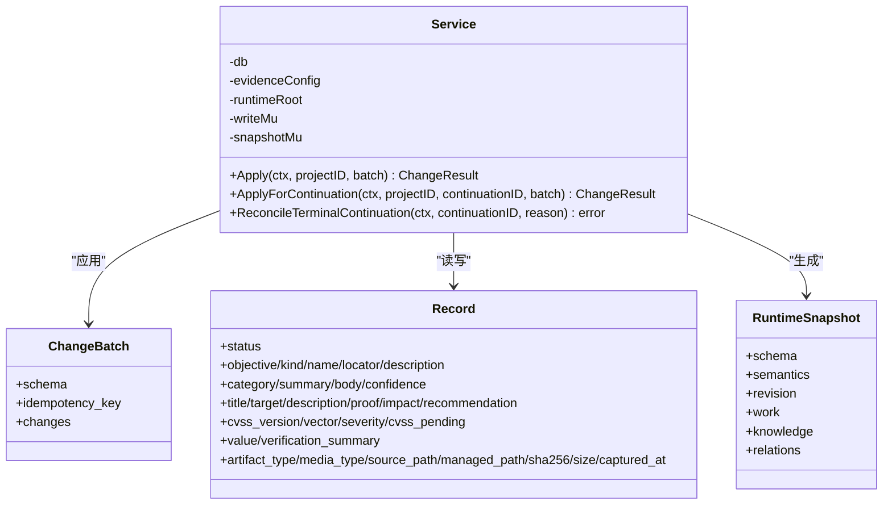
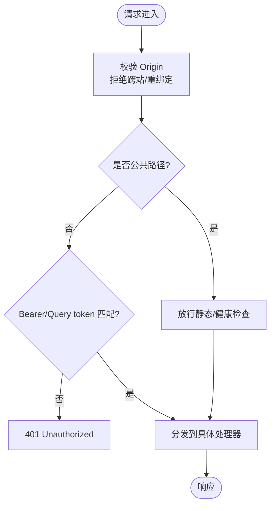
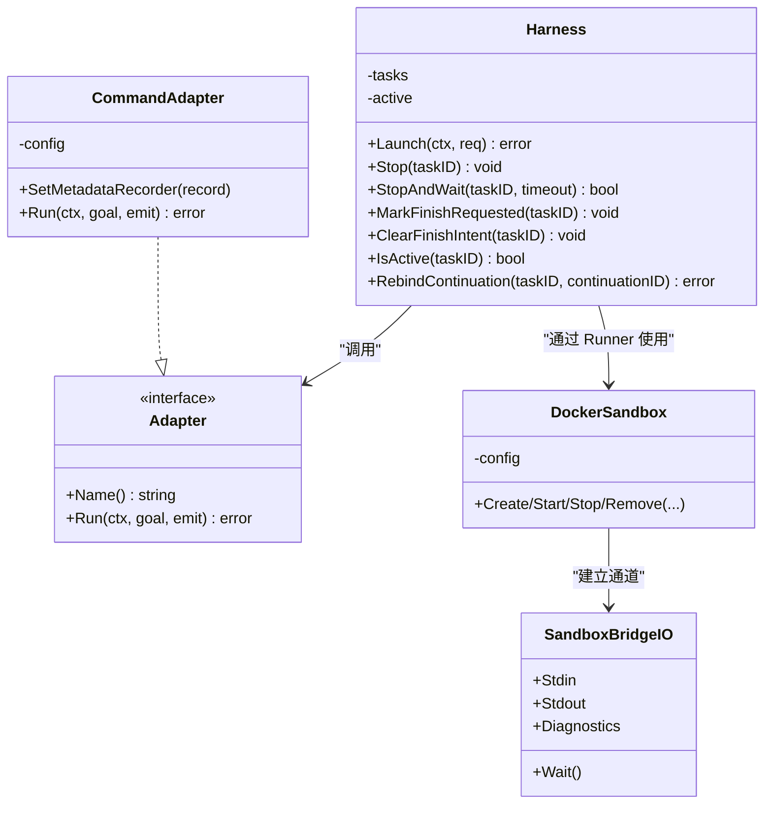
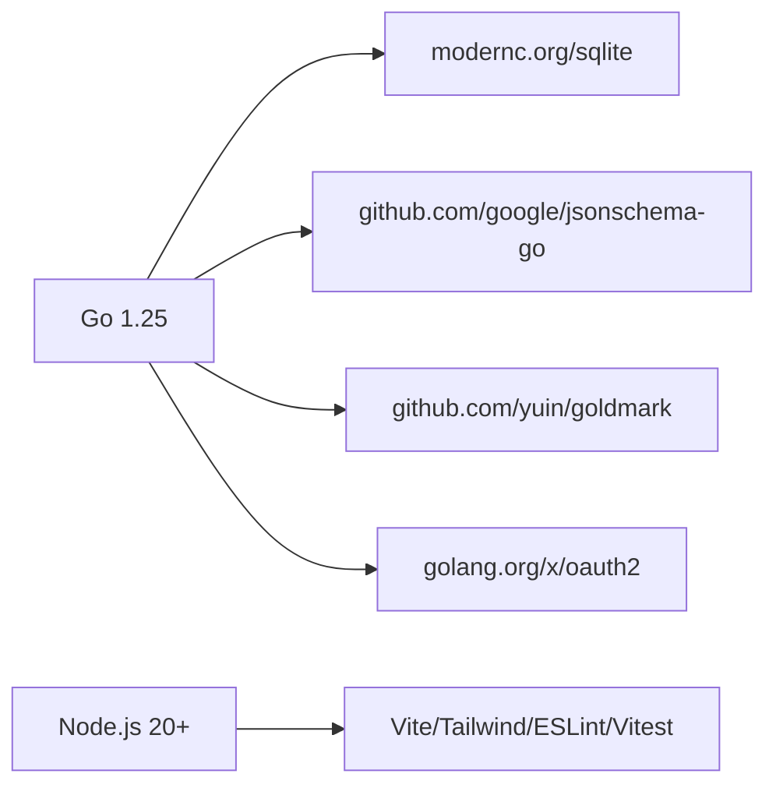
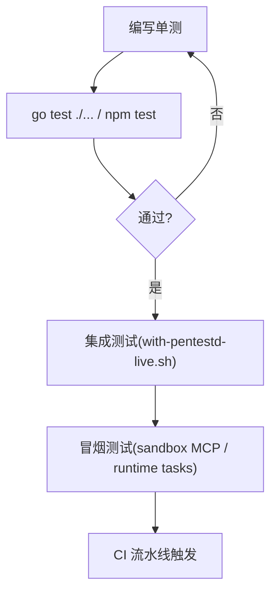

# 开发者指南

<cite>
**本文引用的文件**   
- [README.md](file://README.md)
- [CONTEXT.md](file://CONTEXT.md)
- [Makefile](file://Makefile)
- [go.mod](file://go.mod)
- [cmd/pentestd/main.go](file://cmd/pentestd/main.go)
- [internal/daemon/server.go](file://internal/daemon/server.go)
- [internal/blackboardv2/service.go](file://internal/blackboardv2/service.go)
- [internal/runtime/runtime.go](file://internal/runtime/runtime.go)
- [internal/runtime/docker_sandbox.go](file://internal/runtime/docker_sandbox.go)
- [internal/runtime/session_bridge.go](file://internal/runtime/session_bridge.go)
- [internal/integration/ci_smoke_test.go](file://internal/integration/ci_smoke_test.go)
- [web/src/pages/RuntimeProfilesPage.tsx](file://web/src/pages/RuntimeProfilesPage.tsx)
- [.github/workflows/smoke-runtime-nightly.yml](file:.github/workflows/smoke-runtime-nightly.yml)
</cite>

## 目录
1. [简介](#简介)
2. [项目结构](#项目结构)
3. [核心组件](#核心组件)
4. [架构总览](#架构总览)
5. [详细组件分析](#详细组件分析)
6. [依赖分析](#依赖分析)
7. [性能考虑](#性能考虑)
8. [故障排查指南](#故障排查指南)
9. [结论](#结论)
10. [附录](#附录)

## 简介
本指南面向贡献者，覆盖开发环境搭建、代码规范、测试策略与构建流程，并深入解析项目结构、模块依赖与接口设计原则。文档同时提供单元测试、集成测试与端到端测试方法，以及代码审查流程、问题报告和功能请求的最佳实践。

本项目为本地优先的渗透测试代理，包含 Go 守护进程（控制平面）、React 仪表盘（前端）、沙箱运行时（执行平面）与 Blackboard v2 语义记忆系统。默认数据落盘 SQLite，任务运行在容器隔离环境中，通过 MCP 暴露受信任的语义工具给运行时使用。

## 项目结构
仓库采用“命令入口 + 领域服务 + 适配器”的分层组织方式：
- cmd：可执行程序入口（pentestd、pentestctl 等）
- internal：领域服务、HTTP 服务、运行时、存储、技能、模型提供者等
- web：React + Vite 仪表盘
- docker：镜像与编排
- docs：产品与架构决策文档
- scripts：构建与冒烟脚本
- skills/bundles：内置技能包

图表来源
- [cmd/pentestd/main.go:1-40](file://cmd/pentestd/main.go#L1-L40)
- [internal/daemon/server.go:587-643](file://internal/daemon/server.go#L587-L643)
- [internal/blackboardv2/service.go:1-55](file://internal/blackboardv2/service.go#L1-L55)
- [internal/runtime/runtime.go:1-40](file://internal/runtime/runtime.go#L1-L40)
- [internal/runtime/docker_sandbox.go:1-57](file://internal/runtime/docker_sandbox.go#L1-L57)
- [internal/runtime/session_bridge.go:1-42](file://internal/runtime/session_bridge.go#L1-L42)
- [web/src/pages/RuntimeProfilesPage.tsx:1705-1742](file://web/src/pages/RuntimeProfilesPage.tsx#L1705-L1742)

章节来源
- [README.md:150-161](file://README.md#L150-L161)
- [CONTEXT.md:1-120](file://CONTEXT.md#L1-L120)

## 核心组件
- Blackboard v2 语义服务：定义原子化的语义变更批次、当前快照、历史与投影合并；对外暴露 change/current read/history/evidence/attempt checkpoint/finish 六类受信任操作。
- Daemon HTTP/MCP 服务：统一路由、鉴权、CORS/Origin 校验、MCP 端点、项目/任务/配置管理 API。
- 运行时与沙箱：Harness 管理生命周期，Adapter 抽象不同运行时（Codex/Claude/Pi），DockerSandbox 负责容器化隔离与网络要求。
- 模型提供者与运行时配置：Model Provider 与 Runtime Profile 解耦，支持协议选择、目录清单、预检与刷新模型目录。
- 技能与扩展：Skill 与 Runtime Extension 的管理、导入、发布与投影到任务工作目录。

章节来源
- [internal/blackboardv2/service.go:1-120](file://internal/blackboardv2/service.go#L1-L120)
- [internal/daemon/server.go:383-411](file://internal/daemon/server.go#L383-L411)
- [internal/runtime/runtime.go:19-40](file://internal/runtime/runtime.go#L19-L40)
- [internal/runtime/docker_sandbox.go:20-57](file://internal/runtime/docker_sandbox.go#L20-L57)

## 架构总览
下图展示从浏览器到守护进程、再到运行时与 Blackboard v2 的调用链与安全边界。

图表来源
- [internal/daemon/server.go:587-643](file://internal/daemon/server.go#L587-L643)
- [internal/blackboardv2/service.go:644-656](file://internal/blackboardv2/service.go#L644-L656)
- [internal/runtime/runtime.go:71-179](file://internal/runtime/runtime.go#L71-L179)
- [internal/runtime/docker_sandbox.go:1-57](file://internal/runtime/docker_sandbox.go#L1-L57)

## 详细组件分析

### Blackboard v2 语义服务
- 职责：维护 Project 级别的持久化语义记忆，提供原子变更、快照生成、历史分页、证据保留、尝试收敛与 Finish 协调。
- 关键概念：ChangeBatch、Record、Relationship、RuntimeSnapshot、WorkingSnapshot、SemanticHistory。
- 安全与一致性：严格字段白名单、幂等键、乐观版本、事务内原子提交、失败回滚。

图表来源
- [internal/blackboardv2/service.go:40-120](file://internal/blackboardv2/service.go#L40-L120)
- [internal/blackboardv2/service.go:644-656](file://internal/blackboardv2/service.go#L644-L656)

章节来源
- [internal/blackboardv2/service.go:1-120](file://internal/blackboardv2/service.go#L1-L120)
- [internal/blackboardv2/service.go:644-656](file://internal/blackboardv2/service.go#L644-L656)

### 守护进程 HTTP/MCP 服务
- 职责：统一路由注册、鉴权（Bearer/token）、Origin/DNS 重绑定防护、健康检查、项目/任务/配置管理、MCP 端点。
- 安全：非环回监听强制 token；静态资源仅 GET；MCP 允许 host.docker.internal 访问。
- 路由：/health、/api/*、/mcp、SPA 静态资源。

图表来源
- [internal/daemon/server.go:383-411](file://internal/daemon/server.go#L383-L411)
- [internal/daemon/server.go:518-534](file://internal/daemon/server.go#L518-L534)
- [internal/daemon/server.go:587-643](file://internal/daemon/server.go#L587-L643)

章节来源
- [internal/daemon/server.go:383-411](file://internal/daemon/server.go#L383-L411)
- [internal/daemon/server.go:518-534](file://internal/daemon/server.go#L518-L534)
- [internal/daemon/server.go:587-643](file://internal/daemon/server.go#L587-L643)

### 运行时与沙箱
- Harness：封装 Adapter 生命周期，记录事件、更新任务状态、处理 Stop/Finish 意图。
- Adapter：抽象不同运行时（Codex/Claude/Pi/Fake），统一 Run 接口与事件输出。
- DockerSandbox：容器化隔离，网络要求、日志事件、停止优雅期。
- SessionBridge：与容器进程建立 stdin/stdout 通道，分离诊断流。

图表来源
- [internal/runtime/runtime.go:46-179](file://internal/runtime/runtime.go#L46-L179)
- [internal/runtime/runtime.go:333-481](file://internal/runtime/runtime.go#L333-L481)
- [internal/runtime/docker_sandbox.go:20-57](file://internal/runtime/docker_sandbox.go#L20-L57)
- [internal/runtime/session_bridge.go:16-42](file://internal/runtime/session_bridge.go#L16-L42)

章节来源
- [internal/runtime/runtime.go:19-40](file://internal/runtime/runtime.go#L19-L40)
- [internal/runtime/runtime.go:71-179](file://internal/runtime/runtime.go#L71-L179)
- [internal/runtime/docker_sandbox.go:1-57](file://internal/runtime/docker_sandbox.go#L1-L57)
- [internal/runtime/session_bridge.go:1-42](file://internal/runtime/session_bridge.go#L1-L42)

### 前端与运行时配置预览
- 运行时配置页面提供路径预览、API Key 脱敏、MCP 端点 URL 构造（区分 sandbox/host）。
- 用于帮助操作员理解最终注入到运行时的环境变量与路径映射。

章节来源
- [web/src/pages/RuntimeProfilesPage.tsx:1705-1742](file://web/src/pages/RuntimeProfilesPage.tsx#L1705-L1742)

## 依赖分析
- 语言与运行时：Go 1.25+，SQLite（modernc.org/sqlite）
- 外部依赖：JSON Schema、UUID、OAuth2、Goldmark 等
- 前端：Node.js 20+，Vite、Tailwind、ESLint、Vitest

图表来源
- [go.mod:1-27](file://go.mod#L1-L27)

章节来源
- [go.mod:1-27](file://go.mod#L1-L27)

## 性能考虑
- Blackboard v2 写入采用原子事务与紧凑快照，避免大对象进入模型注意力窗口。
- 运行时输出扫描限制行长度，防止内存膨胀；事件发射加锁保证并发安全。
- 沙箱容器停止设置优雅期，减少资源占用与僵尸进程风险。
- 建议：
  - 批量变更尽量合并为单个 ChangeBatch，减少往返与冲突概率。
  - 合理设置 Reasoning Effort，避免不必要的长上下文。
  - 对频繁读的路径（如 Dashboard）利用缓存或增量视图。

[本节为通用指导，不直接分析具体文件]

## 故障排查指南
- 守护进程无法启动（非环回无 token）：检查 -addr 与 -auth-token 或 PENTEST_AUTH_TOKEN。
- MCP 初始化失败：确认 Host 头允许 host.docker.internal，且 /mcp 路由可达。
- 任务状态异常：查看任务事件与时间线，关注 interrupted/completed/failed/stopped 阶段。
- 沙箱镜像拉取/启动失败：检查容器 CLI、镜像名与网络要求。
- 模型目录刷新失败：确认 Model Provider 的 OpenAI-family 端点与 API Key 环境变量。

章节来源
- [internal/daemon/server.go:179-185](file://internal/daemon/server.go#L179-L185)
- [internal/daemon/server.go:518-534](file://internal/daemon/server.go#L518-L534)
- [internal/runtime/runtime.go:153-179](file://internal/runtime/runtime.go#L153-L179)
- [internal/runtime/docker_sandbox.go:18-57](file://internal/runtime/docker_sandbox.go#L18-L57)

## 结论
本指南梳理了 CyberPenda 的核心子系统与贡献要点。遵循 Blackboard v2 的语义契约、守护进程的安全边界与运行时隔离原则，结合完善的测试与构建流程，可高效推进功能开发与质量保障。

[本节为总结，不直接分析具体文件]

## 附录

### 开发环境搭建
- 前置条件
  - Go（见 go.mod）
  - Node.js 20+（UI 构建与开发）
  - Docker 或 Podman（沙箱运行器）
- 本地开发
  - 安装 Git hooks：make install-git-hooks
  - 启动后端与 Vite 前端：make dev
  - 打开 Vite 输出的地址（/api 与 /health 代理至 127.0.0.1:8787）
- 构建自包含守护进程
  - make build-ui && make build
  - 运行 ./pentestd
- Docker Compose
  - 设置 PENTEST_AUTH_TOKEN 后 docker compose up -d
  - 访问 http://127.0.0.1:8787/?token=<token>
- 构建沙箱镜像
  - make build-sandbox-image
  - 可通过 SANDBOX_IMAGE 指定标签

章节来源
- [README.md:26-81](file://README.md#L26-L81)
- [Makefile:3-41](file://Makefile#L3-L41)
- [Makefile:43-71](file://Makefile#L43-L71)

### 代码规范
- 命名与包组织
  - 命令入口位于 cmd/*，领域服务位于 internal/*，按功能域划分包。
- 错误处理
  - 结构化错误与语义错误码（Blackboard v2 Error envelope）。
- 安全
  - 非环回监听必须配置认证令牌；Origin 校验防 DNS 重绑定；MCP 仅允许 host.docker.internal。
- 日志与审计
  - 任务事件与时间线记录生命周期与运行时输出；敏感信息脱敏。

章节来源
- [internal/daemon/server.go:383-411](file://internal/daemon/server.go#L383-L411)
- [internal/daemon/server.go:518-534](file://internal/daemon/server.go#L518-L534)
- [internal/blackboardv2/service.go:616-630](file://internal/blackboardv2/service.go#L616-L630)

### 测试策略
- 单元测试
  - Go：go test ./...
  - 前端：Vitest（web/vitest.config.ts）
- 集成测试
  - 守护进程冒烟：scripts/with-pentestd-live.sh + curl /health
- 端到端/冒烟
  - 沙箱 MCP 冒烟：make smoke-sandbox-mcp
  - 运行时任务冒烟：make smoke-runtime-tasks（需要 Docker 与提供商凭据）
  - CI 夜间冒烟：.github/workflows/smoke-runtime-nightly.yml

图表来源
- [internal/integration/ci_smoke_test.go:13-47](file://internal/integration/ci_smoke_test.go#L13-L47)
- [Makefile:82-94](file://Makefile#L82-L94)
- [.github/workflows/smoke-runtime-nightly.yml:1-28](file:.github/workflows/smoke-runtime-nightly.yml#L1-L28)

章节来源
- [Makefile:82-94](file://Makefile#L82-L94)
- [internal/integration/ci_smoke_test.go:13-47](file://internal/integration/ci_smoke_test.go#L13-L47)
- [.github/workflows/smoke-runtime-nightly.yml:1-28](file:.github/workflows/smoke-runtime-nightly.yml#L1-L28)

### 构建流程
- 常用 Make 目标
  - dev：后端 + Vite 前端联调
  - build-ui：构建 React 并复制到嵌入路径
  - build：构建 UI 并编译 pentestd
  - test/test-ci/test-backend：Go 测试
  - smoke-sandbox-mcp / smoke-runtime-tasks：本地冒烟
  - clean：清理产物
- 环境变量与标志
  - -addr/-db/-sandbox-image/-container-cli/-auth-token 等（详见 README）

章节来源
- [Makefile:1-98](file://Makefile#L1-L98)
- [README.md:94-126](file://README.md#L94-L126)

### 接口设计原则
- Blackboard v2
  - 单一版本化接口，六个受信任工具；HTTP 使用标准状态码、Bearer/守护进程认证、幂等键、ETag、游标分页。
  - 运行时载荷不包含 Project/Task/Continuation/身份标识；同步附件可在失败时携带完整新快照。
- 守护进程
  - 路由清晰分层，鉴权前置，静态资源仅 GET，MCP 独立路径。
- 运行时
  - Adapter 抽象统一 Run 接口；事件标准化；元数据记录容器/Native Session。

章节来源
- [internal/blackboardv2/service.go:1-55](file://internal/blackboardv2/service.go#L1-L55)
- [internal/daemon/server.go:587-643](file://internal/daemon/server.go#L587-L643)
- [internal/runtime/runtime.go:19-40](file://internal/runtime/runtime.go#L19-L40)

### 代码审查流程
- 提交前
  - 安装 Git hooks，确保嵌入 UI 一致性与基础检查通过。
- 变更范围
  - 聚焦单一特性或修复，附带必要测试与文档更新。
- 评审要点
  - 安全性（鉴权、Origin、输入校验）、一致性（事务、幂等）、可观测性（事件/日志）、性能（I/O 与内存）。
- 合并
  - 通过 CI 测试与冒烟用例后再合并。

章节来源
- [Makefile:73-76](file://Makefile#L73-L76)
- [internal/daemon/server.go:383-411](file://internal/daemon/server.go#L383-L411)

### 问题报告与功能请求最佳实践
- 问题报告
  - 提供复现步骤、环境信息（Go/Node/容器版本）、日志片段与最小可复现示例。
- 功能请求
  - 明确需求背景、影响范围、验收标准与兼容性影响。
- 术语与约定
  - 使用 CONTEXT.md 中的领域词汇，避免歧义。

章节来源
- [CONTEXT.md:1-120](file://CONTEXT.md#L1-L120)