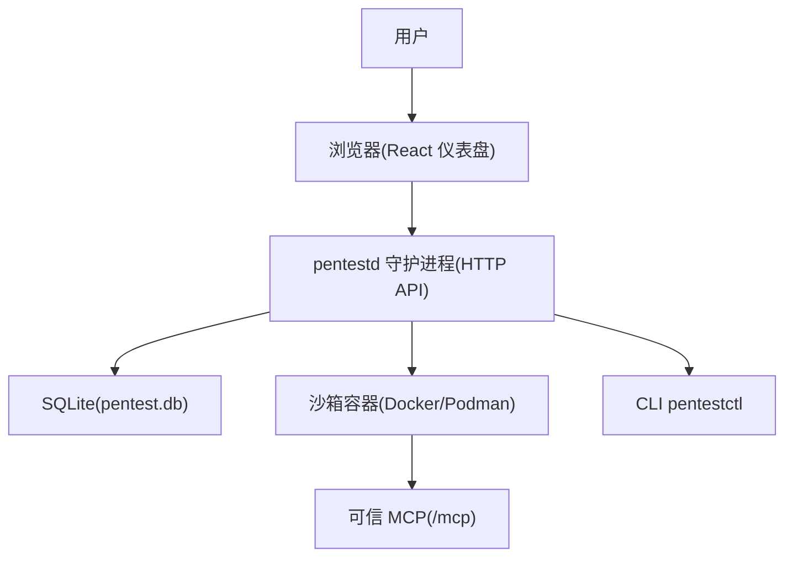
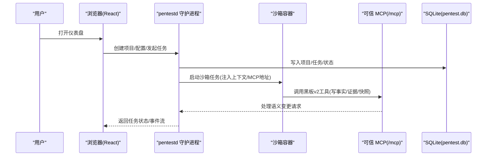
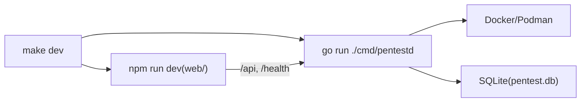

# 快速开始

<cite>
**本文引用的文件**
- [README.md](file://README.md)
- [Makefile](file://Makefile)
- [docker-compose.yaml](file://docker-compose.yaml)
- [cmd/pentestd/main.go](file://cmd/pentestd/main.go)
- [cmd/pentestctl/main.go](file://cmd/pentestctl/main.go)
- [internal/runner/mcp.go](file://internal/runner/mcp.go)
- [docker/pentest-sandbox/Dockerfile](file://docker/pentest-sandbox/Dockerfile)
</cite>

## 目录
1. [简介](#简介)
2. [项目结构](#项目结构)
3. [核心组件](#核心组件)
4. [架构总览](#架构总览)
5. [详细组件分析](#详细组件分析)
6. [依赖关系分析](#依赖关系分析)
7. [性能与资源建议](#性能与资源建议)
8. [故障排查指南](#故障排查指南)
9. [结论](#结论)
10. [附录：端到端命令清单](#附录端到端命令清单)

## 简介
CyberPenda 是一个本地优先的渗透测试代理，提供 Go 守护进程、React 仪表盘、沙箱化运行时（Codex/Claude Code/Pi）、项目范围控制、语义化 Blackboard v2、技能包与运行时扩展，以及 Markdown 报告生成。守护进程作为控制平面、记忆平面、任务生命周期与报告平面；受信任工具在选定的运行环境中执行，而非通过守护进程代理。

本快速开始指南将帮助你在 30 分钟内完成环境准备、安装、开发模式启动、Docker Compose 部署，并成功执行第一个任务。

## 项目结构
- cmd/pentestd：守护进程入口
- cmd/pentestctl：命令行客户端
- internal：领域服务、适配器、守护进程 HTTP、Runner、存储等
- web：React + Vite 仪表盘
- docker：守护进程与沙箱镜像构建文件
- skills/bundles：内置技能内容
- scripts：发布构建与在线冒烟脚本

图表来源
- [cmd/pentestd/main.go:22-103](file://cmd/pentestd/main.go#L22-L103)
- [docker-compose.yaml:6-31](file://docker-compose.yaml#L6-L31)
- [internal/runner/mcp.go:15-52](file://internal/runner/mcp.go#L15-L52)

章节来源
- [README.md:151-161](file://README.md#L151-L161)

## 核心组件
- 守护进程 pentestd：监听 HTTP API、MCP Server、嵌入式 UI、任务编排、持久化到 SQLite。
- React 仪表盘：项目管理、任务启动、Blackboard 视图、发现项、设置。
- 沙箱 Runner：默认隔离执行（Docker/Podman），可选 Host Runner（需显式启用）。
- 可信 MCP：六个 Blackboard v2 语义工具绑定到可信 Continuation。
- CLI pentestctl：离线 Store 或连接守护进程的同一套语义操作接口。
- 运行时插件：声明式适配器（Codex、Claude Code、Pi、fake）。
- 技能与扩展：运行时无关的技能包 + 运行时特定的扩展包。

章节来源
- [README.md:11-25](file://README.md#L11-L25)
- [cmd/pentestd/main.go:22-103](file://cmd/pentestd/main.go#L22-L103)
- [cmd/pentestctl/main.go:1-15](file://cmd/pentestctl/main.go#L1-L15)

## 架构总览
下图展示了从浏览器到守护进程、再到沙箱运行时的调用链，以及 MCP 可信工具的交互路径。

图表来源
- [cmd/pentestd/main.go:22-103](file://cmd/pentestd/main.go#L22-L103)
- [internal/runner/mcp.go:15-52](file://internal/runner/mcp.go#L15-L52)
- [docker-compose.yaml:6-31](file://docker-compose.yaml#L6-L31)

## 详细组件分析

### 守护进程与命令行参数
- 监听地址、数据库路径、运行时根目录、制品根、证据源根、沙箱镜像、容器 CLI、认证令牌、插件与扩展目录均可通过标志或环境变量配置。
- 非回环绑定需要认证令牌；API/MCP 路由支持 Authorization: Bearer 或 ?token=。

章节来源
- [cmd/pentestd/main.go:22-103](file://cmd/pentestd/main.go#L22-L103)
- [README.md:110-126](file://README.md#L110-L126)

### Docker Compose 部署
- 使用官方镜像，挂载数据卷与 Docker socket，暴露端口，健康检查。
- 必须设置 PENTEST_AUTH_TOKEN；可通过环境变量覆盖绑定地址、端口、镜像标签等。

章节来源
- [docker-compose.yaml:1-35](file://docker-compose.yaml#L1-L35)
- [README.md:56-70](file://README.md#L56-L70)

### 沙箱镜像与工具集
- 基于 Kali Linux，预装大量安全工具与 Node.js/Go/Python 环境。
- 集成 Codex、Claude Code、Pi 等 Agent SDK 及桥接程序。
- 预置 ProjectDiscovery 工具链、Nuclei 模板、JWT 工具、Chromium 与 agent-browser。
- 提供 host-proxy-only 入口脚本用于仅主机代理场景。

章节来源
- [docker/pentest-sandbox/Dockerfile:1-145](file://docker/pentest-sandbox/Dockerfile#L1-L145)

### 可信 MCP 与任务上下文
- 任务上下文包含项目/任务标识、MCP/API 地址、认证令牌、Provider、是否沙箱、范围快照等。
- 当在沙箱中运行时，API 地址自动解析为 host.docker.internal，确保容器内可达守护进程。
- 可为 Claude Code 生成 .mcp.json 配置文件以启用可信 MCP。

章节来源
- [internal/runner/mcp.go:15-52](file://internal/runner/mcp.go#L15-L52)
- [internal/runner/mcp.go:142-175](file://internal/runner/mcp.go#L142-L175)
- [internal/runner/mcp.go:377-412](file://internal/runner/mcp.go#L377-L412)

### CLI 能力（pentestctl）
- 支持离线 Store 模式或通过 --api/--token 连接守护进程。
- 常用子命令包括 blackboard change/read/history、evidence retain、attempt checkpoint、continuation finish 等。
- 部分命令需要任务上下文环境变量。

章节来源
- [cmd/pentestctl/main.go:1-15](file://cmd/pentestctl/main.go#L1-L15)
- [README.md:127-148](file://README.md#L127-L148)

## 依赖关系分析
- 守护进程依赖运行时抽象（Docker/Podman）、Provider Session 工厂、HTTP 路由与嵌入式 UI。
- 沙箱镜像依赖宿主 Docker/Podman 引擎，通过 socket 通信。
- 前端通过 Vite 开发服务器代理 /api 与 /health 到守护进程。

图表来源
- [Makefile:10-41](file://Makefile#L10-L41)
- [cmd/pentestd/main.go:22-103](file://cmd/pentestd/main.go#L22-L103)

章节来源
- [Makefile:1-98](file://Makefile#L1-L98)
- [README.md:34-54](file://README.md#L34-L54)

## 性能与资源建议
- 沙箱镜像体积较大，首次拉取/构建耗时较长，建议在稳定网络环境下进行。
- 本地开发时，Vite 热重载与后端并行启动，注意端口占用与防火墙规则。
- 生产部署建议使用只读数据卷与最小权限策略，避免不必要的特权提升。

[本节为通用指导，无需源码引用]

## 故障排查指南
- 无法访问仪表盘：确认守护进程已启动且 /health 返回正常；若启用了认证令牌，需在 URL 附加 token 查询参数或在请求头携带 Authorization。
- 沙箱无法连接守护进程：检查容器内是否能解析 host.docker.internal；确认 Docker socket 已正确挂载。
- 任务失败：查看任务详情中的运行活动与事件；必要时停止任务后重新发起。
- 认证错误：确认 PENTEST_AUTH_TOKEN 已设置且与请求一致；非回环绑定强制要求认证。

章节来源
- [docker-compose.yaml:14-27](file://docker-compose.yaml#L14-L27)
- [cmd/pentestd/main.go:90-103](file://cmd/pentestd/main.go#L90-L103)
- [internal/runner/mcp.go:44-52](file://internal/runner/mcp.go#L44-L52)

## 结论
通过本指南，你已完成 CyberPenda 的环境准备、开发与部署，并掌握了从项目创建到首个任务执行的完整流程。后续可进一步探索 Blackboard v2 语义系统、技能包与运行时扩展，以满足更复杂的渗透测试需求。

[本节为总结性内容，无需源码引用]

## 附录：端到端命令清单

- 环境准备
  - 安装 Go、Node.js 20+、Docker 或 Podman
  - 克隆仓库并进入项目目录

- 本地开发（推荐新手）
  - 安装 Git hooks：make install-git-hooks
  - 启动后端与前端：make dev
  - 打开浏览器访问 Vite 输出的地址（API 与 /health 由前端代理到 127.0.0.1:8787）

- 构建自包含守护进程
  - 构建 UI 并嵌入：make build-ui
  - 编译二进制：make build
  - 运行：./pentestd
  - 默认监听 http://127.0.0.1:8787

- Docker Compose 部署
  - 生成认证令牌：export PENTEST_AUTH_TOKEN="$(openssl rand -hex 24)"
  - 启动服务：docker compose up -d
  - 打开 http://127.0.0.1:8787/?token=<令牌>

- 自定义 Compose 选项
  - 绑定地址与端口：CYBERPENDA_BIND、CYBERPENDA_PORT
  - 镜像标签：CYBERPENDA_IMAGE_TAG
  - 沙箱镜像：PENTEST_SANDBOX_IMAGE
  - 容器 CLI：PENTEST_CONTAINER_CLI
  - 数据与运行根目录：PENTEST_DB、PENTEST_RUNTIME_ROOT

- 构建本地沙箱镜像
  - 默认标签：make build-sandbox-image
  - 自定义标签：SANDBOX_IMAGE=pentest-sandbox:dev make build-sandbox-image

- 典型工作流（从项目到任务）
  - 在仪表盘创建项目并定义范围
  - 配置全局模型提供者与 API Key 环境变量
  - 可选：配置运行时 Profile、凭据、MCP、技能
  - 选择运行时 + 模型提供者 + 模型，或使用高级预设，点击“Launch task”
  - 默认使用沙箱 Runner；可在任务进行中继续引导（steer）
  - 运行结束后，从语义黑板快照生成 Markdown 报告

- CLI 示例（pentestctl）
  - 离线模式：pentestctl --db pentest.db blackboard change --project <id> --actor-id <actor> --input change.json
  - 守护进程模式：pentestctl --api http://127.0.0.1:8787 --token <token> blackboard read --project <id> --actor-id <actor> --key entity:example
  - 其他常用命令：history、evidence retain、attempt checkpoint、continuation finish

章节来源
- [README.md:26-92](file://README.md#L26-L92)
- [README.md:94-109](file://README.md#L94-L109)
- [README.md:110-148](file://README.md#L110-L148)
- [Makefile:43-56](file://Makefile#L43-L56)
- [docker-compose.yaml:1-35](file://docker-compose.yaml#L1-L35)