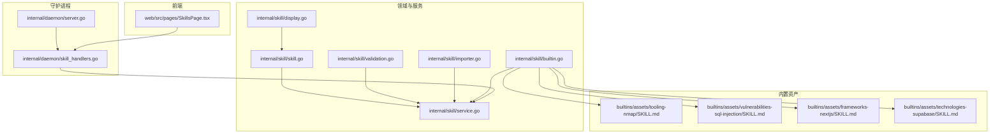
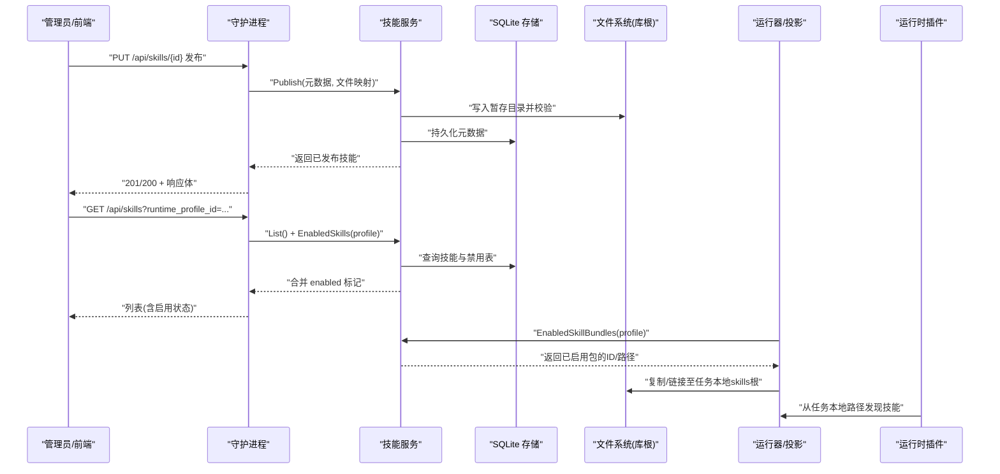
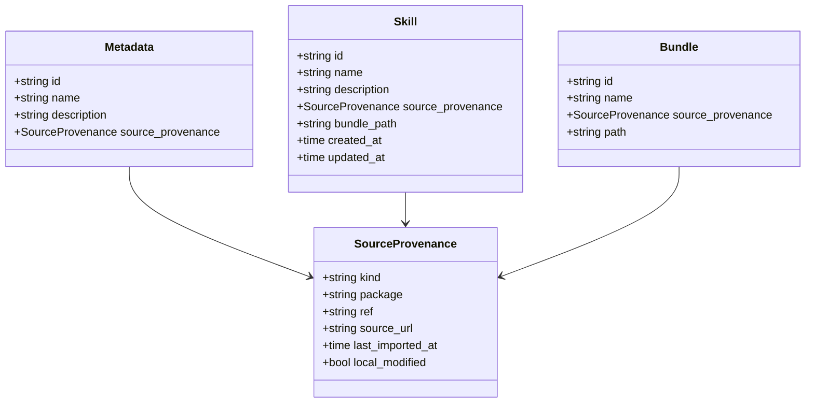
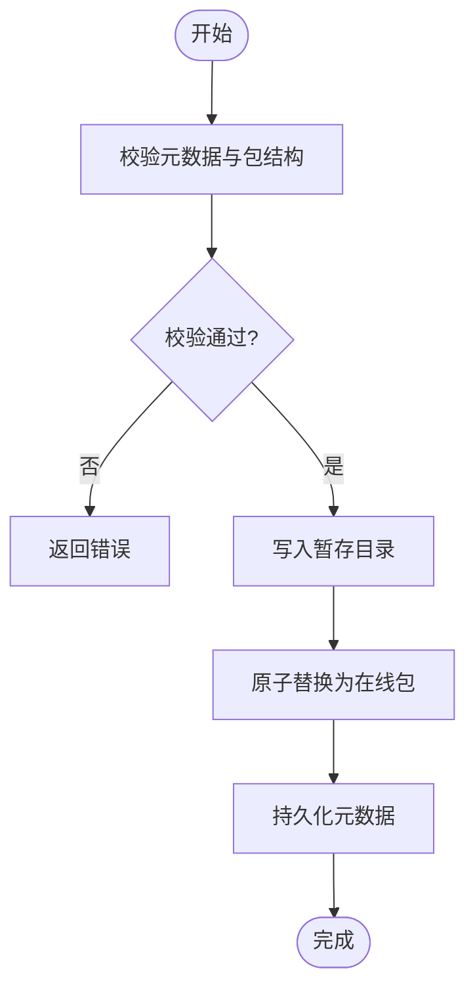
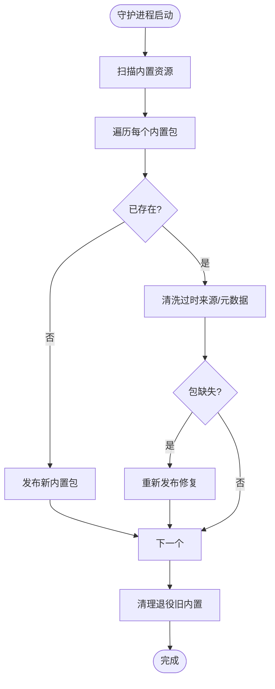
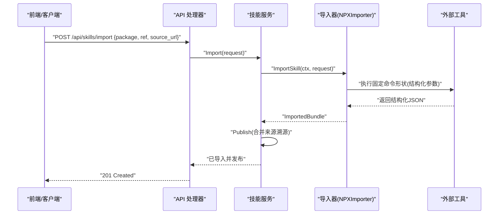
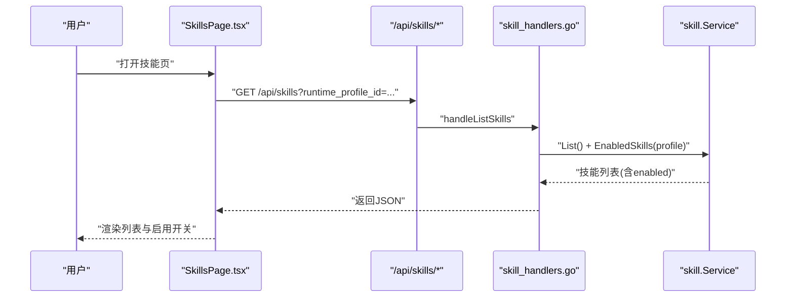
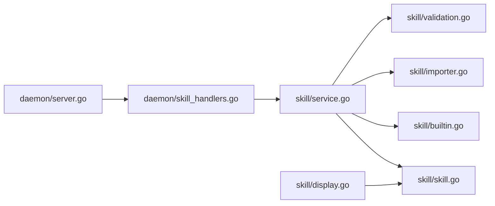

# 技能系统

<cite>
**本文引用的文件**   
- [README.md](file://README.md)
- [CONTEXT.md](file://CONTEXT.md)
- [2026-06-20-skills-management-implementation.md](file://plan/2026-06-20-skills-management-implementation.md)
- [skill.go](file://internal/skill/skill.go)
- [service.go](file://internal/skill/service.go)
- [builtin.go](file://internal/skill/builtin.go)
- [importer.go](file://internal/skill/importer.go)
- [validation.go](file://internal/skill/validation.go)
- [display.go](file://internal/skill/display.go)
- [server.go](file://internal/daemon/server.go)
- [skill_handlers.go](file://internal/daemon/skill_handlers.go)
- [SkillsPage.tsx](file://web/src/pages/SkillsPage.tsx)
- [tooling-nmap SKILL.md](file://internal/skill/builtins/assets/tooling-nmap/SKILL.md)
- [vulnerabilities-sql-injection SKILL.md](file://internal/skill/builtins/assets/vulnerabilities-sql-injection/SKILL.md)
- [frameworks-nextjs SKILL.md](file://internal/skill/builtins/assets/frameworks-nextjs/SKILL.md)
- [technologies-supabase SKILL.md](file://internal/skill/builtins/assets/technologies-supabase/SKILL.md)
</cite>

## 目录
1. [简介](#简介)
2. [项目结构](#项目结构)
3. [核心组件](#核心组件)
4. [架构总览](#架构总览)
5. [详细组件分析](#详细组件分析)
6. [依赖关系分析](#依赖关系分析)
7. [性能与可扩展性](#性能与可扩展性)
8. [故障排查指南](#故障排查指南)
9. [结论](#结论)
10. [附录](#附录)

## 简介
本文件系统化阐述 CyberPenda 的“技能（Skill）”体系：技能包的结构设计、内置技能分类、发现机制、依赖管理与版本控制、预置技能使用示例、配置选项与扩展方法，以及打包、分发与集成的最佳实践。技能是全局、运行时无关的可复用知识包，默认对运行时配置文件启用，支持按配置项选择性禁用；任务启动时会将已启用的技能投影到任务本地边界，供各运行时插件按需发现与消费。

## 项目结构
技能系统由领域模型、服务层、HTTP API、前端页面与内置资产组成，并与守护进程初始化流程集成。

图示来源
- [skill.go:1-47](file://internal/skill/skill.go#L1-L47)
- [service.go:1-458](file://internal/skill/service.go#L1-L458)
- [validation.go:1-79](file://internal/skill/validation.go#L1-L79)
- [importer.go:1-47](file://internal/skill/importer.go#L1-L47)
- [builtin.go:1-360](file://internal/skill/builtin.go#L1-L360)
- [display.go:1-38](file://internal/skill/display.go#L1-L38)
- [server.go:126-169](file://internal/daemon/server.go#L126-L169)
- [skill_handlers.go:1-221](file://internal/daemon/skill_handlers.go#L1-L221)
- [SkillsPage.tsx:51-758](file://web/src/pages/SkillsPage.tsx#L51-L758)
- [tooling-nmap SKILL.md:1-67](file://internal/skill/builtins/assets/tooling-nmap/SKILL.md#L1-L67)
- [vulnerabilities-sql-injection SKILL.md:1-191](file://internal/skill/builtins/assets/vulnerabilities-sql-injection/SKILL.md#L1-L191)
- [frameworks-nextjs SKILL.md:1-229](file://internal/skill/builtins/assets/frameworks-nextjs/SKILL.md#L1-L229)
- [technologies-supabase SKILL.md:1-269](file://internal/skill/builtins/assets/technologies-supabase/SKILL.md#L1-L269)

章节来源
- [README.md:1-173](file://README.md#L1-L173)
- [CONTEXT.md:1079-1278](file://CONTEXT.md#L1079-L1278)
- [2026-06-20-skills-management-implementation.md:1-385](file://plan/2026-06-20-skills-management-implementation.md#L1-L385)

## 核心组件
- 领域模型与显示适配
  - 元数据、来源溯源、技能实体、包视图等类型定义，提供对外展示时的前缀剥离逻辑。
- 服务层
  - 发布、导入、列表、详情、文件读取、按配置项启用/禁用、删除、路径解析、原子化发布与回滚保障。
- 验证器
  - 校验 ID 格式、名称必填、包根目录存在、SKILL.md 指令文档存在且非软链、路径安全与防逃逸。
- 受控导入器
  - 通过固定命令形状调用外部工具，结构化参数传入，拒绝任意 shell 注入。
- 内置技能安装与修复
  - 扫描嵌入资源、迁移旧 ID、清理退役条目、修复缺失包与过时上游标记。
- HTTP API
  - 列出/获取/发布/导入/删除技能，管理按配置项的启用状态，屏蔽敏感字段输出。
- 前端页面
  - 技能管理页：列表、详情、发布、导入、按配置项启用/禁用、删除、校验提示。

章节来源
- [skill.go:1-47](file://internal/skill/skill.go#L1-L47)
- [service.go:1-458](file://internal/skill/service.go#L1-L458)
- [validation.go:1-79](file://internal/skill/validation.go#L1-L79)
- [importer.go:1-47](file://internal/skill/importer.go#L1-L47)
- [builtin.go:1-360](file://internal/skill/builtin.go#L1-L360)
- [display.go:1-38](file://internal/skill/display.go#L1-L38)
- [skill_handlers.go:1-221](file://internal/daemon/skill_handlers.go#L1-L221)
- [SkillsPage.tsx:51-758](file://web/src/pages/SkillsPage.tsx#L51-L758)

## 架构总览
技能系统在守护进程启动时完成内置技能的安装与注册，随后通过 HTTP API 暴露管理能力；任务启动阶段将已启用的技能投影到任务本地目录，供运行时插件发现。

图示来源
- [server.go:126-169](file://internal/daemon/server.go#L126-L169)
- [skill_handlers.go:1-221](file://internal/daemon/skill_handlers.go#L1-L221)
- [service.go:1-458](file://internal/skill/service.go#L1-L458)

## 详细组件分析

### 领域模型与显示适配
- 关键类型
  - 元数据：包含稳定 ID、名称、描述、来源溯源信息。
  - 来源溯源：记录来源种类、包名、引用、来源 URL、最近导入时间、是否本地修改等。
  - 技能实体：在元数据基础上增加创建/更新时间、包路径等。
  - 包视图：用于向运行期暴露的轻量视图。
- 显示适配
  - 对外展示时对内置来源的前缀进行剥离，保证用户界面简洁一致。

图示来源
- [skill.go:1-47](file://internal/skill/skill.go#L1-L47)
- [display.go:1-38](file://internal/skill/display.go#L1-L38)

章节来源
- [skill.go:1-47](file://internal/skill/skill.go#L1-L47)
- [display.go:1-38](file://internal/skill/display.go#L1-L38)

### 服务层：发布、导入、启用/禁用、删除
- 发布
  - 校验元数据与包结构，写入暂存目录，校验通过后原子替换为“在线”包，更新数据库元数据。
- 导入
  - 通过注入的导入器执行固定命令形状，接收结构化 JSON 结果后走发布流程，保留来源溯源。
- 启用/禁用
  - 默认全部启用；通过“按配置项禁用表”实现细粒度控制；查询时以“所有技能减去禁用项”计算有效集合。
- 删除
  - 若仍有配置项处于启用状态则阻止删除；支持强制删除并清理关联禁用记录与包文件。
- 文件访问
  - 遍历包目录，禁止软链与路径逃逸，仅返回合法相对路径的文件内容。

图示来源
- [service.go:57-113](file://internal/skill/service.go#L57-L113)
- [validation.go:23-79](file://internal/skill/validation.go#L23-L79)

章节来源
- [service.go:1-458](file://internal/skill/service.go#L1-L458)
- [validation.go:1-79](file://internal/skill/validation.go#L1-L79)

### 内置技能：安装、迁移与修复
- 安装
  - 扫描嵌入资源，解析每个包的 SKILL.md 前置元信息，生成元数据与文件映射，未存在的直接发布。
- 迁移
  - 兼容历史 ID 前缀，自动迁移元数据与禁用表中的引用，必要时重命名包目录。
- 清理
  - 清理退役的旧内置技能，并将它们的禁用策略迁移到后继者或彻底移除。
- 修复
  - 若检测到包缺失或上游标记过时，自动修复元数据与包内容。

图示来源
- [builtin.go:66-103](file://internal/skill/builtin.go#L66-L103)
- [builtin.go:164-234](file://internal/skill/builtin.go#L164-L234)

章节来源
- [builtin.go:1-360](file://internal/skill/builtin.go#L1-L360)

### 受控导入器：安全边界
- 输入约束
  - 必须提供包名，可选 ref 与来源 URL；拒绝原始命令字符串。
- 执行模型
  - 使用固定命令形状与结构化参数，避免任意 shell 注入风险。
- 结果处理
  - 解析结构化 JSON 返回，填充来源溯源并进入发布流程。

图示来源
- [importer.go:1-47](file://internal/skill/importer.go#L1-L47)
- [service.go:115-142](file://internal/skill/service.go#L115-L142)
- [skill_handlers.go:111-137](file://internal/daemon/skill_handlers.go#L111-L137)

章节来源
- [importer.go:1-47](file://internal/skill/importer.go#L1-L47)
- [service.go:115-142](file://internal/skill/service.go#L115-L142)
- [skill_handlers.go:111-137](file://internal/daemon/skill_handlers.go#L111-L137)

### HTTP API 与前端集成
- 路由能力
  - 列出/获取/发布/导入/删除技能；按配置项设置启用/禁用。
- 安全与可见性
  - 内置来源对外隐藏敏感字段；内置包详情过滤上游标记文件。
- 前端页面
  - 提供技能管理界面，支持列表、详情、发布、导入、按配置项启用/禁用、删除与校验提示。

图示来源
- [skill_handlers.go:31-60](file://internal/daemon/skill_handlers.go#L31-L60)
- [service.go:155-282](file://internal/skill/service.go#L155-L282)
- [SkillsPage.tsx:77-80](file://web/src/pages/SkillsPage.tsx#L77-L80)

章节来源
- [skill_handlers.go:1-221](file://internal/daemon/skill_handlers.go#L1-L221)
- [service.go:155-282](file://internal/skill/service.go#L155-L282)
- [SkillsPage.tsx:51-758](file://web/src/pages/SkillsPage.tsx#L51-L758)

### 内置技能分类与示例
- 工具类（tooling-*）
  - 示例：nmap 扫描工作流、端口探测与安全基线用法。
- 漏洞类（vulnerabilities-*）
  - 示例：SQL 注入测试方法论、绕过技巧与验证要求。
- 框架类（frameworks-*）
  - 示例：Next.js 安全测试要点（中间件、Server Actions、RSC、缓存边界）。
- 技术类（technologies-*）
  - 示例：Supabase RLS、PostgREST、GraphQL、Storage、Edge Functions 的安全测试。

章节来源
- [tooling-nmap SKILL.md:1-67](file://internal/skill/builtins/assets/tooling-nmap/SKILL.md#L1-L67)
- [vulnerabilities-sql-injection SKILL.md:1-191](file://internal/skill/builtins/assets/vulnerabilities-sql-injection/SKILL.md#L1-L191)
- [frameworks-nextjs SKILL.md:1-229](file://internal/skill/builtins/assets/frameworks-nextjs/SKILL.md#L1-L229)
- [technologies-supabase SKILL.md:1-269](file://internal/skill/builtins/assets/technologies-supabase/SKILL.md#L1-L269)

## 依赖关系分析
- 组件耦合
  - 守护进程初始化依赖技能服务；技能服务依赖存储与文件系统；导入器通过接口解耦外部工具。
- 外部依赖
  - SQLite 存储元数据；文件系统作为包仓库；外部工具（如 npx）通过固定命令形状被调用。
- 潜在循环
  - 当前无循环依赖；导入器与技能服务通过接口隔离。

图示来源
- [server.go:126-169](file://internal/daemon/server.go#L126-L169)
- [skill_handlers.go:1-221](file://internal/daemon/skill_handlers.go#L1-L221)
- [service.go:1-458](file://internal/skill/service.go#L1-L458)
- [validation.go:1-79](file://internal/skill/validation.go#L1-L79)
- [importer.go:1-47](file://internal/skill/importer.go#L1-L47)
- [builtin.go:1-360](file://internal/skill/builtin.go#L1-L360)
- [skill.go:1-47](file://internal/skill/skill.go#L1-L47)
- [display.go:1-38](file://internal/skill/display.go#L1-L38)

章节来源
- [server.go:126-169](file://internal/daemon/server.go#L126-L169)
- [skill_handlers.go:1-221](file://internal/daemon/skill_handlers.go#L1-L221)
- [service.go:1-458](file://internal/skill/service.go#L1-L458)

## 性能与可扩展性
- 发布原子性与回滚
  - 通过暂存目录与原子替换降低并发写冲突与不一致风险。
- 列表与启用计算
  - 采用“全量减禁用”的计算方式，避免为每个配置项枚举默认启用，提升查询效率。
- 导入器扩展
  - 通过导入器接口可替换不同来源的实现，便于引入新的受控渠道。
- 文件访问优化
  - 读取包文件时进行路径与软链校验，避免不安全访问带来的额外开销。

[本节为通用指导，不直接分析具体文件]

## 故障排查指南
- 常见错误
  - 无效技能：ID 格式不正确、缺少名称、包根不存在、缺少 SKILL.md、包含软链或路径逃逸。
  - 未找到：请求的技能不存在。
  - 已启用：尝试删除仍在配置项中启用的技能。
- 定位建议
  - 检查发布流程日志与返回码；确认暂存目录与在线目录权限；核对数据库元数据一致性。
  - 导入失败时查看外部工具的标准错误输出；确认命令形状与参数合法性。
  - 前端页面报错时对照 API 返回的错误消息与状态码。

章节来源
- [skill_handlers.go:200-211](file://internal/daemon/skill_handlers.go#L200-L211)
- [service.go:301-356](file://internal/skill/service.go#L301-L356)
- [validation.go:13-79](file://internal/skill/validation.go#L13-L79)

## 结论
技能系统以“全局默认启用 + 按配置项禁用”为核心策略，结合严格的包结构与路径安全校验、原子发布与来源溯源，提供了安全可控、易于扩展的技能生命周期管理。通过受控导入器与内置技能安装修复机制，既保证了开箱即用，又保留了灵活演进空间。任务本地投影确保运行时边界清晰，便于多运行时生态统一消费。

[本节为总结性内容，不直接分析具体文件]

## 附录

### 技能包结构设计
- 必备元素
  - 包根目录：以稳定的技能 ID 命名。
  - 指令文档：SKILL.md，位于包根，不可为软链。
  - 其他文件：任意相对路径文件，需通过路径安全校验。
- 元数据
  - ID、名称、描述、来源溯源（种类、包名、引用、来源 URL、最近导入时间、是否本地修改）。
- 显示适配
  - 对外展示时去除内置来源前缀，保持界面一致性。

章节来源
- [skill.go:1-47](file://internal/skill/skill.go#L1-L47)
- [validation.go:23-79](file://internal/skill/validation.go#L23-L79)
- [display.go:1-38](file://internal/skill/display.go#L1-L38)

### 发现机制与任务本地投影
- 发现
  - 守护进程启动时安装内置技能；运行时通过“已启用技能包列表”发现可用技能。
- 投影
  - 任务启动时将已启用技能复制到任务本地目录，并通过运行时插件的特定路径暴露给代理。

章节来源
- [builtin.go:66-103](file://internal/skill/builtin.go#L66-L103)
- [service.go:284-299](file://internal/skill/service.go#L284-L299)
- [2026-06-20-skills-management-implementation.md:246-278](file://plan/2026-06-20-skills-management-implementation.md#L246-L278)

### 依赖管理与版本控制
- 来源溯源
  - 记录来源种类、包名、引用、来源 URL、最近导入时间与本地修改标志，便于审计与追踪。
- 版本策略
  - 基于稳定 ID 的版本演进；导入时保留引用；更新时覆盖元数据与包内容，同时维护时间戳。

章节来源
- [skill.go:16-23](file://internal/skill/skill.go#L16-L23)
- [service.go:382-403](file://internal/skill/service.go#L382-L403)
- [importer.go:18-46](file://internal/skill/importer.go#L18-L46)

### 预置技能使用示例
- 工具类：参考 nmap 技能的工作流与基线用法。
- 漏洞类：参考 SQL 注入测试的方法论与验证要求。
- 框架类：参考 Next.js 安全测试要点。
- 技术类：参考 Supabase 的多面攻击面与验证步骤。

章节来源
- [tooling-nmap SKILL.md:1-67](file://internal/skill/builtins/assets/tooling-nmap/SKILL.md#L1-L67)
- [vulnerabilities-sql-injection SKILL.md:1-191](file://internal/skill/builtins/assets/vulnerabilities-sql-injection/SKILL.md#L1-L191)
- [frameworks-nextjs SKILL.md:1-229](file://internal/skill/builtins/assets/frameworks-nextjs/SKILL.md#L1-L229)
- [technologies-supabase SKILL.md:1-269](file://internal/skill/builtins/assets/technologies-supabase/SKILL.md#L1-L269)

### 配置选项与扩展方法
- 守护进程初始化
  - 技能库根路径默认与数据库同目录下的 skills；内存数据库时使用临时目录。
  - 默认启用内置技能；可通过配置关闭。
  - 导入器默认使用受控实现，也可注入自定义导入器。
- 前端扩展
  - Skills 页面提供完整的增删改查与启用/禁用操作，可作为二次开发基础。

章节来源
- [server.go:136-163](file://internal/daemon/server.go#L136-L163)
- [SkillsPage.tsx:51-758](file://web/src/pages/SkillsPage.tsx#L51-L758)

### 打包、分发与集成最佳实践
- 打包
  - 确保包根目录与 SKILL.md 存在；避免软链与路径逃逸；合理组织辅助文件。
- 分发
  - 通过受控导入器发布；保留来源溯源以便审计；遵循稳定 ID 策略。
- 集成
  - 在守护进程启动时安装内置技能；任务启动时投影到任务本地；前端提供管理入口。

章节来源
- [validation.go:23-79](file://internal/skill/validation.go#L23-L79)
- [builtin.go:66-103](file://internal/skill/builtin.go#L66-L103)
- [service.go:57-113](file://internal/skill/service.go#L57-L113)
- [2026-06-20-skills-management-implementation.md:1-385](file://plan/2026-06-20-skills-management-implementation.md#L1-L385)