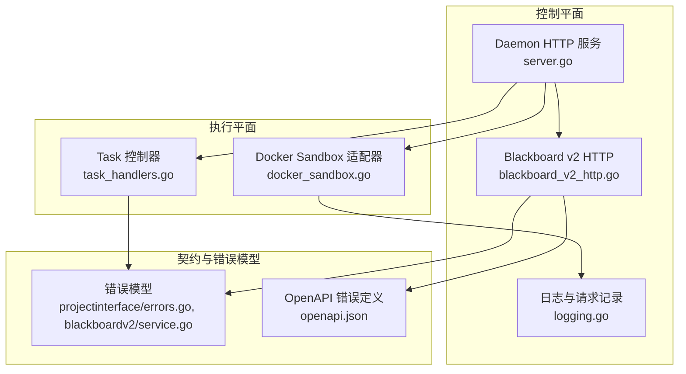
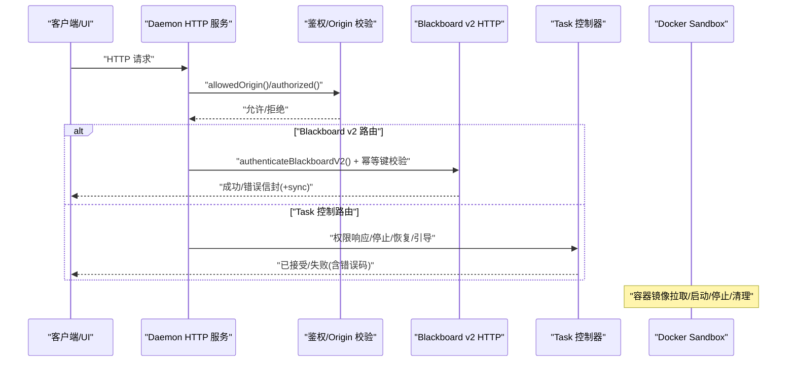
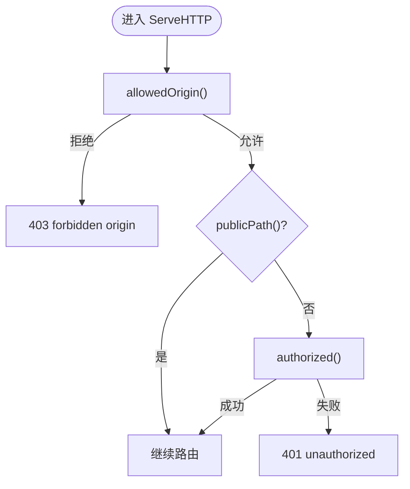
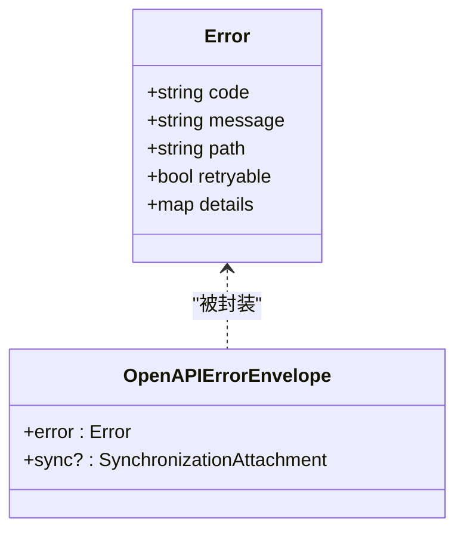
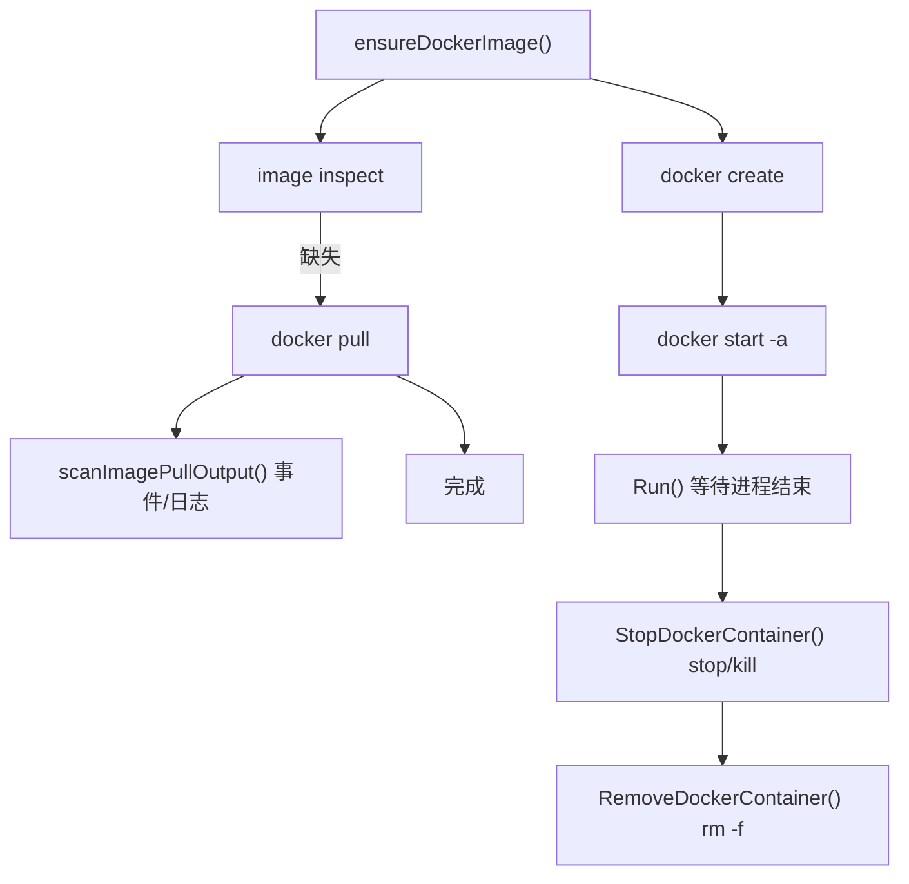
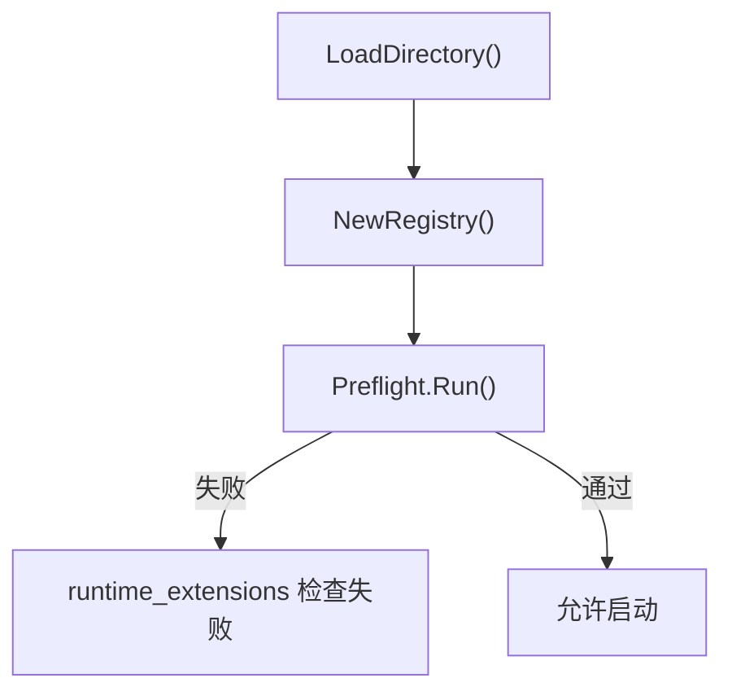
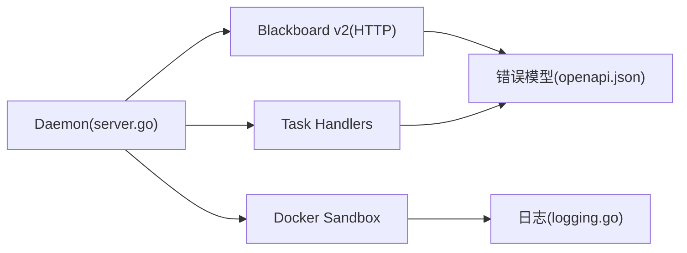

# 故障排除

<cite>
**本文引用的文件**   
- [README.md](file://README.md)
- [server.go](file://internal/daemon/server.go)
- [logging.go](file://internal/daemon/logging.go)
- [blackboard_v2_http.go](file://internal/daemon/blackboard_v2_http.go)
- [docker_sandbox.go](file://internal/runtime/docker_sandbox.go)
- [task_handlers.go](file://internal/daemon/task_handlers.go)
- [v2_test.go](file://internal/mcpserver/v2_test.go)
- [preflight_test.go](file://internal/preflight/preflight_test.go)
- [extension_test.go](file://internal/runtimeextension/extension_test.go)
- [projectinterface/errors.go](file://internal/projectinterface/errors.go)
- [blackboardv2/service.go](file://internal/blackboardv2/service.go)
- [openapi.json](file://internal/blackboardv2contract/contractdata/openapi.json)
</cite>

## 目录
1. [简介](#简介)
2. [项目结构](#项目结构)
3. [核心组件](#核心组件)
4. [架构总览](#架构总览)
5. [详细组件分析](#详细组件分析)
6. [依赖关系分析](#依赖关系分析)
7. [性能与容量问题](#性能与容量问题)
8. [故障排查指南](#故障排查指南)
9. [错误码参考](#错误码参考)
10. [已知问题与临时方案](#已知问题与临时方案)
11. [社区支持与反馈流程](#社区支持与反馈流程)
12. [结论](#结论)

## 简介
本指南面向本地优先的渗透测试代理（Go daemon + React dashboard + sandboxed runtimes）的运维与使用者，聚焦安装、配置、运行时异常与性能问题的系统化排查。文档覆盖日志分析技巧、调试工具使用、诊断方法、错误码参考、已知问题与临时方案，以及社区支持渠道和问题反馈流程。

## 项目结构
- 控制平面：pentestd HTTP 服务层，负责路由、鉴权、任务生命周期、MCP Server、Blackboard v2 接口、UI 静态资源。
- 记忆平面：Blackboard v2 语义系统，提供实体/关系/证据/发现/Continuation 生命周期、健康诊断、投影合并等能力。
- 执行平面：Runtime/Sandbox 运行时，Docker/Podman 容器隔离，Runtime Plugin 声明式适配器（Codex/Claude Code/Pi），Profile 解析，Extension Pack 加载。
- 其他模块：Skills、Model Provider、CLI（pentestctl）、Web 前端。

图表来源
- [server.go:587-643](file://internal/daemon/server.go#L587-L643)
- [blackboard_v2_http.go:29-46](file://internal/daemon/blackboard_v2_http.go#L29-L46)
- [logging.go:76-87](file://internal/daemon/logging.go#L76-L87)
- [docker_sandbox.go:111-231](file://internal/runtime/docker_sandbox.go#L111-L231)
- [task_handlers.go:2652-2675](file://internal/daemon/task_handlers.go#L2652-L2675)
- [projectinterface/errors.go:68-85](file://internal/projectinterface/errors.go#L68-L85)
- [blackboardv2/service.go:617-630](file://internal/blackboardv2/service.go#L617-L630)
- [openapi.json:871-927](file://internal/blackboardv2contract/contractdata/openapi.json#L871-L927)

章节来源
- [README.md:11-24](file://README.md#L11-L24)
- [server.go:38-81](file://internal/daemon/server.go#L38-L81)

## 核心组件
- Daemon HTTP 服务：统一入口、鉴权中间件、路由注册、健康检查、CORS 预检、静态资源放行、DNS 重绑定防护。
- Blackboard v2 HTTP：统一的认证与授权（Operator 或 Continuation Interface Grant）、幂等键校验、同步附件、条件响应（ETag/If-None-Match）、错误信封映射。
- Docker Sandbox：镜像拉取、网络要求校验、容器创建/启动/停止/清理、输出扫描与元数据记录、事件发射。
- Task 控制器：权限响应处理、会话状态冲突、关闭态处理、事件持久化。
- 错误模型：结构化错误对象（code/message/path/retryable/details），HTTP 状态映射，OpenAPI 契约。

章节来源
- [server.go:383-411](file://internal/daemon/server.go#L383-L411)
- [blackboard_v2_http.go:52-95](file://internal/daemon/blackboard_v2_http.go#L52-L95)
- [docker_sandbox.go:233-283](file://internal/runtime/docker_sandbox.go#L233-L283)
- [task_handlers.go:2652-2675](file://internal/daemon/task_handlers.go#L2652-L2675)
- [projectinterface/errors.go:68-85](file://internal/projectinterface/errors.go#L68-L85)
- [blackboardv2/service.go:617-630](file://internal/blackboardv2/service.go#L617-L630)

## 架构总览
下图展示关键交互：客户端通过 HTTP/MCP 访问 Daemon；Daemon 进行 Origin 校验与鉴权后路由到 Blackboard v2 或 Task 控制器；Sandbox 在容器内运行并回传事件；错误以结构化信封返回，必要时携带同步附件。

图表来源
- [server.go:518-534](file://internal/daemon/server.go#L518-L534)
- [server.go:435-461](file://internal/daemon/server.go#L435-L461)
- [blackboard_v2_http.go:97-125](file://internal/daemon/blackboard_v2_http.go#L97-L125)
- [task_handlers.go:2652-2675](file://internal/daemon/task_handlers.go#L2652-L2675)
- [docker_sandbox.go:111-231](file://internal/runtime/docker_sandbox.go#L111-L231)

## 详细组件分析

### Daemon 安全与鉴权
- DNS 重绑定防护：拒绝非回环且非 host.docker.internal 的 Origin，避免跨站/重绑定攻击。
- 鉴权策略：支持 Authorization: Bearer 或 ?token=；对 Blackboard v2 HTTP 和 MCP 额外支持 Project Interface Grant。
- 公开路径：/health、CORS 预检、SPA 静态资源可匿名访问。

图表来源
- [server.go:383-411](file://internal/daemon/server.go#L383-L411)
- [server.go:518-534](file://internal/daemon/server.go#L518-L534)
- [server.go:435-461](file://internal/daemon/server.go#L435-L461)
- [server.go:467-501](file://internal/daemon/server.go#L467-L501)

章节来源
- [server.go:383-411](file://internal/daemon/server.go#L383-L411)
- [server.go:518-534](file://internal/daemon/server.go#L518-L534)
- [server.go:435-461](file://internal/daemon/server.go#L435-L461)
- [server.go:467-501](file://internal/daemon/server.go#L467-L501)

### Blackboard v2 HTTP 错误与同步
- 错误信封：包含 code/message/path/retryable/details，HTTP 状态由代码映射决定。
- 幂等键：所有写操作必须携带 Idempotency-Key，否则返回 invalid_schema。
- 同步附件：某些错误/成功响应可能附带 sync，用于重试/重放一致性。
- 条件响应：GET 支持 ETag/If-None-Match，304 不携带错误信封。

图表来源
- [blackboardv2/service.go:617-630](file://internal/blackboardv2/service.go#L617-L630)
- [openapi.json:871-927](file://internal/blackboardv2contract/contractdata/openapi.json#L871-L927)

章节来源
- [blackboard_v2_http.go:539-584](file://internal/daemon/blackboard_v2_http.go#L539-L584)
- [blackboard_v2_http.go:612-643](file://internal/daemon/blackboard_v2_http.go#L612-L643)
- [v2_test.go:726-758](file://internal/mcpserver/v2_test.go#L726-L758)

### Docker Sandbox 生命周期与排障
- 镜像拉取：inspect 缺失则 pull，进度通过事件与日志输出。
- 网络要求：确保内部网络存在且驱动/隔离属性符合预期。
- 容器管理：create/start/-a，stop/kill 优雅退出，rm -f 清理。
- 输出扫描：stdout/stderr 行级扫描，提取 NativeSessionMetadata，敏感信息脱敏。

图表来源
- [docker_sandbox.go:233-283](file://internal/runtime/docker_sandbox.go#L233-L283)
- [docker_sandbox.go:365-428](file://internal/runtime/docker_sandbox.go#L365-L428)
- [docker_sandbox.go:430-504](file://internal/runtime/docker_sandbox.go#L430-L504)
- [docker_sandbox.go:111-231](file://internal/runtime/docker_sandbox.go#L111-L231)

章节来源
- [docker_sandbox.go:111-231](file://internal/runtime/docker_sandbox.go#L111-L231)
- [docker_sandbox.go:233-283](file://internal/runtime/docker_sandbox.go#L233-L283)
- [docker_sandbox.go:365-428](file://internal/runtime/docker_sandbox.go#L365-L428)
- [docker_sandbox.go:430-504](file://internal/runtime/docker_sandbox.go#L430-L504)

### Runtime Extension 兼容性检查
- 扩展清单加载：从可信目录读取 JSON 清单，构建 Registry。
- 兼容性校验：仅与指定 Runtime Plugins 兼容，预检失败会阻止启动。
- 未知引用：未注册的本地扩展 ID 会被拒绝。

图表来源
- [extension_test.go:12-54](file://internal/runtimeextension/extension_test.go#L12-L54)
- [preflight_test.go:642-686](file://internal/preflight/preflight_test.go#L642-L686)

章节来源
- [extension_test.go:12-54](file://internal/runtimeextension/extension_test.go#L12-L54)
- [preflight_test.go:642-686](file://internal/preflight/preflight_test.go#L642-L686)

## 依赖关系分析
- Daemon 依赖 Blackboard v2、Task、Runtime、Skill、Model Provider、Project Interface Grants。
- Blackboard v2 HTTP 将领域错误映射为 HTTP 状态与错误信封，必要时附加同步信息。
- Docker Sandbox 作为外部依赖（docker/podman CLI）的生命周期包装器，事件与日志经 Daemon 记录。

图表来源
- [server.go:587-643](file://internal/daemon/server.go#L587-L643)
- [blackboard_v2_http.go:29-46](file://internal/daemon/blackboard_v2_http.go#L29-L46)
- [openapi.json:871-927](file://internal/blackboardv2contract/contractdata/openapi.json#L871-L927)
- [logging.go:76-87](file://internal/daemon/logging.go#L76-L87)

章节来源
- [server.go:587-643](file://internal/daemon/server.go#L587-L643)
- [blackboard_v2_http.go:29-46](file://internal/daemon/blackboard_v2_http.go#L29-L46)
- [openapi.json:871-927](file://internal/blackboardv2contract/contractdata/openapi.json#L871-L927)
- [logging.go:76-87](file://internal/daemon/logging.go#L76-L87)

## 性能与容量问题
- SQLite 并发锁：当出现“database is locked/busy”时，错误映射为 storage_busy，HTTP 返回 503 并带 Retry-After。建议降低并发写入、优化批量变更、避免长时间事务。
- 大请求体限制：Blackboard v2 输入上限为 4 MiB，超出返回 invalid_schema。
- UI 高频轮询：/events、/transcript、/timeline 及任务详情 GET 被抑制成功日志以减少噪音，但错误仍记录。

章节来源
- [blackboard_v2_http.go:564-584](file://internal/daemon/blackboard_v2_http.go#L564-L584)
- [blackboard_v2_http.go:473-493](file://internal/daemon/blackboard_v2_http.go#L473-L493)
- [logging.go:16-45](file://internal/daemon/logging.go#L16-L45)

## 故障排查指南

### 安装与环境
- 前置条件：Go、Node.js 20+、Docker 或 Podman。
- 默认监听地址：http://127.0.0.1:8787。
- Docker Compose：需设置 PENTEST_AUTH_TOKEN，非回环绑定强制鉴权。
- 沙箱镜像：可通过 SANDBOX_IMAGE 或 PENTEST_SANDBOX_IMAGE 覆盖。

章节来源
- [README.md:28-81](file://README.md#L28-L81)
- [README.md:110-126](file://README.md#L110-L126)

### 配置错误
- 非回环绑定未设置 auth token：启动失败，提示需要 -auth-token 或 PENTEST_AUTH_TOKEN。
- 自定义参数冲突：创建 Runtime Profile 时若自定义参数与结构化字段冲突，返回 400 并命名具体参数与字段，且不持久化该配置。
- 扩展不兼容或未注册：预检失败，runtime_extensions 检查项失败。

章节来源
- [server.go:179-185](file://internal/daemon/server.go#L179-L185)
- [custom_args_conflict_test.go:34-59](file://internal/daemon/custom_args_conflict_test.go#L34-L59)
- [preflight_test.go:642-686](file://internal/preflight/preflight_test.go#L642-L686)
- [extension_test.go:12-54](file://internal/runtimeextension/extension_test.go#L12-L54)

### 运行时异常
- 容器镜像拉取失败：查看 image_pull_failed 事件与日志，确认镜像名与网络可达性。
- 容器启动失败：检查 container_starting 与 start sandbox container 错误；确认 docker/podman 可用与权限。
- 容器停止/清理失败：stop_failed/cleanup_failed 事件，确认容器是否已被外部移除。
- 权限响应失败：errorCode 可能为 session_closed/control_conflict/server_closing，对应会话关闭、控制冲突或服务关闭。

章节来源
- [docker_sandbox.go:233-283](file://internal/runtime/docker_sandbox.go#L233-L283)
- [docker_sandbox.go:111-231](file://internal/runtime/docker_sandbox.go#L111-L231)
- [task_handlers.go:2652-2675](file://internal/daemon/task_handlers.go#L2652-L2675)

### 黑屏板 v2 错误
- 常见错误码：invalid_schema、authority_denied、not_found、version_conflict、idempotency_conflict、storage_busy、internal 等。
- 幂等键缺失：返回 invalid_schema，需在请求头携带 Idempotency-Key。
- 同步附件：部分错误/成功响应附带 sync，用于重试/重放一致性。
- 条件响应：GET 支持 ETag/If-None-Match，304 无 body。

章节来源
- [blackboard_v2_http.go:539-584](file://internal/daemon/blackboard_v2_http.go#L539-L584)
- [blackboard_v2_http.go:612-643](file://internal/daemon/blackboard_v2_http.go#L612-L643)
- [v2_test.go:726-758](file://internal/mcpserver/v2_test.go#L726-L758)

### 日志分析与调试
- 请求日志：HTTP 方法、路径、状态码、耗时；高频轮询 GET 成功日志被抑制。
- 任务日志：阶段、runner、provider、ID、目标（截断）。
- 沙箱日志：phase/image/stream/text，敏感信息脱敏。
- 自定义参数冲突日志：argument/flag/structured_field/redacted custom_args。

章节来源
- [logging.go:76-87](file://internal/daemon/logging.go#L76-L87)
- [logging.go:89-114](file://internal/daemon/logging.go#L89-L114)
- [logging.go:116-135](file://internal/daemon/logging.go#L116-L135)
- [logging.go:137-170](file://internal/daemon/logging.go#L137-L170)

### 诊断方法与步骤
- 健康检查：GET /health 返回版本、数据库状态、MCP 状态、Runner 配置。
- 预检：POST /api/projects/{id}/preflight 验证 Profile、Skills、Extensions、Model Providers。
- 沙箱连通性：确认 docker/podman 可用、镜像存在、网络要求满足。
- 权限与鉴权：确认 Authorization 或 ?token=，或 Project Interface Grant 有效。
- 幂等与重放：确保 Idempotency-Key 唯一且稳定，关注 storage_busy 重试。

章节来源
- [server.go:645-674](file://internal/daemon/server.go#L645-L674)
- [server.go:587-643](file://internal/daemon/server.go#L587-L643)
- [blackboard_v2_http.go:465-471](file://internal/daemon/blackboard_v2_http.go#L465-L471)

## 错误码参考
- invalid_schema：请求体/路径/查询参数不符合规范（如缺少 Idempotency-Key、format 非法、body 超限）。
- authority_denied：鉴权失败或缺少必要能力（Authorization/Grant 无效或不匹配）。
- not_found：资源不存在。
- version_conflict/key_conflict/relationship_conflict/idempotency_conflict/finish_conflict：并发或幂等冲突。
- semantic_validation/continuation_open_attempts/continuation_pending_writes/project_kind_mismatch：语义校验或生命周期约束失败。
- storage_busy：SQLite 写入锁忙，返回 503 并带 Retry-After。
- internal：意外错误。

HTTP 状态映射要点：
- storage_busy → 503
- invalid_schema → 400
- authority_denied（authorization 路径）→ 401，否则 403
- not_found → 404
- closed_continuation → 410
- version_conflict 等冲突 → 409
- semantic_validation 等 → 422
- internal → 500

章节来源
- [blackboard_v2_http.go:612-643](file://internal/daemon/blackboard_v2_http.go#L612-L643)
- [openapi.json:871-927](file://internal/blackboardv2contract/contractdata/openapi.json#L871-L927)

## 已知问题与临时方案
- 非回环绑定未设置 auth token：启动失败。临时方案：设置 PENTEST_AUTH_TOKEN 或使用 loopback 地址。
- SQLite 锁竞争导致 503：降低并发写入、合并变更批次、避免长事务。
- 沙箱镜像拉取失败：检查镜像名称、网络可达性与镜像仓库权限；必要时手动拉取镜像。
- 扩展不兼容或未注册：修正扩展清单或启用兼容的插件；确保预检通过。
- 自定义参数冲突：使用结构化字段替代命令行参数，避免重复定义。

章节来源
- [server.go:179-185](file://internal/daemon/server.go#L179-L185)
- [blackboard_v2_http.go:564-584](file://internal/daemon/blackboard_v2_http.go#L564-L584)
- [docker_sandbox.go:233-283](file://internal/runtime/docker_sandbox.go#L233-L283)
- [preflight_test.go:642-686](file://internal/preflight/preflight_test.go#L642-L686)
- [custom_args_conflict_test.go:34-59](file://internal/daemon/custom_args_conflict_test.go#L34-L59)

## 社区支持与反馈流程
- 产品文档索引与实现计划：docs/README.md
- 领域术语：CONTEXT.md
- Blackboard v2 规范：docs/specs/blackboard-v2-spec.md
- ADR 决策：docs/adr/
- Make 目标与脚本：make dev/build/test/smoke 等，便于复现与定位问题。

章节来源
- [README.md:163-173](file://README.md#L163-L173)

## 结论
通过理解 Daemon 的安全与鉴权、Blackboard v2 的错误与同步机制、Docker Sandbox 的生命周期与日志、以及错误码与状态映射，可以快速定位安装、配置、运行时与性能问题。结合健康检查、预检、日志分析与幂等重试策略，能有效提升稳定性与可观测性。