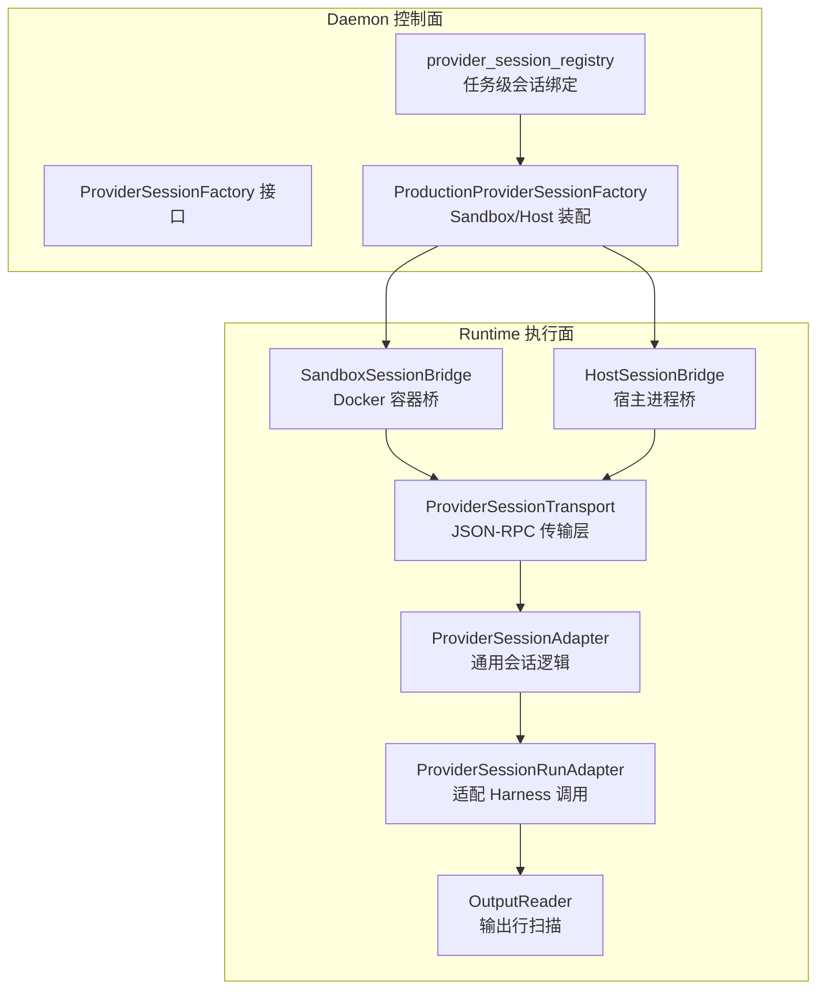
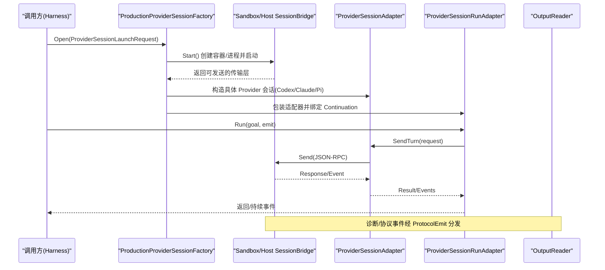
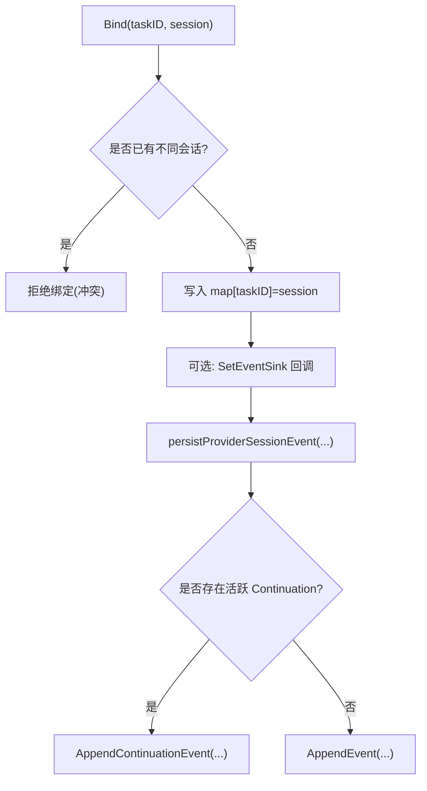
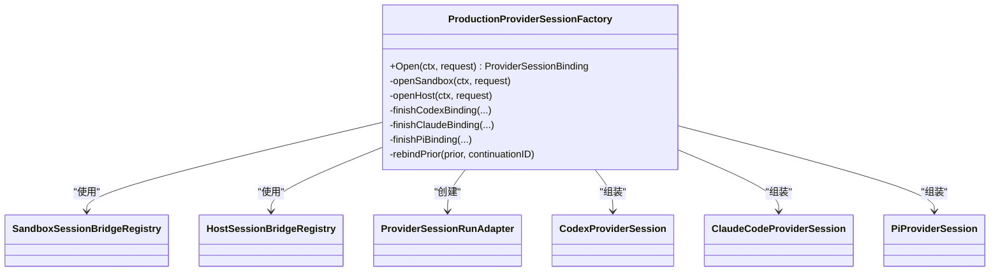
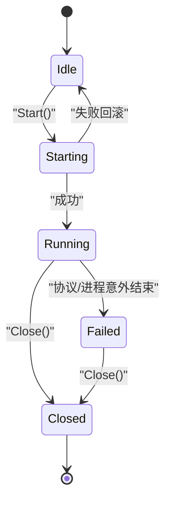
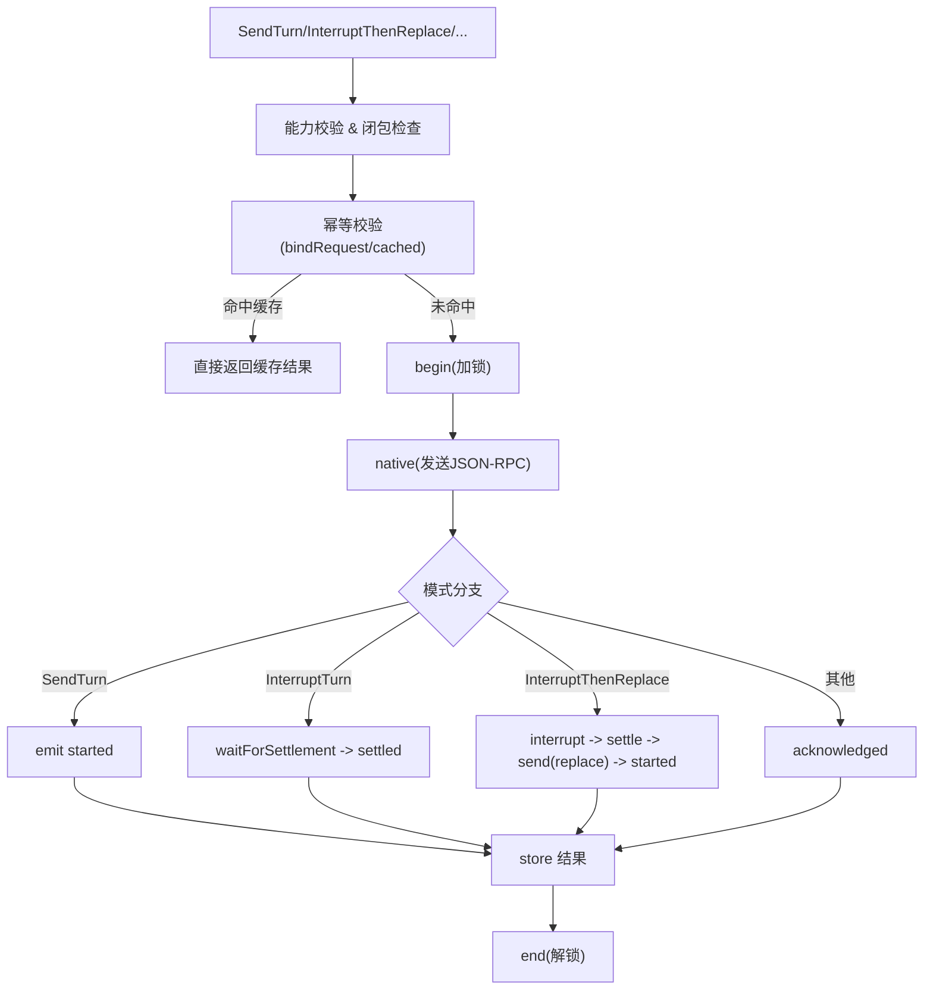
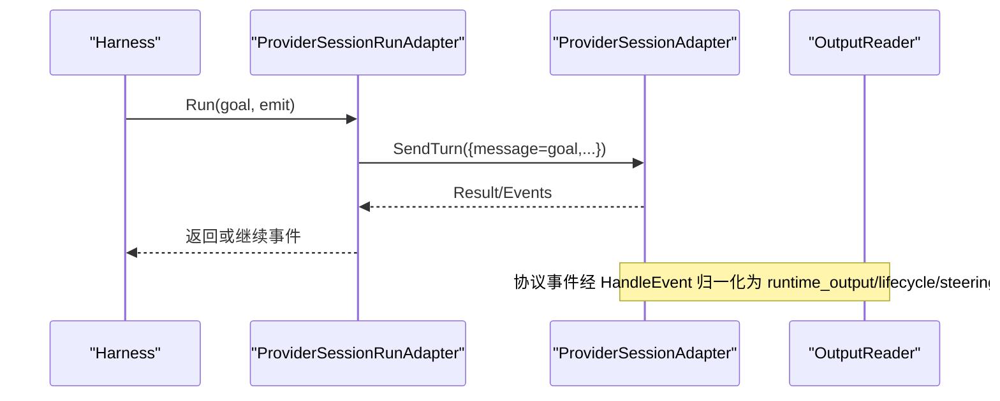

# 会话生命周期管理

<cite>
**本文引用的文件**   
- [internal/daemon/provider_session_control.go](file://internal/daemon/provider_session_control.go)
- [internal/daemon/provider_session_factory.go](file://internal/daemon/provider_session_factory.go)
- [internal/daemon/production_provider_session_factory.go](file://internal/daemon/production_provider_session_factory.go)
- [internal/runtime/provider_session.go](file://internal/runtime/provider_session.go)
- [internal/runtime/session_bridge.go](file://internal/runtime/session_bridge.go)
- [internal/runtime/host_session_bridge.go](file://internal/runtime/host_session_bridge.go)
- [internal/runtime/provider_adapters.go](file://internal/runtime/provider_adapters.go)
- [internal/runtime/output_reader.go](file://internal/runtime/output_reader.go)
- [internal/runtime/container.go](file://internal/runtime/container.go)
</cite>

## 目录
1. [简介](#简介)
2. [项目结构](#项目结构)
3. [核心组件](#核心组件)
4. [架构总览](#架构总览)
5. [详细组件分析](#详细组件分析)
6. [依赖关系分析](#依赖关系分析)
7. [性能与资源优化](#性能与资源优化)
8. [故障排查指南](#故障排查指南)
9. [结论](#结论)

## 简介
本文件聚焦于 Provider 会话的生命周期管理，覆盖从建立、维护到销毁的完整流程；深入解析会话状态机、错误恢复与超时处理机制；说明输出流读取、日志收集与进度跟踪的实现细节；提供调试工具与故障排除指南；并解释多会话并发管理、资源竞争与内存优化策略。

## 项目结构
围绕会话生命周期，关键代码分布在以下模块：
- Daemon 控制面：会话注册表、工厂接口与生产实现、事件持久化
- Runtime 执行面：容器/宿主进程桥接、协议收发、适配器封装、输出扫描
- 会话能力与错误模型：统一的能力协商、幂等请求、结算等待、健康探测

图表来源
- [internal/daemon/provider_session_control.go:18-93](file://internal/daemon/provider_session_control.go#L18-L93)
- [internal/daemon/provider_session_factory.go:13-41](file://internal/daemon/provider_session_factory.go#L13-L41)
- [internal/daemon/production_provider_session_factory.go:118-142](file://internal/daemon/production_provider_session_factory.go#L118-L142)
- [internal/runtime/session_bridge.go:103-126](file://internal/runtime/session_bridge.go#L103-L126)
- [internal/runtime/host_session_bridge.go:59-81](file://internal/runtime/host_session_bridge.go#L59-L81)
- [internal/runtime/provider_adapters.go:60-92](file://internal/runtime/provider_adapters.go#L60-L92)
- [internal/runtime/output_reader.go:61-104](file://internal/runtime/output_reader.go#L61-L104)

章节来源
- [internal/daemon/provider_session_control.go:18-93](file://internal/daemon/provider_session_control.go#L18-L93)
- [internal/daemon/provider_session_factory.go:13-41](file://internal/daemon/provider_session_factory.go#L13-L41)
- [internal/daemon/production_provider_session_factory.go:118-142](file://internal/daemon/production_provider_session_factory.go#L118-L142)
- [internal/runtime/session_bridge.go:103-126](file://internal/runtime/session_bridge.go#L103-L126)
- [internal/runtime/host_session_bridge.go:59-81](file://internal/runtime/host_session_bridge.go#L59-L81)
- [internal/runtime/provider_adapters.go:60-92](file://internal/runtime/provider_adapters.go#L60-L92)
- [internal/runtime/output_reader.go:61-104](file://internal/runtime/output_reader.go#L61-L104)

## 核心组件
- 会话注册表（Task 级）：在 Daemon 中按 TaskID 绑定唯一 Provider 会话，支持关闭单个或全部会话，并在关闭时忽略“已关闭”错误。
- 会话工厂接口与生产实现：抽象出 Open 操作，生产实现根据 Runner 类型选择 Sandbox 或 Host 路径，完成桥接创建、初始化握手、能力协商与适配器装配。
- 会话传输层：SandboxSessionBridge 与 HostSessionBridge 分别封装 Docker 容器与宿主进程，提供 JSON-RPC 双向通道、请求去重、响应匹配与异常终止信号。
- 会话适配器：统一的幂等控制、能力检查、结算等待、事件归一化与结果缓存；具体 Provider（Codex/Claude/Pi）通过 wire 方法映射差异。
- 运行期适配器：将 Harness 的 Run 调用转换为一次 SendTurn，并记录元数据；监听桥接事件转发给会话适配器。
- 输出扫描器：按行读取 stdout/stderr，限制单行长度，过滤无关行，规范化为 runtime_output 事件。

章节来源
- [internal/daemon/provider_session_control.go:18-93](file://internal/daemon/provider_session_control.go#L18-L93)
- [internal/daemon/provider_session_factory.go:13-41](file://internal/daemon/provider_session_factory.go#L13-L41)
- [internal/daemon/production_provider_session_factory.go:118-142](file://internal/daemon/production_provider_session_factory.go#L118-L142)
- [internal/runtime/session_bridge.go:103-126](file://internal/runtime/session_bridge.go#L103-L126)
- [internal/runtime/host_session_bridge.go:59-81](file://internal/runtime/host_session_bridge.go#L59-L81)
- [internal/runtime/provider_adapters.go:60-92](file://internal/runtime/provider_adapters.go#L60-L92)
- [internal/runtime/output_reader.go:61-104](file://internal/runtime/output_reader.go#L61-L104)

## 架构总览
下图展示了从 Daemon 发起会话到运行时桥接、再到 Provider 会话的端到端流程。

图表来源
- [internal/daemon/production_provider_session_factory.go:133-142](file://internal/daemon/production_provider_session_factory.go#L133-L142)
- [internal/runtime/session_bridge.go:300-352](file://internal/runtime/session_bridge.go#L300-L352)
- [internal/runtime/host_session_bridge.go:186-231](file://internal/runtime/host_session_bridge.go#L186-L231)
- [internal/runtime/provider_adapters.go:126-137](file://internal/runtime/provider_adapters.go#L126-L137)
- [internal/runtime/provider_bridge_adapter.go:70-112](file://internal/runtime/provider_bridge_adapter.go#L70-L112)

## 详细组件分析

### 组件A：会话注册表与事件持久化
- 职责：以 TaskID 为键绑定唯一 Provider 会话；提供 get/remove/close/closeAll；将 unsolicited provider 通知写入当前 Continuation 或 Task 事件。
- 关键点：
  - 关闭时忽略“已关闭”错误，避免重复关闭导致失败。
  - 事件仅保留白名单字段，敏感内容不落地。
  - 若存在活跃 Continuation，优先追加到该 Continuation。

图表来源
- [internal/daemon/provider_session_control.go:31-43](file://internal/daemon/provider_session_control.go#L31-L43)
- [internal/daemon/provider_session_control.go:117-143](file://internal/daemon/provider_session_control.go#L117-L143)

章节来源
- [internal/daemon/provider_session_control.go:18-93](file://internal/daemon/provider_session_control.go#L18-L93)
- [internal/daemon/provider_session_control.go:117-143](file://internal/daemon/provider_session_control.go#L117-L143)

### 组件B：会话工厂与生产装配
- 职责：根据 Runner 类型选择 Sandbox 或 Host 路径；复用同一 Task 的既有会话；完成握手、能力协商、适配器装配与元数据记录。
- 关键点：
  - rebindPrior：对后续 Continuation 仅更新 Continuation 绑定，不重建容器/进程。
  - finish*Binding：根据 Provider 类型进行初始化握手，设置能力集，构建原生会话与运行适配器，记录 ContainerID/ProcessGroupID 等元数据。
  - 关闭回调：当原生会话 Close 后，清理工厂内部绑定并关闭底层桥。

图表来源
- [internal/daemon/production_provider_session_factory.go:118-142](file://internal/daemon/production_provider_session_factory.go#L118-L142)
- [internal/daemon/production_provider_session_factory.go:548-617](file://internal/daemon/production_provider_session_factory.go#L548-L617)
- [internal/daemon/production_provider_session_factory.go:622-670](file://internal/daemon/production_provider_session_factory.go#L622-L670)
- [internal/daemon/production_provider_session_factory.go:674-729](file://internal/daemon/production_provider_session_factory.go#L674-L729)
- [internal/runtime/provider_bridge_adapter.go:16-28](file://internal/runtime/provider_bridge_adapter.go#L16-28)
- [internal/runtime/provider_adapters.go:717-766](file://internal/runtime/provider_adapters.go#L717-L766)
- [internal/runtime/provider_adapters.go:768-785](file://internal/runtime/provider_adapters.go#L768-L785)

章节来源
- [internal/daemon/provider_session_factory.go:13-41](file://internal/daemon/provider_session_factory.go#L13-L41)
- [internal/daemon/production_provider_session_factory.go:133-142](file://internal/daemon/production_provider_session_factory.go#L133-L142)
- [internal/daemon/production_provider_session_factory.go:548-617](file://internal/daemon/production_provider_session_factory.go#L548-L617)
- [internal/daemon/production_provider_session_factory.go:622-670](file://internal/daemon/production_provider_session_factory.go#L622-L670)
- [internal/daemon/production_provider_session_factory.go:674-729](file://internal/daemon/production_provider_session_factory.go#L674-L729)

### 组件C：会话传输层（Sandbox/Host）
- 职责：封装 Docker 容器或宿主进程的生命周期；提供 JSON-RPC 请求/响应匹配；无 ID 事件透传；异常退出信号；请求幂等指纹校验。
- 关键点：
  - Start：创建容器/进程，启动 readLoop/diagnosticLoop；失败则回滚资源。
  - Send：序列化请求、指纹校验、pending/completed 缓存、写锁串行化。
  - Terminated vs Closed：前者表示意外退出，后者表示显式关闭。
  - Registry：按 TaskID 绑定唯一桥实例，CloseTask/CloseAll 安全回收。

图表来源
- [internal/runtime/session_bridge.go:300-352](file://internal/runtime/session_bridge.go#L300-L352)
- [internal/runtime/session_bridge.go:446-489](file://internal/runtime/session_bridge.go#L446-L489)
- [internal/runtime/host_session_bridge.go:186-231](file://internal/runtime/host_session_bridge.go#L186-L231)
- [internal/runtime/host_session_bridge.go:317-352](file://internal/runtime/host_session_bridge.go#L317-L352)

章节来源
- [internal/runtime/session_bridge.go:103-126](file://internal/runtime/session_bridge.go#L103-L126)
- [internal/runtime/session_bridge.go:300-352](file://internal/runtime/session_bridge.go#L300-L352)
- [internal/runtime/session_bridge.go:446-489](file://internal/runtime/session_bridge.go#L446-L489)
- [internal/runtime/host_session_bridge.go:59-81](file://internal/runtime/host_session_bridge.go#L59-L81)
- [internal/runtime/host_session_bridge.go:186-231](file://internal/runtime/host_session_bridge.go#L186-L231)
- [internal/runtime/host_session_bridge.go:317-352](file://internal/runtime/host_session_bridge.go#L317-L352)

### 组件D：会话适配器与状态机
- 职责：统一幂等控制、能力检查、结算等待、事件归一化、结果缓存；具体 Provider 通过 wire 方法映射差异。
- 状态机要点：
  - begin/end：互斥控制，防止并发控制冲突。
  - bindRequest/cached/store：基于 RequestID+Mode+Fingerprint 的幂等与冲突检测。
  - waitForSettlement：等待中断/替换操作的最终收敛（completed/interrupted/failed 等）。
  - HandleEvent：将 provider 事件标准化为 lifecycle/steering 事件，并推进 activeTurnID/sessionID。

图表来源
- [internal/runtime/provider_adapters.go:126-137](file://internal/runtime/provider_adapters.go#L126-L137)
- [internal/runtime/provider_adapters.go:134-192](file://internal/runtime/provider_adapters.go#L134-L192)
- [internal/runtime/provider_adapters.go:282-337](file://internal/runtime/provider_adapters.go#L282-L337)
- [internal/runtime/provider_adapters.go:425-445](file://internal/runtime/provider_adapters.go#L425-L445)
- [internal/runtime/provider_adapters.go:570-671](file://internal/runtime/provider_adapters.go#L570-671)

章节来源
- [internal/runtime/provider_adapters.go:60-92](file://internal/runtime/provider_adapters.go#L60-L92)
- [internal/runtime/provider_adapters.go:126-137](file://internal/runtime/provider_adapters.go#L126-L137)
- [internal/runtime/provider_adapters.go:134-192](file://internal/runtime/provider_adapters.go#L134-L192)
- [internal/runtime/provider_adapters.go:282-337](file://internal/runtime/provider_adapters.go#L282-L337)
- [internal/runtime/provider_adapters.go:425-445](file://internal/runtime/provider_adapters.go#L425-L445)
- [internal/runtime/provider_adapters.go:570-671](file://internal/runtime/provider_adapters.go#L570-671)

### 组件E：运行期适配器与输出流
- 运行期适配器：将 Harness 的 Run 转为一次 SendTurn，记录 NativeSessionMetadata，阻塞直到上下文取消或会话关闭。
- 输出扫描：按行读取，限制最大行长度，过滤无关行，规范化为 runtime_output 事件；支持 observe 钩子用于捕获原始行。

图表来源
- [internal/runtime/provider_bridge_adapter.go:70-112](file://internal/runtime/provider_bridge_adapter.go#L70-L112)
- [internal/runtime/output_reader.go:61-104](file://internal/runtime/output_reader.go#L61-L104)
- [internal/runtime/provider_adapters.go:570-671](file://internal/runtime/provider_adapters.go#L570-671)

章节来源
- [internal/runtime/provider_bridge_adapter.go:16-28](file://internal/runtime/provider_bridge_adapter.go#L16-28)
- [internal/runtime/provider_bridge_adapter.go:70-112](file://internal/runtime/provider_bridge_adapter.go#L70-L112)
- [internal/runtime/output_reader.go:18-59](file://internal/runtime/output_reader.go#L18-59)
- [internal/runtime/output_reader.go:61-104](file://internal/runtime/output_reader.go#L61-L104)

## 依赖关系分析
- 耦合与内聚：
  - Daemon 层只持有会话注册表与工厂，不直接接触桥句柄，降低对外部实现的耦合。
  - Runtime 层将传输层（Sandbox/Host）与适配器解耦，适配器再面向 Provider 差异做最小映射。
- 外部依赖：
  - Docker CLI（容器生命周期）、本地进程组（宿主进程），均通过接口抽象便于测试替换。
- 潜在循环依赖：
  - 通过接口与回调（ProtocolEmit、SetEventSink）避免循环引用。

图表来源
- [internal/daemon/provider_session_control.go:18-93](file://internal/daemon/provider_session_control.go#L18-L93)
- [internal/daemon/production_provider_session_factory.go:118-142](file://internal/daemon/production_provider_session_factory.go#L118-L142)
- [internal/runtime/session_bridge.go:191-275](file://internal/runtime/session_bridge.go#L191-L275)
- [internal/runtime/host_session_bridge.go:83-159](file://internal/runtime/host_session_bridge.go#L83-L159)
- [internal/runtime/provider_adapters.go:60-92](file://internal/runtime/provider_adapters.go#L60-L92)
- [internal/runtime/output_reader.go:61-104](file://internal/runtime/output_reader.go#L61-L104)

章节来源
- [internal/daemon/provider_session_control.go:18-93](file://internal/daemon/provider_session_control.go#L18-L93)
- [internal/daemon/production_provider_session_factory.go:118-142](file://internal/daemon/production_provider_session_factory.go#L118-L142)
- [internal/runtime/session_bridge.go:191-275](file://internal/runtime/session_bridge.go#L191-L275)
- [internal/runtime/host_session_bridge.go:83-159](file://internal/runtime/host_session_bridge.go#L83-L159)
- [internal/runtime/provider_adapters.go:60-92](file://internal/runtime/provider_adapters.go#L60-L92)
- [internal/runtime/output_reader.go:61-104](file://internal/runtime/output_reader.go#L61-L104)

## 性能与资源优化
- 并发与竞争
  - 会话注册表与桥 Registry 使用读写锁保护，保证每个 Task 仅一个会话/桥实例。
  - 传输层写锁串行化 JSON-RPC 写入，避免帧交错。
  - 适配器层 begin/end 互斥，确保同一时刻仅一个控制操作进行中。
- 幂等与重试
  - 基于 RequestID+Mode+Fingerprint 的幂等键，避免重复写入；已完成请求直接返回缓存。
  - 传输层对相同 ID 的请求进行指纹比对，冲突即拒绝。
- 内存与缓冲
  - 输出扫描器限制单行大小，丢弃超长行剩余部分，防止大行撑爆缓冲区。
  - Scanner 初始缓冲上限提升，避免默认 token cap 导致的失败。
- 资源回收
  - Close 语义区分 Closed/Terminated，确保显式关闭与意外退出的差异化处理。
  - 容器/进程组在 Close 时一次性停止并移除，避免孤儿进程。

章节来源
- [internal/runtime/session_bridge.go:379-442](file://internal/runtime/session_bridge.go#L379-L442)
- [internal/runtime/host_session_bridge.go:252-315](file://internal/runtime/host_session_bridge.go#L252-L315)
- [internal/runtime/provider_adapters.go:461-523](file://internal/runtime/provider_adapters.go#L461-L523)
- [internal/runtime/output_reader.go:18-59](file://internal/runtime/output_reader.go#L18-59)
- [internal/runtime/container.go:26-88](file://internal/runtime/container.go#L26-L88)

## 故障排查指南
- 常见错误与定位
  - 控制冲突：ErrProviderSessionControlConflict 表明有另一控制操作在进行，需等待或更换 RequestID。
  - 请求冲突：ErrProviderSessionRequestConflict 表明同一 RequestID 对应不同负载，检查幂等键生成逻辑。
  - 会话关闭：ErrProviderSessionClosed 表明会话已关闭，不应再发起新请求。
  - 传输错误：SandboxBridgeRPCError 表示底层 JSON-RPC 返回错误，查看桥日志与诊断输出。
- 诊断手段
  - 观察 Terminated 信号：区分显式关闭与意外退出，结合会话健康探测（SessionOffline/UnexpectedOffline）。
  - 事件回放：通过 persistProviderSessionEvent 落盘的事件，核对 mode/outcome/request_id/session_id 等关键字段。
  - 输出追踪：ScanOutput 输出的 runtime_output 事件包含 stream/text/truncated 字段，辅助判断长输出截断问题。
- 恢复策略
  - 对于 InterruptThenReplace：先 interrupt，等待 settled，再 replace；若失败，依据错误类型决定是否重试。
  - 对于会话离线：重新走 Open 流程，利用 rebindPrior 复用现有桥，必要时重建容器/进程。

章节来源
- [internal/runtime/provider_session.go:40-76](file://internal/runtime/provider_session.go#L40-L76)
- [internal/runtime/session_bridge.go:76-91](file://internal/runtime/session_bridge.go#L76-L91)
- [internal/runtime/host_session_bridge.go:52-57](file://internal/runtime/host_session_bridge.go#L52-L57)
- [internal/daemon/provider_session_control.go:117-143](file://internal/daemon/provider_session_control.go#L117-L143)
- [internal/runtime/output_reader.go:61-104](file://internal/runtime/output_reader.go#L61-L104)

## 结论
本方案通过“注册表 + 工厂 + 传输层 + 适配器”的分层设计，实现了 Provider 会话的可观测、可幂等、可恢复的全生命周期管理。借助能力协商、结算等待与健康探测，系统在多会话并发场景下保持强一致性与稳定性；配合输出扫描与事件归一化，提供了完善的调试与排障基础。