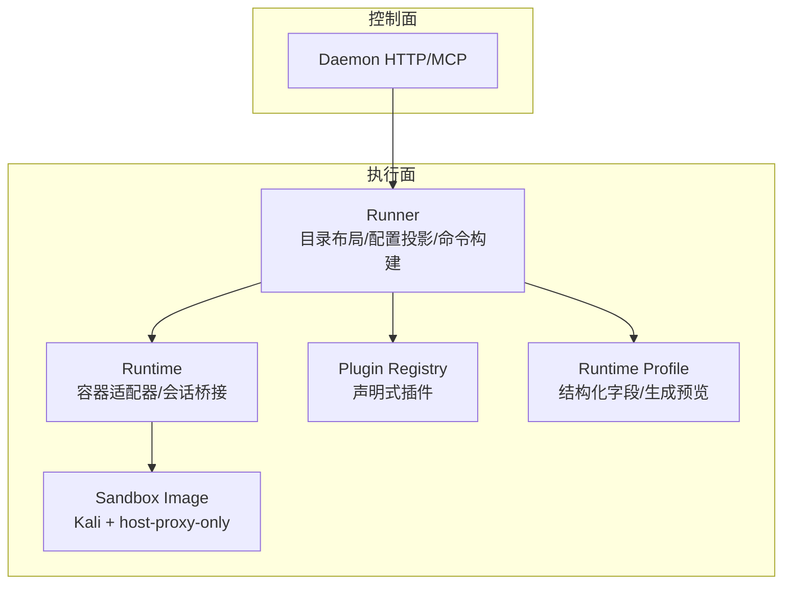
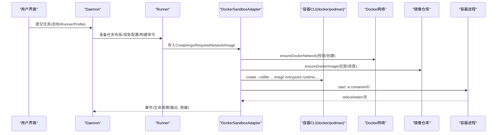
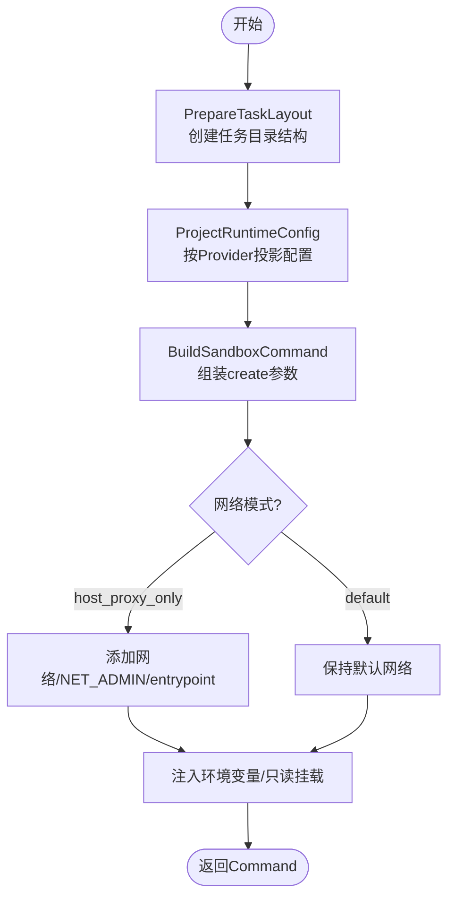
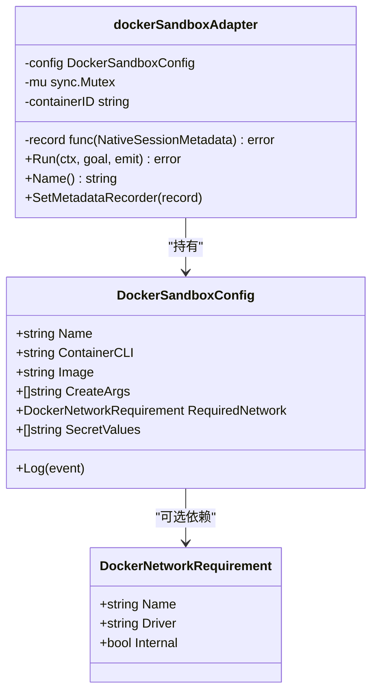
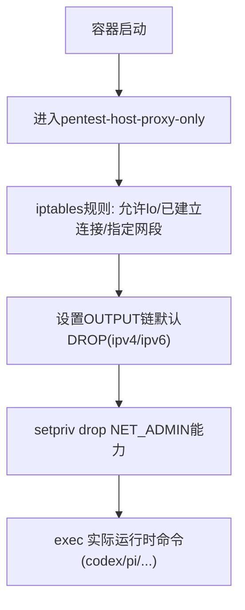
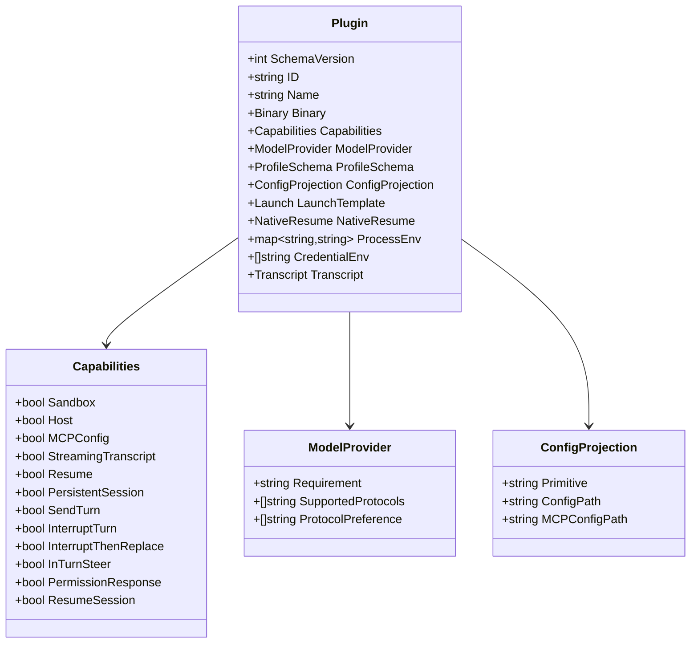
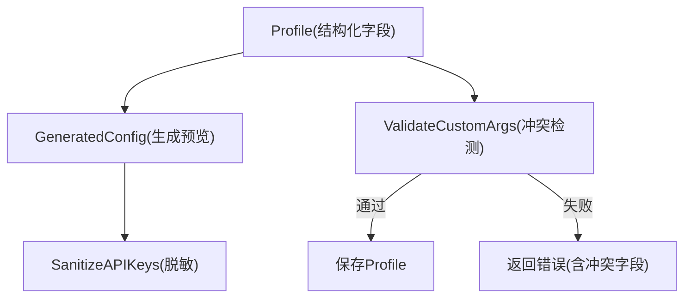
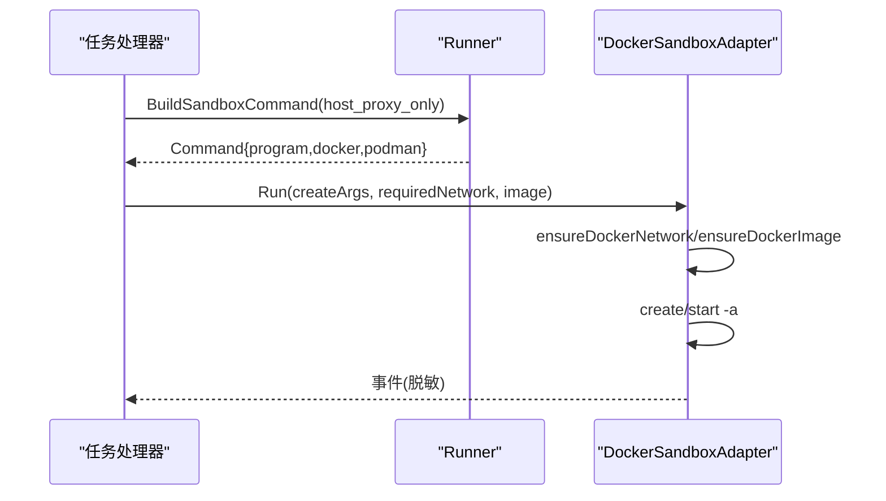
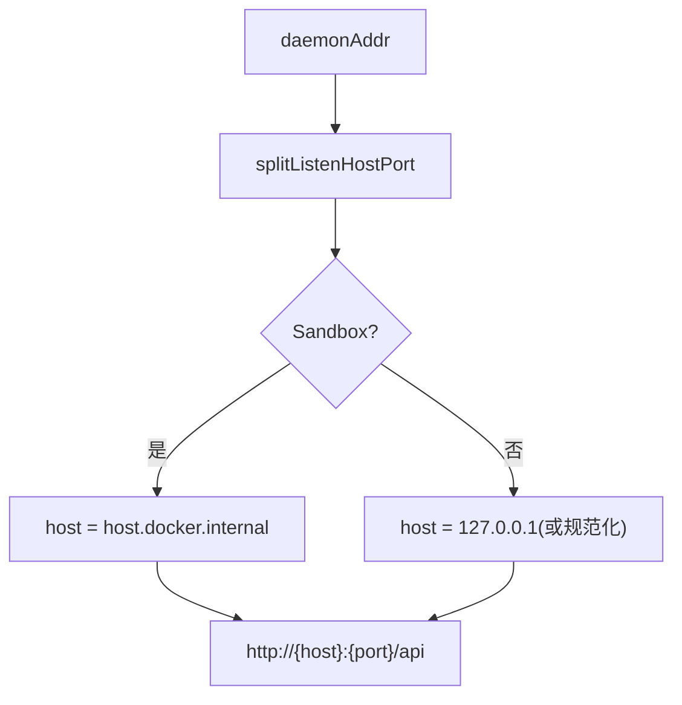
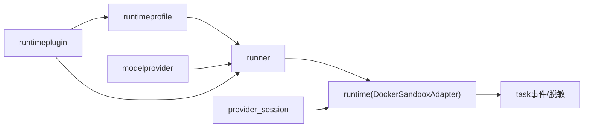

# 执行平面 - Runtime与沙箱

<cite>
**本文引用的文件**   
- [README.md](file://README.md)
- [CONTEXT.md](file://CONTEXT.md)
- [internal/runner/runner.go](file://internal/runner/runner.go)
- [internal/runner/mcp.go](file://internal/runner/mcp.go)
- [internal/runtime/docker_sandbox.go](file://internal/runtime/docker_sandbox.go)
- [docker/pentest-sandbox/Dockerfile](file://docker/pentest-sandbox/Dockerfile)
- [internal/daemon/task_handlers.go](file://internal/daemon/task_handlers.go)
- [internal/runtime/provider_session.go](file://internal/runtime/provider_session.go)
- [internal/runtime/provider_adapters.go](file://internal/runtime/provider_adapters.go)
- [internal/runtimeprofile/runtimeprofile.go](file://internal/runtimeprofile/runtimeprofile.go)
- [internal/runtimeplugin/plugin.go](file://internal/runtimeplugin/plugin.go)
- [web/src/pages/RuntimeProfilesPage.tsx](file://web/src/pages/RuntimeProfilesPage.tsx)
</cite>

## 目录
1. [简介](#简介)
2. [项目结构](#项目结构)
3. [核心组件](#核心组件)
4. [架构总览](#架构总览)
5. [详细组件分析](#详细组件分析)
6. [依赖关系分析](#依赖关系分析)
7. [性能考量](#性能考量)
8. [故障排查指南](#故障排查指南)
9. [结论](#结论)
10. [附录](#附录)

## 简介
本文件聚焦于执行平面（Runtime与沙箱）的设计与实现，覆盖以下关键主题：
- Docker/Podman容器隔离与安全边界
- 插件化运行时适配器（Codex、Claude Code、Pi等）
- Provider会话管理与持久化能力
- Runner的执行流程、环境准备、资源隔离与生命周期管理
- 插件开发指南、扩展机制与安全配置
- 自定义运行时适配器的开发示例与最佳实践

系统采用“本地优先”的渗透测试代理架构，Daemon为控制面，React为仪表盘，Sandboxed Runtimes在受控环境中运行。默认使用Sandbox Runner；Host Runner需显式激活且不会作为失败回退路径。

**章节来源**
- [README.md:1-173](file://README.md#L1-L173)

## 项目结构
执行平面相关的关键目录与职责：
- internal/runner：任务级执行边界准备（目录布局、配置投影、启动命令构建），不直接执行工具
- internal/runtime：容器适配器（Docker/Podman）、输出扫描、Provider会话桥接
- internal/runtimeplugin：声明式插件清单与校验
- internal/runtimeprofile：全局运行时Profile定义与生成预览
- docker/pentest-sandbox：沙箱镜像构建与主机代理入口脚本
- web前端：运行时Profile表单与预览逻辑



**图表来源**
- [internal/runner/runner.go:1-120](file://internal/runner/runner.go#L1-L120)
- [internal/runtime/docker_sandbox.go:1-120](file://internal/runtime/docker_sandbox.go#L1-L120)
- [internal/runtimeplugin/plugin.go:1-120](file://internal/runtimeplugin/plugin.go#L1-L120)
- [internal/runtimeprofile/runtimeprofile.go:1-120](file://internal/runtimeprofile/runtimeprofile.go#L1-L120)
- [docker/pentest-sandbox/Dockerfile:124-144](file://docker/pentest-sandbox/Dockerfile#L124-L144)

**章节来源**
- [README.md:149-161](file://README.md#L149-L161)

## 核心组件
- Runner：负责任务根目录、工作目录、Provider Home、Skills、Artifacts、Logs等布局；将Profile与Model Provider解析为可执行的启动命令与环境变量；支持Sandbox网络模式与只读挂载约束。
- Docker Sandbox Adapter：封装容器拉取、创建、启动、日志采集、停止与清理；确保所需网络存在并校验其驱动与隔离属性；对敏感信息进行脱敏。
- Plugin Manifest：以声明式方式描述二进制、能力、模型提供者协议、配置投影、启动模板、转录解析器、原生恢复等。
- Runtime Profile：全局可编辑的配置，结构化字段为事实来源；生成预览不包含密钥；支持推理努力级别、MCP服务器、运行时扩展、默认Runner与沙箱镜像覆盖。
- Provider会话：抽象出持久会话、发送轮次、中断替换、权限响应、恢复等能力，由具体Provider包装实现。

**章节来源**
- [internal/runner/runner.go:1-120](file://internal/runner/runner.go#L1-L120)
- [internal/runtime/docker_sandbox.go:1-120](file://internal/runtime/docker_sandbox.go#L1-L120)
- [internal/runtimeplugin/plugin.go:1-120](file://internal/runtimeplugin/plugin.go#L1-L120)
- [internal/runtimeprofile/runtimeprofile.go:1-120](file://internal/runtimeprofile/runtimeprofile.go#L1-L120)
- [internal/runtime/provider_session.go:1-30](file://internal/runtime/provider_session.go#L1-L30)

## 架构总览
下图展示从任务启动到沙箱运行的端到端流程，包括网络与镜像准备、容器创建与启动、输出扫描与事件上报。



**图表来源**
- [internal/daemon/task_handlers.go:799-833](file://internal/daemon/task_handlers.go#L799-L833)
- [internal/runner/runner.go:139-217](file://internal/runner/runner.go#L139-L217)
- [internal/runtime/docker_sandbox.go:111-231](file://internal/runtime/docker_sandbox.go#L111-L231)
- [internal/runtime/docker_sandbox.go:365-428](file://internal/runtime/docker_sandbox.go#L365-L428)
- [internal/runtime/docker_sandbox.go:233-283](file://internal/runtime/docker_sandbox.go#L233-L283)

## 详细组件分析

### Runner：执行边界与命令构建
- 任务布局：task_root/workdir、runtime-home/<provider>、skills、artifacts、logs
- 配置投影：根据Provider选择特定投影原语（如claude_settings、codex_home、pi_agent），写入Provider Home
- 启动命令：BuildSandboxCommand组装create参数，包含host-gateway、只读挂载、环境变量、网络模式与entrypoint
- 安全策略：拒绝Sandbox失败自动回退Host；Host Runner需显式激活；只读目录必须位于Task Root内且不可为符号链接



**图表来源**
- [internal/runner/runner.go:106-137](file://internal/runner/runner.go#L106-L137)
- [internal/runner/runner.go:139-217](file://internal/runner/runner.go#L139-L217)
- [internal/runner/runner.go:271-283](file://internal/runner/runner.go#L271-L283)

**章节来源**
- [internal/runner/runner.go:1-120](file://internal/runner/runner.go#L1-L120)
- [internal/runner/runner.go:139-217](file://internal/runner/runner.go#L139-L217)
- [internal/runner/runner.go:271-283](file://internal/runner/runner.go#L271-L283)

### Docker/Podman沙箱适配器：容器生命周期与网络/镜像保障
- 网络保障：ensureDockerNetwork检查或创建指定名称、驱动与Internal属性的网络，防止不安全配置
- 镜像保障：ensureDockerImage先inspect，缺失则pull，并透传进度事件
- 容器生命周期：create/start/-a，stdout/stderr扫描，记录NativeSessionMetadata，stop/kill+rm清理
- 脱敏：SecretValues用于输出脱敏，避免泄露密钥



**图表来源**
- [internal/runtime/docker_sandbox.go:20-57](file://internal/runtime/docker_sandbox.go#L20-L57)
- [internal/runtime/docker_sandbox.go:44-50](file://internal/runtime/docker_sandbox.go#L44-L50)
- [internal/runtime/docker_sandbox.go:111-231](file://internal/runtime/docker_sandbox.go#L111-L231)

**章节来源**
- [internal/runtime/docker_sandbox.go:1-120](file://internal/runtime/docker_sandbox.go#L1-L120)
- [internal/runtime/docker_sandbox.go:233-283](file://internal/runtime/docker_sandbox.go#L233-L283)
- [internal/runtime/docker_sandbox.go:365-428](file://internal/runtime/docker_sandbox.go#L365-L428)
- [internal/runtime/docker_sandbox.go:430-505](file://internal/runtime/docker_sandbox.go#L430-L505)

### 沙箱镜像与主机代理入口
- 镜像安装iptables/util-linux，复制host-proxy-only-entrypoint.sh至/usr/local/bin/pentest-host-proxy-only
- 设置PENTEST_SANDBOX=1、PENTEST_SKILLS_DIR、AGENT_BROWSER_EXECUTABLE_PATH等环境变量
- 通过entrypoint在容器网络命名空间内建立出站防火墙规则，再drop NET_ADMIN能力后exec实际运行时命令



**图表来源**
- [docker/pentest-sandbox/Dockerfile:124-144](file://docker/pentest-sandbox/Dockerfile#L124-L144)

**章节来源**
- [docker/pentest-sandbox/Dockerfile:124-144](file://docker/pentest-sandbox/Dockerfile#L124-L144)

### 插件系统与声明式适配器
- 插件清单字段：id/name/binary/capabilities/model_provider/profile_schema/config_projection/launch/native_resume/process_env/credential_env/transcript
- 校验规则：schema_version、id格式、binary.default必填、projection primitive白名单、model provider requirement/protocols白名单、transcript parser白名单、launch args必填、singleton选项合法性、credential_env不得包含值片段
- 能力位：sandbox/host/mcp_config/streaming_transcript/resume/persistent_session/send_turn/interrupt_turn/interrupt_then_replace/in_turn_steer/permission_response/resume_session



**图表来源**
- [internal/runtimeplugin/plugin.go:19-96](file://internal/runtimeplugin/plugin.go#L19-L96)
- [internal/runtimeplugin/plugin.go:98-134](file://internal/runtimeplugin/plugin.go#L98-L134)
- [internal/runtimeplugin/plugin.go:136-214](file://internal/runtimeplugin/plugin.go#L136-L214)

**章节来源**
- [internal/runtimeplugin/plugin.go:1-120](file://internal/runtimeplugin/plugin.go#L1-L120)
- [internal/runtimeplugin/plugin.go:136-214](file://internal/runtimeplugin/plugin.go#L136-L214)

### Provider会话管理与桥接
- 能力枚举：persistent_session、send_turn、interrupt_turn、interrupt_then_replace、in_turn_steer、permission_response、resume_session
- 会话适配器：统一生命周期、幂等性、事件语义；具体Provider仅做原生协议映射
- 传输层与方法集：transport/methods/capabilities/sessionID/activeTurnID等状态维护

```mermaid
classDiagram
class ProviderSessionCapability {
<<enum>>
+persistent_session
+send_turn
+interrupt_turn
+interrupt_then_replace
+in_turn_steer
+permission_response
+resume_session
}
class providerSessionAdapter {
-mu sync.Mutex
-transport ProviderSessionTransport
-provider string
-methods providerWireMethods
-capabilities Capabilities
-sessionID string
-activeTurnID string
-closed bool
-active bool
-calls map[string]providerSessionCallResult
-requests map[string]providerSessionRequestIdentity
-eventSink ProviderSessionEmit
-settlements map[string]providerSettlement
-settlementSeq uint64
-settlementChanged chan struct{}
}
providerSessionAdapter --> ProviderSessionCapability : "使用"
```

**图表来源**
- [internal/runtime/provider_session.go:14-30](file://internal/runtime/provider_session.go#L14-L30)
- [internal/runtime/provider_adapters.go:43-79](file://internal/runtime/provider_adapters.go#L43-L79)

**章节来源**
- [internal/runtime/provider_session.go:1-30](file://internal/runtime/provider_session.go#L1-L30)
- [internal/runtime/provider_adapters.go:43-79](file://internal/runtime/provider_adapters.go#L43-L79)

### 运行时Profile与生成预览
- 结构化字段：binary_path、model、endpoint、model_provider_id、model_provider_protocol、model_override、reasoning_effort、custom_args、env、api_keys、credential_refs、runtime_extensions、mcp_servers、default_runner、sandbox_image
- 生成预览：GeneratedConfig将结构化字段转为非机密预览；APIKeys被脱敏；CredentialRefs保留引用
- 验证与冲突：Custom Args若重定义结构化字段（model/model_provider/reasoning_effort）将被拒绝



**图表来源**
- [internal/runtimeprofile/runtimeprofile.go:351-433](file://internal/runtimeprofile/runtimeprofile.go#L351-L433)
- [internal/runtimeprofile/runtimeprofile.go:448-467](file://internal/runtimeprofile/runtimeprofile.go#L448-L467)

**章节来源**
- [internal/runtimeprofile/runtimeprofile.go:71-95](file://internal/runtimeprofile/runtimeprofile.go#L71-L95)
- [internal/runtimeprofile/runtimeprofile.go:351-433](file://internal/runtimeprofile/runtimeprofile.go#L351-L433)
- [internal/runtimeprofile/runtimeprofile.go:448-467](file://internal/runtimeprofile/runtimeprofile.go#L448-L467)

### 任务启动与沙箱网络模式
- 当选择host_proxy_only时，Runner会附加网络名、NET_ADMIN能力，并在镜像中调用host-proxy-only入口脚本
- Daemon侧在任务创建阶段处理sandbox_network与sandbox_image，必要时包装Pi的一次性启动命令



**图表来源**
- [internal/runner/runner.go:196-216](file://internal/runner/runner.go#L196-L216)
- [internal/daemon/task_handlers.go:799-833](file://internal/daemon/task_handlers.go#L799-L833)
- [internal/runtime/docker_sandbox.go:111-231](file://internal/runtime/docker_sandbox.go#L111-L231)

**章节来源**
- [internal/daemon/task_handlers.go:799-833](file://internal/daemon/task_handlers.go#L799-L833)
- [internal/runner/runner.go:196-216](file://internal/runner/runner.go#L196-L216)

### 可信MCP与API端点解析
- TaskContext携带ProjectID/TaskID/MCPURL/APIURL/AuthToken/InterfaceToken/Provider/Sandbox/ScopeSnapshot
- APIEndpointURL根据是否沙箱决定host（沙箱使用host.docker.internal），并拼接/api前缀



**图表来源**
- [internal/runner/mcp.go:17-52](file://internal/runner/mcp.go#L17-L52)

**章节来源**
- [internal/runner/mcp.go:1-52](file://internal/runner/mcp.go#L1-L52)

### 前端Profile预览与默认行为
- 提供fallbackProcessEnv与fallbackTranscriptParser，基于provider选择默认环境变量与转录解析器
- pluginIDs与pluginFor用于渲染可用插件列表与匹配当前provider

**章节来源**
- [web/src/pages/RuntimeProfilesPage.tsx:635-660](file://web/src/pages/RuntimeProfilesPage.tsx#L635-L660)

## 依赖关系分析
- Runner依赖runtimeprofile与modelprovider进行配置投影与模型解析
- DockerSandboxAdapter依赖task事件与adapters脱敏
- Plugin Manifest影响Profile字段、Launch模板、Transcript解析器选择
- Provider会话适配器与具体Provider桥接（如Pi/Claude/Codex）



**图表来源**
- [internal/runner/runner.go:1-42](file://internal/runner/runner.go#L1-L42)
- [internal/runtime/docker_sandbox.go:1-16](file://internal/runtime/docker_sandbox.go#L1-L16)
- [internal/runtimeplugin/plugin.go:1-34](file://internal/runtimeplugin/plugin.go#L1-L34)
- [internal/runtime/provider_session.go:1-12](file://internal/runtime/provider_session.go#L1-L12)

**章节来源**
- [internal/runner/runner.go:1-42](file://internal/runner/runner.go#L1-L42)
- [internal/runtime/docker_sandbox.go:1-16](file://internal/runtime/docker_sandbox.go#L1-L16)
- [internal/runtimeplugin/plugin.go:1-34](file://internal/runtimeplugin/plugin.go#L1-L34)
- [internal/runtime/provider_session.go:1-12](file://internal/runtime/provider_session.go#L1-L12)

## 性能考量
- 镜像拉取与网络创建在启动前完成，避免运行时阻塞
- 输出扫描限制行长度，防止超大行导致内存膨胀
- stop/kill与rm分离，保证优雅退出与强制清理的平衡
- 事件发射加锁与脱敏，减少并发竞争与I/O开销

[本节为通用指导，无需源码引用]

## 故障排查指南
- 网络不安全：ensureDockerNetwork校验失败会返回“unsafe configuration”，检查网络driver与internal属性
- 镜像缺失：ensureDockerImage inspect失败后尝试pull，关注image_pull_failed事件
- 容器启动失败：start -a返回错误，查看容器日志与事件phase
- 清理失败：stop/kill或rm报错，确认容器是否存在及权限
- Custom Args冲突：Profile更新或任务启动时报错，指出重定义的structured field

**章节来源**
- [internal/runtime/docker_sandbox.go:365-428](file://internal/runtime/docker_sandbox.go#L365-L428)
- [internal/runtime/docker_sandbox.go:233-283](file://internal/runtime/docker_sandbox.go#L233-L283)
- [internal/runtime/docker_sandbox.go:430-505](file://internal/runtime/docker_sandbox.go#L430-L505)
- [internal/runtimeprofile/runtimeprofile.go:448-467](file://internal/runtimeprofile/runtimeprofile.go#L448-L467)

## 结论
执行平面通过Runner与DockerSandboxAdapter实现了强隔离的任务执行环境，结合声明式插件与结构化Profile，提供了可扩展、可审计、可预测的运行时体系。Provider会话能力进一步增强了交互性与可恢复性。建议在生产环境中严格限定网络与镜像来源，启用host-proxy-only模式，并对Custom Args进行集中治理以避免与结构化字段冲突。

[本节为总结，无需源码引用]

## 附录

### 插件开发指南与最佳实践
- 清单设计
  - id/name/binary.default必填；id符合小写字母开头与合法字符集
  - capabilities按需开启，明确是否支持sandbox/host与持久会话
  - model_provider.requirement为none/optional/required；supported_protocols与protocol_preference保持一致
  - config_projection.primitive使用白名单（none/generic_config/codex_home/claude_settings/pi_agent）
  - launch.args必填；singleton_options用于互斥参数组
  - transcript.parser使用白名单（plain_runtime_output/codex_json/claude_stream_json/pi_json_session）
  - credential_env仅声明变量名，不得包含值片段
- 配置投影
  - 针对Provider编写投影逻辑，将Profile字段与Model Provider快照转换为Provider Home下的配置文件
  - 避免在生成预览中暴露密钥；使用脱敏占位符
- 启动模板
  - 使用模板变量渲染args；注意SingletonOptions的互斥与数量约束
- 安全边界
  - 不在Manifest中硬编码密钥；通过Profile的APIKeys或CredentialRefs注入
  - 谨慎开启PersistentSession与InTurnSteer，确保幂等与事件一致性

**章节来源**
- [internal/runtimeplugin/plugin.go:136-214](file://internal/runtimeplugin/plugin.go#L136-L214)
- [internal/runtimeprofile/runtimeprofile.go:351-433](file://internal/runtimeprofile/runtimeprofile.go#L351-L433)

### 自定义运行时适配器开发示例
- 步骤
  - 定义Adapter接口实现（Name/SetMetadataRecorder/Run）
  - 在Run中编排容器生命周期：ensureDockerNetwork/ensureDockerImage/create/start/-a
  - 使用ScanOutputWithObserver读取stdout/stderr，记录NativeSessionMetadata并emit事件
  - 在defer中执行StopDockerContainer与RemoveDockerContainer，确保资源回收
- 注意事项
  - 所有对外输出的敏感信息通过adapters.Redact脱敏
  - RequiredNetwork必须满足driver与internal要求，否则提前失败
  - 对于Pi等需要一次性引导的场景，可在Runner侧包装entrypoint

**章节来源**
- [internal/runtime/docker_sandbox.go:111-231](file://internal/runtime/docker_sandbox.go#L111-L231)
- [internal/runtime/docker_sandbox.go:233-283](file://internal/runtime/docker_sandbox.go#L233-L283)
- [internal/runtime/docker_sandbox.go:430-505](file://internal/runtime/docker_sandbox.go#L430-L505)

### 安全配置要点
- 网络：host_proxy_only模式下，容器内先设置iptables规则，再drop NET_ADMIN能力，最后exec运行时命令
- 镜像：固定镜像标签，禁止动态拉取未签名镜像；CI中使用SANDBOX_IMAGE控制
- 认证：API/MCP路由支持Bearer Token；沙箱内通过host.docker.internal访问宿主API
- 只读挂载：ReadOnlyTaskFiles/Dirs必须位于Task Root下，且不允许符号链接

**章节来源**
- [docker/pentest-sandbox/Dockerfile:124-144](file://docker/pentest-sandbox/Dockerfile#L124-L144)
- [internal/runner/runner.go:179-216](file://internal/runner/runner.go#L179-L216)
- [internal/runner/mcp.go:44-52](file://internal/runner/mcp.go#L44-L52)