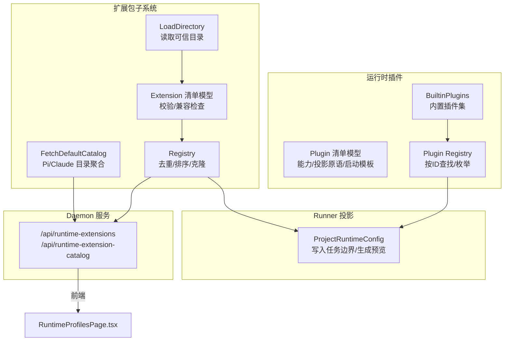
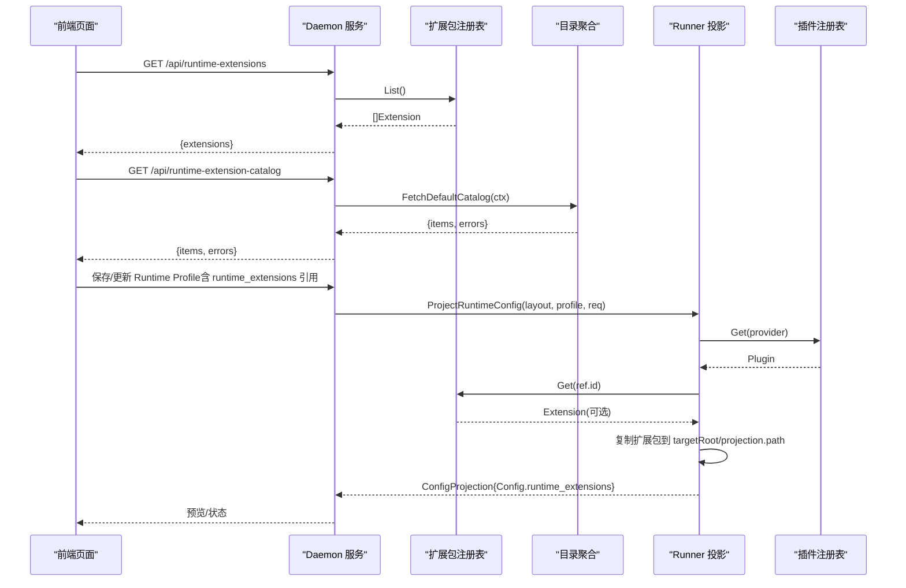
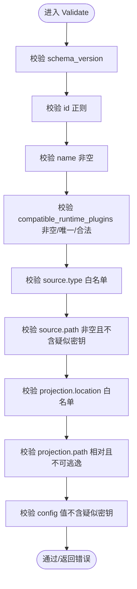
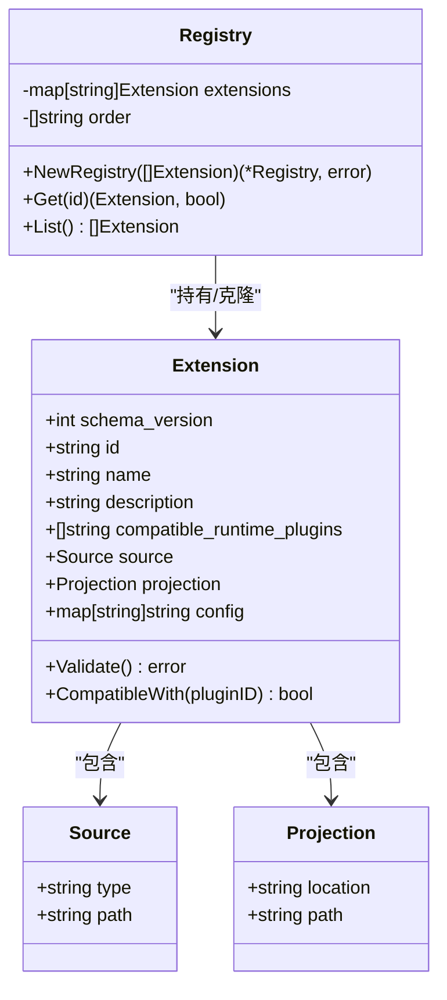
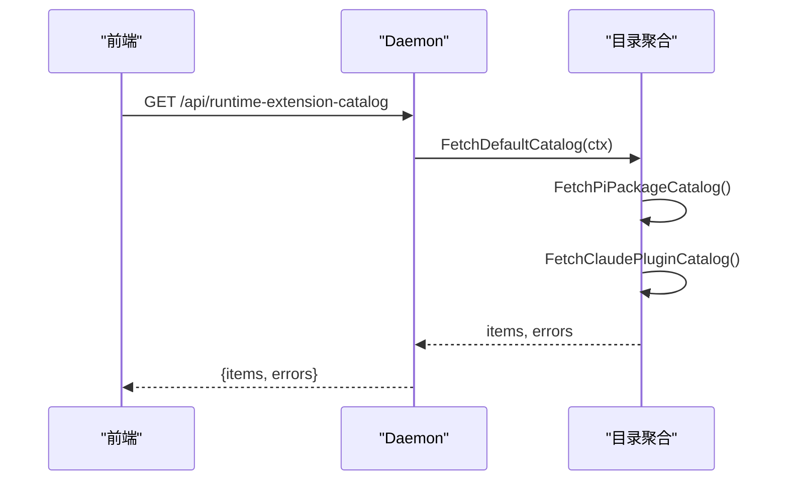
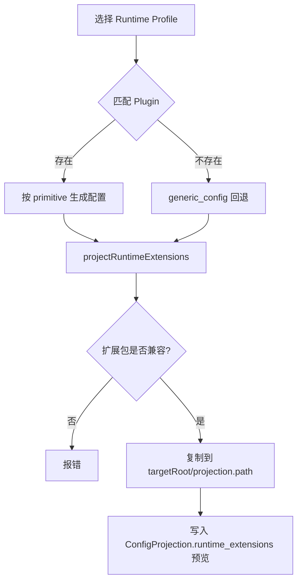
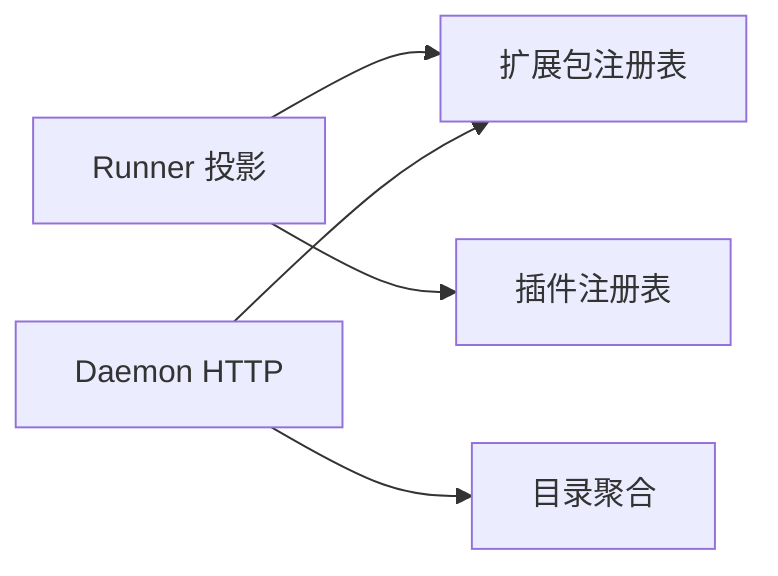

# 扩展包系统

<cite>
**本文引用的文件**   
- [extension.go](file://internal/runtimeextension/extension.go)
- [loader.go](file://internal/runtimeextension/loader.go)
- [registry.go](file://internal/runtimeextension/registry.go)
- [catalog.go](file://internal/runtimeextension/catalog.go)
- [plugin.go](file://internal/runtimeplugin/plugin.go)
- [builtin.go](file://internal/runtimeplugin/builtin.go)
- [loader.go](file://internal/runtimeplugin/loader.go)
- [registry.go](file://internal/runtimeplugin/registry.go)
- [projection.go](file://internal/runner/projection.go)
- [runtime_extension_handlers.go](file://internal/daemon/runtime_extension_handlers.go)
- [server.go](file://internal/daemon/server.go)
- [CONTEXT.md](file://CONTEXT.md)
</cite>

## 目录
1. [简介](#简介)
2. [项目结构](#项目结构)
3. [核心组件](#核心组件)
4. [架构总览](#架构总览)
5. [详细组件分析](#详细组件分析)
6. [依赖关系分析](#依赖关系分析)
7. [性能与可扩展性](#性能与可扩展性)
8. [故障排查指南](#故障排查指南)
9. [结论](#结论)
10. [附录：开发与安全实践](#附录开发与安全实践)

## 简介
本文件系统性阐述“扩展包系统”（Runtime Extension Pack）的设计模式、生命周期管理、发现机制、加载流程与注册表管理，并解释其与运行时插件（Runtime Plugin）的协作关系、数据共享机制以及安全边界。扩展包用于为特定运行时插件提供可投影到任务沙箱或宿主环境的资源与配置片段，支持本地目录/文件源与外部目录清单扫描，同时提供默认目录（Catalog）聚合能力，供前端与管理面展示与选择。

## 项目结构
扩展包系统由以下模块组成：
- 扩展包清单模型与校验：定义扩展包元数据、来源类型、投影目标、兼容插件列表等，并提供严格的安全与格式校验。
- 扩展包加载器：从可信目录读取 .json 清单，解析并校验，返回可用扩展包集合与错误列表。
- 扩展包注册表：维护去重、排序、克隆隔离的扩展包索引，提供按 ID 查询与全量列举。
- 目录聚合（Catalog）：拉取默认的外部目录（如 Pi 包目录与 Claude Code 官方插件仓库），解析为统一 CatalogItem，供前端展示与选择。
- 运行时插件（Runtime Plugin）：声明式描述运行时提供者（如 Codex、Claude Code、Pi）的能力、配置投影原语、启动模板、转录解析器等；扩展包通过“兼容插件列表”与之绑定。
- Runner 投影层：在任务启动前将扩展包内容投影到任务工作区（provider_home、runtime_home、workdir），生成预览信息，并与模型提供者快照、MCP 配置等协同。
- Daemon HTTP 接口：暴露扩展包列表、目录聚合结果、单个扩展包详情等 API，供前端使用。

图表来源
- [extension.go:19-96](file://internal/runtimeextension/extension.go#L19-L96)
- [loader.go:11-45](file://internal/runtimeextension/loader.go#L11-L45)
- [registry.go:8-62](file://internal/runtimeextension/registry.go#L8-L62)
- [catalog.go:37-106](file://internal/runtimeextension/catalog.go#L37-L106)
- [plugin.go:19-135](file://internal/runtimeplugin/plugin.go#L19-L135)
- [builtin.go:3-214](file://internal/runtimeplugin/builtin.go#L3-L214)
- [registry.go:8-99](file://internal/runtimeplugin/registry.go#L8-L99)
- [projection.go:57-131](file://internal/runner/projection.go#L57-L131)
- [runtime_extension_handlers.go:9-50](file://internal/daemon/runtime_extension_handlers.go#L9-L50)

章节来源
- [CONTEXT.md:675-812](file://CONTEXT.md#L675-L812)

## 核心组件
- 扩展包清单模型（Extension）
  - 字段包括：schema_version、id、name、description、compatible_runtime_plugins、source（type/path）、projection（location/path）、config（非敏感键值）。
  - 校验规则：版本固定、ID 正则、名称必填、兼容插件列表唯一且合法、source.type 白名单、source.path 非空且不包含疑似密钥、projection.location 白名单、projection.path 相对路径且不可逃逸、config 值不得包含疑似密钥。
  - 兼容性判断：仅当运行时的插件 ID 出现在 compatible_runtime_plugins 时视为兼容。
- 扩展包加载器（LoadDirectory）
  - 遍历指定目录下的 .json 文件，逐个解码并调用 Validate，收集成功项与错误项。
- 扩展包注册表（Registry）
  - 构建时再次校验并去重，内部维护有序 ID 列表；Get/List 返回深拷贝以避免外部修改。
- 目录聚合（Catalog）
  - FetchDefaultCatalog 并行拉取 Pi 包目录与 Claude Code 官方插件仓库，解析为 CatalogItem 列表，失败项以 CatalogSourceError 返回。
  - ParsePiPackageCatalog 基于 HTML 卡片抽取包名与描述；fetchClaudePluginDir 通过 GitHub API 列出插件目录。
- 运行时插件（Plugin）
  - 声明二进制默认路径、能力位（sandbox/host/mcp_config/streaming_transcript/resume/persistent_session/send_turn/interrupt/in_turn_steer/permission_response/resume_session）、模型提供者要求与协议偏好、ProfileSchema 字段、配置投影原语（none/generic_config/codex_home/claude_settings/pi_agent）、启动模板参数、原生恢复、进程环境变量、凭据环境变量、转录解析器。
  - 内置插件（fake/codex/claude_code/pi）定义了常用 Profile 字段与投影目标路径。
- Runner 投影（ProjectRuntimeConfig）
  - 根据所选 Provider 匹配对应 Plugin，按 projection.primitive 生成具体配置；随后执行 projectRuntimeExtensions，将启用的扩展包复制到目标根目录（provider_home/runtime_home/workdir），并在 ConfigProjection.Config["runtime_extensions"] 中输出预览。
  - 对未找到本地扩展包的引用，若携带 registry/install_ref/source_url 则作为“目录来源”的预览保留，不报错。
- Daemon HTTP 接口
  - /api/runtime-extensions：返回当前已加载的扩展包列表。
  - /api/runtime-extension-catalog：返回默认目录聚合结果及错误。
  - /api/runtime-extensions/{extension_id}：返回单个扩展包详情。

章节来源
- [extension.go:19-122](file://internal/runtimeextension/extension.go#L19-L122)
- [loader.go:11-45](file://internal/runtimeextension/loader.go#L11-L45)
- [registry.go:8-62](file://internal/runtimeextension/registry.go#L8-L62)
- [catalog.go:37-177](file://internal/runtimeextension/catalog.go#L37-L177)
- [plugin.go:19-224](file://internal/runtimeplugin/plugin.go#L19-L224)
- [builtin.go:3-214](file://internal/runtimeplugin/builtin.go#L3-L214)
- [projection.go:57-131](file://internal/runner/projection.go#L57-L131)
- [runtime_extension_handlers.go:9-50](file://internal/daemon/runtime_extension_handlers.go#L9-L50)

## 架构总览
扩展包系统与运行时插件共同构成“声明式扩展”体系：
- 运行时插件定义“能力边界与投影原语”，决定扩展包可被投影的目标位置与行为。
- 扩展包声明“来源与投影路径”，并通过“兼容插件列表”限定适用范围。
- Runner 在任务启动前完成“配置投影”，将扩展包内容复制到任务边界，并将预览写入 ConfigProjection，供前端与后续流程消费。
- Daemon 提供扩展包与目录聚合的 HTTP 接口，驱动前端 RuntimeProfilesPage 进行可视化选择与编辑。

图表来源
- [runtime_extension_handlers.go:9-50](file://internal/daemon/runtime_extension_handlers.go#L9-L50)
- [catalog.go:37-106](file://internal/runtimeextension/catalog.go#L37-L106)
- [projection.go:57-131](file://internal/runner/projection.go#L57-L131)
- [registry.go:8-62](file://internal/runtimeextension/registry.go#L8-L62)
- [registry.go:8-99](file://internal/runtimeplugin/registry.go#L8-L99)

## 详细组件分析

### 扩展包清单模型与校验
- 设计要点
  - 强约束：schema_version 固定、ID 小写字母数字与点划线组合、名称必填、兼容插件列表非空且唯一。
  - 安全约束：source.path 与 config 值禁止出现疑似密钥模式；projection.path 必须为相对路径且不允许 “.”、“..” 与绝对路径，防止逃逸目标根。
  - 兼容性：CompatibleWith 仅做字符串匹配，确保扩展包只作用于其声明的插件族。
- 复杂度
  - 校验时间 O(n)（n 为兼容插件数量与 config 条目数），空间 O(n)。
- 优化建议
  - 对大体积 source 目录的复制采用增量校验与跳过策略（当前实现为全量 Walk）。
  - 对大量扩展包的注册表初始化可考虑延迟加载与分页查询。

图表来源
- [extension.go:51-96](file://internal/runtimeextension/extension.go#L51-L96)

章节来源
- [extension.go:19-122](file://internal/runtimeextension/extension.go#L19-L122)

### 扩展包加载与注册表
- 加载流程
  - LoadDirectory 仅读取顶层 .json，忽略目录与非 json 文件；每个文件独立解码与校验，错误累积返回。
- 注册表特性
  - NewRegistry 二次校验并去重，内部 order 排序保证稳定枚举顺序；Get/List 返回深拷贝避免共享可变状态。
- 并发与一致性
  - 注册表对象本身无锁，建议在单线程构造后只读访问；如需并发写，应在上层加锁或使用不可变快照。

图表来源
- [extension.go:19-49](file://internal/runtimeextension/extension.go#L19-L49)
- [registry.go:8-62](file://internal/runtimeextension/registry.go#L8-L62)

章节来源
- [loader.go:11-45](file://internal/runtimeextension/loader.go#L11-L45)
- [registry.go:8-62](file://internal/runtimeextension/registry.go#L8-L62)

### 目录聚合（Catalog）
- 数据来源
  - Pi 包目录：HTML 页面解析，提取 data-package-card 卡片中的包名与描述。
  - Claude Code 官方插件：GitHub API 获取 plugins 与 external_plugins 目录列表。
- 错误处理
  - 网络超时、HTTP 非 2xx、JSON 解析失败均记录为 CatalogSourceError，不影响其他源的结果。
- 前端集成
  - RuntimeProfilesPage 缓存 catalog 请求，合并 install_ref 与 id 映射，支持手动添加与重复/兼容性检查。

图表来源
- [catalog.go:37-106](file://internal/runtimeextension/catalog.go#L37-L106)
- [runtime_extension_handlers.go:21-36](file://internal/daemon/runtime_extension_handlers.go#L21-L36)

章节来源
- [catalog.go:37-177](file://internal/runtimeextension/catalog.go#L37-L177)
- [RuntimeProfilesPage.tsx:199-231](file://web/src/pages/RuntimeProfilesPage.tsx#L199-L231)

### 运行时插件与扩展包协作
- 插件能力与投影原语
  - 插件声明支持的投影原语（none/generic_config/codex_home/claude_settings/pi_agent），Runner 据此生成不同配置文件与预览。
  - 内置插件（codex/claude_code/pi）定义了各自的配置路径与环境变量注入。
- 扩展包兼容性与投影
  - 扩展包通过 compatible_runtime_plugins 限制适用插件族；Runner 在投影前进行兼容性检查，不兼容直接报错。
  - 投影目标 location 支持 provider_home、runtime_home、workdir，path 必须相对且不可逃逸。

图表来源
- [projection.go:57-131](file://internal/runner/projection.go#L57-L131)
- [projection.go:183-229](file://internal/runner/projection.go#L183-L229)
- [builtin.go:3-214](file://internal/runtimeplugin/builtin.go#L3-L214)

章节来源
- [plugin.go:19-135](file://internal/runtimeplugin/plugin.go#L19-L135)
- [builtin.go:3-214](file://internal/runtimeplugin/builtin.go#L3-L214)
- [projection.go:183-229](file://internal/runner/projection.go#L183-L229)

### 生命周期管理与事件处理
- 生命周期阶段
  - 导入/发布：管理员通过受控导入（Controlled Skill Import）或编辑后发布至 Runtime Extension Library。
  - 启用：在 Runtime Profile 中选择并启用扩展包，保存结构化字段。
  - 预检（Preflight）：预览启用的扩展包与相关配置，但不解析凭据。
  - 投影（Config Projection）：任务启动前将扩展包复制到任务边界，生成预览。
  - 运行期：任务保持已投影的扩展包内容不变，直到需要重新投影或重启。
- 事件与审计
  - 文档指出 Skills 事件记录导入、上传、编辑、删除、启用变更等；扩展包作为运行时特定扩展，遵循相同治理原则。

章节来源
- [CONTEXT.md:775-812](file://CONTEXT.md#L775-L812)

## 依赖关系分析
- 组件耦合
  - Runner 投影层依赖扩展包注册表与插件注册表，二者均为只读依赖，降低耦合度。
  - Daemon HTTP 层仅依赖扩展包注册表与目录聚合，职责清晰。
- 外部依赖
  - 目录聚合依赖外部网络（Pi 包目录与 GitHub API），需容忍失败并降级。
- 循环依赖
  - 未发现循环依赖；扩展包与插件之间通过 ID 与兼容列表解耦。

图表来源
- [projection.go:57-131](file://internal/runner/projection.go#L57-L131)
- [runtime_extension_handlers.go:9-50](file://internal/daemon/runtime_extension_handlers.go#L9-L50)

章节来源
- [registry.go:8-62](file://internal/runtimeextension/registry.go#L8-L62)
- [registry.go:8-99](file://internal/runtimeplugin/registry.go#L8-L99)

## 性能与可扩展性
- 性能特征
  - 目录聚合带超时与限流（LimitReader），避免大响应阻塞。
  - 扩展包复制使用 WalkDir，对大目录可能较慢；可通过增量同步与跳过策略优化。
  - 注册表构造时排序与深拷贝，适合启动时一次性构建，运行期只读。
- 可扩展性
  - 新增扩展包只需增加 .json 清单并放入可信目录；新增插件通过声明式清单即可接入。
  - 目录聚合可继续扩展更多来源（如 npm、pypi 等），保持 CatalogItem 统一结构。

[本节为通用指导，无需源码引用]

## 故障排查指南
- 常见错误
  - 清单校验失败：schema_version 不匹配、ID 非法、名称缺失、兼容插件重复、source.type 未知、source.path 包含疑似密钥、projection.location 未知、projection.path 非相对或逃逸、config 值包含疑似密钥。
  - 兼容性问题：扩展包与所选 Provider 不兼容导致投影失败。
  - 未找到本地扩展包：若未携带 registry/install_ref/source_url，投影会报错；若携带，则以“目录来源”预览保留。
- 定位步骤
  - 查看 /api/runtime-extensions 返回的扩展包列表与详情。
  - 查看 /api/runtime-extension-catalog 返回的 items 与 errors，确认外部目录可用性。
  - 检查 Runner 投影日志与 ConfigProjection.runtime_extensions 预览，确认复制目标与权限。
  - 核对 Runtime Profile 的 runtime_extensions 引用与 enabled 状态。

章节来源
- [extension.go:51-96](file://internal/runtimeextension/extension.go#L51-L96)
- [projection.go:183-229](file://internal/runner/projection.go#L183-L229)
- [runtime_extension_handlers.go:9-50](file://internal/daemon/runtime_extension_handlers.go#L9-L50)

## 结论
扩展包系统通过“声明式清单 + 严格校验 + 注册表 + 目录聚合 + Runner 投影”的架构，实现了安全可控的运行时扩展能力。扩展包与运行时插件通过兼容列表解耦，Runner 在任务边界内完成投影与预览，Daemon 提供统一的 HTTP 接口支撑前端管理。整体设计强调安全（密钥检测、路径逃逸防护）、可观测（预览与错误聚合）与可扩展（插件与目录源可插拔）。

[本节为总结，无需源码引用]

## 附录：开发与安全实践
- 自定义扩展包开发指南
  - 清单结构：确保 schema_version、id、name、compatible_runtime_plugins、source、projection、config 字段完整且符合校验规则。
  - 来源类型：优先使用 local_dir/local_file；避免在 source.path 与 config 中包含任何密钥或令牌。
  - 投影目标：选择 provider_home/runtime_home/workdir 之一，并确保 path 为相对路径且不会逃逸。
  - 兼容性：仅在 compatible_runtime_plugins 中声明适用的插件 ID（如 codex、claude_code、pi）。
- API 使用
  - 前端通过 /api/runtime-extensions 与 /api/runtime-extension-catalog 获取扩展包与目录信息，并在 Runtime Profiles 页面进行启用与配置。
  - 后端在 ProjectRuntimeConfig 中完成投影，返回 ConfigProjection.runtime_extensions 预览供界面展示。
- 安全考虑
  - 严禁在清单中硬编码密钥；使用凭据引用与环境变量注入。
  - 严格的路径校验与权限控制（0o600/0o700）确保投影文件不被越权访问。
  - 目录聚合失败应降级处理，不影响主流程。
- 与运行时插件协作
  - 通过 compatible_runtime_plugins 限定范围；Runner 在投影前进行兼容性检查。
  - 结合插件的投影原语（如 pi_agent、claude_settings、codex_home）生成相应配置文件与预览。

章节来源
- [extension.go:51-96](file://internal/runtimeextension/extension.go#L51-L96)
- [projection.go:183-229](file://internal/runner/projection.go#L183-L229)
- [builtin.go:3-214](file://internal/runtimeplugin/builtin.go#L3-L214)
- [RuntimeProfilesPage.tsx:748-814](file://web/src/pages/RuntimeProfilesPage.tsx#L748-L814)