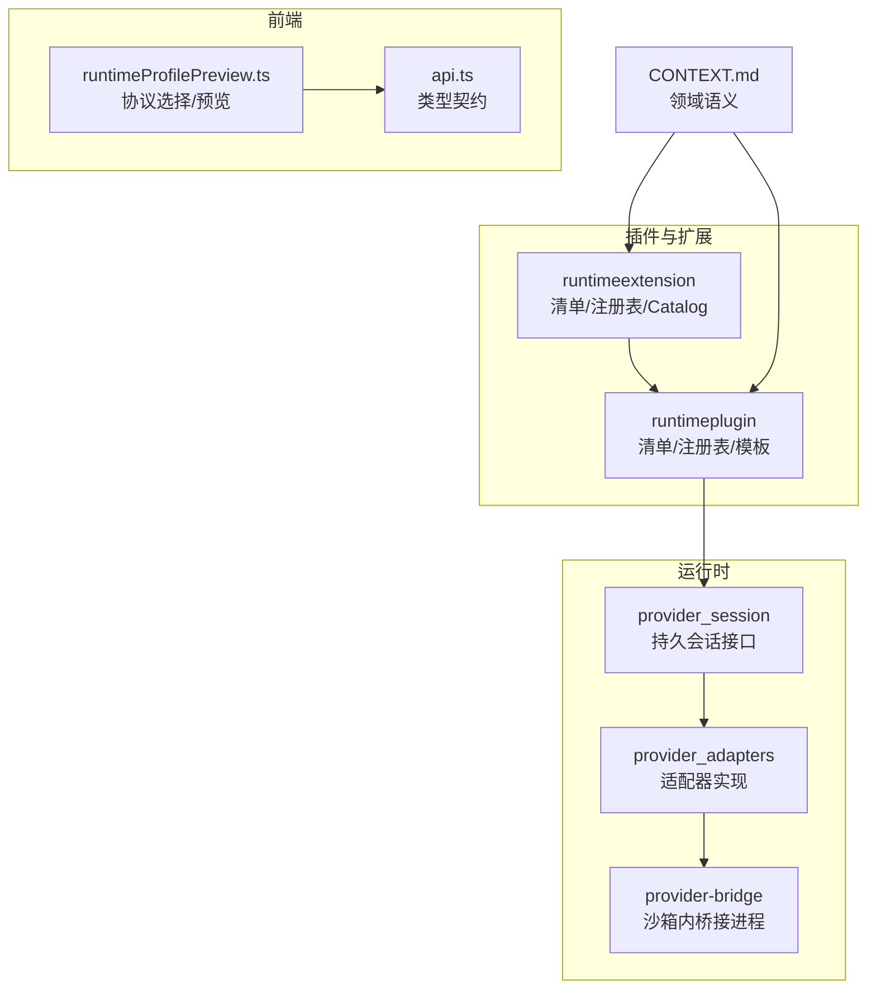
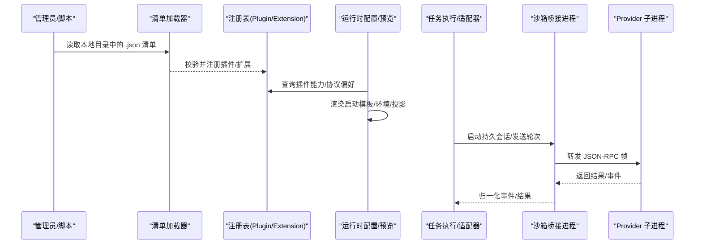
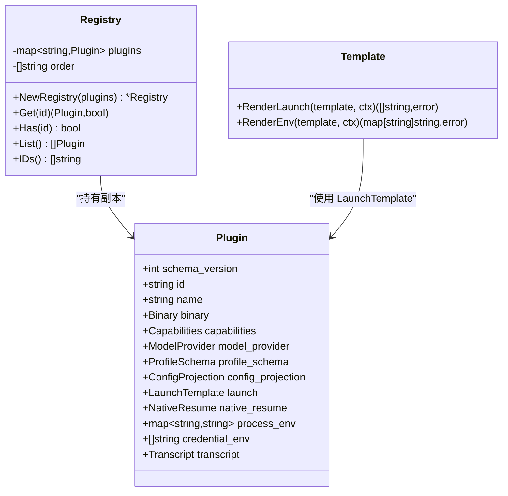
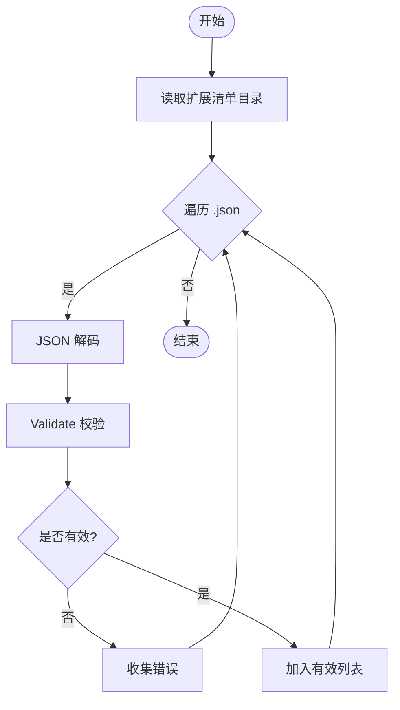
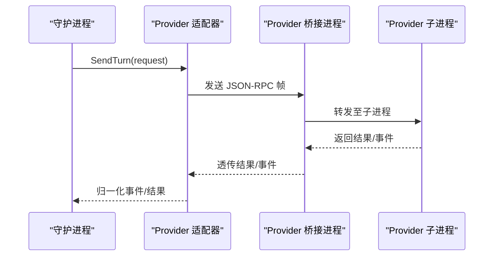
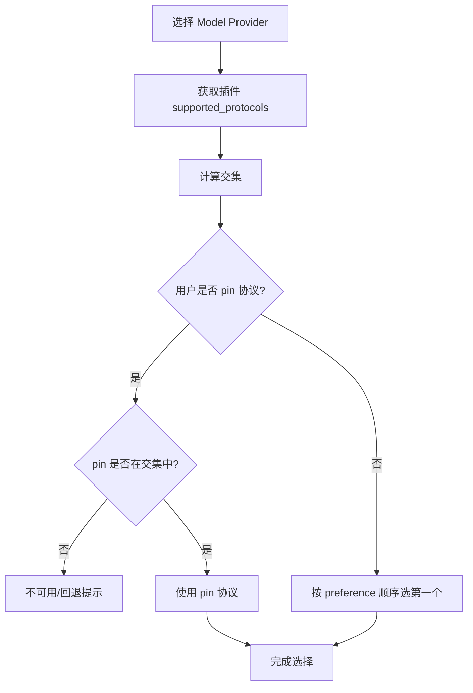
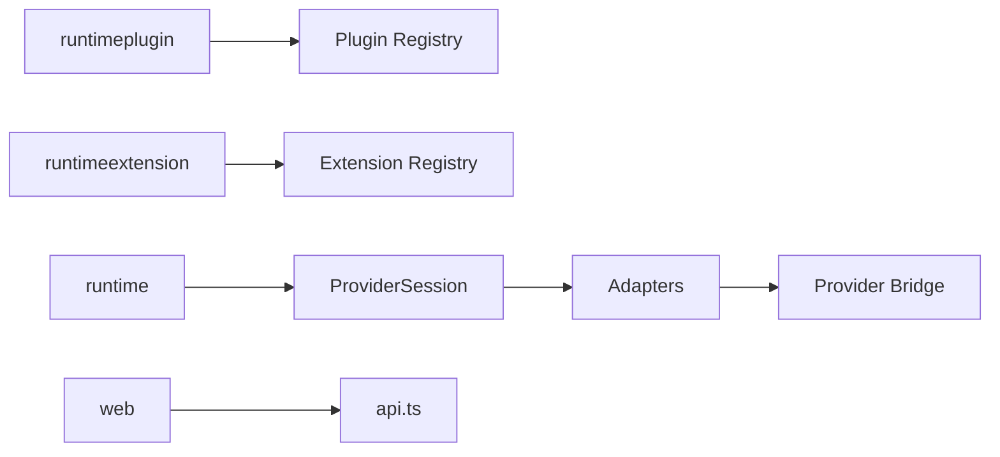

# 插件架构系统

<cite>
**本文引用的文件**   
- [internal/runtimeplugin/plugin.go](file://internal/runtimeplugin/plugin.go)
- [internal/runtimeplugin/loader.go](file://internal/runtimeplugin/loader.go)
- [internal/runtimeplugin/registry.go](file://internal/runtimeplugin/registry.go)
- [internal/runtimeplugin/template.go](file://internal/runtimeplugin/template.go)
- [internal/runtimeplugin/builtin.go](file://internal/runtimeplugin/builtin.go)
- [internal/runtimeextension/extension.go](file://internal/runtimeextension/extension.go)
- [internal/runtimeextension/loader.go](file://internal/runtimeextension/loader.go)
- [internal/runtimeextension/registry.go](file://internal/runtimeextension/registry.go)
- [internal/runtimeextension/catalog.go](file://internal/runtimeextension/catalog.go)
- [internal/runtime/provider_adapters.go](file://internal/runtime/provider_adapters.go)
- [internal/runtime/provider_session.go](file://internal/runtime/provider_session.go)
- [cmd/pentest-provider-bridge/main.go](file://cmd/pentest-provider-bridge/main.go)
- [web/src/pages/runtimeProfilePreview.ts](file://web/src/pages/runtimeProfilePreview.ts)
- [web/src/lib/api.ts](file://web/src/lib/api.ts)
- [CONTEXT.md](file://CONTEXT.md)
</cite>

## 目录
1. [引言](#引言)
2. [项目结构](#项目结构)
3. [核心组件](#核心组件)
4. [架构总览](#架构总览)
5. [详细组件分析](#详细组件分析)
6. [依赖关系分析](#依赖关系分析)
7. [性能与可扩展性](#性能与可扩展性)
8. [故障排查指南](#故障排查指南)
9. [结论](#结论)
10. [附录：自定义插件开发指南](#附录自定义插件开发指南)

## 引言
本文件系统性地阐述 Runtime Plugin（运行时插件）与 Extension Pack（扩展包）的架构、加载机制、注册表管理、声明式配置、模板系统与动态扩展能力。文档覆盖插件生命周期、依赖解析、版本兼容性控制，并提供自定义插件开发指南（API 规范、安全约束、测试策略），以及插件间通信协议与数据共享机制说明。

## 项目结构
围绕插件体系的关键代码位于以下模块：
- runtimeplugin：声明式运行时插件清单、内置插件、清单加载与校验、注册表、启动参数模板渲染
- runtimeextension：运行时扩展清单、清单加载与校验、注册表、默认目录索引（Catalog）
- runtime：Provider Session 适配器与持久会话边界、桥接进程
- web：前端对插件能力与模型协议的预览与选择逻辑
- CONTEXT.md：领域语义与规则（如“Runtime Plugin”“Runtime Extension”等术语定义）

图表来源
- [internal/runtimeplugin/registry.go:1-99](file://internal/runtimeplugin/registry.go#L1-L99)
- [internal/runtimeextension/registry.go:1-62](file://internal/runtimeextension/registry.go#L1-L62)
- [internal/runtime/provider_session.go:129-152](file://internal/runtime/provider_session.go#L129-L152)
- [internal/runtime/provider_adapters.go:1-79](file://internal/runtime/provider_adapters.go#L1-L79)
- [cmd/pentest-provider-bridge/main.go:1-45](file://cmd/pentest-provider-bridge/main.go#L1-L45)
- [web/src/pages/runtimeProfilePreview.ts:1-44](file://web/src/pages/runtimeProfilePreview.ts#L1-L44)
- [web/src/lib/api.ts:180-246](file://web/src/lib/api.ts#L180-L246)
- [CONTEXT.md:675-1066](file://CONTEXT.md#L675-L1066)

章节来源
- [internal/runtimeplugin/plugin.go:1-224](file://internal/runtimeplugin/plugin.go#L1-L224)
- [internal/runtimeplugin/loader.go:1-49](file://internal/runtimeplugin/loader.go#L1-L49)
- [internal/runtimeplugin/registry.go:1-99](file://internal/runtimeplugin/registry.go#L1-L99)
- [internal/runtimeplugin/template.go:1-166](file://internal/runtimeplugin/template.go#L1-L166)
- [internal/runtimeplugin/builtin.go:1-221](file://internal/runtimeplugin/builtin.go#L1-L221)
- [internal/runtimeextension/extension.go:1-122](file://internal/runtimeextension/extension.go#L1-L122)
- [internal/runtimeextension/loader.go:1-46](file://internal/runtimeextension/loader.go#L1-L46)
- [internal/runtimeextension/registry.go:1-62](file://internal/runtimeextension/registry.go#L1-L62)
- [internal/runtimeextension/catalog.go:1-177](file://internal/runtimeextension/catalog.go#L1-L177)
- [internal/runtime/provider_session.go:129-152](file://internal/runtime/provider_session.go#L129-L152)
- [internal/runtime/provider_adapters.go:1-79](file://internal/runtime/provider_adapters.go#L1-L79)
- [cmd/pentest-provider-bridge/main.go:1-45](file://cmd/pentest-provider-bridge/main.go#L1-L45)
- [web/src/pages/runtimeProfilePreview.ts:1-44](file://web/src/pages/runtimeProfilePreview.ts#L1-L44)
- [web/src/lib/api.ts:180-246](file://web/src/lib/api.ts#L180-L246)
- [CONTEXT.md:675-1066](file://CONTEXT.md#L675-L1066)

## 核心组件
- 运行时插件（Runtime Plugin）
  - 以 JSON 清单描述二进制入口、能力集、模型提供者要求、配置文件投影、启动模板、原生恢复、凭据环境变量、转录解析器等。
  - 提供内置插件（fake、codex、claude_code、pi），并支持从本地目录加载外部清单。
  - 通过注册表进行去重、排序与只读访问；对外暴露 Get/List/IDs 等方法。
- 运行时扩展（Runtime Extension）
  - 以 JSON 清单描述与特定插件家族的兼容关系、源码位置、投影目标路径、非敏感配置项。
  - 提供 Catalog 拉取默认扩展源（Pi 包目录与 Claude 官方仓库）。
  - 通过注册表进行去重与只读访问。
- 模板系统
  - 基于占位符的启动参数与环境变量渲染，支持列表与标量、可选参数抑制、单例选项组冲突消解。
- 持久会话与适配器
  - ProviderSession 抽象了持久会话的生命周期与操作（发送轮次、中断、替换、权限响应、关闭）。
  - provider_adapters 将不同 Provider 的 wire 映射到统一接口，封装幂等、事件归一化与结算确认。
  - provider-bridge 在沙箱内作为非 PTY 的 JSON-RPC 流桥接，转发 daemon 与 Provider 子进程之间的帧。

章节来源
- [internal/runtimeplugin/plugin.go:1-224](file://internal/runtimeplugin/plugin.go#L1-L224)
- [internal/runtimeplugin/builtin.go:1-221](file://internal/runtimeplugin/builtin.go#L1-L221)
- [internal/runtimeplugin/loader.go:1-49](file://internal/runtimeplugin/loader.go#L1-L49)
- [internal/runtimeplugin/registry.go:1-99](file://internal/runtimeplugin/registry.go#L1-L99)
- [internal/runtimeplugin/template.go:1-166](file://internal/runtimeplugin/template.go#L1-L166)
- [internal/runtimeextension/extension.go:1-122](file://internal/runtimeextension/extension.go#L1-L122)
- [internal/runtimeextension/loader.go:1-46](file://internal/runtimeextension/loader.go#L1-L46)
- [internal/runtimeextension/registry.go:1-62](file://internal/runtimeextension/registry.go#L1-L62)
- [internal/runtimeextension/catalog.go:1-177](file://internal/runtimeextension/catalog.go#L1-L177)
- [internal/runtime/provider_session.go:129-152](file://internal/runtime/provider_session.go#L129-L152)
- [internal/runtime/provider_adapters.go:1-79](file://internal/runtime/provider_adapters.go#L1-L79)
- [cmd/pentest-provider-bridge/main.go:1-45](file://cmd/pentest-provider-bridge/main.go#L1-L45)

## 架构总览
下图展示了从清单加载、注册表管理、模板渲染到持久会话与桥接的整体流程。

图表来源
- [internal/runtimeplugin/loader.go:1-49](file://internal/runtimeplugin/loader.go#L1-L49)
- [internal/runtimeextension/loader.go:1-46](file://internal/runtimeextension/loader.go#L1-L46)
- [internal/runtimeplugin/registry.go:1-99](file://internal/runtimeplugin/registry.go#L1-L99)
- [internal/runtimeextension/registry.go:1-62](file://internal/runtimeextension/registry.go#L1-L62)
- [internal/runtimeplugin/template.go:1-166](file://internal/runtimeplugin/template.go#L1-L166)
- [internal/runtime/provider_session.go:129-152](file://internal/runtime/provider_session.go#L129-L152)
- [internal/runtime/provider_adapters.go:1-79](file://internal/runtime/provider_adapters.go#L1-L79)
- [cmd/pentest-provider-bridge/main.go:1-45](file://cmd/pentest-provider-bridge/main.go#L1-L45)

## 详细组件分析

### 运行时插件（Runtime Plugin）
- 清单结构与校验
  - 字段包括 schema_version、id、name、binary、capabilities、model_provider、profile_schema、config_projection、launch、native_resume、process_env、credential_env、transcript。
  - 校验涵盖 ID 格式、必填字段、投影原语白名单、模型提供者要求与协议白名单、转录解析器白名单、启动参数与原生恢复参数、Profile 字段唯一性与类型、凭据环境变量名合法性、单例选项组有效性等。
- 内置插件
  - 提供 fake、codex、claude_code、pi 四类，分别声明其能力、模型协议偏好、配置投影、启动模板、原生恢复、环境变量与凭据环境变量、转录解析器。
- 加载与注册表
  - 从指定目录扫描 .json 清单，解码后逐一 Validate，收集错误并返回有效清单集合。
  - 注册表维护按 ID 索引的插件副本与有序列表，提供 Get/Has/List/IDs 方法，构造时去重与排序。
- 模板渲染
  - 支持标量与列表占位符、可选前缀抑制、单例选项冲突抑制、空值过滤、未闭合模板报错。
  - 用于生成最终 CLI 参数与环境变量映射。

图表来源
- [internal/runtimeplugin/plugin.go:19-96](file://internal/runtimeplugin/plugin.go#L19-L96)
- [internal/runtimeplugin/registry.go:8-99](file://internal/runtimeplugin/registry.go#L8-L99)
- [internal/runtimeplugin/template.go:8-61](file://internal/runtimeplugin/template.go#L8-L61)

章节来源
- [internal/runtimeplugin/plugin.go:136-215](file://internal/runtimeplugin/plugin.go#L136-L215)
- [internal/runtimeplugin/builtin.go:18-213](file://internal/runtimeplugin/builtin.go#L18-L213)
- [internal/runtimeplugin/loader.go:13-48](file://internal/runtimeplugin/loader.go#L13-L48)
- [internal/runtimeplugin/registry.go:13-99](file://internal/runtimeplugin/registry.go#L13-L99)
- [internal/runtimeplugin/template.go:13-166](file://internal/runtimeplugin/template.go#L13-L166)

### 运行时扩展（Runtime Extension）
- 清单结构与校验
  - 字段包括 schema_version、id、name、compatible_runtime_plugins、source、projection、config。
  - 校验涵盖 ID 格式、名称、兼容插件列表、源码类型与路径、投影位置与相对路径、配置键值不泄露敏感信息等。
- 加载与注册表
  - 同插件加载模式，扫描 .json 清单，解码并 Validate，返回有效集合与错误列表。
  - 注册表维护有序扩展列表与 Get/List 访问。
- 目录索引（Catalog）
  - 支持从 Pi 包目录与 Claude 官方仓库拉取扩展条目，解析为统一 CatalogItem，便于用户发现与安装。

图表来源
- [internal/runtimeextension/loader.go:11-45](file://internal/runtimeextension/loader.go#L11-L45)
- [internal/runtimeextension/extension.go:51-96](file://internal/runtimeextension/extension.go#L51-L96)

章节来源
- [internal/runtimeextension/extension.go:19-96](file://internal/runtimeextension/extension.go#L19-L96)
- [internal/runtimeextension/loader.go:11-45](file://internal/runtimeextension/loader.go#L11-L45)
- [internal/runtimeextension/registry.go:13-62](file://internal/runtimeextension/registry.go#L13-L62)
- [internal/runtimeextension/catalog.go:37-177](file://internal/runtimeextension/catalog.go#L37-L177)

### 持久会话与适配器（Provider Session & Adapters）
- ProviderSession 接口
  - 定义会话级能力与操作：SendTurn、InterruptTurn、InterruptThenReplace、SteerInTurn、RespondPermission、Close，以及 Capabilities 暴露。
- 适配器实现
  - provider_adapters 封装统一的幂等、事件归一化、请求身份与结算确认，适配不同 Provider 的 wire 方法。
- 桥接进程
  - provider-bridge 在沙箱内运行，负责启动 Provider 子进程并通过 stdin/stdout 的 JSON-RPC 帧转发消息，诊断输出走 stderr。

图表来源
- [internal/runtime/provider_session.go:129-152](file://internal/runtime/provider_session.go#L129-L152)
- [internal/runtime/provider_adapters.go:1-79](file://internal/runtime/provider_adapters.go#L1-L79)
- [cmd/pentest-provider-bridge/main.go:21-45](file://cmd/pentest-provider-bridge/main.go#L21-L45)

章节来源
- [internal/runtime/provider_session.go:129-152](file://internal/runtime/provider_session.go#L129-L152)
- [internal/runtime/provider_adapters.go:1-79](file://internal/runtime/provider_adapters.go#L1-L79)
- [cmd/pentest-provider-bridge/main.go:1-45](file://cmd/pentest-provider-bridge/main.go#L1-L45)

### 前端协议选择与预览
- 协议选择逻辑
  - 根据所选 Model Provider 支持的协议与插件声明的 supported_protocols 求交集，若用户显式 pin 则校验是否在交集中，否则按插件 protocol_preference 顺序选择首个可用协议。
- 预览信息
  - 展示 endpoint_base_url、protocol、model、api_key_env、projection_target 等非敏感信息，避免泄露密钥。

图表来源
- [web/src/pages/runtimeProfilePreview.ts:30-44](file://web/src/pages/runtimeProfilePreview.ts#L30-L44)
- [web/src/lib/api.ts:180-246](file://web/src/lib/api.ts#L180-L246)

章节来源
- [web/src/pages/runtimeProfilePreview.ts:1-44](file://web/src/pages/runtimeProfilePreview.ts#L1-L44)
- [web/src/lib/api.ts:180-246](file://web/src/lib/api.ts#L180-L246)

## 依赖关系分析
- 组件耦合
  - runtimeplugin 与 runtimeextension 各自独立，均提供加载器与注册表；runtime 层通过 ProviderSession 与适配器对接具体 Provider，不直接依赖清单结构。
  - 前端仅消费公开的类型契约与预览逻辑，不直接访问清单或注册表。
- 外部依赖
  - Catalog 拉取依赖 HTTP 客户端与网络可达性；桥接进程依赖容器/沙箱环境与 Provider 二进制。
- 潜在循环
  - 当前无循环依赖；插件/扩展清单为纯数据，注册表为只读视图，适配器面向接口编程。

图表来源
- [internal/runtimeplugin/registry.go:1-99](file://internal/runtimeplugin/registry.go#L1-L99)
- [internal/runtimeextension/registry.go:1-62](file://internal/runtimeextension/registry.go#L1-L62)
- [internal/runtime/provider_session.go:129-152](file://internal/runtime/provider_session.go#L129-L152)
- [internal/runtime/provider_adapters.go:1-79](file://internal/runtime/provider_adapters.go#L1-L79)
- [cmd/pentest-provider-bridge/main.go:1-45](file://cmd/pentest-provider-bridge/main.go#L1-L45)
- [web/src/lib/api.ts:180-246](file://web/src/lib/api.ts#L180-L246)

章节来源
- [internal/runtimeplugin/registry.go:1-99](file://internal/runtimeplugin/registry.go#L1-L99)
- [internal/runtimeextension/registry.go:1-62](file://internal/runtimeextension/registry.go#L1-L62)
- [internal/runtime/provider_session.go:129-152](file://internal/runtime/provider_session.go#L129-L152)
- [internal/runtime/provider_adapters.go:1-79](file://internal/runtime/provider_adapters.go#L1-L79)
- [cmd/pentest-provider-bridge/main.go:1-45](file://cmd/pentest-provider-bridge/main.go#L1-L45)
- [web/src/lib/api.ts:180-246](file://web/src/lib/api.ts#L180-L246)

## 性能与可扩展性
- 清单加载
  - 目录扫描与逐文件解码/校验，适合少量清单；如需大规模扩展，可考虑增量加载与缓存。
- 注册表访问
  - O(1) 查找、O(n) 遍历；克隆策略避免共享可变状态，保证并发安全。
- 模板渲染
  - 线性扫描参数与环境变量，复杂度与参数规模线性相关；单例选项抑制需匹配选项组，注意参数数量增长时的开销。
- 持久会话
  - 适配器封装幂等与事件归一化，减少重复处理成本；桥接进程采用行帧 JSON-RPC，简单高效。
- 可扩展点
  - 新增插件只需提供清单与模板；新增扩展只需清单与投影目标；新增 Provider 仅需实现适配器与桥接命令。

[本节为通用指导，无需列出章节来源]

## 故障排查指南
- 清单校验失败
  - 检查 schema_version 是否与当前一致；ID 是否符合小写字母开头且仅含字母数字、下划线、点、连字符；必填字段是否缺失；投影原语、模型协议、转录解析器是否在白名单；启动参数与原生恢复参数是否满足要求；Profile 字段是否重复或类型未知；凭据环境变量是否为变量名而非包含敏感值；单例选项组是否非空且 Arity 合法。
- 注册表冲突
  - 重复 ID 会被拒绝；确保每个插件/扩展 ID 全局唯一。
- 模板渲染错误
  - 未闭合占位符会报错；可选参数为空将被抑制；单例选项冲突时需确保自定义参数覆盖默认项。
- 扩展路径与安全
  - 投影路径必须相对且不越界；源码路径与配置值不得包含疑似敏感字符串。
- 持久会话与桥接
  - 桥接进程仅支持受支持的 Provider 与命令组合；诊断输出走 stderr，不要混入协议流；会话关闭与重启需遵循幂等与结算确认。

章节来源
- [internal/runtimeplugin/plugin.go:136-215](file://internal/runtimeplugin/plugin.go#L136-L215)
- [internal/runtimeplugin/registry.go:13-27](file://internal/runtimeplugin/registry.go#L13-L27)
- [internal/runtimeplugin/template.go:130-145](file://internal/runtimeplugin/template.go#L130-L145)
- [internal/runtimeextension/extension.go:51-96](file://internal/runtimeextension/extension.go#L51-L96)
- [internal/runtimeextension/registry.go:13-27](file://internal/runtimeextension/registry.go#L13-L27)
- [cmd/pentest-provider-bridge/main.go:28-45](file://cmd/pentest-provider-bridge/main.go#L28-L45)

## 结论
本架构通过声明式清单与强校验的注册表，实现了插件与扩展的可插拔与可观测；模板系统提供了灵活的启动与环境配置；持久会话与适配器将不同 Provider 的能力统一到一致的接口；桥接进程保障沙箱内的稳定通信。整体设计兼顾安全性、可维护性与可扩展性，为后续更多 Provider 与扩展生态奠定基础。

[本节为总结，无需列出章节来源]

## 附录：自定义插件开发指南

### 插件清单规范
- 必填字段
  - schema_version、id、name、binary.default、launch.args、transcript.parser、config_projection.primitive、model_provider.requirement。
- 能力与协议
  - capabilities 声明沙箱/主机、MCP 配置、流式转录、恢复、持久会话、轮次发送/中断/替换、权限响应、会话恢复等。
  - model_provider.supported_protocols 与 protocol_preference 决定协议选择优先级。
- 配置投影
  - 使用已知原语（none/generic_config/codex_home/claude_settings/pi_agent）并指定投影路径与 MCP 配置路径。
- 凭据与环境
  - credential_env 仅声明变量名，不得包含敏感值；process_env 可使用模板占位符。
- 模板与单例选项
  - 使用 {{var}} 占位符；singleton_options 用于抑制默认参数冲突。

章节来源
- [internal/runtimeplugin/plugin.go:19-96](file://internal/runtimeplugin/plugin.go#L19-L96)
- [internal/runtimeplugin/plugin.go:136-215](file://internal/runtimeplugin/plugin.go#L136-L215)
- [internal/runtimeplugin/template.go:13-166](file://internal/runtimeplugin/template.go#L13-L166)

### 扩展清单规范
- 必填字段
  - schema_version、id、name、compatible_runtime_plugins、source.type/path、projection.location/path。
- 安全约束
  - source.path 与 config 值不得包含疑似敏感字符串；projection.path 必须相对且不越界。
- 兼容性
  - compatible_runtime_plugins 必须为有效的插件 ID 列表，且无重复。

章节来源
- [internal/runtimeextension/extension.go:19-96](file://internal/runtimeextension/extension.go#L19-L96)

### 加载与注册
- 将清单放置于指定目录，由加载器扫描并 Validate，注册表提供只读访问。
- 建议为每个插件/扩展编写最小化单元测试，覆盖校验与模板渲染路径。

章节来源
- [internal/runtimeplugin/loader.go:13-48](file://internal/runtimeplugin/loader.go#L13-L48)
- [internal/runtimeextension/loader.go:11-45](file://internal/runtimeextension/loader.go#L11-L45)
- [internal/runtimeplugin/registry.go:13-99](file://internal/runtimeplugin/registry.go#L13-L99)
- [internal/runtimeextension/registry.go:13-62](file://internal/runtimeextension/registry.go#L13-L62)

### 持久会话与通信协议
- 适配器实现
  - 实现 ProviderSession 接口，封装幂等、事件归一化与结算确认。
- 桥接进程
  - 在沙箱内启动 Provider 子进程，使用 JSON-RPC 帧进行通信；诊断输出走 stderr。
- 事件与结果
  - 通过 ProviderSessionEmit 记录标准化 Task/Continuation 事件，原始协议载荷不在事件中出现。

章节来源
- [internal/runtime/provider_session.go:129-152](file://internal/runtime/provider_session.go#L129-L152)
- [internal/runtime/provider_adapters.go:1-79](file://internal/runtime/provider_adapters.go#L1-L79)
- [cmd/pentest-provider-bridge/main.go:1-45](file://cmd/pentest-provider-bridge/main.go#L1-L45)

### 前端集成与预览
- 协议选择
  - 根据 Model Provider 与插件能力计算交集并按偏好选择；支持用户 pin 协议。
- 预览信息
  - 展示 endpoint_base_url、protocol、model、api_key_env、projection_target 等非敏感信息。

章节来源
- [web/src/pages/runtimeProfilePreview.ts:1-44](file://web/src/pages/runtimeProfilePreview.ts#L1-L44)
- [web/src/lib/api.ts:180-246](file://web/src/lib/api.ts#L180-L246)

### 安全约束与最佳实践
- 清单中不得包含任何敏感值；凭据通过环境变量与绑定机制注入。
- 扩展投影路径必须相对且不可越界；禁止绝对路径与 .. 片段。
- 模板渲染应严格校验占位符闭合与类型；单例选项冲突需明确覆盖策略。
- 持久会话需保证幂等与结算确认，避免重复应用与竞态。

章节来源
- [internal/runtimeplugin/plugin.go:136-215](file://internal/runtimeplugin/plugin.go#L136-L215)
- [internal/runtimeextension/extension.go:51-96](file://internal/runtimeextension/extension.go#L51-L96)
- [internal/runtime/provider_session.go:129-152](file://internal/runtime/provider_session.go#L129-L152)

### 测试策略
- 清单校验测试：覆盖非法 ID、缺失字段、未知原语/协议/解析器、重复字段、凭据环境变量非法值、单例选项无效等。
- 模板渲染测试：验证占位符替换、可选参数抑制、单例冲突消解、空值过滤、未闭合模板报错。
- 注册表测试：重复 ID 拒绝、Get/List/IDs 行为、克隆隔离。
- 持久会话测试：幂等调用、事件归一化、结算确认、异常路径。
- 桥接进程测试：命令参数校验、帧转发、stderr 诊断隔离。

章节来源
- [internal/runtimeplugin/plugin.go:136-215](file://internal/runtimeplugin/plugin.go#L136-L215)
- [internal/runtimeplugin/template.go:13-166](file://internal/runtimeplugin/template.go#L13-L166)
- [internal/runtimeplugin/registry.go:13-99](file://internal/runtimeplugin/registry.go#L13-L99)
- [internal/runtimeextension/extension.go:51-96](file://internal/runtimeextension/extension.go#L51-L96)
- [internal/runtime/provider_session.go:129-152](file://internal/runtime/provider_session.go#L129-L152)
- [cmd/pentest-provider-bridge/main.go:28-45](file://cmd/pentest-provider-bridge/main.go#L28-L45)