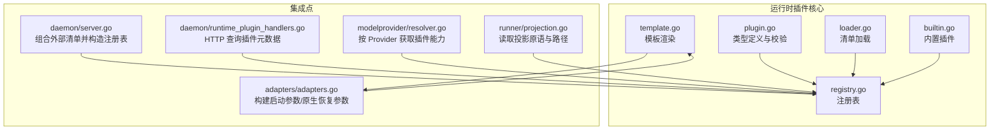
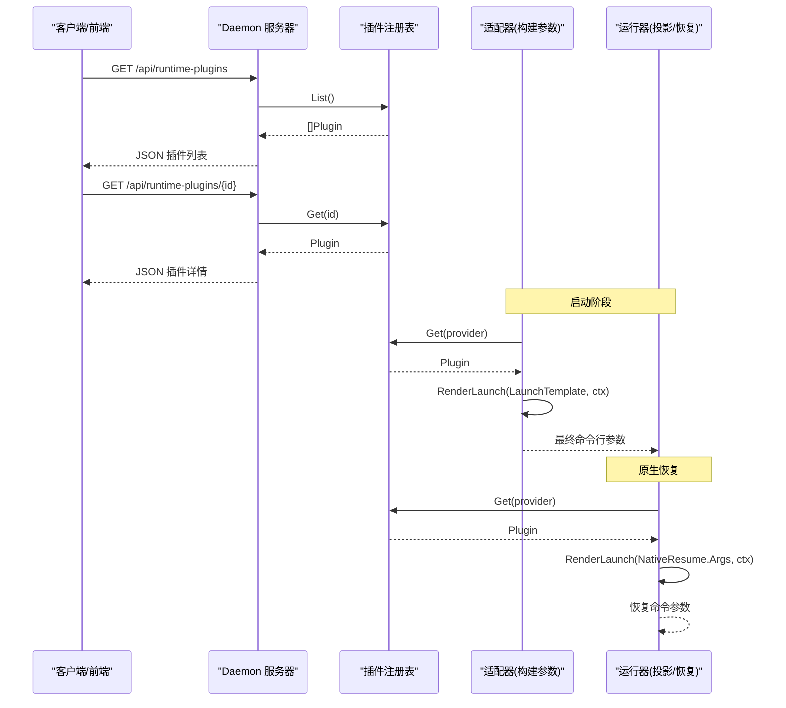
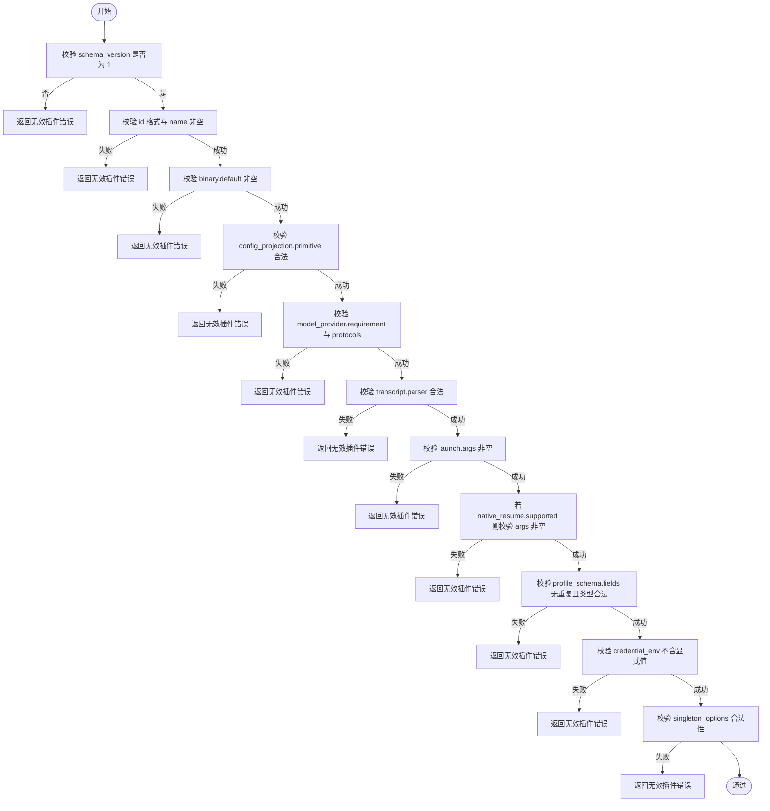
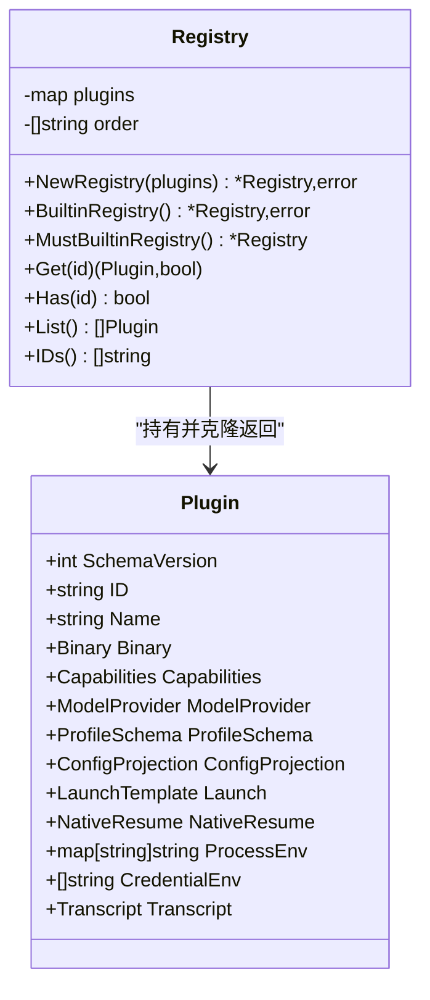
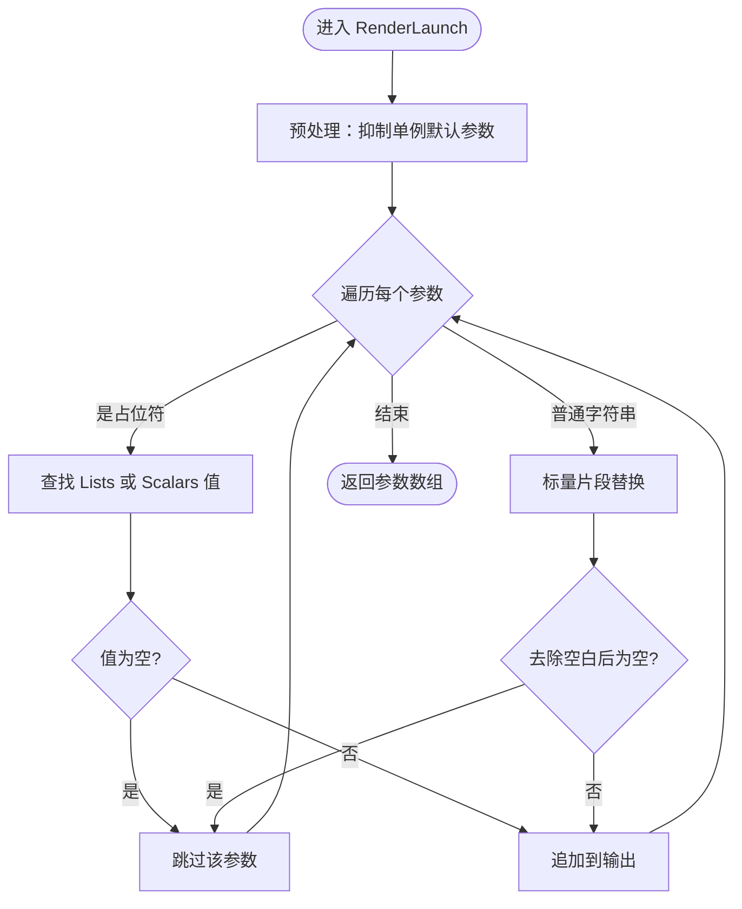
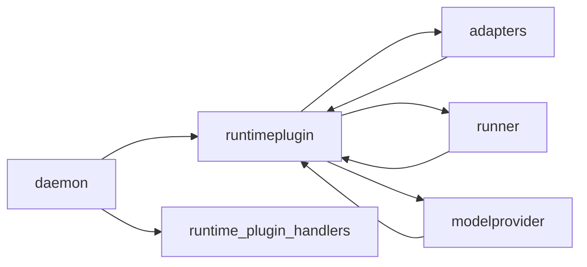

# 运行时插件系统

<cite>
**本文引用的文件列表**
- [internal/runtimeplugin/plugin.go](file://internal/runtimeplugin/plugin.go)
- [internal/runtimeplugin/loader.go](file://internal/runtimeplugin/loader.go)
- [internal/runtimeplugin/registry.go](file://internal/runtimeplugin/registry.go)
- [internal/runtimeplugin/builtin.go](file://internal/runtimeplugin/builtin.go)
- [internal/runtimeplugin/template.go](file://internal/runtimeplugin/template.go)
- [internal/runtimeplugin/plugin_test.go](file://internal/runtimeplugin/plugin_test.go)
- [internal/runtimeplugin/template_test.go](file://internal/runtimeplugin/template_test.go)
- [internal/daemon/server.go](file://internal/daemon/server.go)
- [internal/daemon/runtime_plugin_handlers.go](file://internal/daemon/runtime_plugin_handlers.go)
- [internal/adapters/adapters.go](file://internal/adapters/adapters.go)
- [internal/modelprovider/resolver.go](file://internal/modelprovider/resolver.go)
- [internal/runner/projection.go](file://internal/runner/projection.go)
</cite>

## 目录
1. [简介](#简介)
2. [项目结构](#项目结构)
3. [核心组件](#核心组件)
4. [架构总览](#架构总览)
5. [详细组件分析](#详细组件分析)
6. [依赖关系分析](#依赖关系分析)
7. [性能与可扩展性](#性能与可扩展性)
8. [故障排查指南](#故障排查指南)
9. [结论](#结论)
10. [附录：自定义运行时插件开发指南](#附录自定义运行时插件开发指南)

## 简介
本文件系统性地解析“运行时插件系统”的声明式配置架构、加载流程、注册表管理、内置插件实现，以及模板渲染、启动参数生成、单例选项、原生恢复支持、二进制发现、进程环境配置、凭据注入与安全约束。同时提供面向扩展者的自定义运行时插件开发指南，涵盖配置文件规范、API 接口与测试策略。

## 项目结构
运行时插件系统位于 internal/runtimeplugin 包，围绕“声明式清单 + 验证 + 注册表 + 模板渲染”展开；在 Daemon 层暴露 HTTP API，供前端与管理面使用；在适配器与运行器中用于构建启动参数、投影配置与原生恢复命令。

图表来源
- [internal/runtimeplugin/plugin.go:1-224](file://internal/runtimeplugin/plugin.go#L1-L224)
- [internal/runtimeplugin/loader.go:1-49](file://internal/runtimeplugin/loader.go#L1-L49)
- [internal/runtimeplugin/registry.go:1-99](file://internal/runtimeplugin/registry.go#L1-L99)
- [internal/runtimeplugin/builtin.go:1-221](file://internal/runtimeplugin/builtin.go#L1-L221)
- [internal/runtimeplugin/template.go:1-166](file://internal/runtimeplugin/template.go#L1-L166)
- [internal/daemon/server.go:346-358](file://internal/daemon/server.go#L346-L358)
- [internal/daemon/runtime_plugin_handlers.go:1-33](file://internal/daemon/runtime_plugin_handlers.go#L1-L33)
- [internal/adapters/adapters.go:45-114](file://internal/adapters/adapters.go#L45-L114)
- [internal/modelprovider/resolver.go:140-145](file://internal/modelprovider/resolver.go#L140-L145)
- [internal/runner/projection.go:318-323](file://internal/runner/projection.go#L318-L323)

章节来源
- [internal/runtimeplugin/plugin.go:1-224](file://internal/runtimeplugin/plugin.go#L1-L224)
- [internal/runtimeplugin/loader.go:1-49](file://internal/runtimeplugin/loader.go#L1-L49)
- [internal/runtimeplugin/registry.go:1-99](file://internal/runtimeplugin/registry.go#L1-L99)
- [internal/runtimeplugin/builtin.go:1-221](file://internal/runtimeplugin/builtin.go#L1-L221)
- [internal/runtimeplugin/template.go:1-166](file://internal/runtimeplugin/template.go#L1-L166)
- [internal/daemon/server.go:346-358](file://internal/daemon/server.go#L346-L358)
- [internal/daemon/runtime_plugin_handlers.go:1-33](file://internal/daemon/runtime_plugin_handlers.go#L1-L33)
- [internal/adapters/adapters.go:45-114](file://internal/adapters/adapters.go#L45-L114)
- [internal/modelprovider/resolver.go:140-145](file://internal/modelprovider/resolver.go#L140-L145)
- [internal/runner/projection.go:318-323](file://internal/runner/projection.go#L318-L323)

## 核心组件
- 清单结构与校验
  - Plugin 结构体承载 Schema 版本、ID、名称、描述、二进制定位、能力声明、模型提供者要求、Profile 字段模式、配置投影、启动模板、原生恢复、进程环境变量、凭据注入与环境变量名白名单、转录解析器选择等。
  - Validate 函数对 ID 格式、必填项、枚举值（投影原语、转录解析器、模型提供者协议）、重复字段、凭据环境变量命名安全等进行严格校验。
- 清单加载与注册表
  - LoadDirectory 仅扫描顶层 .json 清单，解码后执行 Validate，收集错误并返回有效清单集合。
  - Registry 维护去重、排序、克隆返回的只读视图，并提供 Get/List/Has/IDs 等方法。
- 内置插件
  - 内置 fake、codex、claude_code、pi 四个插件，统一包含通用 Profile 字段集，声明各自的能力、模型提供者协议、配置投影、启动模板、原生恢复、进程环境与凭据注入。
- 模板渲染
  - RenderLaunch 将 LaunchTemplate.Args 中的占位符替换为标量或列表值，支持单例选项抑制默认参数、空占位符省略、可选前缀处理。
  - RenderEnv 将进程环境变量模板中的标量片段进行替换。

章节来源
- [internal/runtimeplugin/plugin.go:19-215](file://internal/runtimeplugin/plugin.go#L19-L215)
- [internal/runtimeplugin/loader.go:11-48](file://internal/runtimeplugin/loader.go#L11-L48)
- [internal/runtimeplugin/registry.go:8-99](file://internal/runtimeplugin/registry.go#L8-L99)
- [internal/runtimeplugin/builtin.go:3-214](file://internal/runtimeplugin/builtin.go#L3-L214)
- [internal/runtimeplugin/template.go:13-166](file://internal/runtimeplugin/template.go#L13-L166)

## 架构总览
运行时插件系统在 Daemon 启动时合并内置与外部清单，构建全局注册表；HTTP 接口暴露插件元数据；适配器根据 Profile 与任务目标渲染启动参数；运行器依据插件的配置投影原语写入运行时配置；模型提供者解析器与预检逻辑通过插件能力决定行为；原生恢复由插件声明的会话源与参数模板驱动。

图表来源
- [internal/daemon/runtime_plugin_handlers.go:9-33](file://internal/daemon/runtime_plugin_handlers.go#L9-L33)
- [internal/daemon/server.go:346-358](file://internal/daemon/server.go#L346-L358)
- [internal/adapters/adapters.go:49-64](file://internal/adapters/adapters.go#L49-L64)
- [internal/adapters/adapters.go:67-114](file://internal/adapters/adapters.go#L67-L114)
- [internal/runner/projection.go:318-323](file://internal/runner/projection.go#L318-L323)

## 详细组件分析

### 清单结构与验证机制
- 关键字段
  - SchemaVersion：当前固定为 1，用于向后兼容控制。
  - ID：小写字母开头，允许字母数字、下划线、点、连字符。
  - Binary.Default：必须存在；Binary.ProfileField 可指定从 Profile 覆盖二进制路径。
  - Capabilities：沙箱/主机、MCP 配置、流式转录、恢复、持久会话、发送轮次、中断、中断替换、轮内引导、权限响应、会话恢复等。
  - ModelProvider.Requirement：none/optional/required；SupportedProtocols/ProtocolPreference 限定支持的协议及偏好顺序。
  - ProfileSchema.Fields：字段名、类型、标签；类型包括 string/url/string_list/env_map/secret_env_map/mcp_servers/runtime_extensions/runner。
  - ConfigProjection.Primitive：none/generic_config/codex_home/claude_settings/pi_agent；可选 config_path 与 mcp_config_path。
  - Launch.Template.Args：启动参数模板；SingletonOptions：单例选项组，用于抑制默认参数。
  - NativeResume：是否支持原生恢复、会话源、恢复参数模板。
  - ProcessEnv：进程环境变量模板；CredentialEnv：注入凭据的环境变量名白名单。
  - Transcript.Parser：plain_runtime_output/codex_json/claude_stream_json/pi_json_session。
- 校验要点
  - 拒绝未知投影原语、未知转录解析器、未知模型提供者协议或缺少支持却出现在偏好列表中。
  - 禁止 CredentialEnv 中出现显式值（如包含等号或常见密钥前缀）。
  - 禁止重复 Profile 字段名、非法 ID、缺失必填项。
  - 若启用原生恢复，必须提供恢复参数模板。

图表来源
- [internal/runtimeplugin/plugin.go:136-215](file://internal/runtimeplugin/plugin.go#L136-L215)

章节来源
- [internal/runtimeplugin/plugin.go:19-215](file://internal/runtimeplugin/plugin.go#L19-L215)

### 清单加载与注册表管理
- 加载流程
  - 仅读取顶层 .json 文件，跳过目录与非 json 文件。
  - 逐个解码并调用 Validate，累积错误并返回有效清单集合。
- 注册表特性
  - 构造时再次 Validate，拒绝重复 ID。
  - 内部维护有序 ID 列表，List/Get 返回深拷贝，避免共享可变状态。
  - 提供 MustBuiltinRegistry 便捷方法快速获得内置注册表。

图表来源
- [internal/runtimeplugin/registry.go:8-99](file://internal/runtimeplugin/registry.go#L8-L99)
- [internal/runtimeplugin/plugin.go:19-96](file://internal/runtimeplugin/plugin.go#L19-L96)

章节来源
- [internal/runtimeplugin/loader.go:11-48](file://internal/runtimeplugin/loader.go#L11-L48)
- [internal/runtimeplugin/registry.go:13-99](file://internal/runtimeplugin/registry.go#L13-L99)

### 内置插件实现
- 通用 Profile 字段
  - 包含 binary_path、model、endpoint、custom_args、env、api_keys、credential_refs、runtime_extensions、mcp_servers、default_runner、sandbox_image 等。
- 各内置插件要点
  - fake：测试用，无需模型提供者，能力全面，简单启动模板。
  - codex：OpenAI Codex CLI，要求 openai_responses 协议，投影到 codex_home，支持原生恢复，设置 CODEX_HOME，注入 OPENAI_API_KEY/CODEX_API_KEY。
  - claude_code：Anthropic Claude Code CLI，要求 anthropic_messages 协议，投影到 claude settings.json 与 .mcp.json，支持原生恢复，设置 CLAUDE_HOME，注入 ANTHROPIC_AUTH_TOKEN/ANTHROPIC_API_KEY。
  - pi：Pi 编码代理，支持多协议，投影到 pi agent models.json 与 mcp.json，支持原生恢复，设置 PI_CODING_AGENT_DIR/SESSION_DIR，注入 ANTHROPIC_API_KEY/OPENAI_API_KEY。

章节来源
- [internal/runtimeplugin/builtin.go:3-214](file://internal/runtimeplugin/builtin.go#L3-L214)

### 模板系统与启动参数生成
- 渲染上下文
  - Scalars：标量键值对，如 binary、model、config_path、goal 等。
  - Lists：列表键值对，如 custom_args、mcp_args、codex_exec_args、pi_provider_args 等。
- 关键行为
  - 单例选项抑制：当用户自定义参数包含某组选项时，自动抑制模板中的默认对应选项及其 Arity 个后续参数。
  - 可选前缀省略：以“-”开头的可选参数，若其占位符为空则整体省略。
  - 列表占位符展开：将列表元素逐一拼接，过滤空串。
  - 标量片段替换：支持 {{var}} 形式的嵌套替换。
- 典型用法
  - BuildLaunchArgs：根据 Provider 与 Profile 构建启动参数。
  - BuildNativeResumeArgs：根据 Provider 与原生会话信息构建恢复参数。

图表来源
- [internal/runtimeplugin/template.go:13-44](file://internal/runtimeplugin/template.go#L13-L44)
- [internal/runtimeplugin/template.go:63-84](file://internal/runtimeplugin/template.go#L63-L84)
- [internal/runtimeplugin/template.go:130-145](file://internal/runtimeplugin/template.go#L130-L145)

章节来源
- [internal/runtimeplugin/template.go:13-166](file://internal/runtimeplugin/template.go#L13-L166)
- [internal/adapters/adapters.go:49-64](file://internal/adapters/adapters.go#L49-L64)
- [internal/adapters/adapters.go:67-114](file://internal/adapters/adapters.go#L67-L114)

### 二进制文件发现
- DetectBinary 流程
  - 优先使用配置的 binary_path，否则回退到插件默认二进制名。
  - 若非绝对路径，则在 PATH 或指定 LookupPath 中查找。
  - 检查存在性与可执行性，拒绝目录候选。
- 默认二进制来源
  - defaultBinary 通过注册表获取插件的 Binary.Default。

章节来源
- [internal/adapters/adapters.go:219-241](file://internal/adapters/adapters.go#L219-L241)
- [internal/adapters/adapters.go:137-144](file://internal/adapters/adapters.go#L137-L144)

### 进程环境配置与凭据注入
- 进程环境
  - 插件声明 ProcessEnv 模板，RenderEnv 将标量片段替换后注入。
  - 内置插件设置各自的 HOME/SESSION 目录，便于隔离与恢复。
- 凭据注入
  - 插件声明 CredentialEnv 白名单，仅允许特定环境变量名被注入，防止硬编码密钥泄露。
  - 适配器与运行器在投影阶段将模型提供者凭据材料化到受控位置，并通过环境变量或配置文件传递给子进程。

章节来源
- [internal/runtimeplugin/template.go:46-61](file://internal/runtimeplugin/template.go#L46-L61)
- [internal/runtimeplugin/builtin.go:81-83](file://internal/runtimeplugin/builtin.go#L81-L83)
- [internal/runtimeplugin/builtin.go:151-153](file://internal/runtimeplugin/builtin.go#L151-L153)
- [internal/runtimeplugin/builtin.go:206-211](file://internal/runtimeplugin/builtin.go#L206-L211)

### 安全约束
- 清单校验
  - 拒绝显式凭据值出现在 CredentialEnv 中。
  - 限制 ID 格式与字段类型，避免注入风险。
- 配置投影
  - 所有含敏感信息的 JSON 配置均以 0o600 权限写入，集中审计。
- 请求来源防护
  - Daemon 在路由前校验 Origin，阻止 DNS 重绑定与跨站请求。

章节来源
- [internal/runtimeplugin/plugin.go:198-205](file://internal/runtimeplugin/plugin.go#L198-L205)
- [internal/runner/projection.go:366-379](file://internal/runner/projection.go#L366-L379)
- [internal/daemon/server.go:383-411](file://internal/daemon/server.go#L383-L411)

### 原生恢复支持
- 插件声明
  - NativeResume.Supported 表示支持原生恢复；SessionSource 指明会话源类型；Args 为恢复参数模板。
- 参数构建
  - BuildNativeResumeArgs 根据 Provider 与 Profile 填充 scalars/lists，再渲染 NativeResume.Args。
- 内置插件
  - codex：使用 codex_session_jsonl 源，exec resume 子命令。
  - claude_code：使用 claude_stream_json 源，--resume 参数。
  - pi：使用 pi_json_session 源，--session 参数。

章节来源
- [internal/runtimeplugin/builtin.go:76-84](file://internal/runtimeplugin/builtin.go#L76-L84)
- [internal/runtimeplugin/builtin.go:134-153](file://internal/runtimeplugin/builtin.go#L134-L153)
- [internal/runtimeplugin/builtin.go:193-211](file://internal/runtimeplugin/builtin.go#L193-L211)
- [internal/adapters/adapters.go:67-114](file://internal/adapters/adapters.go#L67-L114)

### 配置投影与 MCP 集成
- 投影原语
  - none：不生成额外配置。
  - generic_config：序列化 Profile 为 JSON 配置。
  - codex_home：生成 codex 的 config.toml 与 auth.json。
  - claude_settings：生成 settings.json 与 .mcp.json。
  - pi_agent：生成 models.json 与 mcp.json。
- MCP 集成
  - 根据 Profile 的 mcp_servers 字段收集并写入 .mcp.json，并在某些插件中启用工具白名单与插件安装引用。

章节来源
- [internal/runner/projection.go:318-323](file://internal/runner/projection.go#L318-L323)
- [internal/runner/projection.go:390-460](file://internal/runner/projection.go#L390-L460)
- [internal/runner/projection.go:462-514](file://internal/runner/projection.go#L462-L514)

## 依赖关系分析
- 组件耦合
  - adapters 与 runner 强依赖 registry 提供的插件元数据；daemon 负责组装外部清单与注册表；modelprovider 与 preflight 通过插件能力判断行为。
- 直接依赖
  - runtimeplugin 包自包含类型、校验、加载、注册表与模板渲染。
  - daemon 组合外部清单目录，构造注册表并暴露 HTTP 接口。
  - adapters 使用 MustBuiltinRegistry 获取内置能力，渲染启动参数。
  - runner 使用插件元数据确定投影原语与路径。
- 潜在循环
  - 当前设计清晰分层，未见循环依赖。

图表来源
- [internal/daemon/server.go:346-358](file://internal/daemon/server.go#L346-L358)
- [internal/daemon/runtime_plugin_handlers.go:9-33](file://internal/daemon/runtime_plugin_handlers.go#L9-L33)
- [internal/adapters/adapters.go:49-64](file://internal/adapters/adapters.go#L49-L64)
- [internal/runner/projection.go:318-323](file://internal/runner/projection.go#L318-L323)
- [internal/modelprovider/resolver.go:140-145](file://internal/modelprovider/resolver.go#L140-L145)

章节来源
- [internal/daemon/server.go:346-358](file://internal/daemon/server.go#L346-L358)
- [internal/daemon/runtime_plugin_handlers.go:9-33](file://internal/daemon/runtime_plugin_handlers.go#L9-L33)
- [internal/adapters/adapters.go:49-64](file://internal/adapters/adapters.go#L49-L64)
- [internal/runner/projection.go:318-323](file://internal/runner/projection.go#L318-L323)
- [internal/modelprovider/resolver.go:140-145](file://internal/modelprovider/resolver.go#L140-L145)

## 性能与可扩展性
- 性能
  - 注册表构造时对插件进行一次性校验与排序，Get/List 返回深拷贝，避免并发修改带来的锁开销。
  - 模板渲染为线性扫描与字符串替换，复杂度与参数数量线性相关，适合短参数列表场景。
- 可扩展性
  - 通过外部清单目录动态扩展插件，无需改动核心代码。
  - 新增投影原语需在 runner 中实现对应投影逻辑，并在 plugin.go 中登记合法原语。
  - 新增转录解析器需在 plugin.go 中登记合法解析器名称，并在转录管线中实现解析器。

[本节为通用指导，不涉及具体文件分析]

## 故障排查指南
- 清单加载失败
  - 检查目录是否为空或不可读；确认 .json 文件格式正确；查看返回的错误列表。
- 校验失败
  - 核对 schema_version、id 格式、必填项、枚举值、重复字段、凭据环境变量命名。
- 注册表冲突
  - 确保外部清单未与内置插件 ID 冲突；重复 ID 会在 NewRegistry 时报错。
- 模板渲染异常
  - 检查占位符是否闭合；确认标量/列表上下文是否完整；注意单例选项抑制导致的默认参数缺失。
- 二进制未发现
  - 确认 binary_path 配置或 PATH 中存在可执行文件；检查是否为目录而非二进制。
- 原生恢复失败
  - 确认插件声明了原生恢复支持且提供了恢复参数模板；检查会话源与参数是否正确。

章节来源
- [internal/runtimeplugin/loader.go:11-48](file://internal/runtimeplugin/loader.go#L11-L48)
- [internal/runtimeplugin/plugin.go:136-215](file://internal/runtimeplugin/plugin.go#L136-L215)
- [internal/runtimeplugin/registry.go:13-27](file://internal/runtimeplugin/registry.go#L13-L27)
- [internal/runtimeplugin/template.go:130-145](file://internal/runtimeplugin/template.go#L130-L145)
- [internal/adapters/adapters.go:219-241](file://internal/adapters/adapters.go#L219-L241)
- [internal/adapters/adapters.go:67-114](file://internal/adapters/adapters.go#L67-L114)

## 结论
运行时插件系统通过声明式清单实现了高度可扩展的运行时适配能力。严格的校验与安全的凭据注入保障了系统的健壮性与安全性；模板渲染与原生恢复提升了灵活性与可用性；注册表与 HTTP 接口为上层服务提供了统一的元数据访问能力。

[本节为总结，不涉及具体文件分析]

## 附录：自定义运行时插件开发指南

### 配置文件规范
- 基本字段
  - schema_version：必须为 1。
  - id：唯一标识，遵循小写起始与允许的字符集。
  - name/description：人类可读的名称与描述。
  - binary：至少提供 default；如需从 Profile 覆盖，设置 profile_field。
- 能力声明
  - capabilities：按需开启 sandbox/host/mcp_config/streaming_transcript/resume/persistent_session/send_turn/interrupt_turn/interrupt_then_replace/in_turn_steer/permission_response/resume_session。
- 模型提供者
  - model_provider：requirement 设为 required/optional/none；supported_protocols 与 protocol_preference 需一致且合法。
- Profile 字段
  - profile_schema.fields：定义 UI 表单字段，type 必须在允许集合内。
- 配置投影
  - config_projection.primitive：选择 none/generic_config/codex_home/claude_settings/pi_agent；必要时提供 config_path 与 mcp_config_path。
- 启动模板
  - launch.args：使用 {{binary}}、{{model}}、{{goal}}、{{mcp_args}}、{{custom_args}} 等占位符；可按需定义 singleton_options 抑制默认参数。
- 原生恢复
  - native_resume：若 supported 为 true，需提供 session_source 与 args 模板。
- 进程环境与凭据
  - process_env：声明需要注入的环境变量模板。
  - credential_env：仅列出环境变量名，不得包含显式值。
- 转录解析器
  - transcript.parser：选择 plain_runtime_output/codex_json/claude_stream_json/pi_json_session。

章节来源
- [internal/runtimeplugin/plugin.go:19-135](file://internal/runtimeplugin/plugin.go#L19-L135)
- [internal/runtimeplugin/builtin.go:3-214](file://internal/runtimeplugin/builtin.go#L3-L214)

### API 接口
- 列出插件
  - GET /api/runtime-plugins：返回所有可用插件的元数据（不包含已解析的凭据值）。
- 获取插件详情
  - GET /api/runtime-plugins/{plugin_id}：返回指定插件的元数据。

章节来源
- [internal/daemon/runtime_plugin_handlers.go:9-33](file://internal/daemon/runtime_plugin_handlers.go#L9-L33)

### 测试策略
- 清单校验测试
  - 覆盖缺失必填项、未知枚举值、重复字段、凭据环境变量显式值等场景。
- 注册表测试
  - 验证内置插件集合稳定、Get 返回副本、重复 ID 报错。
- 模板渲染测试
  - 验证标量与列表占位符替换、单例选项抑制、空占位符省略、Goal 分隔符处理。
- 二进制发现测试
  - 验证 PATH 查找、绝对路径优先、目录拒绝。
- 原生恢复测试
  - 验证各内置插件的原生恢复参数模板与会话源。

章节来源
- [internal/runtimeplugin/plugin_test.go:12-354](file://internal/runtimeplugin/plugin_test.go#L12-L354)
- [internal/runtimeplugin/template_test.go:10-102](file://internal/runtimeplugin/template_test.go#L10-L102)