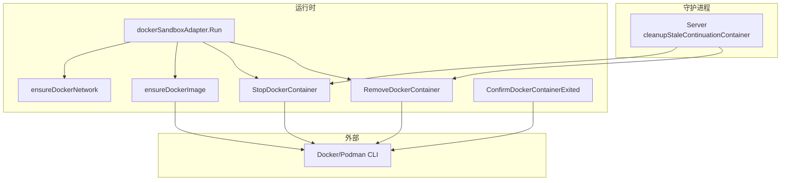
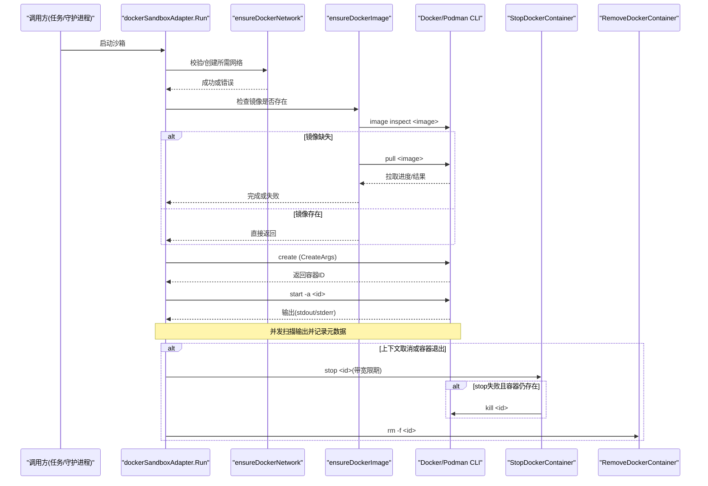
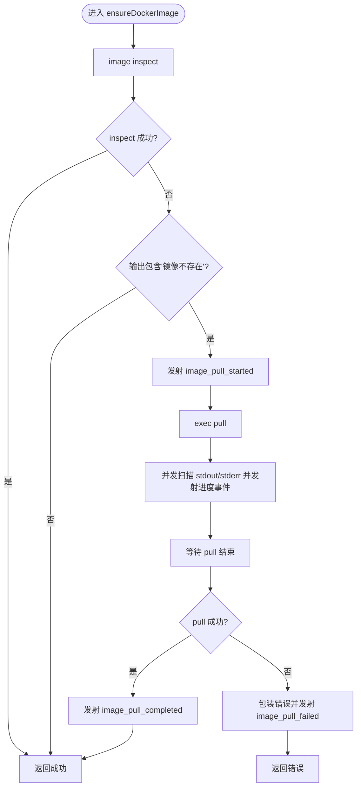
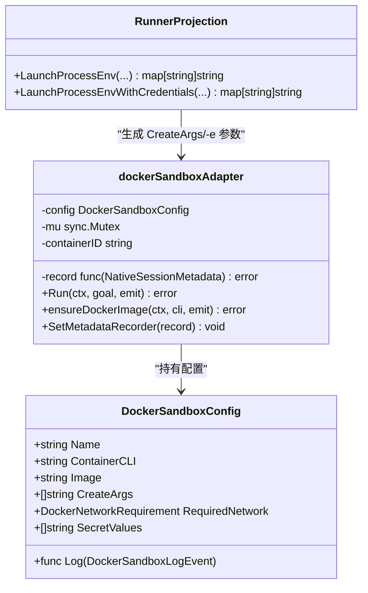
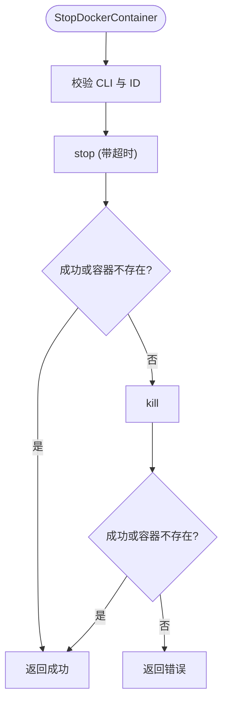
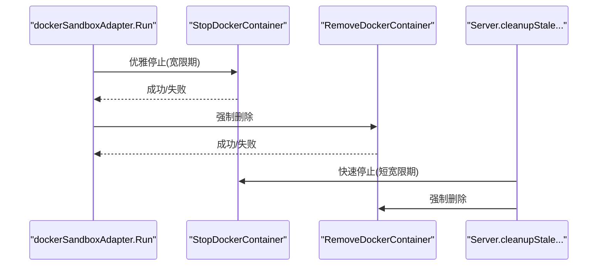
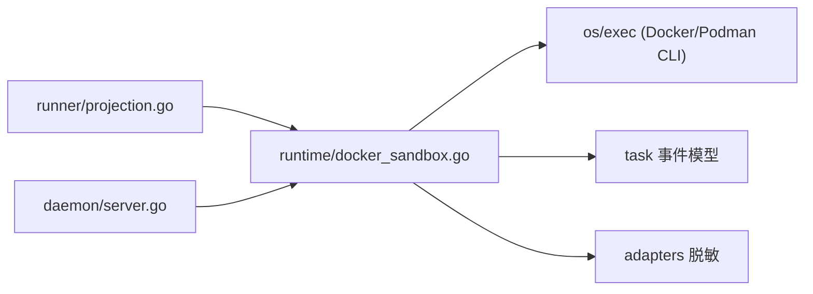

# 容器生命周期管理

<cite>
**本文引用的文件**
- [docker_sandbox.go](file://internal/runtime/docker_sandbox.go)
- [container.go](file://internal/runtime/container.go)
- [session_bridge.go](file://internal/runtime/session_bridge.go)
- [server.go](file://internal/daemon/server.go)
- [projection.go](file://internal/runner/projection.go)
</cite>

## 目录
1. [简介](#简介)
2. [项目结构](#项目结构)
3. [核心组件](#核心组件)
4. [架构总览](#架构总览)
5. [详细组件分析](#详细组件分析)
6. [依赖关系分析](#依赖关系分析)
7. [性能与可靠性考量](#性能与可靠性考量)
8. [故障排查指南](#故障排查指南)
9. [结论](#结论)

## 简介
本文件聚焦于本地优先的渗透测试代理中，Docker 容器的完整生命周期管理：镜像检查与拉取、容器创建、启动、停止与清理；并深入解析 ensureDockerImage 的镜像存在性检查与自动拉取机制（含进度事件发射与错误处理）、容器创建参数构建与环境变量注入过程、优雅停止与强制终止策略、资源清理机制，以及容器状态监控与故障恢复的最佳实践。

## 项目结构
与容器生命周期相关的核心代码位于 runtime 包，由 daemon 层在任务调度与恢复流程中调用。关键文件职责如下：
- internal/runtime/docker_sandbox.go：Docker 沙箱适配器实现，负责镜像检查/拉取、容器创建/启动/停止/清理、网络要求校验、输出扫描与事件发射。
- internal/runtime/container.go：容器 ID 文件读取与退出确认辅助函数。
- internal/runtime/session_bridge.go：会话桥接器对 Docker CLI 的封装，提供 Stop/Remove 等统一接口。
- internal/daemon/server.go：守护进程重启后的“陈旧容器”清理逻辑，确保系统一致性。
- internal/runner/projection.go：运行时环境变量的构建与注入（包括插件渲染、凭据材料化）。

图表来源
- [server.go:306-344](file://internal/daemon/server.go#L306-L344)
- [docker_sandbox.go:111-231](file://internal/runtime/docker_sandbox.go#L111-L231)
- [docker_sandbox.go:233-283](file://internal/runtime/docker_sandbox.go#L233-L283)
- [docker_sandbox.go:365-402](file://internal/runtime/docker_sandbox.go#L365-L402)
- [docker_sandbox.go:432-467](file://internal/runtime/docker_sandbox.go#L432-L467)
- [container.go:35-72](file://internal/runtime/container.go#L35-L72)

章节来源
- [docker_sandbox.go:111-231](file://internal/runtime/docker_sandbox.go#L111-L231)
- [docker_sandbox.go:233-283](file://internal/runtime/docker_sandbox.go#L233-L283)
- [docker_sandbox.go:365-402](file://internal/runtime/docker_sandbox.go#L365-L402)
- [docker_sandbox.go:432-467](file://internal/runtime/docker_sandbox.go#L432-L467)
- [container.go:35-72](file://internal/runtime/container.go#L35-L72)
- [server.go:306-344](file://internal/daemon/server.go#L306-L344)

## 核心组件
- dockerSandboxAdapter：封装 Docker 沙箱运行时的完整生命周期，包含镜像检查/拉取、网络要求校验、容器创建/启动、输出扫描、停止与清理。
- StopDockerContainer / RemoveDockerContainer：统一的容器停止与删除工具函数，具备优雅停止+强制终止的降级策略，并对“不存在”的错误进行幂等处理。
- ConfirmDockerContainerExited：基于 cidfile 轮询容器是否已退出，用于 adapter 返回后确认资源释放。
- SandboxSessionBridgeDocker 接口实现：将 Stop/Remove 委托给上述工具函数，供上层会话桥接使用。
- Server.cleanupStaleContinuationContainer：守护进程重启时，对残留的沙箱容器执行快速停止与清理，保证系统一致性。

章节来源
- [docker_sandbox.go:52-96](file://internal/runtime/docker_sandbox.go#L52-L96)
- [docker_sandbox.go:432-467](file://internal/runtime/docker_sandbox.go#L432-L467)
- [container.go:26-72](file://internal/runtime/container.go#L26-L72)
- [session_bridge.go:183-189](file://internal/runtime/session_bridge.go#L183-L189)
- [server.go:306-344](file://internal/daemon/server.go#L306-L344)

## 架构总览
下图展示了从任务启动到容器销毁的关键时序，包括镜像检查/拉取、容器创建/启动、输出扫描、优雅停止与强制终止、资源清理。

图表来源
- [docker_sandbox.go:111-231](file://internal/runtime/docker_sandbox.go#L111-L231)
- [docker_sandbox.go:233-283](file://internal/runtime/docker_sandbox.go#L233-L283)
- [docker_sandbox.go:432-467](file://internal/runtime/docker_sandbox.go#L432-L467)

## 详细组件分析

### 镜像检查与自动拉取：ensureDockerImage
- 存在性检查：通过 image inspect 判断镜像是否存在；若 inspect 报错但并非“镜像不存在”，则视为存在，不触发拉取。
- 自动拉取：仅在确认为“镜像不存在”时执行 pull；同时打开 stdout/stderr 管道并发扫描，逐行发射进度事件，并在结束时发送完成事件。
- 错误处理：任何阶段失败都会包装为错误并附带 image_pull_failed 事件；支持上下文取消传播。
- 安全与可观测性：所有事件载荷均经过脱敏处理；可选日志回调同步上报。

图表来源
- [docker_sandbox.go:233-283](file://internal/runtime/docker_sandbox.go#L233-L283)
- [docker_sandbox.go:285-288](file://internal/runtime/docker_sandbox.go#L285-L288)
- [docker_sandbox.go:290-327](file://internal/runtime/docker_sandbox.go#L290-L327)
- [docker_sandbox.go:329-354](file://internal/runtime/docker_sandbox.go#L329-L354)

章节来源
- [docker_sandbox.go:233-283](file://internal/runtime/docker_sandbox.go#L233-L283)
- [docker_sandbox.go:285-288](file://internal/runtime/docker_sandbox.go#L285-L288)
- [docker_sandbox.go:290-327](file://internal/runtime/docker_sandbox.go#L290-L327)
- [docker_sandbox.go:329-354](file://internal/runtime/docker_sandbox.go#L329-L354)

### 容器创建、ID 记录与环境变量注入
- 创建参数构建：
  - CreateArgs 必须为 docker create 的参数序列（不含 CLI），首个元素必须是 "create"。
  - 可通过 DockerSandboxCreateArgs 提取原始 argv，便于审计与安全回归测试。
- 环境变量注入：
  - 运行时环境由 runner 层构建，包含基础标识、MCP/认证信息、插件渲染的环境变量、凭据材料化值等。
  - 这些环境变量最终通过 CreateArgs 中的 -e 标志传入容器；SecretValues 仅用于输出脱敏，不会直接注入容器。
- ID 记录：
  - 容器创建成功后，adapter 会持久化容器 ID 到 NativeSessionMetadata，并通过事件发射 container_created。

图表来源
- [docker_sandbox.go:20-33](file://internal/runtime/docker_sandbox.go#L20-L33)
- [docker_sandbox.go:65-83](file://internal/runtime/docker_sandbox.go#L65-L83)
- [docker_sandbox.go:111-155](file://internal/runtime/docker_sandbox.go#L111-L155)
- [projection.go:1316-1413](file://internal/runner/projection.go#L1316-L1413)

章节来源
- [docker_sandbox.go:111-155](file://internal/runtime/docker_sandbox.go#L111-L155)
- [docker_sandbox.go:65-83](file://internal/runtime/docker_sandbox.go#L65-L83)
- [projection.go:1316-1413](file://internal/runner/projection.go#L1316-L1413)

### 优雅停止与强制终止：StopDockerContainer
- 优雅停止：先尝试 stop，带有宽限期超时；若容器不存在则视为成功（幂等）。
- 强制终止：stop 失败且容器仍存活时，降级为 kill。
- 错误识别：通过 isMissingDockerContainerError 识别“容器不存在”的输出文本，避免误报。

图表来源
- [docker_sandbox.go:432-467](file://internal/runtime/docker_sandbox.go#L432-L467)
- [docker_sandbox.go:478-504](file://internal/runtime/docker_sandbox.go#L478-L504)

章节来源
- [docker_sandbox.go:432-467](file://internal/runtime/docker_sandbox.go#L432-L467)
- [docker_sandbox.go:478-504](file://internal/runtime/docker_sandbox.go#L478-L504)

### 资源清理：RemoveDockerContainer
- 强制删除：rm -f 指定容器 ID，忽略“不存在”的错误，确保幂等清理。
- 集成点：
  - adapter.Run 的 defer 块中，无论正常退出还是上下文取消，都会尝试清理。
  - 守护进程 cleanupStaleContinuationContainer 在重启后对残留容器进行快速停止与清理。

图表来源
- [docker_sandbox.go:175-190](file://internal/runtime/docker_sandbox.go#L175-L190)
- [docker_sandbox.go:453-467](file://internal/runtime/docker_sandbox.go#L453-L467)
- [server.go:306-344](file://internal/daemon/server.go#L306-L344)

章节来源
- [docker_sandbox.go:175-190](file://internal/runtime/docker_sandbox.go#L175-L190)
- [docker_sandbox.go:453-467](file://internal/runtime/docker_sandbox.go#L453-L467)
- [server.go:306-344](file://internal/daemon/server.go#L306-L344)

### 网络要求校验：ensureDockerNetwork
- 若配置了 RequiredNetwork，则在创建容器前确保网络存在且属性匹配（driver、internal）。
- 若不存在则创建，并再次校验；若已存在但属性不一致，拒绝启动以保证隔离性。

章节来源
- [docker_sandbox.go:365-402](file://internal/runtime/docker_sandbox.go#L365-L402)
- [docker_sandbox.go:404-428](file://internal/runtime/docker_sandbox.go#L404-L428)

### 会话桥接与容器控制：DockerCLISandboxBridgeDocker
- 将 Stop/Remove 委托给统一工具函数，保持行为一致。
- 在 Start 失败路径中，也会主动 Stop/Remove 刚创建的容器，防止孤儿资源。

章节来源
- [session_bridge.go:183-189](file://internal/runtime/session_bridge.go#L183-L189)
- [session_bridge.go:300-352](file://internal/runtime/session_bridge.go#L300-L352)

## 依赖关系分析
- dockerSandboxAdapter 依赖：
  - exec.CommandContext 调用 Docker/Podman CLI。
  - adapters.Redact 对事件载荷进行脱敏。
  - task.EventKind 与 task.EventPayload 作为事件载体。
- 上层依赖：
  - runner/projection 负责构建 CreateArgs 与环境变量。
  - daemon/server 在守护进程生命周期内调用 Stop/Remove 以清理残留容器。

图表来源
- [projection.go:1316-1413](file://internal/runner/projection.go#L1316-L1413)
- [docker_sandbox.go:111-231](file://internal/runtime/docker_sandbox.go#L111-L231)
- [server.go:306-344](file://internal/daemon/server.go#L306-L344)

章节来源
- [projection.go:1316-1413](file://internal/runner/projection.go#L1316-L1413)
- [docker_sandbox.go:111-231](file://internal/runtime/docker_sandbox.go#L111-L231)
- [server.go:306-344](file://internal/daemon/server.go#L306-L344)

## 性能与可靠性考量
- 镜像拉取并行扫描：stdout/stderr 双协程并发扫描，降低 IO 阻塞风险，提升进度反馈及时性。
- 优雅停止+强制终止：stop 失败即降级 kill，缩短异常退出时间窗口，提高整体稳定性。
- 幂等清理：移除“容器不存在”的错误视为成功，避免重复清理导致的抖动。
- 网络强校验：确保内部网络与驱动符合预期，防止意外暴露。
- 输出限制：单行最大长度限制，防止超大行导致内存压力。

[本节为通用指导，无需源码引用]

## 故障排查指南
- 镜像拉取失败：
  - 关注 image_pull_failed 事件与日志，定位网络/鉴权问题。
  - 确认 image inspect 非“镜像不存在”的其它错误不会被误判为需要拉取。
- 容器创建失败：
  - 检查 CreateArgs 是否以 "create" 开头，且参数合法。
  - 核对 RequiredNetwork 是否存在且属性正确。
- 容器无法停止：
  - 观察 stop 是否超时；必要时确认 kill 是否生效。
  - 若提示“容器不存在”，属于幂等场景，无需干预。
- 资源未清理：
  - 检查 adapter 的 defer 清理路径是否执行。
  - 守护进程重启后，cleanupStaleContinuationContainer 应能清理残留容器。
- 环境变量泄漏：
  - 使用 DockerSandboxCreateArgs 审计 argv，确保敏感信息未被明文传递至容器。
  - SecretValues 仅用于输出脱敏，不应出现在容器环境中。

章节来源
- [docker_sandbox.go:233-283](file://internal/runtime/docker_sandbox.go#L233-L283)
- [docker_sandbox.go:111-155](file://internal/runtime/docker_sandbox.go#L111-L155)
- [docker_sandbox.go:432-467](file://internal/runtime/docker_sandbox.go#L432-L467)
- [server.go:306-344](file://internal/daemon/server.go#L306-L344)
- [docker_sandbox.go:65-83](file://internal/runtime/docker_sandbox.go#L65-L83)

## 结论
该实现围绕“最小权限、强隔离、幂等清理、可观测”的原则构建了完整的容器生命周期管理：
- 镜像按需拉取，带进度与错误事件；
- 容器创建参数与环境变量集中构建，严格审计；
- 优雅停止与强制终止结合，保障退出时效；
- 守护进程级残留清理，确保系统一致性；
- 网络要求强校验，强化隔离边界。

遵循上述最佳实践，可在复杂任务编排下获得稳定、可观测、易排障的容器运行体验。