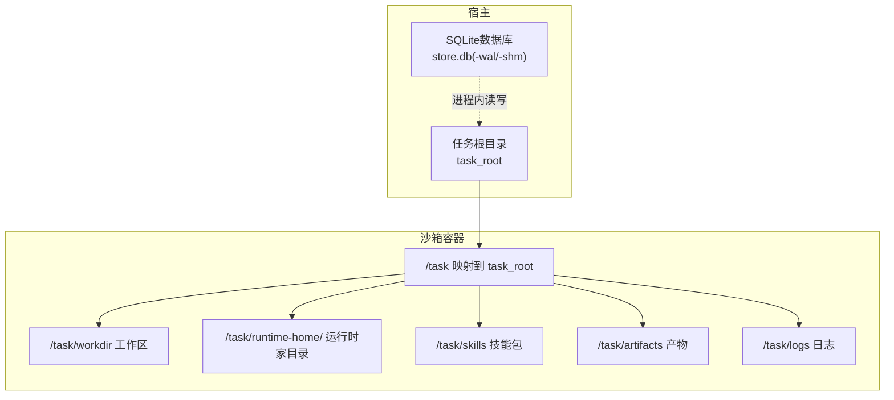
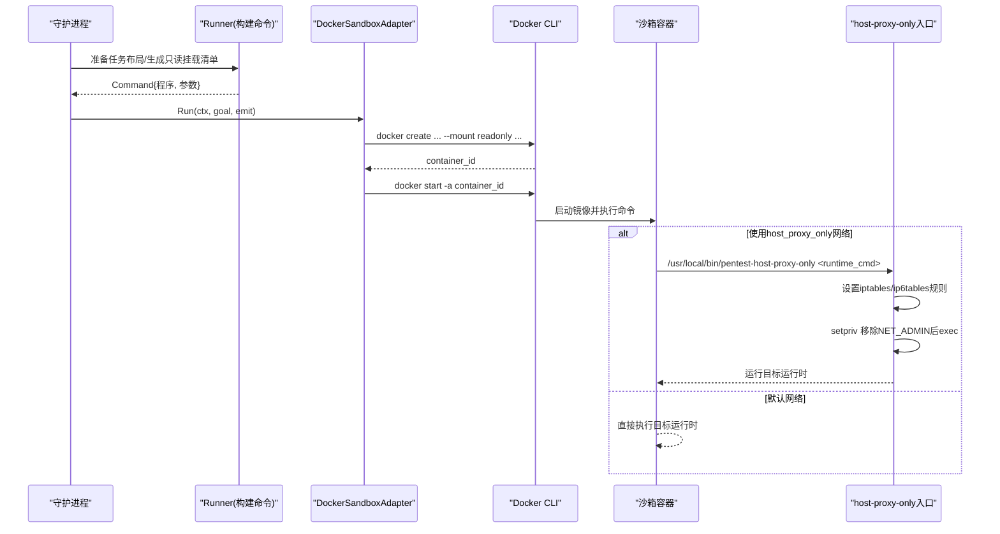
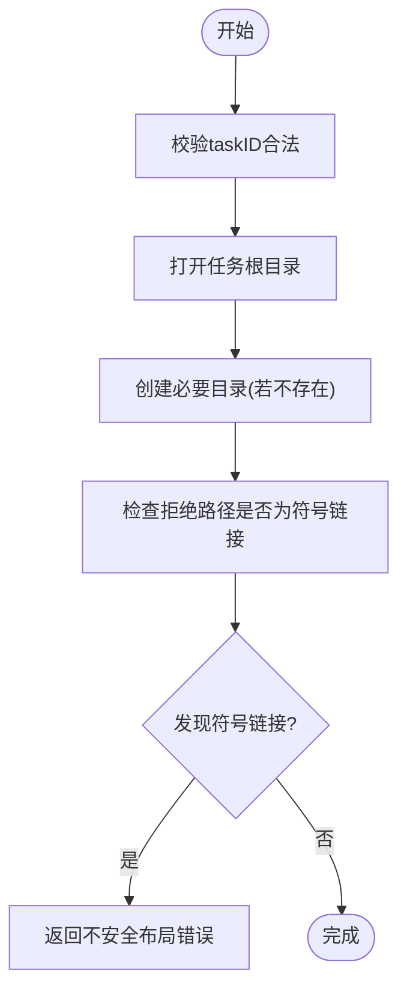
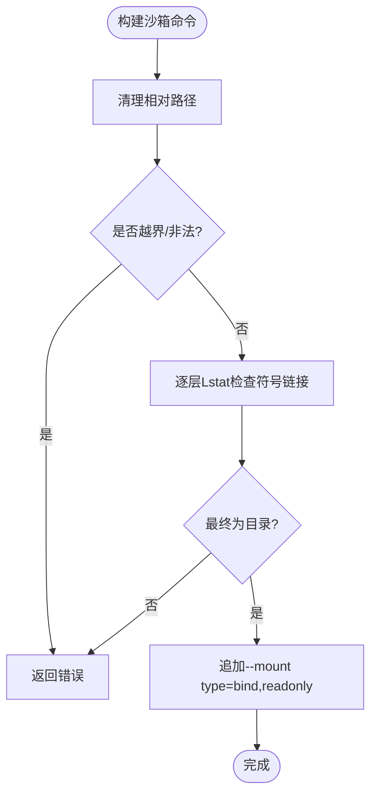
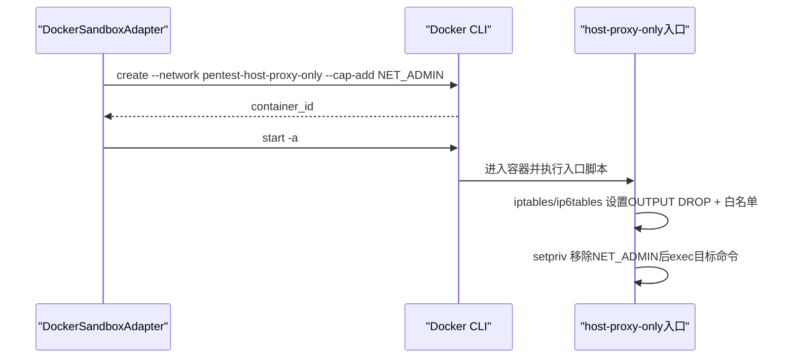
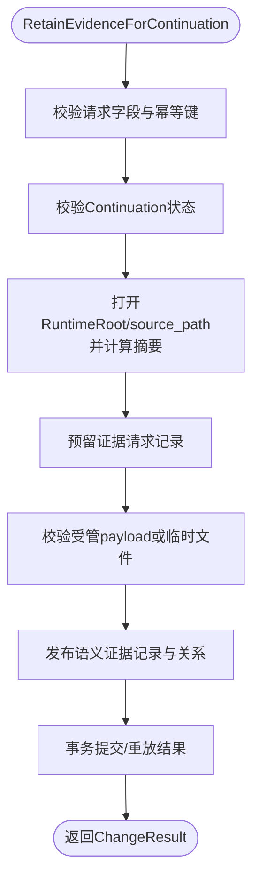
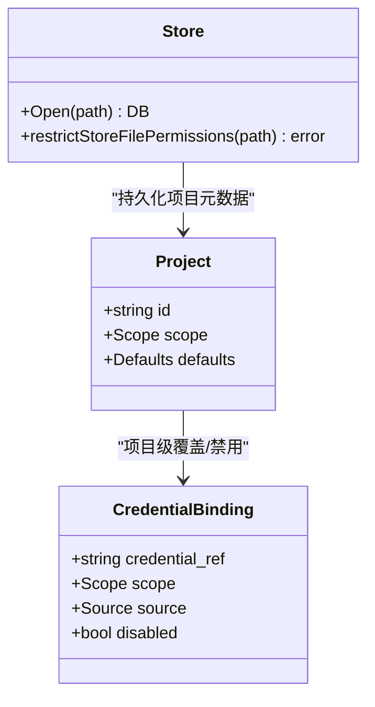
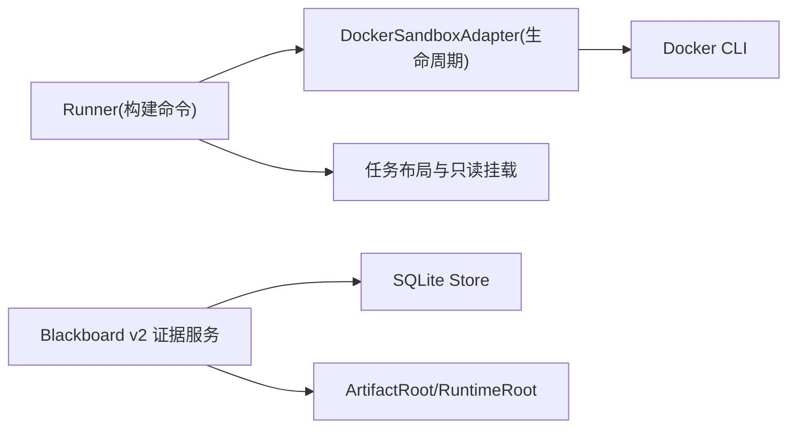

# 文件系统挂载与隔离

<cite>
**本文引用的文件**   
- [internal/runner/blackboard_v2_layout.go](file://internal/runner/blackboard_v2_layout.go)
- [internal/runner/runner.go](file://internal/runner/runner.go)
- [internal/runtime/docker_sandbox.go](file://internal/runtime/docker_sandbox.go)
- [docker/pentest-sandbox/host-proxy-only-entrypoint.sh](file://docker/pentest-sandbox/host-proxy-only-entrypoint.sh)
- [docker/pentest-sandbox/Dockerfile](file://docker/pentest-sandbox/Dockerfile)
- [internal/blackboardv2/evidence.go](file://internal/blackboardv2/evidence.go)
- [internal/store/store.go](file://internal/store/store.go)
- [internal/project/project.go](file://internal/project/project.go)
- [internal/credential/credential.go](file://internal/credential/credential.go)
- [internal/daemon/credential_test.go](file://internal/daemon/credential_test.go)
- [internal/runner/blackboard_v2_mount_test.go](file://internal/runner/blackboard_v2_mount_test.go)
- [internal/runner/runner_test.go](file://internal/runner/runner_test.go)
</cite>

## 目录
1. [简介](#简介)
2. [项目结构](#项目结构)
3. [核心组件](#核心组件)
4. [架构总览](#架构总览)
5. [详细组件分析](#详细组件分析)
6. [依赖关系分析](#依赖关系分析)
7. [性能考虑](#性能考虑)
8. [故障排查指南](#故障排查指南)
9. [结论](#结论)
10. [附录](#附录)

## 简介
本文聚焦于CyberPenda在沙箱环境中的文件系统挂载与隔离策略，系统性阐述：
- 只读挂载策略、目录权限控制与卷绑定机制
- Blackboard v2数据持久化存储的文件系统布局（实体关系图谱、证据文件与临时工作区隔离）
- 项目范围文件的访问控制、敏感数据保护与安全边界实现
- 自定义挂载点配置、符号链接处理与跨平台兼容性考量
- 文件系统安全配置与性能优化建议

## 项目结构
围绕“任务根目录”的布局由Runner层负责准备与校验，Runtime层通过Docker容器进行执行隔离，Blackboard v2服务负责证据等持久化数据的落盘与一致性保障。

图示来源
- [internal/runner/runner.go:106-137](file://internal/runner/runner.go#L106-L137)
- [internal/runner/blackboard_v2_layout.go:290-301](file://internal/runner/blackboard_v2_layout.go#L290-L301)
- [internal/runtime/docker_sandbox.go:133-178](file://internal/runtime/docker_sandbox.go#L133-L178)

章节来源
- [internal/runner/runner.go:106-137](file://internal/runner/runner.go#L106-L137)
- [internal/runner/blackboard_v2_layout.go:290-301](file://internal/runner/blackboard_v2_layout.go#L290-L301)

## 核心组件
- 任务布局与路径校验：确保任务根目录、子目录与关键拒绝路径不被绕过或替换为符号链接。
- 沙箱命令构建与只读挂载：将任务根目录以可写方式挂载到容器，再以只读bind覆盖关键文件或目录，防止运行时篡改。
- Docker网络与入口脚本：可选的host_proxy_only网络配合iptables限制出站流量，并在exec前剥离NET_ADMIN能力。
- Blackboard v2证据持久化：受控的ArtifactRoot与RuntimeRoot分离，原子发布与幂等重试，严格校验源文件完整性。
- 存储安全：SQLite文件权限收紧至仅所有者可读，WAL/SHM旁路文件同步受限。

章节来源
- [internal/runner/blackboard_v2_layout.go:27-113](file://internal/runner/blackboard_v2_layout.go#L27-L113)
- [internal/runner/runner.go:139-217](file://internal/runner/runner.go#L139-L217)
- [internal/runtime/docker_sandbox.go:365-428](file://internal/runtime/docker_sandbox.go#L365-L428)
- [docker/pentest-sandbox/host-proxy-only-entrypoint.sh:1-46](file://docker/pentest-sandbox/host-proxy-only-entrypoint.sh#L1-L46)
- [internal/blackboardv2/evidence.go:194-300](file://internal/blackboardv2/evidence.go#L194-L300)
- [internal/store/store.go:141-158](file://internal/store/store.go#L141-L158)

## 架构总览
下图展示了从Daemon到沙箱容器的完整启动流程，包括只读挂载、网络隔离与能力裁剪。

图示来源
- [internal/runner/runner.go:139-217](file://internal/runner/runner.go#L139-L217)
- [internal/runtime/docker_sandbox.go:111-231](file://internal/runtime/docker_sandbox.go#L111-L231)
- [docker/pentest-sandbox/host-proxy-only-entrypoint.sh:1-46](file://docker/pentest-sandbox/host-proxy-only-entrypoint.sh#L1-L46)

## 详细组件分析

### 任务布局与路径安全
- 布局职责：创建并校验任务根目录及其子目录；对关键拒绝路径进行符号链接检查，防止逃逸或替换。
- 安全要点：
  - 禁止taskID包含非法路径组件；
  - 拒绝workdir/.pentest、blackboard.json、scope.json等为符号链接；
  - 针对各Provider额外拒绝其配置文件（如config.toml、auth.json、settings.json、mcp.json等）。

图示来源
- [internal/runner/blackboard_v2_layout.go:27-113](file://internal/runner/blackboard_v2_layout.go#L27-L113)
- [internal/runner/blackboard_v2_layout.go:396-412](file://internal/runner/blackboard_v2_layout.go#L396-L412)

章节来源
- [internal/runner/blackboard_v2_layout.go:27-113](file://internal/runner/blackboard_v2_layout.go#L27-L113)

### 只读挂载策略与卷绑定
- 基础挂载：将宿主task_root以可写方式挂载到容器/task，工作目录设为/task/workdir。
- 只读覆盖：
  - ReadOnlyTaskFiles：按相对路径精确覆盖单个文件为只读；
  - ReadOnlyTaskDirs：按相对路径将整目录以只读方式挂载，且必须位于task_root下，不允许符号链接穿透。
- 校验逻辑：
  - 拒绝绝对路径、..越界、Windows反斜杠混用；
  - 逐层检查路径中是否存在符号链接，避免绕过只读策略。

图示来源
- [internal/runner/runner.go:179-243](file://internal/runner/runner.go#L179-L243)

章节来源
- [internal/runner/runner.go:139-217](file://internal/runner/runner.go#L139-L217)
- [internal/runner/blackboard_v2_mount_test.go:16-66](file://internal/runner/blackboard_v2_mount_test.go#L16-L66)
- [internal/runner/runner_test.go:50-68](file://internal/runner/runner_test.go#L50-L68)

### 网络隔离与能力裁剪（host-proxy-only）
- 网络模式：当选择host_proxy_only时，容器加入专用桥接网络，并通过入口脚本在命名空间内建立严格的出站白名单。
- 防火墙策略：
  - 允许回环与已建立连接；
  - 仅放行Docker Desktop host-gateway IPv4地址；
  - 同时配置IPv6策略，防止IPv6旁路。
- 能力裁剪：在exec之前使用setpriv移除NET_ADMIN能力，防止运行时修改规则。

图示来源
- [internal/runtime/docker_sandbox.go:365-428](file://internal/runtime/docker_sandbox.go#L365-L428)
- [docker/pentest-sandbox/host-proxy-only-entrypoint.sh:1-46](file://docker/pentest-sandbox/host-proxy-only-entrypoint.sh#L1-L46)

章节来源
- [internal/runtime/docker_sandbox.go:111-231](file://internal/runtime/docker_sandbox.go#L111-L231)
- [docker/pentest-sandbox/host-proxy-only-entrypoint.sh:1-46](file://docker/pentest-sandbox/host-proxy-only-entrypoint.sh#L1-L46)

### Blackboard v2 证据持久化与隔离
- 配置根：EvidenceConfig提供ArtifactRoot（受管产物根）与RuntimeRoot（运行时根），二者分离以实现隔离。
- 保留流程要点：
  - 幂等键与请求哈希校验，避免重复写入；
  - 验证Continuation状态与权限；
  - 打开RuntimeRoot下的源文件，计算sha256与大小；
  - 预留记录、校验受管目录与临时目录，必要时恢复未完成操作；
  - 语义提交与结果落库，保证一致性。
- 失败注入点：用于验证中断恢复与重放行为。

图示来源
- [internal/blackboardv2/evidence.go:194-300](file://internal/blackboardv2/evidence.go#L194-L300)

章节来源
- [internal/blackboardv2/evidence.go:194-300](file://internal/blackboardv2/evidence.go#L194-L300)

### 项目范围文件与敏感数据保护
- 项目范围文件：
  - scope.json与blackboard.json作为关键输入，可通过ReadOnlyTaskFiles以只读方式覆盖，防止运行时替换inode。
- 凭证绑定与最小暴露：
  - 支持全局与项目级绑定，项目级可覆盖或禁用；
  - 解析时仅注入环境变量或受控文件，不将明文透传到非预期位置；
  - 测试用例验证项目级绑定生效。
- 存储安全：
  - SQLite主文件及-WAL/-SHM旁路文件权限收紧至0600，避免其他本地用户读取。

图示来源
- [internal/project/project.go:20-72](file://internal/project/project.go#L20-L72)
- [internal/credential/credential.go:27-99](file://internal/credential/credential.go#L27-L99)
- [internal/store/store.go:141-158](file://internal/store/store.go#L141-L158)

章节来源
- [internal/runner/runner_test.go:50-68](file://internal/runner/runner_test.go#L50-L68)
- [internal/daemon/credential_test.go:148-175](file://internal/daemon/credential_test.go#L148-L175)
- [internal/store/store.go:141-158](file://internal/store/store.go#L141-L158)

### 自定义挂载点配置与符号链接处理
- 自定义挂载点：
  - 通过SandboxCommandRequest.ReadOnlyTaskFiles与ReadOnlyTaskDirs指定相对路径，内部转换为绝对路径并以readonly bind挂载；
  - 支持将skills目录以只读方式投影到沙箱内的固定路径。
- 符号链接处理：
  - 布局阶段拒绝关键路径为符号链接；
  - 只读目录校验逐层Lstat，一旦发现符号链接即拒绝；
  - 测试覆盖越界路径、绝对路径与符号链接场景。

章节来源
- [internal/runner/runner.go:179-243](file://internal/runner/runner.go#L179-L243)
- [internal/runner/blackboard_v2_layout.go:396-412](file://internal/runner/blackboard_v2_layout.go#L396-L412)
- [internal/runner/blackboard_v2_mount_test.go:42-66](file://internal/runner/blackboard_v2_mount_test.go#L42-L66)

### 跨平台兼容性考虑
- 路径规范：
  - 拒绝Windows风格反斜杠与绝对路径，统一使用正斜杠；
  - 使用filepath.Clean与ToSlash确保跨平台一致。
- 容器镜像：
  - 基于Kali Linux，安装常用工具链与浏览器，适配Linux环境；
  - 入口脚本依赖iptables/ip6tables与setpriv，需宿主机与镜像满足依赖。

章节来源
- [internal/runner/runner.go:179-243](file://internal/runner/runner.go#L179-L243)
- [docker/pentest-sandbox/Dockerfile:124-144](file://docker/pentest-sandbox/Dockerfile#L124-L144)

## 依赖关系分析
- Runner与Runtime解耦：Runner仅构造docker create参数，不执行容器；Runtime负责拉取镜像、创建与启动容器、输出重定向与生命周期管理。
- 网络与能力：仅在需要时启用host_proxy_only网络并授予NET_ADMIN，随后在入口脚本中立即移除，最小化特权窗口。
- 证据与存储：证据持久化依赖受管根与工作根分离，结合SQLite WAL模式与权限收紧，确保并发安全与机密性。

图示来源
- [internal/runner/runner.go:139-217](file://internal/runner/runner.go#L139-L217)
- [internal/runtime/docker_sandbox.go:111-231](file://internal/runtime/docker_sandbox.go#L111-L231)
- [internal/blackboardv2/evidence.go:194-300](file://internal/blackboardv2/evidence.go#L194-L300)
- [internal/store/store.go:141-158](file://internal/store/store.go#L141-L158)

章节来源
- [internal/runner/runner.go:139-217](file://internal/runner/runner.go#L139-L217)
- [internal/runtime/docker_sandbox.go:111-231](file://internal/runtime/docker_sandbox.go#L111-L231)
- [internal/blackboardv2/evidence.go:194-300](file://internal/blackboardv2/evidence.go#L194-L300)
- [internal/store/store.go:141-158](file://internal/store/store.go#L141-L158)

## 性能考虑
- 减少不必要的只读覆盖：仅对关键文件/目录使用readonly bind，避免过多mount影响I/O。
- 利用WAL模式：SQLite开启WAL提升并发读性能，但需注意旁路文件权限与磁盘IO开销。
- 镜像预热：提前拉取镜像可减少首次启动延迟；按需启用host_proxy_only网络以降低常规任务的网络开销。
- 大文件证据：优先在受管目录进行增量复制与校验，避免重复拷贝。

[本节为通用指导，无需特定文件引用]

## 故障排查指南
- 只读挂载被绕过：
  - 检查是否传入绝对路径或..越界路径；
  - 确认目标路径未包含符号链接；
  - 参考测试用例定位问题。
- 网络异常：
  - 确认host_proxy_only网络存在且属性正确；
  - 检查iptables规则是否在exec前生效；
  - 观察容器日志与事件流。
- 证据丢失或不一致：
  - 查看EvidenceFailurePoint注入点与恢复事件；
  - 核对受管目录与临时目录的一致性；
  - 检查幂等键冲突与重放结果。

章节来源
- [internal/runner/blackboard_v2_mount_test.go:16-66](file://internal/runner/blackboard_v2_mount_test.go#L16-L66)
- [internal/runner/runner_test.go:267-295](file://internal/runner/runner_test.go#L267-L295)
- [internal/blackboardv2/evidence_service_test.go:1132-1160](file://internal/blackboardv2/evidence_service_test.go#L1132-L1160)

## 结论
本方案通过“任务根目录+只读覆盖+容器隔离”的组合，实现了强隔离的执行环境与可控的数据持久化。Blackboard v2的证据流程在受管与工作根之间保持清晰边界，结合SQLite权限收紧与幂等重放，确保了安全性与可靠性。host_proxy_only网络与能力裁剪进一步收敛了攻击面，适合在本地优先的渗透测试场景中广泛使用。

[本节为总结性内容，无需特定文件引用]

## 附录
- 术语
  - ArtifactRoot：受管产物根目录，存放经校验的证据文件。
  - RuntimeRoot：运行时根目录，供任务在工作区内产出中间文件。
  - host_proxy_only：仅允许访问宿主网关的网络模式。
- 最佳实践
  - 始终使用相对路径配置只读挂载；
  - 避免在任务布局中使用符号链接；
  - 谨慎启用host_proxy_only网络，仅在需要时开启；
  - 定期审计SQLite旁路文件权限。

[本节为补充说明，无需特定文件引用]