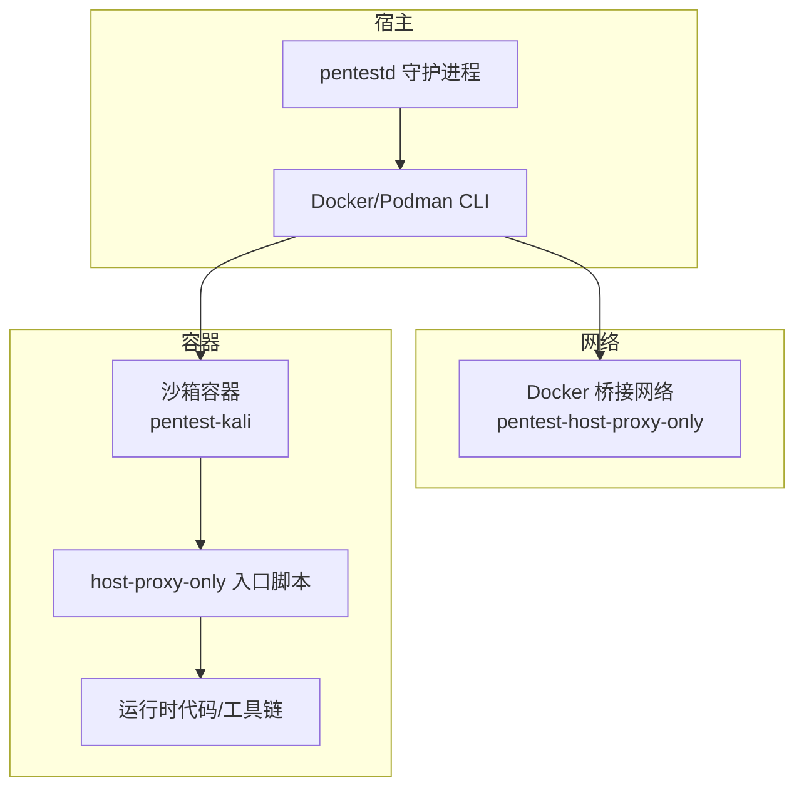
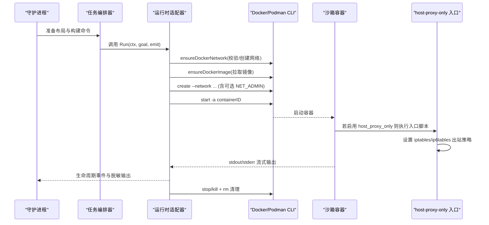
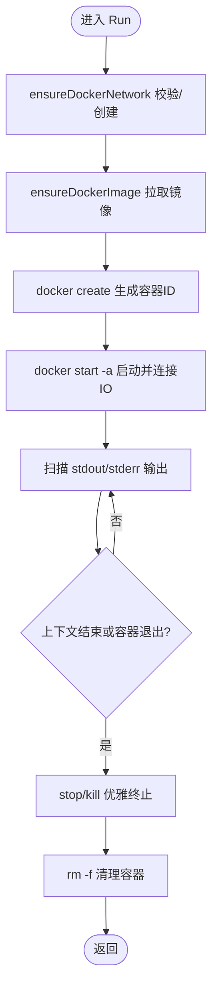
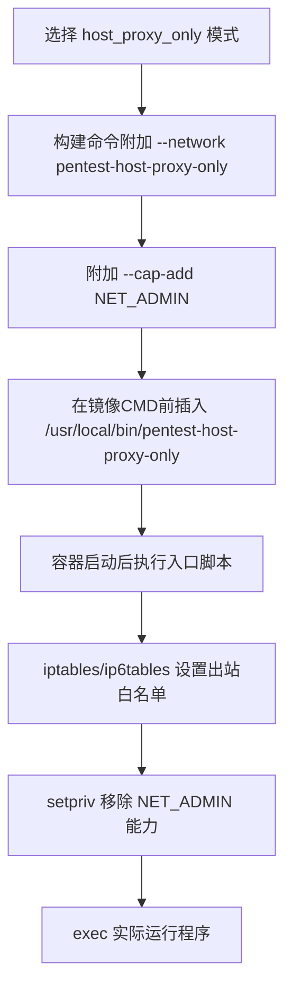
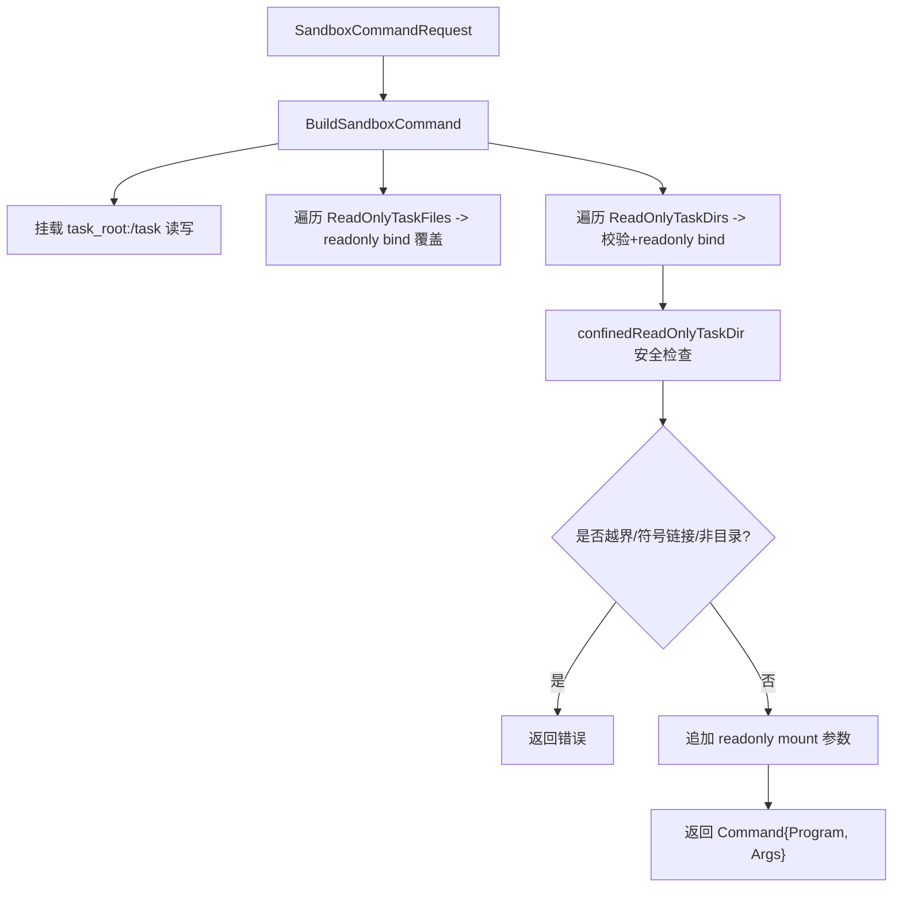
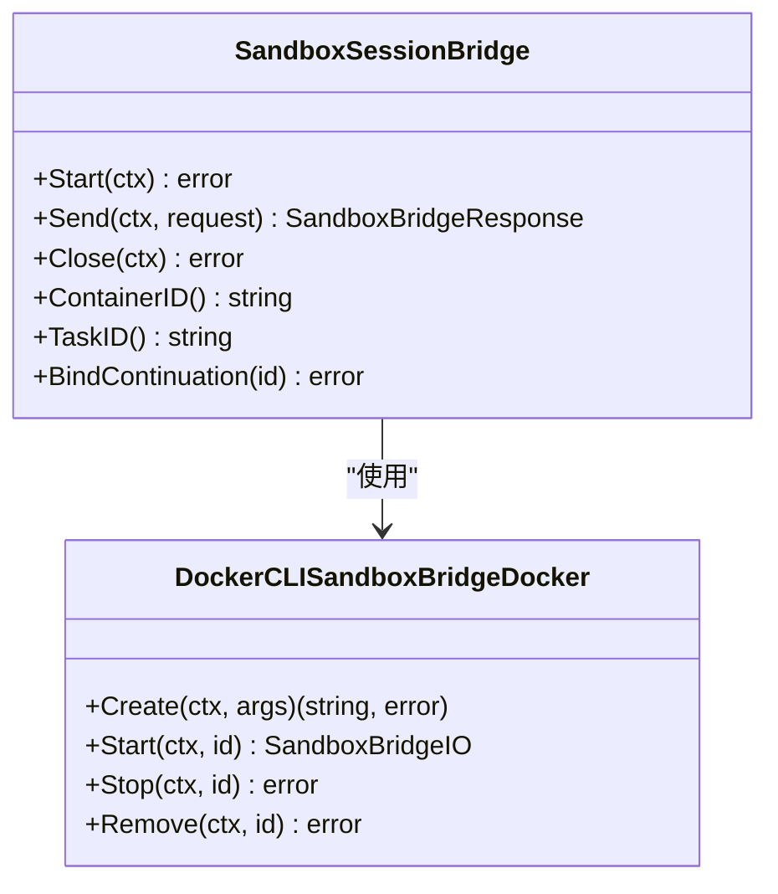
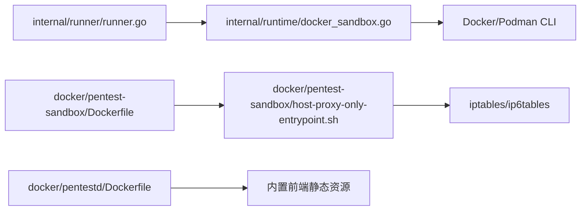

# 沙箱容器管理

<cite>
**本文引用的文件列表**
- [docker/pentest-sandbox/Dockerfile](file://docker/pentest-sandbox/Dockerfile)
- [docker/pentest-sandbox/host-proxy-only-entrypoint.sh](file://docker/pentest-sandbox/host-proxy-only-entrypoint.sh)
- [internal/runner/runner.go](file://internal/runner/runner.go)
- [internal/runner/projection.go](file://internal/runner/projection.go)
- [internal/runtime/docker_sandbox.go](file://internal/runtime/docker_sandbox.go)
- [internal/runtime/container.go](file://internal/runtime/container.go)
- [internal/runtime/session_bridge.go](file://internal/runtime/session_bridge.go)
- [internal/daemon/task_test.go](file://internal/daemon/task_test.go)
- [internal/runtime/runtime_test.go](file://internal/runtime/runtime_test.go)
- [internal/runner/blackboard_v2_mount_test.go](file://internal/runner/blackboard_v2_mount_test.go)
- [internal/runner/runner_test.go](file://internal/runner/runner_test.go)
- [docker/pentestd/Dockerfile](file://docker/pentestd/Dockerfile)
</cite>

## 目录
1. [简介](#简介)
2. [项目结构](#项目结构)
3. [核心组件](#核心组件)
4. [架构总览](#架构总览)
5. [详细组件分析](#详细组件分析)
6. [依赖关系分析](#依赖关系分析)
7. [性能与资源特性](#性能与资源特性)
8. [故障排查指南](#故障排查指南)
9. [结论](#结论)
10. [附录：自定义镜像与安全最佳实践](#附录自定义镜像与安全最佳实践)

## 简介
本文件聚焦于沙箱容器的管理与安全边界控制，围绕 Docker/Podman 的隔离机制、网络策略（host_proxy_only）、卷挂载与只读限制、环境变量注入、生命周期管理以及镜像构建进行系统化说明。文档同时给出自定义沙箱镜像的开发指南与网络安全配置最佳实践，并解释容器间通信与主机访问控制机制。

## 项目结构
与沙箱容器相关的代码主要分布在以下模块：
- 运行时适配器：负责容器创建、启动、停止、清理及日志输出
- 任务编排器：负责构造容器启动参数、网络模式选择、卷挂载与环境变量注入
- 镜像与入口点：提供预置工具链与 host-proxy-only 网络入口脚本
- 守护进程镜像：打包后端服务与前端静态资源，暴露健康检查端口

图表来源
- [internal/runner/runner.go:142-216](file://internal/runner/runner.go#L142-L216)
- [internal/runtime/docker_sandbox.go:365-428](file://internal/runtime/docker_sandbox.go#L365-L428)
- [docker/pentest-sandbox/host-proxy-only-entrypoint.sh:1-46](file://docker/pentest-sandbox/host-proxy-only-entrypoint.sh#L1-L46)

章节来源
- [internal/runner/runner.go:142-216](file://internal/runner/runner.go#L142-L216)
- [internal/runtime/docker_sandbox.go:365-428](file://internal/runtime/docker_sandbox.go#L365-L428)
- [docker/pentest-sandbox/host-proxy-only-entrypoint.sh:1-46](file://docker/pentest-sandbox/host-proxy-only-entrypoint.sh#L1-L46)

## 核心组件
- 运行时适配器（DockerSandboxAdapter）：封装容器生命周期，确保网络存在、镜像拉取、容器创建/启动/停止/清理，并对输出进行敏感信息脱敏。
- 任务编排器（Runner）：根据请求生成容器 create 命令，支持 host_proxy_only 网络模式、只读文件/目录挂载、环境变量注入与 Provider 特定环境设置。
- 会话桥接（SandboxSessionBridge）：为 Task 拥有的一次性容器提供非 TTY 的交互式协议通道，维护请求-响应关联与异常终止信号。
- 镜像与入口点：基于 Kali 的系统工具与渗透工具集；host-proxy-only 入口脚本在容器内通过 iptables/ip6tables 限制出站流量仅允许宿主机网关。

章节来源
- [internal/runtime/docker_sandbox.go:111-231](file://internal/runtime/docker_sandbox.go#L111-L231)
- [internal/runner/runner.go:142-216](file://internal/runner/runner.go#L142-L216)
- [internal/runtime/session_bridge.go:300-352](file://internal/runtime/session_bridge.go#L300-L352)
- [docker/pentest-sandbox/Dockerfile:124-144](file://docker/pentest-sandbox/Dockerfile#L124-L144)
- [docker/pentest-sandbox/host-proxy-only-entrypoint.sh:1-46](file://docker/pentest-sandbox/host-proxy-only-entrypoint.sh#L1-L46)

## 架构总览
下图展示了从任务启动到容器执行的关键流程，包括网络校验、镜像拉取、容器创建与启动、输出扫描与清理。

图表来源
- [internal/runner/runner.go:142-216](file://internal/runner/runner.go#L142-L216)
- [internal/runtime/docker_sandbox.go:111-231](file://internal/runtime/docker_sandbox.go#L111-L231)
- [internal/runtime/docker_sandbox.go:365-428](file://internal/runtime/docker_sandbox.go#L365-L428)
- [docker/pentest-sandbox/host-proxy-only-entrypoint.sh:1-46](file://docker/pentest-sandbox/host-proxy-only-entrypoint.sh#L1-L46)

## 详细组件分析

### 容器生命周期管理（创建、启动、停止、清理）
- 网络前置校验：确保目标网络存在且满足驱动与 internal 属性要求，否则拒绝启动。
- 镜像拉取：若本地不存在或 inspect 报告缺失，则拉取镜像并透传进度事件。
- 容器创建与启动：使用 docker create 生成容器 ID，再 start -a 将标准输入输出接入。
- 清理策略：上下文取消或任务结束时，先尝试优雅停止，失败则 kill，最后强制删除容器。

图表来源
- [internal/runtime/docker_sandbox.go:111-231](file://internal/runtime/docker_sandbox.go#L111-L231)
- [internal/runtime/docker_sandbox.go:365-428](file://internal/runtime/docker_sandbox.go#L365-L428)
- [internal/runtime/docker_sandbox.go:430-504](file://internal/runtime/docker_sandbox.go#L430-L504)

章节来源
- [internal/runtime/docker_sandbox.go:111-231](file://internal/runtime/docker_sandbox.go#L111-L231)
- [internal/runtime/docker_sandbox.go:365-428](file://internal/runtime/docker_sandbox.go#L365-L428)
- [internal/runtime/docker_sandbox.go:430-504](file://internal/runtime/docker_sandbox.go#L430-L504)

### 网络配置与安全边界（host_proxy_only）
- 网络模式常量：定义 SandboxNetworkHostProxyOnly 与固定网络名 pentest-host-proxy-only。
- 构建命令时附加：当选择 host_proxy_only 模式，会添加 --network 指定网络、--cap-add NET_ADMIN，并在镜像 CMD 前插入 host-proxy-only 入口脚本。
- 入口脚本策略：解析 host.docker.internal 的 IPv4 地址，清空 OUTPUT 链，放行回环与已建立连接，仅允许访问宿主机网关 IP，默认 DROP；同时处理 ip6tables 以防 IPv6 绕过。随后使用 setpriv 移除 NET_ADMIN 能力，防止运行时修改规则。

图表来源
- [internal/runner/runner.go:196-216](file://internal/runner/runner.go#L196-L216)
- [docker/pentest-sandbox/host-proxy-only-entrypoint.sh:16-45](file://docker/pentest-sandbox/host-proxy-only-entrypoint.sh#L16-L45)

章节来源
- [internal/runner/runner.go:60-76](file://internal/runner/runner.go#L60-L76)
- [internal/runner/runner.go:196-216](file://internal/runner/runner.go#L196-L216)
- [docker/pentest-sandbox/host-proxy-only-entrypoint.sh:1-46](file://docker/pentest-sandbox/host-proxy-only-entrypoint.sh#L1-L46)

### 卷挂载与只读文件系统、目录限制
- 基础挂载：将 task_root 以读写方式挂载到 /task，工作目录设为 /task/workdir。
- 只读文件覆盖：ReadOnlyTaskFiles 指定的相对路径会被以 readonly 绑定覆盖到 /task 下对应位置，用于强制不可变输入。
- 只读目录限制：ReadOnlyTaskDirs 支持按路径原子替换可见但不可写，内部实现严格校验：
  - 禁止越界路径（..、绝对路径、反斜杠）
  - 逐层 Lstat 检查，禁止符号链接
  - 最终必须是目录
- Blackboard v2 保护：测试用例验证 .pentest 父目录被只读挂载，但不直接挂载可替换文件的 inode，避免原子替换带来的竞争。

图表来源
- [internal/runner/runner.go:178-195](file://internal/runner/runner.go#L178-L195)
- [internal/runner/runner.go:219-243](file://internal/runner/runner.go#L219-L243)
- [internal/runner/blackboard_v2_mount_test.go:16-66](file://internal/runner/blackboard_v2_mount_test.go#L16-L66)

章节来源
- [internal/runner/runner.go:178-195](file://internal/runner/runner.go#L178-L195)
- [internal/runner/runner.go:219-243](file://internal/runner/runner.go#L219-L243)
- [internal/runner/blackboard_v2_mount_test.go:16-66](file://internal/runner/blackboard_v2_mount_test.go#L16-L66)

### 环境变量注入与 Provider 配置投影
- 进程环境变量：ProcessEnv 中的键值对以 -e 形式注入容器。
- Provider 特定环境：根据 Provider 类型注入 RUNTIME_HOME、HOME、PI_CODING_AGENT_DIR 等必要环境变量，并将 provider_home 映射到 /task/runtime-home/<provider>。
- 配置投影：ProjectRuntimeConfig 将模型提供者、MCP 服务器、插件包等写入任务本地的 provider home，保证容器内读取的是受控副本，不污染宿主配置。

章节来源
- [internal/runner/runner.go:202-216](file://internal/runner/runner.go#L202-L216)
- [internal/runner/runner.go:250-306](file://internal/runner/runner.go#L250-L306)
- [internal/runner/projection.go:57-131](file://internal/runner/projection.go#L57-L131)

### 会话桥接与交互协议（非 TTY）
- 设计要点：为 Task 拥有的一次性容器提供 stdin/stdout 的非 TTY 通道，禁止 -t/--tty，必须 -i/--interactive。
- 生命周期：Start 创建并 attach 容器，readLoop 解析 JSON-RPC 帧，finish 完成请求匹配，Close 统一 stop+remove。
- 安全性：CreateArgs 校验不允许 TTY；诊断流独立于协议流；异常关闭不会误报为意外终止。

图表来源
- [internal/runtime/session_bridge.go:300-352](file://internal/runtime/session_bridge.go#L300-L352)
- [internal/runtime/session_bridge.go:556-573](file://internal/runtime/session_bridge.go#L556-L573)

章节来源
- [internal/runtime/session_bridge.go:300-352](file://internal/runtime/session_bridge.go#L300-L352)
- [internal/runtime/session_bridge.go:556-573](file://internal/runtime/session_bridge.go#L556-L573)

### 镜像构建与工具链
- 基础镜像：kalilinux/kali-rolling，安装大量渗透与开发工具（nmap、sqlmap、nuclei、subfinder、ffuf、httpx、jwt_tool、agent-browser 等）。
- Provider 桥接：编译 Go 二进制 pentest-provider-bridge；Node.js 桥接 @anthropic-ai/claude-agent-sdk 版本锁定。
- 浏览器与技能包：安装 Chromium 与 agent-browser，复制 skills 到 /opt/pentest/skills。
- host-proxy-only 入口：拷贝并赋予执行权限，作为受限出站网络的入口点。
- 环境变量：PENTEST_SANDBOX=1、PENTEST_SKILLS_DIR=/opt/pentest/skills、AGENT_BROWSER_EXECUTABLE_PATH=/usr/bin/chromium 等。

章节来源
- [docker/pentest-sandbox/Dockerfile:1-144](file://docker/pentest-sandbox/Dockerfile#L1-L144)

## 依赖关系分析
- 编排器依赖运行时适配器：通过 NewDockerSandboxAdapter 传入 CreateArgs、RequiredNetwork、SecretValues 等。
- 运行时适配器依赖 Docker/Podman CLI：通过 exec.CommandContext 调用 network/image/container 子命令。
- 守护进程镜像包含前端静态资源与后端二进制，对外暴露健康检查端点。

图表来源
- [internal/runner/runner.go:142-216](file://internal/runner/runner.go#L142-L216)
- [internal/runtime/docker_sandbox.go:365-428](file://internal/runtime/docker_sandbox.go#L365-L428)
- [docker/pentest-sandbox/Dockerfile:124-144](file://docker/pentest-sandbox/Dockerfile#L124-L144)
- [docker/pentestd/Dockerfile:1-37](file://docker/pentestd/Dockerfile#L1-L37)

章节来源
- [internal/runner/runner.go:142-216](file://internal/runner/runner.go#L142-L216)
- [internal/runtime/docker_sandbox.go:365-428](file://internal/runtime/docker_sandbox.go#L365-L428)
- [docker/pentestd/Dockerfile:1-37](file://docker/pentestd/Dockerfile#L1-L37)

## 性能与资源特性
- 镜像拉取进度：通过管道分片扫描 stdout/stderr，避免阻塞主流程，并以事件形式上报。
- 输出行长度限制：最大行字节数限制，防止超大行导致内存膨胀。
- 优雅停止与超时：stop 失败自动升级 kill，减少僵尸容器占用。
- 资源清理：无论成功或失败，均确保 remove -f 清理容器，避免残留。

章节来源
- [internal/runtime/docker_sandbox.go:233-354](file://internal/runtime/docker_sandbox.go#L233-L354)
- [internal/runtime/docker_sandbox.go:430-504](file://internal/runtime/docker_sandbox.go#L430-L504)

## 故障排查指南
- 网络未创建或不安全：检查 required network 是否存在且 driver/internal 是否符合预期；日志中会记录“unsafe configuration”错误。
- 镜像拉取失败：查看 image_pull_progress 事件文本，确认镜像名称与网络可达性。
- 容器无法启动：确认 CreateArgs 包含 create 开头；检查 --network 与 --cap-add NET_ADMIN 是否正确附加。
- host-proxy-only 入口失败：确认 getent/iptables/setpriv 可用；检查 host.docker.internal 是否能解析到 IPv4 地址。
- 只读目录挂载失败：检查路径是否越界、是否包含符号链接、是否为目录。

章节来源
- [internal/runtime/runtime_test.go:718-780](file://internal/runtime/runtime_test.go#L718-L780)
- [internal/daemon/task_test.go:813-843](file://internal/daemon/task_test.go#L813-L843)
- [internal/runner/blackboard_v2_mount_test.go:42-66](file://internal/runner/blackboard_v2_mount_test.go#L42-L66)
- [docker/pentest-sandbox/host-proxy-only-entrypoint.sh:1-20](file://docker/pentest-sandbox/host-proxy-only-entrypoint.sh#L1-L20)

## 结论
本项目通过编排器与运行时适配器的协作，实现了严格的沙箱隔离与可控的网络出口策略。host_proxy_only 模式结合容器内 iptables/ip6tables 规则与 setpriv 能力裁剪，有效限制了出站流量至宿主机网关，配合只读文件/目录挂载与最小化环境变量注入，构建了安全的执行边界。镜像构建过程集成常用渗透工具与 Provider 桥接，便于快速部署与扩展。

## 附录：自定义镜像与安全最佳实践

### 自定义沙箱镜像开发指南
- 基础镜像选择：建议使用轻量发行版（如 alpine 或 debian slim），按需安装工具，减少攻击面。
- 入口脚本：如需出站限制，参考 host-proxy-only 入口脚本，确保：
  - 校验必需命令（getent、iptables、setpriv）
  - 解析 host.docker.internal 的 IPv4 地址
  - 清空 OUTPUT 链，放行回环与已建立连接，仅允许宿主机网关
  - 处理 ip6tables 以防 IPv6 绕过
  - 使用 setpriv 移除 NET_ADMIN 后再 exec 实际程序
- 环境变量：仅在必要时注入，避免泄露敏感信息；将技能包与配置文件放入只读路径。
- 缓存优化：将频繁变更的桥接源码放在 Dockerfile 末尾，避免破坏大层缓存。

章节来源
- [docker/pentest-sandbox/host-proxy-only-entrypoint.sh:1-46](file://docker/pentest-sandbox/host-proxy-only-entrypoint.sh#L1-L46)
- [docker/pentest-sandbox/Dockerfile:124-144](file://docker/pentest-sandbox/Dockerfile#L124-L144)

### 网络安全配置最佳实践
- 优先使用 host_proxy_only 模式，确保仅允许访问宿主机网关与代理。
- 不要将 --network host 或共享宿主网络命名空间。
- 谨慎授予 NET_ADMIN 能力，仅在入口阶段使用并通过 setpriv 移除。
- 使用只读挂载与路径校验，防止逃逸与符号链接绕过。
- 定期更新镜像与工具链，修复已知漏洞。

章节来源
- [internal/runner/runner.go:196-216](file://internal/runner/runner.go#L196-L216)
- [internal/runner/runner.go:219-243](file://internal/runner/runner.go#L219-L243)
- [docker/pentest-sandbox/host-proxy-only-entrypoint.sh:24-45](file://docker/pentest-sandbox/host-proxy-only-entrypoint.sh#L24-L45)