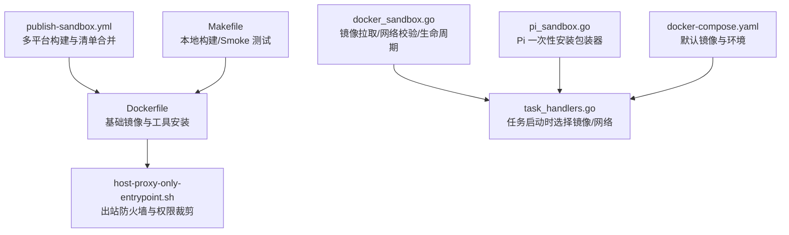
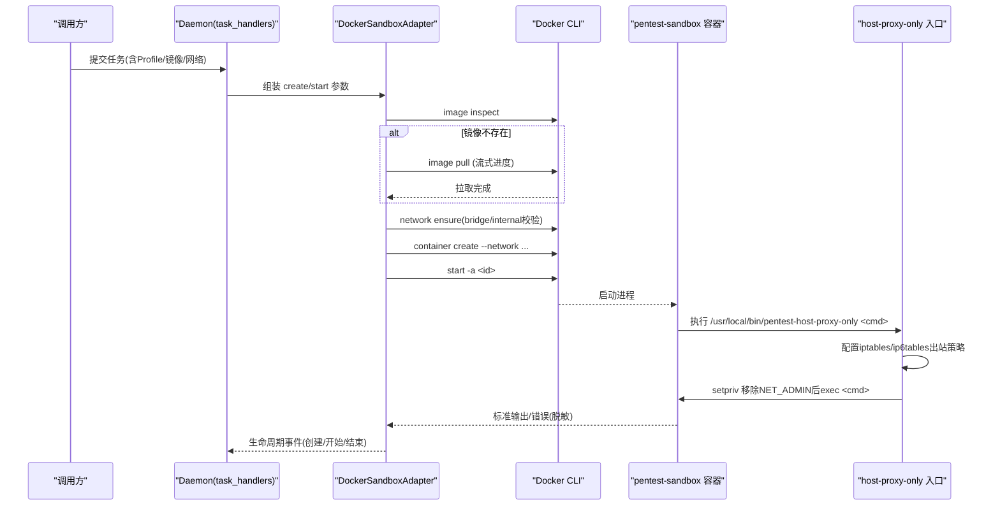
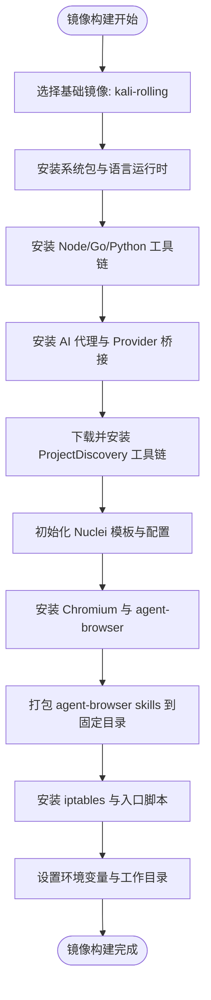
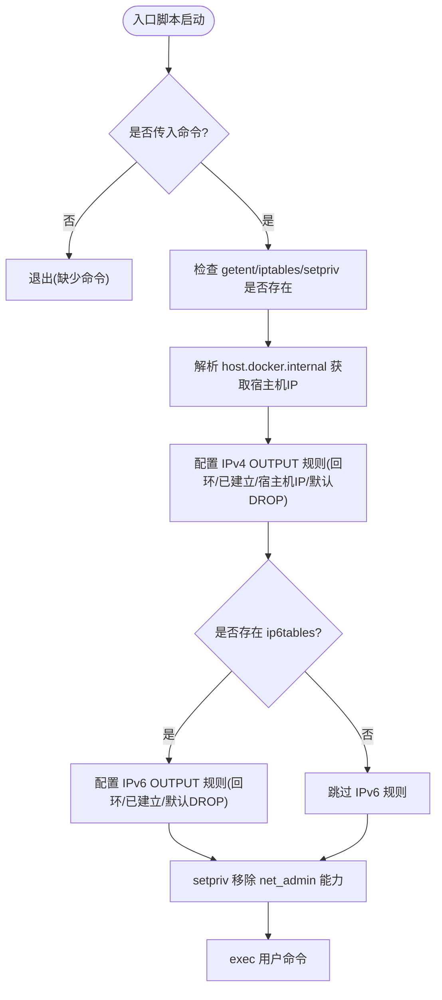
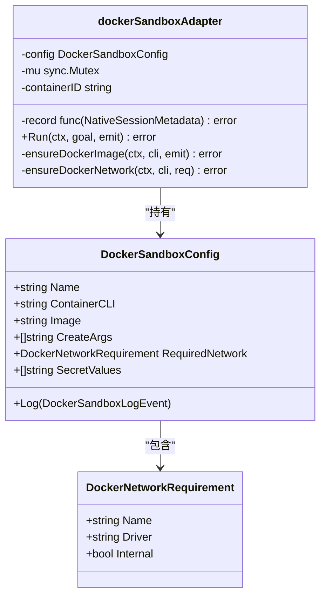
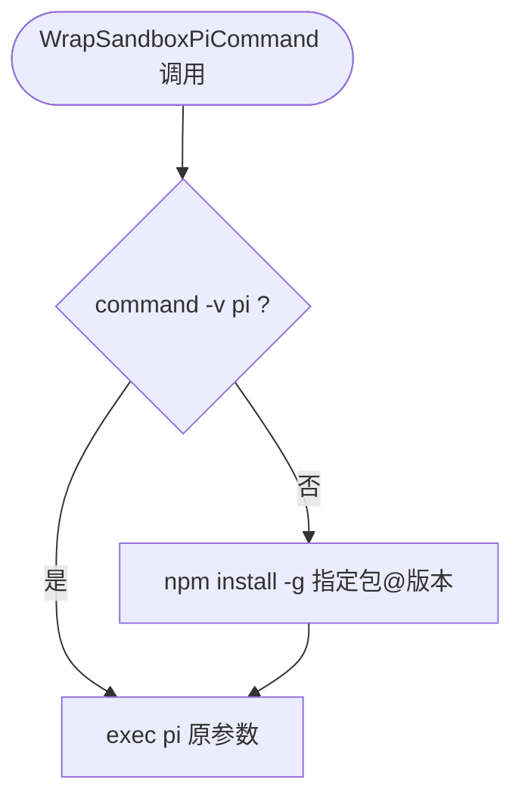
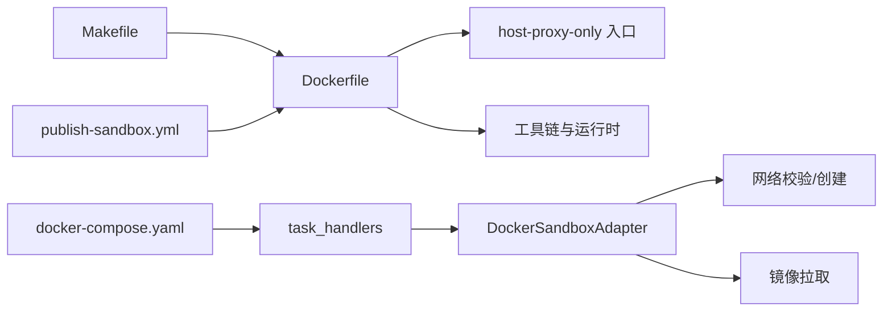

# 沙箱镜像构建与定制

<cite>
**本文引用的文件**   
- [docker/pentest-sandbox/Dockerfile](file://docker/pentest-sandbox/Dockerfile)
- [docker/pentest-sandbox/host-proxy-only-entrypoint.sh](file://docker/pentest-sandbox/host-proxy-only-entrypoint.sh)
- [internal/runtime/docker_sandbox.go](file://internal/runtime/docker_sandbox.go)
- [internal/runner/pi_sandbox.go](file://internal/runner/pi_sandbox.go)
- [internal/daemon/task_handlers.go](file://internal/daemon/task_handlers.go)
- [Makefile](file://Makefile)
- [.github/workflows/publish-sandbox.yml](file://.github/workflows/publish-sandbox.yml)
- [scripts/ci_sandbox_build_test.go](file://scripts/ci_sandbox_build_test.go)
- [scripts/sandbox_image_defaults_test.go](file://scripts/sandbox_image_defaults_test.go)
- [docker-compose.yaml](file://docker-compose.yaml)
</cite>

## 目录
1. [简介](#简介)
2. [项目结构](#项目结构)
3. [核心组件](#核心组件)
4. [架构总览](#架构总览)
5. [详细组件分析](#详细组件分析)
6. [依赖关系分析](#依赖关系分析)
7. [性能与优化](#性能与优化)
8. [故障排查指南](#故障排查指南)
9. [结论](#结论)
10. [附录](#附录)

## 简介
本文件聚焦于 CyberPenda 的“沙箱镜像”构建与定制，围绕 pentest-sandbox 镜像的 Dockerfile、host-proxy-only 入口脚本、运行时网络与安全边界、以及扩展新工具链/运行时的方法展开。文档同时给出镜像优化技巧、层缓存策略、安全扫描集成建议，并提供自定义镜像开发模板与部署最佳实践，帮助读者在保持安全隔离的前提下高效迭代沙箱环境。

## 项目结构
与沙箱镜像直接相关的工程位置如下：
- 镜像定义与入口脚本位于 docker/pentest-sandbox
- 运行时容器编排与网络校验逻辑位于 internal/runtime
- Pi 一次性安装包装器位于 internal/runner
- Daemon 启动流程中注入镜像与网络参数位于 internal/daemon
- 本地构建与发布流水线分别由 Makefile 与 GitHub Actions 管理
- 默认镜像名与环境变量在各处保持一致性通过测试保障

图示来源
- [docker/pentest-sandbox/Dockerfile:1-145](file://docker/pentest-sandbox/Dockerfile#L1-L145)
- [docker/pentest-sandbox/host-proxy-only-entrypoint.sh:1-46](file://docker/pentest-sandbox/host-proxy-only-entrypoint.sh#L1-L46)
- [internal/runtime/docker_sandbox.go:1-505](file://internal/runtime/docker_sandbox.go#L1-L505)
- [internal/daemon/task_handlers.go:799-833](file://internal/daemon/task_handlers.go#L799-L833)
- [internal/runner/pi_sandbox.go:1-55](file://internal/runner/pi_sandbox.go#L1-L55)
- [.github/workflows/publish-sandbox.yml:1-148](file://.github/workflows/publish-sandbox.yml#L1-L148)
- [Makefile:1-98](file://Makefile#L1-L98)
- [docker-compose.yaml:1-35](file://docker-compose.yaml#L1-L35)

章节来源
- [docker/pentest-sandbox/Dockerfile:1-145](file://docker/pentest-sandbox/Dockerfile#L1-L145)
- [docker/pentest-sandbox/host-proxy-only-entrypoint.sh:1-46](file://docker/pentest-sandbox/host-proxy-only-entrypoint.sh#L1-L46)
- [internal/runtime/docker_sandbox.go:1-505](file://internal/runtime/docker_sandbox.go#L1-L505)
- [internal/runner/pi_sandbox.go:1-55](file://internal/runner/pi_sandbox.go#L1-L55)
- [internal/daemon/task_handlers.go:799-833](file://internal/daemon/task_handlers.go#L799-L833)
- [Makefile:1-98](file://Makefile#L1-L98)
- [.github/workflows/publish-sandbox.yml:1-148](file://.github/workflows/publish-sandbox.yml#L1-L148)
- [docker-compose.yaml:1-35](file://docker-compose.yaml#L1-L35)

## 核心组件
- 沙箱镜像（pentest-sandbox）
  - 基于 Kali Linux，预装大量渗透测试工具、Node/Python 生态、浏览器与 Agent 工具链，并内置 host-proxy-only 入口以限制出站流量。
- host-proxy-only 入口脚本
  - 在容器启动前设置 iptables/ip6tables 出站策略，仅允许回环、已建立连接与宿主机网关；随后使用 setpriv 移除 NET_ADMIN 能力再 exec 用户命令。
- 运行时适配器（DockerSandboxAdapter）
  - 负责镜像存在性检查、按需拉取、创建/启动/停止/清理容器，并对输出进行脱敏与事件上报。
- Pi 一次性安装包装器
  - 当镜像未预装 pi 时，自动 npm 安装后执行，避免每次启动都重复安装。
- 任务启动装配（Daemon）
  - 根据 Profile 选择镜像与网络模式，必要时对 Pi 命令进行包装。

章节来源
- [docker/pentest-sandbox/Dockerfile:1-145](file://docker/pentest-sandbox/Dockerfile#L1-L145)
- [docker/pentest-sandbox/host-proxy-only-entrypoint.sh:1-46](file://docker/pentest-sandbox/host-proxy-only-entrypoint.sh#L1-L46)
- [internal/runtime/docker_sandbox.go:1-505](file://internal/runtime/docker_sandbox.go#L1-L505)
- [internal/runner/pi_sandbox.go:1-55](file://internal/runner/pi_sandbox.go#L1-L55)
- [internal/daemon/task_handlers.go:799-833](file://internal/daemon/task_handlers.go#L799-L833)

## 架构总览
下图展示了从任务发起、镜像拉取、容器创建到受限网络执行的端到端流程。

图示来源
- [internal/daemon/task_handlers.go:799-833](file://internal/daemon/task_handlers.go#L799-L833)
- [internal/runtime/docker_sandbox.go:111-231](file://internal/runtime/docker_sandbox.go#L111-L231)
- [internal/runtime/docker_sandbox.go:365-428](file://internal/runtime/docker_sandbox.go#L365-L428)
- [docker/pentest-sandbox/host-proxy-only-entrypoint.sh:1-46](file://docker/pentest-sandbox/host-proxy-only-entrypoint.sh#L1-L46)

## 详细组件分析

### 组件一：pentest-sandbox 镜像构建过程
- 基础镜像选择
  - 采用 Kali Rolling 作为基线，确保覆盖广泛的安全工具生态。
- 系统包与语言运行时
  - 安装 headless Kali 元包、Node.js/npm、Go、Python3/pip、常用二进制工具（nmap/sqlmap/nuclei/subfinder/naabu/ffuf/dirsearch/gitleaks/nikto/netexec 等）。
- Node 生态与 AI 代理
  - 全局安装 Claude Code、Codex、Pi 编码代理；为 Claude 提供非 PTY 的 Provider 桥接与 SDK 桥接，便于与宿主交互且可中断。
- ProjectDiscovery 工具链
  - 构建期解析最新 release 标签，下载 katana/nuclei/dalfox/cloudfox 等二进制并安装至 PATH；httpx 通过 go install 安装。
- Nuclei 模板与配置
  - 克隆 nuclei-templates 并初始化本地更新目录，禁用远程更新检查以提升稳定性。
- JWT 工具与浏览器自动化
  - 安装 jwt_tool 及其 Python 依赖；安装 Chromium 及 agent-browser，并通过配置文件指定可执行路径。
- Skills 打包
  - 将 agent-browser 的 skill-data 复制到镜像内固定目录，供沙箱 Agent 发现与加载。
- 网络与入口
  - 安装 iptables/util-linux；复制 host-proxy-only 入口脚本并赋予执行权限。
- 环境变量与工作目录
  - 设置 CLAUDE_CODE_DISABLE_NONESSENTIAL_TRAFFIC、PENTEST_SANDBOX、PENTEST_SKILLS_DIR、AGENT_BROWSER_EXECUTABLE_PATH 等；工作目录设为 /workspace，默认 CMD 为 bash。

图示来源
- [docker/pentest-sandbox/Dockerfile:1-145](file://docker/pentest-sandbox/Dockerfile#L1-L145)

章节来源
- [docker/pentest-sandbox/Dockerfile:1-145](file://docker/pentest-sandbox/Dockerfile#L1-L145)
- [scripts/ci_sandbox_build_test.go:76-116](file://scripts/ci_sandbox_build_test.go#L76-L116)

### 组件二：host-proxy-only 入口脚本原理与网络代理配置
- 前置检查
  - 要求传入运行时命令；校验 getent/iptables/setpriv 可用。
- 宿主机网关发现
  - 通过 getent ahostsv4 host.docker.internal 解析 IPv4 地址，用于放行出站规则。
- 出站策略（IPv4）
  - 清空 OUTPUT 链；放行回环接口；放行 ESTABLISHED/RELATED 状态；放行宿主机网关 IP；默认 DROP。
- 出站策略（IPv6）
  - 若存在 ip6tables，则同样放行回环与已建立连接，默认 DROP，防止 IPv6 绕过。
- 权限裁剪
  - 使用 setpriv 移除 bounding/inh/ambient 中的 net_admin 能力后再 exec 用户命令，避免运行时修改防火墙规则。

图示来源
- [docker/pentest-sandbox/host-proxy-only-entrypoint.sh:1-46](file://docker/pentest-sandbox/host-proxy-only-entrypoint.sh#L1-L46)

章节来源
- [docker/pentest-sandbox/host-proxy-only-entrypoint.sh:1-46](file://docker/pentest-sandbox/host-proxy-only-entrypoint.sh#L1-L46)

### 组件三：运行时适配器与网络约束
- 镜像拉取与进度上报
  - 先 inspect 本地镜像，缺失则 pull，并将拉取进度与日志事件透传给上层。
- 网络需求校验
  - 若声明 RequiredNetwork，则在启动前确保网络存在且属性匹配（driver=bridge, internal=false 等），不满足则拒绝启动。
- 容器生命周期
  - create -> start -a -> 读取 stdout/stderr -> 等待结束 -> stop/kill -> rm，异常路径均记录事件。
- 敏感信息脱敏
  - 对输出按精确值进行脱敏，避免泄露密钥。

图示来源
- [internal/runtime/docker_sandbox.go:20-57](file://internal/runtime/docker_sandbox.go#L20-L57)
- [internal/runtime/docker_sandbox.go:111-231](file://internal/runtime/docker_sandbox.go#L111-L231)
- [internal/runtime/docker_sandbox.go:365-428](file://internal/runtime/docker_sandbox.go#L365-L428)

章节来源
- [internal/runtime/docker_sandbox.go:1-505](file://internal/runtime/docker_sandbox.go#L1-L505)

### 组件四：Pi 一次性安装包装器
- 作用
  - 当镜像未预装 pi 时，首次运行自动 npm 安装，后续复用，避免重复安装开销。
- 行为
  - 检测 pi 是否可用；不可用则安装指定包（支持版本覆盖）；然后 exec 原命令。
- 适用场景
  - 非持久化 provider session 的一次性任务；持久化会话路径会改写镜像命令，无需包装。

图示来源
- [internal/runner/pi_sandbox.go:14-47](file://internal/runner/pi_sandbox.go#L14-L47)

章节来源
- [internal/runner/pi_sandbox.go:1-55](file://internal/runner/pi_sandbox.go#L1-L55)
- [internal/daemon/task_handlers.go:810-825](file://internal/daemon/task_handlers.go#L810-L825)

### 组件五：任务启动装配（Daemon）
- 镜像选择
  - 优先使用 Profile 指定的镜像，否则回退到 Daemon 默认镜像。
- 网络模式
  - 根据 RunControls 计算 sandboxNetworkMode，并与 RequiredNetwork 校验。
- Pi 包装
  - 若非持久化 provider session，则对 Pi 命令进行一次性安装包装。
- 只读挂载
  - 针对 v2 或旧版 blackboard/scope 文件/目录施加只读保护。

章节来源
- [internal/daemon/task_handlers.go:799-833](file://internal/daemon/task_handlers.go#L799-L833)

## 依赖关系分析
- 镜像与运行时耦合点
  - 镜像需提供 host-proxy-only 入口与必要系统工具；运行时负责网络与生命周期管理。
- 构建与发布
  - 本地通过 Makefile 构建镜像；CI 通过 workflow 分平台构建并合并清单。
- 默认镜像一致性
  - 多处默认镜像名通过测试保证一致，避免漂移。

图示来源
- [docker/pentest-sandbox/Dockerfile:1-145](file://docker/pentest-sandbox/Dockerfile#L1-L145)
- [internal/runtime/docker_sandbox.go:111-231](file://internal/runtime/docker_sandbox.go#L111-L231)
- [internal/daemon/task_handlers.go:799-833](file://internal/daemon/task_handlers.go#L799-L833)
- [Makefile:43-55](file://Makefile#L43-L55)
- [.github/workflows/publish-sandbox.yml:20-148](file://.github/workflows/publish-sandbox.yml#L20-L148)
- [docker-compose.yaml:14-24](file://docker-compose.yaml#L14-L24)

章节来源
- [scripts/sandbox_image_defaults_test.go:1-89](file://scripts/sandbox_image_defaults_test.go#L1-L89)
- [scripts/ci_sandbox_build_test.go:118-178](file://scripts/ci_sandbox_build_test.go#L118-L178)

## 性能与优化
- 层缓存策略
  - 将频繁变更的桥接源码拷贝放在 Dockerfile 末尾，避免破坏底层工具安装层缓存。
  - 将稳定依赖（如 Claude Agent SDK）提前安装，减少重建成本。
- 构建体积与速度
  - 使用 apt-get --no-install-recommends 与清理 apt lists 减小镜像体积。
  - 使用 git clone --depth 1 与解压后删除临时文件。
- 多平台构建
  - CI 使用原生 runner 分平台构建，避免 QEMU 带来的额外开销与兼容性问题。
- 网络与资源
  - 通过 host-proxy-only 限制出站，降低不必要的网络访问与超时。
- 安全扫描集成建议
  - 在 CI 中引入 Trivy/Grype 等扫描器，对构建产物进行漏洞扫描与合规检查。
  - 结合镜像元数据（metadata-action）生成 SBOM 并归档。

章节来源
- [docker/pentest-sandbox/Dockerfile:34-37](file://docker/pentest-sandbox/Dockerfile#L34-L37)
- [docker/pentest-sandbox/Dockerfile:133-137](file://docker/pentest-sandbox/Dockerfile#L133-L137)
- [.github/workflows/publish-sandbox.yml:43-51](file://.github/workflows/publish-sandbox.yml#L43-L51)
- [.github/workflows/publish-sandbox.yml:57-74](file://.github/workflows/publish-sandbox.yml#L57-L74)

## 故障排查指南
- 无法解析 host.docker.internal
  - 入口脚本会在无法解析宿主机地址时退出；检查 Docker Desktop 的网络配置与 DNS 可达性。
- 缺少必需命令
  - 入口脚本要求 getent/iptables/setpriv；确认镜像已安装 util-linux 与 iptables。
- 网络配置不安全
  - 运行时会对 RequiredNetwork 的属性进行校验，若不匹配（driver/internal）将拒绝启动；检查网络创建参数。
- 镜像拉取失败
  - 查看拉取阶段的事件与日志；确认仓库鉴权与网络连通性。
- Pi 安装失败
  - 检查 npm 源与网络；确认镜像中具备 npm 与网络访问能力。

章节来源
- [docker/pentest-sandbox/host-proxy-only-entrypoint.sh:1-46](file://docker/pentest-sandbox/host-proxy-only-entrypoint.sh#L1-L46)
- [internal/runtime/docker_sandbox.go:365-428](file://internal/runtime/docker_sandbox.go#L365-L428)
- [internal/runtime/docker_sandbox.go:233-283](file://internal/runtime/docker_sandbox.go#L233-L283)
- [internal/runner/pi_sandbox.go:14-47](file://internal/runner/pi_sandbox.go#L14-L47)

## 结论
pentest-sandbox 镜像以 Kali 为基础，聚合了丰富的渗透测试与浏览器自动化能力，并通过 host-proxy-only 入口实现严格的出站控制。运行时适配器负责镜像拉取、网络校验与容器生命周期管理，配合任务启动装配形成完整的安全执行闭环。借助合理的层缓存与多平台构建策略，可在保证安全性的前提下提升构建效率与可维护性。

## 附录

### 扩展沙箱镜像：新增工具链/运行时/测试框架
- 在 Dockerfile 中添加必要的系统包或语言运行时安装步骤，遵循“最小推荐安装”和“清理缓存”的原则。
- 若为新工具提供独立二进制，建议按架构分支下载对应 release，统一安装至 /usr/local/bin。
- 如需新的浏览器或前端工具，参考现有 Chromium 与 agent-browser 的安装方式，并在环境变量中指向可执行路径。
- 若需新增技能（skills），将 SKILL.md 与相关 references/templates 复制到 /opt/pentest/skills 下对应目录。
- 若需要新的网络策略，可在 host-proxy-only 入口中增加例外规则，但需谨慎评估安全风险。

章节来源
- [docker/pentest-sandbox/Dockerfile:100-122](file://docker/pentest-sandbox/Dockerfile#L100-L122)
- [docker/pentest-sandbox/Dockerfile:126-131](file://docker/pentest-sandbox/Dockerfile#L126-L131)

### 自定义镜像开发模板（建议结构）
- 基础镜像：选择稳定的发行版或官方安全工具镜像（如 Kali）。
- 分层组织：
  - 基础系统包层
  - 语言运行时层
  - 第三方工具层（按功能分组）
  - 应用/桥接代码层（尽量靠后，利于缓存）
  - 入口脚本与配置层
- 环境变量：集中定义运行时开关与路径，便于切换与调试。
- 入口脚本：封装网络策略与权限裁剪，确保最小权限原则。

[本节为概念性指导，不直接分析具体文件]

### 部署最佳实践
- 本地开发
  - 使用 Makefile 的 build-sandbox-image 目标快速构建镜像；通过 dev/smoke 目标验证 MCP 与任务链路。
- 容器编排
  - 使用 docker-compose.yaml 暴露端口、挂载数据卷、注入认证令牌与镜像名；健康检查确保服务就绪。
- CI/CD
  - 使用 publish-sandbox.yml 分平台构建并合并清单；在构建前后清理磁盘空间，避免 Runner 资源耗尽。
- 安全加固
  - 启用 no-new-privileges；定期扫描镜像漏洞；最小化暴露端口与权限。

章节来源
- [Makefile:43-55](file://Makefile#L43-L55)
- [docker-compose.yaml:1-35](file://docker-compose.yaml#L1-L35)
- [.github/workflows/publish-sandbox.yml:43-51](file://.github/workflows/publish-sandbox.yml#L43-L51)
- [.github/workflows/publish-sandbox.yml:120-148](file://.github/workflows/publish-sandbox.yml#L120-L148)