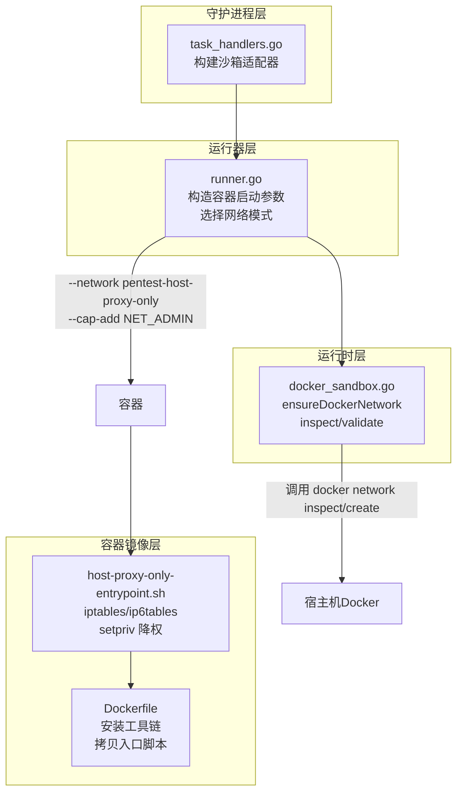
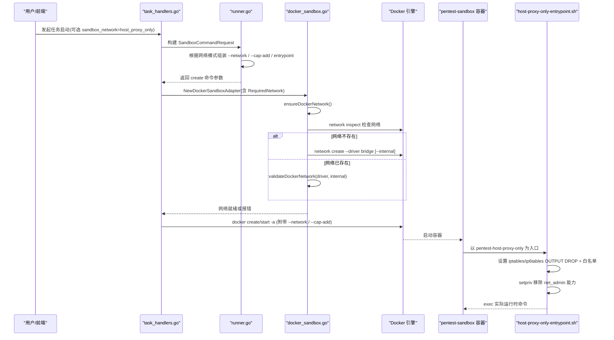
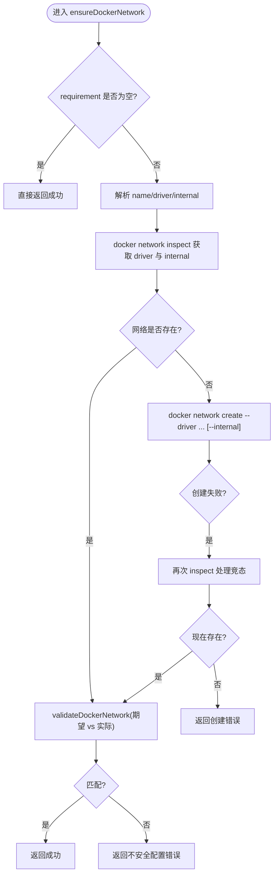
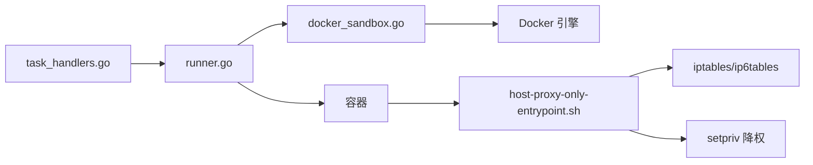

# 网络隔离与安全

<cite>
**本文引用的文件**   
- [docker_sandbox.go](file://internal/runtime/docker_sandbox.go)
- [runner.go](file://internal/runner/runner.go)
- [task_handlers.go](file://internal/daemon/task_handlers.go)
- [host-proxy-only-entrypoint.sh](file://docker/pentest-sandbox/host-proxy-only-entrypoint.sh)
- [Dockerfile](file://docker/pentest-sandbox/Dockerfile)
</cite>

## 目录
1. [简介](#简介)
2. [项目结构](#项目结构)
3. [核心组件](#核心组件)
4. [架构总览](#架构总览)
5. [详细组件分析](#详细组件分析)
6. [依赖关系分析](#依赖关系分析)
7. [性能与安全性考量](#性能与安全性考量)
8. [故障排查指南](#故障排查指南)
9. [结论](#结论)
10. [附录：最佳实践与配置清单](#附录最佳实践与配置清单)

## 简介
本文件聚焦于项目的网络隔离与安全配置，围绕以下目标展开：
- 深入解析 DockerNetworkRequirement 的网络隔离机制（内部网络创建、驱动校验、安全策略）。
- 详解 ensureDockerNetwork 的实现流程：网络存在性检查、配置验证与不安全配置的拒绝。
- 解释 host_proxy_only 网络模式的实现原理与安全边界控制（命名空间内防火墙、最小出站权限）。
- 提供网络命名空间隔离、端口映射限制与外部访问控制的配置方法。
- 给出网络安全最佳实践与常见问题排查路径。

## 项目结构
与网络隔离与安全相关的代码主要分布在运行时（Runtime）、任务编排（Runner）与守护进程（Daemon）三个层次，并配合容器镜像中的入口脚本完成最终的安全边界落地。



图示来源 
- [task_handlers.go:900-920](file://internal/daemon/task_handlers.go#L900-L920)
- [runner.go:196-216](file://internal/runner/runner.go#L196-L216)
- [docker_sandbox.go:365-428](file://internal/runtime/docker_sandbox.go#L365-L428)
- [host-proxy-only-entrypoint.sh:1-45](file://docker/pentest-sandbox/host-proxy-only-entrypoint.sh#L1-L45)
- [Dockerfile:124-131](file://docker/pentest-sandbox/Dockerfile#L124-L131)

章节来源
- [task_handlers.go:900-920](file://internal/daemon/task_handlers.go#L900-L920)
- [runner.go:196-216](file://internal/runner/runner.go#L196-L216)
- [docker_sandbox.go:365-428](file://internal/runtime/docker_sandbox.go#L365-L428)
- [host-proxy-only-entrypoint.sh:1-45](file://docker/pentest-sandbox/host-proxy-only-entrypoint.sh#L1-L45)
- [Dockerfile:124-131](file://docker/pentest-sandbox/Dockerfile#L124-L131)

## 核心组件
- DockerNetworkRequirement：描述守护进程需要确保存在的 Docker 网络及其隔离属性（名称、驱动、是否 internal）。
- ensureDockerNetwork：在容器启动前执行网络存在性检查与配置校验；若不存在则按期望创建，并对已有网络进行严格校验，防止不安全配置。
- host_proxy_only 模式：通过专用 bridge 网络 + 容器内 iptables/ip6tables 出站白名单 + setpriv 能力裁剪，实现“仅允许访问宿主网关”的最小出站策略。

章节来源
- [docker_sandbox.go:44-50](file://internal/runtime/docker_sandbox.go#L44-L50)
- [docker_sandbox.go:365-428](file://internal/runtime/docker_sandbox.go#L365-L428)
- [runner.go:60-75](file://internal/runner/runner.go#L60-L75)
- [host-proxy-only-entrypoint.sh:1-45](file://docker/pentest-sandbox/host-proxy-only-entrypoint.sh#L1-L45)

## 架构总览
下图展示了从任务启动到容器网络边界落地的完整链路，包括网络需求声明、网络创建/校验、容器启动参数注入以及容器内防火墙策略的生效过程。



图示来源 
- [task_handlers.go:900-920](file://internal/daemon/task_handlers.go#L900-L920)
- [runner.go:196-216](file://internal/runner/runner.go#L196-L216)
- [docker_sandbox.go:365-428](file://internal/runtime/docker_sandbox.go#L365-L428)
- [host-proxy-only-entrypoint.sh:1-45](file://docker/pentest-sandbox/host-proxy-only-entrypoint.sh#L1-L45)

## 详细组件分析

### DockerNetworkRequirement 与 ensureDockerNetwork
- 目的：确保指定名称的 Docker 网络存在且具备预期的隔离属性（驱动与 internal 标志），避免使用不安全的默认网络。
- 关键流程：
  - 若 requirement 为空则跳过。
  - 解析 name/driver/internal；driver 缺省为 bridge。
  - 调用 inspect 获取现有网络的 driver 与 internal 状态。
  - 若不存在，则以期望参数创建网络；若创建失败，再次 inspect 以处理竞态条件。
  - 最后统一调用 validate 比较期望与实际，不一致即拒绝启动。
- 安全要点：
  - 对 driver 与 internal 进行强一致校验，任何偏差都会导致错误，从而阻止潜在的不安全网络接入。
  - 支持并发场景下的重试校验，避免竞态导致的误判。



图示来源 
- [docker_sandbox.go:365-428](file://internal/runtime/docker_sandbox.go#L365-L428)

章节来源
- [docker_sandbox.go:365-428](file://internal/runtime/docker_sandbox.go#L365-L428)

### host_proxy_only 网络模式
- 触发方式：当 run_controls.sandbox_network 设置为 host_proxy_only 时，守护进程将 RequiredNetwork 指向一个名为 pentest-host-proxy-only 的桥接网络（非 internal），并在容器启动参数中附加 --network 与 --cap-add NET_ADMIN。
- 容器内边界：
  - 入口脚本在容器启动初期设置 iptables/ip6tables 的 OUTPUT 链默认 DROP，并放行本地回环、已建立连接及宿主网关地址。
  - 随后使用 setpriv 移除 net_admin 能力，防止运行时进程修改防火墙规则。
- 效果：容器内的所有出站流量仅能到达宿主网关（用于访问宿主提供的目标或代理），其他外部网络被阻断，形成严格的出站白名单。

```mermaid
classDiagram
class Runner {
+BuildSandboxCommand(request) Command
+HostProxyOnlySandboxNetworkName
+hostProxyOnlyEntrypoint
}
class DaemonTaskHandlers {
+构建沙箱适配器
+RequiredNetwork = &DockerNetworkRequirement{...}
}
class RuntimeDockerSandbox {
+ensureDockerNetwork(ctx, cli, req)
+inspectDockerNetwork(...)
+validateDockerNetwork(...)
}
class EntrypointScript {
+iptables/ip6tables 设置
+setpriv 降权
}
DaemonTaskHandlers --> Runner : "传入 NetworkMode"
Runner --> RuntimeDockerSandbox : "create 参数包含 --network/--cap-add"
RuntimeDockerSandbox --> EntrypointScript : "容器启动后执行"
```

图示来源 
- [runner.go:196-216](file://internal/runner/runner.go#L196-L216)
- [task_handlers.go:900-920](file://internal/daemon/task_handlers.go#L900-L920)
- [docker_sandbox.go:365-428](file://internal/runtime/docker_sandbox.go#L365-L428)
- [host-proxy-only-entrypoint.sh:1-45](file://docker/pentest-sandbox/host-proxy-only-entrypoint.sh#L1-L45)

章节来源
- [runner.go:196-216](file://internal/runner/runner.go#L196-L216)
- [task_handlers.go:900-920](file://internal/daemon/task_handlers.go#L900-L920)
- [host-proxy-only-entrypoint.sh:1-45](file://docker/pentest-sandbox/host-proxy-only-entrypoint.sh#L1-L45)

### 容器镜像准备与依赖
- 镜像在安装阶段预装 iptables、util-linux 等必要工具，并将入口脚本复制到可执行路径。
- 环境变量与工具链保持缓存友好，便于后续修复入口脚本逻辑而不破坏基础包缓存。

章节来源
- [Dockerfile:124-131](file://docker/pentest-sandbox/Dockerfile#L124-L131)

## 依赖关系分析
- 守护进程（task_handlers.go）负责根据请求的网络模式设置 RequiredNetwork，并创建 DockerSandboxAdapter。
- 运行器（runner.go）根据网络模式生成容器启动参数，包括 --network、--cap-add NET_ADMIN 以及入口脚本。
- 运行时（docker_sandbox.go）在容器启动前确保网络满足要求，否则拒绝启动。
- 容器镜像（Dockerfile + entrypoint）提供必要的工具与最小化出站策略。



图示来源 
- [task_handlers.go:900-920](file://internal/daemon/task_handlers.go#L900-L920)
- [runner.go:196-216](file://internal/runner/runner.go#L196-L216)
- [docker_sandbox.go:365-428](file://internal/runtime/docker_sandbox.go#L365-L428)
- [host-proxy-only-entrypoint.sh:1-45](file://docker/pentest-sandbox/host-proxy-only-entrypoint.sh#L1-L45)

章节来源
- [task_handlers.go:900-920](file://internal/daemon/task_handlers.go#L900-L920)
- [runner.go:196-216](file://internal/runner/runner.go#L196-L216)
- [docker_sandbox.go:365-428](file://internal/runtime/docker_sandbox.go#L365-L428)
- [host-proxy-only-entrypoint.sh:1-45](file://docker/pentest-sandbox/host-proxy-only-entrypoint.sh#L1-L45)

## 性能与安全性考量
- 网络检查开销：每次启动会执行一次 network inspect，必要时再创建网络。建议复用同名网络以减少重复创建成本。
- 并发竞态：ensureDockerNetwork 在创建失败后会再次 inspect，避免并发冲突导致的误判。
- 安全面收敛：
  - 通过 internal 标志与 driver 校验，杜绝将沙箱接入不受控的外部网络。
  - host_proxy_only 模式下，容器内仅允许访问宿主网关，其余出站全部丢弃，降低数据外泄风险。
  - 通过 setpriv 移除 net_admin，防止运行时篡改防火墙规则。

[本节为通用指导，无需具体文件引用]

## 故障排查指南
- 网络未创建或创建失败
  - 现象：启动日志中出现网络创建相关错误信息。
  - 排查：确认 Docker 可用、宿主机网络插件正常；查看 ensureDockerNetwork 的错误输出，关注 driver 与 internal 是否匹配预期。
  - 参考路径：[docker_sandbox.go:365-428](file://internal/runtime/docker_sandbox.go#L365-L428)
- 网络配置不安全
  - 现象：启动被拒绝，提示 driver 或 internal 不匹配。
  - 排查：使用 docker network inspect 检查现有网络配置；删除并重建符合要求的网络。
  - 参考路径：[docker_sandbox.go:416-428](file://internal/runtime/docker_sandbox.go#L416-L428)
- host_proxy_only 无法访问外部网络
  - 现象：容器内 ping/curl 除宿主网关外的地址均失败。
  - 排查：确认入口脚本已正确设置 iptables/ip6tables 规则；检查是否缺少 getent/iptables/setpriv 工具；确认宿主网关地址解析成功。
  - 参考路径：[host-proxy-only-entrypoint.sh:1-45](file://docker/pentest-sandbox/host-proxy-only-entrypoint.sh#L1-L45)
- 容器内无法修改防火墙规则
  - 现象：运行时尝试修改 iptables 失败。
  - 排查：确认 setpriv 已移除 net_admin 能力；如需调试，临时提升能力但务必在生产环境恢复最小权限。
  - 参考路径：[host-proxy-only-entrypoint.sh:39-45](file://docker/pentest-sandbox/host-proxy-only-entrypoint.sh#L39-L45)

章节来源
- [docker_sandbox.go:365-428](file://internal/runtime/docker_sandbox.go#L365-L428)
- [host-proxy-only-entrypoint.sh:1-45](file://docker/pentest-sandbox/host-proxy-only-entrypoint.sh#L1-L45)

## 结论
本项目通过“守护进程声明 + 运行器装配 + 运行时校验 + 容器内防火墙”的多层设计，实现了严格的网络隔离与安全边界。DockerNetworkRequirement 与 ensureDockerNetwork 保证了网络层面的可信基线；host_proxy_only 模式则在容器命名空间内进一步收敛出站流量，结合 setpriv 的能力裁剪，有效降低了数据外泄与横向移动的风险。

[本节为总结性内容，无需具体文件引用]

## 附录：最佳实践与配置清单
- 网络隔离最佳实践
  - 始终为沙箱任务指定 RequiredNetwork，并确保 driver 与 internal 符合安全策略。
  - 优先使用 host_proxy_only 模式，仅在确有需要时才放宽出站策略。
  - 定期审计现有 Docker 网络，清理不符合要求的网络对象。
- 端口映射与外部访问控制
  - 不建议在 host_proxy_only 模式下暴露额外端口；如必须，请通过宿主侧反向代理转发至受控服务。
  - 对外部服务的访问应通过宿主网关或显式代理，避免直连公网。
- 常见配置项说明
  - sandbox_network：host_proxy_only 表示启用最小出站策略；留空表示使用默认桥接行为。
  - RequiredNetwork.Name/Driver/Internal：分别对应网络名称、驱动类型与是否 internal。
  - --cap-add NET_ADMIN：仅在 host_proxy_only 模式下授予容器初始能力，随后由入口脚本立即移除。
- 参考路径
  - [runner.go:60-75](file://internal/runner/runner.go#L60-L75)
  - [runner.go:196-216](file://internal/runner/runner.go#L196-L216)
  - [task_handlers.go:900-920](file://internal/daemon/task_handlers.go#L900-L920)
  - [docker_sandbox.go:365-428](file://internal/runtime/docker_sandbox.go#L365-L428)
  - [host-proxy-only-entrypoint.sh:1-45](file://docker/pentest-sandbox/host-proxy-only-entrypoint.sh#L1-L45)