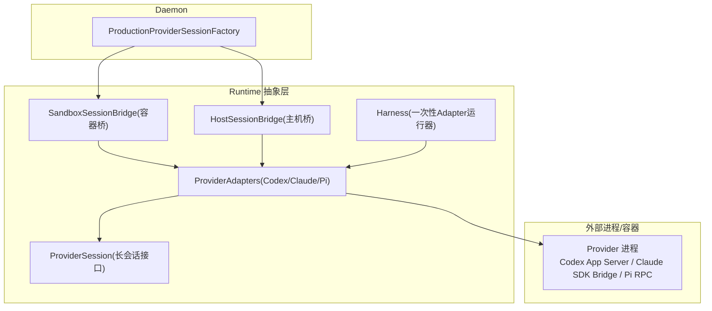
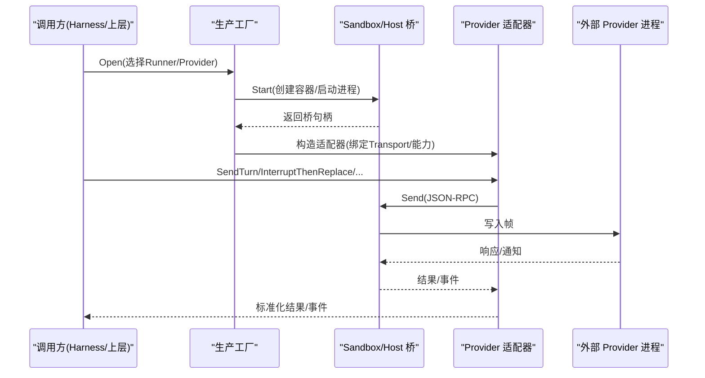
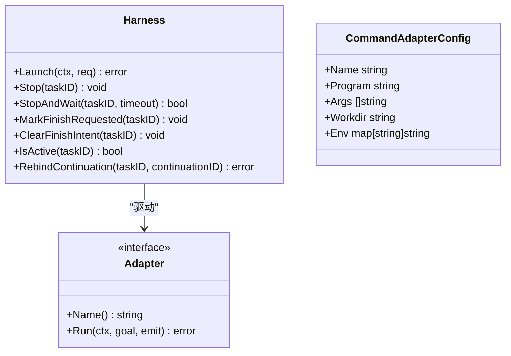
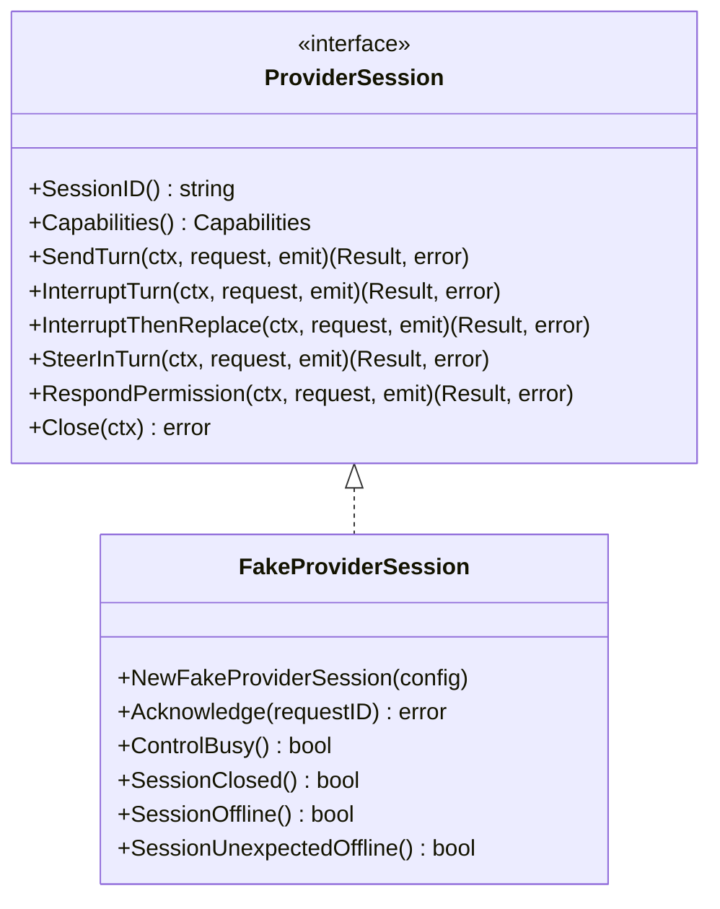
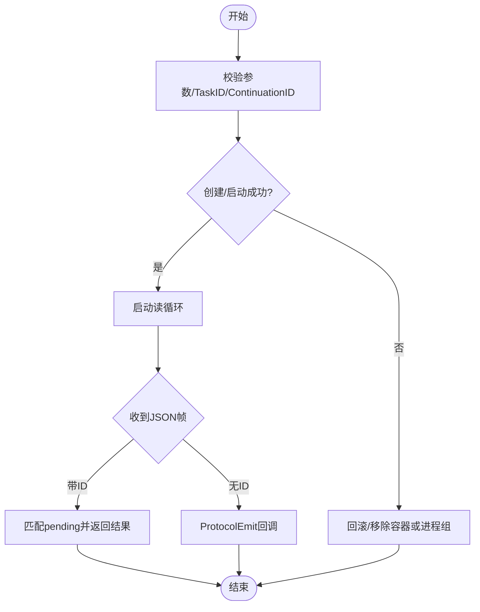
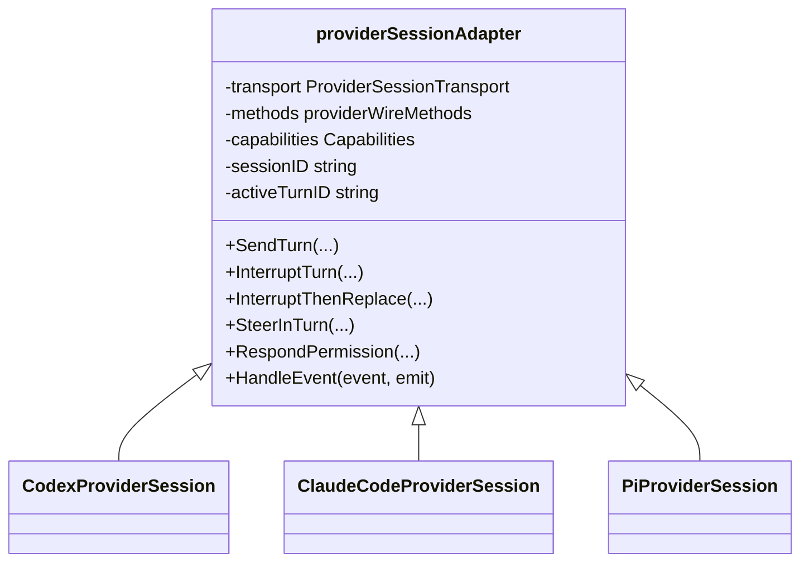
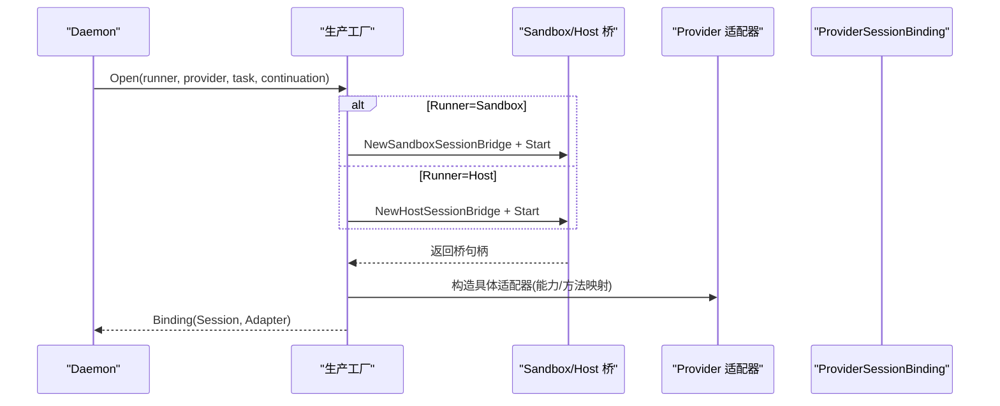
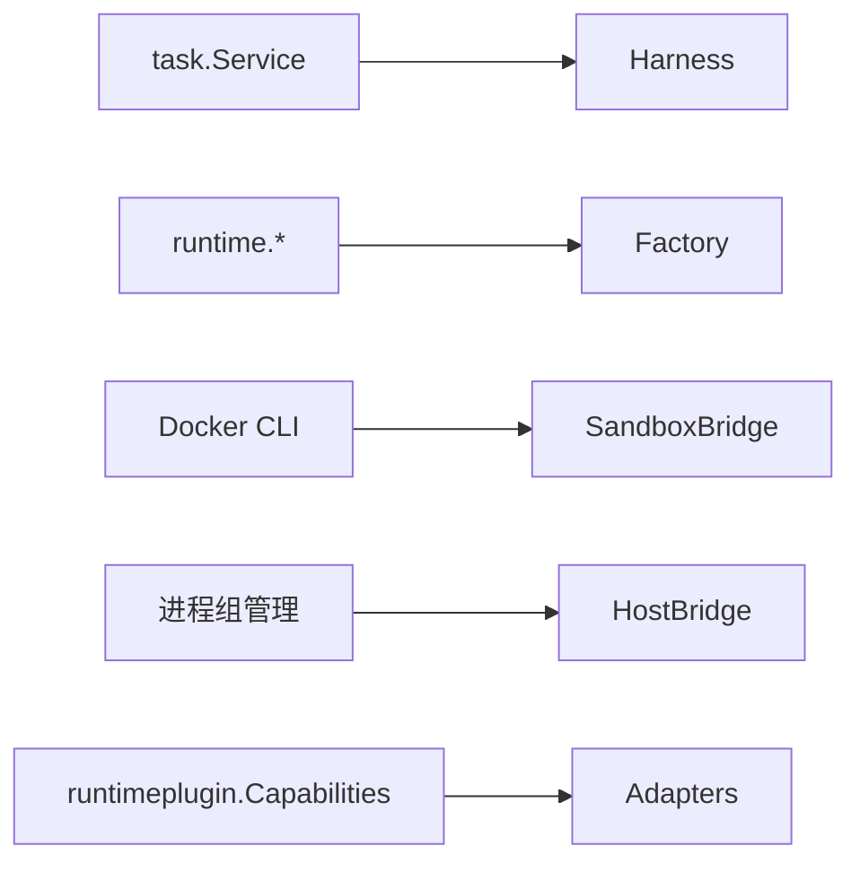

# 运行时抽象层

<cite>
**本文引用的文件列表**
- [internal/runtime/runtime.go](file://internal/runtime/runtime.go)
- [internal/runtime/provider_session.go](file://internal/runtime/provider_session.go)
- [internal/runtime/session_bridge.go](file://internal/runtime/session_bridge.go)
- [internal/runtime/host_session_bridge.go](file://internal/runtime/host_session_bridge.go)
- [internal/runtime/container.go](file://internal/runtime/container.go)
- [internal/runtime/session_metadata.go](file://internal/runtime/session_metadata.go)
- [internal/runtime/provider_adapters.go](file://internal/runtime/provider_adapters.go)
- [internal/daemon/production_provider_session_factory.go](file://internal/daemon/production_provider_session_factory.go)
- [docs/specs/runtime-native-steer.md](file://docs/specs/runtime-native-steer.md)
</cite>

## 目录
1. [引言](#引言)
2. [项目结构](#项目结构)
3. [核心组件](#核心组件)
4. [架构总览](#架构总览)
5. [详细组件分析](#详细组件分析)
6. [依赖关系分析](#依赖关系分析)
7. [性能与可靠性考量](#性能与可靠性考量)
8. [故障排查指南](#故障排查指南)
9. [结论](#结论)
10. [附录：自定义运行时适配器开发指南](#附录自定义运行时适配器开发指南)

## 引言
本文件聚焦于“运行时抽象层”，围绕以下目标展开：
- 深入解析 Runtime 接口设计与 Provider 会话管理、Session 桥接机制。
- 说明运行时生命周期管理、状态跟踪与错误处理策略。
- 完整描述会话建立、消息传递、资源清理流程。
- 提供自定义运行时适配器的实现要求与最佳实践。
- 解释与外部 AI 提供商的通信协议与数据格式。

## 项目结构
运行时抽象层位于 internal/runtime，负责：
- 统一对外暴露 Adapter 与 ProviderSession 能力边界。
- 通过 Sandbox/Host 两种桥接方式连接外部进程或容器中的 provider。
- 将 provider 事件标准化为 Task/Continuation 事件并持久化。
- 在 daemon 侧由生产工厂装配具体 provider（Codex、Claude Code、Pi）的长会话。

图表来源
- [internal/daemon/production_provider_session_factory.go:118-131](file://internal/daemon/production_provider_session_factory.go#L118-L131)
- [internal/runtime/session_bridge.go:105-125](file://internal/runtime/session_bridge.go#L105-L125)
- [internal/runtime/host_session_bridge.go:61-81](file://internal/runtime/host_session_bridge.go#L61-L81)
- [internal/runtime/provider_adapters.go:727-827](file://internal/runtime/provider_adapters.go#L727-L827)
- [internal/runtime/runtime.go:49-69](file://internal/runtime/runtime.go#L49-L69)

章节来源
- [internal/runtime/runtime.go:1-120](file://internal/runtime/runtime.go#L1-L120)
- [internal/runtime/session_bridge.go:1-125](file://internal/runtime/session_bridge.go#L1-L125)
- [internal/runtime/host_session_bridge.go:1-81](file://internal/runtime/host_session_bridge.go#L1-L81)
- [internal/runtime/provider_adapters.go:1-120](file://internal/runtime/provider_adapters.go#L1-L120)
- [internal/daemon/production_provider_session_factory.go:118-131](file://internal/daemon/production_provider_session_factory.go#L118-L131)

## 核心组件
- Adapter/Harness：一次性运行器，封装单个 Continuation 的生命周期，记录事件、更新任务状态、支持停止与完成语义。
- ProviderSession：长会话接口，支持发送 turn、中断、中断后替换、轮内转向、权限响应等能力。
- Session 桥：SandboxSessionBridge 与 HostSessionBridge，分别基于 Docker 和宿主进程，提供非 PTY 的 JSON-RPC 双向通道。
- Provider 适配器：针对 Codex、Claude Code、Pi 的具体 wire 映射与能力声明。
- 元数据与容器确认：从 stdout 提取 session 元数据；确认容器退出。

章节来源
- [internal/runtime/runtime.go:19-69](file://internal/runtime/runtime.go#L19-L69)
- [internal/runtime/provider_session.go:140-152](file://internal/runtime/provider_session.go#L140-L152)
- [internal/runtime/session_bridge.go:105-125](file://internal/runtime/session_bridge.go#L105-L125)
- [internal/runtime/host_session_bridge.go:61-81](file://internal/runtime/host_session_bridge.go#L61-L81)
- [internal/runtime/provider_adapters.go:727-827](file://internal/runtime/provider_adapters.go#L727-L827)
- [internal/runtime/container.go:13-33](file://internal/runtime/container.go#L13-L33)
- [internal/runtime/session_metadata.go:8-46](file://internal/runtime/session_metadata.go#L8-L46)

## 架构总览
运行时抽象层采用“一次性 Adapter + 长会话 ProviderSession + 桥”的分层设计：
- Harness 驱动 Adapter.Run 执行一次 Continuation，期间通过 emit 上报标准化事件。
- 当需要交互式控制时，使用 ProviderSession 保持同一 Task 的长会话，避免重复创建容器/进程。
- 桥负责与外部进程/容器进行 JSON-RPC 交互，区分请求/通知，维护 idempotency key 与 pending 表。
- Daemon 的生产工厂根据 Runner 类型选择 Sandbox 或 Host 桥，并组装具体 provider 适配器。

图表来源
- [internal/daemon/production_provider_session_factory.go:497-534](file://internal/daemon/production_provider_session_factory.go#L497-L534)
- [internal/runtime/session_bridge.go:379-442](file://internal/runtime/session_bridge.go#L379-L442)
- [internal/runtime/provider_adapters.go:126-196](file://internal/runtime/provider_adapters.go#L126-L196)

## 详细组件分析

### 运行时接口与一次性运行器（Adapter/Harness）
- Adapter 是 provider 特定的运行时边界，Run 方法负责执行一个 continuation，并通过 emit 上报标准化事件。
- Harness 负责：
  - 注册 active run，设置 cancel/done，记录当前 continuationID。
  - 在 Run 前后更新 Task/Continuation 状态，输出 lifecycle 事件。
  - 支持 Stop/StopAndWait、Finish 意图标记与清理。
  - 可选地接收 metadata 回调以持久化容器/会话标识。

图表来源
- [internal/runtime/runtime.go:49-179](file://internal/runtime/runtime.go#L49-L179)
- [internal/runtime/runtime.go:333-356](file://internal/runtime/runtime.go#L333-L356)

章节来源
- [internal/runtime/runtime.go:49-179](file://internal/runtime/runtime.go#L49-L179)
- [internal/runtime/runtime.go:333-356](file://internal/runtime/runtime.go#L333-L356)

### Provider 会话接口与能力协商
- ProviderSession 定义了长会话能力：SendTurn、InterruptTurn、InterruptThenReplace、SteerInTurn、RespondPermission、Close。
- 能力集 Capabilities 用于声明是否支持某项操作，未支持的操作返回明确错误类型。
- FakeProviderSession 用于测试，模拟能力、失败注入、手动确认等场景。

图表来源
- [internal/runtime/provider_session.go:140-152](file://internal/runtime/provider_session.go#L140-L152)
- [internal/runtime/provider_session.go:176-215](file://internal/runtime/provider_session.go#L176-L215)

章节来源
- [internal/runtime/provider_session.go:140-152](file://internal/runtime/provider_session.go#L140-L152)
- [internal/runtime/provider_session.go:176-215](file://internal/runtime/provider_session.go#L176-L215)

### Session 桥：Sandbox 与 Host
- SandboxSessionBridge：基于 Docker CLI，create/start/stop/remove 容器，stdin/stdout 作为 JSON-RPC 通道，stderr 作为诊断流。
- HostSessionBridge：在宿主机上以独立进程组启动子进程，同样以 stdin/stdout 承载 JSON-RPC，支持进程组回收。
- 两者均实现：
  - 按 ID 去重与幂等重试（fingerprint 校验）。
  - pending/completed 表管理请求-响应关联。
  - 无 TTY 的交互式输入约束校验。
  - Terminated/Closed 信号区分意外终止与显式关闭。

图表来源
- [internal/runtime/session_bridge.go:278-352](file://internal/runtime/session_bridge.go#L278-L352)
- [internal/runtime/host_session_bridge.go:162-231](file://internal/runtime/host_session_bridge.go#L162-L231)
- [internal/runtime/session_bridge.go:379-442](file://internal/runtime/session_bridge.go#L379-L442)
- [internal/runtime/host_session_bridge.go:252-315](file://internal/runtime/host_session_bridge.go#L252-L315)

章节来源
- [internal/runtime/session_bridge.go:105-125](file://internal/runtime/session_bridge.go#L105-L125)
- [internal/runtime/host_session_bridge.go:61-81](file://internal/runtime/host_session_bridge.go#L61-L81)
- [internal/runtime/session_bridge.go:278-352](file://internal/runtime/session_bridge.go#L278-L352)
- [internal/runtime/host_session_bridge.go:162-231](file://internal/runtime/host_session_bridge.go#L162-L231)

### Provider 适配器：Codex、Claude Code、Pi
- 通用 adapter 实现 providerSessionAdapter，封装：
  - 能力检查、并发控制、请求指纹与缓存。
  - 原生 wire 方法映射（send/interrupt/steer/permission）。
  - 事件归一化：将 provider 通知映射为标准化事件，包含 request_id、session_id、provider_turn_id、mode、outcome。
  - 中断后替换的两阶段语义：先 interrupt，等待 settlement，再 send replacement。
- 具体适配器：
  - Codex：turn/start、turn/interrupt、item/permission/respond。
  - Claude Code：claude/input、claude/interrupt、claude/permission/respond。
  - Pi：pi/prompt、pi/abort、pi/steer、pi/permission/respond，并在 send 前执行 set_model → set_thinking_level。

图表来源
- [internal/runtime/provider_adapters.go:60-92](file://internal/runtime/provider_adapters.go#L60-L92)
- [internal/runtime/provider_adapters.go:727-766](file://internal/runtime/provider_adapters.go#L727-L766)
- [internal/runtime/provider_adapters.go:779-803](file://internal/runtime/provider_adapters.go#L779-L803)
- [internal/runtime/provider_adapters.go:815-827](file://internal/runtime/provider_adapters.go#L815-L827)

章节来源
- [internal/runtime/provider_adapters.go:60-92](file://internal/runtime/provider_adapters.go#L60-L92)
- [internal/runtime/provider_adapters.go:126-196](file://internal/runtime/provider_adapters.go#L126-L196)
- [internal/runtime/provider_adapters.go:727-766](file://internal/runtime/provider_adapters.go#L727-L766)
- [internal/runtime/provider_adapters.go:779-803](file://internal/runtime/provider_adapters.go#L779-L803)
- [internal/runtime/provider_adapters.go:815-827](file://internal/runtime/provider_adapters.go#L815-L827)

### 生产工厂与装配
- ProductionProviderSessionFactory 根据 Runner 类型选择 Sandbox 或 Host 桥，并组装对应 provider 适配器。
- 对每个 Task 仅保留一个桥实例，后续 Continuation 复用同一桥，通过 BindContinuation 切换 pin。
- 完成握手后，返回 ProviderSessionBinding，包含长会话与可运行的 Adapter（用于一次性 Run）。

图表来源
- [internal/daemon/production_provider_session_factory.go:428-534](file://internal/daemon/production_provider_session_factory.go#L428-L534)
- [internal/daemon/production_provider_session_factory.go:190-223](file://internal/daemon/production_provider_session_factory.go#L190-L223)
- [internal/daemon/production_provider_session_factory.go:342-375](file://internal/daemon/production_provider_session_factory.go#L342-L375)

章节来源
- [internal/daemon/production_provider_session_factory.go:118-131](file://internal/daemon/production_provider_session_factory.go#L118-L131)
- [internal/daemon/production_provider_session_factory.go:428-534](file://internal/daemon/production_provider_session_factory.go#L428-L534)

## 依赖关系分析
- 运行时抽象层依赖 task 服务以记录事件与更新状态。
- 生产工厂依赖 runtime 提供的桥与适配器，以及 runtimeprofile 的能力配置。
- 桥依赖 Docker CLI 或本地进程组管理。
- 适配器依赖 runtimeplugin.Capabilities 声明能力。

图表来源
- [internal/runtime/runtime.go:15-17](file://internal/runtime/runtime.go#L15-L17)
- [internal/daemon/production_provider_session_factory.go:118-131](file://internal/daemon/production_provider_session_factory.go#L118-L131)
- [internal/runtime/session_bridge.go:127-147](file://internal/runtime/session_bridge.go#L127-L147)
- [internal/runtime/host_session_bridge.go:469-473](file://internal/runtime/host_session_bridge.go#L469-L473)
- [internal/runtime/provider_adapters.go:673-682](file://internal/runtime/provider_adapters.go#L673-L682)

章节来源
- [internal/runtime/runtime.go:15-17](file://internal/runtime/runtime.go#L15-L17)
- [internal/daemon/production_provider_session_factory.go:118-131](file://internal/daemon/production_provider_session_factory.go#L118-L131)
- [internal/runtime/session_bridge.go:127-147](file://internal/runtime/session_bridge.go#L127-L147)
- [internal/runtime/host_session_bridge.go:469-473](file://internal/runtime/host_session_bridge.go#L469-L473)
- [internal/runtime/provider_adapters.go:673-682](file://internal/runtime/provider_adapters.go#L673-L682)

## 性能与可靠性考量
- 幂等性：桥层对相同 request.id 做指纹校验，避免重复写入；适配器层缓存已完成的请求结果，防止重复执行。
- 并发控制：适配器层保证同一时刻只有一个控制操作在进行，冲突返回明确错误。
- 健康检测：桥层区分 Closed/Terminated，适配器层据此判断 offline/unexpectedOffline。
- 资源清理：容器通过 StopConfirmation 轮询确认退出；宿主进程通过进程组回收确保子进程被清理。
- 事件安全：所有敏感信息在输出前进行脱敏，避免泄露到 Task 事件或日志。

章节来源
- [internal/runtime/session_bridge.go:379-442](file://internal/runtime/session_bridge.go#L379-L442)
- [internal/runtime/provider_adapters.go:461-523](file://internal/runtime/provider_adapters.go#L461-L523)
- [internal/runtime/container.go:26-72](file://internal/runtime/container.go#L26-L72)
- [internal/runtime/host_session_bridge.go:394-416](file://internal/runtime/host_session_bridge.go#L394-L416)
- [internal/runtime/runtime.go:425-480](file://internal/runtime/runtime.go#L425-L480)

## 故障排查指南
- 常见错误类型
  - 不支持能力：UnsupportedProviderSessionCapabilityError。
  - 会话关闭：ErrProviderSessionClosed。
  - 请求冲突：ProviderSessionRequestConflictError。
  - 桥层无效/冲突：ErrSandboxBridgeInvalid、ErrSandboxBridgeRequestConflict。
  - 进程/容器异常：包装后的错误，需查看诊断流。
- 定位步骤
  - 检查桥层状态：Closed/Terminated 信号，确认是否为意外终止。
  - 核对 request.id 幂等键是否与之前一致。
  - 查看 Provider 适配器的事件输出，确认 mode/outcome 是否符合预期。
  - 对于容器环境，确认 create/start 参数不含 -t/--tty，且 -i/--interactive 存在。
  - 对于宿主环境，确认进程组回收是否生效。

章节来源
- [internal/runtime/provider_session.go:40-76](file://internal/runtime/provider_session.go#L40-L76)
- [internal/runtime/session_bridge.go:76-83](file://internal/runtime/session_bridge.go#L76-L83)
- [internal/runtime/host_session_bridge.go:52-57](file://internal/runtime/host_session_bridge.go#L52-57)
- [internal/runtime/session_bridge.go:556-573](file://internal/runtime/session_bridge.go#L556-L573)

## 结论
运行时抽象层通过 Adapter/Harness 与 ProviderSession 的清晰分层，结合 Sandbox/Host 桥的统一 JSON-RPC 传输，实现了跨 provider 的一致交互模型。其幂等、并发控制与健康检测机制保障了可靠性和可观测性。生产工厂将不同 runner 与 provider 无缝装配，使系统具备扩展性与可维护性。

## 附录：自定义运行时适配器开发指南

### 接口实现要求
- 实现 Adapter 接口（一次性运行器）：
  - Name 返回唯一名称。
  - Run 中通过 emit 上报标准化事件，不泄露敏感信息。
  - 支持上下文取消与错误返回。
- 如需长会话能力，实现 ProviderSession 接口：
  - 正确声明 Capabilities。
  - 实现 SendTurn、InterruptTurn、InterruptThenReplace、SteerInTurn、RespondPermission、Close。
  - 遵循幂等键与并发控制约定。
- 若通过桥接入，实现 ProviderSessionTransport 或直接使用现有桥。

章节来源
- [internal/runtime/runtime.go:19-30](file://internal/runtime/runtime.go#L19-L30)
- [internal/runtime/provider_session.go:140-152](file://internal/runtime/provider_session.go#L140-L152)
- [internal/runtime/provider_adapters.go:14-28](file://internal/runtime/provider_adapters.go#L14-28)

### 最佳实践
- 事件规范化：只输出相关字段（request_id、session_id、provider_turn_id、mode、outcome），避免原始协议载荷进入 Task 事件。
- 幂等键：为每次控制请求生成稳定 request.id，并在适配器层缓存结果。
- 能力协商：仅在支持的 capability 下执行操作，否则返回 UnsupportedProviderSessionCapabilityError。
- 健康检测：监听桥层的 Closed/Terminated，及时标记 offline/unexpectedOffline。
- 资源清理：在 Close 中确保桥层与底层资源释放，避免泄漏。
- 元数据持久化：通过 SetMetadataRecorder/SetSessionMetadata 将容器/进程组/会话标识持久化到 Continuation。

章节来源
- [internal/runtime/provider_adapters.go:552-568](file://internal/runtime/provider_adapters.go#L552-L568)
- [internal/runtime/provider_session.go:160-215](file://internal/runtime/provider_session.go#L160-L215)
- [internal/runtime/runtime.go:406-423](file://internal/runtime/runtime.go#L406-L423)
- [internal/runtime/host_session_bridge.go:431-467](file://internal/runtime/host_session_bridge.go#L431-L467)

### 与外部 AI 提供商的通信协议与数据格式
- 传输协议：非 PTY 的 JSON-RPC 2.0，行分隔，stdout 仅承载协议帧，stderr 用于诊断。
- 请求/响应：SandboxBridgeRequest/SandboxBridgeResponse，包含 jsonrpc、id、method、params/result/error。
- 通知：无 id 的帧作为通知，通过 ProtocolEmit 回调分发。
- 能力与方法：
  - Codex：thread/start、thread/resume、turn/start、turn/interrupt、item/permission/respond。
  - Claude Code：claude/initialize、claude/input、claude/interrupt、claude/permission/respond。
  - Pi：pi/get_state、pi/set_model、pi/set_thinking_level、pi/prompt、pi/abort、pi/steer、pi/permission/respond。
- 元数据：从 stdout 的 JSONL 记录中提取 session_id，用于持久化 NativeSessionMetadata。

章节来源
- [internal/runtime/session_bridge.go:44-74](file://internal/runtime/session_bridge.go#L44-L74)
- [internal/runtime/provider_adapters.go:727-766](file://internal/runtime/provider_adapters.go#L727-L766)
- [internal/runtime/provider_adapters.go:779-803](file://internal/runtime/provider_adapters.go#L779-L803)
- [internal/runtime/provider_adapters.go:815-827](file://internal/runtime/provider_adapters.go#L815-L827)
- [internal/runtime/session_metadata.go:8-46](file://internal/runtime/session_metadata.go#L8-L46)
- [docs/specs/runtime-native-steer.md:74-111](file://docs/specs/runtime-native-steer.md#L74-L111)