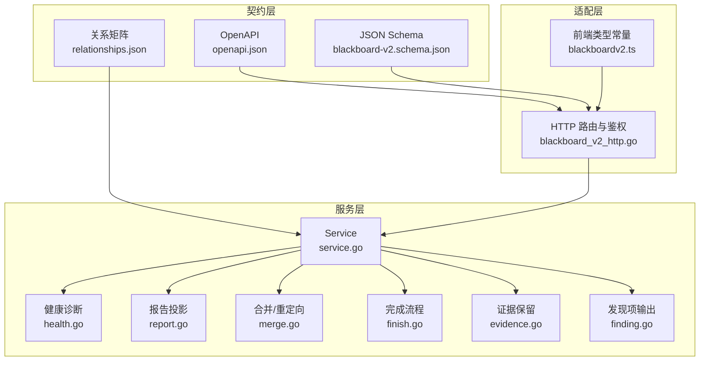
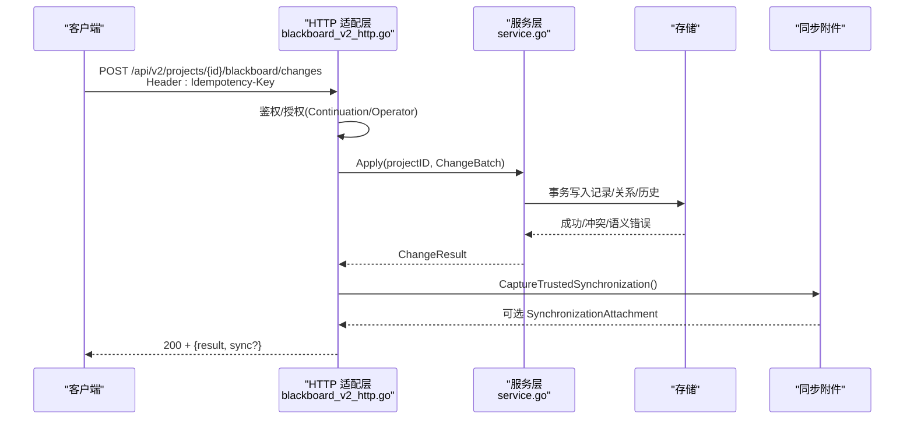
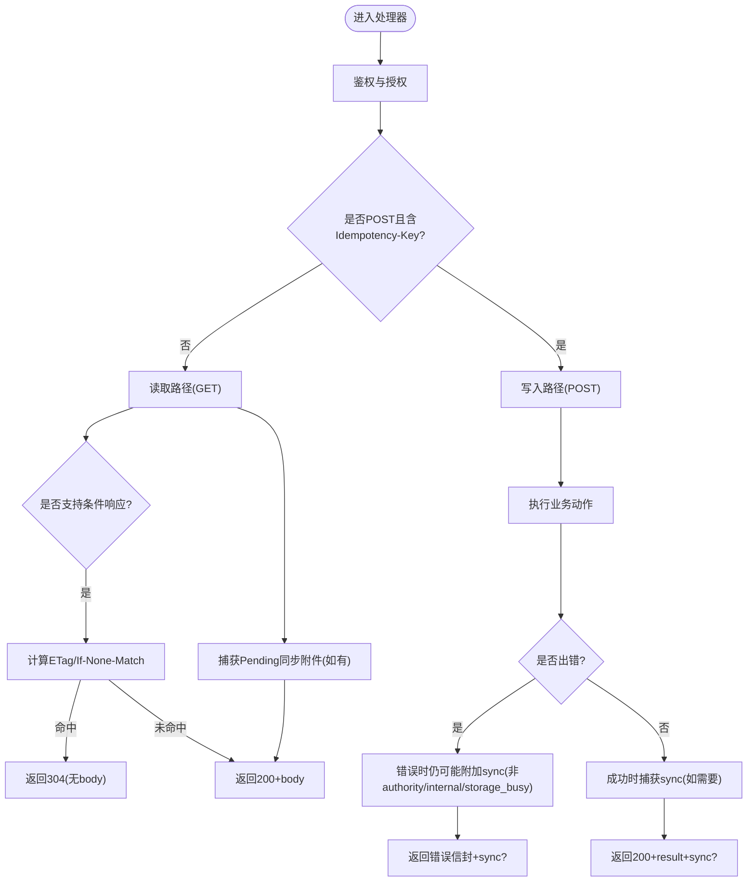
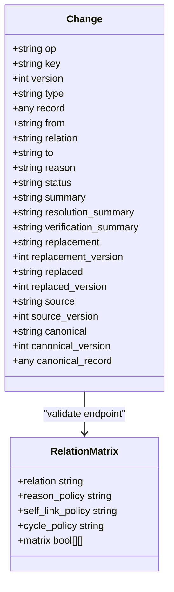
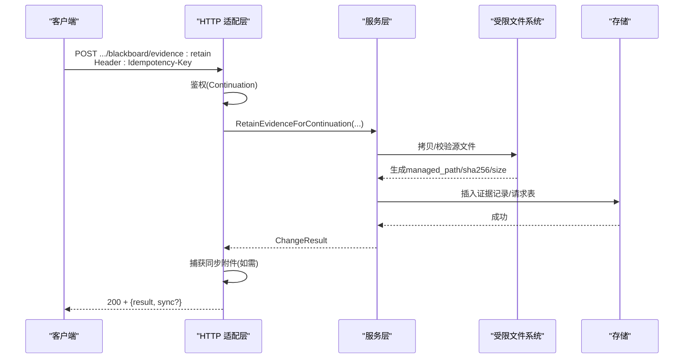
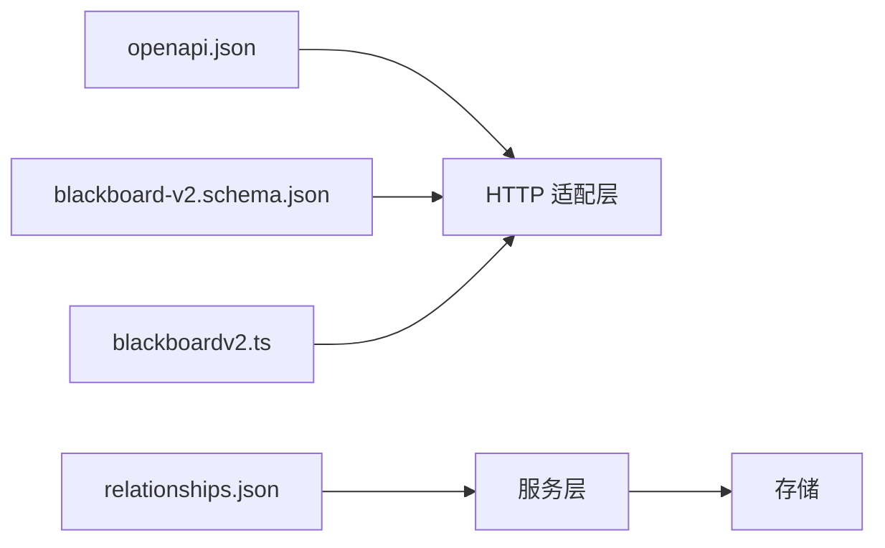

# Blackboard v2 API

<cite>
**本文引用的文件**   
- [blackboard_v2_http.go](file://internal/daemon/blackboard_v2_http.go)
- [service.go](file://internal/blackboardv2/service.go)
- [openapi.json](file://internal/blackboardv2contract/contractdata/openapi.json)
- [blackboard-v2.schema.json](file://internal/blackboardv2contract/contractdata/schemas/blackboard-v2.schema.json)
- [relationships.json](file://internal/blackboardv2contract/contractdata/relationships.json)
- [health.go](file://internal/blackboardv2/health.go)
- [report.go](file://internal/blackboardv2/report.go)
- [merge.go](file://internal/blackboardv2/merge.go)
- [finish.go](file://internal/blackboardv2/finish.go)
- [evidence.go](file://internal/blackboardv2/evidence.go)
- [finding.go](file://internal/blackboardv2/finding.go)
- [blackboard-v2-spec.md](file://docs/specs/blackboard-v2-spec.md)
- [0014-use-one-versioned-blackboard-v2-project-interface.md](file://docs/adr/0014-use-one-versioned-blackboard-v2-project-interface.md)
- [blackboardv2.ts](file://web/src/lib/blackboardv2.ts)
</cite>

## 目录
1. [简介](#简介)
2. [项目结构](#项目结构)
3. [核心组件](#核心组件)
4. [架构总览](#架构总览)
5. [详细组件分析](#详细组件分析)
6. [依赖分析](#依赖分析)
7. [性能考虑](#性能考虑)
8. [故障排查指南](#故障排查指南)
9. [结论](#结论)
10. [附录](#附录)

## 简介
Blackboard v2 是 CyberPenda 的语义记忆平面，提供统一的、版本化的“项目接口”，通过 HTTP /api/v2 暴露六个受信任的语义操作：变更批处理、当前读取、历史分页、证据保留、尝试检查点与完成。该接口具备强一致性（原子批处理）、幂等性（Idempotency-Key）、可同步（可选 SynchronizationAttachment）与条件缓存（ETag + If-None-Match）。同时提供健康诊断、报告投影（渗透测试报告与 CTF 解法）等系统级能力。

本文件面向集成方与二次开发者，系统化阐述 RESTful 设计、数据模型、错误码、同步机制与最佳实践，并给出端到端示例路径与参考实现位置。

## 项目结构
Blackboard v2 由三层组成：
- 协议与契约层：OpenAPI 与 JSON Schema 定义请求/响应、字段约束与关系矩阵。
- 服务层：领域服务封装原子写入、快照生成、健康诊断、报告投影、合并与重定向等。
- 适配层：HTTP 路由、鉴权、幂等键校验、同步附件注入、条件响应与错误映射。

图表来源
- [openapi.json:1-800](file://internal/blackboardv2contract/contractdata/openapi.json#L1-L800)
- [blackboard-v2.schema.json:1-800](file://internal/blackboardv2contract/contractdata/schemas/blackboard-v2.schema.json#L1-L800)
- [relationships.json:1-37](file://internal/blackboardv2contract/contractdata/relationships.json#L1-L37)
- [blackboard_v2_http.go:29-46](file://internal/daemon/blackboard_v2_http.go#L29-L46)
- [service.go:40-70](file://internal/blackboardv2/service.go#L40-L70)
- [health.go:1-45](file://internal/blackboardv2/health.go#L1-L45)
- [report.go:1-27](file://internal/blackboardv2/report.go#L1-L27)
- [merge.go:1-238](file://internal/blackboardv2/merge.go#L1-L238)
- [finish.go:1-52](file://internal/blackboardv2/finish.go#L1-L52)
- [evidence.go:811-823](file://internal/blackboardv2/evidence.go#L811-L823)
- [finding.go:1-30](file://internal/blackboardv2/finding.go#L1-L30)
- [blackboardv2.ts:1-40](file://web/src/lib/blackboardv2.ts#L1-L40)

章节来源
- [blackboard_v2_http.go:29-46](file://internal/daemon/blackboard_v2_http.go#L29-L46)
- [openapi.json:17-778](file://internal/blackboardv2contract/contractdata/openapi.json#L17-L778)
- [blackboard-v2.schema.json:1-800](file://internal/blackboardv2contract/contractdata/schemas/blackboard-v2.schema.json#L1-L800)

## 核心组件
- 变更批处理（ChangeBatch）：原子应用一组语义变更（create/update/relate/unrelate/transition/supersede/merge），返回变更结果与受影响记录/关系版本元组。
- 当前读取与历史：按 Key 获取当前详情（含关系列表）；按游标分页的历史条目。
- 运行时快照：完整、不可分页的当前工作态与知识态快照，带 revision ETag。
- 证据保留：受限文件系统根下的证据持久化，支持链接到实体/发现项等。
- 尝试检查点：为 open 状态的 Attempt 保存进度摘要，便于中断恢复。
- 完成：结束 Continuation，支持幂等重放与同步附件投递。
- 健康诊断：确定性健康状态、注意力预算、异常与建议。
- 报告投影：渗透测试报告与 CTF 解法的 JSON/markdown 双格式输出。

章节来源
- [service.go:72-120](file://internal/blackboardv2/service.go#L72-L120)
- [service.go:122-232](file://internal/blackboardv2/service.go#L122-L232)
- [service.go:414-475](file://internal/blackboardv2/service.go#L414-L475)
- [service.go:477-533](file://internal/blackboardv2/service.go#L477-L533)
- [service.go:555-614](file://internal/blackboardv2/service.go#L555-L614)
- [service.go:644-656](file://internal/blackboardv2/service.go#L644-L656)
- [finish.go:15-52](file://internal/blackboardv2/finish.go#L15-L52)
- [health.go:13-45](file://internal/blackboardv2/health.go#L13-L45)
- [report.go:10-27](file://internal/blackboardv2/report.go#L10-L27)

## 架构总览
HTTP 适配层负责鉴权、幂等键校验、同步附件注入与条件响应；服务层执行领域逻辑与持久化；契约层确保跨进程/语言的一致性。

图表来源
- [blackboard_v2_http.go:97-125](file://internal/daemon/blackboard_v2_http.go#L97-L125)
- [service.go:644-656](file://internal/blackboardv2/service.go#L644-L656)
- [openapi.json:17-100](file://internal/blackboardv2contract/contractdata/openapi.json#L17-L100)

## 详细组件分析

### 认证与权限模型
- 两种身份：
  - 运营者/UI：使用守护进程令牌（Authorization header），无需 Continuation。
  - 运行时（Continuation）：使用 Continuation Interface Grant Bearer Token，绑定 Project/Task/Continuation。
- 安全要点：
  - 禁止在查询字符串中传递 bearer token。
  - 路径中的 project_id 必须与 grant.project_id 一致。
  - 关闭的 Continuation 将失去“当前知识”读权限，但允许精确重放已幂等的写操作。

章节来源
- [blackboard_v2_http.go:52-95](file://internal/daemon/blackboard_v2_http.go#L52-L95)
- [blackboard_v2_http.go:368-438](file://internal/daemon/blackboard_v2_http.go#L368-L438)
- [0014-use-one-versioned-blackboard-v2-project-interface.md:1-4](file://docs/adr/0014-use-one-versioned-blackboard-v2-project-interface.md#L1-L4)

### 幂等性与同步附件
- 所有 POST 必须携带 Idempotency-Key；GET 不要求。
- 同步附件（sync）可在成功或失败时附加，包含 reason、from_revision、revision 与完整的 RuntimeSnapshot，用于驱动客户端拉取最新快照。
- 对于 GET 的条件响应，若存在 sync 附件则始终返回正文，避免 304 丢弃同步内容。

图表来源
- [blackboard_v2_http.go:368-438](file://internal/daemon/blackboard_v2_http.go#L368-L438)
- [blackboard_v2_http.go:440-463](file://internal/daemon/blackboard_v2_http.go#L440-L463)
- [blackboard_v2_http.go:500-513](file://internal/daemon/blackboard_v2_http.go#L500-L513)

### 变更批处理与关系语法
- 支持的 op：create、update、relate、unrelate、transition、supersede、merge。
- 关系类型（11种）：about、part_of、tests、produced、evidences、supports、contradicts、derived_from、depends_on、satisfies、supersedes。
- 关系端点矩阵由契约文件严格限定，不支持的组合将被拒绝；部分关系允许 reason。

图表来源
- [service.go:122-232](file://internal/blackboardv2/service.go#L122-L232)
- [relationships.json:1-37](file://internal/blackboardv2contract/contractdata/relationships.json#L1-L37)

章节来源
- [service.go:122-232](file://internal/blackboardv2/service.go#L122-L232)
- [relationships.json:1-37](file://internal/blackboardv2contract/contractdata/relationships.json#L1-L37)

### 实体管理（Entity）
- 创建/更新实体，维护 scope_status、locator、credential_ref 等只读/受控字段。
- 支持 supersede 替换旧实体，保持历史与关系迁移。

章节来源
- [service.go:234-253](file://internal/blackboardv2/service.go#L234-L253)
- [service.go:2106-2131](file://internal/blackboardv2/service.go#L2106-L2131)

### 事实记录（Fact）
- 分类、置信度（tentative/confirmed）、范围状态。
- 可通过 derived_from 关联证据，形成可追溯的知识链。

章节来源
- [service.go:278-294](file://internal/blackboardv2/service.go#L278-L294)
- [relationship_service_test.go:15-58](file://internal/blackboardv2/relationship_service_test.go#L15-L58)

### 发现项（Finding）
- 输入 DTO 不包含派生字段（severity/cvss_pending），由服务端推导。
- confirmed 状态需满足更多必填字段约束。

章节来源
- [service.go:296-321](file://internal/blackboardv2/service.go#L296-L321)
- [finding.go:1-30](file://internal/blackboardv2/finding.go#L1-L30)

### 解决方案（Solution）
- 支持 answer/flag/procedure 三种 kind，verified 时需验证摘要与值。

章节来源
- [service.go:323-338](file://internal/blackboardv2/service.go#L323-L338)

### 证据管理（Evidence）
- 保留证据至受限文件系统根，生成 managed_path、sha256、size 等完整性字段。
- 支持 links 将证据与实体/发现项建立 evidences 关系。
- merge 可将重复证据合并到规范键，并建立重定向。

章节来源
- [service.go:340-359](file://internal/blackboardv2/service.go#L340-L359)
- [evidence.go:811-823](file://internal/blackboardv2/evidence.go#L811-L823)
- [merge.go:212-238](file://internal/blackboardv2/merge.go#L212-L238)

### 版本控制、快照与条件读取
- 全局 revision 递增；每个记录有独立 version。
- Snapshot 为完整、不可分页的当前视图，支持 ETag 与 If-None-Match。
- 历史分页使用 opaque cursor，默认 limit=20，最大 100。

章节来源
- [service.go:477-533](file://internal/blackboardv2/service.go#L477-L533)
- [service.go:497-523](file://internal/blackboardv2/service.go#L497-L523)
- [blackboard_v2_http.go:127-142](file://internal/daemon/blackboard_v2_http.go#L127-L142)
- [blackboard_v2_http.go:177-197](file://internal/daemon/blackboard_v2_http.go#L177-L197)

### 投影查询与报告
- 报告投影仅基于当前语义状态，不含执行元数据。
- 支持 markdown/json 两种格式；json 返回结构化投影，markdown 返回可读文档。

章节来源
- [report.go:1-27](file://internal/blackboardv2/report.go#L1-L27)
- [openapi.json:613-694](file://internal/blackboardv2contract/contractdata/openapi.json#L613-L694)
- [openapi.json:696-778](file://internal/blackboardv2contract/contractdata/openapi.json#L696-L778)

### Continuity 服务、健康检查与数据同步
- Continuity：创建/完成 Continuation，绑定 Task/Project，颁发持久化能力令牌。
- 健康检查：返回 health status、attention budget、anomalies 与 proposals。
- 同步：当检测到共享项目知识变化时，向客户端附带新快照，驱动增量刷新。

章节来源
- [finish.go:15-52](file://internal/blackboardv2/finish.go#L15-L52)
- [health.go:13-45](file://internal/blackboardv2/health.go#L13-L45)
- [blackboard_v2_http.go:368-438](file://internal/daemon/blackboard_v2_http.go#L368-L438)
- [blackboard-v2-spec.md:250-267](file://docs/specs/blackboard-v2-spec.md#L250-L267)

### 高级功能：合并与重定向（Merge & Redirect）
- 将源记录合并到规范记录，复制历史、重写关系、删除源记录并建立 key 重定向。
- 对证据合并场景尤为关键，避免重复证据导致的数据膨胀。

章节来源
- [merge.go:1-238](file://internal/blackboardv2/merge.go#L1-L238)

### 典型调用序列（以证据保留为例）

图表来源
- [blackboard_v2_http.go:199-236](file://internal/daemon/blackboard_v2_http.go#L199-L236)
- [evidence.go:811-823](file://internal/blackboardv2/evidence.go#L811-L823)

## 依赖分析
- 契约层对服务层的强约束：关系矩阵、Schema 字段白名单、枚举值。
- HTTP 适配层与服务层松耦合：通过统一错误信封与同步附件约定交互。
- 前端类型常量与后端契约保持一致，降低集成成本。

图表来源
- [openapi.json:1-800](file://internal/blackboardv2contract/contractdata/openapi.json#L1-L800)
- [blackboard-v2.schema.json:1-800](file://internal/blackboardv2contract/contractdata/schemas/blackboard-v2.schema.json#L1-L800)
- [relationships.json:1-37](file://internal/blackboardv2contract/contractdata/relationships.json#L1-L37)
- [blackboardv2.ts:1-40](file://web/src/lib/blackboardv2.ts#L1-L40)

章节来源
- [openapi.json:1-800](file://internal/blackboardv2contract/contractdata/openapi.json#L1-L800)
- [blackboard-v2.schema.json:1-800](file://internal/blackboardv2contract/contractdata/schemas/blackboard-v2.schema.json#L1-L800)
- [relationships.json:1-37](file://internal/blackboardv2contract/contractdata/relationships.json#L1-L37)
- [blackboardv2.ts:1-40](file://web/src/lib/blackboardv2.ts#L1-L40)

## 性能考虑
- 批量写入：尽量聚合变更以减少事务开销与锁竞争。
- 条件读取：合理使用 If-None-Match 减少带宽与 CPU。
- 历史分页：限制 limit 并使用 next_cursor 滚动翻页。
- 同步附件：仅在必要时触发，避免频繁传输大快照。

[本节为通用指导，不直接分析具体文件]

## 故障排查指南
- 常见错误码与含义：
  - invalid_schema：请求体/字段不符合契约。
  - authority_denied：鉴权/授权失败。
  - not_found：Key 不存在。
  - closed_continuation：Continuation 已关闭。
  - version_conflict/key_conflict/relationship_conflict/idempotency_conflict/finish_conflict：并发冲突。
  - semantic_validation：语义校验失败。
  - storage_busy：数据库忙，建议重试。
  - internal：内部错误。
- 调试建议：
  - 检查 Idempotency-Key 是否稳定。
  - 关注响应中的 sync 附件，优先拉取最新快照。
  - 使用健康检查接口定位异常与建议。

章节来源
- [blackboard_v2_http.go:564-642](file://internal/daemon/blackboard_v2_http.go#L564-L642)
- [health.go:13-45](file://internal/blackboardv2/health.go#L13-L45)

## 结论
Blackboard v2 通过单一版本化接口、严格的契约与强大的同步机制，提供了高可靠、可审计、可扩展的语义记忆平面。集成方应遵循幂等与条件读取的最佳实践，充分利用同步附件与健康诊断，构建稳健的自动化与可视化能力。

[本节为总结，不直接分析具体文件]

## 附录

### API 清单与行为说明
- POST /api/v2/projects/{project_id}/blackboard/changes
  - 作用：原子语义变更批处理
  - 必需头：Idempotency-Key
  - 响应：semantic-change-result/v2（可附带 sync）
- GET /api/v2/projects/{project_id}/blackboard/snapshot
  - 作用：完整运行时快照
  - 可选头：If-None-Match
  - 响应：runtime-blackboard/v2（可附带 sync）
- GET /api/v2/projects/{project_id}/blackboard/health
  - 作用：项目健康诊断
  - 可选头：If-None-Match
  - 响应：blackboard-health/v2（可附带 sync）
- GET /api/v2/projects/{project_id}/blackboard/records/{key}
  - 作用：当前记录详情
  - 可选头：If-None-Match
  - 响应：blackboard-record/v2（可附带 sync）
- GET /api/v2/projects/{project_id}/blackboard/records/{key}/history
  - 作用：历史分页
  - 查询参数：cursor、limit（默认20，最大100）
  - 响应：semantic-history/v2（可附带 sync）
- POST /api/v2/projects/{project_id}/blackboard/evidence:retain
  - 作用：保留证据
  - 必需头：Idempotency-Key
  - 响应：semantic-change-result/v2（可附带 sync）
- POST /api/v2/projects/{project_id}/blackboard/attempts/{key}:checkpoint
  - 作用：尝试检查点
  - 必需头：Idempotency-Key
  - 响应：semantic-change-result/v2（可附带 sync）
- POST /api/v2/projects/{project_id}/continuation:finish
  - 作用：完成 Continuation
  - 必需头：Idempotency-Key
  - 响应：continuation-finish/v2（可附带 sync）
- GET /api/v2/projects/{project_id}/reports/pentest
  - 作用：渗透测试报告（markdown/json）
  - 查询参数：format（默认markdown）
  - 可选头：If-None-Match
- GET /api/v2/projects/{project_id}/reports/ctf-solution
  - 作用：CTF 解法（markdown/json）
  - 查询参数：format（默认markdown）
  - 可选头：If-None-Match

章节来源
- [openapi.json:17-778](file://internal/blackboardv2contract/contractdata/openapi.json#L17-L778)
- [blackboard-v2-spec.md:275-291](file://docs/specs/blackboard-v2-spec.md#L275-L291)

### 集成示例与参考路径
- 前端类型与常量：
  - 运行快照/记录/历史 schema 标识、关系类型、记录类型常量定义
  - 参考：[blackboardv2.ts:1-40](file://web/src/lib/blackboardv2.ts#L1-L40)、[blackboardv2.ts:403-442](file://web/src/lib/blackboardv2.ts#L403-L442)
- CLI 用法（等价于 HTTP）：
  - change/read/history/evidence retain/attempt checkpoint/continuation finish
  - 参考：[pentestctl blackboard_v2.go:310-342](file://internal/pentestctl/blackboard_v2.go#L310-L342)、[pentestctl blackboard_v2.go:481-508](file://internal/pentestctl/blackboard_v2.go#L481-L508)
- 错误与同步附件解析：
  - 参考：[pentestctl blackboard_v2_cli_test.go:574-589](file://internal/pentestctl/blackboard_v2_cli_test.go#L574-L589)

章节来源
- [blackboardv2.ts:1-40](file://web/src/lib/blackboardv2.ts#L1-L40)
- [blackboardv2.ts:403-442](file://web/src/lib/blackboardv2.ts#L403-L442)
- [pentestctl blackboard_v2.go:310-342](file://internal/pentestctl/blackboard_v2.go#L310-L342)
- [pentestctl blackboard_v2.go:481-508](file://internal/pentestctl/blackboard_v2.go#L481-L508)
- [pentestctl blackboard_v2_cli_test.go:574-589](file://internal/pentestctl/blackboard_v2_cli_test.go#L574-L589)