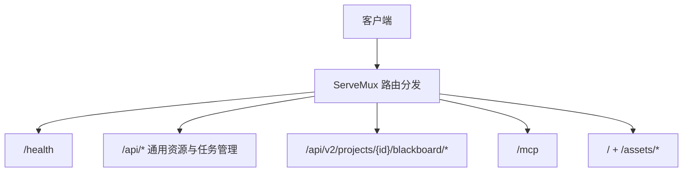
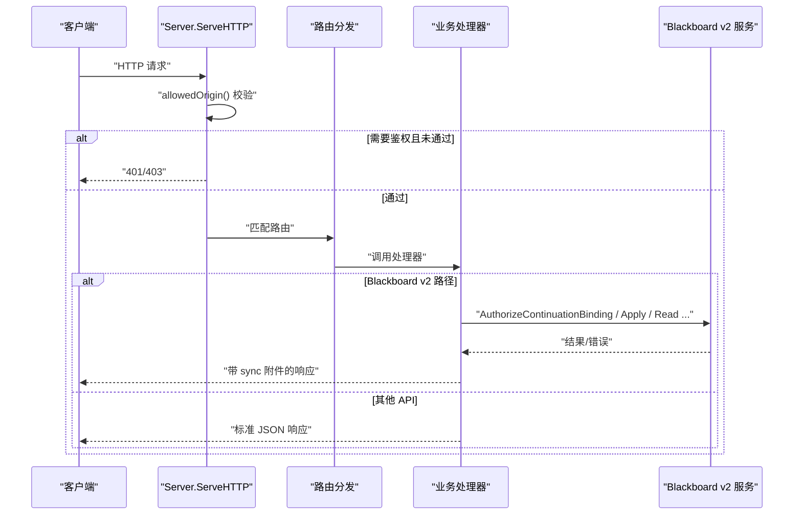
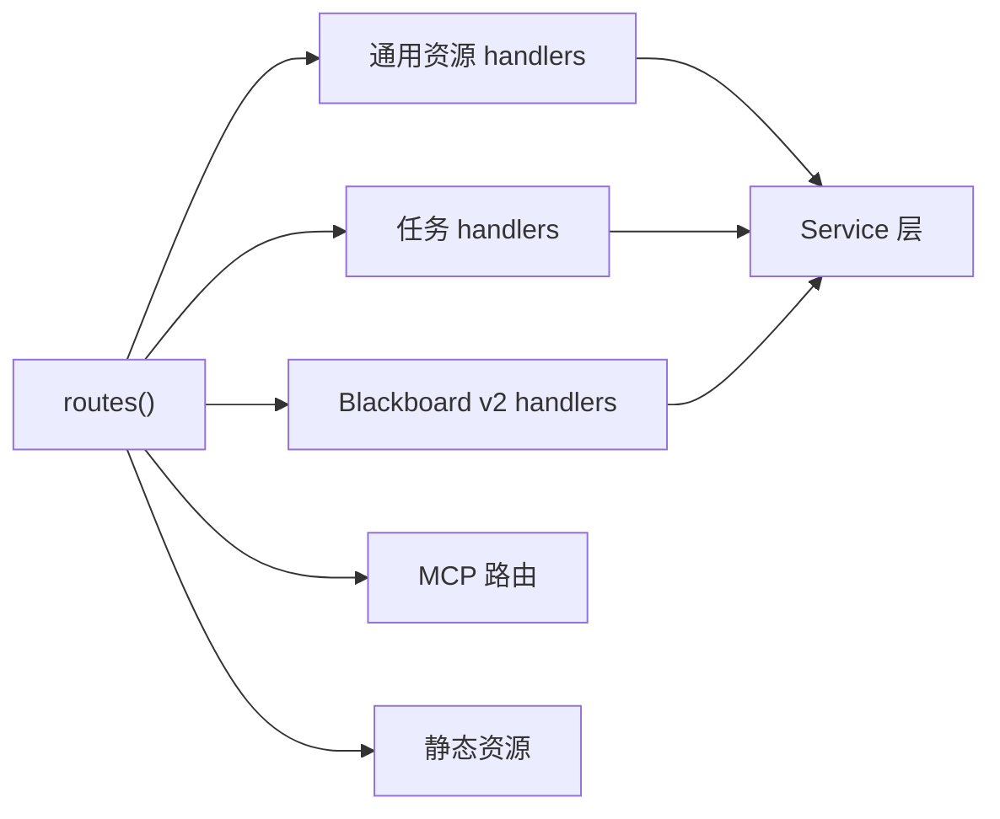

# HTTP API 设计与路由

<cite>
**本文引用的文件**   
- [server.go](file://internal/daemon/server.go)
- [task_handlers.go](file://internal/daemon/task_handlers.go)
- [blackboard_v2_http.go](file://internal/daemon/blackboard_v2_http.go)
- [modelprovider_handlers.go](file://internal/daemon/modelprovider_handlers.go)
- [api.ts](file://web/src/lib/api.ts)
</cite>

## 目录
1. [简介](#简介)
2. [项目结构](#项目结构)
3. [核心组件](#核心组件)
4. [架构总览](#架构总览)
5. [详细组件分析](#详细组件分析)
6. [依赖关系分析](#依赖关系分析)
7. [性能与可扩展性](#性能与可扩展性)
8. [故障排查指南](#故障排查指南)
9. [结论](#结论)
10. [附录：API 参考与调用示例](#附录api-参考与调用示例)

## 简介
本文件面向 Daemon 服务的 HTTP API 设计，聚焦以下目标：
- 梳理 HTTP 路由组织与中间件（鉴权、CORS/Origin 校验）
- 定义 RESTful API 端点规范（URL 模式、HTTP 方法、参数验证、状态码）
- 明确请求/响应格式与错误处理策略
- 说明 API 版本控制策略、跨域配置与安全考虑
- 提供完整 API 调用示例与客户端集成要点

## 项目结构
Daemon 的 HTTP 服务由统一的 Server 入口承载，内部通过 http.ServeMux 注册路由，并在 ServeHTTP 中统一执行 Origin 校验、鉴权与日志记录。业务路由按领域划分到独立 handlers 文件中：
- 通用资源：项目、运行时配置、模型提供者、凭证绑定、技能等
- 任务管理：创建、查询、停止、完成、恢复、编排（steer）
- Blackboard v2：语义变更、快照、健康、读取/历史、证据保留、检查点、报告导出、Continuation 结束
- MCP：MCP 协议通道（非 REST）
- SPA：静态前端资源

图表来源
- [server.go:587-643](file://internal/daemon/server.go#L587-L643)

章节来源
- [server.go:587-643](file://internal/daemon/server.go#L587-L643)

## 核心组件
- 全局中间件
  - Origin 校验：拒绝 DNS Rebinding 与跨站请求；允许无 Origin 的本地调用与容器内访问 host.docker.internal
  - 鉴权：支持 Authorization: Bearer 或 ?token=；Blackboard v2 额外支持 Continuation Interface Grant
  - 公共路径白名单：/health、OPTIONS、SPA 静态资源
- 路由注册
  - /health：健康探针
  - /api/*：项目、运行时配置、模型提供者、凭证、技能、任务管理等
  - /api/v2/projects/{id}/blackboard/*：Blackboard v2 语义接口
  - /mcp：MCP 协议
  - SPA：嵌入的前端资源与回退到 index.html

章节来源
- [server.go:383-411](file://internal/daemon/server.go#L383-L411)
- [server.go:431-501](file://internal/daemon/server.go#L431-L501)
- [server.go:518-585](file://internal/daemon/server.go#L518-L585)
- [server.go:587-643](file://internal/daemon/server.go#L587-L643)
- [server.go:1226-1258](file://internal/daemon/server.go#L1226-L1258)

## 架构总览
HTTP 请求进入 Server.ServeHTTP，依次经过 Origin 校验、鉴权、路由分发，最终落到具体 handler。Blackboard v2 在认证后进一步进行 Continuation 授权与同步附件注入。

图表来源
- [server.go:383-411](file://internal/daemon/server.go#L383-L411)
- [blackboard_v2_http.go:368-438](file://internal/daemon/blackboard_v2_http.go#L368-L438)

## 详细组件分析

### 通用 API（/api/*）
- 项目
  - GET /api/projects
  - POST /api/projects
  - GET /api/projects/{id}
  - PATCH /api/projects/{id}
- 运行时配置
  - POST /api/runtime-profiles
  - POST /api/runtime-profiles/resolve-launch
  - GET /api/runtime-profiles
  - GET /api/runtime-profiles/{id}
  - PATCH /api/runtime-profiles/{id}
  - POST /api/runtime-profiles/{id}/promote
  - DELETE /api/runtime-profiles/{id}
  - GET /api/runtime-profiles/{id}/model-provider-migration-preview
  - POST /api/runtime-profiles/{id}/model-provider-migration
- 模型提供者
  - GET /api/model-providers
  - POST /api/model-providers
  - GET /api/model-providers/{id}
  - PATCH /api/model-providers/{id}
  - DELETE /api/model-providers/{id}
  - POST /api/model-providers/{id}/refresh-models
- 运行时插件/扩展
  - GET /api/runtime-plugins
  - GET /api/runtime-plugins/{plugin_id}
  - GET /api/runtime-extensions
  - GET /api/runtime-extension-catalog
  - GET /api/runtime-extensions/{extension_id}
- 技能
  - GET /api/skills
  - POST /api/skills/import
  - GET /api/skills/{skill_id}
  - PUT /api/skills/{skill_id}
  - DELETE /api/skills/{skill_id}
  - PUT /api/skills/{skill_id}/profiles/{profile_id}/opt-out
  - DELETE /api/skills/{skill_id}/profiles/{profile_id}/opt-out
- 凭证绑定
  - PUT /api/credential-bindings
  - GET /api/credential-bindings
  - DELETE /api/credential-bindings/{binding_id}
  - PUT /api/projects/{id}/credential-bindings
  - GET /api/projects/{id}/credential-bindings
- 预检与仪表盘
  - POST /api/projects/{id}/preflight
  - GET /api/projects/{id}/dashboard

请求/响应与错误
- 所有 /api/* 返回 application/json
- 成功：200/201/204
- 失败：400（JSON 解析/字段校验）、404（不存在）、409（冲突）、500（内部错误）
- 部分操作返回结构化错误体 { error: string }

章节来源
- [server.go:587-643](file://internal/daemon/server.go#L587-L643)
- [server.go:645-674](file://internal/daemon/server.go#L645-L674)
- [server.go:676-804](file://internal/daemon/server.go#L676-L804)
- [server.go:806-977](file://internal/daemon/server.go#L806-L977)
- [server.go:979-1080](file://internal/daemon/server.go#L979-L1080)
- [server.go:1082-1129](file://internal/daemon/server.go#L1082-L1129)
- [server.go:1131-1208](file://internal/daemon/server.go#L1131-L1208)
- [server.go:1260-1273](file://internal/daemon/server.go#L1260-L1273)
- [modelprovider_handlers.go:13-155](file://internal/daemon/modelprovider_handlers.go#L13-L155)

### 任务管理 API（/api/projects/{id}/tasks/*）
- 生命周期
  - POST /api/projects/{id}/tasks
  - GET /api/projects/{id}/tasks
  - GET /api/projects/{id}/tasks/{task_id}
  - DELETE /api/projects/{id}/tasks/{task_id}
- 运行期观测
  - GET /api/projects/{id}/tasks/{task_id}/events
  - GET /api/projects/{id}/tasks/{task_id}/transcript
  - GET /api/projects/{id}/tasks/{task_id}/timeline
- 控制
  - POST /api/projects/{id}/tasks/{task_id}/stop
  - POST /api/projects/{id}/tasks/{task_id}/finish
  - POST /api/projects/{id}/tasks/{task_id}/resume
- 编排（Steer）
  - POST /api/projects/{id}/tasks/{task_id}/steer/queue
  - POST /api/projects/{id}/tasks/{task_id}/steer
  - POST /api/projects/{id}/tasks/{task_id}/permissions/{permission_id}/respond

关键行为与状态码
- 启动：201 Created；预检失败返回 400 并附带 preflight 结果
- 列表/详情：200 OK；不存在 404
- 删除：204 No Content
- 停止/完成：200 OK；若并发控制冲突或运行态不满足条件返回 409
- 恢复：202 Accepted（异步拉起）；非法状态 409
- 编排：200/202；指令为空或选择项非法返回 400；并发冲突 409

请求体与参数
- 启动：goal、runtime_profile_id、runner、run_controls、extras、model_override、reasoning_effort
- 恢复：可选 runtime_profile_id、model_provider_id、model/model_override、reasoning_effort、submitted_by、config
- 编排：directive、可选 model/provider/effort 选择项
- 权限响应：空体或仅用于幂等键

章节来源
- [task_handlers.go:73-167](file://internal/daemon/task_handlers.go#L73-L167)
- [task_handlers.go:1120-1191](file://internal/daemon/task_handlers.go#L1120-L1191)
- [task_handlers.go:1400-1467](file://internal/daemon/task_handlers.go#L1400-L1467)
- [task_handlers.go:1469-1573](file://internal/daemon/task_handlers.go#L1469-L1573)
- [task_handlers.go:1575-1714](file://internal/daemon/task_handlers.go#L1575-L1714)
- [task_handlers.go:1816-1912](file://internal/daemon/task_handlers.go#L1816-L1912)
- [task_handlers.go:2097-2174](file://internal/daemon/task_handlers.go#L2097-L2174)
- [task_handlers.go:2176-2324](file://internal/daemon/task_handlers.go#L2176-L2324)

### Blackboard v2 API（/api/v2/projects/{id}/blackboard/*）
- 语义变更
  - POST /api/v2/projects/{id}/blackboard/changes
- 快照与健康
  - GET /api/v2/projects/{id}/blackboard/snapshot
  - GET /api/v2/projects/{id}/blackboard/health
- 记录读写
  - GET /api/v2/projects/{id}/blackboard/records/{key}
  - GET /api/v2/projects/{id}/blackboard/records/{key}/history?cursor=&limit=
- 证据保留
  - POST /api/v2/projects/{id}/blackboard/evidence:retain
- 尝试检查点
  - POST /api/v2/projects/{id}/blackboard/attempts/{attempt_action}（attempt_action 必须以 :checkpoint 结尾）
- 结束
  - POST /api/v2/projects/{id}/continuation:finish
- 报告导出
  - GET /api/v2/projects/{id}/reports/pentest?format=markdown|json
  - GET /api/v2/projects/{id}/reports/ctf-solution?format=markdown|json

认证与授权
- 支持 Operator Token（Authorization: Bearer 或 ?token=）
- 支持 Continuation Interface Grant（Bearer token），仅对 v2 路径有效
- 禁止在查询字符串传递 Bearer 令牌给 v2

幂等与同步
- 写操作必须携带 Idempotency-Key 头
- 读操作支持 ETag/If-None-Match（304 Not Modified）
- 响应可附加 sync 附件，用于可信同步投递与重试

状态码映射
- 400 invalid_schema、401/403 authority_denied、404 not_found、409 conflict、410 closed_continuation、422 semantic_validation、500 internal、503 storage_busy/retryable

章节来源
- [blackboard_v2_http.go:29-46](file://internal/daemon/blackboard_v2_http.go#L29-L46)
- [blackboard_v2_http.go:52-95](file://internal/daemon/blackboard_v2_http.go#L52-L95)
- [blackboard_v2_http.go:97-125](file://internal/daemon/blackboard_v2_http.go#L97-L125)
- [blackboard_v2_http.go:127-159](file://internal/daemon/blackboard_v2_http.go#L127-L159)
- [blackboard_v2_http.go:161-197](file://internal/daemon/blackboard_v2_http.go#L161-L197)
- [blackboard_v2_http.go:199-236](file://internal/daemon/blackboard_v2_http.go#L199-L236)
- [blackboard_v2_http.go:238-268](file://internal/daemon/blackboard_v2_http.go#L238-L268)
- [blackboard_v2_http.go:270-317](file://internal/daemon/blackboard_v2_http.go#L270-L317)
- [blackboard_v2_http.go:330-366](file://internal/daemon/blackboard_v2_http.go#L330-L366)
- [blackboard_v2_http.go:368-438](file://internal/daemon/blackboard_v2_http.go#L368-L438)
- [blackboard_v2_http.go:439-471](file://internal/daemon/blackboard_v2_http.go#L439-L471)
- [blackboard_v2_http.go:473-493](file://internal/daemon/blackboard_v2_http.go#L473-L493)
- [blackboard_v2_http.go:495-537](file://internal/daemon/blackboard_v2_http.go#L495-L537)
- [blackboard_v2_http.go:539-584](file://internal/daemon/blackboard_v2_http.go#L539-L584)
- [blackboard_v2_http.go:586-643](file://internal/daemon/blackboard_v2_http.go#L586-L643)

### CORS 与跨域策略
- 服务端不设置传统 CORS 响应头，而是通过 Origin 白名单拦截跨站/DNS Rebinding 请求
- 允许的 Origin：
  - 无 Origin（本地 UI、CLI、沙箱进程）
  - loopback 主机（含 IPv6）
  - host.docker.internal（容器访问宿主机）
  - 与监听地址同主机的 Origin
- OPTIONS 预检请求放行

章节来源
- [server.go:518-585](file://internal/daemon/server.go#L518-L585)
- [server.go:467-488](file://internal/daemon/server.go#L467-L488)

### 安全与鉴权
- 全局鉴权：Authorization: Bearer <token> 或 ?token=<token>
- 非 loopback 绑定强制要求 AuthToken
- Blackboard v2 额外支持 Continuation Interface Grant，仅在 v2 路径生效
- 输入限制：Blackboard v2 请求体上限 4 MiB，严格 JSON 解析（禁止未知字段）

章节来源
- [server.go:431-461](file://internal/daemon/server.go#L431-L461)
- [server.go:179-185](file://internal/daemon/server.go#L179-L185)
- [blackboard_v2_http.go:52-95](file://internal/daemon/blackboard_v2_http.go#L52-L95)
- [blackboard_v2_http.go:473-493](file://internal/daemon/blackboard_v2_http.go#L473-L493)

### API 版本控制策略
- 当前公开稳定版为 v1（/api/*）
- Blackboard v2 使用 /api/v2/* 前缀，采用路径版本化
- 建议：新增功能优先以 /api/vN 形式发布，保持向后兼容

章节来源
- [server.go:587-643](file://internal/daemon/server.go#L587-L643)
- [blackboard_v2_http.go:29-46](file://internal/daemon/blackboard_v2_http.go#L29-L46)

## 依赖关系分析
- 路由层：server.routes 集中注册，按模块拆分至 handlers
- 中间件：ServeHTTP 统一实现 Origin 校验、鉴权、日志
- 业务层：各 handlers 调用 Service 层（project、runtimeprofile、modelprovider、task、blackboardv2 等）
- 外部依赖：Docker/Podman CLI、Provider 进程、持久化存储

图表来源
- [server.go:587-643](file://internal/daemon/server.go#L587-L643)

章节来源
- [server.go:587-643](file://internal/daemon/server.go#L587-L643)

## 性能与可扩展性
- 限流与体积限制：Blackboard v2 请求体上限 4 MiB，避免大负载阻塞
- 幂等与重试：Idempotency-Key 保障重复投递一致性；503 配合 Retry-After 提示重试
- 条件请求：ETag/If-None-Match 减少带宽与数据库压力
- 并发控制：任务级互斥锁防止 Stop/Finish/Resume 竞态
- 异步处理：恢复/编排等长耗时操作返回 202，降低请求等待

[本节为通用指导，无需源码引用]

## 故障排查指南
- 常见 4xx
  - 400：JSON 解析失败、必填字段缺失、参数非法
  - 401/403：缺少或无效令牌、Continuation 能力不足
  - 404：资源不存在
  - 409：并发冲突、状态不满足（如 finish 需空闲）
  - 410：已关闭的 Continuation
  - 422：语义校验失败（如 schema 不匹配）
- 常见 5xx
  - 500：内部错误
  - 503：存储忙或可重试错误，遵循 Retry-After
- 诊断建议
  - 查看任务事件与时间线定位阶段
  - 关注 Finish/Stop 流程中的“阶段”事件
  - 核对 Idempotency-Key 是否一致
  - 检查 Origin 与 Host 是否符合白名单

章节来源
- [blackboard_v2_http.go:539-584](file://internal/daemon/blackboard_v2_http.go#L539-L584)
- [task_handlers.go:1469-1573](file://internal/daemon/task_handlers.go#L1469-L1573)
- [task_handlers.go:1575-1714](file://internal/daemon/task_handlers.go#L1575-L1714)

## 结论
Daemon 的 HTTP API 采用清晰的路由分层与强约束的中间件策略，结合严格的 Origin 校验与多形态鉴权，兼顾了安全性与易用性。Blackboard v2 引入幂等、同步附件与条件请求，提升了可靠性和缓存友好性。建议在后续演进中继续坚持路径版本化与最小权限原则，完善 OpenAPI 文档与自动化测试覆盖。

[本节为总结，无需源码引用]

## 附录：API 参考与调用示例

### 通用约定
- 内容类型：application/json
- 错误体：{ error: string }（除 Blackboard v2 外）
- 鉴权：Authorization: Bearer <token> 或 ?token=<token>
- 跨域：基于 Origin 白名单，不返回传统 CORS 头

### 示例：创建项目
- 方法：POST /api/projects
- 请求体：包含 name、description、scope、defaults
- 成功：201 Created，返回项目对象
- 失败：400（校验错误）、500（存储错误）

章节来源
- [server.go:676-699](file://internal/daemon/server.go#L676-L699)

### 示例：启动任务
- 方法：POST /api/projects/{id}/tasks
- 请求体：goal、runtime_profile_id、runner、run_controls、extras、model_override、reasoning_effort
- 成功：201 Created，返回任务详情
- 失败：400（预检失败/参数非法）、500（内部错误）

章节来源
- [task_handlers.go:73-167](file://internal/daemon/task_handlers.go#L73-L167)

### 示例：停止任务
- 方法：POST /api/projects/{id}/tasks/{task_id}/stop
- 成功：200 OK，返回最新任务详情
- 失败：409（并发冲突/运行态不满足）

章节来源
- [task_handlers.go:1469-1573](file://internal/daemon/task_handlers.go#L1469-L1573)

### 示例：完成任务
- 方法：POST /api/projects/{id}/tasks/{task_id}/finish
- 成功：200 OK，返回已完成任务详情
- 失败：409（运行态不满足/关闭会话失败/重入保护）

章节来源
- [task_handlers.go:1575-1714](file://internal/daemon/task_handlers.go#L1575-L1714)

### 示例：恢复任务
- 方法：POST /api/projects/{id}/tasks/{task_id}/resume
- 请求体：可选 runtime_profile_id、model_provider_id、model/model_override、reasoning_effort、submitted_by、config
- 成功：202 Accepted，返回任务详情
- 失败：400（参数非法）、409（已有运行实例）

章节来源
- [task_handlers.go:1816-1912](file://internal/daemon/task_handlers.go#L1816-L1912)

### 示例：队列式编排
- 方法：POST /api/projects/{id}/tasks/{task_id}/steer/queue
- 请求体：directive、可选 model/provider/effort 选择项
- 成功：200 OK，返回事件与可能的运行时配置版本

章节来源
- [task_handlers.go:2097-2174](file://internal/daemon/task_handlers.go#L2097-L2174)

### 示例：实时编排（原生会话）
- 方法：POST /api/projects/{id}/tasks/{task_id}/steer
- 请求体：message/directive、可选 request_id、model/provider/effort
- 成功：202 Accepted，返回请求上下文与状态

章节来源
- [task_handlers.go:2176-2324](file://internal/daemon/task_handlers.go#L2176-L2324)

### 示例：Blackboard v2 写入变更
- 方法：POST /api/v2/projects/{id}/blackboard/changes
- 必需头：Idempotency-Key
- 请求体：schema、changes
- 成功：200 OK，可能附带 sync 附件
- 失败：400/401/403/409/422/503（见状态码映射）

章节来源
- [blackboard_v2_http.go:97-125](file://internal/daemon/blackboard_v2_http.go#L97-L125)
- [blackboard_v2_http.go:439-471](file://internal/daemon/blackboard_v2_http.go#L439-L471)
- [blackboard_v2_http.go:539-584](file://internal/daemon/blackboard_v2_http.go#L539-L584)

### 示例：Blackboard v2 读取快照（条件请求）
- 方法：GET /api/v2/projects/{id}/blackboard/snapshot
- 可选头：If-None-Match
- 成功：200 OK 或 304 Not Modified，可能附带 sync 附件

章节来源
- [blackboard_v2_http.go:127-159](file://internal/daemon/blackboard_v2_http.go#L127-L159)
- [blackboard_v2_http.go:495-537](file://internal/daemon/blackboard_v2_http.go#L495-L537)

### 客户端集成要点
- 基础封装
  - 统一请求函数自动附加 headers、处理非 2xx 异常、解析错误体
  - 支持 GET/POST/PUT/PATCH/DELETE 便捷方法
- 鉴权
  - 将 token 作为 Authorization: Bearer 或 ?token= 传入
  - Blackboard v2 禁止在查询串传 Bearer
- 幂等与重试
  - 写操作生成唯一 Idempotency-Key
  - 遇到 503 时遵循 Retry-After 指数退避重试
- 条件请求
  - 读取接口缓存 ETag，下次请求携带 If-None-Match
- 跨域
  - 浏览器同源加载 SPA 时无 Origin；跨源请求会被拒绝，应通过反向代理或同源部署

章节来源
- [api.ts:1-39](file://web/src/lib/api.ts#L1-L39)
- [api.ts:83-97](file://web/src/lib/api.ts#L83-L97)
- [blackboard_v2_http.go:52-95](file://internal/daemon/blackboard_v2_http.go#L52-L95)
- [blackboard_v2_http.go:495-537](file://internal/daemon/blackboard_v2_http.go#L495-L537)