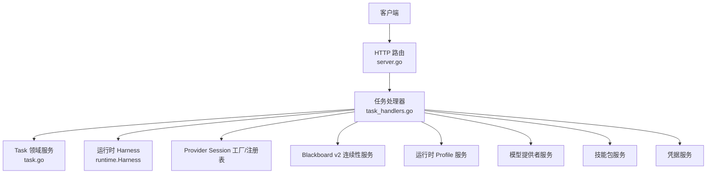
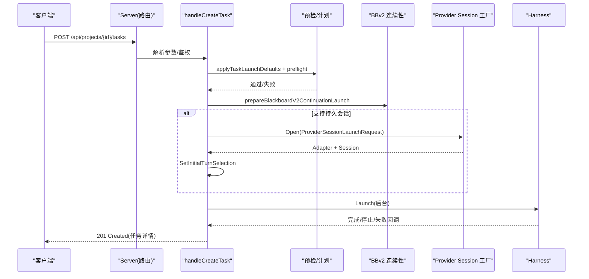
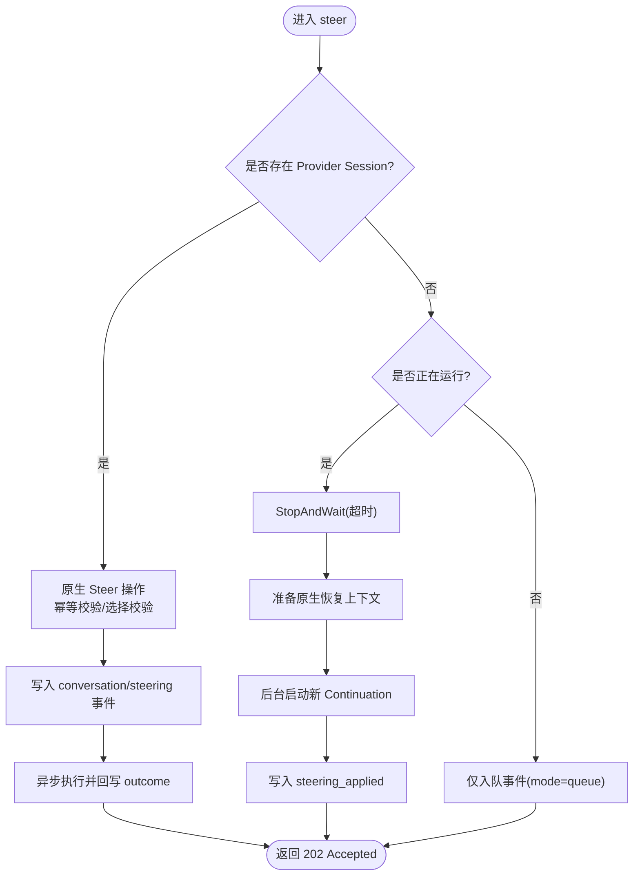
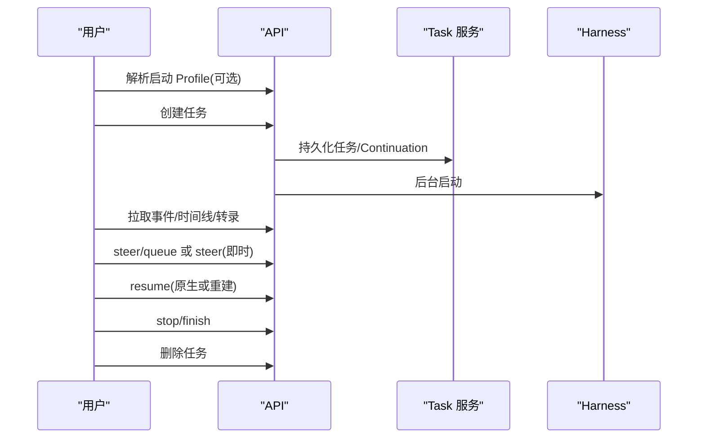
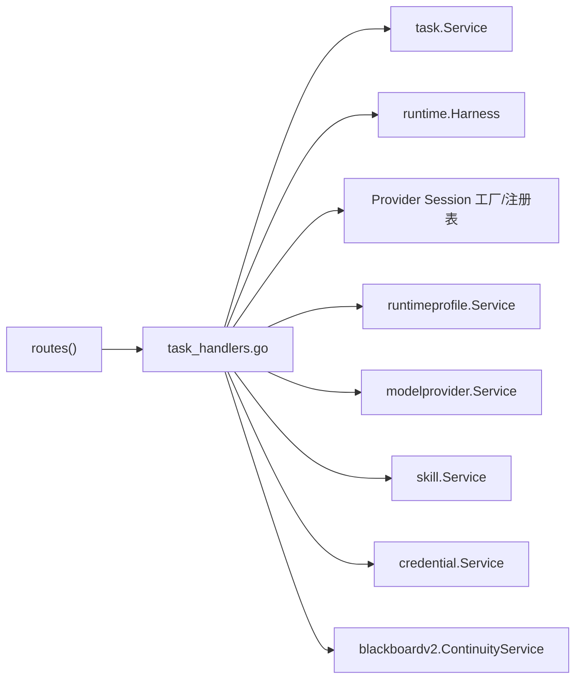

# 任务编排 API

<cite>
**本文引用的文件**   
- [internal/daemon/server.go](file://internal/daemon/server.go)
- [internal/daemon/task_handlers.go](file://internal/daemon/task_handlers.go)
- [internal/daemon/launch_handlers.go](file://internal/daemon/launch_handlers.go)
- [internal/task/task.go](file://internal/task/task.go)
</cite>

## 目录
1. [简介](#简介)
2. [项目结构](#项目结构)
3. [核心组件](#核心组件)
4. [架构总览](#架构总览)
5. [详细组件分析](#详细组件分析)
6. [依赖关系分析](#依赖关系分析)
7. [性能与扩展性](#性能与扩展性)
8. [故障排查指南](#故障排查指南)
9. [结论](#结论)
10. [附录：API 参考](#附录api-参考)

## 简介
本文件面向“任务编排”的 HTTP API，覆盖任务的创建、列表、获取、删除、停止、完成、恢复、Steer 指令队列与即时中断、权限响应、运行时选择（模型/推理强度）、进度监控（事件/时间线/转录）等。同时说明鉴权策略、MCP 会话管理要点以及错误处理策略，帮助使用者构建完整的任务编排工作流。

## 项目结构
- 控制平面由 Daemon HTTP 服务提供路由与鉴权，任务编排逻辑集中在任务处理器中。
- 领域层 Task Service 负责持久化任务、事件、Continuation 及运行时配置版本。
- 启动流程涉及预检、计划构建、适配器装配、沙箱/宿主执行与 Provider Session 管理。

图表来源
- [internal/daemon/server.go:587-643](file://internal/daemon/server.go#L587-L643)
- [internal/daemon/task_handlers.go:73-167](file://internal/daemon/task_handlers.go#L73-L167)
- [internal/task/task.go:276-313](file://internal/task/task.go#L276-L313)

章节来源
- [internal/daemon/server.go:587-643](file://internal/daemon/server.go#L587-L643)
- [internal/daemon/task_handlers.go:73-167](file://internal/daemon/task_handlers.go#L73-L167)
- [internal/task/task.go:276-313](file://internal/task/task.go#L276-L313)

## 核心组件
- HTTP 路由与鉴权
  - 统一入口 ServeHTTP 实现 Origin 校验、静态资源放行、Bearer Token 或查询参数 token 鉴权；对 Blackboard v2 传输与 MCP 路径支持 Project Interface Grant。
- 任务生命周期控制器
  - 创建、列表、获取、删除、停止、完成、恢复、Steer（队列/即时）、权限响应。
- 任务领域服务
  - 任务/Continuation 状态机、事件追加、运行时配置版本记录、未消费 Steer 指令计算。
- 启动计划与适配器
  - 构建 Launch Plan，装配沙箱/命令适配器，封装 Pi/Codex 会话发现与日志尾读。
- 运行时与 Provider Session
  - Harness 管理进程/容器生命周期；Provider Session 工厂用于持久会话、原生 Steer/Resume。

章节来源
- [internal/daemon/server.go:383-461](file://internal/daemon/server.go#L383-L461)
- [internal/daemon/task_handlers.go:1120-1191](file://internal/daemon/task_handlers.go#L1120-L1191)
- [internal/task/task.go:315-374](file://internal/task/task.go#L315-L374)
- [internal/daemon/task_handlers.go:506-988](file://internal/daemon/task_handlers.go#L506-L988)

## 架构总览
下图展示一次“创建并启动任务”的关键调用链，包括预检、计划构建、Continuation 准备、持久会话绑定与后台启动。

图表来源
- [internal/daemon/task_handlers.go:73-167](file://internal/daemon/task_handlers.go#L73-L167)
- [internal/daemon/task_handlers.go:196-285](file://internal/daemon/task_handlers.go#L196-L285)
- [internal/daemon/task_handlers.go:311-397](file://internal/daemon/task_handlers.go#L311-L397)

## 详细组件分析

### 任务生命周期端点
- 创建任务
  - 路径: POST /api/projects/{id}/tasks
  - 行为: 预检、默认值填充、构建 Launch Plan、可选持久会话绑定、后台启动，返回 201 任务详情。
  - 关键输入: goal, runtime_profile_id, model_override, reasoning_effort, runner, run_controls, extras。
  - 关键输出: 任务详情（含 RuntimeControls）。
- 列出任务
  - 路径: GET /api/projects/{id}/tasks
  - 行为: 按项目列出任务，附加当前 Runtime Activity。
- 获取任务
  - 路径: GET /api/projects/{id}/tasks/{task_id}
  - 行为: 返回任务详情，包含 Active/Latest Continuation、RuntimeControls、RuntimeActivity。
- 删除任务
  - 路径: DELETE /api/projects/{id}/tasks/{task_id}
  - 行为: 仅允许非活跃任务软删除，返回 204。
- 停止任务
  - 路径: POST /api/projects/{id}/tasks/{task_id}/stop
  - 行为: 尝试优雅关闭 Provider Session，等待 Harness 退出，落盘 stopped 状态。
- 完成任务
  - 路径: POST /api/projects/{id}/tasks/{task_id}/finish
  - 行为: 要求 Runtime 存活且空闲；标记 Finish 意图、关闭会话/进程、等待退出、更新 Continuation 为 completed 并校验重算标记，最后将 Task 置为 completed。
- 恢复任务
  - 路径: POST /api/projects/{id}/tasks/{task_id}/resume
  - 行为: 优先原生 Resume（若可用），否则基于未消费 Steer 与中断检查点重建上下文，返回 202 接受。

章节来源
- [internal/daemon/task_handlers.go:73-167](file://internal/daemon/task_handlers.go#L73-L167)
- [internal/daemon/task_handlers.go:1120-1191](file://internal/daemon/task_handlers.go#L1120-L1191)
- [internal/daemon/task_handlers.go:1469-1551](file://internal/daemon/task_handlers.go#L1469-L1551)
- [internal/daemon/task_handlers.go:1580-1714](file://internal/daemon/task_handlers.go#L1580-L1714)
- [internal/daemon/task_handlers.go:1816-1912](file://internal/daemon/task_handlers.go#L1816-L1912)

### 启动参数与运行时选择
- 启动参数
  - 支持指定 runner(sandbox/host)、run_controls(host_activated/sandbox_network/notes/extras)。
  - 支持 launch_model_override 与 reasoning_effort 覆盖。
- 运行时选择（Turn Selection）
  - 可在 resume/steer/queue 时选择 runtime_profile_id 或 model_provider_id+model+reasoning_effort。
  - 系统会记录 RuntimeConfigVersion，并在后续选择合并与排序（最近对话/配置版本时间戳比较）。
- 解析启动 Profile
  - 路径: POST /api/runtime-profiles/resolve-launch
  - 作用: 根据 provider/model_provider_id/model_override 解析最终 Profile，便于前端预览。

章节来源
- [internal/daemon/task_handlers.go:73-167](file://internal/daemon/task_handlers.go#L73-L167)
- [internal/daemon/task_handlers.go:2770-2816](file://internal/daemon/task_handlers.go#L2770-L2816)
- [internal/daemon/task_handlers.go:2921-3014](file://internal/daemon/task_handlers.go#L2921-L3014)
- [internal/daemon/launch_handlers.go:12-54](file://internal/daemon/launch_handlers.go#L12-L54)

### 进度监控：事件、时间线与转录
- 事件
  - 路径: GET /api/projects/{id}/tasks/{task_id}/events
  - 内容: 结构化事件序列（status/lifecycle/steering/conversation/runtime_output 等）。
- 时间线
  - 路径: GET /api/projects/{id}/tasks/{task_id}/timeline
  - 内容: 基于事件聚合的时间线条目。
- 转录
  - 路径: GET /api/projects/{id}/tasks/{task_id}/transcript
  - 内容: 面向人类阅读的转录条目（保留关键信息）。

章节来源
- [internal/daemon/task_handlers.go:1400-1467](file://internal/daemon/task_handlers.go#L1400-L1467)

### Steer 指令队列与即时中断
- 队列式 Steer
  - 路径: POST /api/projects/{id}/tasks/{task_id}/steer/queue
  - 行为: 写入一条 steering_requested 事件（mode=queue），可选择附带运行时选择；下次 resume 或下一轮 turn 消费。
- 即时中断式 Steer
  - 路径: POST /api/projects/{id}/tasks/{task_id}/steer
  - 行为: 若存在 Provider Session，走原生 Steer（幂等键/消息/选择校验）；否则尝试中断当前运行、原生恢复并重启，返回 202。
- 原生 Steer 状态
  - 通过任务详情的 RuntimeControls 暴露 native_steer_available/mode/state/request_id 等字段。

图表来源
- [internal/daemon/task_handlers.go:2097-2174](file://internal/daemon/task_handlers.go#L2097-L2174)
- [internal/daemon/task_handlers.go:2176-2324](file://internal/daemon/task_handlers.go#L2176-L2324)
- [internal/daemon/task_handlers.go:2326-2510](file://internal/daemon/task_handlers.go#L2326-L2510)

章节来源
- [internal/daemon/task_handlers.go:2097-2174](file://internal/daemon/task_handlers.go#L2097-L2174)
- [internal/daemon/task_handlers.go:2176-2324](file://internal/daemon/task_handlers.go#L2176-L2324)
- [internal/daemon/task_handlers.go:2326-2510](file://internal/daemon/task_handlers.go#L2326-L2510)

### 权限控制与 Provider 权限响应
- 鉴权
  - 全局鉴权: Authorization: Bearer <token> 或 ?token=<token>。
  - 特殊通道: Blackboard v2 HTTP 与 MCP 可接受 Project Interface Grant。
  - Origin 防护: 拒绝非回环/非 host.docker.internal 的跨站请求。
- Provider 权限响应
  - 路径: POST /api/projects/{id}/tasks/{task_id}/permissions/{permission_id}/respond
  - 行为: 在已绑定的 Provider Session 上提交 allow/deny 决策，幂等键去重，事件驱动回写 applied/failed。

章节来源
- [internal/daemon/server.go:383-461](file://internal/daemon/server.go#L383-L461)
- [internal/daemon/task_handlers.go:2517-2675](file://internal/daemon/task_handlers.go#L2517-L2675)

### MCP 会话管理与黑盒边界
- MCP 入口
  - 路径: /mcp
  - 鉴权: 除 Bearer/token 外，也接受 Project Interface Grant。
- 会话能力
  - 原生 Steer/Resume/Permission Response 均通过 Provider Session 抽象，屏蔽底层差异。
- 安全边界
  - 禁止将敏感凭证写入持久化的 Task Runtime Configuration；仅固定字段被持久化。
  - 主机路径在 Host Runner 下以相对形式避免泄露 Task ID。

章节来源
- [internal/daemon/server.go:453-461](file://internal/daemon/server.go#L453-L461)
- [internal/daemon/task_handlers.go:399-421](file://internal/daemon/task_handlers.go#L399-L421)
- [internal/daemon/task_handlers.go:1002-1015](file://internal/daemon/task_handlers.go#L1002-L1015)

### 完整编排工作流示例
- 典型流程
  1) 解析启动 Profile（可选）
  2) 创建任务（携带目标、Profile、Runner、RunControls）
  3) 监控事件/时间线/转录
  4) 需要调整运行时选择时：使用 steer/queue 或 resume
  5) 需要终止时：先 stop，必要时 finish
  6) 清理：删除已完成/失败的任务

[此图为概念流程图，不直接映射具体源码文件]

## 依赖关系分析
- 路由到处理器
  - server.routes 注册所有任务相关端点，统一经 ServeHTTP 鉴权后分发。
- 处理器到领域服务
  - task_handlers 调用 task.Service 进行 CRUD、事件追加、Continuation 状态变更、运行时配置版本记录。
- 处理器到运行时
  - 通过 runtime.Harness 启动/停止/等待；通过 Provider Session 工厂/注册表管理持久会话。
- 处理器到外部服务
  - 读取/解析 runtime profile、model provider、skills、credentials；必要时访问 blackboardv2.ContinuityService。

图表来源
- [internal/daemon/server.go:587-643](file://internal/daemon/server.go#L587-L643)
- [internal/daemon/task_handlers.go:73-167](file://internal/daemon/task_handlers.go#L73-L167)
- [internal/task/task.go:276-313](file://internal/task/task.go#L276-L313)

章节来源
- [internal/daemon/server.go:587-643](file://internal/daemon/server.go#L587-L643)
- [internal/daemon/task_handlers.go:73-167](file://internal/daemon/task_handlers.go#L73-L167)
- [internal/task/task.go:276-313](file://internal/task/task.go#L276-L313)

## 性能与扩展性
- 并发控制
  - 同一任务的控制操作串行化（acquire/release），避免竞态。
- 事件顺序
  - 事件 seq 在事务内递增，保证时序一致。
- 启动优化
  - 预计算全局模型提供者快照，避免在事务中重复查询。
  - 固定字段最小化持久化，减少 I/O。
- 可扩展点
  - Provider Session 工厂模式支持不同后端桥接；插件/扩展机制加载运行时能力。

章节来源
- [internal/daemon/task_handlers.go:1784-1814](file://internal/daemon/task_handlers.go#L1784-L1814)
- [internal/task/task.go:483-551](file://internal/task/task.go#L483-L551)
- [internal/daemon/task_handlers.go:594-605](file://internal/daemon/task_handlers.go#L594-L605)

## 故障排查指南
- 常见错误码与语义
  - 400: 参数无效/预检失败/推理强度非法
  - 401/403: 鉴权失败/Origin 拒绝
  - 404: 项目/任务不存在
  - 409: 任务处于活跃/冲突（如重复控制、权限决策冲突、Steer 幂等冲突）
  - 500: 内部错误（数据库/存储/服务不可用）
- 诊断建议
  - 查看事件流定位阶段（lifecycle/steering/conversation/runtime_output）。
  - 关注 RuntimeControls 中的 available/reason 字段，判断能力限制。
  - 对于 finish 失败，检查是否满足 live+idle 条件，以及 Continuation 重算标记。
  - 原生 Steer 失败时，关注 error_code（timeout/session_closed/control_conflict/provider_rejected 等）。

章节来源
- [internal/daemon/task_handlers.go:1580-1714](file://internal/daemon/task_handlers.go#L1580-L1714)
- [internal/daemon/task_handlers.go:2326-2510](file://internal/daemon/task_handlers.go#L2326-L2510)
- [internal/daemon/task_handlers.go:2517-2675](file://internal/daemon/task_handlers.go#L2517-L2675)

## 结论
任务编排 API 围绕“可控、可观测、可恢复”的目标设计：通过严格的鉴权与 Origin 保护确保安全性；通过事件/时间线/转录提供全链路可观测性；通过 Steer/Resume/Finish 等接口实现灵活的生命周期控制；借助 Provider Session 与 Continuity 能力达成高可用的原生恢复与重算保障。

## 附录：API 参考
- 鉴权
  - 方式: Authorization: Bearer <token> 或 ?token=<token>
  - 特殊: Blackboard v2 HTTP/MCP 接受 Project Interface Grant
  - 来源: [internal/daemon/server.go:431-461](file://internal/daemon/server.go#L431-L461)
- 任务
  - POST /api/projects/{id}/tasks — 创建并启动
  - GET /api/projects/{id}/tasks — 列表
  - GET /api/projects/{id}/tasks/{task_id} — 详情
  - DELETE /api/projects/{id}/tasks/{task_id} — 删除
  - POST /api/projects/{id}/tasks/{task_id}/stop — 停止
  - POST /api/projects/{id}/tasks/{task_id}/finish — 完成
  - POST /api/projects/{id}/tasks/{task_id}/resume — 恢复
  - 来源: [internal/daemon/server.go:627-636](file://internal/daemon/server.go#L627-L636), [internal/daemon/task_handlers.go:73-167](file://internal/daemon/task_handlers.go#L73-L167), [internal/daemon/task_handlers.go:1120-1191](file://internal/daemon/task_handlers.go#L1120-L1191), [internal/daemon/task_handlers.go:1469-1551](file://internal/daemon/task_handlers.go#L1469-L1551), [internal/daemon/task_handlers.go:1580-1714](file://internal/daemon/task_handlers.go#L1580-L1714), [internal/daemon/task_handlers.go:1816-1912](file://internal/daemon/task_handlers.go#L1816-L1912)
- 监控
  - GET /api/projects/{id}/tasks/{task_id}/events — 事件
  - GET /api/projects/{id}/tasks/{task_id}/timeline — 时间线
  - GET /api/projects/{id}/tasks/{task_id}/transcript — 转录
  - 来源: [internal/daemon/server.go:631-633](file://internal/daemon/server.go#L631-L633), [internal/daemon/task_handlers.go:1400-1467](file://internal/daemon/task_handlers.go#L1400-L1467)
- Steer
  - POST /api/projects/{id}/tasks/{task_id}/steer/queue — 入队
  - POST /api/projects/{id}/tasks/{task_id}/steer — 即时中断
  - 来源: [internal/daemon/server.go:637-638](file://internal/daemon/server.go#L637-L638), [internal/daemon/task_handlers.go:2097-2174](file://internal/daemon/task_handlers.go#L2097-L2174), [internal/daemon/task_handlers.go:2176-2324](file://internal/daemon/task_handlers.go#L2176-L2324)
- 权限响应
  - POST /api/projects/{id}/tasks/{task_id}/permissions/{permission_id}/respond
  - 来源: [internal/daemon/server.go:639](file://internal/daemon/server.go#L639), [internal/daemon/task_handlers.go:2517-2675](file://internal/daemon/task_handlers.go#L2517-L2675)
- 运行时选择
  - POST /api/runtime-profiles/resolve-launch — 解析启动 Profile
  - 来源: [internal/daemon/server.go:594](file://internal/daemon/server.go#L594), [internal/daemon/launch_handlers.go:12-54](file://internal/daemon/launch_handlers.go#L12-L54)
- MCP
  - /mcp — MCP Server 入口
  - 来源: [internal/daemon/server.go:641](file://internal/daemon/server.go#L641)