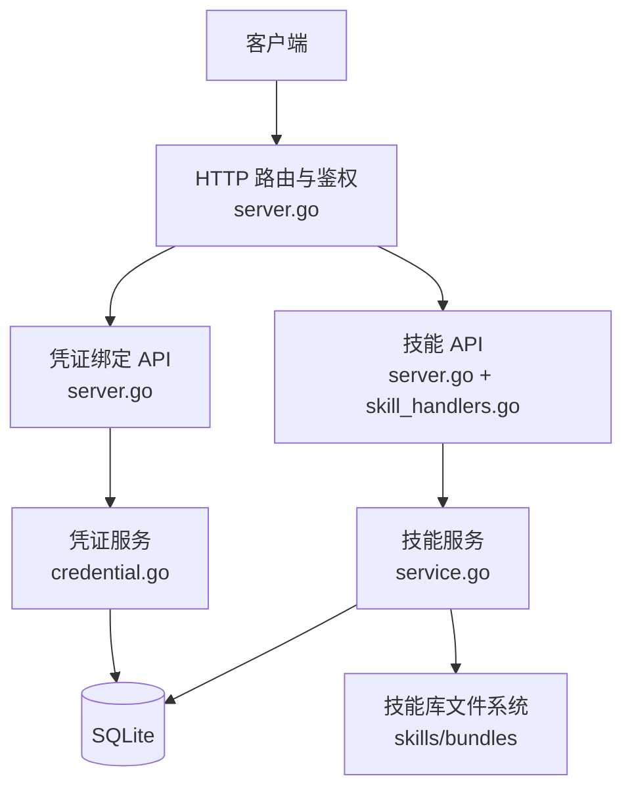
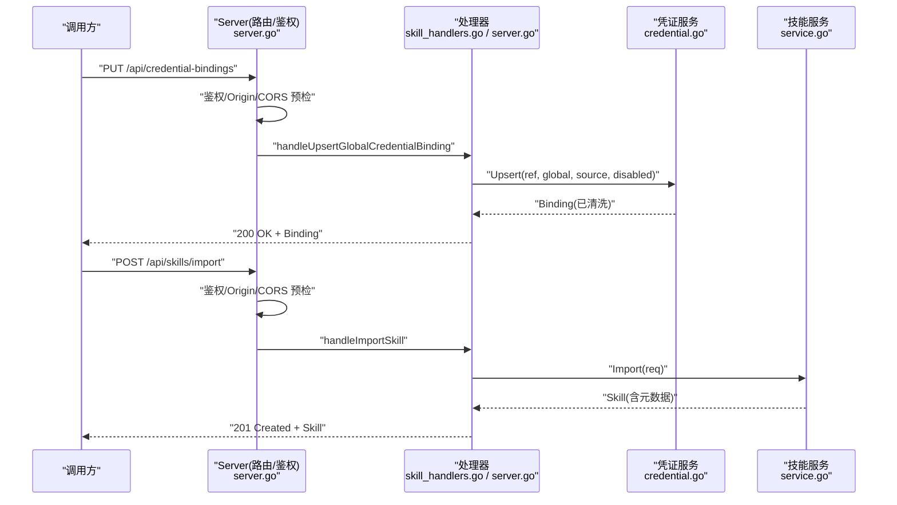
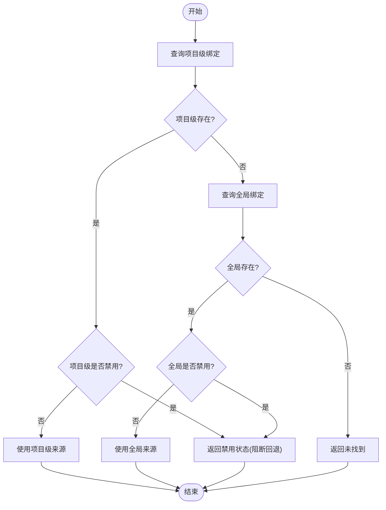
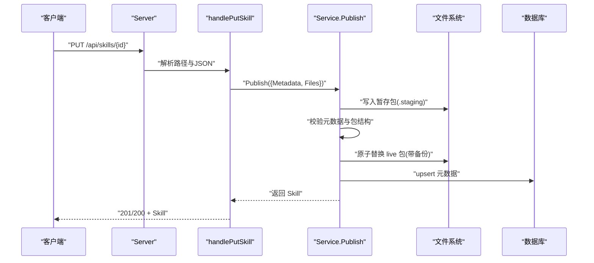
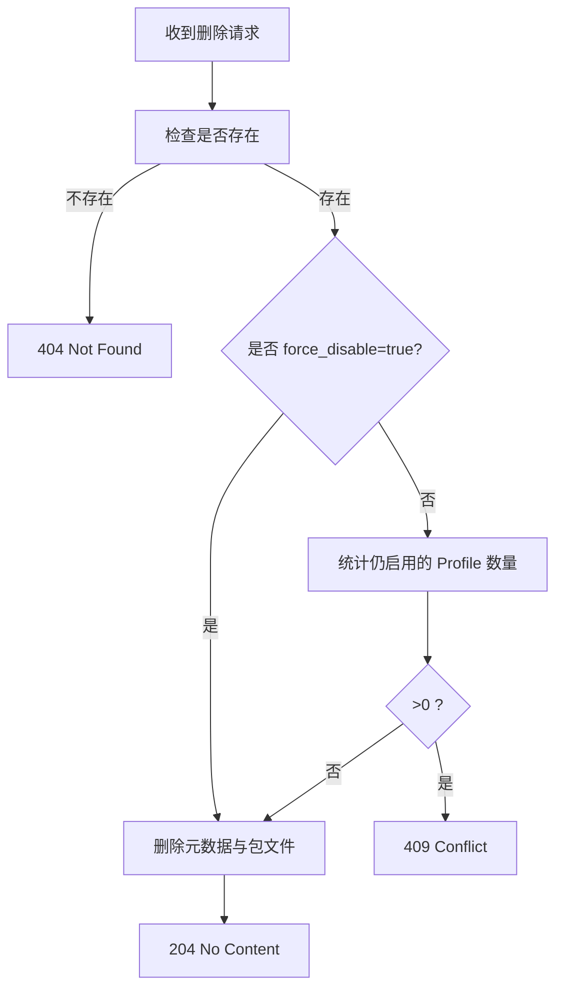
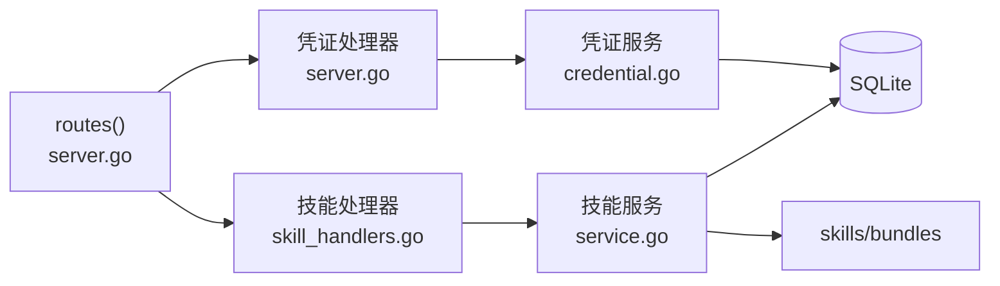

# 凭证与技能 API

<cite>
**本文引用的文件**   
- [server.go](file://internal/daemon/server.go)
- [skill_handlers.go](file://internal/daemon/skill_handlers.go)
- [credential.go](file://internal/credential/credential.go)
- [service.go](file://internal/skill/service.go)
</cite>

## 目录
1. [简介](#简介)
2. [项目结构](#项目结构)
3. [核心组件](#核心组件)
4. [架构总览](#架构总览)
5. [详细组件分析](#详细组件分析)
6. [依赖关系分析](#依赖关系分析)
7. [性能与安全考量](#性能与安全考量)
8. [故障排查指南](#故障排查指南)
9. [结论](#结论)
10. [附录：API 参考](#附录api-参考)

## 简介
本文件面向使用 CyberPenda 的运维与开发者，聚焦“凭证绑定”和“技能管理”两大能力，提供完整的 HTTP API 文档与实践指南。内容覆盖：
- 全局与项目级凭证绑定的增删改查、禁用控制与解析优先级
- 凭据来源类型（环境变量、文件、命令、字面量）及其安全约束
- 技能包的导入、发布（更新）、删除、文件读取、按运行配置启用/禁用
- 预检检查与项目仪表板等辅助接口
- 鉴权策略、CORS 预检、DNS 重绑定防护等安全要点

## 项目结构
与本文相关的后端实现位于 daemon 服务层与领域服务中：
- Daemon 路由注册与中间件：统一鉴权、CORS 预检、Origin 校验
- 凭证服务：绑定存储、解析、清洗输出
- 技能服务：包发布、导入、元数据与文件管理、Profile 启用/禁用

图示来源
- [server.go:587-643](file://internal/daemon/server.go#L587-L643)
- [skill_handlers.go:31-165](file://internal/daemon/skill_handlers.go#L31-L165)
- [credential.go:115-183](file://internal/credential/credential.go#L115-L183)
- [service.go:40-55](file://internal/skill/service.go#L40-L55)

章节来源
- [server.go:587-643](file://internal/daemon/server.go#L587-L643)

## 核心组件
- 凭证服务
  - 作用：维护“引用→来源”的绑定，支持全局与项目两级作用域；提供解析、列表、删除、清洗输出等能力。
  - 关键点：解析顺序为“项目绑定优先，若未设置或启用则回退到全局；项目显式禁用会阻断回退”。
- 技能服务
  - 作用：管理技能包元数据与文件，支持从外部源导入、本地发布（创建/更新）、删除、按 Profile 启用/禁用。
  - 关键点：导入需配置 Importer；发布采用“暂存→校验→原子替换”流程；删除默认保护（被任何 Profile 启用时拒绝）。

章节来源
- [credential.go:115-183](file://internal/credential/credential.go#L115-L183)
- [service.go:57-142](file://internal/skill/service.go#L57-L142)

## 架构总览
凭证与技能的 HTTP 入口集中在 daemon 路由表，所有写操作受统一鉴权中间件保护；部分只读静态资源与健康端点可公开访问。

图示来源
- [server.go:587-643](file://internal/daemon/server.go#L587-L643)
- [server.go:979-1008](file://internal/daemon/server.go#L979-L1008)
- [skill_handlers.go:111-137](file://internal/daemon/skill_handlers.go#L111-L137)
- [service.go:115-142](file://internal/skill/service.go#L115-L142)

## 详细组件分析

### 凭证绑定 API（全局与项目级）
- 作用域
  - 全局：对所有项目生效，除非被项目级覆盖或禁用。
  - 项目级：仅对指定项目生效，可覆盖全局；也可显式禁用以阻断回退。
- 来源类型
  - env：值为目标环境变量名
  - file：值为包含密钥的文件路径
  - command：值为命令（默认禁用，需显式开启）
  - literal：值为本地明文密钥（响应中会被脱敏）
- 解析顺序
  - 先查找项目级绑定；若存在且未禁用，则使用该来源；若项目级显式禁用，则阻断回退。
  - 否则回退至全局绑定；若全局存在且未禁用，则使用该来源；若全局禁用，则视为未找到。
  - 均不存在时返回“未找到”。

#### 接口清单
- 新增/更新全局绑定
  - 方法：PUT
  - 路径：/api/credential-bindings
  - 请求体字段：
    - credential_ref: string（必填）
    - source.kind: string（必填，见上）
    - source.value: string（必填，含义取决于 kind）
    - source.destination_env: string（可选，目标环境变量名）
    - disabled: boolean（可选，默认 false）
  - 成功响应：200，返回已清洗的 Binding
  - 错误码：400（参数校验失败），404（当涉及项目 ID 不存在时）
- 列出全局绑定
  - 方法：GET
  - 路径：/api/credential-bindings
  - 成功响应：200，返回 []Binding（已清洗）
- 新增/更新项目级绑定
  - 方法：PUT
  - 路径：/api/projects/{id}/credential-bindings
  - 路径参数：id（项目 ID）
  - 请求体字段：同上
  - 成功响应：200，返回已清洗的 Binding
  - 错误码：400（参数校验失败），404（项目不存在）
- 列出项目级绑定
  - 方法：GET
  - 路径：/api/projects/{id}/credential-bindings
  - 成功响应：200，返回 []Binding（已清洗）
- 删除绑定
  - 方法：DELETE
  - 路径：/api/credential-bindings/{binding_id}
  - 成功响应：204 No Content
  - 错误码：404（绑定不存在）

注意
- 所有写入均需通过鉴权（非 loopback 启动时必须提供 AuthToken）。
- 响应中的 literal 值会被脱敏为占位符，避免泄露。

章节来源
- [server.go:979-1008](file://internal/daemon/server.go#L979-L1008)
- [server.go:1010-1080](file://internal/daemon/server.go#L1010-L1080)
- [credential.go:125-183](file://internal/credential/credential.go#L125-L183)
- [credential.go:211-245](file://internal/credential/credential.go#L211-L245)
- [credential.go:346-364](file://internal/credential/credential.go#L346-L364)

#### 解析流程图

图示来源
- [credential.go:211-245](file://internal/credential/credential.go#L211-L245)

### 技能管理 API（导入、发布、删除、文件、Profile 启用/禁用）
- 能力概览
  - 导入：从外部源拉取并落盘，生成元数据与文件集合
  - 发布（创建/更新）：提交结构化包（元数据+文件），经校验后原子替换
  - 删除：默认保护（若被任一 Profile 启用则拒绝，可通过强制参数跳过）
  - 文件读取：返回技能包内文件映射（内置技能过滤敏感文件）
  - Profile 启用/禁用：基于 opt-out 表控制某 Profile 是否包含该技能
- 鉴权与限制
  - 导入需要配置 Importer，否则拒绝
  - 发布前进行元数据与包结构校验
  - 删除前检查是否仍被任何 Profile 启用

#### 接口清单
- 列出技能
  - 方法：GET
  - 路径：/api/skills
  - 查询参数：runtime_profile_id（可选）
  - 行为：若传入 profile_id，返回结果附带 enabled 标记（根据 opt-out 计算）
  - 成功响应：200，{ skills: [] }
- 获取单个技能详情
  - 方法：GET
  - 路径：/api/skills/{skill_id}
  - 成功响应：200，返回元数据与公开文件映射（内置技能过滤 UPSTREAM.md）
- 发布（创建/更新）技能
  - 方法：PUT
  - 路径：/api/skills/{skill_id}
  - 请求体字段：
    - name: string
    - description: string（可选）
    - source_provenance: object（可选）
    - files: map[string]string（必填）
  - 成功响应：201（新建）/200（更新），返回 Skill
- 导入技能
  - 方法：POST
  - 路径：/api/skills/import
  - 请求体字段：
    - source_kind: string（必填）
    - package: string（可选）
    - ref: string（可选）
    - source_url: string（可选）
  - 成功响应：201，返回 Skill
- 删除技能
  - 方法：DELETE
  - 路径：/api/skills/{skill_id}
  - 查询参数：force_disable（可选，true/false）
  - 成功响应：204 No Content
  - 错误码：409（被 Profile 启用且未强制）
- 设置/取消 Profile 禁用（opt-out）
  - 方法：PUT
  - 路径：/api/skills/{skill_id}/profiles/{profile_id}/opt-out
  - 行为：将该技能从指定 Profile 中排除
  - 方法：DELETE
  - 路径：/api/skills/{skill_id}/profiles/{profile_id}/opt-out
  - 行为：恢复该技能在指定 Profile 中的启用状态
  - 成功响应：204 No Content

章节来源
- [server.go:613-619](file://internal/daemon/server.go#L613-L619)
- [skill_handlers.go:31-165](file://internal/daemon/skill_handlers.go#L31-L165)
- [service.go:144-176](file://internal/skill/service.go#L144-L176)
- [service.go:178-216](file://internal/skill/service.go#L178-L216)
- [service.go:218-250](file://internal/skill/service.go#L218-L250)
- [service.go:252-282](file://internal/skill/service.go#L252-L282)
- [service.go:301-356](file://internal/skill/service.go#L301-L356)

#### 发布流程时序

图示来源
- [skill_handlers.go:78-109](file://internal/daemon/skill_handlers.go#L78-L109)
- [service.go:57-113](file://internal/skill/service.go#L57-L113)

#### 删除保护流程

图示来源
- [service.go:301-356](file://internal/skill/service.go#L301-L356)

### 辅助功能 API（预检与仪表板）
- 预检检查
  - 方法：POST
  - 路径：/api/projects/{id}/preflight
  - 用途：在任务启动前校验运行配置、模型、凭据解析、自定义参数冲突等
  - 成功响应：200，包含逐项检查结果（通过/失败）
- 项目仪表板
  - 方法：GET
  - 路径：/api/projects/{id}/dashboard
  - 用途：汇总项目范围、任务计数、知识图谱快照统计等
  - 成功响应：200，包含 scope 与 counts 摘要

章节来源
- [server.go:1082-1129](file://internal/daemon/server.go#L1082-L1129)
- [server.go:1131-1208](file://internal/daemon/server.go#L1131-L1208)

## 依赖关系分析
- 路由与中间件
  - 统一入口：ServeHTTP 负责 Origin 校验、鉴权、CORS 预检放行、静态资源放行
  - 路由注册：集中定义于 routes()，涵盖凭证、技能、运行时配置、任务、Blackboard v2、MCP 等
- 领域服务
  - 凭证服务：SQLite 持久化，提供 Upsert/List/Resolve/Delete/Sanitize
  - 技能服务：SQLite 持久化元数据 + 文件系统存储包文件，提供 Publish/Import/Get/List/Files/SetOptOut/EnabledSkills/Delete

图示来源
- [server.go:587-643](file://internal/daemon/server.go#L587-L643)
- [server.go:979-1080](file://internal/daemon/server.go#L979-L1080)
- [skill_handlers.go:31-165](file://internal/daemon/skill_handlers.go#L31-L165)
- [credential.go:115-183](file://internal/credential/credential.go#L115-L183)
- [service.go:40-55](file://internal/skill/service.go#L40-L55)

章节来源
- [server.go:383-411](file://internal/daemon/server.go#L383-L411)
- [server.go:587-643](file://internal/daemon/server.go#L587-L643)

## 性能与安全考量
- 鉴权与访问控制
  - 非 loopback 监听必须设置 AuthToken，否则拒绝启动
  - 支持 Authorization: Bearer 与 ?token= 两种认证方式
  - 仅健康、CORS 预检与 SPA 静态资源可免鉴权访问
- DNS 重绑定与跨站防护
  - 严格校验 Origin，仅允许 loopback、host.docker.internal 或与监听地址同主机
  - 非 GET 的静态资源请求仍需鉴权
- 凭据安全
  - 命令来源默认禁用，需显式开启
  - 环境变量名与 destination_env 禁止形似密钥的值
  - 响应中对 literal 值进行脱敏
- 技能安全
  - 发布前校验包结构与相对路径，禁止符号链接
  - 内置技能对外暴露时过滤 UPSTREAM.md 等敏感文件
  - 删除默认保护，防止误删仍在使用的技能

章节来源
- [server.go:431-461](file://internal/daemon/server.go#L431-L461)
- [server.go:518-534](file://internal/daemon/server.go#L518-L534)
- [server.go:467-501](file://internal/daemon/server.go#L467-L501)
- [credential.go:309-344](file://internal/credential/credential.go#L309-L344)
- [skill_handlers.go:179-198](file://internal/daemon/skill_handlers.go#L179-L198)
- [service.go:178-216](file://internal/skill/service.go#L178-L216)

## 故障排查指南
- 常见错误码
  - 400：请求体 JSON 无效、参数校验失败（如缺少 credential_ref、source.kind 不支持、env 名非法等）
  - 404：资源不存在（项目、绑定、技能、Profile）
  - 409：技能删除冲突（仍被某个 Profile 启用）
  - 401/403：鉴权失败或 Origin 不被允许
- 定位建议
  - 确认路由是否正确匹配（路径参数与查询参数）
  - 检查 Source 校验规则（kind/value/destination_env）
  - 核对 resolve 顺序是否符合预期（项目级禁用会阻断回退）
  - 查看技能导入是否配置了 Importer
  - 关注日志中关于自定义参数冲突、预检失败的提示

章节来源
- [server.go:1222-1224](file://internal/daemon/server.go#L1222-L1224)
- [skill_handlers.go:200-211](file://internal/daemon/skill_handlers.go#L200-L211)
- [credential.go:105-113](file://internal/credential/credential.go#L105-L113)

## 结论
凭证与技能 API 围绕“最小权限、可审计、可回滚”的原则设计：
- 凭证绑定提供清晰的作用域与解析顺序，配合严格的来源校验与脱敏输出，保障密钥安全
- 技能管理提供导入/发布/删除/文件读取/Profile 启用控制的完整生命周期，并通过校验与原子替换保证一致性
- 统一的鉴权与 Origin 校验为系统提供基础安全边界

## 附录：API 参考

### 凭证绑定
- PUT /api/credential-bindings
  - 描述：新增/更新全局绑定
  - 请求体：credential_ref, source(kind/value/destination_env), disabled
  - 响应：200 Binding（已清洗）
- GET /api/credential-bindings
  - 描述：列出全局绑定
  - 响应：200 { bindings: [] }
- PUT /api/projects/{id}/credential-bindings
  - 描述：新增/更新项目级绑定
  - 响应：200 Binding（已清洗）
- GET /api/projects/{id}/credential-bindings
  - 描述：列出项目级绑定
  - 响应：200 { bindings: [] }
- DELETE /api/credential-bindings/{binding_id}
  - 描述：删除绑定
  - 响应：204

### 技能管理
- GET /api/skills?runtime_profile_id={id}
  - 描述：列出技能（可选附带 enabled 标记）
  - 响应：200 { skills: [] }
- GET /api/skills/{skill_id}
  - 描述：获取技能详情与公开文件
  - 响应：200 Skill
- PUT /api/skills/{skill_id}
  - 描述：发布（创建/更新）技能
  - 请求体：name, description, source_provenance, files
  - 响应：201/200 Skill
- POST /api/skills/import
  - 描述：导入技能
  - 请求体：source_kind, package, ref, source_url
  - 响应：201 Skill
- DELETE /api/skills/{skill_id}?force_disable={bool}
  - 描述：删除技能
  - 响应：204
- PUT /api/skills/{skill_id}/profiles/{profile_id}/opt-out
  - 描述：将技能从指定 Profile 中禁用
  - 响应：204
- DELETE /api/skills/{skill_id}/profiles/{profile_id}/opt-out
  - 描述：恢复技能在指定 Profile 中的启用
  - 响应：204

### 辅助功能
- POST /api/projects/{id}/preflight
  - 描述：预检检查
  - 响应：200 检查结果
- GET /api/projects/{id}/dashboard
  - 描述：项目仪表板
  - 响应：200 摘要信息

章节来源
- [server.go:587-643](file://internal/daemon/server.go#L587-L643)
- [server.go:979-1080](file://internal/daemon/server.go#L979-L1080)
- [skill_handlers.go:31-165](file://internal/daemon/skill_handlers.go#L31-L165)
- [server.go:1082-1208](file://internal/daemon/server.go#L1082-L1208)