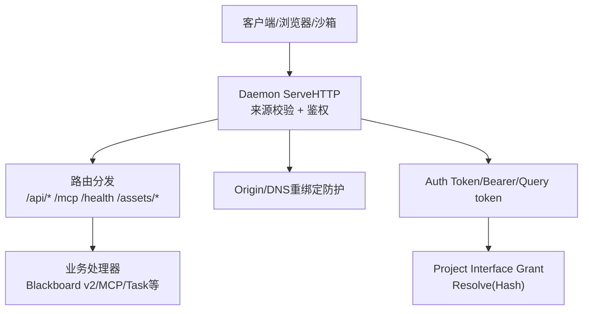
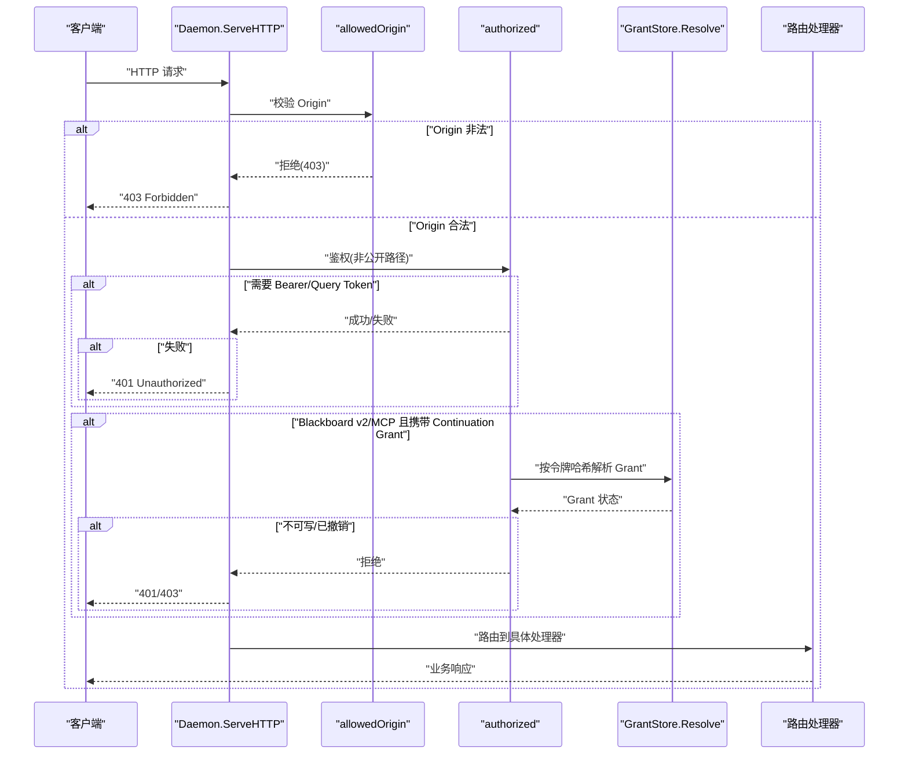
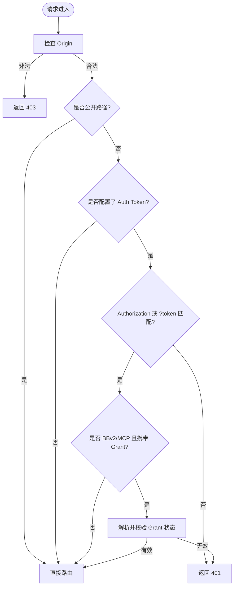
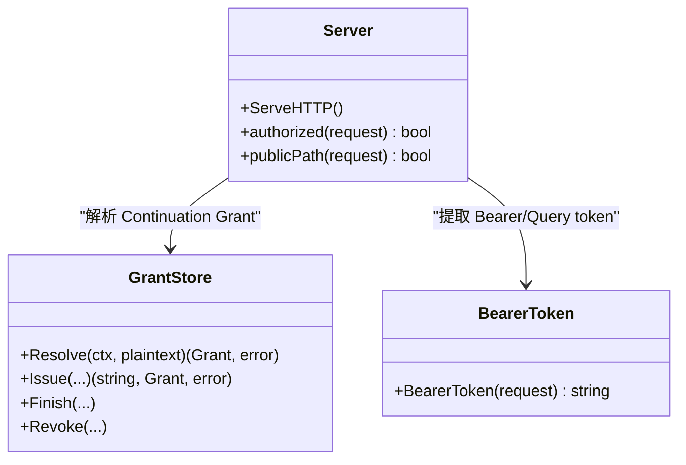
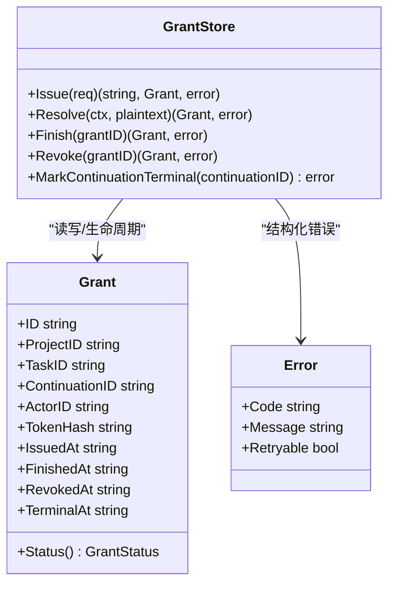
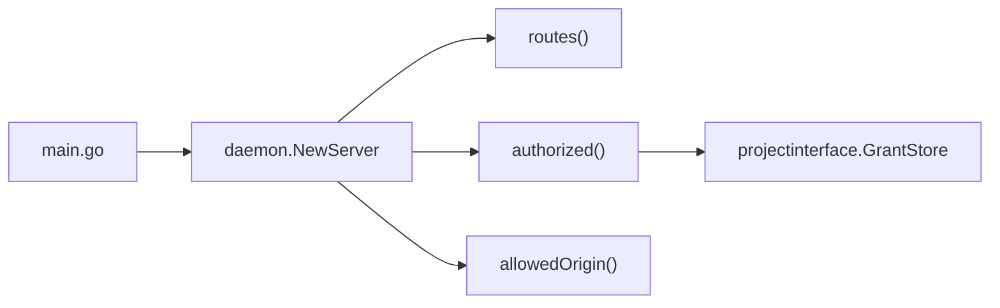

# 安全认证与授权

<cite>
**本文引用的文件**
- [internal/daemon/server.go](file://internal/daemon/server.go)
- [internal/daemon/auth_test.go](file://internal/daemon/auth_test.go)
- [internal/daemon/origin_guard_test.go](file://internal/daemon/origin_guard_test.go)
- [internal/daemon/logging.go](file://internal/daemon/logging.go)
- [cmd/pentestd/main.go](file://cmd/pentestd/main.go)
- [internal/projectinterface/bearer.go](file://internal/projectinterface/bearer.go)
- [internal/projectinterface/grant.go](file://internal/projectinterface/grant.go)
- [internal/projectinterface/errors.go](file://internal/projectinterface/errors.go)
</cite>

## 目录
1. [简介](#简介)
2. [项目结构](#项目结构)
3. [核心组件](#核心组件)
4. [架构总览](#架构总览)
5. [详细组件分析](#详细组件分析)
6. [依赖关系分析](#依赖关系分析)
7. [性能与安全特性](#性能与安全特性)
8. [故障排除指南](#故障排除指南)
9. [结论](#结论)
10. [附录：配置与环境变量](#附录配置与环境变量)

## 简介
本文件聚焦于 Daemon 服务的安全认证与授权机制，系统性梳理多层防护策略与权限模型，包括：
- Auth Token 认证（Bearer 与查询参数）
- CORS 预检与 Origin 校验、DNS 重绑定防护
- Project Interface Grant（Continuation 能力令牌）与细粒度权限控制
- 审计日志记录与常见威胁防护建议
- 安全集成最佳实践与排障方法

## 项目结构
Daemon 作为控制平面，提供 HTTP API 与 MCP 通道。安全相关的关键实现集中在以下位置：
- 请求入口与中间件：ServeHTTP、authorized、allowedOrigin、publicPath
- 路由注册：routes
- 项目接口授权：projectinterface.GrantStore、BearerToken
- 启动与配置：cmd/pentestd/main.go
- 日志与审计：logging.go

图示来源
- [internal/daemon/server.go:383-411](file://internal/daemon/server.go#L383-L411)
- [internal/daemon/server.go:587-643](file://internal/daemon/server.go#L587-L643)
- [internal/projectinterface/grant.go:284-302](file://internal/projectinterface/grant.go#L284-L302)

章节来源
- [internal/daemon/server.go:383-411](file://internal/daemon/server.go#L383-L411)
- [internal/daemon/server.go:587-643](file://internal/daemon/server.go#L587-L643)
- [cmd/pentestd/main.go:22-103](file://cmd/pentestd/main.go#L22-L103)

## 核心组件
- 请求入口与中间件
  - ServeHTTP：统一入口，先进行 Origin 校验，再执行鉴权，最后进入路由分发；附带状态记录与请求日志。
  - authorized：支持 Authorization: Bearer <token> 或 ?token= 两种形式；对 Blackboard v2 HTTP 与 MCP 路径额外接受 Continuation 的 Project Interface Grant。
  - allowedOrigin：拒绝非回环且非 host.docker.internal 的 Origin，防止 DNS 重绑定与跨站访问。
  - publicPath：健康检查、CORS 预检、SPA 静态资源免鉴权。
- 项目接口授权
  - projectinterface.BearerToken：从 Authorization 或查询参数提取 Continuation 令牌。
  - projectinterface.GrantStore：签发、解析、生命周期管理（open/finished/revoked/terminal），仅存储令牌哈希，使用常量时间比较避免时序侧信道。
- 启动与配置
  - cmd/pentestd/main.go：通过命令行和环境变量注入监听地址、数据库路径、沙箱镜像、插件目录以及 Auth Token。非回环绑定强制要求设置 Auth Token。

章节来源
- [internal/daemon/server.go:383-411](file://internal/daemon/server.go#L383-L411)
- [internal/daemon/server.go:431-461](file://internal/daemon/server.go#L431-L461)
- [internal/daemon/server.go:518-534](file://internal/daemon/server.go#L518-L534)
- [internal/daemon/server.go:467-501](file://internal/daemon/server.go#L467-L501)
- [internal/projectinterface/bearer.go:14-21](file://internal/projectinterface/bearer.go#L14-L21)
- [internal/projectinterface/grant.go:192-252](file://internal/projectinterface/grant.go#L192-L252)
- [internal/projectinterface/grant.go:284-302](file://internal/projectinterface/grant.go#L284-L302)
- [cmd/pentestd/main.go:22-103](file://cmd/pentestd/main.go#L22-L103)

## 架构总览
下图展示了从请求进入到鉴权与授权的完整流程，涵盖 Origin 校验、Auth Token 验证、Project Interface Grant 解析及路由分发。

图示来源
- [internal/daemon/server.go:383-411](file://internal/daemon/server.go#L383-L411)
- [internal/daemon/server.go:431-461](file://internal/daemon/server.go#L431-L461)
- [internal/projectinterface/grant.go:284-302](file://internal/projectinterface/grant.go#L284-L302)

## 详细组件分析

### 1) 多层安全防护策略
- Origin 校验与 DNS 重绑定防护
  - 允许无 Origin 的请求（CLI、沙箱、同域 GET）。
  - 允许回环 Origin（本地 UI）。
  - 允许 host.docker.internal（沙箱运行时网关）。
  - 拒绝所有其他 Origin，阻断恶意页面通过 DNS 重绑定发起跨站请求。
- CORS 保护
  - OPTIONS 预检请求视为公开路径，无需鉴权。
  - 静态资源 GET 免鉴权，但非 GET 请求仍需鉴权，避免利用静态路径绕过鉴权。
- 认证入口
  - 非公开路径必须满足以下之一：
    - Authorization: Bearer <daemon-token>
    - ?token=<daemon-token>（用于无法附加头的传输，如沙箱 MCP）
  - 对于 Blackboard v2 HTTP 与 MCP 路径，还支持 Continuation 的 Project Interface Grant（单独的能力令牌）。

图示来源
- [internal/daemon/server.go:518-534](file://internal/daemon/server.go#L518-L534)
- [internal/daemon/server.go:467-501](file://internal/daemon/server.go#L467-L501)
- [internal/daemon/server.go:431-461](file://internal/daemon/server.go#L431-L461)

章节来源
- [internal/daemon/server.go:518-534](file://internal/daemon/server.go#L518-L534)
- [internal/daemon/server.go:467-501](file://internal/daemon/server.go#L467-L501)
- [internal/daemon/server.go:431-461](file://internal/daemon/server.go#L431-L461)
- [internal/daemon/origin_guard_test.go:16-38](file://internal/daemon/origin_guard_test.go#L16-L38)
- [internal/daemon/origin_guard_test.go:45-66](file://internal/daemon/origin_guard_test.go#L45-L66)

### 2) Bearer Token 与 Query Token 认证
- 支持两种形式：
  - Authorization: Bearer <token>
  - ?token=<token>（兼容无法附加头的传输）
- 使用常量时间比较避免时序攻击。
- 当未配置 Auth Token 时（默认开发回环环境），不强制鉴权；生产暴露网络时必须配置。

图示来源
- [internal/daemon/server.go:431-461](file://internal/daemon/server.go#L431-L461)
- [internal/projectinterface/bearer.go:14-21](file://internal/projectinterface/bearer.go#L14-L21)
- [internal/projectinterface/grant.go:284-302](file://internal/projectinterface/grant.go#L284-L302)

章节来源
- [internal/daemon/server.go:431-461](file://internal/daemon/server.go#L431-L461)
- [internal/daemon/auth_test.go:60-110](file://internal/daemon/auth_test.go#L60-L110)
- [internal/daemon/auth_test.go:154-166](file://internal/daemon/auth_test.go#L154-L166)

### 3) Project Interface Grant（Continuation 权限）
- 作用范围：仅限 Blackboard v2 HTTP 与 MCP 路径，用于将“任务级”能力授予可信 Runtime。
- 令牌安全：
  - 明文仅在签发时返回一次，持久化仅保存 SHA-256 哈希。
  - 解析时使用常量时间比较，避免时序泄露。
- 生命周期状态：
  - open：可写
  - finished：只读与幂等回放
  - revoked：完全禁用
  - terminal：绑定 Continuation 终止后标记，后续语义变更由系统协调器负责
- 绑定上下文校验：
  - 签发前校验 Task、Continuation、Runtime Profile、Runner、Config Version 的一致性，防止伪造来源。

图示来源
- [internal/projectinterface/grant.go:118-149](file://internal/projectinterface/grant.go#L118-L149)
- [internal/projectinterface/grant.go:192-252](file://internal/projectinterface/grant.go#L192-L252)
- [internal/projectinterface/grant.go:284-302](file://internal/projectinterface/grant.go#L284-L302)
- [internal/projectinterface/errors.go:14-63](file://internal/projectinterface/errors.go#L14-L63)

章节来源
- [internal/projectinterface/grant.go:192-252](file://internal/projectinterface/grant.go#L192-L252)
- [internal/projectinterface/grant.go:284-302](file://internal/projectinterface/grant.go#L284-L302)
- [internal/projectinterface/errors.go:14-63](file://internal/projectinterface/errors.go#L14-L63)

### 4) 路由与公开路径策略
- 公开路径（无需鉴权）：
  - OPTIONS 预检
  - GET /health
  - SPA 入口与静态资源（GET 限定）
- 受保护路径：
  - 所有 /api/* 与 /mcp 均受鉴权约束
  - 非 GET 的静态资源路径仍要求鉴权，防止滥用

章节来源
- [internal/daemon/server.go:467-501](file://internal/daemon/server.go#L467-L501)
- [internal/daemon/server.go:587-643](file://internal/daemon/server.go#L587-L643)
- [internal/daemon/auth_test.go:124-152](file://internal/daemon/auth_test.go#L124-L152)

### 5) 审计日志与可观测性
- 每请求一行结构化日志：方法、路径、状态码、耗时；高频轮询的成功 GET 被抑制以避免噪声。
- 任务生命周期事件、沙箱事件、自定义参数冲突等均输出诊断信息，敏感字段在日志中脱敏。

章节来源
- [internal/daemon/logging.go:76-87](file://internal/daemon/logging.go#L76-L87)
- [internal/daemon/logging.go:116-135](file://internal/daemon/logging.go#L116-L135)
- [internal/daemon/logging.go:140-170](file://internal/daemon/logging.go#L140-L170)

## 依赖关系分析
- 入口依赖
  - cmd/pentestd/main.go 通过环境变量与命令行参数注入 Config，包含 ListenAddr、AuthToken、沙箱与插件目录等。
  - NewServer 在初始化阶段校验非回环绑定必须配置 Auth Token，随后注册路由与中间件。
- 鉴权依赖
  - authorized 调用 projectinterface.BearerToken 与 GrantStore.Resolve，仅对 BBv2 HTTP 与 MCP 路径启用 Grant 解析。
- 安全边界
  - Origin 校验在路由之前执行，确保任何跨站或重绑定请求在进入业务逻辑前即被拒绝。

图示来源
- [cmd/pentestd/main.go:53-66](file://cmd/pentestd/main.go#L53-L66)
- [internal/daemon/server.go:120-248](file://internal/daemon/server.go#L120-L248)
- [internal/daemon/server.go:431-461](file://internal/daemon/server.go#L431-L461)
- [internal/daemon/server.go:518-534](file://internal/daemon/server.go#L518-L534)

章节来源
- [cmd/pentestd/main.go:22-103](file://cmd/pentestd/main.go#L22-L103)
- [internal/daemon/server.go:120-248](file://internal/daemon/server.go#L120-L248)

## 性能与安全特性
- 常量时间比较：在 Bearer 与 Grant 解析中使用，避免时序侧信道。
- 最小公开面：仅健康检查、CORS 预检与 SPA 静态资源免鉴权，且限制为 GET。
- 早期拒绝：Origin 校验在路由前执行，减少不必要的处理开销。
- 日志降噪：高频轮询端点成功 GET 被抑制，降低 I/O 压力并保持信号质量。

[本节为通用指导，不直接分析具体文件]

## 故障排除指南
- 现象：对外绑定端口后启动报错
  - 原因：非回环绑定未配置 Auth Token
  - 解决：设置 PENTEST_AUTH_TOKEN 或 --auth-token
- 现象：API 请求返回 401
  - 排查：确认 Authorization: Bearer 或 ?token 是否正确；确认路径是否为公开路径
- 现象：浏览器加载静态资源正常，但 API 调用失败
  - 排查：确认 SPA 静态资源为 GET；API 需携带正确令牌
- 现象：来自外部页面的请求被拒绝
  - 排查：Origin 校验阻止了非回环与 host.docker.internal 的来源，属于预期行为
- 现象：Continuation 写入失败
  - 排查：检查 Grant 状态（open/finished/revoked/terminal），必要时重新签发或使用 Finish 幂等键

章节来源
- [internal/daemon/auth_test.go:27-46](file://internal/daemon/auth_test.go#L27-L46)
- [internal/daemon/auth_test.go:60-110](file://internal/daemon/auth_test.go#L60-L110)
- [internal/daemon/origin_guard_test.go:16-38](file://internal/daemon/origin_guard_test.go#L16-L38)
- [internal/projectinterface/grant.go:138-149](file://internal/projectinterface/grant.go#L138-L149)

## 结论
Daemon 采用“来源校验 + 强认证 + 细粒度授权”的多层安全模型：
- 通过 Origin 校验与 DNS 重绑定防护，阻断跨站与同源伪装攻击。
- 通过 Bearer/Query Token 认证，确保只有持有令牌的客户端可访问受保护 API。
- 通过 Project Interface Grant，将任务级能力精确授予可信 Runtime，并在数据库层面以哈希与常量时间比较保障安全。
- 结合结构化日志与降噪策略，提升可观测性与运维效率。

[本节为总结，不直接分析具体文件]

## 附录：配置与环境变量
- 关键环境变量与参数
  - PENTEST_LISTEN_ADDR：监听地址（默认 127.0.0.1:8787）
  - PENTEST_DB：SQLite 数据库路径
  - PENTEST_RUNTIME_ROOT：任务运行根目录
  - PENTEST_ARTIFACT_ROOT：证据制品根目录
  - PENTEST_EVIDENCE_SOURCE_ROOTS：允许的 Evidence 源根目录列表
  - PENTEST_SANDBOX_IMAGE：沙箱容器镜像
  - PENTEST_CONTAINER_CLI：容器 CLI（docker 或 podman）
  - PENTEST_RUNTIME_PLUGIN_DIRS：可信运行时插件清单目录
  - PENTEST_RUNTIME_EXTENSION_DIRS：可信运行时扩展清单目录
  - PENTEST_AUTH_TOKEN：非回环绑定必需的认证令牌

章节来源
- [cmd/pentestd/main.go:33-42](file://cmd/pentestd/main.go#L33-L42)
- [cmd/pentestd/main.go:90-93](file://cmd/pentestd/main.go#L90-L93)