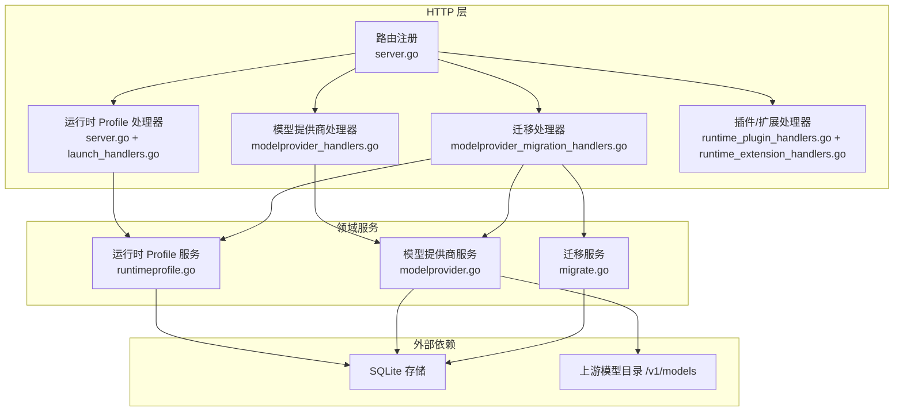
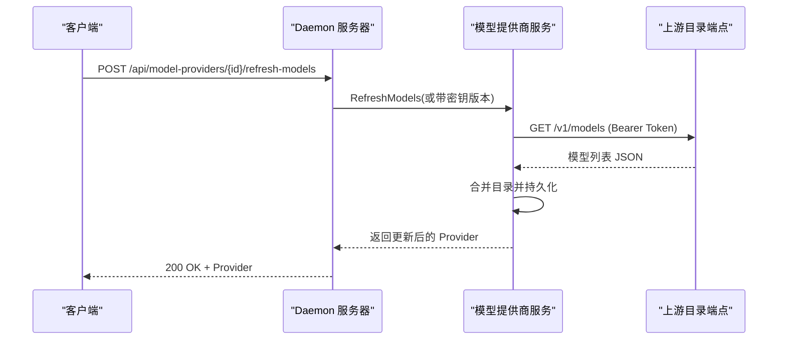
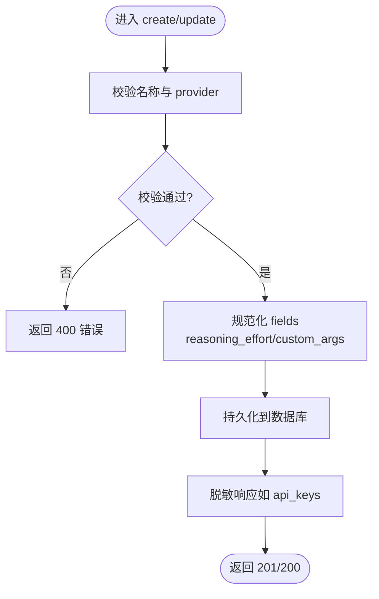
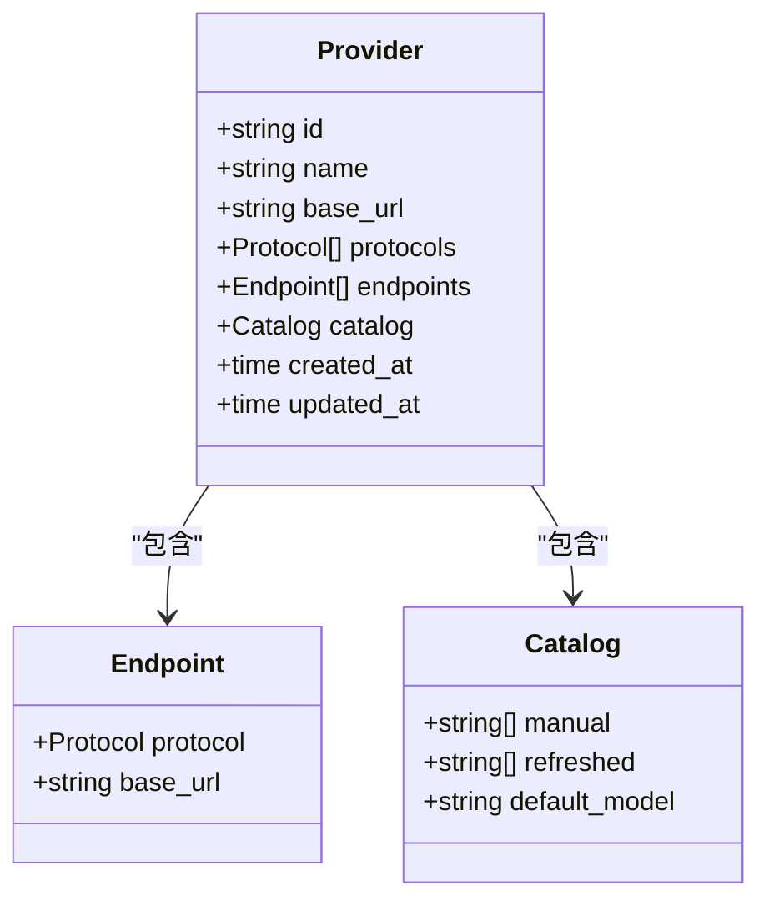
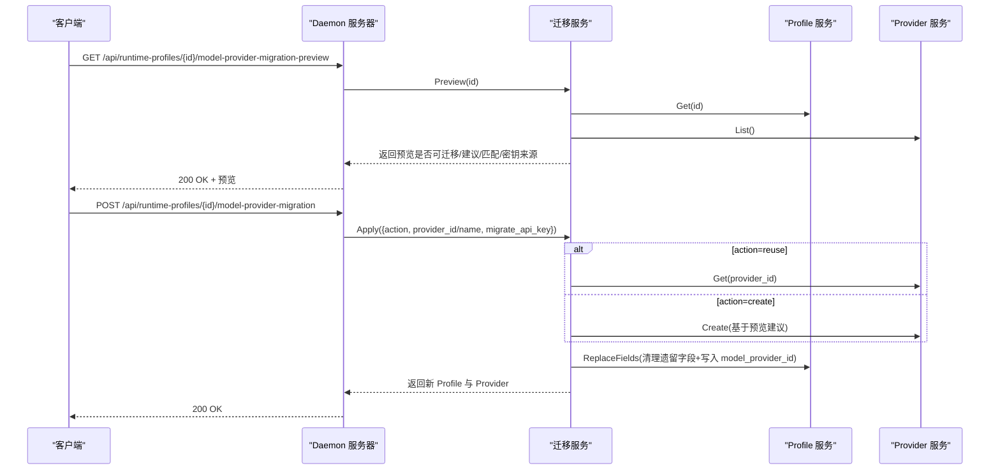
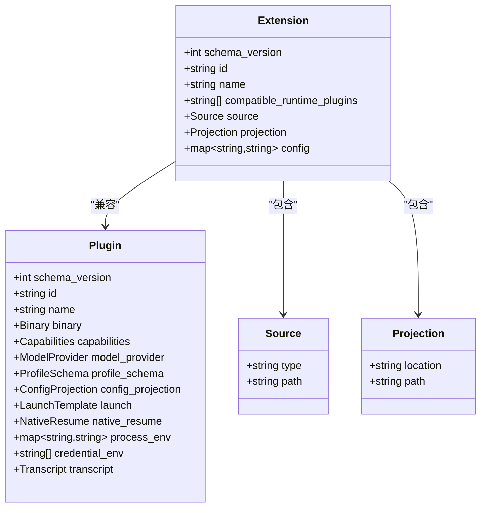
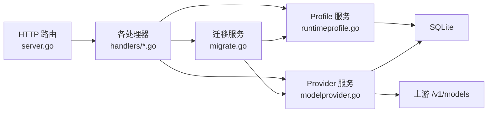

# 运行时配置 API

<cite>
**本文引用的文件**   
- [server.go](file://internal/daemon/server.go)
- [launch_handlers.go](file://internal/daemon/launch_handlers.go)
- [modelprovider_handlers.go](file://internal/daemon/modelprovider_handlers.go)
- [modelprovider_migration_handlers.go](file://internal/daemon/modelprovider_migration_handlers.go)
- [runtime_plugin_handlers.go](file://internal/daemon/runtime_plugin_handlers.go)
- [runtime_extension_handlers.go](file://internal/daemon/runtime_extension_handlers.go)
- [runtimeprofile.go](file://internal/runtimeprofile/runtimeprofile.go)
- [modelprovider.go](file://internal/modelprovider/modelprovider.go)
- [migrate.go](file://internal/modelprovidermigrate/migrate.go)
- [plugin.go](file://internal/runtimeplugin/plugin.go)
- [extension.go](file://internal/runtimeextension/extension.go)
</cite>

## 目录
1. [简介](#简介)
2. [项目结构](#项目结构)
3. [核心组件](#核心组件)
4. [架构总览](#架构总览)
5. [详细组件分析](#详细组件分析)
6. [依赖关系分析](#依赖关系分析)
7. [性能与一致性考虑](#性能与一致性考虑)
8. [故障排查指南](#故障排查指南)
9. [结论](#结论)
10. [附录：API 参考与最佳实践](#附录api-参考与最佳实践)

## 简介
本文件面向“运行时配置”相关 HTTP API，覆盖以下能力：
- 运行时 Profile 的创建、查询、更新、推广（从自动解析转为手动预设）、删除
- 模型提供商的增删改查、刷新模型目录
- 运行时插件与扩展的清单与目录浏览
- 模型提供商迁移预览与应用（将遗留字段迁移为可复用的模型提供商）

这些接口由 Daemon 服务统一暴露，后端通过领域服务对 SQLite 进行持久化，并在需要时调用上游模型目录刷新端点。

## 项目结构
运行时配置相关的代码主要分布在以下模块：
- 路由与中间件：Daemon Server 注册所有 /api/* 路由，并处理鉴权、CORS 预检、静态资源放行等
- 运行时 Profile 领域服务：Profile 的 CRUD、生成配置预览、字段规范化与校验
- 模型提供商领域服务：Provider 的 CRUD、端点与协议归一化、目录刷新
- 迁移服务：基于 Profile 与 Plugin 元数据，提供迁移预览与应用
- 插件与扩展：声明式清单加载、验证与查询

图示来源
- [server.go:587-643](file://internal/daemon/server.go#L587-L643)
- [launch_handlers.go:12-54](file://internal/daemon/launch_handlers.go#L12-L54)
- [modelprovider_handlers.go:13-155](file://internal/daemon/modelprovider_handlers.go#L13-L155)
- [modelprovider_migration_handlers.go:12-70](file://internal/daemon/modelprovider_migration_handlers.go#L12-L70)
- [runtime_plugin_handlers.go:9-34](file://internal/daemon/runtime_plugin_handlers.go#L9-L34)
- [runtime_extension_handlers.go:9-51](file://internal/daemon/runtime_extension_handlers.go#L9-L51)
- [runtimeprofile.go:128-346](file://internal/runtimeprofile/runtimeprofile.go#L128-L346)
- [modelprovider.go:84-315](file://internal/modelprovider/modelprovider.go#L84-L315)
- [migrate.go:76-170](file://internal/modelprovidermigrate/migrate.go#L76-L170)

章节来源
- [server.go:587-643](file://internal/daemon/server.go#L587-L643)

## 核心组件
- 运行时 Profile 服务
  - 负责 Profile 的创建、获取、列表、更新、替换字段、删除、推广
  - 提供 GeneratedConfig 用于生成只读的配置预览（不含敏感值）
  - 支持 ReasoningEffort 规范化与 CustomArgs 冲突检测
- 模型提供商服务
  - 负责 Provider 的创建、获取、列表、更新、删除
  - 支持 BaseURL/Endpoints/Protocols 归一化与兼容处理
  - 支持按 OpenAI 风格 /v1/models 刷新目录
- 迁移服务
  - 读取 Profile 与 Plugin 元数据，评估是否可迁移
  - 提供预览（建议新建或复用哪个 Provider、API Key 来源）
  - 应用迁移：清理遗留字段、写入新的 model_provider_id 与可选 model_override
- 插件与扩展
  - 插件清单定义二进制、能力、Profile Schema、配置投影、启动模板、原生恢复、凭证环境变量等
  - 扩展清单定义与插件的兼容性、源位置与投影路径

章节来源
- [runtimeprofile.go:128-346](file://internal/runtimeprofile/runtimeprofile.go#L128-L346)
- [modelprovider.go:84-315](file://internal/modelprovider/modelprovider.go#L84-L315)
- [migrate.go:76-170](file://internal/modelprovidermigrate/migrate.go#L76-L170)
- [plugin.go:19-96](file://internal/runtimeplugin/plugin.go#L19-L96)
- [extension.go:19-49](file://internal/runtimeextension/extension.go#L19-L49)

## 架构总览
下图展示一次“刷新模型目录”的端到端流程：客户端请求 → Daemon 路由 → 模型提供商服务 → 上游目录端点 → 落库返回。

图示来源
- [modelprovider_handlers.go:97-122](file://internal/daemon/modelprovider_handlers.go#L97-L122)
- [modelprovider.go:223-284](file://internal/modelprovider/modelprovider.go#L223-L284)

## 详细组件分析

### 运行时 Profile API
- 路由与行为
  - POST /api/runtime-profiles：创建 Profile，默认 kind=manual；fields 包含结构化字段与可选 inline api_keys
  - GET /api/runtime-profiles：列出所有 Profile
  - GET /api/runtime-profiles/{id}：获取单个 Profile
  - PATCH /api/runtime-profiles/{id}：部分更新，未提供的字段保持不变
  - POST /api/runtime-profiles/{id}/promote：将 launch_resolve 类型提升为 manual
  - DELETE /api/runtime-profiles/{id}：删除 Profile
  - POST /api/runtime-profiles/resolve-launch：根据 provider 与 model_provider_id 解析或创建最小 Profile
- 关键规则
  - 名称必填、provider 必须受支持
  - fields 中的 reasoning_effort 会被规范化；custom_args 会与 provider 约束做冲突检查
  - 响应中会脱敏 inline api_keys（以哨兵值替代）
  - ReplaceFields 用于迁移场景，避免合并 inline api_keys
- 典型错误码
  - 400：缺少名称、未知 provider、reasoning_effort 非法、custom_args 冲突
  - 404：不存在
  - 500：存储异常

图示来源
- [server.go:825-977](file://internal/daemon/server.go#L825-L977)
- [runtimeprofile.go:144-346](file://internal/runtimeprofile/runtimeprofile.go#L144-L346)

章节来源
- [server.go:825-977](file://internal/daemon/server.go#L825-L977)
- [launch_handlers.go:12-54](file://internal/daemon/launch_handlers.go#L12-L54)
- [runtimeprofile.go:128-346](file://internal/runtimeprofile/runtimeprofile.go#L128-L346)

### 模型提供商 API
- 路由与行为
  - GET /api/model-providers：列出所有 Provider
  - POST /api/model-providers：创建 Provider（支持 base_url+protocols 或 endpoints）
  - GET /api/model-providers/{id}：获取单个 Provider
  - PATCH /api/model-providers/{id}：部分更新（name/base_url/protocols/endpoints/catalog）
  - DELETE /api/model-providers/{id}：删除（若被 Profile 引用则拒绝）
  - POST /api/model-providers/{id}/refresh-models：刷新模型目录（优先使用凭据绑定解析的密钥）
- 关键规则
  - 支持 openai_chat_completions/openai_responses/anthropic_messages 三种协议
  - 当仅设置 base_url+protocols 时，会自动回填 endpoints
  - 目录刷新要求存在 OpenAI 家族端点，且需配置对应环境变量密钥
- 典型错误码
  - 400：缺失 name/base_url、协议无效、重复协议、endpoint base_url 非法
  - 404：不存在
  - 409：被 Profile 引用
  - 500：网络/解析/存储异常

图示来源
- [modelprovider.go:46-56](file://internal/modelprovider/modelprovider.go#L46-L56)
- [modelprovider.go:41-44](file://internal/modelprovider/modelprovider.go#L41-L44)
- [modelprovider.go:35-39](file://internal/modelprovider/modelprovider.go#L35-L39)

章节来源
- [modelprovider_handlers.go:13-155](file://internal/daemon/modelprovider_handlers.go#L13-L155)
- [modelprovider.go:84-315](file://internal/modelprovider/modelprovider.go#L84-L315)

### 模型提供商迁移 API
- 路由与行为
  - GET /api/runtime-profiles/{id}/model-provider-migration-preview：预览迁移方案
  - POST /api/runtime-profiles/{id}/model-provider-migration：应用迁移
    - action：create（新建 Provider）或 reuse（复用已有 Provider）
    - provider_id/provider_name：选择或命名
    - migrate_api_key：是否将 inline api_key 迁移至全局凭据绑定
- 关键规则
  - 仅当运行时插件要求“必须使用模型提供商”且 Profile 尚未引用 Provider 时才 eligible
  - 会从遗留字段推断 base_url、model、protocol 集合，并尝试匹配现有 Provider
  - 应用后清理遗留字段，写入 model_provider_id，必要时保留 model_override
- 典型错误码
  - 400：不可迁移、缺少 provider_id、不兼容 profile
  - 404：Profile/Provider 不存在
  - 500：内部错误

图示来源
- [modelprovider_migration_handlers.go:12-70](file://internal/daemon/modelprovider_migration_handlers.go#L12-L70)
- [migrate.go:100-170](file://internal/modelprovidermigrate/migrate.go#L100-L170)
- [runtimeprofile.go:299-329](file://internal/runtimeprofile/runtimeprofile.go#L299-L329)

章节来源
- [modelprovider_migration_handlers.go:12-70](file://internal/daemon/modelprovider_migration_handlers.go#L12-L70)
- [migrate.go:100-170](file://internal/modelprovidermigrate/migrate.go#L100-L170)

### 运行时插件与扩展管理 API
- 插件
  - GET /api/runtime-plugins：列出已加载的插件清单
  - GET /api/runtime-plugins/{plugin_id}：获取指定插件详情
- 扩展
  - GET /api/runtime-extensions：列出本地已加载的扩展
  - GET /api/runtime-extension-catalog：拉取远程扩展目录（含错误信息）
  - GET /api/runtime-extensions/{extension_id}：获取指定扩展详情
- 关键规则
  - 插件清单包含二进制、能力、Profile Schema、配置投影、启动模板、原生恢复、凭证环境变量等
  - 扩展清单需与插件 ID 兼容，source/projection 路径安全校验严格

图示来源
- [plugin.go:19-96](file://internal/runtimeplugin/plugin.go#L19-L96)
- [extension.go:19-49](file://internal/runtimeextension/extension.go#L19-L49)
- [runtime_plugin_handlers.go:9-34](file://internal/daemon/runtime_plugin_handlers.go#L9-L34)
- [runtime_extension_handlers.go:9-51](file://internal/daemon/runtime_extension_handlers.go#L9-L51)

章节来源
- [runtime_plugin_handlers.go:9-34](file://internal/daemon/runtime_plugin_handlers.go#L9-L34)
- [runtime_extension_handlers.go:9-51](file://internal/daemon/runtime_extension_handlers.go#L9-L51)
- [plugin.go:19-96](file://internal/runtimeplugin/plugin.go#L19-L96)
- [extension.go:19-49](file://internal/runtimeextension/extension.go#L19-L49)

## 依赖关系分析
- 路由层依赖领域服务：Server 在 routes() 中注册所有 /api/* 路由，并将请求委派给具体处理器
- 领域服务依赖存储与外部系统：
  - Profile/Provider 服务读写 SQLite
  - Provider 服务在刷新目录时访问上游 /v1/models
  - 迁移服务组合 Profile/Provider/Credential/Plugin 的能力完成迁移决策与执行
- 插件与扩展作为“能力与配置”的声明式来源，影响 Profile 的可用字段、启动参数与投影方式

图示来源
- [server.go:587-643](file://internal/daemon/server.go#L587-L643)
- [runtimeprofile.go:128-346](file://internal/runtimeprofile/runtimeprofile.go#L128-L346)
- [modelprovider.go:84-315](file://internal/modelprovider/modelprovider.go#L84-L315)
- [migrate.go:76-170](file://internal/modelprovidermigrate/migrate.go#L76-L170)

章节来源
- [server.go:587-643](file://internal/daemon/server.go#L587-L643)

## 性能与一致性考虑
- 批量操作
  - 列表接口均为简单扫描，注意分页需求可在上层实现
- 并发与锁
  - 当前实现未显式加写锁，依赖数据库事务保证原子性；高并发写入时需关注 SQLite 写入瓶颈
- 外部依赖
  - 刷新模型目录涉及网络 I/O，建议在 UI 侧增加重试与超时提示
- 缓存
  - 插件/扩展清单在服务启动时加载，变更需重启生效；如需热更新，可在加载器中引入失效策略

[本节为通用指导，无需源码引用]

## 故障排查指南
- 常见 400 错误
  - 缺少名称/基础 URL/协议非法/重复协议/自定义参数冲突：检查请求体字段与取值范围
- 常见 404 错误
  - 资源不存在：确认 ID 是否正确
- 常见 409 错误
  - 删除 Provider 失败：存在 Profile 引用，先解除引用或迁移
- 刷新目录失败
  - 未配置 API Key 环境变量或凭据绑定：检查凭据绑定与环境变量
  - 上游返回非 2xx：检查网络连通性与上游状态
- 迁移不可用
  - 运行时插件不要求模型提供商或 Profile 已引用 Provider：不符合迁移条件

章节来源
- [modelprovider_handlers.go:139-155](file://internal/daemon/modelprovider_handlers.go#L139-L155)
- [modelprovider_migration_handlers.go:56-70](file://internal/daemon/modelprovider_migration_handlers.go#L56-L70)

## 结论
运行时配置 API 围绕“Profile + Provider + 迁移 + 插件/扩展”四个维度构建，既满足日常配置管理，也提供了平滑迁移路径。通过声明式插件与扩展，系统可扩展更多运行时与增强能力；通过迁移服务，可将历史遗留配置逐步收敛到可复用的模型提供商。

[本节为总结，无需源码引用]

## 附录：API 参考与最佳实践

### 运行时 Profile
- 创建
  - 方法：POST
  - 路径：/api/runtime-profiles
  - 说明：name 必填；provider 必须受支持；fields 可为空对象
- 列表
  - 方法：GET
  - 路径：/api/runtime-profiles
- 获取
  - 方法：GET
  - 路径：/api/runtime-profiles/{id}
- 更新
  - 方法：PATCH
  - 路径：/api/runtime-profiles/{id}
  - 说明：仅更新提供的字段；未提供字段保持原值
- 推广
  - 方法：POST
  - 路径：/api/runtime-profiles/{id}/promote
  - 说明：将 launch_resolve 类型提升为 manual
- 删除
  - 方法：DELETE
  - 路径：/api/runtime-profiles/{id}
- 解析启动
  - 方法：POST
  - 路径：/api/runtime-profiles/resolve-launch
  - 说明：根据 provider 与 model_provider_id 解析或创建最小 Profile

章节来源
- [server.go:592-601](file://internal/daemon/server.go#L592-L601)
- [server.go:825-977](file://internal/daemon/server.go#L825-L977)
- [launch_handlers.go:12-54](file://internal/daemon/launch_handlers.go#L12-L54)

### 模型提供商
- 列表/获取/更新/删除/创建
  - 路径：/api/model-providers 与 /api/model-providers/{id}
- 刷新模型目录
  - 方法：POST
  - 路径：/api/model-providers/{id}/refresh-models
  - 说明：优先使用凭据绑定解析的密钥；否则回退环境变量

章节来源
- [modelprovider_handlers.go:13-155](file://internal/daemon/modelprovider_handlers.go#L13-L155)

### 迁移
- 预览
  - 方法：GET
  - 路径：/api/runtime-profiles/{id}/model-provider-migration-preview
- 应用
  - 方法：POST
  - 路径：/api/runtime-profiles/{id}/model-provider-migration
  - 说明：action 支持 create/reuse；可选择是否迁移 inline api_key

章节来源
- [modelprovider_migration_handlers.go:12-70](file://internal/daemon/modelprovider_migration_handlers.go#L12-L70)

### 插件与扩展
- 插件
  - 列表：GET /api/runtime-plugins
  - 详情：GET /api/runtime-plugins/{plugin_id}
- 扩展
  - 列表：GET /api/runtime-extensions
  - 目录：GET /api/runtime-extension-catalog
  - 详情：GET /api/runtime-extensions/{extension_id}

章节来源
- [runtime_plugin_handlers.go:9-34](file://internal/daemon/runtime_plugin_handlers.go#L9-L34)
- [runtime_extension_handlers.go:9-51](file://internal/daemon/runtime_extension_handlers.go#L9-L51)

### 最佳实践
- 使用 resolve-launch 快速创建最小 Profile，再 promote 为 manual 以便后续编辑
- 优先使用模型提供商集中管理 endpoint/protocol/catalog，避免在 Profile 中散落遗留字段
- 刷新目录前确保凭据绑定或环境变量正确配置
- 谨慎修改 custom_args，避免与 provider 约束冲突
- 扩展与插件清单遵循安全校验，避免在路径或配置中硬编码密钥

[本节为通用指导，无需源码引用]