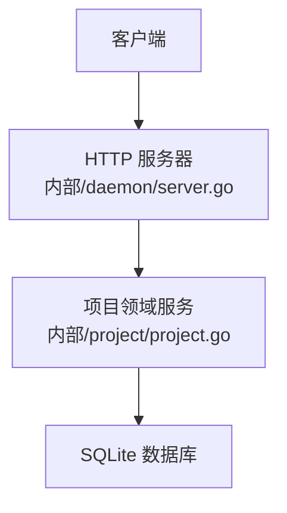
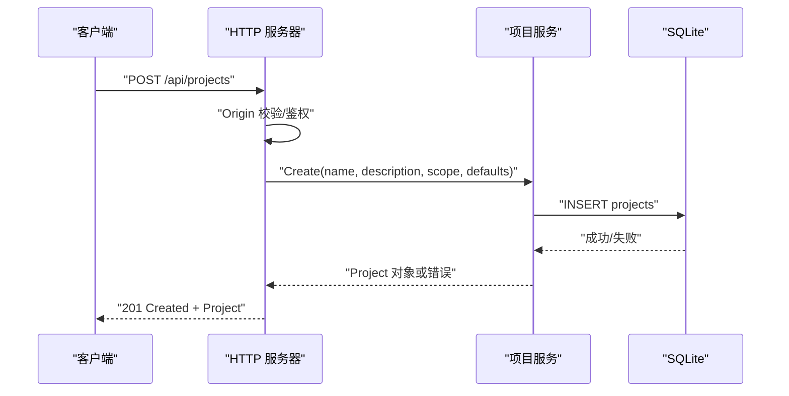
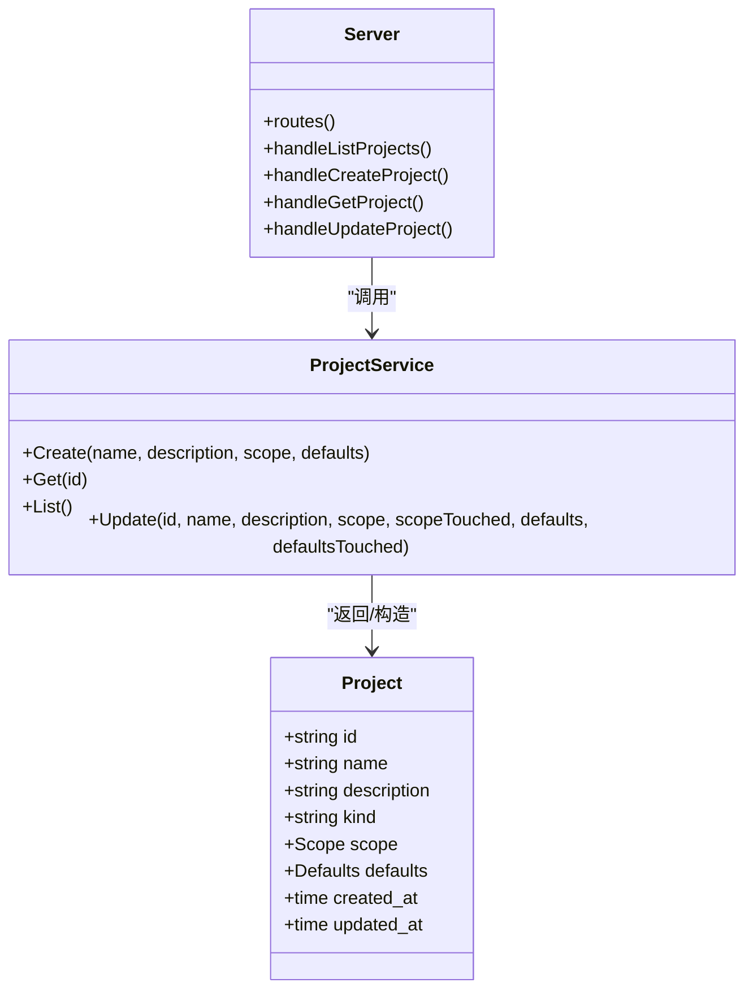

# 项目管理 API

<cite>
**本文引用的文件**   
- [server.go](file://internal/daemon/server.go)
- [project.go](file://internal/project/project.go)
</cite>

## 目录
1. [简介](#简介)
2. [项目结构](#项目结构)
3. [核心组件](#核心组件)
4. [架构总览](#架构总览)
5. [详细组件分析](#详细组件分析)
6. [依赖关系分析](#依赖关系分析)
7. [性能与一致性](#性能与一致性)
8. [故障排查指南](#故障排查指南)
9. [结论](#结论)
10. [附录：API 参考与示例](#附录api-参考与示例)

## 简介
本文件面向“项目管理”子系统的 HTTP API，聚焦以下端点：
- GET /api/projects
- POST /api/projects
- GET /api/projects/{id}
- PATCH /api/projects/{id}

文档覆盖请求参数校验、响应数据结构、错误处理策略、状态码规范，并给出范围定义、默认配置、权限控制等关键能力的说明与使用示例。同时提供客户端集成建议，帮助快速对接。

## 项目结构
本项目采用 Go 后端 + React 前端架构。项目管理 API 由 Daemon 的 HTTP 路由层统一注册，业务逻辑封装在领域服务中，数据持久化通过 SQLite 完成。

图表来源
- [server.go:587-643](file://internal/daemon/server.go#L587-L643)
- [project.go:80-138](file://internal/project/project.go#L80-L138)

章节来源
- [server.go:587-643](file://internal/daemon/server.go#L587-L643)
- [project.go:1-259](file://internal/project/project.go#L1-L259)

## 核心组件
- HTTP 路由与中间件
  - 路由注册：所有项目相关端点在路由表中集中声明。
  - 鉴权与来源校验：全局入口对 Origin 进行 DNS 重绑定防护；当监听地址非本地回环时强制要求 Bearer Token 认证（支持查询参数 token 兼容 MCP）。
- 项目领域服务
  - 负责创建、读取、更新项目的业务规则与数据持久化。
  - 包含 Scope（范围）和 Defaults（默认配置）模型。
- 通用响应/错误工具
  - writeJSON/writeError 统一 JSON 响应与错误体格式。

章节来源
- [server.go:383-411](file://internal/daemon/server.go#L383-L411)
- [server.go:431-461](file://internal/daemon/server.go#L431-L461)
- [server.go:518-534](file://internal/daemon/server.go#L518-L534)
- [server.go:1260-1272](file://internal/daemon/server.go#L1260-L1272)
- [project.go:20-72](file://internal/project/project.go#L20-L72)
- [project.go:80-138](file://internal/project/project.go#L80-L138)

## 架构总览
下图展示了从客户端到存储层的调用链，以及各层职责边界。

图表来源
- [server.go:676-699](file://internal/daemon/server.go#L676-L699)
- [project.go:90-138](file://internal/project/project.go#L90-L138)

## 详细组件分析

### 列表项目：GET /api/projects
- 功能：返回当前系统内所有项目，按创建时间升序排列。
- 鉴权：遵循全局鉴权策略（见“权限控制”小节）。
- 请求参数：无路径/查询参数。
- 响应体：
  - 字段：projects（数组），每个元素为项目对象。
- 状态码：
  - 200 OK：成功返回。
  - 401 Unauthorized：未通过鉴权。
  - 403 Forbidden：来源非法（Origin 校验失败）。
  - 500 Internal Server Error：服务端错误。

章节来源
- [server.go:701-715](file://internal/daemon/server.go#L701-L715)
- [server.go:383-411](file://internal/daemon/server.go#L383-L411)

### 创建项目：POST /api/projects
- 功能：创建一个新项目，自动生成 ID 与时间戳。
- 请求体字段：
  - name（必填，字符串）：项目名称，会被 trim 后校验非空。
  - description（可选，字符串）：项目描述。
  - scope（可选，对象）：项目范围定义（见“范围定义”小节）。
  - defaults（可选，对象）：项目默认配置（见“默认配置”小节）。
- 响应体：
  - 返回完整的项目对象，包含 id、name、description、kind、scope、defaults、created_at、updated_at。
- 状态码：
  - 201 Created：创建成功。
  - 400 Bad Request：请求体无效或缺失必填字段（如 name 为空）。
  - 401/403：鉴权/来源问题。
  - 500：服务端错误。

章节来源
- [server.go:676-699](file://internal/daemon/server.go#L676-L699)
- [project.go:90-138](file://internal/project/project.go#L90-L138)

### 获取项目：GET /api/projects/{id}
- 功能：根据项目 ID 获取单个项目详情。
- 路径参数：
  - id（必填）：项目唯一标识。
- 响应体：
  - 返回完整的项目对象。
- 状态码：
  - 200 OK：成功返回。
  - 404 Not Found：项目不存在。
  - 401/403：鉴权/来源问题。
  - 500：服务端错误。

章节来源
- [server.go:717-735](file://internal/daemon/server.go#L717-L735)
- [project.go:140-147](file://internal/project/project.go#L140-L147)

### 更新项目：PATCH /api/projects/{id}
- 功能：部分更新项目信息。未提供的字段保持原值不变。
- 路径参数：
  - id（必填）：项目唯一标识。
- 请求体字段（均为可选）：
  - name（可选，字符串）：若提供则必须非空（trim 后）。
  - description（可选，字符串）：可置空以清空描述。
  - scope（可选，对象）：若提供则整体替换现有 scope。
  - defaults（可选，对象）：若提供则整体替换现有 defaults。
- 响应体：
  - 返回更新后的完整项目对象。
- 状态码：
  - 200 OK：更新成功。
  - 400 Bad Request：name 为空或请求体无效。
  - 404 Not Found：项目不存在。
  - 401/403：鉴权/来源问题。
  - 500：服务端错误。

章节来源
- [server.go:737-804](file://internal/daemon/server.go#L737-L804)
- [project.go:173-213](file://internal/project/project.go#L173-L213)

## 依赖关系分析
- HTTP 层依赖项目服务接口，不直接访问数据库。
- 项目服务封装了 SQLite 读写与 JSON 编解码。
- 统一的 writeJSON/writeError 保证响应格式一致。

图表来源
- [server.go:587-643](file://internal/daemon/server.go#L587-L643)
- [project.go:63-72](file://internal/project/project.go#L63-L72)
- [project.go:80-138](file://internal/project/project.go#L80-L138)

章节来源
- [server.go:587-643](file://internal/daemon/server.go#L587-L643)
- [project.go:63-72](file://internal/project/project.go#L63-L72)

## 性能与一致性
- 列表与单条查询为简单 SQL 查询，复杂度低。
- 更新操作会先读取现有记录再合并字段，避免误覆盖未提交字段。
- 时间戳使用 UTC RFC3339Nano，确保跨进程/重启一致性。
- 未实现分页与过滤，适用于本地开发或小规模管理场景。

[本节为通用指导，无需源码引用]

## 故障排查指南
- 401 Unauthorized：检查是否设置了 AuthToken 且请求携带正确的 Authorization: Bearer <token> 或 ?token=...。
- 403 Forbidden：检查请求 Origin 是否为本地回环或与监听地址同源；浏览器跨站请求会被拒绝。
- 400 Bad Request：确认 name 非空、JSON 结构正确。
- 404 Not Found：确认路径中的 id 存在。
- 500 Internal Server Error：查看服务端日志定位具体错误原因。

章节来源
- [server.go:383-411](file://internal/daemon/server.go#L383-L411)
- [server.go:431-461](file://internal/daemon/server.go#L431-L461)
- [server.go:518-534](file://internal/daemon/server.go#L518-L534)
- [server.go:1260-1272](file://internal/daemon/server.go#L1260-L1272)

## 结论
项目管理 API 提供了简洁清晰的 CRUD 能力，结合严格的来源与鉴权校验，适合本地优先的渗透测试代理环境。通过 Scope 与 Defaults 两个结构化字段，用户可灵活定义项目范围与任务默认行为，便于后续任务启动与运行时配置的统一管理。

[本节为总结性内容，无需源码引用]

## 附录：API 参考与示例

### 权限控制
- 来源校验：禁止来自非本地回环的 Origin 请求，防止 DNS 重绑定攻击。
- 鉴权：
  - 当监听地址为非本地回环时，必须设置 AuthToken。
  - 支持两种传参方式：Authorization: Bearer <token> 或查询参数 ?token=<token>。
  - 公共路径（健康检查、静态资源）不受鉴权限制。

章节来源
- [server.go:383-411](file://internal/daemon/server.go#L383-L411)
- [server.go:431-461](file://internal/daemon/server.go#L431-L461)
- [server.go:467-501](file://internal/daemon/server.go#L467-L501)
- [server.go:518-534](file://internal/daemon/server.go#L518-L534)

### 范围定义（Scope）
- domains：域名列表
- ips：IP 列表
- cidrs：CIDR 列表
- urls：URL 列表
- ports：端口列表
- excluded：排除项列表
- testing_limits：测试限制说明
- notes：备注

章节来源
- [project.go:20-31](file://internal/project/project.go#L20-L31)

### 默认配置（Defaults）
- runtime_profile：默认运行时配置名称
- runner：执行边界，sandbox 或 host
- task_policy：任务策略

章节来源
- [project.go:43-50](file://internal/project/project.go#L43-L50)

### 请求/响应示例（文字描述）
- 创建项目
  - 方法：POST
  - 路径：/api/projects
  - 请求体：包含 name、可选 description、scope、defaults
  - 成功响应：201，返回项目对象
  - 失败响应：400（缺少 name）、401/403（鉴权/来源）、500（服务端错误）
- 列出项目
  - 方法：GET
  - 路径：/api/projects
  - 成功响应：200，返回 { projects: [...] }
- 获取项目
  - 方法：GET
  - 路径：/api/projects/{id}
  - 成功响应：200，返回项目对象
  - 失败响应：404（不存在）、401/403、500
- 更新项目
  - 方法：PATCH
  - 路径：/api/projects/{id}
  - 请求体：name/description/scope/defaults 任意组合（可选）
  - 成功响应：200，返回更新后的项目对象
  - 失败响应：400（name 为空）、404（不存在）、401/403、500

章节来源
- [server.go:676-804](file://internal/daemon/server.go#L676-L804)
- [project.go:90-213](file://internal/project/project.go#L90-L213)

### 客户端集成要点
- 统一设置 Content-Type: application/json。
- 在非本地回环部署时，务必携带 Authorization: Bearer <token>。
- 处理 401/403 时提示用户重新登录或检查来源。
- 处理 400 时展示具体错误消息（例如 name 必填）。
- 处理 404 时提示项目不存在或链接过期。
- 对于 500，记录请求上下文并重试一次（幂等性由上层保障）。

[本节为通用指导，无需源码引用]