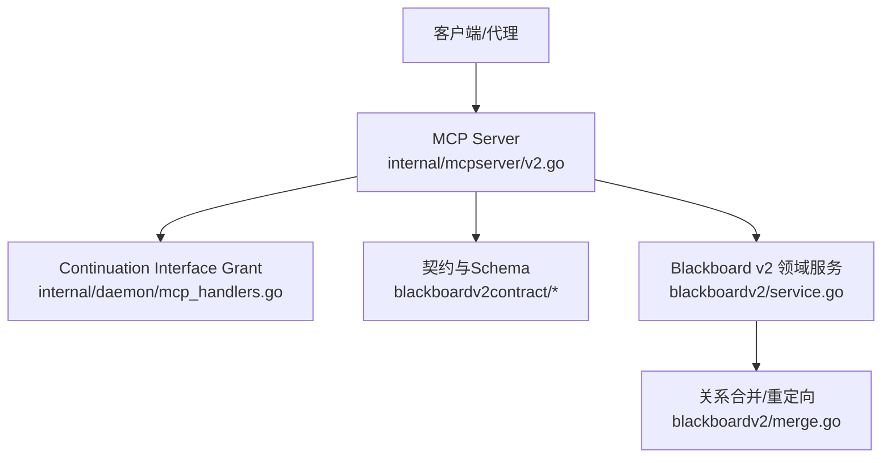
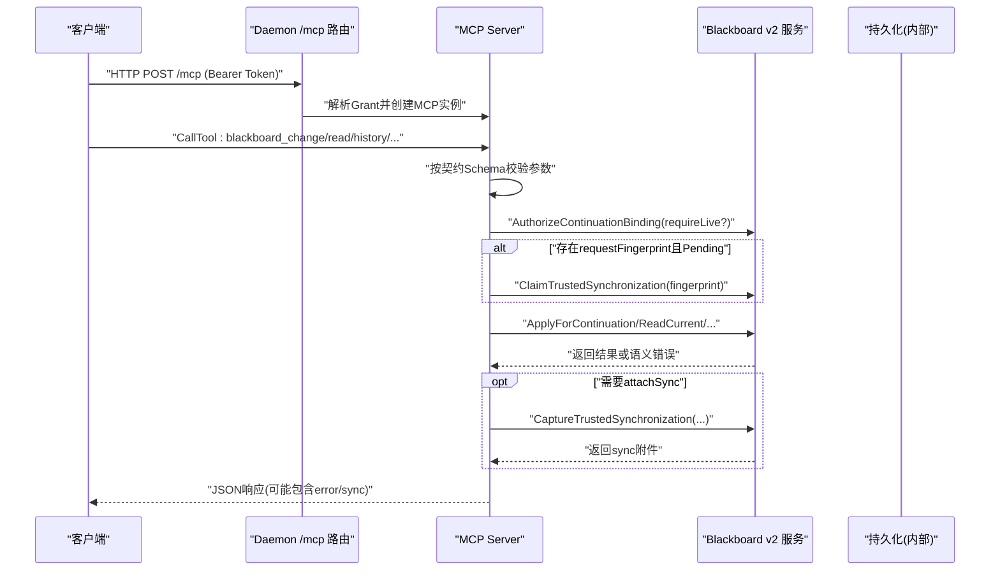
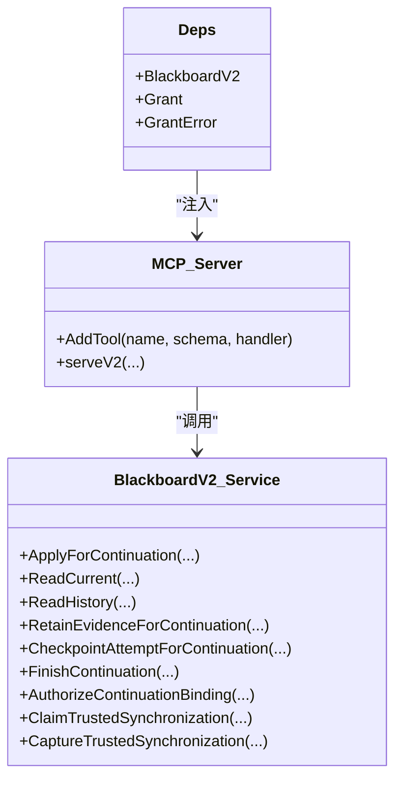

# Blackboard v2工具集

<cite>
**本文引用的文件**   
- [internal/mcpserver/v2.go](file://internal/mcpserver/v2.go)
- [internal/daemon/mcp_handlers.go](file://internal/daemon/mcp_handlers.go)
- [internal/blackboardv2contract/contractdata/trusted-tools.json](file://internal/blackboardv2contract/contractdata/trusted-tools.json)
- [internal/blackboardv2contract/contract.go](file://internal/blackboardv2contract/contract.go)
- [internal/blackboardv2contract/contractdata/openapi.json](file://internal/blackboardv2contract/contractdata/openapi.json)
- [internal/blackboardv2/service.go](file://internal/blackboardv2/service.go)
- [internal/blackboardv2/merge.go](file://internal/blackboardv2/merge.go)
- [internal/blackboardv2/relationship_service_test.go](file://internal/blackboardv2/relationship_service_test.go)
- [internal/blackboardv2/entity_service_test.go](file://internal/blackboardv2/entity_service_test.go)
- [internal/blackboardv2/fact_service_test.go](file://internal/blackboardv2/fact_service_test.go)
</cite>

## 目录
1. [简介](#简介)
2. [项目结构](#项目结构)
3. [核心组件](#核心组件)
4. [架构总览](#架构总览)
5. [详细组件分析](#详细组件分析)
6. [依赖关系分析](#依赖关系分析)
7. [性能与并发特性](#性能与并发特性)
8. [故障排查指南](#故障排查指南)
9. [结论](#结论)
10. [附录：集成示例与最佳实践](#附录集成示例与最佳实践)

## 简介
Blackboard v2 是 CyberPenda 的语义记忆平面，提供原子化的“变更批次”写入、当前快照读取、历史分页查询、证据保留、尝试检查点与任务结束等能力。MCP（Model Context Protocol）侧暴露六个受信任工具，通过 Continuation Interface Grant 进行权限校验，并以不可变 Schema 约束输入输出，确保跨进程/沙箱的可重复性与一致性。

注意：本仓库中 MCP 工具以“黑匣子式”的契约驱动方式注册，实际可用工具为以下六个：
- blackboard_change（对应实体操作 create_entity/update_entity/delete_entity 的原子化实现）
- blackboard_read（用于读取单个实体的当前详情）
- blackboard_history（用于读取某个键的历史记录）
- blackboard_retain_evidence（用于保留证据并生成受管字段）
- blackboard_checkpoint_attempt（用于对尝试进行版本化摘要）
- blackboard_finish（用于结束一个 Continuation）

其中，“create_entity/update_entity/delete_entity”在 v2 中以统一的 ChangeBatch 的 create/transition/clear 等操作表达；“create_relationship/query_relationships”由 relate/unrelate 与 read_current/history 组合完成；“record_fact”通过 change 批次的 create/update 完成。

## 项目结构
- MCP 服务层负责将 HTTP/MCP 请求解析为受控的调用，执行鉴权、幂等指纹、同步附件注入，再委派给 Blackboard v2 领域服务。
- Daemon 层仅负责挂载 /mcp 端点，从请求头提取 Bearer Token 并解析为 Grant，注入到 MCP 服务。
- Blackboard v2 契约层冻结了所有输入/输出 JSON Schema 与工具清单，MCP 工具列表与参数校验均来源于此。
- 领域服务负责事务边界、版本冲突检测、关系矩阵校验、合并与重定向等复杂逻辑。

图表来源
- [internal/mcpserver/v2.go:1-316](file://internal/mcpserver/v2.go#L1-L316)
- [internal/daemon/mcp_handlers.go:1-44](file://internal/daemon/mcp_handlers.go#L1-L44)
- [internal/blackboardv2contract/contract.go:1-493](file://internal/blackboardv2contract/contract.go#L1-L493)
- [internal/blackboardv2/service.go:1801-1835](file://internal/blackboardv2/service.go#L1801-L1835)
- [internal/blackboardv2/merge.go:43-238](file://internal/blackboardv2/merge.go#L43-L238)

章节来源
- [internal/mcpserver/v2.go:1-316](file://internal/mcpserver/v2.go#L1-L316)
- [internal/daemon/mcp_handlers.go:1-44](file://internal/daemon/mcp_handlers.go#L1-L44)
- [internal/blackboardv2contract/contract.go:1-493](file://internal/blackboardv2contract/contract.go#L1-L493)

## 核心组件
- MCP 工具注册器：加载契约中的 trusted-tools 清单，按名称分发到具体处理函数，统一使用 schema 校验与错误信封。
- 授权与权限：基于 Continuation Interface Grant，限制可访问的项目、任务与延续上下文；关闭后的延续拒绝读写。
- 幂等与同步：支持 request fingerprint 的 Claim/Capture，保障重试时精确回放与同步附件投递。
- 领域服务：封装事务、版本控制、关系矩阵校验、合并与重定向、历史与快照等。

章节来源
- [internal/mcpserver/v2.go:46-156](file://internal/mcpserver/v2.go#L46-L156)
- [internal/daemon/mcp_handlers.go:14-44](file://internal/daemon/mcp_handlers.go#L14-L44)
- [internal/blackboardv2contract/contractdata/trusted-tools.json:1-44](file://internal/blackboardv2contract/contractdata/trusted-tools.json#L1-L44)

## 架构总览
下图展示了 MCP 工具调用的端到端流程，包括鉴权、参数校验、幂等指纹、领域服务调用与同步附件注入。

图表来源
- [internal/mcpserver/v2.go:194-248](file://internal/mcpserver/v2.go#L194-L248)
- [internal/daemon/mcp_handlers.go:14-44](file://internal/daemon/mcp_handlers.go#L14-L44)

## 详细组件分析

### 工具一：blackboard_change（实体操作与关系管理的原子化入口）
说明
- 该工具接收 semantic-change-batch/v2 批次，支持：
  - 实体：create、update（patch）、transition（状态迁移）、clear（清空字段）
  - 关系：relate、unrelate
  - 事实：create、update（patch）
- 幂等性：通过 Idempotency-Key 保证不确定重试时的精确回放。
- 同步：支持同步附件投递，便于跨会话恢复。

HTTP 等价接口
- POST /api/v2/projects/{project_id}/blackboard/changes
- Header: Idempotency-Key（必填）
- Body: { schema: "semantic-change-batch/v2", changes: [...] }
- 成功响应: changeResult
- 错误码: 400/401/403/404/409/410/422/500/503

参数验证规则
- 输入严格遵循 frozen schema（changeBatch），不允许额外字段。
- 每个 change 的 op/type/key/version/record/relation 等字段需满足类型与枚举约束。
- UTF-8 字节长度限制由契约校验器强制执行。

返回值结构
- changeResult 包含 revision、workingSnapshot.path 等元信息，以及变更影响（如 relations）。

错误码定义
- invalid_schema：参数不匹配契约
- authority_denied：权限不足或令牌无效
- closed_continuation：延续已关闭
- version_conflict：乐观锁冲突（实体/关系）
- semantic_validation：语义校验失败（例如关系矩阵、自环、循环）
- not_found：目标不存在
- internal：内部错误

调用权限检查
- 必须携带有效的 Continuation Interface Grant；否则返回 authority_denied。
- requireLive=false 允许 Finish 后精确回放非写操作；但新写仍被拒绝。

事务边界与并发安全
- 单次 Apply 在一个数据库事务内执行，保证原子性。
- 关系更新采用乐观锁（version），冲突返回 version_conflict。
- 合并与重定向在事务内完成，避免中间态可见。

典型用法路径
- 创建实体：changes[0].op="create", type="entity", record=EntityRecord
- 更新实体：changes[0].op="update", key, version, record=EntityPatch
- 删除实体：通过 transition 至 retired/superseded 或 clear 字段
- 建立关系：changes[0].op="relate", from, relation, to, reason
- 解除关系：changes[0].op="unrelate", from, relation, to, version
- 记录事实：changes[0].op="create"/"update", type="fact", record=FactRecord/FactPatch

章节来源
- [internal/mcpserver/v2.go:71-84](file://internal/mcpserver/v2.go#L71-L84)
- [internal/blackboardv2contract/contractdata/openapi.json:16-100](file://internal/blackboardv2contract/contractdata/openapi.json#L16-L100)
- [internal/blackboardv2/service.go:1801-1835](file://internal/blackboardv2/service.go#L1801-L1835)
- [internal/blackboardv2/service.go:1978-2027](file://internal/blackboardv2/service.go#L1978-L2027)
- [internal/blackboardv2/service.go:2106-2150](file://internal/blackboardv2/service.go#L2106-L2150)
- [internal/blackboardv2/merge.go:43-88](file://internal/blackboardv2/merge.go#L43-L88)
- [internal/blackboardv2/entity_service_test.go:37-80](file://internal/blackboardv2/entity_service_test.go#L37-L80)
- [internal/blackboardv2/relationship_service_test.go:269-291](file://internal/blackboardv2/relationship_service_test.go#L269-L291)
- [internal/blackboardv2/fact_service_test.go:343-385](file://internal/blackboardv2/fact_service_test.go#L343-L385)

### 工具二：blackboard_read（读取当前知识）
说明
- 根据 Blackboard Key 读取当前完整语义记录及其当前关系。
- 只读，不附带同步附件；延续关闭后拒绝访问。

HTTP 等价接口
- GET /api/v2/projects/{project_id}/blackboard/records/{key}
- 成功响应: currentDetail
- 错误码: 400/401/403/404/410/500/503

参数验证规则
- key 必须符合 blackboardKey 模式与长度限制。

返回值结构
- currentDetail 包含记录的当前版本、类型、内容以及当前关系集合。

错误码定义
- authority_denied、closed_continuation、not_found、invalid_schema 等

调用权限检查
- requireLive=true，延续关闭后无法读取当前知识。

章节来源
- [internal/mcpserver/v2.go:85-99](file://internal/mcpserver/v2.go#L85-L99)
- [internal/blackboardv2contract/contractdata/openapi.json:220-281](file://internal/blackboardv2contract/contractdata/openapi.json#L220-L281)

### 工具三：blackboard_history（读取历史记录）
说明
- 基于 cursor 分页读取某 Key 的显式语义历史。
- 默认 limit=20，最大 100。

HTTP 等价接口
- GET /api/v2/projects/{project_id}/blackboard/records/{key}/history
- 成功响应: semanticHistory
- 错误码: 400/401/403/404/410/500/503

参数验证规则
- key 符合 blackboardKey；cursor 非空字符串；limit 整数范围。

返回值结构
- semanticHistory 包含历史页数据与下一页 cursor。

错误码定义
- authority_denied、closed_continuation、not_found、invalid_schema 等

章节来源
- [internal/mcpserver/v2.go:100-113](file://internal/mcpserver/v2.go#L100-L113)
- [internal/blackboardv2contract/contractdata/openapi.json:282-348](file://internal/blackboardv2contract/contractdata/openapi.json#L282-L348)

### 工具四：blackboard_retain_evidence（保留证据）
说明
- 保留由开放 Attempt 产生的受限证据载荷，服务端派生 managed_path、sha256、size 等完整性字段。
- 支持幂等与同步附件。

HTTP 等价接口
- POST /api/v2/projects/{project_id}/blackboard/evidence:retain
- Header: Idempotency-Key（必填）
- Body: retainEvidenceRequest
- 成功响应: changeResult
- 错误码: 400/401/403/404/409/410/422/500/503

参数验证规则
- 必填字段：key、attempt、source_path、artifact_type、summary；可选 media_type、captured_at、links 等。

返回值结构
- changeResult 包含新版本信息与同步附件。

错误码定义
- invalid_schema、authority_denied、closed_continuation、version_conflict、semantic_validation、internal 等

章节来源
- [internal/mcpserver/v2.go:114-125](file://internal/mcpserver/v2.go#L114-L125)
- [internal/blackboardv2contract/contractdata/openapi.json:349-458](file://internal/blackboardv2contract/contractdata/openapi.json#L349-L458)

### 工具五：blackboard_checkpoint_attempt（尝试检查点）
说明
- 对开放的 Attempt 进行版本化摘要，参与 pending 同步。
- 支持幂等与同步附件。

HTTP 等价接口
- POST /api/v2/projects/{project_id}/blackboard/attempts/{key}:checkpoint
- Header: Idempotency-Key（必填）
- Body: checkpointAttemptRequest
- 成功响应: changeResult
- 错误码: 400/401/403/404/409/410/422/500/503

参数验证规则
- 必填字段：version、summary。

返回值结构
- changeResult 包含新版本信息与同步附件。

错误码定义
- invalid_schema、authority_denied、closed_continuation、version_conflict、semantic_validation、internal 等

章节来源
- [internal/mcpserver/v2.go:126-137](file://internal/mcpserver/v2.go#L126-L137)
- [internal/blackboardv2contract/contractdata/openapi.json:459-542](file://internal/blackboardv2contract/contractdata/openapi.json#L459-L542)

### 工具六：blackboard_finish（结束延续）
说明
- 在所有 Attempts 均为终态后结束 Continuation；不接受 Task Summary 或结果拷贝。
- 初始 live Finish 可携带 pending 同步；精确回放通过 finish idempotency fingerprint 重投。

HTTP 等价接口
- POST /api/v2/projects/{project_id}/continuation:finish
- Header: Idempotency-Key（必填）
- Body: {}（空对象）
- 成功响应: finishResult
- 错误码: 400/401/403/404/409/410/422/500/503

参数验证规则
- 空对象，无额外字段。

返回值结构
- finishResult 表示延续已结束。

错误码定义
- invalid_schema、authority_denied、closed_continuation、version_conflict、semantic_validation、internal 等

章节来源
- [internal/mcpserver/v2.go:138-151](file://internal/mcpserver/v2.go#L138-L151)
- [internal/blackboardv2contract/contractdata/openapi.json:543-612](file://internal/blackboardv2contract/contractdata/openapi.json#L543-L612)

## 依赖关系分析
- MCP 工具注册依赖契约清单与 Schema，禁止扩展未知字段。
- Daemon 仅做轻量授权桥接，不承载业务逻辑。
- 领域服务承担全部语义与一致性保证。

图表来源
- [internal/mcpserver/v2.go:19-44](file://internal/mcpserver/v2.go#L19-L44)
- [internal/mcpserver/v2.go:194-248](file://internal/mcpserver/v2.go#L194-L248)

章节来源
- [internal/mcpserver/v2.go:19-44](file://internal/mcpserver/v2.go#L19-L44)
- [internal/mcpserver/v2.go:194-248](file://internal/mcpserver/v2.go#L194-L248)

## 性能与并发特性
- 原子事务：所有写操作在单事务内提交，避免部分应用导致的中间态。
- 乐观锁：实体与关系更新基于 version 字段，冲突立即返回 version_conflict，客户端应回退并重试。
- 幂等回放：相同 Idempotency-Key 的请求在服务端去重，返回一致结果，降低网络抖动带来的副作用。
- 同步附件：通过 Claim/Capture 机制，将未决同步消息与结果绑定，提升跨会话恢复效率。
- 只读优化：read/history 走 requireLive 路径，关闭延续后直接拒绝，减少不必要计算。

章节来源
- [internal/blackboardv2/service.go:2106-2150](file://internal/blackboardv2/service.go#L2106-L2150)
- [internal/mcpserver/v2.go:220-248](file://internal/mcpserver/v2.go#L220-L248)

## 故障排查指南
常见错误与定位
- invalid_schema：检查输入是否严格匹配契约 Schema，尤其是必填字段与枚举值。
- authority_denied：确认 Bearer Token 有效且未被撤销；延续是否处于可读状态。
- closed_continuation：延续已结束，无法再进行任何读写；请使用新的延续。
- version_conflict：并发修改导致版本不一致，先读取当前记录再重试。
- semantic_validation：关系矩阵、自环、循环或字段约束不满足；参考关系矩阵与字段长度限制。
- not_found：目标 Key 不存在或已被退休/替换。

建议步骤
- 打印并比对 MCP 返回的 error 信封与 sync 附件。
- 使用 blackboard_history 回溯最近变更，定位冲突点。
- 对于关系问题，优先使用 read_current 获取当前关系视图，再构造合理的 relate/unrelate 序列。

章节来源
- [internal/mcpserver/v2.go:290-315](file://internal/mcpserver/v2.go#L290-L315)
- [internal/blackboardv2/relationship_service_test.go:269-291](file://internal/blackboardv2/relationship_service_test.go#L269-L291)

## 结论
Blackboard v2 通过冻结契约与 MCP 工具的组合，提供了强一致、可幂等、可审计的语义记忆能力。其设计强调：
- 以 change batch 为核心的原子写入
- 严格的 Schema 校验与 UTF-8 字节限制
- 基于 Grant 的细粒度权限控制
- 乐观锁与事务边界保障并发安全
- 同步附件机制支撑跨会话恢复

## 附录：集成示例与最佳实践

### 集成示例（概念性）
- 创建实体（create_entity）
  - 使用 blackboard_change，发送 {schema:"semantic-change-batch/v2", changes:[{op:"create", type:"entity", key:"entity:app", record:{status:"active", kind:"host", name:"app.example", scope_status:"in_scope"}}]}
  - 参考路径：[internal/blackboardv2/entity_service_test.go:37-80](file://internal/blackboardv2/entity_service_test.go#L37-L80)
- 更新实体（update_entity）
  - 使用 blackboard_change，发送 update 操作，附带 version 与 EntityPatch
  - 参考路径：[internal/blackboardv2/service.go:1801-1835](file://internal/blackboardv2/service.go#L1801-L1835)
- 删除实体（delete_entity）
  - 使用 transition 至 retired/superseded 或 clear 字段
  - 参考路径：[internal/blackboardv2/entity_service_test.go:285-351](file://internal/blackboardv2/entity_service_test.go#L285-L351)
- 建立关系（create_relationship）
  - 使用 relate 操作，指定 from/relation/to/reason
  - 参考路径：[internal/blackboardv2/service.go:2106-2150](file://internal/blackboardv2/service.go#L2106-L2150)
- 查询关系（query_relationships）
  - 使用 blackboard_read 获取当前关系集合，或使用 blackboard_history 查看关系变更历史
  - 参考路径：[internal/mcpserver/v2.go:85-113](file://internal/mcpserver/v2.go#L85-L113)
- 记录事实（record_fact）
  - 使用 create/update 操作，type="fact"，record=FactRecord/FactPatch
  - 参考路径：[internal/blackboardv2/service.go:1978-2027](file://internal/blackboardv2/service.go#L1978-L2027)

### 最佳实践
- 始终使用 Idempotency-Key，并在不确定重试场景下复用同一键。
- 遇到 version_conflict 时，先读取当前记录，再构造下一次变更。
- 使用 blackboard_history 追踪关键实体的变更轨迹，辅助排障与审计。
- 谨慎维护关系矩阵，避免自环与循环；必要时使用 unrelate 清理旧关系。
- 仅在必要时使用 requireLive=false 的重放路径；常规工作流保持 requireLive=true。

章节来源
- [internal/mcpserver/v2.go:71-151](file://internal/mcpserver/v2.go#L71-L151)
- [internal/blackboardv2/entity_service_test.go:285-351](file://internal/blackboardv2/entity_service_test.go#L285-L351)
- [internal/blackboardv2/relationship_service_test.go:269-291](file://internal/blackboardv2/relationship_service_test.go#L269-L291)
- [internal/blackboardv2/fact_service_test.go:343-385](file://internal/blackboardv2/fact_service_test.go#L343-L385)