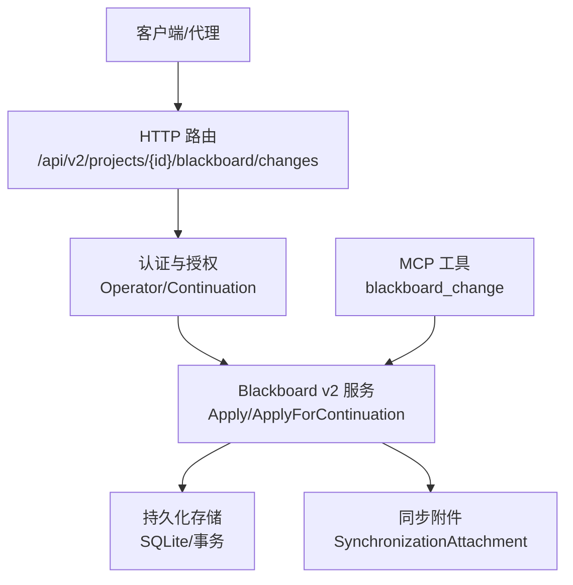
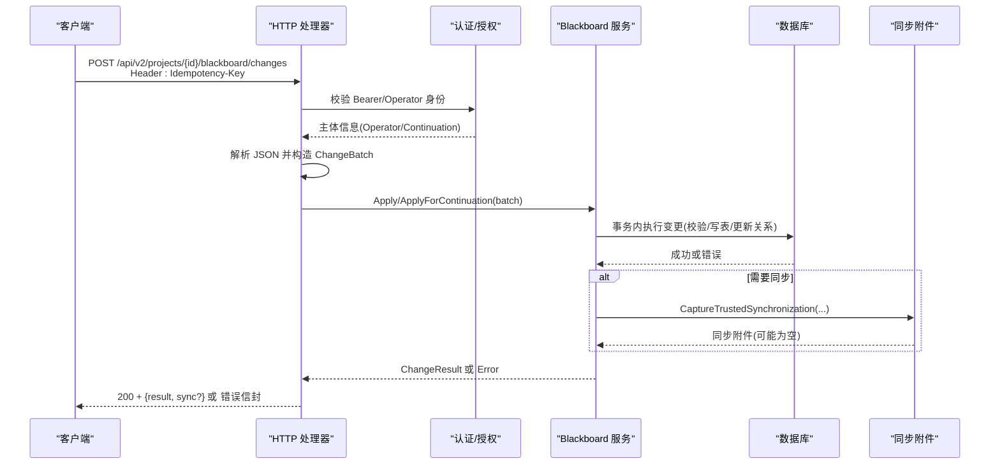
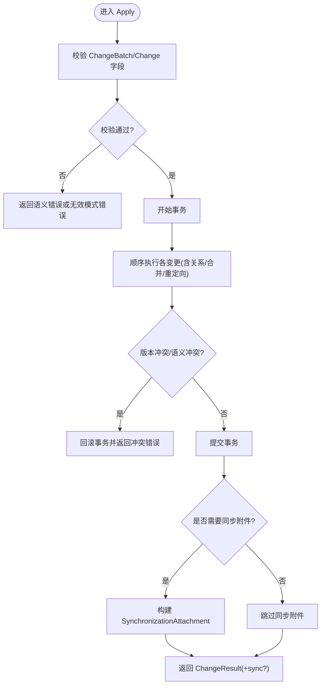
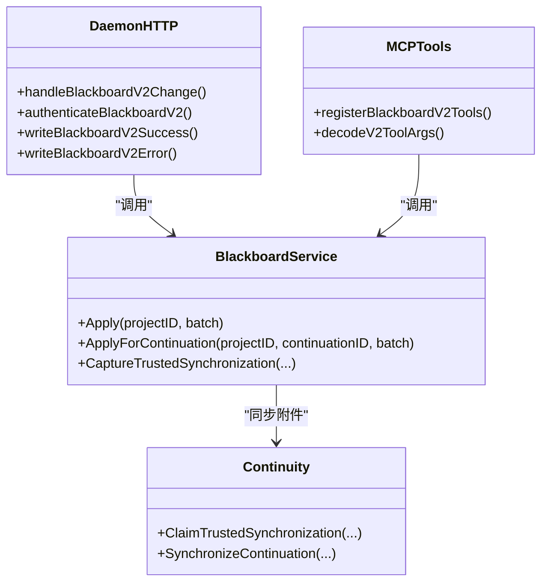

# blackboard_change工具

<cite>
**本文引用的文件**   
- [internal/daemon/blackboard_v2_http.go](file://internal/daemon/blackboard_v2_http.go)
- [internal/blackboardv2/service.go](file://internal/blackboardv2/service.go)
- [internal/mcpserver/v2.go](file://internal/mcpserver/v2.go)
- [internal/blackboardv2contract/contractdata/openapi.json](file://internal/blackboardv2contract/contractdata/openapi.json)
- [internal/blackboardv2/merge.go](file://internal/blackboardv2/merge.go)
- [internal/blackboardv2/continuity.go](file://internal/blackboardv2/continuity.go)
</cite>

## 目录
1. [简介](#简介)
2. [项目结构](#项目结构)
3. [核心组件](#核心组件)
4. [架构总览](#架构总览)
5. [详细组件分析](#详细组件分析)
6. [依赖关系分析](#依赖关系分析)
7. [性能与并发特性](#性能与并发特性)
8. [故障排除指南](#故障排除指南)
9. [结论](#结论)
10. [附录：HTTP API 参考](#附录http-api-参考)

## 简介
blackboard_change 是 Blackboard v2 的原子性语义变更工具，用于在单个事务中批量提交实体操作、关系管理、事实记录等语义变更。它通过幂等键（Idempotency-Key）保证重试安全，并通过 Continuation 机制实现跨进程/容器的同步通知与快照回发。该工具既可通过 HTTP 接口调用，也可作为 MCP 工具被受信任的运行时使用。

## 项目结构
- HTTP 层负责路由、鉴权、请求体解析、错误封装与响应头控制，并将请求委派给黑板服务。
- 黑板服务（Service）定义 ChangeBatch/Change 等数据结构与 Apply 原子应用逻辑，包含严格的字段校验、版本冲突检测、关系合并与重定向等。
- MCP 层将黑板能力暴露为受信任工具，复用同一套输入契约与服务接口。
- OpenAPI 契约冻结了 HTTP 接口的参数、请求体与响应结构，确保跨端一致性。

图表来源
- [internal/daemon/blackboard_v2_http.go:29-46](file://internal/daemon/blackboard_v2_http.go#L29-L46)
- [internal/blackboardv2/service.go:644-656](file://internal/blackboardv2/service.go#L644-L656)
- [internal/mcpserver/v2.go:71-84](file://internal/mcpserver/v2.go#L71-L84)

章节来源
- [internal/daemon/blackboard_v2_http.go:29-46](file://internal/daemon/blackboard_v2_http.go#L29-L46)
- [internal/blackboardv2/service.go:644-656](file://internal/blackboardv2/service.go#L644-L656)
- [internal/mcpserver/v2.go:71-84](file://internal/mcpserver/v2.go#L71-L84)
- [internal/blackboardv2contract/contractdata/openapi.json:16-100](file://internal/blackboardv2contract/contractdata/openapi.json#L16-L100)

## 核心组件
- ChangeBatch：语义变更批处理信封，包含 schema、幂等键与变更列表。
- Change：单项语义操作，支持 create/update/relate/unrelate/transition/supersede/merge 等。
- Service.Apply/ApplyForContinuation：原子应用变更，返回变更结果与受影响记录/关系版本。
- SynchronizationAttachment：可选同步附件，携带工作区快照与修订号，供下游消费。

章节来源
- [internal/blackboardv2/service.go:73-77](file://internal/blackboardv2/service.go#L73-L77)
- [internal/blackboardv2/service.go:122-147](file://internal/blackboardv2/service.go#L122-L147)
- [internal/blackboardv2/service.go:644-656](file://internal/blackboardv2/service.go#L644-L656)
- [internal/blackboardv2/continuity.go:102-108](file://internal/blackboardv2/continuity.go#L102-L108)

## 架构总览
blackboard_change 的端到端流程如下：

图表来源
- [internal/daemon/blackboard_v2_http.go:97-125](file://internal/daemon/blackboard_v2_http.go#L97-L125)
- [internal/blackboardv2/service.go:644-656](file://internal/blackboardv2/service.go#L644-L656)
- [internal/blackboardv2/continuity.go:327-389](file://internal/blackboardv2/continuity.go#L327-L389)

## 详细组件分析

### ChangeBatch 与 Change 结构
- ChangeBatch
  - schema：固定值，表示语义变更批次协议版本。
  - idempotency_key：必填且非空，用于幂等去重与精确重试。
  - changes：数组，每项为一条 Change。
- Change
  - op：必需，取值包括 create、update、relate、unrelate、transition、supersede、merge。
  - 其他字段按 op 不同而不同，例如 create 需要 key/type/record；relate 需要 from/relation/to/version/reason 等。
  - 每个 op 的允许字段集合在服务层严格校验，未知字段将被拒绝。

章节来源
- [internal/blackboardv2/service.go:73-77](file://internal/blackboardv2/service.go#L73-L77)
- [internal/blackboardv2/service.go:122-147](file://internal/blackboardv2/service.go#L122-L147)
- [internal/blackboardv2/service.go:149-232](file://internal/blackboardv2/service.go#L149-L232)

### 参数验证规则
- 信封级
  - schema 必须等于固定常量。
  - idempotency_key 必填且非空。
  - changes 必须为数组，不能为 null 或对象。
- 操作级
  - create：要求 key、type、record；record 类型需匹配 type。
  - update：要求 key、version、type、record/clear；仅允许对当前版本进行乐观更新。
  - relate/unrelate：要求 from/to/relation/version；部分关系类型需要 reason；禁止自链接；不可删除普通关系类型。
  - transition：要求 key、version、status 及可选摘要字段；终态字段组合受约束。
  - supersede：要求 replacement/replaced 及其版本；仅特定类型允许替换。
  - merge：要求 source/canonical 及其版本；源与规范键不得相同；源必须是可合并的知识类型；需满足相似性指纹一致；会迁移关系并创建 Key Redirect。
- 文本与长度限制
  - 语义文本存在长度上限，超出将触发语义校验错误。
  - 批量大小与单条变更均受限制，超限将整体回滚。

章节来源
- [internal/blackboardv2/service.go:79-120](file://internal/blackboardv2/service.go#L79-L120)
- [internal/blackboardv2/service.go:149-232](file://internal/blackboardv2/service.go#L149-L232)
- [internal/blackboardv2/merge.go:91-140](file://internal/blackboardv2/merge.go#L91-L140)
- [internal/blackboardv2/projection_service_test.go:94-102](file://internal/blackboardv2/projection_service_test.go#L94-L102)

### 事务边界与并发安全
- 原子性
  - Apply/ApplyForContinuation 在一个数据库事务内执行所有变更，全部成功或全部回滚。
- 乐观并发
  - 基于 version 的版本冲突检测，冲突时返回 version_conflict 错误，附带期望/当前版本与下一步建议。
- 幂等性
  - 以 idempotency_key 为键进行去重，重复提交返回相同结果，不产生副作用。
- 同步附件
  - 当存在 Pending 同步时，服务端会在响应中附加 SynchronizationAttachment，包含从上次确认到当前的工作区快照与修订号，供客户端拉取最新状态。

图表来源
- [internal/blackboardv2/service.go:644-656](file://internal/blackboardv2/service.go#L644-L656)
- [internal/blackboardv2/continuity.go:327-389](file://internal/blackboardv2/continuity.go#L327-L389)

章节来源
- [internal/blackboardv2/service.go:644-656](file://internal/blackboardv2/service.go#L644-L656)
- [internal/blackboardv2/continuity.go:327-389](file://internal/blackboardv2/continuity.go#L327-L389)

### 幂等性键（IdempotencyKey）与重试机制
- 传输层
  - HTTP 必须在请求头 Idempotency-Key 提供非空字符串。
  - 同一幂等键的重复请求会被识别并返回相同结果，不会再次写入。
- 同步重试
  - 对于带同步附件的请求，服务端会为“操作+幂等键”生成稳定指纹，用于精确的重试重放。
  - 若响应丢失但幂等键相同，后续重试可重新获得相同的同步附件与工作区快照。
- 客户端策略
  - 遇到 503/Retryable 错误应指数退避重试，并复用原幂等键。
  - 收到同步附件后，应在本地拉取并确认工作区快照，避免重复拉取。

章节来源
- [internal/daemon/blackboard_v2_http.go:465-471](file://internal/daemon/blackboard_v2_http.go#L465-L471)
- [internal/blackboardv2/continuity.go:207-219](file://internal/blackboardv2/continuity.go#L207-L219)
- [internal/blackboardv2/continuity.go:327-389](file://internal/blackboardv2/continuity.go#L327-L389)

### 与 Blackboard v2 服务集成最佳实践
- 使用 Operator 或 Continuation 两种身份：
  - Operator：由守护进程令牌认证，适合控制台/CLI。
  - Continuation：由运行时凭据绑定 Project/Task/Continuation，适合沙箱/代理。
- 始终携带 Idempotency-Key，并在网络不稳定场景下重试。
- 读取接口支持 ETag/If-None-Match，可减少带宽与压力。
- 处理同步附件：当响应包含 sync 字段时，优先拉取工作区快照，再继续业务逻辑。
- 遵循输入契约：严格遵循 OpenAPI 定义的字段与类型，避免未知字段导致 invalid_schema。

章节来源
- [internal/daemon/blackboard_v2_http.go:52-95](file://internal/daemon/blackboard_v2_http.go#L52-L95)
- [internal/daemon/blackboard_v2_http.go:375-438](file://internal/daemon/blackboard_v2_http.go#L375-L438)
- [internal/blackboardv2contract/contractdata/openapi.json:16-100](file://internal/blackboardv2contract/contractdata/openapi.json#L16-L100)

## 依赖关系分析
- HTTP 层依赖认证模块与黑板服务，负责错误映射与响应格式。
- 黑板服务依赖存储层与同步子系统，负责数据一致性与跨任务同步。
- MCP 层复用黑板服务，并以封闭的输入 Schema 进行强校验。

图表来源
- [internal/daemon/blackboard_v2_http.go:97-125](file://internal/daemon/blackboard_v2_http.go#L97-L125)
- [internal/blackboardv2/service.go:644-656](file://internal/blackboardv2/service.go#L644-L656)
- [internal/blackboardv2/continuity.go:327-389](file://internal/blackboardv2/continuity.go#L327-L389)
- [internal/mcpserver/v2.go:71-84](file://internal/mcpserver/v2.go#L71-L84)

章节来源
- [internal/daemon/blackboard_v2_http.go:97-125](file://internal/daemon/blackboard_v2_http.go#L97-L125)
- [internal/blackboardv2/service.go:644-656](file://internal/blackboardv2/service.go#L644-L656)
- [internal/mcpserver/v2.go:71-84](file://internal/mcpserver/v2.go#L71-L84)

## 性能与并发特性
- 事务粒度：整个批次在一个事务内完成，减少锁竞争与中间状态可见性。
- 乐观并发：基于版本的冲突检测，避免长时间持有写锁。
- 同步附件：仅在必要时附加，避免无谓的数据拷贝。
- 输入限制：请求体上限与字段长度限制防止资源耗尽。

[本节为通用指导，无需具体文件引用]

## 故障排除指南
- 常见错误码与含义
  - invalid_schema：请求体或字段不符合契约，检查 schema、字段名与类型。
  - authority_denied：认证失败或权限不足，检查 Bearer Token 或 Operator 配置。
  - not_found：目标记录不存在，检查 key 是否正确。
  - version_conflict：并发修改导致版本不一致，读取当前记录后重试。
  - semantic_validation：语义校验失败，如关系方向错误、文本超长、终态字段混用等。
  - storage_busy：底层存储忙，等待并重试。
  - internal：内部错误，查看服务端日志。
- 诊断步骤
  - 确认 Idempotency-Key 是否唯一且非空。
  - 检查 changes 数组中的每个 op 与其字段组合是否符合契约。
  - 关注错误路径（path），定位具体字段。
  - 若出现同步附件，先拉取工作区快照，再重试业务逻辑。

章节来源
- [internal/daemon/blackboard_v2_http.go:539-584](file://internal/daemon/blackboard_v2_http.go#L539-L584)
- [internal/daemon/blackboard_v2_http.go:612-642](file://internal/daemon/blackboard_v2_http.go#L612-L642)

## 结论
blackboard_change 提供了面向语义的黑板原子变更能力，具备严格的输入契约、幂等重试与跨任务同步机制。通过 HTTP 与 MCP 双通道接入，既能服务于控制台与 CLI，也能支撑受信任的运行时环境。遵循本文的最佳实践与排障指引，可在高并发与不稳定网络环境下稳定使用。

[本节为总结，无需具体文件引用]

## 附录：HTTP API 参考

- 端点
  - POST /api/v2/projects/{project_id}/blackboard/changes

- 请求头
  - Authorization：Bearer token（Continuation 或 Operator）
  - Idempotency-Key：必填，非空字符串

- 请求体（application/json）
  - schema：固定值
  - changes：数组，每项为 Change

- 成功响应（200）
  - 结构：{ result, sync? }
  - result：ChangeResult，包含 revision、records、relations、working_snapshot
  - sync：可选的 SynchronizationAttachment，包含 reason、from_revision、revision、snapshot

- 错误响应（4xx/5xx）
  - 结构：{ error, sync? }
  - error：包含 code、message、path、retryable、details
  - 常见 code：invalid_schema、authority_denied、not_found、version_conflict、semantic_validation、storage_busy、internal

- 示例（成功）
  - 请求
    - 方法：POST
    - 路径：/api/v2/projects/{project_id}/blackboard/changes
    - 头部：Authorization: Bearer <token>；Idempotency-Key: <unique-key>
    - 主体：
      - schema: "semantic-change-batch/v2"
      - changes: [
          { op: "create", key: "entity:example", type: "entity", record: { status: "active", kind: "endpoint", name: "Example Endpoint", scope_status: "in_scope" } },
          { op: "relate", from: "fact:asset-a", relation: "about", to: "entity:example", version: 1 }
        ]
  - 响应（200）
    - {
        "schema": "semantic-change-result/v2",
        "revision": 123,
        "records": [["entity:example", 1]],
        "relations": [["fact:asset-a", "about", "entity:example", 1]],
        "working_snapshot": { "path": ".pentest/blackboard.json", "revision": 123 }
      }

- 示例（错误）
  - 请求同上，但 changes 中包含未知字段或非法组合
  - 响应（422）
    - {
        "error": {
          "code": "semantic_validation",
          "message": "...",
          "path": "changes[0].record.unknown_field",
          "retryable": false
        }
      }

章节来源
- [internal/blackboardv2contract/contractdata/openapi.json:16-100](file://internal/blackboardv2contract/contractdata/openapi.json#L16-L100)
- [internal/daemon/blackboard_v2_http.go:97-125](file://internal/daemon/blackboard_v2_http.go#L97-L125)
- [internal/daemon/blackboard_v2_http.go:495-562](file://internal/daemon/blackboard_v2_http.go#L495-L562)