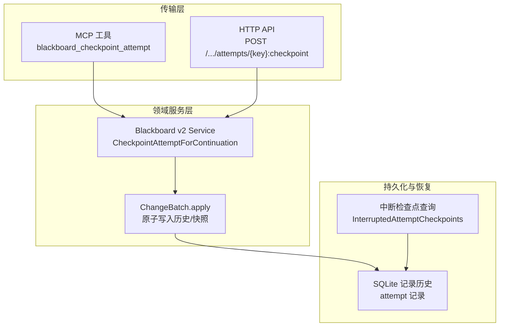
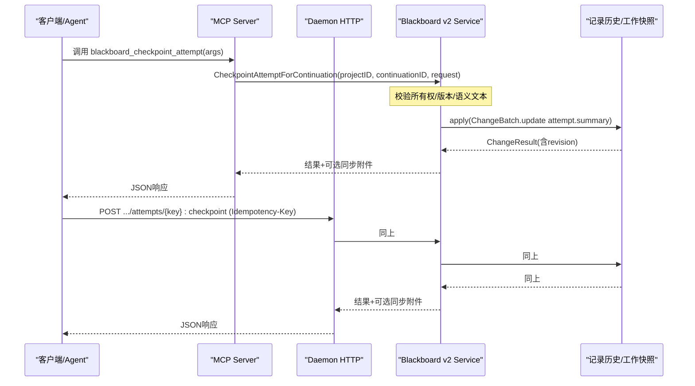
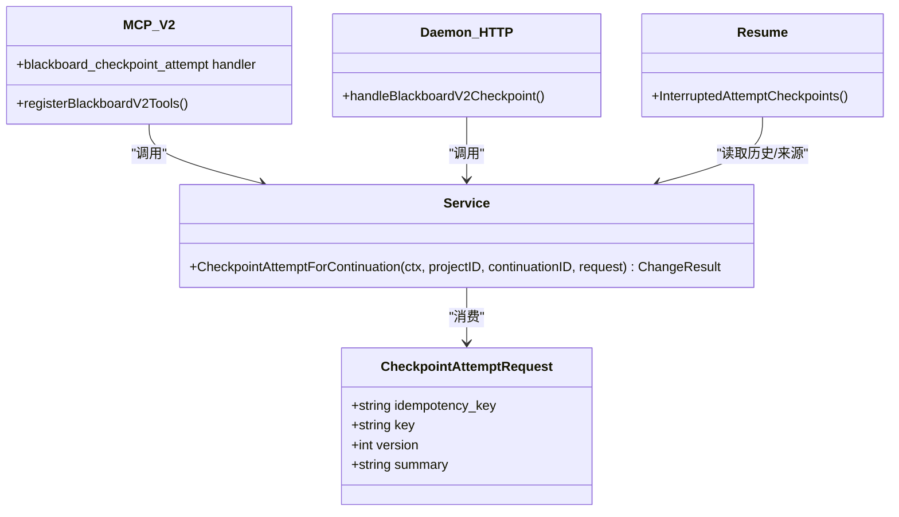
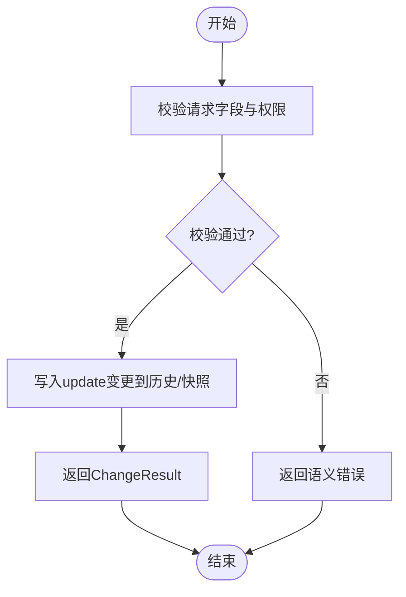

# blackboard_checkpoint_attempt工具

<cite>
**本文引用的文件**   
- [checkpoint.go](file://internal/blackboardv2/checkpoint.go)
- [v2.go](file://internal/mcpserver/v2.go)
- [blackboard_v2_http.go](file://internal/daemon/blackboard_v2_http.go)
- [resume.go](file://internal/blackboardv2/resume.go)
- [checkpoint_service_test.go](file://internal/blackboardv2/checkpoint_service_test.go)
- [v2_test.go](file://internal/mcpserver/v2_test.go)
</cite>

## 目录
1. [简介](#简介)
2. [项目结构](#项目结构)
3. [核心组件](#核心组件)
4. [架构总览](#架构总览)
5. [详细组件分析](#详细组件分析)
6. [依赖关系分析](#依赖关系分析)
7. [性能与一致性](#性能与一致性)
8. [故障排查指南](#故障排查指南)
9. [结论](#结论)
10. [附录：API定义与示例](#附录api定义与示例)

## 简介
blackboard_checkpoint_attempt 是 Blackboard v2 语义系统中的一个受信任工具，用于为当前“尝试（Attempt）”创建检查点。它仅更新 Attempt 的紧凑摘要（summary），不携带原始输出、溯源或拥有者等敏感上下文；这些字段被严格排除在契约之外。该工具支持幂等重放、版本冲突检测、以及基于 Continuation 的强所有权校验，确保在多进程/多会话并发场景下的安全与一致性。

## 项目结构
本工具涉及三层：
- 领域服务层：定义请求结构与业务处理逻辑
- 传输适配层：MCP 工具与 HTTP API 将外部调用映射到领域服务
- 恢复与持久化：中断后的检查点读取与最终状态回填

图表来源
- [v2.go:126-137](file://internal/mcpserver/v2.go#L126-L137)
- [blackboard_v2_http.go:238-268](file://internal/daemon/blackboard_v2_http.go#L238-L268)
- [checkpoint.go:68-98](file://internal/blackboardv2/checkpoint.go#L68-L98)
- [resume.go:21-81](file://internal/blackboardv2/resume.go#L21-L81)

章节来源
- [checkpoint.go:1-99](file://internal/blackboardv2/checkpoint.go#L1-L99)
- [v2.go:1-316](file://internal/mcpserver/v2.go#L1-L316)
- [blackboard_v2_http.go:1-643](file://internal/daemon/blackboard_v2_http.go#L1-L643)
- [resume.go:1-81](file://internal/blackboardv2/resume.go#L1-L81)

## 核心组件
- CheckpointAttemptRequest：检查点请求的封闭数据结构，仅包含 idempotency_key、key、version、summary 四个字段，拒绝任何额外字段。
- CheckpointAttemptForContinuation：领域方法，负责校验所有权、版本、语义文本长度与编码，并将一次 update 操作以 ChangeBatch 形式提交至工作快照与历史记录。
- MCP 工具注册：将黑盒参数按冻结契约进行校验并路由到领域服务。
- HTTP 路由：解析路径中的 :checkpoint 动作，提取 key，组装请求并进入相同的服务流程。
- 中断检查点恢复：提供对已中断且已完成数据对齐的 Continuation 的最终真实摘要的只读访问，供上层编排使用。

章节来源
- [checkpoint.go:10-98](file://internal/blackboardv2/checkpoint.go#L10-L98)
- [v2.go:126-137](file://internal/mcpserver/v2.go#L126-L137)
- [blackboard_v2_http.go:238-268](file://internal/daemon/blackboard_v2_http.go#L238-L268)
- [resume.go:10-81](file://internal/blackboardv2/resume.go#L10-L81)

## 架构总览
从客户端到存储的完整调用链如下：

图表来源
- [v2.go:126-137](file://internal/mcpserver/v2.go#L126-L137)
- [blackboard_v2_http.go:238-268](file://internal/daemon/blackboard_v2_http.go#L238-L268)
- [checkpoint.go:68-98](file://internal/blackboardv2/checkpoint.go#L68-L98)

## 详细组件分析

### 请求结构与约束
- 字段
  - idempotency_key：幂等键，必填
  - key：目标 Attempt 的键，必填，需通过键校验
  - version：版本号，必填且为正整数
  - summary：紧凑摘要，必填，最大字节数限制与UTF-8合法性校验
- 未知字段拒绝：反序列化时若出现非白名单字段直接报错，防止泄露或注入敏感上下文

章节来源
- [checkpoint.go:10-66](file://internal/blackboardv2/checkpoint.go#L10-L66)

### 权限与所有权
- 仅允许由“拥有者”的活跃（open）Attempt 的所有者 Continuation 发起
- 跨项目、跨任务或非拥有者的 Continuation 将被拒绝
- 当目标 Attempt 已进入终态（如 failed/succeeded），再次检查点会返回未找到错误；但相同幂等键的重放仍返回一致结果

章节来源
- [checkpoint.go:71-98](file://internal/blackboardv2/checkpoint.go#L71-L98)
- [checkpoint_service_test.go:176-219](file://internal/blackboardv2/checkpoint_service_test.go#L176-L219)

### 幂等性与重放
- 相同 idempotency_key 的请求会被精确重放，返回完全一致的 ChangeResult
- 变更内容不同则视为幂等冲突
- 即使 Continuation 关闭，只要幂等键一致，仍可得到与首次成功相同的响应

章节来源
- [checkpoint_service_test.go:18-81](file://internal/blackboardv2/checkpoint_service_test.go#L18-L81)
- [checkpoint_service_test.go:193-219](file://internal/blackboardv2/checkpoint_service_test.go#L193-L219)

### 版本管理与一致性
- 每次检查点以 update 操作写入 Attempt 的历史，version 必须递增
- 版本冲突（stale version）会返回版本冲突错误
- 所有变更共享统一的原子历史与工作快照事务，保证可见性一致

章节来源
- [checkpoint.go:87-98](file://internal/blackboardv2/checkpoint.go#L87-L98)
- [checkpoint_service_test.go:136-141](file://internal/blackboardv2/checkpoint_service_test.go#L136-L141)

### 语义文本边界
- summary 支持最大 1024 字节的 UTF-8 文本，超过或非法 UTF-8 将被拒绝
- 测试覆盖了边界值与非法输入

章节来源
- [checkpoint_service_test.go:142-175](file://internal/blackboardv2/checkpoint_service_test.go#L142-L175)

### 传输适配层

#### MCP 工具
- 名称：blackboard_checkpoint_attempt
- 参数：按冻结契约校验后解码为 CheckpointAttemptRequest
- 行为：生成同步指纹，必要时声明 Pending 同步，随后调用领域服务

章节来源
- [v2.go:126-137](file://internal/mcpserver/v2.go#L126-L137)

#### HTTP API
- 路径：POST /api/v2/projects/{id}/blackboard/attempts/{key}:checkpoint
- 头部：Idempotency-Key 必填
- 主体：{ version, summary }
- 行为：解析 :checkpoint 后缀，构造请求并进入统一服务流程

章节来源
- [blackboard_v2_http.go:238-268](file://internal/daemon/blackboard_v2_http.go#L238-L268)

### 恢复与生命周期管理
- 中断检查点查询：在 Continuation 处于中断/失败/停止且数据对齐完成后，可读取其拥有的 open Attempt 的最终真实摘要列表（最多固定数量）
- 用途：上层编排可在重启后基于这些摘要继续推进或重建工作流

章节来源
- [resume.go:10-81](file://internal/blackboardv2/resume.go#L10-L81)

## 依赖关系分析

图表来源
- [checkpoint.go:10-98](file://internal/blackboardv2/checkpoint.go#L10-L98)
- [v2.go:126-137](file://internal/mcpserver/v2.go#L126-L137)
- [blackboard_v2_http.go:238-268](file://internal/daemon/blackboard_v2_http.go#L238-L268)
- [resume.go:21-81](file://internal/blackboardv2/resume.go#L21-L81)

## 性能与一致性
- 原子性：检查点作为单次 update 变更，纳入统一的事务与 Working Snapshot，避免部分写入
- 幂等性：基于 idempotency_key 的精确重放，降低网络抖动带来的重复写入风险
- 版本控制：强制递增 version，避免覆盖与乱序
- 并发收敛：与意外终止（interrupted）回调存在竞态时，测试验证不会产生重复的终态记录，且不会导致版本重复
- 同步附件：在需要时可附带同步信息，保障跨进程/跨实例的一致性回放

章节来源
- [checkpoint.go:68-98](file://internal/blackboardv2/checkpoint.go#L68-L98)
- [checkpoint_service_test.go:280-331](file://internal/blackboardv2/checkpoint_service_test.go#L280-L331)

## 故障排查指南
- 常见错误码与含义
  - authority_denied：非拥有者或跨项目/任务调用
  - semantic_validation：缺少必填字段、version 非正整数、summary 超长或非法 UTF-8
  - version_conflict：提交的 version 小于等于当前最新版本
  - not_found：目标 Attempt 已处于终态
  - closed_continuation：所属 Continuation 已关闭
  - idempotency_conflict：相同幂等键但请求体不一致
- 定位建议
  - 确认 Idempotency-Key 是否稳定且唯一
  - 核对 key 是否为当前 Continuation 所持有的 open Attempt
  - 检查 version 是否严格递增
  - 查看 history 中最近一条记录的 status 与 summary，确认是否已被终态化
  - 若为 HTTP 调用，确认请求头 Idempotency-Key 是否存在

章节来源
- [checkpoint_service_test.go:83-219](file://internal/blackboardv2/checkpoint_service_test.go#L83-L219)
- [blackboard_v2_http.go:564-642](file://internal/daemon/blackboard_v2_http.go#L564-L642)

## 结论
blackboard_checkpoint_attempt 提供了轻量、安全、幂等的检查点能力，专注于保存 Attempt 的紧凑摘要，并通过严格的契约与所有权模型保障并发安全与一致性。结合中断检查点查询与同步附件机制，可在异常恢复与跨实例协作场景中发挥关键作用。

## 附录：API定义与示例

### 请求结构
- 类型：CheckpointAttemptRequest
- 字段
  - idempotency_key：字符串，必填
  - key：字符串，必填，目标 Attempt 键
  - version：整数，必填，正整数
  - summary：字符串，必填，最大 1024 字节 UTF-8

章节来源
- [checkpoint.go:10-66](file://internal/blackboardv2/checkpoint.go#L10-L66)

### MCP 工具示例
- 工具名：blackboard_checkpoint_attempt
- 参数：按上述结构传入
- 行为：成功后返回 ChangeResult，可能附带同步附件

章节来源
- [v2.go:126-137](file://internal/mcpserver/v2.go#L126-L137)
- [v2_test.go:402-425](file://internal/mcpserver/v2_test.go#L402-L425)

### HTTP API 示例
- 方法：POST
- 路径：/api/v2/projects/{id}/blackboard/attempts/{key}:checkpoint
- 头部：Idempotency-Key
- 主体：{ version, summary }
- 成功响应：包含 schema 为 change result 的 JSON，可能附带 sync 附件

章节来源
- [blackboard_v2_http.go:238-268](file://internal/daemon/blackboard_v2_http.go#L238-L268)
- [blackboard_v2_http_test.go:95-113](file://internal/daemon/blackboard_v2_http_test.go#L95-L113)

### 检查点创建与恢复流程示例（概念图）

[此图为概念流程图，无需源码引用]

### 最佳实践
- 幂等键策略：为每次检查点生成稳定的幂等键，避免重复写入
- 版本递增：维护本地版本计数器，遇到版本冲突时拉取最新历史再重试
- 摘要大小：控制在 1024 字节以内，避免截断或拒绝
- 生命周期：在 Attempt 终态前完成必要检查点；终态后仅支持幂等重放
- 清理与保留：利用中断检查点查询接口获取最终真实摘要，用于后续编排；长期保留历史以满足审计与回溯需求

章节来源
- [resume.go:10-81](file://internal/blackboardv2/resume.go#L10-L81)
- [checkpoint_service_test.go:221-278](file://internal/blackboardv2/checkpoint_service_test.go#L221-L278)