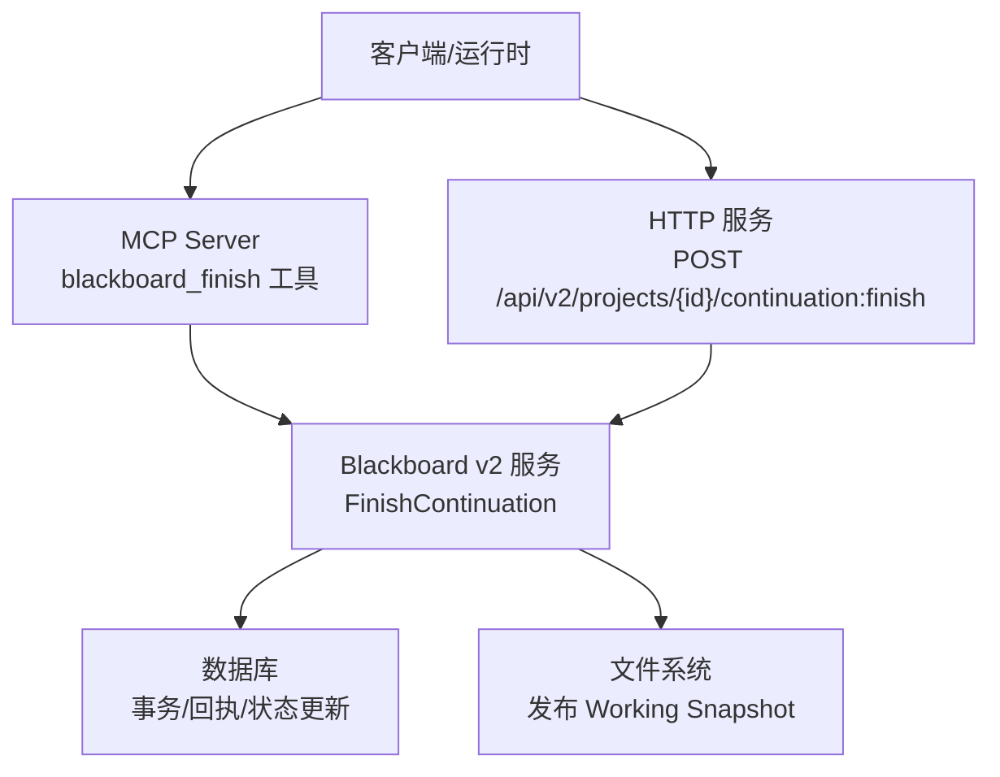
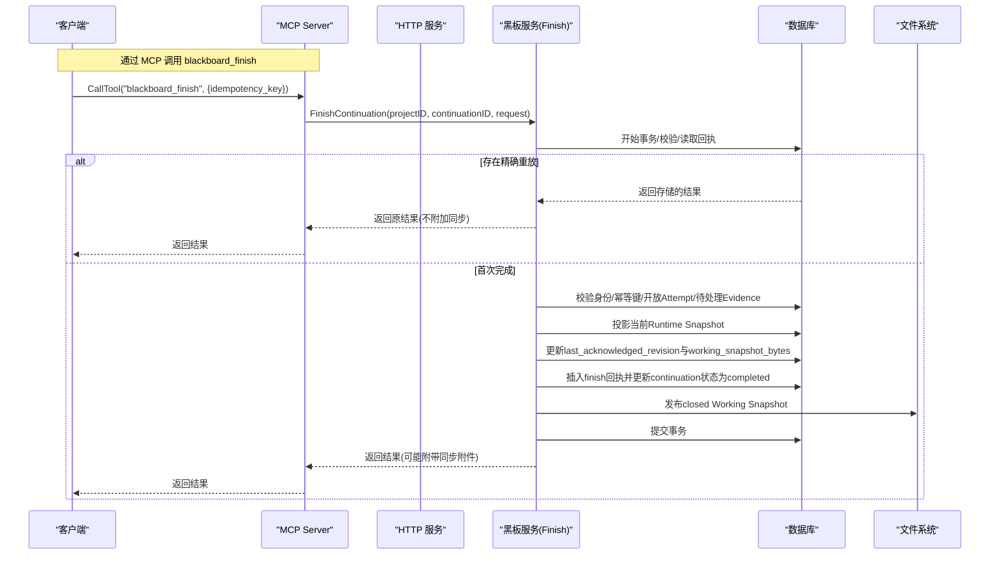
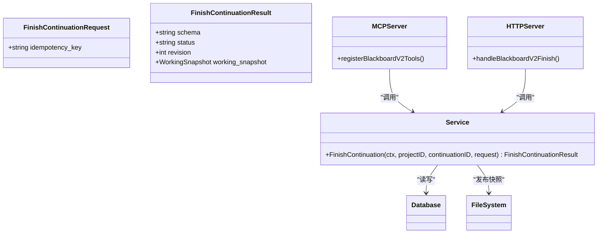
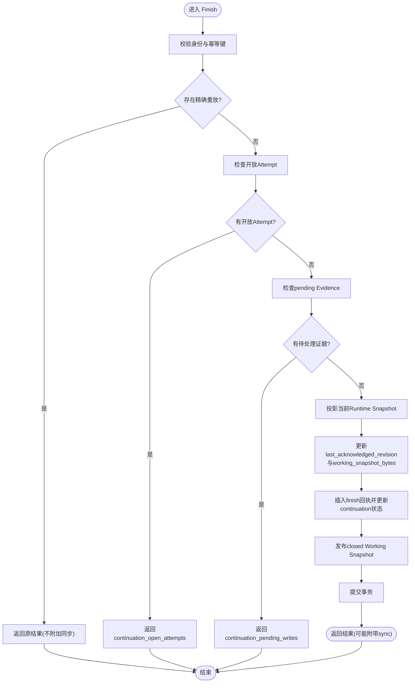

# blackboard_finish工具

<cite>
**本文引用的文件**   
- [finish.go](file://internal/blackboardv2/finish.go)
- [v2.go](file://internal/mcpserver/v2.go)
- [blackboard_v2_http.go](file://internal/daemon/blackboard_v2_http.go)
- [blackboard-runtime-protocol.md](file://docs/specs/blackboard-runtime-protocol.md)
- [blackboard-v2-spec.md](file://docs/specs/blackboard-v2-spec.md)
- [finish_service_test.go](file://internal/blackboardv2/finish_service_test.go)
</cite>

## 目录
1. [简介](#简介)
2. [项目结构](#项目结构)
3. [核心组件](#核心组件)
4. [架构总览](#架构总览)
5. [详细组件分析](#详细组件分析)
6. [依赖关系分析](#依赖关系分析)
7. [性能与一致性特性](#性能与一致性特性)
8. [故障排查指南](#故障排查指南)
9. [结论](#结论)
10. [附录：API定义与示例](#附录api定义与示例)

## 简介
blackboard_finish 是 Blackboard v2 语义系统的“完成会话”工具，用于在单个 Continuation（延续）生命周期结束时进行最终同步与状态清理。它确保：
- 幂等性：相同 idempotency_key 的精确重放返回原结果；不同语义使用同一 key 会冲突。
- 原子性：在同一事务中校验、关闭写权限、记录回执并持久化当前 Working Snapshot。
- 同步能力：支持将未决的同步附件（如证据保留、检查点）在一次 Finish 中合并交付。
- 安全边界：仅允许受信任的 Continuation 身份调用，拒绝后续写入。

该文档面向使用者与维护者，提供从 API 到实现细节的系统说明，并给出最佳实践与故障恢复建议。

## 项目结构
blackboard_finish 涉及三层：
- MCP 工具层：注册 blackboard_finish 工具，解析参数，绑定身份与同步指纹。
- HTTP 服务层：暴露 /continuation:finish 路由，校验请求体为空，透传 Idempotency-Key。
- 领域服务层：FinishContinuation 实现幂等、校验、同步、关闭与快照发布。

图表来源
- [v2.go:138-151](file://internal/mcpserver/v2.go#L138-L151)
- [blackboard_v2_http.go:330-366](file://internal/daemon/blackboard_v2_http.go#L330-L366)
- [finish.go:65-228](file://internal/blackboardv2/finish.go#L65-L228)

章节来源
- [v2.go:138-151](file://internal/mcpserver/v2.go#L138-L151)
- [blackboard_v2_http.go:330-366](file://internal/daemon/blackboard_v2_http.go#L330-L366)
- [finish.go:65-228](file://internal/blackboardv2/finish.go#L65-L228)

## 核心组件
- FinishContinuationRequest：完成请求的唯一输入字段为 idempotency_key，禁止携带其他字段。
- FinishContinuationResult：成功响应包含 schema、status、revision 以及 working_snapshot（指向已确认的 .pentest/blackboard.json 及其 revision）。
- Finish 流程：校验身份与幂等键、检查无开放 Attempt、投影当前 Runtime Snapshot、更新工作区、落盘快照、提交事务。

章节来源
- [finish.go:29-61](file://internal/blackboardv2/finish.go#L29-L61)
- [finish.go:65-228](file://internal/blackboardv2/finish.go#L65-L228)

## 架构总览
Finish 操作在三个层面协作：
- MCP 工具：通过 callV2WithFingerprint 将 finish 的同步指纹与请求绑定，保证重试时能重投递同步附件。
- HTTP 路由：要求 Idempotency-Key 头，且请求体必须为空或空对象。
- 领域服务：以事务为单位执行幂等校验、同步、关闭与快照发布。

图表来源
- [v2.go:138-151](file://internal/mcpserver/v2.go#L138-L151)
- [blackboard_v2_http.go:330-366](file://internal/daemon/blackboard_v2_http.go#L330-L366)
- [finish.go:65-228](file://internal/blackboardv2/finish.go#L65-L228)

## 详细组件分析

### FinishContinuationRequest 与 FinishContinuationResult
- 请求结构
  - 字段：idempotency_key（必填，非空字符串）
  - 约束：禁止未知字段；JSON 反序列化严格校验
- 结果结构
  - schema：固定为 "continuation-finish/v2"
  - status：固定为 "finished"
  - revision：当前图版本
  - working_snapshot：包含 path=".pentest/blackboard.json" 与 revision=当前图版本

章节来源
- [finish.go:29-61](file://internal/blackboardv2/finish.go#L29-L61)
- [blackboard-v2-spec.md:272](file://docs/specs/blackboard-v2-spec.md#L272)

### Finish 前置条件与原子效果
- 身份与权限：必须由受信任的 Continuation 发起，且拥有对应 Project 接口。
- 幂等键：相同 key 且相同请求哈希返回原结果；不同语义则冲突。
- 会话状态：当前 Continuation 必须可写且仍持有 Task Working Snapshot。
- 开放尝试：所有由当前 Continuation 创建的 Attempt 必须已终态，否则返回错误并要求先终结。
- 待处理证据：若有 pending Evidence 写入，需先完成再 Finish。
- 同步投影：在事务内投影当前 Runtime Snapshot，更新 last_acknowledged_revision 与 working_snapshot_bytes。
- 回执与关闭：插入 finish 回执，更新 task_continuations 状态为 completed，并设置 reconciliation 标记。
- 快照发布：在提交前发布 closed Working Snapshot 到文件系统。

章节来源
- [finish.go:65-228](file://internal/blackboardv2/finish.go#L65-L228)
- [blackboard-runtime-protocol.md:463-518](file://docs/specs/blackboard-runtime-protocol.md#L463-L518)

### 幂等性与重放机制
- 精确重放：相同 idempotency_key 与相同请求哈希返回原始结果，且不重新附加同步或重建快照。
- 冲突检测：相同 key 但不同语义的请求返回 finish_conflict。
- 所有权绑定：幂等回执按 project_id + idempotency_key 唯一，跨主体或跨项目重放会被拒绝。
- 重启恢复：进程重启后仍可精确重放，保证幂等。

章节来源
- [finish.go:100-136](file://internal/blackboardv2/finish.go#L100-L136)
- [finish_service_test.go:114-131](file://internal/blackboardv2/finish_service_test.go#L114-L131)

### 同步与异步处理
- 同步指纹：MCP/HTTP 层基于路径与 Idempotency-Key 生成同步指纹，使 Finish 可与 change/evidence/checkpoint 的未决同步关联。
- 预认领：在处理动作前，若存在 Pending 同步，先 ClaimTrustedSynchronization 避免并发重复投递。
- 捕获附件：无论成功或失败，均可捕获同步附件并在响应中附带，供客户端重试重投递。

章节来源
- [v2.go:198-248](file://internal/mcpserver/v2.go#L198-L248)
- [blackboard_v2_http.go:400-438](file://internal/daemon/blackboard_v2_http.go#L400-L438)

### 资源清理与审计日志策略
- 资源清理
  - 关闭写权限：Finish 成功后，同一 Continuation 的所有后续写入均被拒绝（closed_continuation）。
  - 工作区快照：发布 closed Working Snapshot 到 .pentest/blackboard.json，供外部消费。
- 审计日志
  - 事务内记录 finish 回执（含请求哈希、结果 JSON、时间戳），可用于审计与重放。
  - 任务级状态更新包含 finished_at 与 reconciliation 标记，便于追踪。

章节来源
- [finish.go:192-228](file://internal/blackboardv2/finish.go#L192-L228)
- [finish_service_test.go:261-294](file://internal/blackboardv2/finish_service_test.go#L261-L294)

### 完整示例：处理异步同步与错误恢复
- 典型流程
  1) 准备：确保所有 Attempt 已终态，Pending Evidence 已完成。
  2) 调用：携带 Idempotency-Key 调用 blackboard_finish。
  3) 同步：若响应包含 sync 附件，客户端应将其作为下一次变更的一部分重投递。
  4) 幂等：若网络丢失响应，使用相同 key 重试，服务端将返回原结果。
  5) 错误处理：遇到 finish_conflict 表示语义变化，需调整请求；遇到 storage_busy 则等待并重试。
- 参考测试用例
  - 精确重放与冲突检测
  - 与证据保留的原子竞争
  - 与写入竞态的最终一致性

章节来源
- [finish_service_test.go:60-131](file://internal/blackboardv2/finish_service_test.go#L60-L131)
- [finish_service_test.go:438-525](file://internal/blackboardv2/finish_service_test.go#L438-L525)
- [finish_service_test.go:327-369](file://internal/blackboardv2/finish_service_test.go#L327-L369)

## 依赖关系分析
- 组件耦合
  - MCP 工具依赖黑板服务与授权上下文，负责参数校验与同步指纹。
  - HTTP 服务负责认证、限流与错误映射，透传 Idempotency-Key。
  - 领域服务依赖数据库与文件系统，完成幂等、同步、关闭与快照发布。
- 外部依赖
  - 数据库：SQLite（事务、回执、状态表）
  - 文件系统：发布 Working Snapshot 到 workdir/.pentest/blackboard.json

图表来源
- [finish.go:29-61](file://internal/blackboardv2/finish.go#L29-L61)
- [v2.go:138-151](file://internal/mcpserver/v2.go#L138-L151)
- [blackboard_v2_http.go:330-366](file://internal/daemon/blackboard_v2_http.go#L330-L366)

章节来源
- [finish.go:29-61](file://internal/blackboardv2/finish.go#L29-L61)
- [v2.go:138-151](file://internal/mcpserver/v2.go#L138-L151)
- [blackboard_v2_http.go:330-366](file://internal/daemon/blackboard_v2_http.go#L330-L366)

## 性能与一致性特性
- 事务串行化：Finish 与 Apply 通过 BEGIN IMMEDIATE 与写锁串行，确保只有一个赢家。
- 快照投影：在事务内投影当前 Runtime Snapshot，避免陈旧数据覆盖。
- 幂等开销：精确重放直接返回存储结果，避免重复 I/O。
- 并发控制：对 open Attempts 与 pending Evidence 的检查减少无效重试。

章节来源
- [finish.go:72-76](file://internal/blackboardv2/finish.go#L72-L76)
- [finish.go:171-183](file://internal/blackboardv2/finish.go#L171-L183)
- [finish_service_test.go:327-369](file://internal/blackboardv2/finish_service_test.go#L327-L369)

## 故障排查指南
- 常见错误码与含义
  - authority_denied：身份或权限不足，或幂等回执归属不同主体。
  - semantic_validation：缺少或非法 idempotency_key。
  - continuation_open_attempts：存在未终态 Attempt，需先终结。
  - continuation_pending_writes：有待处理的 Evidence 写入，需先完成。
  - finish_conflict：相同 key 但不同语义的请求。
  - closed_continuation：会话已关闭，拒绝新写入。
  - storage_busy：数据库忙，需等待并重试。
- 定位步骤
  - 检查 Idempotency-Key 是否一致且非空。
  - 确认所有 Attempt 已终态，无 pending Evidence。
  - 查看 finish 回执是否存在及是否与当前会话匹配。
  - 观察 Working Snapshot 是否已发布到磁盘。
- 恢复策略
  - 幂等重试：保持相同 key 重试，直到获得稳定结果。
  - 错误分类：根据错误码决定是修正请求、终结 Attempt、完成证据还是等待重试。

章节来源
- [finish.go:65-228](file://internal/blackboardv2/finish.go#L65-L228)
- [blackboard_v2_http.go:539-584](file://internal/daemon/blackboard_v2_http.go#L539-L584)
- [finish_service_test.go:22-58](file://internal/blackboardv2/finish_service_test.go#L22-L58)

## 结论
blackboard_finish 提供了可靠的会话完成机制，结合幂等、原子事务与同步附件，确保在复杂并发环境下的一致性与可恢复性。遵循最佳实践（正确设置幂等键、先终结 Attempt、完成证据、处理同步附件）可获得稳定的完成体验。

## 附录：API定义与示例

### HTTP 接口
- 方法：POST
- 路径：/api/v2/projects/{project_id}/continuation:finish
- 必需头：Idempotency-Key
- 请求体：空或 {}
- 成功响应：包含 schema、status、revision、working_snapshot，可选 sync 附件
- 错误响应：统一 envelope，包含 error 与可选 sync

章节来源
- [blackboard_v2_http.go:330-366](file://internal/daemon/blackboard_v2_http.go#L330-L366)
- [blackboard_v2_http.go:495-562](file://internal/daemon/blackboard_v2_http.go#L495-L562)

### MCP 工具
- 工具名：blackboard_finish
- 输入：{ idempotency_key: string }
- 行为：与 HTTP 等价，自动绑定同步指纹与续接同步附件

章节来源
- [v2.go:138-151](file://internal/mcpserver/v2.go#L138-L151)

### 数据结构
- FinishContinuationRequest
  - idempotency_key：必填，非空字符串
- FinishContinuationResult
  - schema："continuation-finish/v2"
  - status："finished"
  - revision：整数
  - working_snapshot：{ path:".pentest/blackboard.json", revision:整数 }

章节来源
- [finish.go:29-61](file://internal/blackboardv2/finish.go#L29-L61)

### 流程图：Finish 主流程

图表来源
- [finish.go:65-228](file://internal/blackboardv2/finish.go#L65-L228)